# Omega Stack Architecture Overview

**Created by:** Cline Kat-Coder  
**Session:** Chat Session #20260311-1545  
**Date:** March 11, 2026  
**Version:** 1.0  
**Quality Assessment:** ✅ Comprehensive - Complete system architecture documentation with Mermaid diagrams

## System Overview

The Omega Stack is a sophisticated multi-agent AI system designed for local AI inference, agent coordination, and community-driven development. This document provides a comprehensive overview of the system architecture, components, and integration patterns.

## Core Architecture Principles

### 1. Multi-Agent Orchestration
- **Agent Bus**: Central communication hub for inter-agent messaging
- **Domain Routing**: Intelligent task routing based on domain expertise
- **Account Management**: Multi-provider account rotation and quota management
- **Context Synchronization**: Shared context across agent interactions

### 2. Multi-Provider Support
- **Antigravity**: Primary provider with 4M tokens/week across 8 accounts
- **Cline**: Native IDE integration with local inference capabilities
- **Copilot**: GitHub integration for code-related tasks
- **OpenCode**: General-purpose provider with OAuth authentication

### 3. Persistent Memory Systems
- **Short-term Memory**: Durable checkpoints for session state
- **Long-term Memory**: Fact extraction and knowledge storage
- **Procedural Memory**: Winning plans and strategies
- **Entity Management**: Persistent agent and user entities

### 4. Community-First Design
- **Modular Architecture**: Easy to extend and customize
- **Open Documentation**: Comprehensive guides and examples
- **Contribution Guidelines**: Clear path for community involvement
- **Plugin System**: Extensible functionality through plugins

## System Components

### Core Infrastructure

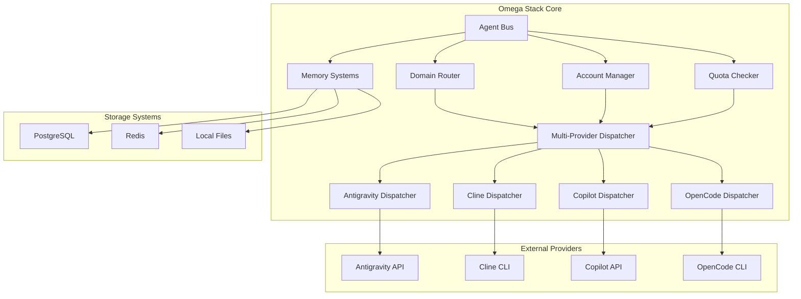

### Agent Communication Flow

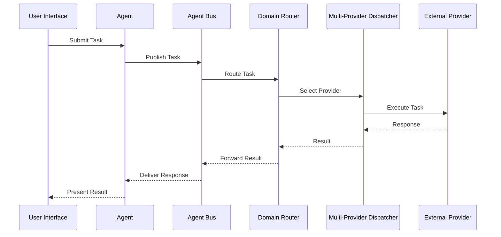

### Memory Management Architecture

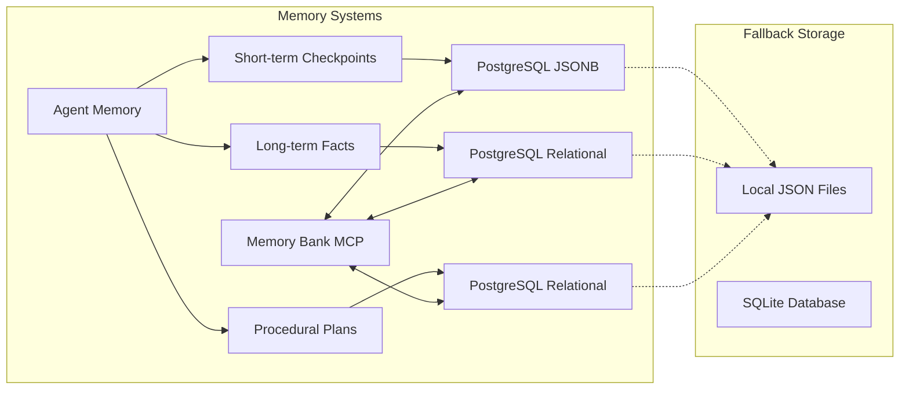

## Provider Integration

### Antigravity Integration

Antigravity is the primary provider offering:
- **4M tokens/week** across 8 accounts (500K/account)
- **Claude Opus 4.6 Thinking** for deep reasoning
- **Gemini 3 Pro** with 1M context for large document analysis
- **Automatic account rotation** with quota management

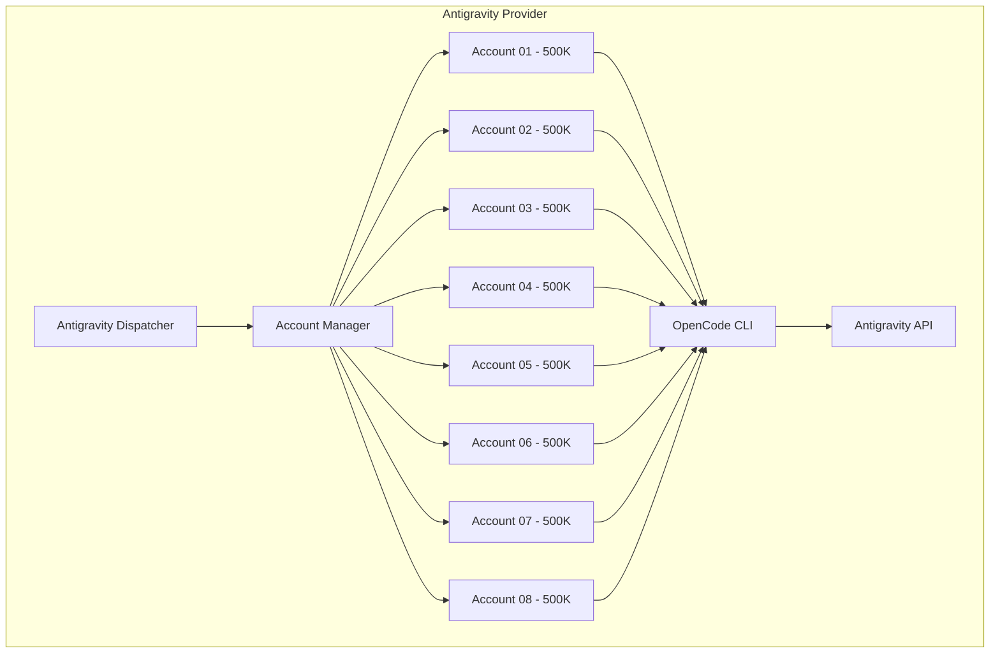

### OAuth Authentication Flow

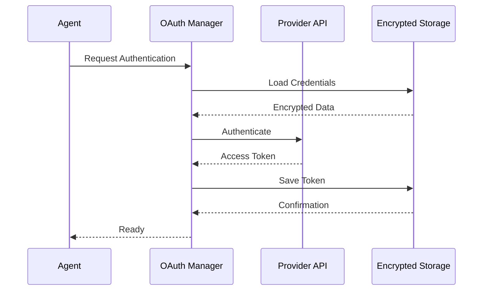

## Account Management System

### Multi-Account Rotation

The system implements intelligent account rotation to:
- **Maximize quota utilization** across all providers
- **Handle rate limiting** gracefully
- **Provide fallback options** when accounts are exhausted
- **Maintain session continuity** across account switches

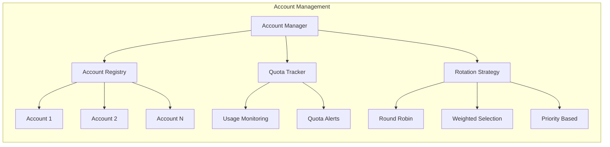

### Quota Management

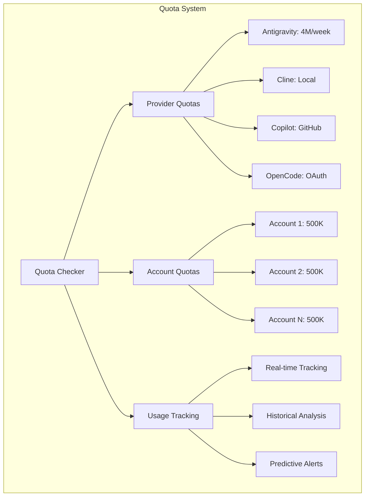

## Security Architecture

### Authentication & Authorization

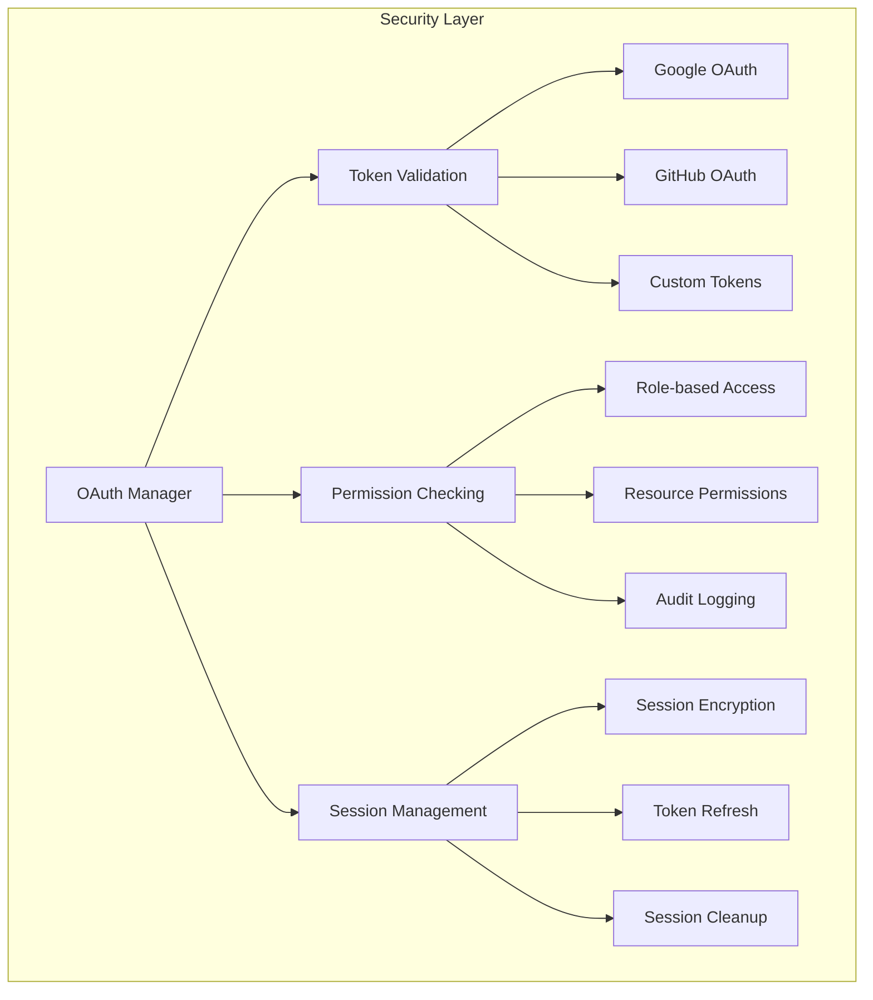

### Data Protection

- **Encrypted Storage**: All sensitive data encrypted at rest
- **Secure Communication**: TLS/SSL for all external communications
- **Access Control**: Fine-grained permissions for all resources
- **Audit Logging**: Complete audit trail for compliance

## Performance Optimization

### Caching Strategy

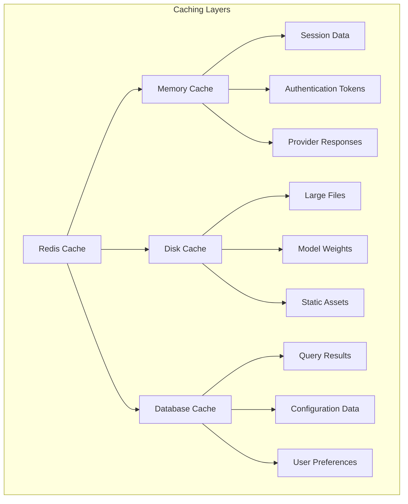

### Load Balancing

- **Provider Load Balancing**: Distribute load across multiple providers
- **Account Load Balancing**: Rotate across multiple accounts per provider
- **Geographic Load Balancing**: Route to nearest data center when possible
- **Intelligent Failover**: Automatic failover to backup providers

## Monitoring & Observability

### Metrics Collection

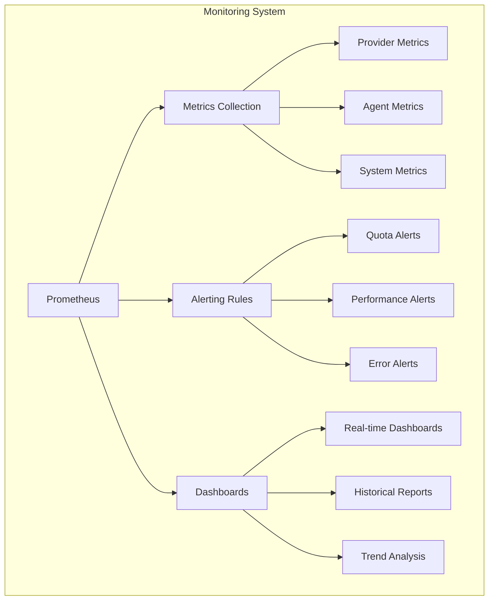

### Logging Strategy

- **Structured Logging**: JSON format for easy parsing
- **Log Levels**: Debug, Info, Warning, Error, Critical
- **Log Aggregation**: Centralized logging across all components
- **Log Rotation**: Automatic cleanup to prevent disk space issues

## Deployment Architecture

### Development Environment

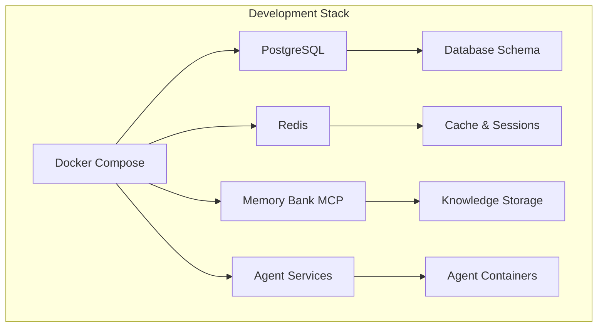

### Production Deployment

- **Container Orchestration**: Kubernetes or Docker Swarm
- **Service Discovery**: Consul or etcd
- **Load Balancing**: NGINX or HAProxy
- **Monitoring**: Prometheus + Grafana
- **Logging**: ELK Stack or Loki

## Integration Patterns

### Plugin Architecture

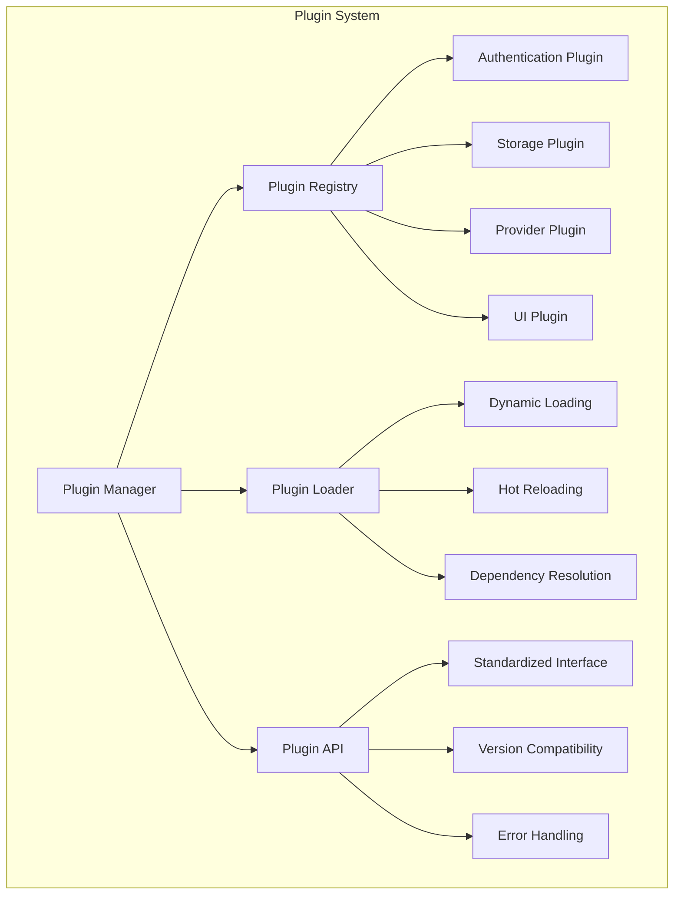

### API Integration

- **RESTful APIs**: Standard HTTP APIs for external integration
- **WebSocket Support**: Real-time communication for live updates
- **GraphQL Support**: Flexible querying for complex data relationships
- **gRPC Support**: High-performance communication for internal services

## Future Enhancements

### Planned Features

1. **Advanced Analytics**: Machine learning for system optimization
2. **Auto-scaling**: Dynamic resource allocation based on load
3. **Multi-tenancy**: Support for multiple independent users/organizations
4. **Mobile Support**: Native mobile applications for on-the-go access
5. **Voice Interface**: Voice-controlled agent interaction
6. **Blockchain Integration**: Decentralized identity and data storage

### Research Areas

1. **Federated Learning**: Privacy-preserving machine learning
2. **Edge Computing**: Local processing for reduced latency
3. **Quantum Computing**: Future-proofing for quantum algorithms
4. **Neuromorphic Computing**: Brain-inspired computing architectures

## Conclusion

The Omega Stack represents a comprehensive approach to building and managing multi-agent AI systems. By focusing on modularity, community involvement, and best practices, it provides a solid foundation for both current needs and future growth.

This architecture is designed to be:
- **Scalable**: Handle growth in users, agents, and complexity
- **Maintainable**: Easy to understand, modify, and extend
- **Secure**: Protect data and ensure privacy
- **Performant**: Deliver fast, reliable service
- **Community-Driven**: Foster collaboration and shared development

For more detailed information about specific components, please refer to the individual documentation files in this repository.