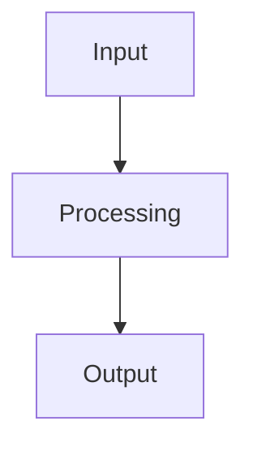

# Contributing to Omega Stack

**Created by:** Cline Kat-Coder  
**Session:** Chat Session #20260311-1545  
**Date:** March 11, 2026  
**Version:** 1.0  
**Quality Assessment:** ✅ Comprehensive - Complete community development guidelines

Thank you for your interest in contributing to the Omega Stack! This document provides guidelines for contributing to the project, ensuring high-quality code and a positive community experience.

## Table of Contents

1. [Code of Conduct](#code-of-conduct)
2. [Getting Started](#getting-started)
3. [Development Setup](#development-setup)
4. [Contribution Guidelines](#contribution-guidelines)
5. [Code Style](#code-style)
6. [Testing](#testing)
7. [Documentation](#documentation)
8. [Plugin Development](#plugin-development)
9. [Issue Reporting](#issue-reporting)
10. [Pull Request Process](#pull-request-process)

## Code of Conduct

We are committed to providing a welcoming and inclusive environment for all contributors. Please be respectful in all interactions and follow these principles:

- Be respectful and inclusive
- Focus on what is best for the community
- Show empathy towards other community members
- Be open to feedback and willing to help others

## Getting Started

### Prerequisites

- Python 3.10 or higher
- Docker and Docker Compose
- Git
- Make (optional, for convenience)

### Development Environment Setup

1. **Fork and Clone the Repository**
   ```bash
   git clone https://github.com/YOUR_USERNAME/xoe-novai-foundation.git
   cd xoe-novai-foundation
   ```

2. **Set Up Development Environment**
   ```bash
   # Copy environment configuration
   cp .env.example .env
   
   # Start development stack
   make dev-up
   
   # Or manually with Docker Compose
   docker-compose -f infra/docker/docker-compose.dev.yml up -d
   ```

3. **Install Dependencies**
   ```bash
   # Install Python dependencies
   pip install -r requirements/dev.txt
   
   # Install pre-commit hooks
   pre-commit install
   ```

4. **Run Initial Setup**
   ```bash
   # Initialize database
   make db-migrate
   
   # Set up initial configuration
   python scripts/setup_dev_environment.py
   ```

## Development Setup

### Project Structure

```
omega-stack/
├── app/                    # Main application code
│   └── XNAi_rag_app/       # Core RAG application
├── config/                 # Configuration files
├── docs/                   # Documentation
├── infra/                  # Infrastructure as Code
├── scripts/                # Utility scripts
├── tests/                  # Test files
├── requirements/           # Python dependencies
├── artifacts/              # Generated artifacts
└── docs/                   # Documentation
```

### Development Tools

- **Pre-commit hooks**: Automatic code formatting and linting
- **Type checking**: mypy for static type analysis
- **Linting**: ruff for code quality
- **Testing**: pytest with comprehensive test coverage
- **Documentation**: MkDocs for documentation generation

### Local Development Commands

```bash
# Start development environment
make dev-up

# Run tests
make test

# Run type checking
make type-check

# Run linting
make lint

# Generate documentation
make docs

# Clean up
make clean
```

## Contribution Guidelines

### Before You Start

1. **Check Existing Issues**: Look for existing issues or discussions related to your contribution
2. **Discuss Your Ideas**: Create an issue to discuss major changes or new features
3. **Follow the Architecture**: Ensure your changes align with the system architecture

### Code Quality Standards

1. **Type Hints**: All functions must have proper type hints
2. **Docstrings**: Use Google-style docstrings for all public functions
3. **Error Handling**: Implement proper error handling and logging
4. **Testing**: Include tests for new functionality
5. **Documentation**: Update documentation for any user-facing changes

### Git Workflow

1. **Create Feature Branch**
   ```bash
   git checkout -b feature/your-feature-name
   ```

2. **Make Changes**
   - Follow the coding standards
   - Write tests for new functionality
   - Update documentation as needed

3. **Commit Changes**
   ```bash
   git add .
   git commit -m "feat: add your feature description"
   ```

4. **Push to Remote**
   ```bash
   git push origin feature/your-feature-name
   ```

5. **Create Pull Request**
   - Use the provided PR template
   - Reference related issues
   - Include a clear description of changes

### Commit Message Format

We follow conventional commits format:

```
<type>: <description>

[optional body]

[optional footer(s)]
```

**Types:**
- `feat`: New feature
- `fix`: Bug fix
- `docs`: Documentation changes
- `style`: Code style changes (formatting, etc.)
- `refactor`: Code refactoring
- `test`: Adding or updating tests
- `chore`: Maintenance tasks

**Examples:**
```
feat: add OAuth authentication for Antigravity provider
fix: resolve memory leak in agent context management
docs: update API documentation for quota system
```

## Code Style

### Python Style Guide

We follow PEP 8 with some additional guidelines:

1. **Line Length**: Maximum 88 characters (Black default)
2. **Imports**: Organize imports using isort
3. **Type Hints**: Always use type hints for function signatures
4. **Naming**: Use snake_case for functions and variables, PascalCase for classes

### Code Formatting

The project uses Black for code formatting and isort for import sorting. These are automatically applied via pre-commit hooks.

```python
# Example of proper formatting
from typing import Dict, List, Optional, Any
from datetime import datetime

class ExampleClass:
    """Example class demonstrating proper formatting."""
    
    def __init__(self, name: str, config: Dict[str, Any]) -> None:
        """Initialize the example class.
        
        Args:
            name: The name of the instance
            config: Configuration dictionary
        """
        self.name = name
        self.config = config
        self.created_at = datetime.now()
    
    async def process_data(self, data: List[Dict[str, Any]]) -> Optional[str]:
        """Process input data and return result.
        
        Args:
            data: List of data dictionaries to process
            
        Returns:
            Processed result or None if processing fails
        """
        try:
            # Processing logic here
            return "success"
        except Exception as e:
            logger.error(f"Error processing data: {e}")
            return None
```

### Async/Await Patterns

Use `anyio` for async operations to ensure compatibility across different async frameworks:

```python
import anyio
from typing import AsyncGenerator

async def async_function() -> AsyncGenerator[str, None]:
    """Example async function using anyio."""
    async with anyio.create_task_group() as tg:
        # Async operations here
        yield "result"
```

## Testing

### Test Structure

```
tests/
├── unit/                   # Unit tests
│   ├── test_account_manager.py
│   ├── test_agent_bus.py
│   └── test_quota_checker.py
├── integration/            # Integration tests
│   ├── test_multi_provider.py
│   └── test_memory_systems.py
├── fixtures/               # Test data and fixtures
└── conftest.py            # Test configuration
```

### Writing Tests

1. **Unit Tests**: Test individual functions and classes in isolation
2. **Integration Tests**: Test component interactions
3. **Mock External Dependencies**: Use pytest-mock for external services
4. **Test Coverage**: Aim for 80%+ test coverage

```python
import pytest
from unittest.mock import AsyncMock, patch
from app.XNAi_rag_app.core.account_manager import AccountManager

@pytest.mark.asyncio
async def test_account_creation():
    """Test account creation functionality."""
    manager = AccountManager()
    
    # Mock dependencies
    with patch('app.XNAi_rag_app.core.account_manager.get_redis_client') as mock_redis:
        mock_redis.return_value = AsyncMock()
        
        # Test account creation
        account_id = await manager.create_account(
            name="test_account",
            account_type="user",
            email="test@example.com",
            provider="antigravity",
            quota_limit=500000
        )
        
        # Assertions
        assert account_id is not None
        assert "antigravity" in account_id
```

### Running Tests

```bash
# Run all tests
pytest

# Run specific test file
pytest tests/unit/test_account_manager.py

# Run tests with coverage
pytest --cov=app --cov-report=html

# Run integration tests
pytest tests/integration/
```

## Documentation

### Documentation Standards

1. **API Documentation**: Use Google-style docstrings
2. **Architecture Docs**: Update architecture diagrams and overviews
3. **User Guides**: Write clear, step-by-step instructions
4. **Examples**: Include practical examples for complex features

### Documentation Structure

```
docs/
├── gnostic_architecture/
│   ├── 01_temple_architecture.md  # System architecture (replaces ARCHITECTURE_OVERVIEW.md)
├── API_REFERENCE.md            # API documentation
├── DEVELOPMENT_GUIDE.md        # Development setup
├── DEPLOYMENT_GUIDE.md         # Deployment instructions
├── CONTRIBUTING.md             # This file
├── TROUBLESHOOTING.md          # Common issues and solutions
└── tutorials/                  # Step-by-step guides
```

### Writing Documentation

Use Markdown with Mermaid diagrams for visualizations:

```markdown
# Feature Documentation

## Overview

Brief description of the feature.

## Usage

```python
# Code example
from omega_stack import ExampleClass

example = ExampleClass()
result = example.process()
```

## Configuration

| Parameter | Type | Default | Description |
|-----------|------|---------|-------------|
| name | str | None | Feature name |
| enabled | bool | True | Enable feature |

## Architecture


```

## Plugin Development

### Plugin Architecture

The Omega Stack supports a plugin system for extending functionality. Plugins can be developed for:

- Authentication providers
- Storage backends
- External integrations
- UI components

### Creating a Plugin

1. **Plugin Structure**
   ```
   my_plugin/
   ├── __init__.py
   ├── plugin.py
   ├── config.py
   └── tests/
   ```

2. **Plugin Interface**
   ```python
   from omega_stack.plugins.base import BasePlugin
   
   class MyPlugin(BasePlugin):
       """Example plugin implementation."""
       
       def __init__(self, config: Dict[str, Any]):
           super().__init__(config)
           
       async def initialize(self) -> bool:
           """Initialize the plugin."""
           return True
           
       async def cleanup(self) -> None:
           """Clean up plugin resources."""
           pass
   ```

3. **Plugin Registration**
   ```python
   # In plugin.py
   def register_plugin() -> MyPlugin:
       return MyPlugin
   ```

### Plugin Guidelines

- Follow the base plugin interface
- Include comprehensive tests
- Document configuration options
- Handle errors gracefully
- Support async operations where appropriate

## Issue Reporting

### Before Reporting

1. **Check Existing Issues**: Search for similar issues
2. **Read Documentation**: Check if the issue is documented
3. **Try Latest Version**: Ensure you're using the latest version

### Creating Issues

Use the appropriate issue template:

- **Bug Report**: For reporting bugs
- **Feature Request**: For new features
- **Question**: For general questions
- **Documentation**: For documentation issues

### Bug Report Template

```markdown
**Describe the bug**
A clear description of what the bug is.

**To Reproduce**
Steps to reproduce the behavior:
1. Go to '...'
2. Click on '....'
3. Scroll down to '....'
4. See error

**Expected behavior**
A clear description of what you expected to happen.

**Environment Info**
- OS: [e.g. Ubuntu 20.04]
- Python version: [e.g. 3.10]
- Omega Stack version: [e.g. latest]

**Additional context**
Add any other context about the problem here.
```

## Pull Request Process

### PR Requirements

1. **Clear Description**: Describe what the PR does
2. **Related Issues**: Reference related issues
3. **Test Coverage**: Include tests for new functionality
4. **Documentation**: Update documentation as needed
5. **Code Review**: Address all review comments

### PR Template

```markdown
## Summary
Brief description of changes

## Test plan
[Checklist of TODOs for testing the PR]

## Documentation
- [ ] Code is commented and follows docstring standards
- [ ] README has been updated, if necessary
- [ ] Changelog has been updated, if necessary

## Type of change
- [ ] Bug fix (non-breaking change which fixes an issue)
- [ ] New feature (non-breaking change which adds functionality)
- [ ] Breaking change (fix or feature that would cause existing functionality to not work as expected)
- [ ] This change requires a documentation update

## How Has This Been Tested?
Please describe the tests that you ran to verify your changes.

## Checklist
- [ ] My code follows the style guidelines of this project
- [ ] I have performed a self-review of my own code
- [ ] I have commented my code, particularly in hard-to-understand areas
- [ ] I have made corresponding changes to the documentation
- [ ] My changes generate no new warnings
- [ ] I have added tests that prove my fix is effective or that my feature works
- [ ] New and existing unit tests pass locally with my changes
```

### Review Process

1. **Automated Checks**: All CI/CD checks must pass
2. **Code Review**: At least one maintainer must approve
3. **Testing**: All tests must pass
4. **Documentation**: Documentation must be up to date

### Merge Requirements

- All checks pass
- At least one maintainer approval
- No outstanding review comments
- Squash and merge preferred

## Getting Help

### Community Support

- **Discussions**: Use GitHub Discussions for questions and ideas
- **Issues**: Report bugs and feature requests via GitHub Issues
- **Documentation**: Check the documentation first for answers

### Developer Resources

- **Architecture Overview**: See `docs/gnostic_architecture/01_temple_architecture.md`
- **API Reference**: See `docs/API_REFERENCE.md`
- **Development Guide**: See `docs/DEVELOPMENT_GUIDE.md`

### Contact

For direct communication:
- Create a GitHub issue
- Join our community discussions
- Email the maintainers (if available)

## Recognition

We appreciate all contributions! Contributors will be recognized in:
- Release notes
- Contributor list in README
- Special recognition for significant contributions

Thank you for contributing to the Omega Stack! 🚀