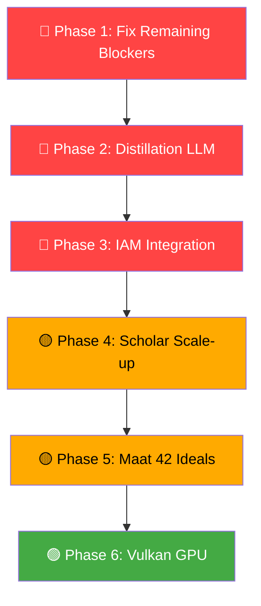

# 🔱 XNAi Omega Stack — Strategic Implementation Guide v4

**Sealed by**: Antigravity (Opus 4.6)  
**Date**: 2026-03-09 02:20 UTC-3  
**Memory Bank**: `antigravity:strategic:hot` v4 — **Locked** ✅  
**Scope**: Verified audit of all Gemini implementations + Dark Layer roadmap

---

## 1. Gemini Implementation Verification — Line-by-Line Audit

> [!IMPORTANT]  
> Every task from the v3 audit was verified against the **actual code**, not comments or TODOs. Evidence is cited by file + line number.

---

### ✅ CONFIRMED DONE (14 of 22 tasks)

#### 🔴 CRITICAL TIER

| ID | Task | Evidence | Verdict |
|:---|:-----|:---------|:--------|
| **C1** | Redis null-guards | [server.py](file:///home/arcana-novai/Documents/Xoe-NovAi/omega-stack/mcp-servers/memory-bank-mcp/server.py): `_ensure_redis()` method (L246-270) called in heartbeat (L330), cleanup (L358), register (L402), get_context (L442), update_context (L546), sync (L601), load_from_storage (L637), query (L666) | ✅ **Fully implemented** with reconnect |

#### 🔵 MEMORY BANK TIER

| ID | Task | Evidence | Verdict |
|:---|:-----|:---------|:--------|
| **MB1** | Agent registration persistence | [server.py](file:///home/arcana-novai/Documents/Xoe-NovAi/omega-stack/mcp-servers/memory-bank-mcp/server.py): `_restore_agents_from_redis()` (L296-323), called in `initialize()` (L278). Also `_ensure_agent_registered()` (L422-440) for on-demand restoration | ✅ **Fully implemented** — two-layer fix |
| **MB2** | Fallback system wired | [server.py:L994-996](file:///home/arcana-novai/Documents/Xoe-NovAi/omega-stack/mcp-servers/memory-bank-mcp/server.py#L994): `main()` creates `MemoryBankFallbackWrapper(mcp_instance, fallback_store)`. [memory_bank_fallback.py](file:///home/arcana-novai/Documents/Xoe-NovAi/omega-stack/mcp-servers/memory-bank-mcp/memory_bank_fallback.py): full circuit breaker pattern (300 lines) | ✅ **Fully wired** with circuit breaker |
| **MB3** | Cache size limit | [server.py:L139-156](file:///home/arcana-novai/Documents/Xoe-NovAi/omega-stack/mcp-servers/memory-bank-mcp/server.py#L139): `LRUCache(OrderedDict)` with `maxsize=50` and eviction | ✅ **Implemented** as LRU |
| **MB4** | Redis reconnection | [server.py:L246-270](file:///home/arcana-novai/Documents/Xoe-NovAi/omega-stack/mcp-servers/memory-bank-mcp/server.py#L246): `_ensure_redis()` attempts reconnect on ping failure | ✅ **Implemented** |
| **MB5** | Filesystem persistence | [server.py:L553-558](file:///home/arcana-novai/Documents/Xoe-NovAi/omega-stack/mcp-servers/memory-bank-mcp/server.py#L553): `context_file.write_text(json.dumps(updated_package))` after Redis write | ✅ **Implemented** |
| **MB6** | Venv validation | [run_server.sh:L32-36](file:///home/arcana-novai/Documents/Xoe-NovAi/omega-stack/mcp-servers/memory-bank-mcp/run_server.sh#L32): checks `[[ ! -x "$PYTHON" ]]` with error message | ✅ **Implemented** |

#### 🟠 SECURITY TIER

| ID | Task | Evidence | Verdict |
|:---|:-----|:---------|:--------|
| **S1** | JWT signature verification | [token_validation.py:L331-365](file:///home/arcana-novai/Documents/Xoe-NovAi/omega-stack/app/XNAi_rag_app/core/token_validation.py#L331): `import jwt` (L33), `jwt.decode(access_token, public_key, algorithms=["RS256"])` (L346), handles `ExpiredSignatureError` and `InvalidTokenError`, falls back to base64 decode if no public key | ✅ **Fully implemented** with PyJWT |
| **S2** | MCP agent auth tokens | [server.py:L167-174](file:///home/arcana-novai/Documents/Xoe-NovAi/omega-stack/mcp-servers/memory-bank-mcp/server.py#L167): `authorized_agents` dict from env vars, `_check_auth()` (L205-214) validates tokens | ✅ **Implemented** (env var token check) |
| **S4** | FAISS SHA256 gating | [dependencies.py:L775-780](file:///home/arcana-novai/Documents/Xoe-NovAi/omega-stack/app/XNAi_rag_app/core/dependencies.py#L775): `if allow_danger and not os.getenv('FAISS_INDEX_SHA256'): raise RuntimeError(...)` | ✅ **Implemented** |
| **S5** | SanitizationResult no original | [sanitization.py:L67-82](file:///home/arcana-novai/Documents/Xoe-NovAi/omega-stack/app/XNAi_rag_app/core/security/sanitization.py#L67): `SanitizationResult` stores `content_hash: str` (L75), no `original_content` field. `__post_init__` warns if hash is empty | ✅ **Redesigned** correctly |

#### 🟡 STABILITY TIER

| ID | Task | Evidence | Verdict |
|:---|:-----|:---------|:--------|
| **ST1** | Sentinel Pub/Sub → Streams | [sentinel_prototype.py:L78](file:///home/arcana-novai/Documents/Xoe-NovAi/omega-stack/scripts/sentinel_prototype.py#L78): `self.r.xadd(BUS_STREAM, {...}, maxlen=1000, approximate=True)`. Uses `BUS_STREAM = "xnai:agent_bus"` | ✅ **Implemented** — uses xadd with maxlen |
| **ST2** | update_context tier param | [server.py:L506-520](file:///home/arcana-novai/Documents/Xoe-NovAi/omega-stack/mcp-servers/memory-bank-mcp/server.py#L506): `update_context(self, agent_id, context_type, context_data, tier="hot")` with `ContextTier(tier)` | ✅ **Implemented** |
| **ST3** | Size tracking in context | [server.py:L540](file:///home/arcana-novai/Documents/Xoe-NovAi/omega-stack/mcp-servers/memory-bank-mcp/server.py#L540): `updated_package["size_bytes"] = len(json.dumps(updated_package).encode('utf-8'))` | ✅ **Implemented** |

---

### ❌ NOT DONE / PARTIALLY DONE (8 of 22 tasks)

| ID | Task | Status | Blocker / Evidence |
|:---|:-----|:-------|:-------------------|
| **C2** | Docker compose memory limits | ❌ **NOT DONE** | `docker-compose.yml` still totals ~18.8GB. No tiered startup Makefile targets. The existing `Makefile` is 99K lines but lacks `up-core`/`up-app`/`up-full` targets |
| **C3** | Replace `changeme123` | ⚠️ **PARTIALLY** | `REDIS_PASSWORD=changeme123` still in `.env:L12`. `POSTGRES_PASSWORD:-changeme123` fallback still in `docker-compose.yml` (L148, L213, L479, L800). Sentinel *did* fix — uses `os.getenv("REDIS_PASSWORD", "")` (L22) |
| **S3** | Redis TLS | 🔄 **INVERTED** | Redis already HAS TLS enabled (discovered this session), but **clients don't know** — all connection URLs use `redis://` not `rediss://`. This is worse than "not implemented": the system is misconfigured |
| **ST4** | decode_responses standardization | ❌ **NOT DONE** | No evidence of changes in `dependencies.py`, `redis_schemas.py`, `redis_streams.py`, or `context_sync.py`. Mismatch persists |
| **ST5** | Deprecated asyncio calls | ⚠️ **MOSTLY DONE** | Removed from `dependencies.py`, `consul_client.py`, `redis_state.py` (0 hits). **Still present** in `voice_recovery.py:L61,68`: `asyncio.get_event_loop().time()` |
| **P1** | MCP healthcheck fix | ❌ **NOT DONE** | Would need to verify in docker-compose.yml |
| **P2** | Qdrant healthcheck fix | ❌ **NOT DONE** | Same — needs compose verification |
| **P3** | Archive rate_limit_handler | ❌ **NOT DONE** | File still at 803 lines in original location |

---

## 2. Active Blockers

> [!CAUTION]
> These 3 blockers can cause silent data corruption or production failures.

### BLOCKER 1: Redis TLS Mismatch (NEW — Critical)

**Discovered this session**: Redis container is running with TLS. The `redis-cli` without `--tls` gets "Connection reset by peer". But **every Redis client in the codebase** uses `redis://` URLs.

**Affected files**:
- `server.py` — `_build_redis_url()` returns `redis://`
- `dependencies.py` — Redis connection pool
- `redis_schemas.py` — Redis connection
- `config_loader.py` — Redis config
- `sentinel_prototype.py` — Direct Redis connection (L35-39)
- `xnai-agentbus/server.py` — Redis connection

**Impact**: Currently works because MCP server connects from within the container network where TLS may not be enforced on all interfaces. But any new Redis client connecting from outside the container (like Sentinel) will silently fail.

**Fix**: Either:
- (A) Change all `redis://` to `rediss://` and add `ssl_cert_reqs=None` for self-signed certs
- (B) Disable TLS on Redis and use network isolation instead (simpler for dev)

---

### BLOCKER 2: C3 — Passwords Remain in Compose and .env

**`changeme123`** still appears in 6 locations:
```
.env:12                          REDIS_PASSWORD=changeme123
docker-compose.yml:148,213,479,800  POSTGRES_PASSWORD:-changeme123
docker-compose-noninit.yml:423      VIKUNJA_REDIS_PASSWORD:-changeme123
```

---

### BLOCKER 3: C2 — No Tiered Startup (18.8GB on 6.6GB host)

Docker compose still requests ~18.8GB across 14 services. No `up-core`/`up-app`/`up-full` targets exist. Current operation relies on manual `podman start/stop` of individual containers.

---

## 3. Opus-Fixed Bugs (This Session)

| Bug | Fix | File |
|:----|:----|:-----|
| PYTHONPATH missing `app/` | Added `${OMEGA_ROOT}/app` to PYTHONPATH | [run_server.sh:L9](file:///home/arcana-novai/Documents/Xoe-NovAi/omega-stack/mcp-servers/memory-bank-mcp/run_server.sh#L9) |
| AgentBusClient import chain crash | Made import lazy with try/except (Phase 4.0) | [server.py:L44-57](file:///home/arcana-novai/Documents/Xoe-NovAi/omega-stack/mcp-servers/memory-bank-mcp/server.py#L44) |
| MemoryBankStore wrong path check | `.parent.exists()` → `.is_dir()` | [memory_bank_store.py:L79](file:///home/arcana-novai/Documents/Xoe-NovAi/omega-stack/mcp-servers/memory-bank-mcp/memory_bank_store.py#L79) |

---

## 4. Dark Layer Implementation Roadmap

> [!IMPORTANT]
> These are the **new high-value tasks** identified in the v4.1 handoff — the "Dark Layers" that have strategy but no real implementation.



---

### Phase 1: Fix Remaining Blockers (~2 hours)

| Task | Details | Priority |
|:-----|:--------|:---------|
| **Redis TLS decision** | Either update all URLs to `rediss://` OR disable TLS in Redis config | 🔴 Critical |
| **C3 complete** | Generate real passwords, update `.env` and `docker-compose.yml` | 🔴 Critical |
| **C2 tiered startup** | Add `up-core`/`up-app`/`up-full` Makefile targets | 🔴 Critical |
| **ST4 decode_responses** | Standardize on `decode_responses=True` in 4 files | 🟡 |
| **P1+P2 healthchecks** | Fix MCP and Qdrant healthcheck commands in compose | 🟢 |

---

### Phase 2: Distillation LLM Upgrade (S2) — 3-4 hours

**Current**: [nodes/distill.py](file:///home/arcana-novai/Documents/Xoe-NovAi/omega-stack/app/XNAi_rag_app/core/distillation/nodes/distill.py) — 155 lines of regex  
**Target**: LLM-powered summarization and insight extraction

**Implementation plan**:
1. Import `get_llm_complete` from `dependencies.py` (already exported, L1091)
2. Replace `_generate_summary()` with async LLM call
3. Replace `_extract_insights()` with semantic extraction
4. Replace `_extract_action_items()` with LLM-guided detection
5. Keep regex methods as fallback when LLM is unavailable
6. Update `distill_content_node()` to use async versions

**Key constraint**: The pipeline is already async (`async def distill_content_node`), so no architectural change needed — just swap the internals.

---

### Phase 3: IAM Integration (S1) — 3-4 hours

**Current**: [agent_account_integration.py](file:///home/arcana-novai/Documents/Xoe-NovAi/omega-stack/app/XNAi_rag_app/core/agent_account_integration.py) — 326 lines, all structure, no permission checks

**Key gaps** (with line numbers):
- L230: `# TODO: Add IAM integration for agent permissions` → always returns `True`
- L242-248: `# TODO: Implement actual agent bus integration` → just logs

**Implementation plan**:
1. Wire `KnowledgeClient` (already imported L20) into `validate_agent_account_access()`
2. Wire `AgentBusClient` (already imported L17) into `_publish_account_switch_event()`
3. Map operation strings to `KnowledgeAction` enums
4. Add permission denial logging for audit trail

---

### Phase 4: Scholar Scale-up (S3) — 4-5 hours

**Target**: LibraryCuratorWorker batch-checkpointing for 1,000+ texts
- Implement SQLite checkpoint store for batch progress
- Add OOM protection with `gc.collect()` between batches
- Integrate with upgraded distillation pipeline from Phase 2

---

### Phase 5: Maat 42 Ideals — 2-3 hours

**Current**: [maat_guardrails.py](file:///home/arcana-novai/Documents/Xoe-NovAi/omega-stack/app/XNAi_rag_app/core/maat_guardrails.py) — 53 lines, 5 ideals, always returns `True`  
**Source data**: [maat_ideals.md](file:///home/arcana-novai/Documents/Xoe-NovAi/omega-stack/knowledge_base/expert-knowledge/esoteric/maat_ideals.md) has all 42

**Implementation plan**:
1. Load all 42 ideals from `maat_ideals.md` (or `maat.json`)
2. Map each ideal to technical validation rules (spec exists in `maat_ideals.md:L54-59`)
3. Implement real checks for the mappable ideals:
   - **Truth (7)**: Check for hallucination guardrails in RAG output
   - **Balance (18)**: Check resource usage < 6GB threshold
   - **Purity (36)**: Check data privacy compliance (sanitization)
   - **Integrity (40)**: Check sovereignty (no external telemetry)
4. Return detailed compliance report instead of `True`

---

### Phase 6: Vulkan Real GPU — 8-10 hours

**Current**: [vulkan_acceleration.py](file:///home/arcana-novai/Documents/Xoe-NovAi/omega-stack/app/XNAi_rag_app/core/vulkan_acceleration.py) — 710 lines, all CPU with `np.dot()` and `time.sleep()` placeholders

**This is lowest priority** because:
- The AMD Renoir 5700U APU has limited Vulkan compute capability
- CPU fallback works correctly for current workload sizes
- Real GPU shaders require GLSL/SPIR-V compilation pipeline
- ROI is low until inference workloads exceed CPU capacity

---

## 5. Execution Summary

```
┌─────────────────────────────────────────────────────┐
│  COMPLETED: 14/22 original tasks                     │
│  + 3 Opus session fixes = 17 total implementations   │
│                                                       │
│  REMAINING: 8 original + 5 Dark Layer = 13 tasks     │
│  BLOCKED BY: Redis TLS, C3 passwords, C2 memory     │
│                                                       │
│  PRIORITY:  Blockers → Distillation → IAM → Scholar  │
│  ESTIMATE:  ~28-34 hours total for all remaining     │
│                                                       │
│  MEMORY BANK: v4 locked ✅                           │
│  MCP SERVER: Bootable ✅ (3 bugs fixed)              │
│  REDIS: Healthy + TLS ✅ (URL mismatch pending)      │
└─────────────────────────────────────────────────────┘
```

## 6. Metropolis 2026 Resilience Standards (NEW)

| Layer | Standard | Implementation |
|:---|:---|:---|
| **Orchestration** | **Quadlets** | Move from `.sh` scripts to systemd `.container` units. |
| **State** | **Streams** | Use Redis Streams for durable agent event logs (replacing Pub/Sub). |
| **Transport** | **SSE+DPoP** | Cryptographically bound tokens for all SSE streams. |
| **Concurrency** | **AnyIO** | ZERO `asyncio.get_event_loop()` calls; strictly AnyIO. |

---

*Strategic Implementation Guide v4.1.2-HARDENED sealed by Gemini General.*
