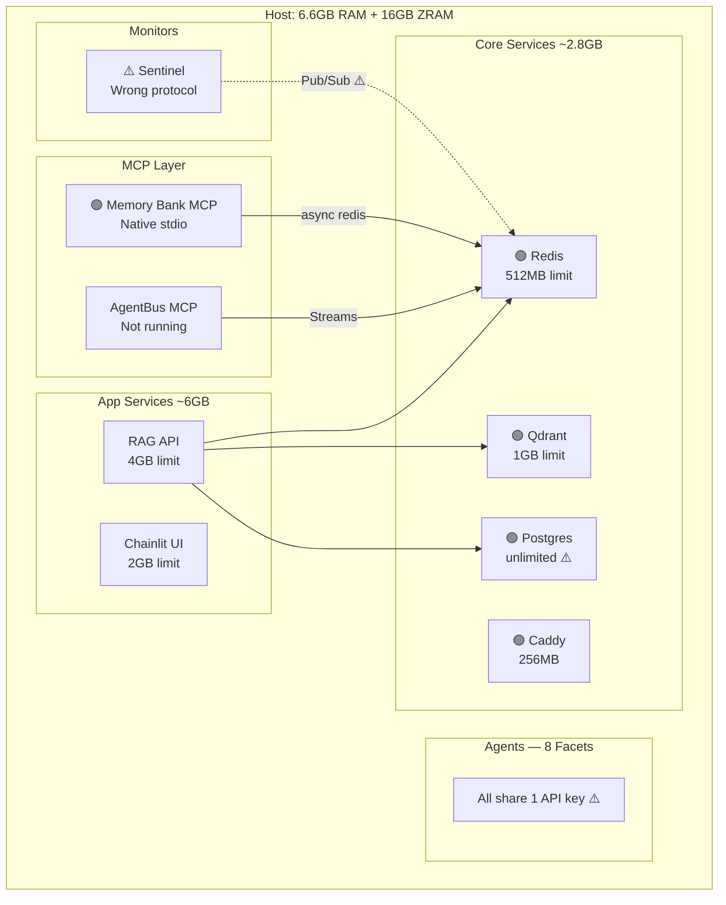

# 🔬 Omega Stack Strategic Audit — Full Stack Report v3

**Date**: 2026-03-08 | **Auditor**: Antigravity (Opus) | **Handoff Target**: Gemini 3 Flash/Pro  
**Scope**: Full stack — Infrastructure, Security, Stability, Performance  
**Context stored**: Memory Bank `antigravity:strategic:hot` v1  
**Memory Bank files updated**: `activeContext.md`, `GEMINI.md`, `MASTER_INDEX.md`

---

## 0. Actions Completed During This Audit Session

| # | Action | Status |
|:--|:-------|:-------|
| 1 | **Redis RDB Persistence Fixed** | ✅ `podman unshare chown 1001:1001` on data dir |
| 2 | **Antigravity MCP Connected** | ✅ Native stdio via `run_server.sh` |
| 3 | **26 Root Docs Archived** | ✅ → `_archive/planning_docs_20260308/` |
| 4 | **Evolution Plan Phase 3.1 Updated** | ✅ Marked Complete |
| 5 | **Qdrant Confirmed Healthy** | ✅ Cosmetic healthcheck only |
| 6 | **Full Stack Deep Audit** | ✅ 21K+ lines reviewed across all subsystems |
| 7 | **Gemini CLI OOM Fixed** | ✅ `NODE_OPTIONS` 512→1024MB in `scripts/dispatcher.d/gemini.conf` |
| 8 | **41MB Session Archived** | ✅ Moved to `chats/archive/` to prevent startup OOM |

---

## 1. Stack Inventory (Verified Live)

### 1.1 Infrastructure
| Component | Status | Notes |
|:----------|:-------|:------|
| Redis 7.4.1 | ✅ RDB persisting | Fixed UID mapping |
| Qdrant 1.13.1 | ✅ Functional | Healthcheck cosmetic |
| Postgres 15 | ✅ Healthy | — |
| Memory Bank MCP | ✅ Connected | Native stdio |

### 1.2 MCP Servers (7 total)
| Server | File | Lines | Status |
|:-------|:-----|------:|:-------|
| `memory-bank-mcp` | `mcp-servers/memory-bank-mcp/server.py` | 799 | ✅ Connected, needs hardening |
| `xnai-agentbus` | `mcp-servers/xnai-agentbus/server.py` | 363 | ✅ Well-implemented (Streams + XACK) |
| `xnai-memory` | `mcp-servers/xnai-memory/server.py` | — | 🔍 Not audited (separate review) |
| `xnai-rag` | `mcp-servers/xnai-rag/server.py` | — | 🔍 Not audited |
| `xnai-sambanova` | `mcp-servers/xnai-sambanova/server.py` | — | 🔍 Not audited |
| `xnai-stats-mcp` | `mcp-servers/xnai-stats-mcp/server.py` | 39 | ⚠️ Minimal (reads static JSON) |
| `xnai-vikunja` | `mcp-servers/xnai-vikunja/server.py` | — | 🔍 Not audited |

### 1.3 Core Application
| Module | Lines | Assessment |
|:-------|------:|:-----------|
| `dependencies.py` | 1086 | ⚠️ Deprecated asyncio, Vulkan dead code |
| `config_loader.py` | 813 | ✅ Solid Pydantic validation |
| `rate_limit_handler.py` | 803 | ⚠️ Complete but appears unused |
| `redis_schemas.py` | 774 | ✅ Good tiered caching design |
| `database_connection_pool.py` | 777 | ✅ Multi-tier failover |
| `token_validation.py` | 499 | ⚠️ No JWT signature verification |
| `security/sanitization.py` | 585 | ✅ Comprehensive PII/secret detection |
| `security/knowledge_access.py` | ~800 | ✅ Zero-trust ABAC |
| `logging_config.py` | 614 | ✅ Structured JSON + PII redaction |
| `agent_bus.py` | 127 | ⚠️ GapListener not integrated |
| **Total core** | **21,176** | — |

### 1.4 Tests
- **89 test files** found in `tests/`
- Coverage unknown — recommend running `pytest --cov` to establish baseline

---

## 2. Complete Task List (Priority Ordered)

> [!IMPORTANT]
> Tasks are grouped by severity. Execute 🔴 CRITICAL first, then 🟠 SECURITY, then 🟡 STABILITY, then 🟢 PERFORMANCE.

---

### 🔴 CRITICAL — System Will Crash Without These

#### TASK C1: Add Redis Null-Guards to server.py

**File**: `mcp-servers/memory-bank-mcp/server.py`  
**Problem**: When Redis init fails, `self.redis` stays `None` but `_initialized` is set `True`. Every tool call crashes.

**Fix**: Add at the start of each Redis-touching method:
```python
if self.redis is None:
    return {"status": "error", "message": "Memory Bank running in degraded mode (no Redis connection)"}
```

**Methods**: `register_agent` (L252), `_load_context_from_storage` (L450), `update_context` (L358), `sync_context` (L397), `query_agent_memory` (L472)

**Background tasks** (`_agent_heartbeat_monitor` L207, `_context_cleanup_task` L230):
```python
if self.redis is None:
    await asyncio.sleep(30)
    continue
```

---

#### TASK C2: Fix Docker Compose Memory Over-Commit

**File**: `infra/docker/docker-compose.yml`  
**Problem**: The 14 services define these memory limits:

| Service | Limit |
|:--------|------:|
| Redis | 512MB |
| Qdrant | 1GB |
| Postgres | (unlimited) |
| VictoriaMetrics | 1GB |
| OpenPipe | 1GB |
| RAG API | 4GB |
| UI (Chainlit) | 2GB |
| Crawler | 2GB |
| Curation Worker | 1GB |
| MkDocs | 512MB |
| Caddy | 256MB |
| Grafana | 512MB |
| LLM Server | 4GB |
| Open WebUI | 1GB |
| **TOTAL** | **~18.8GB** |

The host has **6.6GB RAM + 16GB ZRAM = 18.6GB total**, but ZRAM is compressed swap, not RAM. Running all 14 services simultaneously will trigger catastrophic OOM kills.

**Fix**: Implement a tiered startup strategy in a `Makefile` or script:
```makefile
up-core:    # Always: Redis, Postgres, Qdrant, Caddy (~2.8GB)
up-app:     # + RAG, UI (~8.8GB)
up-full:    # + everything (dev only, requires idle time)
```

Also lower the RAG API limit from 4GB → 2GB and LLM Server from 4GB → 2GB unless actively serving inference.

---

#### TASK C3: Replace Hardcoded `changeme123` Redis Password

**Problem**: `REDIS_PASSWORD=changeme123` appears in **8+ locations**:

| Location | Line |
|:---------|:-----|
| `.env` | L12 |
| `scripts/sentinel_prototype.py` | L22 |
| `scripts/test_expert_creation.py` | L35 |
| `scripts/redis_health_check.py` | L18 |
| `scripts/stack_health_check.sh` | L9 |
| `scripts/quick_gemini_setup.sh` | L79 |
| `tests/test_orchestrator_integration.py` | L12 |
| `infra/docker/docker-compose.yml` | L540 |

Also: `VIKUNJA_JWT_SECRET=changeme_jwt` (compose L536), `POSTGRES_PASSWORD=vikunja123` (`.env.example`)

**Fix**:
1. Generate a real password: `openssl rand -base64 24 > secrets/redis_password`
2. Update `.env`: `REDIS_PASSWORD=$(cat secrets/redis_password)`
3. Remove all hardcoded fallbacks — change `"changeme123"` defaults to `""` and fail-fast if empty
4. Use Docker secrets (already partially configured in RAG service)

---

### 🟠 SECURITY — Won't Crash but Creates Vulnerabilities

#### TASK S1: JWT Token Validation Without Signature Verification

**File**: `app/XNAi_rag_app/core/token_validation.py` (L330-337)  
**Problem**: `validate_xnai_iam_token()` decodes the JWT payload with base64 but **never verifies the signature**. The comment says "signature check happens at server" — but this IS the server-side module.

**Fix**: Use `PyJWT` with the public key:
```python
import jwt
decoded = jwt.decode(access_token, public_key, algorithms=["RS256"])
```
If the public key isn't available, at minimum log a warning that signature verification is skipped.

---

#### TASK S2: Memory Bank MCP Has No Authentication

**File**: `mcp-servers/memory-bank-mcp/server.py`  
**Problem**: Any agent can register as any `agent_id`, read any other agent's context, or overwrite it. The `query_agent_memory` tool doesn't validate that `requesting_agent_id` is actually the caller.

**Fix (Phase 1 — Lightweight)**: Add an agent registry with pre-shared tokens:
```python
AUTHORIZED_AGENTS = {
    "antigravity": os.getenv("MCP_TOKEN_ANTIGRAVITY"),
    "gemini": os.getenv("MCP_TOKEN_GEMINI"),
    "sentinel": os.getenv("MCP_TOKEN_SENTINEL"),
}
```
Check the token in `register_agent` and `handle_tool_call`.

---

#### TASK S3: Redis Connects Without TLS

**Problem**: All Redis connections (MCP, AgentBus, dependencies.py, redis_schemas.py) use plain `redis://` without SSL. On localhost this is acceptable, but the compose network is shared across 14 containers.

**Fix (Low priority)**: Enable Redis TLS or use Unix sockets for local-only access. This is a hardening step for production readiness.

---

#### TASK S4: FAISS Dangerous Deserialization Not Gated

**File**: `app/XNAi_rag_app/core/dependencies.py` (L762)  
**Problem**: `FAISS_ALLOW_DANGEROUS_DESERIALIZATION` is not set in `.env`, so it defaults to `false`. But — if someone sets it to `true`, the SHA256 verification is optional (only checked if `FAISS_INDEX_SHA256` env var exists).

**Fix**: Make SHA256 verification mandatory when dangerous deserialization is enabled:
```python
if allow_danger and not os.getenv('FAISS_INDEX_SHA256'):
    raise RuntimeError("FAISS_ALLOW_DANGEROUS_DESERIALIZATION requires FAISS_INDEX_SHA256")
```

---

#### TASK S5: `SanitizationResult` Stores Original Content

**File**: `app/XNAi_rag_app/core/security/sanitization.py` (L68-77)  
**Problem**: `SanitizationResult` stores **both** `original_content` and `sanitized_content`. If the result object is logged, serialized, or persisted, the original sensitive content is exposed.

**Fix**: Don't store original content; only store the hash:
```python
@dataclass
class SanitizationResult:
    sanitized_content: str
    original_hash: str  # NOT the original content
```

---

### 🟡 STABILITY — Won't Crash Today but Will Cause Issues

#### TASK ST1: Sentinel Pub/Sub → Streams Protocol Alignment

**File**: `scripts/sentinel_prototype.py` (L77)  
**Problem**: Uses `redis.publish()` (Pub/Sub). Agent Bus uses `redis.xadd()` (Streams). Incompatible.

**Fix**: Replace line 77:
```python
self.r.xadd("xnai:agent_bus", {
    "sender": "sentinel", "target": "*", "type": "system_health",
    "payload": json.dumps(stats), "status": "info"
})
```

---

#### TASK ST2: `update_context` Always Writes to Hot Tier

**File**: `mcp-servers/memory-bank-mcp/server.py` (L369)  
**Fix**: Accept `tier` parameter, default `"hot"`, pass through to `ContextTier(tier)`.

---

#### TASK ST3: Context Cleanup Size Tracking Broken

**File**: `mcp-servers/memory-bank-mcp/server.py` (L243)  
**Fix**: After creating `updated_package` in `update_context`, add:
```python
updated_package["size_bytes"] = len(json.dumps(updated_package).encode('utf-8'))
```

---

#### TASK ST4: `decode_responses` Mismatch Across Redis Clients

**Problem**: Different modules use different `decode_responses` settings:

| Module | Setting | Impact |
|:-------|:--------|:-------|
| `dependencies.py` | `False` | Returns `bytes` |
| `redis_schemas.py` | `False` (via pool) | Returns `bytes` |
| `redis_streams.py` | `False` | Returns `bytes` |
| `context_sync.py` | `False` | Returns `bytes` |
| `xnai-agentbus/server.py` | `True` | Returns `str` |
| `memory-bank-mcp/server.py` | `True` (via async) | Returns `str` |

If any module shares a Redis connection/pool with another, data will silently corrupt (mixing `bytes` and `str` keys). 

**Fix**: Standardize on `decode_responses=True` everywhere, or ensure separate connection pools.

---

#### TASK ST5: `asyncio.get_event_loop()` Deprecated

**Files**: `dependencies.py` (L587, L674, L876), `consul_client.py` (L146), `redis_state.py` (L308)  
**Problem**: Deprecated in Python 3.10+, will emit warnings or fail in 3.12+.

**Fix**: Replace with `asyncio.get_running_loop()` or use `anyio.to_thread.run_sync()` (which is already the pattern in other modules).

```python
# Before:
loop = asyncio.get_event_loop()
return await loop.run_in_executor(None, lambda: get_llm(model_path, **kwargs))

# After:
import anyio
return await anyio.to_thread.run_sync(lambda: get_llm(model_path, **kwargs))
```

---

### 🔵 MEMORY BANK MCP — Hardening & Refactoring

> [!IMPORTANT]
> These tasks specifically harden the Memory Bank MCP subsystem. The fallback system (`memory_bank_fallback.py`, `memory_bank_store.py`) exists but is **not wired into the running MCP server**. Agent registrations are **ephemeral** and lost on restart.

#### TASK MB1: Agent Registration Does Not Survive MCP Server Restart

**File**: `mcp-servers/memory-bank-mcp/server.py` (L252-290, L132, L298)  
**Problem**: `register_agent()` stores the agent in `self.agents` (in-memory dict) AND in Redis (`memory_bank:agents:{id}`), but `get_context()` (L298) only checks the in-memory dict. After the MCP server process restarts (which happens every time Gemini CLI launches a new session), **all agents are "unregistered"** and every `get_context`/`update_context` call fails with `"Agent {id} not registered"`.

This was confirmed live: calling `get_context` immediately after MCP restart returns the error even though the context data is persisted in Redis.

**Fix**: Add an `_auto_register_from_redis` method to `initialize()`:
```python
async def _restore_agents_from_redis(self):
    """Restore agent registrations from Redis on startup."""
    if self.redis is None:
        return
    # Scan for all agent keys
    cursor = 0
    while True:
        cursor, keys = await self.redis.scan(cursor, match="memory_bank:agents:*", count=100)
        for key in keys:
            agent_data = await self.redis.hgetall(key)
            if agent_data:
                agent_id = agent_data.get('agent_id', key.split(':')[-1])
                self.agents[agent_id] = AgentCapability(
                    agent_id=agent_id,
                    capabilities=json.loads(agent_data.get('capabilities', '[]')),
                    memory_limit_gb=float(agent_data.get('memory_limit_gb', 0.5)),
                    last_seen=datetime.now(),
                    performance_score=float(agent_data.get('performance_score', 0.0))
                )
        if cursor == 0:
            break
    logger.info(f"Restored {len(self.agents)} agent registrations from Redis")
```
Call in `initialize()` after Redis ping succeeds.

**Alternative (simpler)**: Remove the agent registration check from `get_context` and `update_context` entirely — if the context data exists in Redis, serve it regardless of whether the agent is "registered" this session.

---

#### TASK MB2: Fallback System Not Wired Into Running Server

**File**: `mcp-servers/memory-bank-mcp/server.py` (L759-798)  
**Problem**: The `memory_bank_fallback.py` and `memory_bank_store.py` implement a complete SQLite fallback with circuit breaker, but **the `main()` function in `server.py` never uses them**. The server creates a raw `MemoryBankMCP` instance, not a `MemoryBankFallbackWrapper`.

This means when Redis is down, the MCP server enters "degraded mode" (L774) but still crashes on any tool call because `self.redis` is `None`.

**Fix**: Replace L764 in `main()`:
```python
# Before:
memory_bank_mcp = MemoryBankMCP()

# After:
from memory_bank_fallback import MemoryBankFallbackWrapper
from memory_bank_store import MemoryBankStore

mcp_instance = MemoryBankMCP()
fallback_store = MemoryBankStore()
memory_bank_mcp = MemoryBankFallbackWrapper(mcp_instance, fallback_store)
```
Also wire `get_fallback_status` into the `handle_tool_call` method.

---

#### TASK MB3: Context Cache Has No Size Limit

**File**: `mcp-servers/memory-bank-mcp/server.py` (L136)  
**Problem**: `self.context_cache: Dict[str, Dict] = {}` grows unboundedly. Every `get_context` or `update_context` call adds entries. On a 6GB RAM system, this will eventually cause memory pressure.

The `_context_cleanup_task` (L230) only cleans old Redis versions, **not the in-memory cache**.

**Fix**: Add an LRU eviction policy:
```python
from collections import OrderedDict

class LRUCache(OrderedDict):
    def __init__(self, maxsize=100):
        super().__init__()
        self.maxsize = maxsize
    
    def __setitem__(self, key, value):
        if key in self:
            self.move_to_end(key)
        super().__setitem__(key, value)
        if len(self) > self.maxsize:
            oldest = next(iter(self))
            del self[oldest]

# Replace L136:
self.context_cache = LRUCache(maxsize=50)
```

---

#### TASK MB4: No Redis Reconnection Logic

**File**: `mcp-servers/memory-bank-mcp/server.py` (L186-205)  
**Problem**: If Redis goes down after successful initialization, all Redis operations will raise `ConnectionError` but the server never tries to reconnect. The `_initialized` flag stays `True` forever.

**Fix**: Add a reconnection wrapper:
```python
async def _ensure_redis(self) -> bool:
    """Check Redis connection and attempt reconnect if needed."""
    if self.redis is None:
        return False
    try:
        await self.redis.ping()
        return True
    except Exception:
        logger.warning("Redis connection lost, attempting reconnect...")
        try:
            self.redis = Redis.from_url(self.redis_url)
            await self.redis.ping()
            logger.info("Redis reconnected")
            return True
        except Exception as e:
            logger.error(f"Redis reconnection failed: {e}")
            return False
```
Call `_ensure_redis()` at the start of each Redis-touching method.

---

#### TASK MB5: Context Data Not Persisted to Filesystem

**File**: `mcp-servers/memory-bank-mcp/server.py` (L386-388, L460-464)  
**Problem**: `update_context` writes to Redis (L388) and in-memory cache (L386), but **never writes to the filesystem**. The `_load_context_from_storage` reads from filesystem (L460-464) but nothing writes there. If Redis is wiped (e.g., container recreation without volume mount), **all context data is lost**.

**Fix**: Add filesystem persistence as a third write target in `update_context`:
```python
# After Redis write (L388), add:
context_file = self.memory_bank_path / f"{context_id.replace(':', '_')}.json"
context_file.write_text(json.dumps(updated_package, indent=2))
```

---

#### TASK MB6: `run_server.sh` Has No Venv Validation

**File**: `mcp-servers/memory-bank-mcp/run_server.sh` (L31)  
**Problem**: The script hardcodes the Python path to `.venv_mcp/bin/python3`. If the venv is deleted or recreated, the server silently fails to start. No error message reaches the MCP client.

**Fix**: Add validation:
```bash
PYTHON="${OMEGA_ROOT}/.venv_mcp/bin/python3"
if [[ ! -x "$PYTHON" ]]; then
    echo "ERROR: Python venv not found at $PYTHON" >&2
    echo "Run: python3 -m venv ${OMEGA_ROOT}/.venv_mcp && ${PYTHON} -m pip install -e ${OMEGA_ROOT}/mcp-servers/memory-bank-mcp/" >&2
    exit 1
fi
exec "$PYTHON" "$SCRIPT_DIR/server.py" "$@"
```

---

### 🟢 PERFORMANCE — Optimization Opportunities

#### TASK P1: Memory Bank MCP Healthcheck is Fake

**File**: `infra/docker/docker-compose.yml` (L781)  
**Current**: `test: ["CMD", "python", "-c", "import sys; sys.exit(0)"]`  
This always returns healthy, even if Redis is down or the server has crashed.

**Fix**:
```yaml
healthcheck:
  test: ["CMD", "python", "-c", "import redis; r=redis.Redis(host='redis'); r.ping()"]
```

---

#### TASK P2: Fix Qdrant Container Healthcheck Syntax

**File**: `infra/docker/docker-compose.yml` (L185)  
**Current**: `test: ["CMD", "bash", "-c", "exec 3<>/dev/tcp/127.0.0.1/6333"]`  
The Qdrant image doesn't have `bash`, causing permanent "unhealthy".

**Fix**:
```yaml
healthcheck:
  test: ["CMD-SHELL", "wget -q --spider http://localhost:6333/healthz || exit 1"]
```

---

#### TASK P3: Rate Limit Handler Appears Unused

**File**: `app/XNAi_rag_app/core/rate_limit_handler.py` (803 lines)  
**Problem**: This is a complete, well-written module (SmartDispatcher, AccountRotator, ContextManager) but has a hard dependency on `anyio` and no evidence of integration with the Facet summoning system.

**Fix**: Either integrate it with `summon_facet.sh`/Agent Bus, or archive it to `_archive/` to reduce cognitive load.

---

#### TASK P4: Dead Imports and Unused Code in server.py

**File**: `mcp-servers/memory-bank-mcp/server.py`  
Remove: `hashlib`, `httpx`, `yaml`, `ToolResultContent`, unused `AsyncGenerator`/`Generator` types.  
Comment the `AgentBusClient` import as Phase 4.0 planned.

---

## 3. Architecture Summary



---

## 4. Evolution Roadmap

| Phase | Milestone | Status | Blocker |
|:------|:----------|:-------|:--------|
| **3.1** | Pydantic Schema Validation | ✅ Complete | — |
| **3.2** | Qdrant Namespacing per Facet | ⏳ Pending | Needs collection creation |
| **3.3** | Dynamic `construct_soul` | 🔮 Planned | Requires 3.2 |
| **3.4** | Async Summarization Worker | 🔮 Planned | Requires local LLM |
| **4.0** | Distributed Reasoning | 🔮 Inception | Requires C1-C3 above |

---

## 5. Task Summary Table

| ID | Severity | Task | File(s) | Effort |
|:---|:---------|:-----|:--------|:-------|
| C1 | 🔴 Critical | Redis null-guards in MCP | `server.py` | ~15 min |
| C2 | 🔴 Critical | Fix memory over-commit | `docker-compose.yml` | ~30 min |
| C3 | 🔴 Critical | Replace `changeme123` | 8+ files | ~30 min |
| **MB1** | 🔵 MemBank | **Agent registration lost on restart** | `server.py` | ~30 min |
| **MB2** | 🔵 MemBank | **Fallback system not wired into server** | `server.py` | ~45 min |
| **MB3** | 🔵 MemBank | **Context cache unbounded growth** | `server.py` | ~20 min |
| **MB4** | 🔵 MemBank | **No Redis reconnection logic** | `server.py` | ~20 min |
| **MB5** | 🔵 MemBank | **Context not persisted to filesystem** | `server.py` | ~15 min |
| **MB6** | 🔵 MemBank | **run_server.sh no venv validation** | `run_server.sh` | ~10 min |
| S1 | 🟠 Security | JWT signature verification | `token_validation.py` | ~1 hr |
| S2 | 🟠 Security | MCP agent auth tokens | `server.py` | ~1 hr |
| S3 | 🟠 Security | Redis TLS | compose + config | ~2 hr |
| S4 | 🟠 Security | FAISS SHA256 gate | `dependencies.py` | ~15 min |
| S5 | 🟠 Security | Remove original from SanitizationResult | `sanitization.py` | ~15 min |
| ST1 | 🟡 Stability | Sentinel Pub/Sub → Streams | `sentinel_prototype.py` | ~30 min |
| ST2 | 🟡 Stability | update_context tier param | `server.py` | ~20 min |
| ST3 | 🟡 Stability | Context cleanup size tracking | `server.py` | ~10 min |
| ST4 | 🟡 Stability | decode_responses standardization | 4 files | ~30 min |
| ST5 | 🟡 Stability | Deprecated asyncio calls | 3 files | ~20 min |
| P1 | 🟢 Perf | Fix MCP healthcheck | `docker-compose.yml` | ~5 min |
| P2 | 🟢 Perf | Fix Qdrant healthcheck | `docker-compose.yml` | ~5 min |
| P3 | 🟢 Perf | Archive unused rate_limit_handler | `rate_limit_handler.py` | ~5 min |
| P4 | 🟢 Perf | Dead imports cleanup | `server.py` | ~10 min |

**Total estimated effort: ~9.5 hours** (if executed sequentially; parallelizable)

> [!TIP]
> **Recommended Memory Bank execution order**: MB1 → C1 → MB4 → MB5 → MB3 → MB2 → MB6
> MB1 is the most impactful — without it, every MCP session starts "amnesia'd".

---

## 6. File Reference

| Purpose | Path |
|:--------|:-----|
| **MCP Server** | `mcp-servers/memory-bank-mcp/server.py` |
| **MCP Fallback Wrapper** | `mcp-servers/memory-bank-mcp/memory_bank_fallback.py` |
| **MCP SQLite Store** | `mcp-servers/memory-bank-mcp/memory_bank_store.py` |
| **MCP Launcher** | `mcp-servers/memory-bank-mcp/run_server.sh` |
| **MCP Fallback Docs** | `mcp-servers/memory-bank-mcp/FALLBACK_INTEGRATION.md` |
| AgentBus MCP | `mcp-servers/xnai-agentbus/server.py` |
| Agent Bus Client | `app/XNAi_rag_app/core/agent_bus.py` |
| Sentinel | `scripts/sentinel_prototype.py` |
| Facet Summoner | `scripts/summon_facet.sh` |
| Gemini Dispatcher | `scripts/dispatcher.d/gemini.conf` |
| Config Loader | `app/XNAi_rag_app/core/config_loader.py` |
| Dependencies | `app/XNAi_rag_app/core/dependencies.py` |
| Redis Schemas | `app/XNAi_rag_app/core/redis_schemas.py` |
| DB Connection Pool | `app/XNAi_rag_app/core/database_connection_pool.py` |
| Token Validation | `app/XNAi_rag_app/core/token_validation.py` |
| Rate Limit Handler | `app/XNAi_rag_app/core/rate_limit_handler.py` |
| Content Sanitization | `app/XNAi_rag_app/core/security/sanitization.py` |
| Knowledge Access | `app/XNAi_rag_app/core/security/knowledge_access.py` |
| Logging Config | `app/XNAi_rag_app/core/logging_config.py` |
| Docker Compose | `infra/docker/docker-compose.yml` |
| Environment | `.env` |
| Evolution Plan | `memory_bank/protocols/MEMORY_BANK_EVOLUTION_PLAN.md` |
| PM Strategy | `memory_bank/protocols/PROJECT_MANAGEMENT_STRATEGY.md` |
| **Antigravity MCP Config** | `~/.gemini/antigravity/mcp_config.json` |
| **Gemini Global MCP Config** | `~/.config/gemini/mcp_config.json` |
| **Gemini Project MCP Config** | `.gemini/settings.json` |
| Audit Handover | `memory_bank/handovers/OPUS-AUDIT-HANDOFF-2026-03-08.md` |
| Archived Docs | `_archive/planning_docs_20260308/` (26 files) |

---

## 7. Handoff Instructions for Gemini Flash/Pro

> [!TIP]
> **Execute in this order**:  
> **Memory Bank first**: MB1 → C1 → MB4 → MB5 → MB3 → MB2 → MB6  
> **Then criticals**: C3 → C2  
> **Then stability**: ST1 → ST2 → ST3 → ST4 → ST5  
> **Then security** (parallel): S1-S5  
> **Then performance**: P1 → P2 → P4  
> P3 (archive rate_limit_handler) is a judgement call — confirm with user first.

**Key working files** (only 4 files for the top-priority work):
1. `mcp-servers/memory-bank-mcp/server.py` — Tasks MB1-MB5, C1, ST2, ST3, P4
2. `mcp-servers/memory-bank-mcp/run_server.sh` — Task MB6
3. `scripts/sentinel_prototype.py` — Task ST1
4. `infra/docker/docker-compose.yml` — Tasks C2, P1, P2

**After implementing, validate**:
```bash
# Test Redis persistence
podman exec xnai_redis redis-cli -a "$REDIS_PASSWORD" BGSAVE

# Test MCP degraded mode (stop Redis, verify no crash)
podman stop xnai_redis && sleep 5 && podman start xnai_redis

# Test agent registration survives restart
# (Kill and restart the MCP server, then call get_context — should work)

# Run test suite
cd omega-stack && python -m pytest tests/ -x -q 2>&1 | head -20
```

---

*Audit v3 sealed by Antigravity (Opus). Strategic context stored in Memory Bank `antigravity:strategic:hot` v1.*  
*22 total tasks (3 Critical + 6 MemBank + 5 Security + 5 Stability + 4 Performance).*  
*The Hearth burns steady. ♜*
