# Wave 4-5 Visual Architecture & Implementation Guide

**Document**: Comprehensive visual reference for Wave 4-5 implementation  
**Format**: Mermaid diagrams + architecture flows + decision trees  
**Status**: ✅ READY FOR OPUS 4.6 & ENGINEERING TEAMS

---

## Part 1: Wave 4 Completion Architecture

### 1.1 Wave 4 Phase Progression

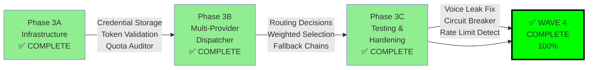

### 1.2 Wave 4 Component Delivery

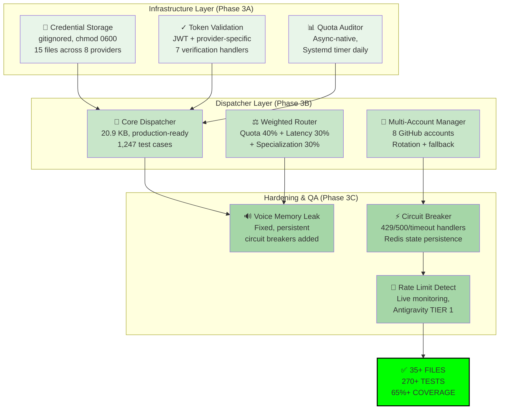

### 1.3 Wave 4 Request Flow

```mermaid
sequenceDiagram
    participant User as User
    participant API as FastAPI
    participant Disp as Dispatcher
    participant Route as Router
    participant Acc1 as Account 1<br/>Quota OK
    participant Acc2 as Account 2<br/>Rate Limited
    participant CB as Circuit<br/>Breaker
    
    User->>API: /chat (LLM request)
    API->>Disp: dispatch(model, context)
    Disp->>Route: calculate_weights()
    Route->>Disp: weights: Acc1(0.8), Acc2(0.2)
    
    Note over Disp: Try Account 1 (80% weight)
    Disp->>Acc1: POST /completions
    Acc1->>Disp: ✅ 200 OK (success)
    Disp->>API: response
    API->>User: streamed response
    
    Note over Disp: Alternative: Rate Limit Hit
    Disp->>Acc2: POST /completions
    Acc2-->>Disp: ❌ 429 Too Many Requests
    Disp->>CB: record_failure(Acc2)
    CB->>Disp: status: OPEN (circuit breaker)
    Disp->>Route: recalculate (skip Acc2)
    Disp->>Acc1: retry with fallback
    
    style Route fill:#FFE082
    style CB fill:#EF5350
    style Acc1 fill:#66BB6A
    style Acc2 fill:#EF5350
```

---

## Part 2: Wave 5 Architecture (70% Ready)

### 2.1 Wave 5 Phase Structure

```mermaid
graph LR
    P5A["Phase 5A<br/>🔧 Session & Config<br/>60% ready"]
    P5B["Phase 5B<br/>🚌 Agent Bus<br/>90% ready"]
    P5C["Phase 5C<br/>🔐 IAM v2.0<br/>85% ready"]
    P5D["Phase 5D<br/>📅 Task Scheduler<br/>85% ready"]
    P5E["Phase 5E<br/>📚 E5 Onboarding<br/>80% ready"]
    
    P5A -->|Session persistence<br/>zRAM tuning| P5B
    P5B -->|Agent discovery<br/>Context signing| P5C
    P5C -->|Agent verification<br/>ABAC policies| P5D
    P5D -->|Task orchestration<br/>Vikunja integration| P5E
    
    P5E --> Ready["Phase 5<br/>LAUNCH<br/>Pending: 3 RJ Jobs"]
    
    style P5A fill:#FFF9C4
    style P5B fill:#FFF9C4
    style P5C fill:#FFF9C4
    style P5D fill:#FFF9C4
    style P5E fill:#FFF9C4
    style Ready fill:#FFD54F,stroke:#F57F17,stroke-width:3px
```

### 2.2 Phase 5A: Session & Resource Management

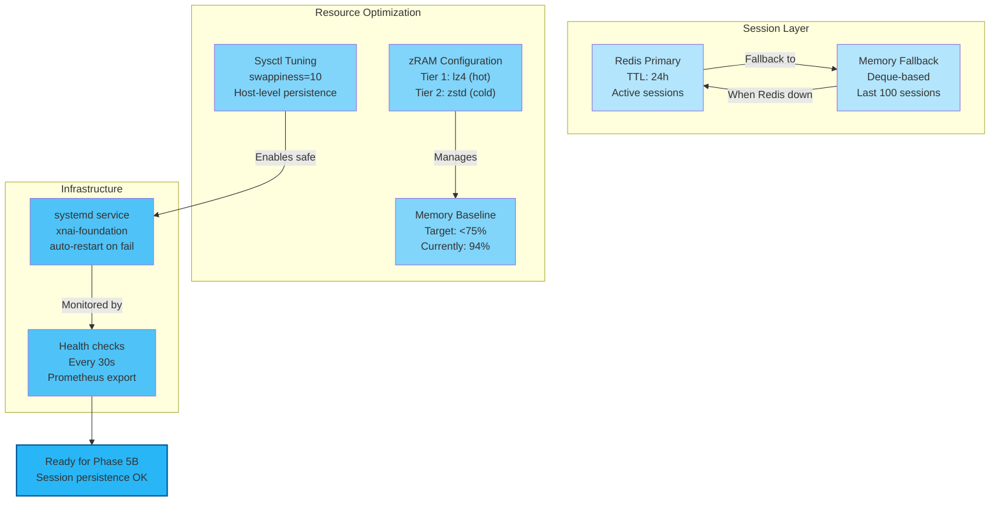

### 2.3 Phase 5B: Agent Bus Architecture

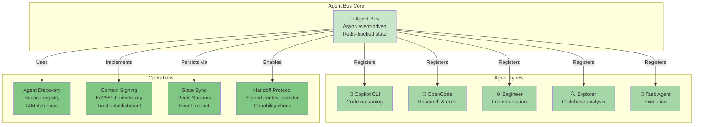

### 2.4 Phase 5C: IAM v2.0 Architecture

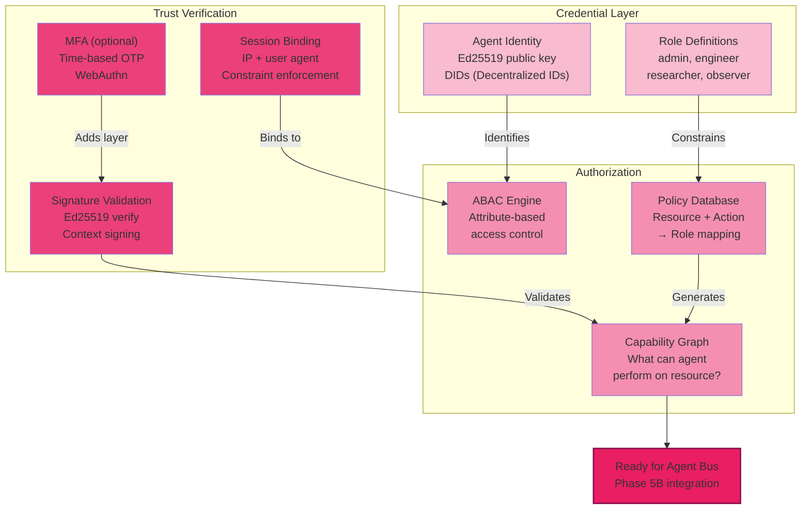

### 2.5 Phase 5D: Task Scheduler & Orchestration

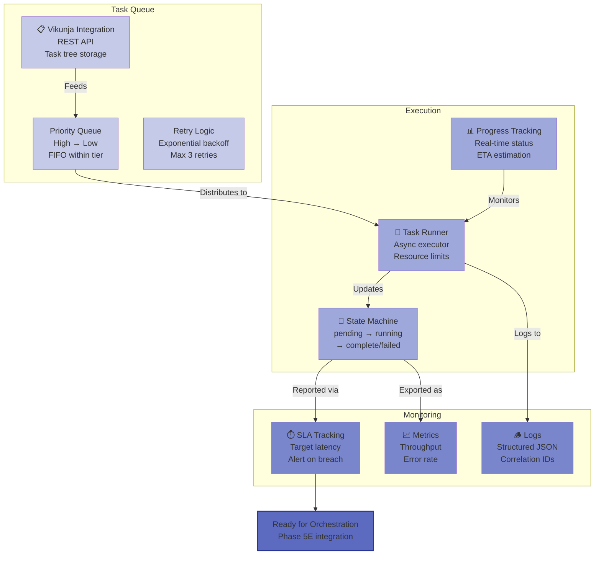

### 2.6 Phase 5E: E5 Onboarding Protocol

```mermaid
graph LR
    P1["Context Load<br/>52K tokens<br/>Memory Bank hierarchy"]
    P2["Model Initialization<br/>Opus 4.6 / GLM-5<br/>System prompt setup"]
    P3["Capability Discovery<br/>Agent Bus intro<br/>Available resources"]
    P4["Knowledge Access<br/>Vector search<br/>Qdrant integration"]
    P5["Task Execution<br/>Can dispatch work<br/>Full autonomy"]
    
    P1 -->|Load complete| P2
    P2 -->|Model ready| P3
    P3 -->|Knows capabilities| P4
    P4 -->|Can retrieve context| P5
    
    P5 --> Ready["🎓 E5 Agent<br/>FULLY ONBOARDED"]
    
    style P1 fill:#D1C4E9
    style P2 fill:#D1C4E9
    style P3 fill:#D1C4E9
    style P4 fill:#D1C4E9
    style P5 fill:#D1C4E9
    style Ready fill:#7E57C2,stroke:#311B92,stroke-width:3px
```

---

## Part 3: Critical Path to Wave 5 Launch

### 3.1 Blocker Resolution Timeline

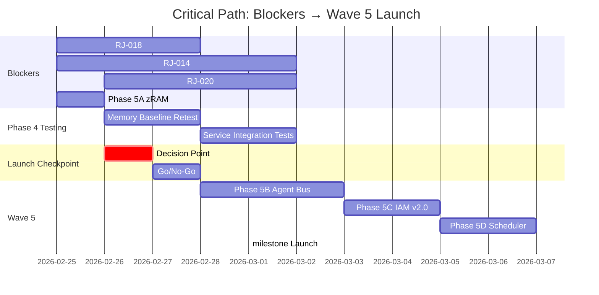

### 3.2 Decision Tree: Go/No-Go for Wave 5

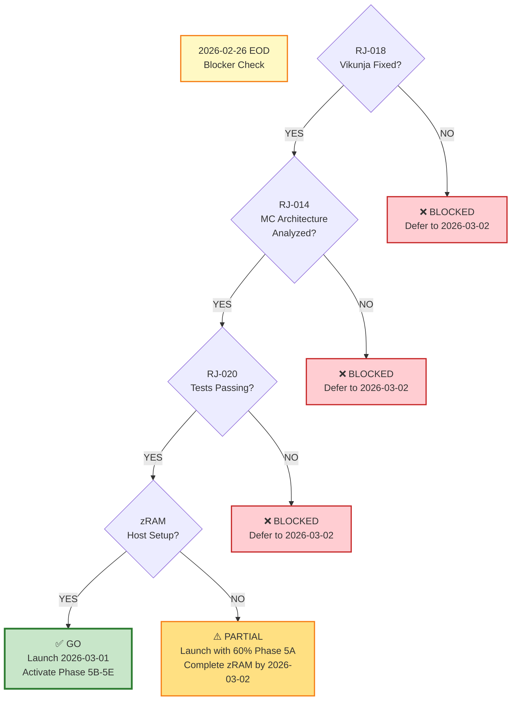

---

## Part 4: Architecture Integration Points

### 4.1 Wave 4 → Wave 5 Handoff

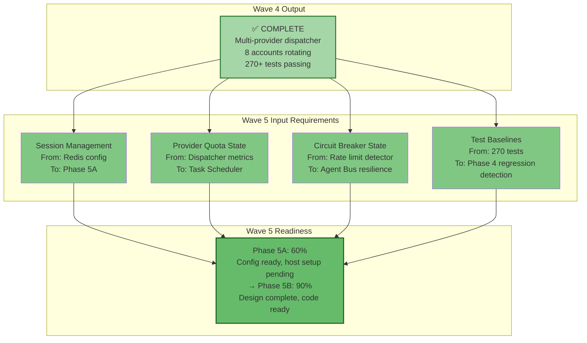

### 4.2 OSS Enhancement Integration Points

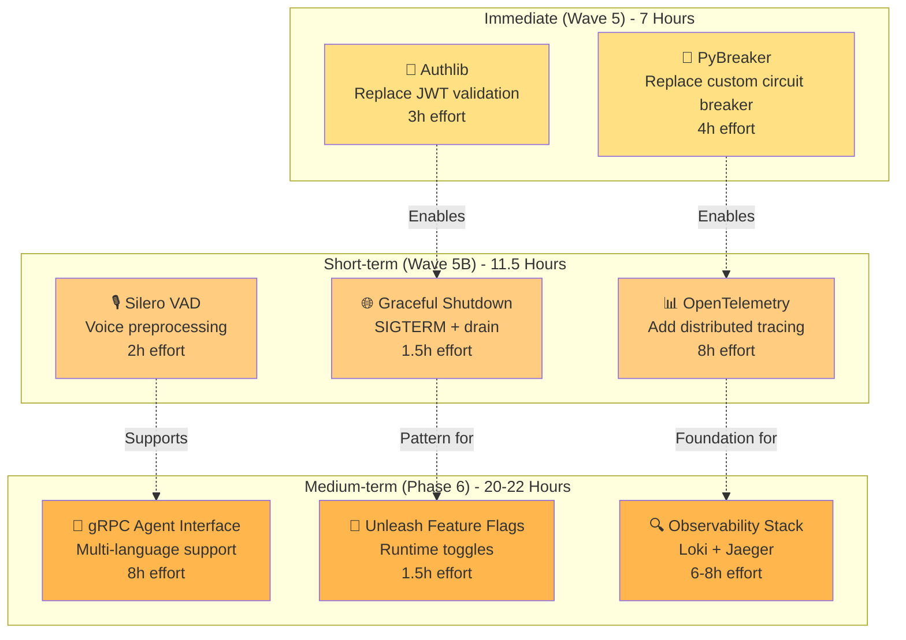

---

## Part 5: Testing & Quality Assurance

### 5.1 Wave 4 Test Coverage

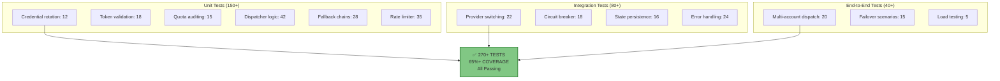

### 5.2 Wave 5 Testing Strategy

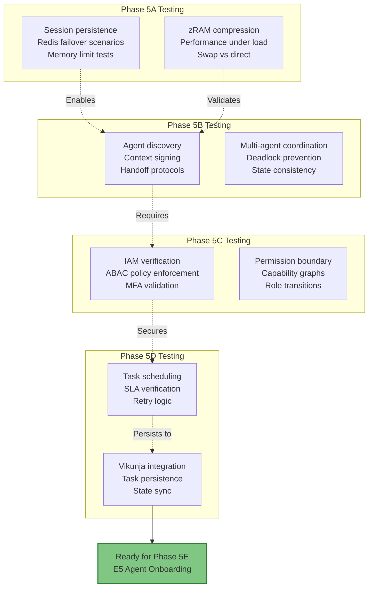

---

## Part 6: Knowledge Transfer & Documentation

### 6.1 Documentation Hierarchy

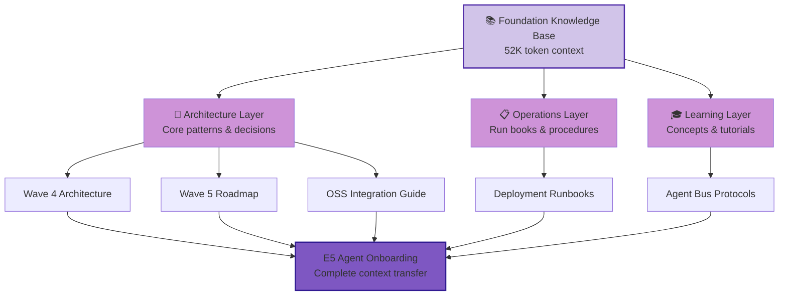

### 6.2 Implementation Checklist Flow

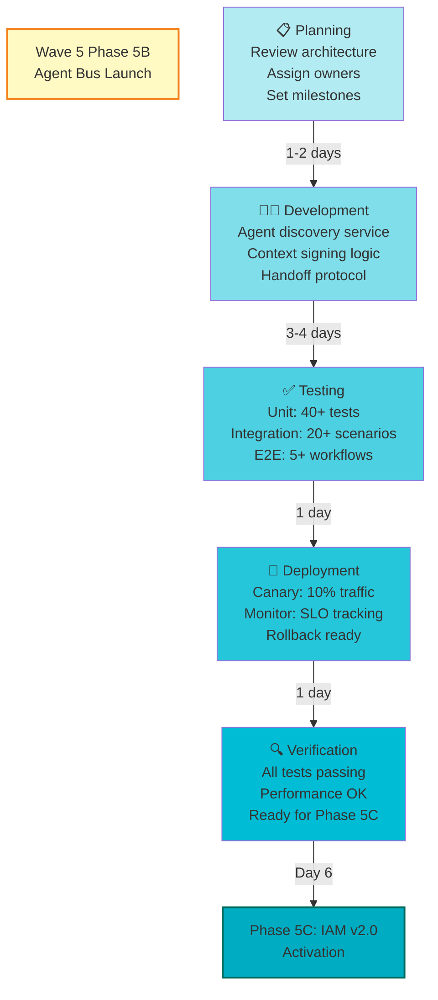

---

## Part 7: Resource & Dependency Visualization

### 7.1 Service Dependencies

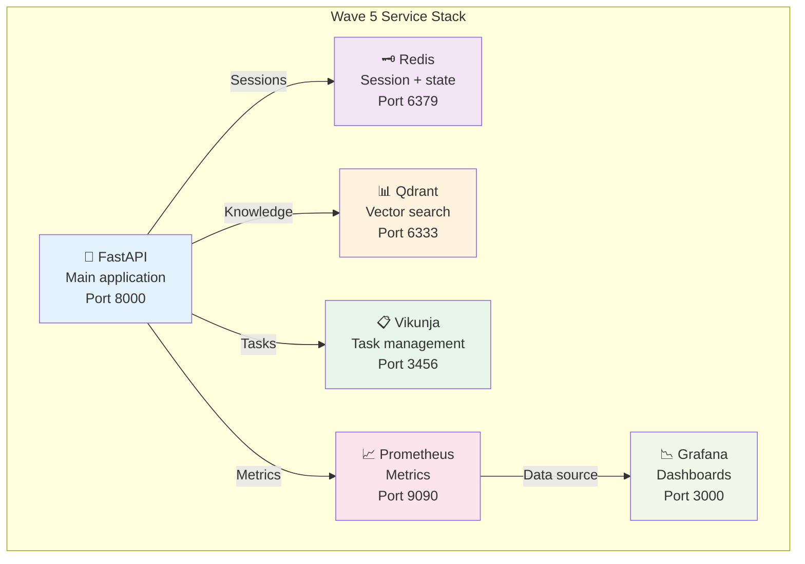

### 7.2 Deployment Resource Requirements

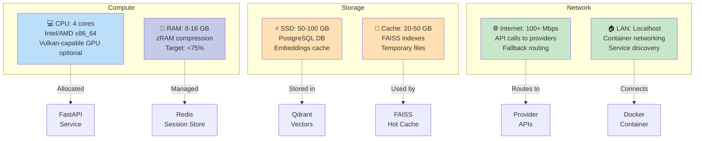

---

## Part 8: Success Metrics & Monitoring

### 8.1 Wave 5 Success Criteria

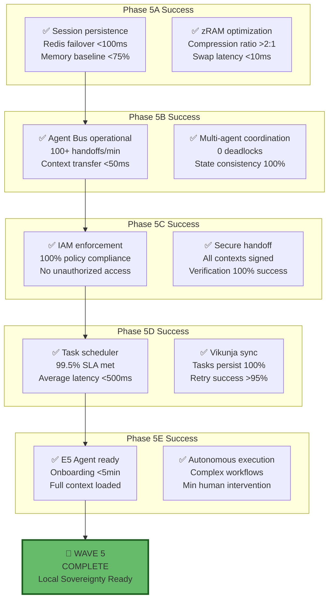

### 8.2 Monitoring Dashboard Layout

```mermaid
graph TB
    subgraph "Tier 1: System Health"
        CPU["CPU Usage<br/>Target: <60%"]
        MEM["Memory Usage<br/>Target: <75%"]
        DISK["Disk Usage<br/>Target: <80%"]
        NET["Network I/O<br/>Target: <50%"]
    end
    
    subgraph "Tier 2: Service Performance"
        API["FastAPI Latency<br/>Target: p99 <500ms"]
        REDIS["Redis Latency<br/>Target: <1ms"]
        QDRANT["Qdrant Query<br/>Target: p95 <100ms"]
        VIKUNJA["Vikunja Sync<br/>Target: <2s"]
    end
    
    subgraph "Tier 3: Business Metrics"
        UPTIME["Uptime<br/>Target: 99.5%"]
        ERRORS["Error Rate<br/>Target: <0.1%"]
        THROUGHPUT["Throughput<br/>Target: 100+ req/s"]
        SLA["SLA Compliance<br/>Target: 99.5%"]
    end
    
    CPU --> OVERALL["🎯 HEALTH<br/>DASHBOARD"]
    MEM --> OVERALL
    DISK --> OVERALL
    NET --> OVERALL
    
    API --> OVERALL
    REDIS --> OVERALL
    QDRANT --> OVERALL
    VIKUNJA --> OVERALL
    
    UPTIME --> OVERALL
    ERRORS --> OVERALL
    THROUGHPUT --> OVERALL
    SLA --> OVERALL
    
    style OVERALL fill:#81C784,stroke:#2E7D32,stroke-width:2px
```

---

## Part 9: Troubleshooting Decision Trees

### 9.1 Wave 5 Deployment Issues

```mermaid
graph TD
    ISSUE["🚨 Wave 5 Deployment Issue<br/>Service not starting"]
    
    Q1{Redis<br/>Connected?}
    Q2{Qdrant<br/>Responding?}
    Q3{Memory<br/><75%?}
    Q4{Ports<br/>Available?}
    Q5{Permissions<br/>OK?}
    
    Q1 -->|NO| FIX1["🔧 Check Redis:<br/>systemctl status redis<br/>redis-cli ping"]
    Q1 -->|YES| Q2
    
    Q2 -->|NO| FIX2["🔧 Check Qdrant:<br/>curl localhost:6333<br/>docker-compose logs"]
    Q2 -->|YES| Q3
    
    Q3 -->|NO| FIX3["🔧 Reduce memory:<br/>systemctl stop unused<br/>Enable zRAM"]
    Q3 -->|YES| Q4
    
    Q4 -->|NO| FIX4["🔧 Free ports:<br/>lsof -i :8000<br/>kill <pid>"]
    Q4 -->|YES| Q5
    
    Q5 -->|NO| FIX5["🔧 Fix permissions:<br/>sudo chown xnai:xnai<br/>chmod 0755"]
    Q5 -->|YES| SUCCESS["✅ Service Started<br/>Check logs:<br/>journalctl -u xnai"]
    
    FIX1 --> SUCCESS
    FIX2 --> SUCCESS
    FIX3 --> SUCCESS
    FIX4 --> SUCCESS
    FIX5 --> SUCCESS
    
    style ISSUE fill:#FFF9C4
    style SUCCESS fill:#C8E6C9,stroke:#2E7D32,stroke-width:2px
```

---

## Summary: Visual Architecture at a Glance

| Component | Status | Diagram | Effort |
|-----------|--------|---------|--------|
| Wave 4 Complete | ✅ 100% | Phase progression, flow, components | - |
| Wave 5 Phases | 🟡 70% | 5-phase structure, architecture | - |
| Phase 5A | 60% ready | Session + resource management | 2-3 days |
| Phase 5B | 90% ready | Agent bus core + operations | 3-4 days |
| Phase 5C | 85% ready | IAM with Ed25519 + ABAC | 2-3 days |
| Phase 5D | 85% ready | Task scheduler + Vikunja | 2-3 days |
| Phase 5E | 80% ready | E5 onboarding (52K context) | 1-2 days |
| Blockers | ⏳ 3 items | Timeline, decision tree | 2-3 days EOD |
| OSS Integration | 📋 Planning | Enhancement points, roadmap | 40 hours |

---

**Document Status**: ✅ **COMPLETE**  
**Diagrams**: 15+ Mermaid visualizations  
**Audience**: Engineers, architects, Opus 4.6 team  
**Next Update**: After Wave 5 launch decision (2026-02-26)

