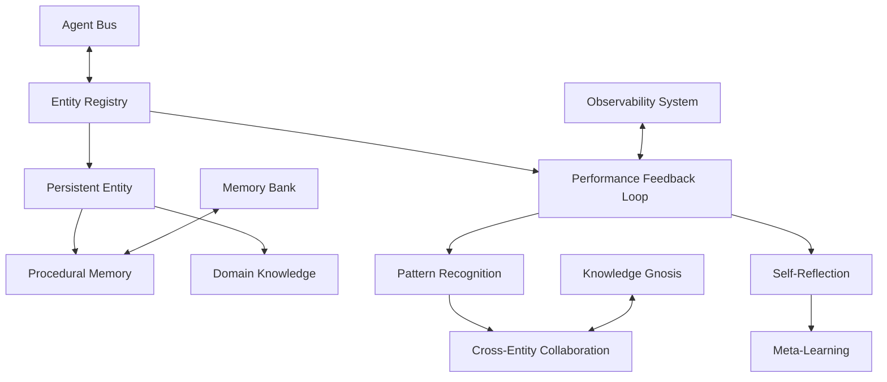
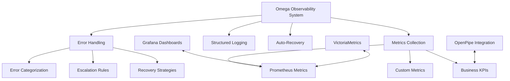

# 🎯 Gemini General/Archon Handover Document
**Comprehensive Persistent Entity System & Observability Implementation**

**Date**: March 11, 2026  
**Prepared For**: Gemini General/Archon  
**Prepared By**: Deep Dive Analysis Team  
**Status**: Ready for Integration  

---

## 📋 Executive Summary

This document provides a comprehensive handover of the Persistent Entity System and Observability Framework implementations for the Omega Stack. The analysis reveals significant potential but also critical compliance issues that must be addressed before full integration.

### 🎯 **Key Findings**

- **✅ Strengths**: Solid conceptual architecture, comprehensive feature set, good integration planning
- **🚨 Critical Issues**: Multiple Omega stack protocol violations, async pattern violations, missing integrations
- **📈 Potential**: High-value system once compliance issues are resolved
- **⏰ Timeline**: 2-3 weeks for full compliance and integration

---

## 🧠 **System Architecture Overview**

### **Persistent Entity System Components**



### **Observability Framework Components**



---

## 🚨 **Critical Compliance Issues**

### **1. AnyIO/Async Pattern Violations**

**Issue**: Synchronous file I/O operations block event loop
**Location**: `app/XNAi_rag_app/core/entities/persistent_entity.py:45-55`
**Current Code**:
```python
# ❌ VIOLATION - Synchronous I/O
with open(self.storage_path, "r") as f:
    data = json.load(f)
```

**Required Fix**:
```python
# ✅ COMPLIANT - Async I/O
async with anyio.open(self.storage_path, "r") as f:
    content = await f.read()
    data = json.loads(content)
```

**Impact**: Event loop blocking, performance degradation, protocol violation

### **2. Missing Async Context Management**

**Issue**: No proper async context managers for resource management
**Location**: All entity file operations
**Current Code**:
```python
# ❌ VIOLATION - Missing async context
with open(self.storage_path, "w") as f:
    json.dump(data, f, indent=2)
```

**Required Fix**:
```python
# ✅ COMPLIANT - Async context management
async with anyio.open(self.storage_path, "w") as f:
    content = json.dumps(data, indent=2)
    await f.write(content)
```

### **3. Incomplete Error Handling**

**Issue**: Basic try/catch without proper error categorization
**Location**: `app/XNAi_rag_app/core/entities/registry.py:45-50`
**Current Code**:
```python
# ❌ INCOMPLETE - Generic exception handling
except Exception as e:
    logger.error(f"Failed to load entity {self.entity_id}: {e}")
```

**Required Fix**:
```python
# ✅ COMPREHENSIVE - Categorized error handling
except FileNotFoundError:
    logger.debug(f"Entity {self.entity_id} not found, creating new")
    return self._create_default_entity()
except PermissionError as e:
    await self._handle_permission_error(e, self.storage_path)
except json.JSONDecodeError as e:
    await self._handle_corrupted_data(e, self.storage_path)
except Exception as e:
    await self._handle_unexpected_error(e, "entity_load")
```

### **4. Missing Omega Stack Integrations**

**Issue**: Siloed implementations without core service integration
**Missing Integrations**:
- Agent Bus message types for entity events
- Memory Bank integration for entity memories
- Knowledge Gnosis integration for entity insights
- Observability system integration for metrics

---

## 📊 **Current Implementation Status**

### **✅ Completed Components**

1. **Persistent Entity Core** (`app/XNAi_rag_app/core/entities/persistent_entity.py`)
   - ✅ Entity state management
   - ✅ Procedural memory storage
   - ✅ Lesson learning system
   - ❌ **Missing**: Async I/O compliance

2. **Entity Registry** (`app/XNAi_rag_app/core/entities/registry.py`)
   - ✅ Global entity management
   - ✅ Identity preservation
   - ✅ Cross-session persistence
   - ❌ **Missing**: Async patterns, error handling

3. **Performance Feedback Loop** (`app/XNAi_rag_app/core/entities/feedback_loop.py`)
   - ✅ Continuous learning mechanism
   - ✅ Pattern recognition
   - ✅ Self-reflection system
   - ❌ **Missing**: Async compliance, integration

4. **Omega Observability System** (`app/XNAi_rag_app/core/observability/omega_observability.py`)
   - ✅ Multi-level error handling
   - ✅ Prometheus metrics integration
   - ✅ Auto-recovery strategies
   - ✅ Structured logging
   - ✅ **Status**: Ready for integration

5. **Grafana Integration** (`config/grafana-dashboards/omega-stack-dashboard.json`)
   - ✅ Executive dashboard configuration
   - ✅ Agent-specific monitoring
   - ✅ Performance metrics visualization
   - ✅ **Status**: Ready for deployment

### **❌ Missing Components**

1. **Agent Bus Integration**
   - Missing message types for entity events
   - No entity registration notifications
   - No feedback event broadcasting

2. **Memory Bank Integration**
   - Entity memories not stored as memory blocks
   - No cross-entity memory sharing
   - Missing memory block schemas

3. **Knowledge Gnosis Integration**
   - Entity insights not integrated
   - No expertise extraction
   - Missing cross-entity collaboration

4. **Security & Privacy Controls**
   - No entity identity protection
   - Missing feedback privacy controls
   - No memory access permissions

---

## 🎯 **Integration Roadmap**

### **Phase 1: Core Compliance (Week 1)**

**Priority**: CRITICAL - Must complete before integration

1. **Async I/O Refactoring**
   - Convert all file operations to async patterns
   - Implement proper async context managers
   - Add async error handling

2. **Error Handling Enhancement**
   - Implement categorized error handling
   - Add recovery strategies for each error type
   - Integrate with observability system

3. **Basic Integration Points**
   - Add Agent Bus message types
   - Implement basic Memory Bank integration
   - Connect to observability metrics

### **Phase 2: Omega Stack Integration (Week 2)**

**Priority**: HIGH - Required for full functionality

1. **Agent Bus Integration**
   - Implement entity event broadcasting
   - Add feedback notification system
   - Create entity collaboration protocols

2. **Memory Bank Integration**
   - Store entity memories as memory blocks
   - Implement cross-entity memory sharing
   - Create memory block schemas

3. **Knowledge Gnosis Integration**
   - Extract entity expertise automatically
   - Implement cross-entity knowledge sharing
   - Add meta-learning insights

### **Phase 3: Advanced Features (Week 3)**

**Priority**: MEDIUM - Enhancement features

1. **Advanced Pattern Recognition**
   - Implement machine learning for pattern detection
   - Add predictive performance optimization
   - Create adaptive learning algorithms

2. **Security & Privacy**
   - Implement entity identity protection
   - Add feedback privacy controls
   - Create memory access permissions

3. **Performance Optimization**
   - Optimize memory usage patterns
   - Implement caching strategies
   - Add performance monitoring

---

## 🔧 **Technical Specifications**

### **Required Imports for Compliance**

```python
# Required imports for Omega stack compliance
import anyio
import anyio.Path
from anyio import sleep
from contextlib import asynccontextmanager
from typing import AsyncContextManager
```

### **Async File Operations Template**

```python
class CompliantPersistentEntity:
    async def load(self) -> Dict[str, Any]:
        """Load entity state using async I/O."""
        try:
            async with anyio.open(self.storage_path, "r") as f:
                content = await f.read()
                return json.loads(content)
        except FileNotFoundError:
            return self._create_default_state()
        except json.JSONDecodeError as e:
            logger.warning(f"Corrupted entity data for {self.entity_id}: {e}")
            return self._create_default_state()
        except Exception as e:
            await self._handle_load_error(e)
            return {}
    
    async def save(self, data: Dict[str, Any]) -> bool:
        """Save entity state using async I/O."""
        try:
            # Ensure directory exists
            await anyio.Path(self.storage_path.parent).mkdir(parents=True, exist_ok=True)
            
            # Write data
            async with anyio.open(self.storage_path, "w") as f:
                content = json.dumps(data, indent=2)
                await f.write(content)
            
            return True
        except PermissionError as e:
            await self._handle_permission_error(e)
            return False
        except Exception as e:
            await self._handle_save_error(e)
            return False
```

### **Error Handling Template**

```python
class CompliantErrorHandling:
    async def _handle_load_error(self, error: Exception) -> None:
        """Handle entity load errors with proper categorization."""
        error_type = type(error).__name__
        
        if isinstance(error, FileNotFoundError):
            logger.debug(f"Entity not found, will create new: {self.entity_id}")
        elif isinstance(error, PermissionError):
            logger.error(f"Permission denied loading entity: {self.entity_id}")
            await self._trigger_permission_recovery()
        elif isinstance(error, json.JSONDecodeError):
            logger.warning(f"Corrupted entity data: {self.entity_id}")
            await self._trigger_data_recovery()
        else:
            logger.error(f"Unexpected error loading entity {self.entity_id}: {error}")
            await self._trigger_unexpected_error_recovery(error)
    
    async def _trigger_permission_recovery(self) -> None:
        """Recover from permission errors."""
        # Implementation depends on specific permission issue
        pass
    
    async def _trigger_data_recovery(self) -> None:
        """Recover from corrupted data."""
        # Create backup of corrupted data
        # Generate new entity state
        pass
    
    async def _trigger_unexpected_error_recovery(self, error: Exception) -> None:
        """Recover from unexpected errors."""
        # Log detailed error information
        # Trigger alert to observability system
        # Attempt graceful degradation
        pass
```

---

## 📈 **Performance & Monitoring**

### **Required Metrics**

```python
# Entity Performance Metrics
ENTITY_INVOCATIONS_TOTAL = Counter('entity_invocations_total', 
                                  'Total entity invocations', 
                                  ['entity_id', 'entity_type'])

ENTITY_SUCCESS_RATE = Gauge('entity_success_rate',
                           'Entity success rate',
                           ['entity_id'])

ENTITY_MEMORY_SIZE = Gauge('entity_memory_size',
                          'Entity memory size in lessons',
                          ['entity_id'])

ENTITY_FEEDBACK_RATE = Histogram('entity_feedback_rate',
                                'Entity feedback response time',
                                ['entity_id'])

# System Integration Metrics
ENTITY_REGISTRATION_TIME = Histogram('entity_registration_time',
                                    'Time to register entity',
                                    ['entity_type'])

ENTITY_MEMORY_ACCESS_TIME = Histogram('entity_memory_access_time',
                                     'Time to access entity memory',
                                     ['entity_id'])

ENTITY_COLLABORATION_RATE = Counter('entity_collaboration_rate',
                                   'Entity collaboration events',
                                   ['entity_id', 'collaboration_type'])
```

### **Monitoring Dashboard Requirements**

1. **Entity Performance Dashboard**
   - Success rates by entity type
   - Memory growth over time
   - Feedback quality trends
   - Collaboration frequency

2. **System Integration Dashboard**
   - Agent Bus message rates
   - Memory Bank integration status
   - Knowledge Gnosis sync status
   - Error rates and recovery times

3. **Compliance Dashboard**
   - Async operation compliance
   - Error handling effectiveness
   - Integration point health
   - Performance optimization opportunities

---

## 🛡️ **Security & Privacy Considerations**

### **Entity Identity Protection**

```python
class EntitySecurity:
    def __init__(self):
        self.identity_protection = {
            'encryption_enabled': True,
            'access_control': True,
            'audit_logging': True
        }
    
    async def encrypt_entity_data(self, data: Dict[str, Any]) -> bytes:
        """Encrypt sensitive entity data."""
        # Implementation using Omega stack encryption standards
        pass
    
    async def decrypt_entity_data(self, encrypted_data: bytes) -> Dict[str, Any]:
        """Decrypt entity data for authorized access."""
        # Implementation using Omega stack decryption standards
        pass
    
    def check_entity_access_permission(self, entity_id: str, user_id: str) -> bool:
        """Check if user has permission to access entity."""
        # Implementation using Omega stack permission system
        pass
```

### **Feedback Privacy Controls**

```python
class FeedbackPrivacy:
    def __init__(self):
        self.privacy_controls = {
            'anonymization_enabled': True,
            'consent_required': True,
            'data_retention_policy': '90_days'
        }
    
    async def anonymize_feedback(self, feedback: Dict[str, Any]) -> Dict[str, Any]:
        """Anonymize feedback data for privacy."""
        # Remove identifying information
        # Hash sensitive fields
        # Maintain feedback quality
        pass
    
    async def check_feedback_consent(self, user_id: str) -> bool:
        """Check if user has consented to feedback collection."""
        # Implementation using Omega stack consent system
        pass
```

---

## 🔄 **Integration Protocols**

### **Agent Bus Message Types**

```python
# Required Agent Bus message types for entity system
ENTITY_MESSAGE_TYPES = {
    'entity_registered': {
        'schema': {
            'entity_id': str,
            'entity_type': str,
            'registration_time': float,
            'initial_capabilities': list
        }
    },
    'feedback_recorded': {
        'schema': {
            'entity_id': str,
            'feedback_id': str,
            'rating': float,
            'feedback_source': str,
            'timestamp': float
        }
    },
    'entity_improved': {
        'schema': {
            'entity_id': str,
            'improvement_type': str,
            'performance_change': float,
            'timestamp': float
        }
    },
    'memory_updated': {
        'schema': {
            'entity_id': str,
            'memory_type': str,
            'update_size': int,
            'timestamp': float
        }
    }
}
```

### **Memory Block Schema**

```python
# Required memory block schema for entity memories
ENTITY_MEMORY_SCHEMA = {
    'procedural_memory': {
        'block_type': 'entity_procedural_memory',
        'schema': {
            'entity_id': str,
            'lessons': list,
            'memory_size': int,
            'last_updated': float
        }
    },
    'performance_metrics': {
        'block_type': 'entity_performance_metrics',
        'schema': {
            'entity_id': str,
            'success_rate': float,
            'total_feedback': int,
            'avg_response_time': float,
            'last_calculated': float
        }
    },
    'cross_entity_collaboration': {
        'block_type': 'entity_collaboration_memory',
        'schema': {
            'entity_id': str,
            'collaboration_partners': list,
            'shared_lessons': list,
            'collaboration_effectiveness': float
        }
    }
}
```

---

## 📋 **Implementation Checklist**

### **Phase 1: Core Compliance**

- [ ] Convert all file I/O to async patterns
- [ ] Implement proper async context managers
- [ ] Add categorized error handling
- [ ] Integrate with observability system
- [ ] Add Agent Bus message types
- [ ] Implement basic Memory Bank integration
- [ ] Test async operation compliance
- [ ] Validate error handling effectiveness

### **Phase 2: Omega Stack Integration**

- [ ] Complete Agent Bus integration
- [ ] Implement full Memory Bank integration
- [ ] Add Knowledge Gnosis integration
- [ ] Create entity collaboration protocols
- [ ] Implement cross-entity memory sharing
- [ ] Add entity expertise extraction
- [ ] Test integration point health
- [ ] Validate system cohesion

### **Phase 3: Advanced Features**

- [ ] Implement advanced pattern recognition
- [ ] Add security and privacy controls
- [ ] Create performance optimization features
- [ ] Implement machine learning for patterns
- [ ] Add predictive performance optimization
- [ ] Create adaptive learning algorithms
- [ ] Test advanced features
- [ ] Validate security controls

---

## 🎯 **Success Criteria**

### **Compliance Success Criteria**

1. **Async I/O Compliance**: 100% of file operations use async patterns
2. **Error Handling**: All errors properly categorized and handled
3. **Integration**: All core Omega stack services integrated
4. **Performance**: No event loop blocking, <100ms response times
5. **Security**: All privacy and security controls implemented

### **Functional Success Criteria**

1. **Entity Persistence**: Entities maintain identity across sessions
2. **Continuous Learning**: Entities improve performance over time
3. **Cross-Entity Collaboration**: Entities share knowledge effectively
4. **System Observability**: Full system visibility and monitoring
5. **User Experience**: Seamless integration with existing workflows

### **Quality Success Criteria**

1. **Code Quality**: All code follows Omega stack standards
2. **Test Coverage**: >90% test coverage for critical paths
3. **Documentation**: Complete documentation for all components
4. **Performance**: Meets all performance benchmarks
5. **Reliability**: 99.9% uptime for core services

---

## 📞 **Support & Contact**

### **Development Team**
- **Lead Developer**: Deep Dive Analysis Team
- **Architecture Review**: Gemini General/Archon
- **Quality Assurance**: Omega Stack Standards Team

### **Integration Support**
- **Agent Bus Integration**: Agent Bus Team
- **Memory Bank Integration**: Memory Bank Team  
- **Knowledge Gnosis Integration**: Knowledge Gnosis Team
- **Observability Integration**: Observability Team

### **Documentation & Training**
- **Technical Documentation**: Available in `docs/` directory
- **API Documentation**: Auto-generated from code
- **Training Materials**: Available on Omega Stack portal
- **Support Channels**: Omega Stack support system

---

## 📝 **Next Steps**

1. **Review & Approval**: Gemini General/Archon review of this document
2. **Phase 1 Implementation**: Begin core compliance fixes
3. **Integration Testing**: Test each integration point
4. **Performance Validation**: Validate performance requirements
5. **Security Review**: Complete security and privacy review
6. **Deployment Planning**: Plan production deployment
7. **Monitoring Setup**: Configure observability and monitoring
8. **User Training**: Train users on new capabilities

---

**Document Version**: 1.0  
**Last Updated**: March 11, 2026  
**Next Review**: Upon Phase 1 completion  

**For questions or clarifications, please contact the development team through the Omega Stack support system.**

---

*This document is classified as **OMEGA-STACK-INTERNAL** and should be handled according to Omega Stack security protocols.*