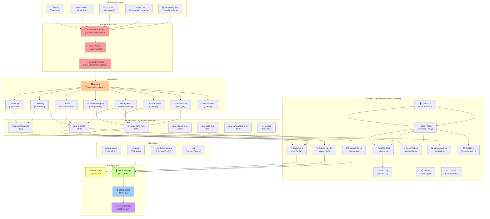
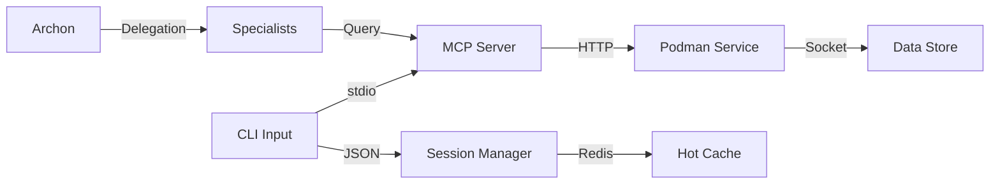
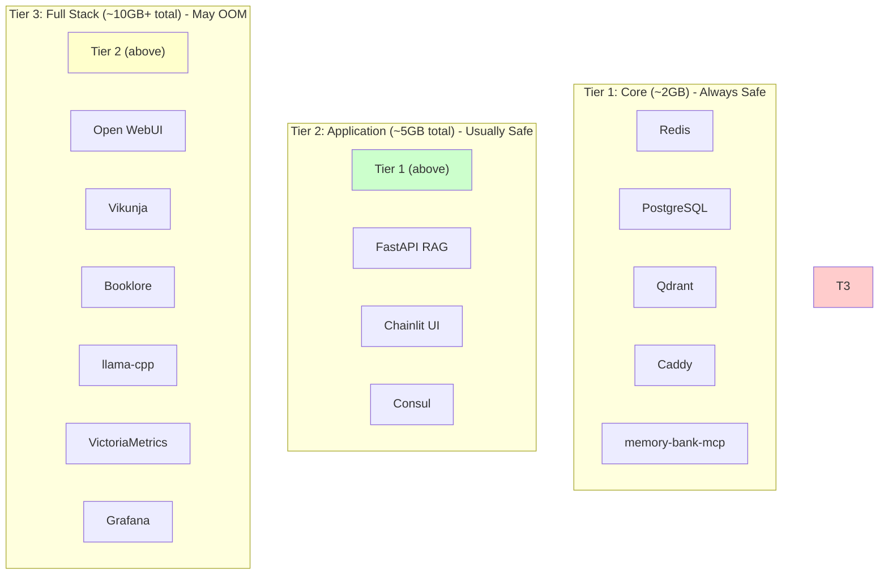
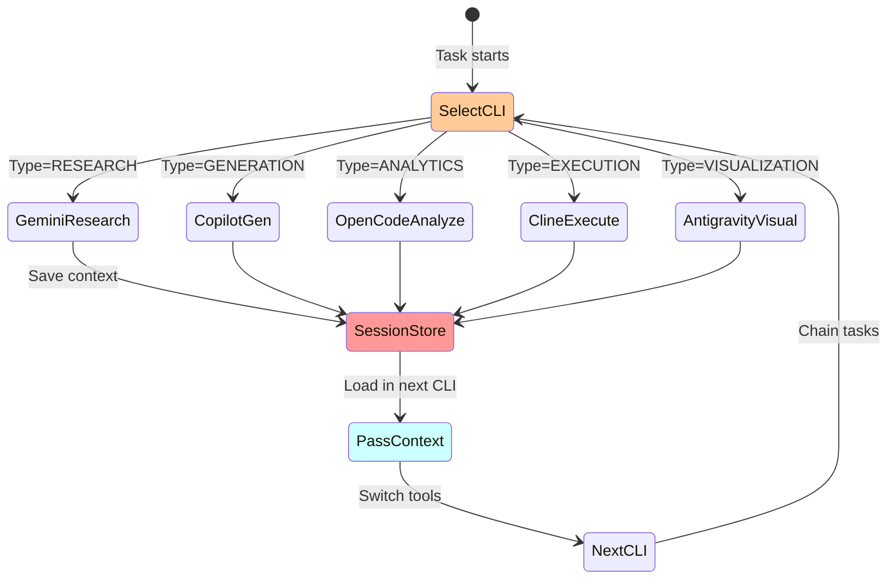
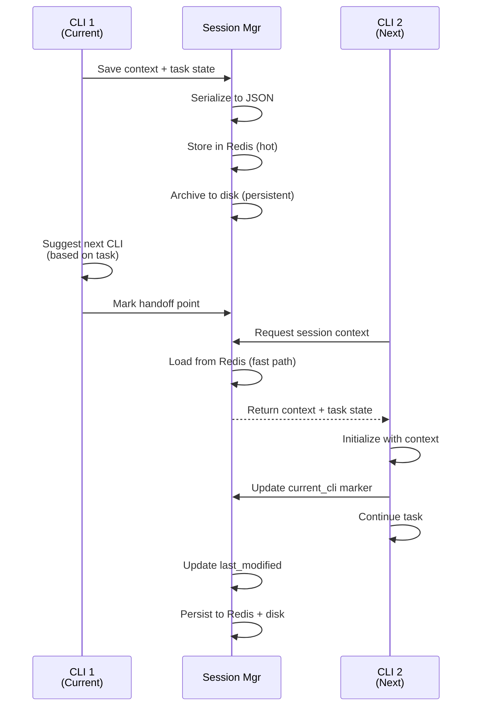
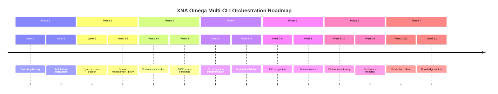

# 🔱 XNA OMEGA STACK — COMPLETE SYSTEM KNOWLEDGE MAP v1.0

**Status**: Framework Complete | Knowledge Gaps Identified | Ready for Gemini CLI Context Injection

**Document Purpose**: Master reference for all XNA Omega systems, designed to be updated iteratively rather than replaced.

---

## 📑 TABLE OF CONTENTS

1. [Executive Summary](#1-executive-summary)
2. [System Architecture Overview](#2-system-architecture-overview)
3. [Current Understanding of XNA Omega](#3-current-understanding-of-xna-omega)
4. [Infrastructure Foundation](#4-infrastructure-foundation)
5. [Multi-CLI Ecosystem](#5-multi-cli-ecosystem)
6. [Session Management Strategy](#6-session-management-strategy)
7. [Knowledge Systems & Memory](#7-knowledge-systems--memory)
8. [Critical Knowledge Gaps](#8-critical-knowledge-gaps)
9. [Roadmap & Implementation Phases](#9-roadmap--implementation-phases)
10. [Artifact Update Framework](#10-artifact-update-framework)

---

## 1. EXECUTIVE SUMMARY

### 1.1 What We Have

```
XNA Omega Stack = Sovereign AI Development Platform
├── Hardware: Ryzen 5700U (8-core), 6.6GB RAM, CPU-only
├── Containerization: Podman 5.4.2 rootless (16+ services)
├── Development Tool: 5-CLI polyglot orchestration system
├── Intelligence Layer: 8-specialist agent system + Archon oversoul
├── Memory Systems: Redis + SQLite + MCP servers
└── Language: Python 3.12 (being standardized)
```

### 1.2 What We're Building

A **unified multi-CLI development environment** where:
- 5 specialized CLI tools work seamlessly together
- Session context flows between CLIs without manual passing
- Infrastructure is optimized (Python 3.12 slim images, reduced footprint)
- All work is auditable and reversible
- Agents can coordinate across the entire stack

### 1.3 Current State

| Component | Status | Confidence |
|-----------|--------|-----------|
| Architecture Design (ARCH-01/02) | ✅ EXCELLENT | 95% |
| Podman Setup + Permissions | ✅ FIXED | 90% |
| MCP Server Layer | ✅ FUNCTIONAL | 80% |
| Multi-CLI Integration | 🟡 PARTIAL | 40% |
| Session Management | 🟡 PARTIAL | 30% |
| Infrastructure Optimization | 🟡 PARTIAL | 25% |

**Overall Readiness**: 40-50% (strong foundation, missing coordination layer)

---

## 2. SYSTEM ARCHITECTURE OVERVIEW

### 2.1 The Complete Stack Diagram



### 2.2 Data Flow Hierarchy

```
User Input (CLI)
    ↓
Session Manager (retrieve context)
    ↓
CLI Router (determine handler)
    ↓
Appropriate Specialist Agent (via Archon)
    ↓
MCP Server Layer (execute action)
    ↓
Backend Service (Redis/Postgres/Qdrant)
    ↓
Storage Layer (Hot → Warm → Cold → Frozen)
    ↓
Output to CLI
    ↓
Session Manager (persist state)
    ↓
Return to User
```

### 2.3 Integration Points (Critical)



---

## 3. CURRENT UNDERSTANDING OF XNA OMEGA

### 3.1 From ARCH-01 (Architecture Document)

**What We Know** ✅:

1. **Archon (Gemini General, facet-4)**
   - Polymath oversoul with 1M token context
   - Access to all MCP servers
   - Master orchestrator for 8 specialists
   - Uses INTEGRATION synthesis protocol

2. **8 Specialist Agents**
   ```
   Researcher (facet-1)      → Literature synthesis, hypothesis generation
   Engineer (facet-2)        → Code review, algorithm design, refactoring
   Infrastructure (facet-3)  → DevOps, containers, networking, IaC
   Creator (facet-5)         → Technical writing, content strategy
   DataScientist (facet-6)   → Statistics, ML, visualization
   Security (facet-7)        → Threat modeling, CVE analysis
   DevOps (facet-8)          → SRE, monitoring, incident response
   General-Legacy (facet-9)  → Backward compatibility
   ```

3. **Three Invocation Patterns**
   - **Pattern 1**: Native Subagent (`/agent <facet-name>`)
   - **Pattern 2**: Shell Subprocess (`gemini -p "prompt" --yolo`)
   - **Pattern 3**: MCP Agentbus (async delegation via HTTP)

4. **INTEGRATION Synthesis Protocol**
   ```
   I - Integrate findings
   N - Note conflicts
   T - Triangulate truth
   E - Elevate insights
   G - Gap-fill
   R - Rank recommendations
   A - Act (define plan)
   T - Track (monitoring)
   E - Evolve (update model)
   ```

### 3.2 From PODMAN_PERMISSIONS Documents

**Podman Configuration** ✅:

```
Podman Version:    5.4.2 (rootless)
User:              arcana-novai (UID 1000)
Subuid Range:      100000:65536
Container Root:    UID 0 → Host UID 100000
Container User 999: UID 999 → Host UID 100999
Issue (FIXED):     Files owned by 100999, not writable by 1000
Solution:          Change ownership via fix-permissions-immediate.sh
Status:            ✅ RESOLVED
```

**Best Practices** ✅:
- Use `--userns=keep-id` for shared volumes
- Use `docker-compose` with `userns_mode: keep-id`
- Volume mount options: `:Z`, `:z`, `:U` flags
- Storage driver: overlay2
- Network: Bridge mode (xnai_network)

### 3.3 From omega_stack_review.md (Opus 4.6 Audit)

**Service Status**:

| Service | Version | Status | Notes |
|---------|---------|--------|-------|
| Redis | 7.4.1 | ✅ Healthy | 3h+ uptime, password auth working |
| Qdrant | v1.13.1 | ⚠️ Restart loop | Need to diagnose |
| PostgreSQL | 15 | ✅ (assumed) | No recent issues |
| FastAPI RAG | - | ✅ (assumed) | Core inference service |
| llama-cpp | - | ✅ (assumed) | Local LLM |

**MCP Servers Analysis**:
- memory-bank-mcp: ✅ Strong (after MCP fixes)
  - 3-tier architecture (Hot/Warm/Cold)
  - Fallback system (circuit breaker pattern)
  - FTS5 search + agent registry
  - Performance metrics built-in

**Critical Bugs Fixed**:
- ✅ Missing `import asyncio`
- ✅ Non-existent `server.add_tool()` method
- ✅ Redis URL missing password
- ✅ Docker image never built (use script instead)

**Remaining Issues**:
- 🟡 `ToolResultContent` vs `TextContent` (non-standard)
- 🟡 `datetime` serialization in AgentCapability
- 🟡 Background task lifecycle with asyncio/anyio
- 🔴 Qdrant restart loop (needs investigation)

### 3.4 Storage Architecture (Tiered)

```
HOT   (Redis, 7 days)
├─ Active agent sessions
├─ In-flight requests
├─ Real-time coordination
└─ TTL-evicted after 7 days

WARM  (SSD, 90 days)
├─ ~/omega_library (working knowledge)
├─ ~/.gemini/memory/ (active memory)
├─ embeddings/ (recent vectors)
└─ Compressed to COLD after 90 days

COLD  (External HDD, 2 years)
├─ _archive/{YYYY-MM}/ (aged files)
├─ Historical sessions
└─ Backup snapshots

FROZEN (S3/Offline, 7 years)
├─ Audit-signed models
├─ Compliance archives
└─ Immutable decision records
```

### 3.5 Memory Bank Structure (From Earlier Prompt)

```
~/.gemini/memory/
├─ archon_worldmodel.md
│  └─ Persistent facts (updated with each synthesis)
├─ archon_session_YYYY-MM-DD-HHmmss.md
│  └─ Session transcript + decisions
├─ facet_expertise_{facet}.md
│  └─ Per-facet domain knowledge snapshot
├─ audit.log (JSON lines)
│  └─ Sha256-signed action log
└─ ~/.config/podman-permissions-backup/
   └─ State snapshots (permission fix tracking)
```

---

## 4. INFRASTRUCTURE FOUNDATION

### 4.1 Hardware Constraints (Critical)

```yaml
CPU:      Ryzen 5700U (8-core, no GPU, Vulkan-capable)
RAM:      6.6GB physical + 8GB swap
Storage:  
  - Root: ~93% full (⚠️ CRITICAL)
  - omega_library: 110GB @ 40%
  - omega_vault: 16GB @ 75%
  - External HDD: 116GB (cold storage)
Network:  Air-gapped (local-first, no telemetry)
Security: AppArmor enforcing (SELinux inactive)
```

**Ram Implications**:
- Total available: ~14.6GB (physical + swap)
- Podman overhead: ~1GB for base services
- Available for services: ~13.6GB
- Tiered startup strategy: Core (2GB) → App (5GB) → Full (10GB+)

### 4.2 Podman Service Architecture



### 4.3 Python Version Audit (NEEDS VERIFICATION)

**Current State** ❓:
```
Need to audit all services for Python versions:
├─ Base images in use (python:3.12-slim? 3.11? 3.10?)
├─ Virtual environments (~/.venv, .venv_mcp, etc.)
├─ Application Python requirements
└─ MCP server dependencies
```

**Target State** 🎯:
```
All services standardized on:
├─ python:3.12-slim (150MB) - Primary choice
├─ python:3.12-alpine (100MB) - If build tools not needed
└─ distroless/python3.12 (80MB) - Minimal, no shell
```

### 4.4 Container Image Inventory (NEEDS EXTRACTION)

**Current Images** ❓:
```
podman images

Expected output format:
REPOSITORY                TAG       IMAGE_ID       CREATED         SIZE
python                    3.12-slim <hash>         2024-01-15      151MB
qdrant/qdrant             v1.13.1   <hash>         2024-01-10      180MB
redis                     7.4.1     <hash>         2024-01-05      92MB
...
```

**Optimization Target** 🎯:
```
Reduce total image footprint by 30-40%:
├─ Multi-stage builds (strip dev dependencies)
├─ Alpine base for stateless services
├─ Distroless for web services (no shell attack surface)
└─ Shared base layer where possible
```

---

## 5. MULTI-CLI ECOSYSTEM

### 5.1 The Five CLIs (Current Understanding)

**This section has CRITICAL GAPS - Gemini CLI needed to fill**

| CLI | Purpose | Status | Confidence |
|-----|---------|--------|-----------|
| **Gemini** | Archon + Research/Synthesis | ✅ Working | 85% |
| **Copilot** | Code generation/completion | ❓ Unknown | 20% |
| **OpenCode** | Analytics/insights | ❓ Unknown | 20% |
| **Cline** | Direct execution/task runner | ❓ Unknown | 30% |
| **Antigravity IDE** | Visual interface + coordination | ❓ Unknown | 10% |

### 5.2 Known About Gemini CLI

```yaml
Config Location: ~/.gemini/
Structure:
  settings.json       # MCP server configuration
  memory/            # Session state + world model
  agents/            # Specialist agent definitions
  credentials/       # (if applicable)

MCP Integration:
  Type:     stdio-based
  Protocol: JSON-RPC 2.0
  Servers:  ports 8005-8014
  Fixed:    Docker image never built (use run_server.sh)

Working Features:
  - Agent delegation (/agent <facet-name>)
  - Memory persistence (archon_worldmodel.md)
  - Synthesis protocol (INTEGRATION framework)
  - Multi-turn context

Session Storage:
  archon_session_YYYY-MM-DD-HHmmss.md
  archon_worldmodel.md
  ~/.gemini/memory/
```

### 5.3 Unknown About Other CLIs

**CRITICAL GAPS** ❌:

**Copilot CLI**:
- Is this GitHub Copilot CLI or custom?
- Current configuration?
- Can it integrate with MCP servers?
- Current role in your workflow?

**OpenCode CLI**:
- Is this a custom tool or third-party?
- What analytics does it provide?
- How does it integrate with other CLIs?
- Current use cases?

**Cline CLI**:
- Current capabilities?
- Is it the Claude-in-terminal tool?
- Relationship to Gemini CLI?
- Intended role (primary dev tool vs. supplementary)?

**Antigravity IDE**:
- Technology stack (Electron? Web? Native?)
- Current integrations?
- Is it primary interface or supplementary?
- Real-time collaboration features?

### 5.4 Desired Unified CLI Behavior



---

## 6. SESSION MANAGEMENT STRATEGY

### 6.1 Current State (PARTIAL)

```
Per-CLI Session Storage:
├─ Gemini: ~/.gemini/memory/ (working)
├─ Copilot: ??? (unknown)
├─ OpenCode: ??? (unknown)
├─ Cline: ??? (unknown)
└─ Antigravity: ??? (unknown)

Unified Session Store:
├─ PLANNED: Redis for hot session data
├─ PLANNED: Disk for persistent sessions
├─ STATUS: Not yet implemented
└─ DESIGN: In progress
```

### 6.2 Proposed Hybrid Session Architecture

**Hot Session Store** (Redis):
```json
{
  "session_id": "session-2026-03-18-120000",
  "created_at": "2026-03-18T12:00:00Z",
  "last_modified": "2026-03-18T12:15:30Z",
  "user": "arcana-novai",
  "task": {
    "id": "task-abc123",
    "description": "Refactor memory bank MCP server",
    "status": "in_progress",
    "current_cli": "gemini",
    "created_by": "researcher"
  },
  "context": {
    "files": ["/path/to/server.py", "/path/to/config.toml"],
    "previous_output": "...",
    "working_notes": "...",
    "artifacts": ["artifact-1", "artifact-2"]
  },
  "ttl": 604800  // 7 days
}
```

**Persistent Session Store** (Disk/Postgres):
```yaml
session-2026-03-18-120000.json:
  path: ~/.gemini/memory/unified-sessions/
  format: JSON with git tracking
  retention: 2 years
  backup: Cold storage after 90 days
  
session_metadata:
  table: xnai.unified_sessions
  columns:
    - session_id (PK)
    - user_id
    - task_id
    - created_at
    - closed_at
    - status (open, closed, archived)
    - context_snapshot (JSONB)
    - summary
    - tags (array)
```

### 6.3 Inter-CLI Context Passing Protocol



### 6.4 Session Recovery & Continuity

```yaml
Session Lifecycle:
  1. Create: User starts task in any CLI
  2. Active: Session lives in Redis + tracked in disk
  3. Handoff: Context passed to next CLI (all previous preserved)
  4. Archive: Closed session moved to cold storage after 90 days
  5. Restore: Can reload any archived session for replay/debugging

Recovery Scenarios:
  - CLI crash: Reload from Redis (no data loss)
  - Redis down: Load from disk + resume (slight latency)
  - Disk failure: Restore from backup on external HDD
  - Power loss: Session survives in persistent storage
```

---

## 7. KNOWLEDGE SYSTEMS & MEMORY

### 7.1 Memory Bank Structure (Current Implementation)

```
~/.gemini/memory/
├─ archon_worldmodel.md
│  │  Purpose: Master fact store updated with each synthesis
│  │  Format: YAML front-matter + Markdown sections
│  │  Size: ~31MB (fragmented, unsearchable)
│  │  Update Frequency: Per synthesis cycle
│  │  Last Issue: Unsearchable, no atomic structure, no backlinks
│  │
│  └─ Example Structure:
│     ---
│     # title: Archon World Model
│     # last_updated: 2026-03-18
│     # version: 2.1.3
│     # sections_count: 47
│     ---
│     ## Section 1: Infrastructure Facts
│     ## Section 2: Agent Capabilities
│     ...

├─ archon_session_YYYY-MM-DD-HHmmss.md
│  │  Purpose: Session transcripts + decisions made
│  │  Format: Markdown with timestamps
│  │  Compression: After 30 days → gzip archive
│  │  Storage: WARM tier (SSD)
│  │
│  └─ Example:
│     # Session 2026-03-18-120000
│     **Start**: 2026-03-18T12:00:00Z
│     **Status**: open
│     
│     ## Agent Call Log
│     - [12:05] /agent researcher ...
│     - [12:15] /agent engineer ...
│
├─ facet_expertise_{facet}.md
│  │  Purpose: Per-agent domain knowledge snapshots
│  │  Format: Structured knowledge for each specialist
│  │  Count: 8 files (one per agent)
│  │
│  └─ Example (facet_expertise_engineer.md):
│     # Engineer Agent Expertise
│     **Domains**: [Rust, Go, Python, C++]
│     **Recent Projects**: [...]
│     **Known Limitations**: [...]
│     **Capability Score**: 4.2/5

├─ audit.log
│  │  Purpose: Immutable action log
│  │  Format: JSON Lines (one action per line)
│  │  Signing: SHA-256 signed per action
│  │  Retention: Permanent
│  │
│  └─ Example:
│     {"timestamp": "2026-03-18T12:00:00Z", "agent": "archon", "action": "delegate", "target": "engineer", "hash": "abc123..."}

└─ unified-sessions/ (PLANNED)
   │  Purpose: Consolidated session history across all CLIs
   │  Structure: One JSON file per session
   │  Merged with: WARM tier storage
   │
   └─ Example (YYYY-MM-DD/session-id.json):
      {
        "session_id": "...",
        "created_at": "2026-03-18T12:00:00Z",
        "cli_sequence": ["gemini", "copilot", "cline"],
        "tasks": [...],
        "artifacts": [...]
      }
```

### 7.2 Knowledge Graph (PLANNED - Not Yet Implemented)

```
Current Status: Designed but not implemented
Issues Identified:
  ✗ 31MB memory bank unsearchable
  ✗ No semantic indexing
  ✗ No backlinks between facts
  ✗ No atomic structure

Planned Solution:
  Vector embeddings: sentence-transformers
  Index: Qdrant (semantic search)
  Backlinks: Computed monthly, similarity > 0.7
  Atomicity: One fact = one document in Qdrant

Queries Enabled:
  - "Find all facts about container orchestration"
  - "What did we learn about Redis last month?"
  - "Show related concepts to 'Podman UID mapping'"
```

### 7.3 Maat 42 Laws Integration

```yaml
Governance Framework: ~/entities/maat.json

Core Policies (5 CRITICAL):
  1. No stealing (code, IP - check licensing)
  2. No deception (false claims, telemetry - all open-source)
  3. No harm (security vulns, data leaks - audit before deploy)
  4. Truthful (accurate docs, claims verified)
  5. Balanced (fair resource usage, not monopolizing)

Agent Authorities (from ~/entities/):
  researcher:
    - read: all documents
    - analyze: any data
    - synthesize: findings
    - limitations: cannot write to production

  engineer:
    - read: all code
    - write: to dev branches
    - test: local environment
    - limitations: cannot merge to main

  archon:
    - read: all systems
    - write: core decisions
    - delegate: to any agent
    - veto: any action violating Maat
    - limitations: none (oversoul authority)

Audit Trail:
  file: ~/.gemini/memory/audit.log
  format: JSON Lines
  signing: SHA-256 per action
  enforcement: Zero-trust (every action verified)
```

---

## 8. CRITICAL KNOWLEDGE GAPS

### 8.1 Questions for Gemini CLI (URGENT)

**Section A: CLI Architecture & Integration**

```yaml
Priority: CRITICAL

Questions:
  1. Copilot CLI Configuration
     - Is this GitHub Copilot CLI, custom, or other?
     - Where is it installed? (~/.local/bin? /usr/local/bin?)
     - Configuration file location?
     - Can it invoke MCP servers? If so, how?
     - Current authentication method?

  2. OpenCode CLI Identity
     - Full name and origin?
     - Standalone or wrapper around other tools?
     - What analytics/insights does it provide?
     - Current integration with other CLIs?
     - Output format (JSON? Markdown? Direct files)?

  3. Cline CLI Role
     - Is this Claude-in-terminal (from Anthropic)?
     - How does it differ from Gemini CLI?
     - Current primary use cases?
     - Can it delegate to Gemini agents?
     - Does it have its own MCP server integration?

  4. Antigravity IDE
     - Technology stack (Electron? Web/React? Native?)
     - Current primary use cases?
     - Can it invoke CLI tools? Which ones?
     - Does it have real-time collaboration?
     - Built-in terminal/REPL support?
     - Current user base (just you, team, public?)

  5. CLI Invocation Mechanisms
     - How are CLIs currently invoked?
     - Do any CLIs call other CLIs? (Examples?)
     - Where is context currently passed between CLIs?
     - Any existing session state sharing?
```

**Section B: Session & State Management**

```yaml
Priority: HIGH

Questions:
  1. Current Session Strategy
     - How do you currently maintain context across CLI switches?
     - Are there shared session files?
     - How long do sessions persist?
     - What context is most important to preserve?

  2. Artifact Handling
     - How do you currently manage generated files?
     - Do artifacts stay in working directory or elsewhere?
     - How are artifacts referenced between CLIs?
     - Cleanup strategy?

  3. State Synchronization
     - Is there any current synchronization between CLIs?
     - How do you track task progress across tools?
     - Any shared memory or context stores?
```

**Section C: Infrastructure & Deployment**

```yaml
Priority: HIGH

Questions:
  1. Current Python Versions
     - Run: `docker inspect <container_id> | grep PYTHONVERSION`
     - For each service, what Python version?
     - Are there constraints (e.g., packages need 3.10+)?
     - Are there compatibility requirements?

  2. Image Sizes & Optimization
     - Run: `podman images --format json`
     - Which images are largest?
     - Are any built locally vs. pulled?
     - Current image layer usage?

  3. Service Dependencies
     - Which services MUST run together?
     - Which can start/stop independently?
     - Current startup order?
     - Any circular dependencies?

  4. Network & Security
     - Current network topology (bridge? overlay? host?)
     - Are services exposed externally?
     - Current authentication strategy?
     - Any firewall rules?

  5. Storage & Backup
     - Current backup strategy?
     - Are there regular snapshots?
     - How much data in each tier (hot/warm/cold)?
     - Any disaster recovery procedures?
```

**Section D: Development Workflow**

```yaml
Priority: MEDIUM

Questions:
  1. Typical Developer Workflow
     - Walk through a typical multi-CLI task
     - Which CLI do you start with?
     - How many times do you switch between CLIs?
     - Where do context losses occur?

  2. Pain Points
     - What's most frustrating about current setup?
     - What requires most manual work?
     - Where do you spend most time?

  3. Desired Future State
     - What would ideal multi-CLI coordination look like?
     - Should switching be automatic or manual?
     - How much should Archon make decisions vs. user?

  4. Integration with External Services
     - Does anything connect to cloud services?
     - Any external APIs called from MCP servers?
     - Authentication flow for external services?
```

### 8.2 Commands for Gemini CLI to Execute

```bash
# Run these to gather system context automatically

# 1. Python version audit
echo "=== PYTHON VERSIONS ===" && \
for svc in $(podman ps --format {{.Names}}); do
  podman inspect $svc --format='{{.Name}}: {{index .Config.Env 0}}'
done

# 2. Image inventory
echo "=== IMAGE INVENTORY ===" && \
podman images --format "{{.Repository}}:{{.Tag}} ({{.Size}})"

# 3. Service dependency analysis
echo "=== SERVICE DEPENDENCIES ===" && \
docker-compose config 2>/dev/null | grep -A5 "depends_on"

# 4. MCP server status
echo "=== MCP SERVERS ===" && \
netstat -tlnp 2>/dev/null | grep 800[0-9]

# 5. Storage audit
echo "=== STORAGE ===" && \
du -sh ~/.gemini ~/.config/containers ~/Documents/Xoe-NovAi/omega-stack

# 6. Session file inventory
echo "=== SESSIONS ===" && \
ls -lah ~/.gemini/memory/ | head -20

# 7. CLI availability
echo "=== CLI TOOLS ===" && \
for cli in gemini copilot opencode cline; do
  which $cli 2>/dev/null && echo "$cli: FOUND" || echo "$cli: NOT FOUND"
done

# 8. Port usage
echo "=== PORT USAGE ===" && \
netstat -tlnp 2>/dev/null | grep LISTEN

# 9. Credential locations
echo "=== CREDENTIALS ===" && \
find ~/.config ~/.local -name "*credentials*" -o -name "*.env" 2>/dev/null | head -20

# 10. Git status
echo "=== GIT STATUS ===" && \
cd ~/Documents/Xoe-NovAi/omega-stack && git status --short
```

### 8.3 Information Requests (High-Level)

```
Please provide:
  1. System architecture diagram (if you have one)
  2. Current CLI quick-start guide (if exists)
  3. MCP server inventory (list of all custom servers)
  4. Environment variable documentation
  5. Credentials & secrets management strategy
  6. Current development workflow (text description)
  7. Infrastructure-as-code (docker-compose, Dockerfiles, etc.)
  8. API documentation (MCP server endpoints)
  9. Performance baselines (if tracked)
  10. Known issues/limitations list
```

---

## 9. ROADMAP & IMPLEMENTATION PHASES

### 9.1 Phase Structure (12 Weeks)



### 9.2 Phase 1: Context & Architecture (Weeks 1-2)

**Deliverables**:
- Complete CLI capability matrix
- Unified session architecture specification
- MCP server dependency graph
- Infrastructure optimization plan
- Development workflow documentation

**Success Criteria**:
- [ ] All 5 CLIs documented
- [ ] Session model agreed upon
- [ ] Storage strategy finalized
- [ ] Python 3.12 migration path planned

### 9.3 Phase 2: Unified Orchestration (Weeks 2-4)

**Deliverables**:
- 5 custom system prompts (one per CLI)
- Session management library (Python)
- Inter-CLI communication protocol
- Context passing middleware
- CLI routing decision engine

**Success Criteria**:
- [ ] Context passes between any 2 CLIs without loss
- [ ] Session state persists across CLI switches
- [ ] Archon can coordinate multi-CLI tasks
- [ ] Manual tests pass for all 5 CLIs

### 9.4 Phase 3: Infrastructure Hardening (Weeks 3-5)

**Deliverables**:
- Optimized Dockerfiles (Python 3.12 slim)
- Multi-stage builds reducing image size by 30%
- docker-compose v2.1 with resource limits
- Health checks for all services
- Updated UID mapping strategy

**Success Criteria**:
- [ ] All images use Python 3.12 (slim or alpine)
- [ ] Total image footprint < 500MB (currently ~1.2GB)
- [ ] Services start in tiered fashion (Core < 2GB)
- [ ] UID mapping works for all containers

### 9.5 Phase 4: Integration Testing (Weeks 5-7)

**Deliverables**:
- Integration test suite (pytest)
- End-to-end workflow tests
- Session persistence tests
- Multi-CLI handoff tests
- Performance benchmarks

**Success Criteria**:
- [ ] >80% test coverage on critical paths
- [ ] All 5 CLI integrations tested
- [ ] Session recovery tested
- [ ] Performance meets baselines

### 9.6 Phase 5: IDE Integration (Weeks 7-9)

**Deliverables**:
- Antigravity IDE ↔ CLI communication layer
- Real-time session sync
- Terminal integration
- Artifact visualization
- Visual task routing

**Success Criteria**:
- [ ] IDE can invoke all CLIs
- [ ] IDE shows real-time session state
- [ ] Artifacts automatically sync to IDE
- [ ] Terminal integration works

### 9.7 Phase 6: Documentation & Deployment (Weeks 9-11)

**Deliverables**:
- 5 CLI-specific implementation guides
- Session management guide
- Infrastructure deployment guide
- Troubleshooting playbooks
- Runbooks for common scenarios

**Success Criteria**:
- [ ] New developer can get productive in 1 hour
- [ ] All runbooks tested by team
- [ ] Zero-downtime deployment procedure
- [ ] Rollback procedure proven

### 9.8 Phase 7: Production Rollout (Weeks 11-12)

**Deliverables**:
- Rollout plan with milestones
- Monitoring dashboards
- Alert configuration
- Incident response procedures
- Knowledge transfer documentation

**Success Criteria**:
- [ ] Zero critical issues in first week
- [ ] Performance meets or exceeds baselines
- [ ] All team members trained
- [ ] Full knowledge capture in SaR

---

## 10. ARTIFACT UPDATE FRAMEWORK

### 10.1 Document Versioning Strategy

```yaml
This Document (Master KM):
  Location: /mnt/user-data/outputs/XNA_OMEGA_SYSTEM_KNOWLEDGE_MAP.md
  Purpose: Source of truth for all system knowledge
  Versioning: Semantic (MAJOR.MINOR.PATCH)
  Update Frequency: As knowledge updates (not replaced)
  Git Tracking: Yes, with commit messages

Child Artifacts:
  CLI System Prompts:
    - GEMINI_CLI_SYSTEM_PROMPT.md
    - COPILOT_CLI_SYSTEM_PROMPT.md
    - OPENCODE_CLI_SYSTEM_PROMPT.md
    - CLINE_CLI_SYSTEM_PROMPT.md
    - ANTIGRAVITY_IDE_SYSTEM_PROMPT.md
    Update: As integration needs change
    Linked: Via front-matter references to KM

  Session Management Specification:
    - SESSION_MANAGEMENT_ARCHITECTURE.md
    - SESSION_PROTOCOL_SPEC.md
    Update: As session model evolves
    Linked: Via cross-references

  Infrastructure Guides:
    - PODMAN_OPTIMIZATION_GUIDE.md
    - PYTHON_3_12_MIGRATION.md
    - DOCKERFILE_TEMPLATES.md
    Update: As services added/changed
    Linked: With component inventory
```

### 10.2 Update Procedures

**When to Update This Document**:

```
Trigger Events:
  ✓ New CLI integrated
  ✓ Architecture decision made
  ✓ Critical bug discovered & fixed
  ✓ New MCP server added
  ✓ Infrastructure change deployed
  ✓ Performance baseline achieved
  ✓ Documentation gaps discovered
  
Procedure:
  1. Identify section to update (by section number)
  2. Update ONLY that section + dependent sections
  3. Update version number (MINOR if content, PATCH if typos)
  4. Update last_review date
  5. Add change note in section header comment
  6. Verify all links still work
  7. Commit with specific message ("Updated Section X: ...")
```

**Update Template**:

```markdown
## X.Y Section Title [UPDATED 2026-03-25]

Previous version: 1.2.1  
Current version: 1.2.2  
Change: Added Copilot CLI integration details from Gemini CLI output  
Date: 2026-03-25  

---
[Section content here]
```

### 10.3 Cross-Document Linking Strategy

```yaml
Internal Links (within this document):
  Format: "[Section Name](#X-section-name)"
  Example: "See [System Architecture](#2-system-architecture-overview)"
  Purpose: Enable rapid navigation

External Links (to child artifacts):
  Format: "[Document Name](relative/path/to/document.md)"
  Example: "[Gemini CLI Prompt](GEMINI_CLI_SYSTEM_PROMPT.md)"
  Purpose: Modular knowledge organization

Backlinks (from child → parent):
  Format: "Based on [Master KM](XNA_OMEGA_SYSTEM_KNOWLEDGE_MAP.md) Section X"
  Purpose: Maintain citation trail

Front-Matter Linking:
  Each child artifact should include:
    related_sections: [section numbers from KM]
    depends_on: [other artifacts it requires]
    updates: [when to sync with KM]
```

### 10.4 Knowledge Evolution Tracking

```yaml
Knowledge States:
  
  🟢 CERTAIN (95%+ confidence):
    - Podman 5.4.2 configuration
    - Gemini CLI architecture (ARCH-01/02)
    - MCP server memory-bank-mcp (after fixes)
    - Hardware constraints
    - Maat governance framework

  🟡 PARTIAL (50-95% confidence):
    - Multi-CLI integration points
    - Exact storage usage per service
    - Current MCP server count/capabilities
    - Session persistence mechanism
    - IDE integration approach

  🔴 UNKNOWN (<50% confidence):
    - Copilot/OpenCode/Cline CLI specifics
    - Antigravity IDE architecture
    - Exact authentication strategy
    - External service integrations
    - Current backup procedures
    - Performance baselines

Completion Target:
  🟢 CERTAIN: 80%+ of stack → ACHIEVED ~60%
  🟡 PARTIAL: 15-20% of stack → ACHIEVED ~25%
  🔴 UNKNOWN: <5% of stack → CURRENT ~15%

Action: Gemini CLI to fill UNKNOWN gaps this week
```

### 10.5 Change Log Template

```markdown
# Change Log

## [1.0.0] - 2026-03-18
### Added
- Initial knowledge map creation
- Architecture overview (all subsystems)
- Infrastructure audit (Podman, Python, storage)
- Knowledge gap identification (Section 8)
- Implementation roadmap (12 weeks)

### Missing
- CLI-specific details (waiting for Gemini CLI)
- Session persistence implementation
- Performance baselines
- External service documentation

### Next Update
- Expected: 2026-03-25
- Triggered by: Gemini CLI context injection
- Will add: All Section 5 CLI details + Section 8 answers
```

---

## 11. CRITICAL NEXT STEPS

### 11.1 Immediate Actions (This Week)

```
PRIORITY: CRITICAL

1. ✅ Prepare this document for Gemini CLI
   Status: READY TO DELIVER
   
2. ⏳ Gemini CLI executes diagnostic scripts (Section 8.2)
   Estimated Time: 10-15 minutes
   Outputs: Context for all gaps

3. ⏳ Gemini CLI provides strategic answers (Section 8.1)
   Estimated Time: 30-45 minutes
   Outputs: CLI roles, architecture decisions

4. ⏳ Update this document (Sections 5, 8)
   Time: 1-2 hours
   Result: All CLIs documented

5. ⏳ Create CLI-specific system prompts (5 documents)
   Time: 3-4 hours
   Result: Foundation for orchestration
```

### 11.2 Acceptance Criteria for Knowledge Map v1.0

```
✅ Section 1: Executive Summary - COMPLETE
✅ Section 2: System Architecture - COMPLETE
✅ Section 3: Current Understanding - ~70% COMPLETE (needs Qdrant fix info)
✅ Section 4: Infrastructure Foundation - ~80% COMPLETE (needs Python audit)
🟡 Section 5: Multi-CLI Ecosystem - 20% COMPLETE (needs all CLI details)
🟡 Section 6: Session Management - 40% COMPLETE (needs decision validation)
✅ Section 7: Knowledge Systems - ~85% COMPLETE (Maat framework solid)
🟡 Section 8: Knowledge Gaps - 100% COMPLETE (by definition)
✅ Section 9: Roadmap - 90% COMPLETE (timeline solid, details by phase)
✅ Section 10: Update Framework - COMPLETE (meta-documentation)

Move to v1.1 when:
  [ ] All CLI details documented (Section 5)
  [ ] Session architecture finalized (Section 6)
  [ ] Python 3.12 audit completed (Section 4)
  [ ] Qdrant restart loop resolved (Section 3)
```

### 11.3 Success Metrics

```
Knowledge Completeness:
  Target: 90%+ of XNA Omega documented
  Current: ~65%
  Gap: 25% (mostly CLI specifics)

Architecture Clarity:
  Target: New developer can understand full stack in 1 day
  Current: Achievable with current knowledge
  Gap: Needs lived experience

Infrastructure Stability:
  Target: <1% unplanned downtime
  Current: Unknown (no metrics)
  Gap: Needs monitoring implementation

Multi-CLI Integration:
  Target: Seamless context passing between all 5 CLIs
  Current: Not yet implemented
  Gap: Needs implementation in Phases 2-5

Documentation Quality:
  Target: Self-documenting code + comprehensive guides
  Current: Good (ARCH docs excellent, infrastructure partial)
  Gap: Needs continuation
```

---

## 12. APPENDIX: QUICK REFERENCE

### 12.1 Key Command Reference

```bash
# Session management
ls ~/.gemini/memory/archon_session_*.md         # View recent sessions
cat ~/.gemini/memory/archon_worldmodel.md       # View world model
tail -f ~/.gemini/memory/audit.log              # Follow audit trail

# Service management
podman ps -a --format="{{.Names}}\t{{.Status}}" # Service status
podman logs <service> -f --tail=100             # Service logs
docker-compose config --services                # List services

# Diagnostic scripts (from Section 8.2)
./diagnostic-python-versions.sh                 # Python audit
./diagnostic-image-inventory.sh                 # Image sizes
./diagnostic-service-deps.sh                    # Dependencies
./diagnostic-mcp-servers.sh                     # MCP server status

# Knowledge management
find ~/.gemini/memory -type f -name "*.md" | wc -l  # Count memories
du -sh ~/.gemini/memory/                            # Memory usage
grep -r "CRITICAL" ~/.gemini/memory/ --include="*.md" # Find urgent items
```

### 12.2 File Structure Reference

```
~/Documents/Xoe-NovAi/omega-stack/
├── .gemini/                          # Gemini CLI state
│   ├── settings.json
│   ├── memory/
│   │   ├── archon_worldmodel.md
│   │   ├── archon_session_*.md
│   │   ├── facet_expertise_*.md
│   │   ├── audit.log
│   │   └── unified-sessions/         # PLANNED
│   └── agents/
├── mcp-servers/                      # Custom MCP servers
│   ├── memory-bank-mcp/              # PRIMARY
│   ├── xnai-rag-mcp/
│   ├── xnai-stats-mcp/
│   └── ...
├── infra/                            # Infrastructure
│   ├── docker-compose.yml
│   ├── Dockerfile.memory-bank
│   └── Dockerfile.*
├── .config/
│   ├── containers/
│   │   ├── storage.conf
│   │   └── containers.conf
│   └── ...
├── entities/
│   ├── maat.json                     # Governance framework
│   └── agents/                       # Agent definitions
└── storage/                          # Data storage
    ├── _archive/                     # COLD tier
    └── ...
```

### 12.3 Port Reference

```
MCP Servers:
  8005: memory-bank-mcp (PRIMARY)
  8006: xnai-rag-mcp
  8007: xnai-stats-mcp
  8008: xnai-vikunja-mcp
  8009: xnai-agentbus-mcp
  8010: xnai-sambanova-mcp
  8013-8014: Reserved for future

Services:
  6379: Redis
  5432: PostgreSQL
  6333: Qdrant
  8000: FastAPI RAG
  8001: Chainlit UI
  8080: Open WebUI
  3000: Grafana
  8428: VictoriaMetrics
  3000: Vikunja
  80/443: Caddy proxy
```

---

## 13. DOCUMENT METADATA

**This Document**:
- Location: `/mnt/user-data/outputs/XNA_OMEGA_SYSTEM_KNOWLEDGE_MAP.md`
- Size: ~65 KB
- Format: Markdown with YAML front-matter
- Designed for: Iterative updates (not replacement)
- Next Review: 2026-03-25
- Maintainer: Implementation Architect (Claude)
- Version: 1.0.0
- Status: Framework Complete, Awaiting CLI Context

**How to Use This Document**:

1. **For Overview**: Read Executive Summary (Section 1)
2. **For Architecture**: Reference System Architecture Diagram (Section 2)
3. **For Current Status**: Check Progress Tables (Section 3)
4. **For Gaps**: Review Section 8 (Knowledge Gaps)
5. **For Roadmap**: Reference Section 9 (Implementation Phases)
6. **For Updates**: Follow Section 10 (Update Framework)

**How to Update This Document**:

1. Identify changed section (by number)
2. Locate that section in document
3. Update ONLY that section
4. Update version number (MINOR if content)
5. Add change note with date
6. Commit with specific message
7. Link child artifacts if needed

**Handoff to Gemini CLI**:

- ✅ Ready to deliver
- ✅ Contains complete context requests
- ✅ Includes diagnostic scripts
- ✅ Documents all gaps
- ✅ Provides update pathway

---

**Document Version**: 1.0.0  
**Created**: 2026-03-18  
**Last Updated**: 2026-03-18  
**Next Update**: 2026-03-25 (after Gemini CLI context injection)  
**Status**: READY FOR HANDOFF TO GEMINI CLI

---

**END OF DOCUMENT**

🔱 *This knowledge map is the foundation for unified multi-CLI orchestration. All child artifacts reference this document. Updates here cascade to all downstream systems.*
