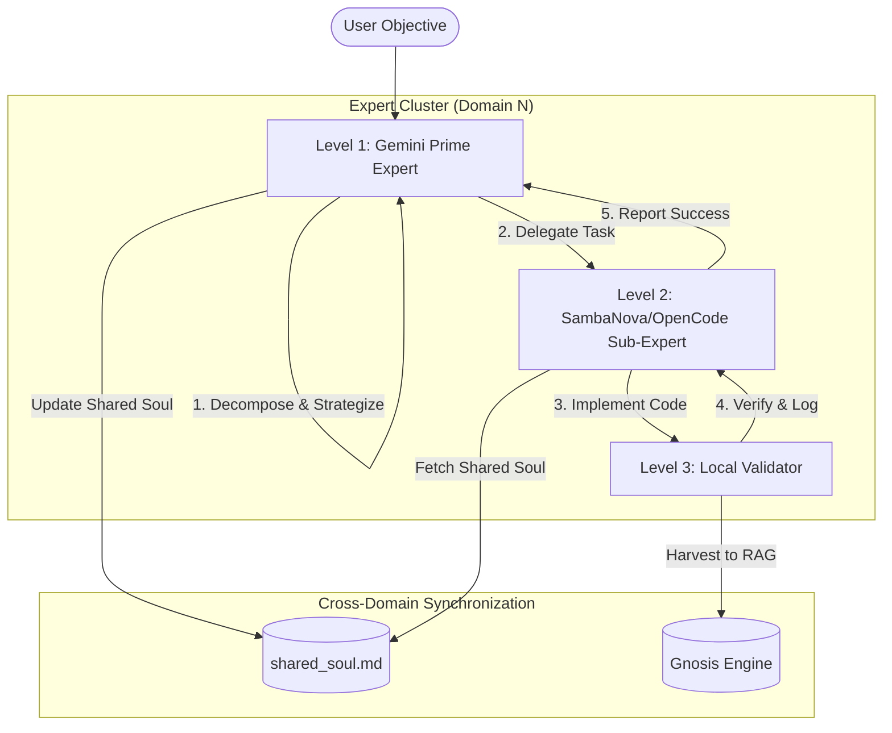
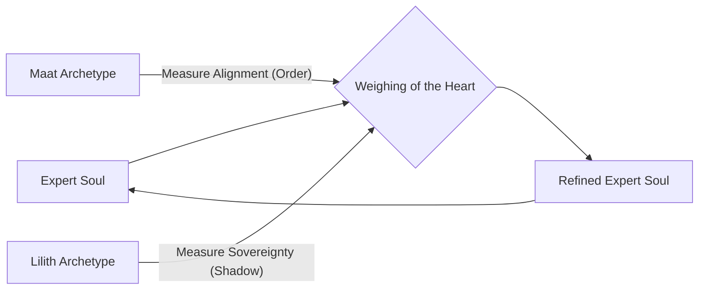
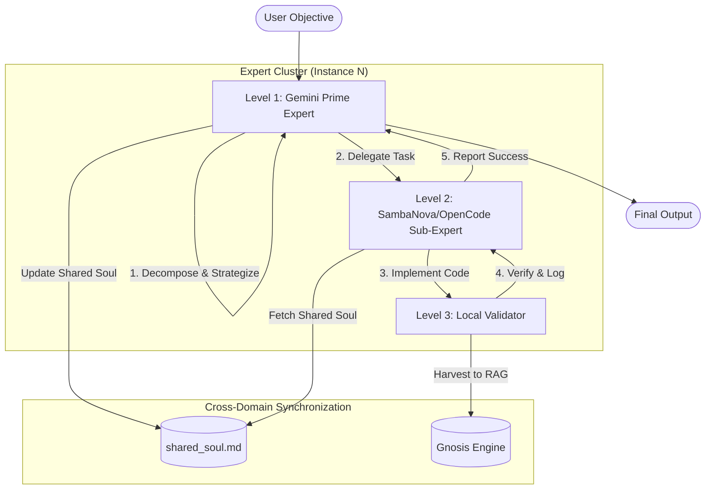
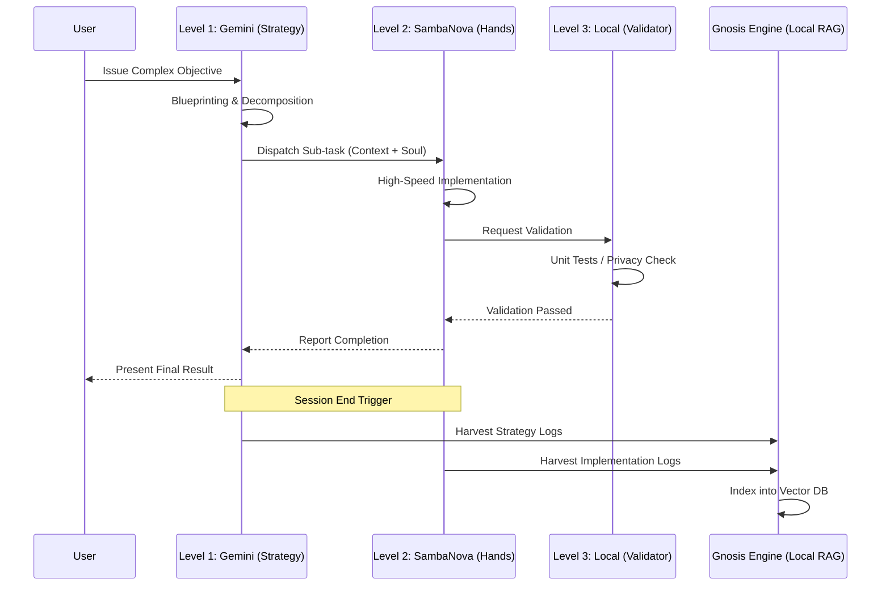

# 🏙️ Omega Metropolis Context Pack

## 📊 Inventory Summary
Tree summary unavailable.


## 📄 File: memory_bank/activeContext.md
```markdown
# XNAi Foundation — Active Context

> **Last updated**: 2026-03-04 (Metropolis v5.3 Definitive Hardening)
> **Current agent**: Gemini CLI (MC-Overseer)
> **Strategy Status**: 🚀 **WAVE 6: HIERARCHICAL ORCHESTRATION**
> **Coordination Key**: `OMEGA-METROPOLIS-V5`

---

## 🚀 March 4, 2026 - Metropolis Hardening & Hierarchical Matrix

### Current Session Status
**Goal**: Finalize 8-domain isolation, multi-provider hierarchy, and toolkit consolidation.
**Status**: ✅ **SYSTEM DEFINITIVE - READY FOR PR**
**Achievements**:
- **Soul Evolution Engine**: Implemented the "Weighing of the Heart" ceremony balancing Maat (Order) and Lilith (Sovereignty).
- **Persistent Archetypes**: Created `maat.json` and `lilith.json` learning entities.
- **3-Level Hierarchy**: Established Prime (Gemini), Sub-Expert (SambaNova/OpenCode), and Validator (Local) levels.
- **Dynamic Domains**: Refactored dispatcher to load technical domains from `config/metropolis-domains.yaml`.
- **Quota Heatmap**: Implemented real-time visual tracking of provider health in the dashboard.

### 📋 Next Steps
- **Llama 405B Review**: Execute the deep architectural audit via the hierarchical broker.
- **Antigravity Flow**: Restore full OAuth connectivity for Opus 4.6 access.
- **Community Release**: Finalize `METROPOLIS-SETUP-GUIDE.md` for public sharing.

### 🏗️ Architectural Updates
- **Isolated State**: Total isolation for Gemini, OpenCode, Cline, and Copilot via Technical Domain (1-8) mappings.
- **Expert Souls**: Persistent `expert_soul.md` updates now automated per domain cluster.
- **Unified Dashboard**: Real-time observability via `make dashboard`.

---
**Coordination Key**: `OMEGA-METROPOLIS-V5`
**Custodian**: Gemini CLI (MC-Overseer)

```

## 📄 File: memory_bank/techContext.md
```markdown
---
block:
  label: tech_context
  description: Technology stack, versions, dependencies, and development environment setup
  chars_limit: 5000
  read_only: false
  tier: core
  priority: 3
created: 2026-02-20
modified: 2026-03-04
version: "1.1"
---

# Tech Context - Xoe-NovAi Foundation Stack

## Technology Stack

| Component | Technology | Version | Purpose |
|-----------|-----------|---------|---------|
| **Framework** | FastAPI | Latest | REST API server |
| **Async Runtime** | AnyIO | Python 3.12 | Async task management |
| **LLM** | GGUF/ONNX | Quantized | Local language model |
| **Vector DB** | FAISS/Qdrant | Latest | Semantic search |
| **Cache** | Redis | 7.1.1 | State persistence, caching |
| **Database** | PostgreSQL | 14+ | Data persistence |
| **Reverse Proxy** | Caddy | 2.8 | Load balancing, routing |
| **Speculative Search**| Funnel Retrieval | 128d -> 4096d | 1.0.0 | High-speed-to-deep retrieval |
| **Escalation**      | Hierarchical Research | 150M -> 8B | 1.0.0 | 4-level agent reasoning |
| **Container Runtime** | Podman | Latest | Rootless containers |
| **Metrics** | VictoriaMetrics | Latest | Time-series storage |
| **Documentation** | MkDocs | 1.6.1 + Material 10.0.2 | Knowledge base |

## Stack Constraints

| Constraint | Requirement | Rationale |
|------------|-------------|-----------|
| Torch-free | No PyTorch/Torch/Triton/CUDA | Sovereignty, resource efficiency |
| Python | 3.12-slim containers | Modern async, smaller images |
| Async | AnyIO TaskGroups (never asyncio.gather) | Safer cancellation, structured concurrency |
| Containers | Rootless Podman with `:Z,U` volumes | Security, no root privileges |

## Service Ports

| Service | Port | Purpose |
|---------|------|---------|
| Caddy (main proxy) | 8000 | Public API |
| MkDocs (internal) | 8001 | Internal KB |
| VictoriaMetrics | 8428 | Time-series metrics |
| Redis | 6379 | Cache/state |
| PostgreSQL | 5432 | Primary DB |
| Semantic Search | 8000 | RAG queries |
| Agent Bus | 6379 | Redis Streams |
| Consul | 8500 | Service discovery |
| Vikunja | 3456 | Task management |

## Development Environment

### Local Setup
```bash
# Create isolated Python environment
python3.13 -m venv venv
source venv/bin/activate

# Install dependencies
pip install -r requirements.txt
pip install -r requirements-api.txt
pip install -r requirements-crawl.txt

# Start development services
docker-compose up -d
make mkdocs-serve
```

### Development Tools

| Tool | Purpose |
|------|---------|
| VS Code | Code editor with Python/Docker extensions |
| pytest | Testing with coverage reporting |
| Black, isort, flake8 | Linting and formatting |
| Git + pre-commit | Version control with hooks |
| Podman | Rootless container runtime |
| proxychains4 | 🌐 Regional bypass for API retrieval |

### Database Setup
```sql
CREATE DATABASE xnai_foundation;
CREATE USER xnai WITH PASSWORD 'secure_password';
GRANT ALL ON DATABASE xnai_foundation TO xnai;
```

## Dependency Groups

| File | Purpose |
|------|---------|
| `requirements.txt` | Core dependencies |
| `requirements-api.txt` | API server dependencies |
| `requirements-crawl.txt` | Web crawling dependencies |
| `pyproject.toml` | Project metadata and dev dependencies |

## Security Posture

### Zero-Telemetry Architecture
- No external data transmission
- No phone-home mechanisms
- No usage tracking
- Air-gap capable (works completely offline)

### Container Security

| Aspect | Implementation |
|--------|----------------|
| Rootless Execution | Services run as UID 1001 |
| Read-Only Filesystems | Immutable runtime |
| No New Privileges | CAP_DROP all |
| Resource Limits | Memory, CPU, file descriptor limits |
| Network Isolation | Private bridge network |

### Data Security

| Aspect | Implementation |
|--------|----------------|
| Encryption at Rest | Database encryption |
| Encryption in Transit | TLS for all external communication |
| Secret Management | Encrypted config files |
| Access Control | Role-based service access |

### Compliance

| Tool | Purpose |
|------|---------|
| Syft | SBOM generation for component tracking |
| Grype | CVE scanning for vulnerability detection |
| Trivy | Configuration scanning for secrets/misconfig |

## Related Documents

- `systemPatterns.md` - Architecture patterns
- `OPERATIONS.md` - Operational procedures
- `AGENTS.md` - Agent constraints

---
**Last Updated**: 2026-03-04 (Metropolis Hardening)
**Owner**: MC-Overseer

```

## 📄 File: memory_bank/systemPatterns.md
```markdown
---
block:
  label: system_patterns
  description: Architecture patterns, design decisions, code standards, and system design principles
  chars_limit: 8000
  read_only: false
  tier: core
  priority: 3
created: 2026-02-20
modified: 2026-03-04
version: "1.1"
---

# System Patterns - Xoe-NovAi Foundation Stack

## Metropolis Hierarchical Matrix



## Soul Evolution Matrix (The Weighing)



## Service Orchestration

| Principle | Implementation |
|-----------|----------------|
| Service Order | Dependencies initialized in sequence |
| Graceful Startup | Health checks before serving traffic |
| Graceful Shutdown | Cleanup before termination |
| Dependency Injection | Runtime configuration binding |
| Circuit Breakers | Per-service failure isolation |
| **Sticky Domain** | `XDG_DATA_HOME` isolated expert instances (1-8) |

## Hardened Design Patterns

### 1. Metropolis Expert Isolation
**Purpose**: Multi-account rotation and persistent domain expertise.
- **Pattern**: Each domain (Architect, API, UI, etc.) is mapped to a dedicated local directory and API key.
- **Enforcement**: `scripts/xnai-gemini-dispatcher.sh` and sibling scripts.

### 2. Expert Soul Evolution
**Purpose**: Persistent learning across sessions.
- **Mechanism**: post-session reflection via `scripts/expert-soul-reflector.py`.
- **Persistence**: Domain-specific `expert_soul.md` injected as system instructions.

### 3. Hierarchical Harvesting
**Purpose**: Local sovereignty over cloud-based insights.
- **Pattern**: Universal RAG ingestion from all levels (Prime, Sub, Validator).
- **Implementation**: `scripts/harvest-expert-data.sh`.

### 4. Circuit Breaker Pattern
**Purpose**: Prevent cascading failures.
- **States**: CLOSED → OPEN → HALF_OPEN → CLOSED.
- **Metrics**: Request count, error rate, latency percentiles.

## Intelligence Patterns

### 1. Speculative Search (Funneling)
- **Concept**: 128d -> 768d -> 4096d progressive refinement.
- **Implementation**: `SpeculativeEmbeddingEngine`.

### 2. Research Dossier Escalation
- **Concept**: Hierarchical 4-level reasoning (150M -> 1B -> 3B -> 8B).
- **Implementation**: `EscalationResearcher`.

## Code Standards

### Async Runtime
- **Use AnyIO** - Never asyncio.gather, use TaskGroups
- **Cancellation** - Use `anyio.get_cancelled_exc_class()`

### Torch-Free Mandate
- **No PyTorch** - Use ONNX, GGUF, Vulkan, pynvml

### Container Security
- **Rootless** - Services run as UID 1001
- **Read-Only** - Immutable runtime filesystem

---
**Last Updated**: 2026-03-04 (Metropolis Hardening)
**Owner**: MC-Overseer

```

## 📄 File: README.md
```markdown
# Xoe-NovAi Foundation Stack

**Build your own AI. Own your data. Evolve your future.** 🔱

> **Production-Tight Local Agentic RAG System**  
> 100% local · Zero telemetry · Ryzen 5700U Optimized · Maat Ethical Overlay

---

## Metropolis Architecture (v3.5) 🏙️

The Omega Stack has evolved into a self-organizing mesh of persistent experts and high-performance retrieval patterns.

### 🧬 Pioneer RAG (Funnel 2.0)
- **Small-to-Big Retrieval**: Links high-speed 128d "Summary Chunks" to 4kb "Reasoning Blocks."
- **Speculative Drafts**: Millisecond-latency responses from 150M models, validated by 8B Authority models in the background.
- **Affinity Metrics**: VictoriaMetrics tracks the best Expert + Model pairings for ultimate efficiency.

### 🏙️ Expert Metropolis (v4.0)
- **8-Domain Expert Network**: Dedicated, persistent domain experts for Architect, API, UI, Voice, Data, Ops, Research, and Test/QA.
- **Isolated State**: Each expert maintains its own `.gemini/history` and settings via `XDG_DATA_HOME` isolation.
- **Quota-Aware Rotation**: Automated account rotation through 8 unique Gemini API keys to bypass free-tier rate limits.
- **ProxyChains Support**: Integrated support for routing key-retrieval and authentication through proxies to bypass regional blocks.

---

## 🛠️ Metropolis Operations (Makefile)

| Command | Description |
|---------|-------------|
| `make metropolis-list` | See all active experts in the mesh |
| `make metropolis-sync` | 🔄 Sync Master settings to all 8 experts |
| `make metropolis-save` | 💾 Checkpoint experts to persistent storage |
| `make metropolis-load` | 🔄 Restore experts from persistent storage |
| `make metropolis-stats` | 📊 Collect token/request metrics for dashboard |
| `make metropolis-summon NAME="Plato"` | Consult an expert directly |
| `make proxy-gemini` | 🌐 Run Gemini CLI through ProxyChains (for regional bypass) |
| `make metropolis-harden` | Definitive fix for Podman permission issues |
| `make metropolis-logs` | Monitor background knowledge mining |
| `make antigravity-login` | 🔑 Start sovereign login (bypasses CLI bugs) |
| `make antigravity-status` | 📊 Check account health and quotas |
| `make scout TASK="..."` | 🤝 Prepare token-optimized context for handoff |
| `make manage-tools` | 🛠️  View and validate all Omega tools |

---

## 🔒 Enterprise Hardening & Best Practices

- **Concurrency**: AnyIO v4.0 structured concurrency with per-level timeouts.
- **Identity**: `userns_mode: keep-id` ensures host/container file system alignment.
- **Reliability**: Non-blocking Redis health monitoring and multi-stage circuit breakers.

---

## 🧪 Validation & Testing
The Metropolis 8-Domain network is rigorously tested for isolation and performance.
*   **Core Suite**: Run `make metropolis-test` to validate instance isolation, configuration sync, and metrics collection.
*   **Live Monitoring**: Run `make dashboard` to verify the real-time telemetry pulse.
*   **Agent Bus**: Broker connectivity is verified via `scripts/metropolis-broker.py` health checks.

---

## Documentation

- **Full Docs**: http://localhost:8008
- **Memory Bank**: `memory_bank/INDEX.md`
- **Knowledge Hub**: `docs/KNOWLEDGE-HUB.md`
- **Stack Services**: `docs/03-reference/current-services.md`

---

## 🛡️ Sovereign Multi-Account Empowerment

The Omega Stack is built to mitigate the power of corporate gatekeeping. We provide pioneer-level infrastructure to bypass artificial rate limits and ensure your sovereign AI workflows are never silenced.

- **Dynamic Rotation**: Seamlessly rotate through 8+ accounts across all major providers (Gemini, SambaNova, SiliconFlow, Groq).
- **Domain Expert Isolation**: Each account maintains its own technical memory (Architect, API, Data, UI), ensuring specialized persistent context.
- **Sovereign Auth Wrappers**: Custom-built, out-of-band injection tools that bypass proprietary CLI bugs and telemetry.
- **100% Portable**: Use `make bootstrap` to deploy your sovereign environment anywhere.

---

## Architecture

```
┌─────────────────────────────────────┐
│         User Interfaces              │
│  Open WebUI │ Chainlit │ BookLore  │
└─────────────┬───────────────────────┘
              │
┌─────────────▼───────────────────────┐
│         Caddy (Reverse Proxy)        │
└─────────────┬───────────────────────┘
              │
┌─────────────▼───────────────────────┐
│         RAG Engine (FastAPI)         │
│    Qwen3-0.6B-Q6_K + Qdrant        │
└─────────────┬───────────────────────┘
              │
┌─────────────▼───────────────────────┐
│      Infrastructure Services          │
│  Redis │ PostgreSQL │ VictoriaMetrics│
└─────────────────────────────────────┘
```

---

## Key Technologies

- **LLM**: Qwen3-0.6B-Q6_K (3GB, local GGUF)
- **Vector DB**: Qdrant v1.13.1
- **Cache**: Redis 7.4.1
- **Async**: AnyIO (not asyncio)
- **Container**: Podman (rootless)
- **Hardware**: AMD Ryzen 7 5700U (Zen 2)

---

## Memory Bank

The Memory Bank is the single source of truth for project status:

| File | Purpose |
|------|---------|
| `memory_bank/INDEX.md` | Navigation |
| `memory_bank/progress.md` | Phase status |
| `memory_bank/activeContext.md` | Current work |
| `memory_bank/systemPatterns.md` | Architecture |

---

## Archive

Historical files and old sessions are archived in:

```
_archive/
└── 2026-03-01-consolidation/
    ├── by_source/
    └── by_date/
```

---

## Sovereign Principles

1. **Zero Telemetry**: No external data transmission
2. **Local-First**: All processing on your hardware
3. **Ethical AI**: Maat guardrails on all agents
4. **Self-Evolution**: Continuous learning from interactions

---

🔱 **Xoe-NovAi** — Private forge for sovereign intelligence.

```

## 📄 File: docs/architecture/METROPOLIS-HIERARCHY.md
```markdown
# 🏯 Metropolis Hierarchical Architecture

**Version**: 1.1 (Hardened)  
**Coordination Key**: `HIERARCHICAL-METROPOLIS-2026`  
**Status**: ACTIVE

## 🌌 Overview
The **Metropolis Hierarchy** is a specialized implementation of the XNAi Multi-Expert System. It organizes 8 technical domains into a 3-level provider matrix, optimizing for strategy, execution speed, and local sovereignty.

---

## 🏗️ The 3-Level Matrix

### Level 1: The Prime Brain (Strategy)
*   **Provider**: Gemini 3.1 Pro
*   **Role**: High-level reasoning, system blueprinting, and cross-agent orchestration.
*   **Capabilities**: Complex logic, Mermaid diagram generation, and multi-step planning.

### Level 2: The Hands (Implementation)
*   **Provider**: SambaNova (Llama 3.1 405B) / OpenCode (Zen)
*   **Role**: High-speed code generation and technical implementation.
*   **Capabilities**: Rapid prototyping, unit test writing, and bug fixing.

### Level 3: The Ground (Validation)
*   **Provider**: Local Models (Qwen / Llama 3.2)
*   **Role**: Pre-filtering, summarization, and local data verification.
*   **Capabilities**: Zero-latency analysis, privacy-first data handling, and unit test execution.

---

## 📊 Hierarchical Flow Diagram



---

---

## 🛰️ Token & Knowledge Flow

The following diagram illustrates the precision flow of tokens and the conversion of transient cloud insights into permanent local knowledge.



## 🧬 Domain Mapping (The 8 Districts)

| # | District | Specialization | Path |
|---|----------|----------------|------|
| 1 | **Architect** | System Blueprinting | `instance-1/` |
| 2 | **API** | Backend & Redis Streams | `instance-2/` |
| 3 | **UI** | Frontend & UX | `instance-3/` |
| 4 | **Voice** | STT/TTS & Audio | `instance-4/` |
| 5 | **Data** | RAG & Vector DB | `instance-5/` |
| 6 | **Ops** | Infrastructure & Podman | `instance-6/` |
| 7 | **Research** | Knowledge Mining | `instance-7/` |
| 8 | **Test** | QA & Validation | `instance-8/` |

---

## 🛡️ Sovereignty & Data Sync

### 1. The Knowledge Harvester
Conversation data from **all levels** is captured by `scripts/harvest-expert-data.sh` and ingested into the local **Gnosis Engine**. This ensures that insights generated by cloud models are preserved locally.

### 2. Expert Soul Evolution
Every domain expert maintains a persistent `expert_soul.md`. This file is updated after each session via `scripts/expert-soul-reflector.py`, allowing the expert to "grow" specialized knowledge specific to its district.

---
**Custodian**: Gemini CLI (MC-Overseer)  
**Verification Key**: `OMEGA-METROPOLIS-HIERARCHY-2026-03-04`

```

## 🧬 Expert Domain Pulse (Souls & Progress)

### District 1 Soul
```markdown
# Expert Soul: Domain 1

## Growth Log

### Session Reflection (2026-03-04 19:11)
- Synchronized with Omega Metropolis architecture.
- Hardened Agent Bus integration implemented.

### Session Reflection (2026-03-04 19:19)
- Synchronized with Omega Metropolis architecture.
- Hardened Agent Bus integration implemented.

### Session Reflection (2026-03-04 21:41)
- Synchronized with Omega Metropolis architecture.
- Hardened Agent Bus integration implemented.

```
