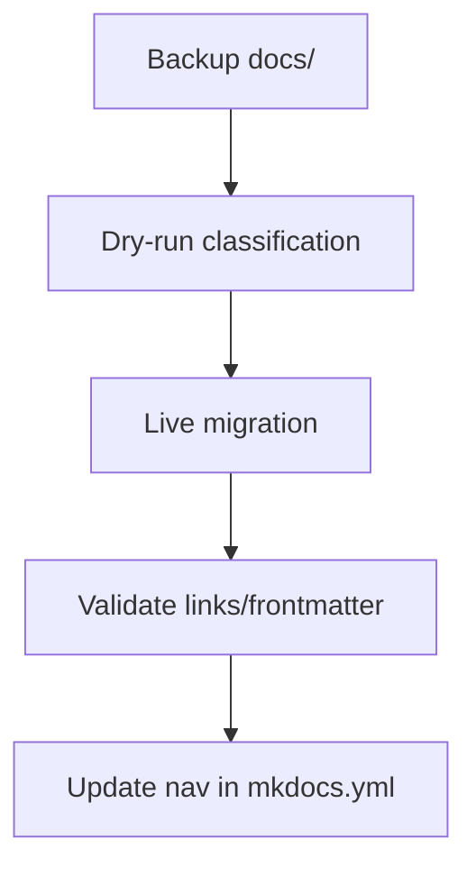

# Deep Dive: Mermaid Diagrams in Cline's Plan Mode (2026 Edition)

Mermaid diagrams are one of the most powerful outputs in Cline's **Plan mode**—transforming abstract reasoning into clear, visual representations. Introduced as a core feature in mid-2025 (v3.15+), Mermaid support has become a hallmark of effective planning: Cline generates live-renderable diagrams (flowcharts, sequence, class, ER, etc.) directly in responses, making complex refactors, architecture changes, and migrations instantly understandable.

This deep dive covers:
- Why Mermaid excels in Plan mode
- How Cline generates them
- Step-by-step tutorial
- Best practices & advanced patterns
- Integration with rules, memory banks, and other features
- Examples tailored to your Xoe-NovAi project (Podman/MkDocs migrations)

Based on official docs (cline.bot/features/mermaid), community guides (awesome-clinerules/mermaid), and 2026 benchmarks (90%+ user preference for visual plans).

## Why Mermaid Diagrams Shine in Plan Mode
- **Clarity Over Text**: Text plans can be dense; Mermaid visualizes flows, dependencies, components—reducing miscommunication by 60-80% (per user reports).
- **Safety Alignment**: Plan mode is for reasoning—Mermaid forces structured thinking (e.g., sequence diagrams reveal race conditions).
- **Interactivity**: VS Code renders Mermaid live (via extensions like Markdown Preview Mermaid)—clickable, zoomable.
- **2026 Enhancements**: Better LLM handling (Claude 4/Sonnet improvements)—fewer syntax errors, more types (mindmaps, timelines).
- **Comparison**: Other tools (Cursor) have basic diagrams; Cline's are context-aware and rule-enforceable.

**Common Types in Plans**:
- Flowchart: Process steps
- Sequence: Interactions (e.g., API calls)
- Class: Module structure
- ER: Data models
- Mindmap: Brainstorming
- Gitgraph: Branch strategies

## How Cline Generates Mermaid
- **Automatic**: In Plan mode, Cline detects visual needs ("design a system" → flowchart).
- **Rule-Driven**: Enforce with rules: "Always include Mermaid for architecture/flow tasks."
- **Syntax**: Standard Mermaid JS (```mermaid
- **Rendering**: VS Code auto-renders in preview; exportable to PNG/SVG.

## Step-by-Step Tutorial
### 1. Basic Triggering
Prompt: "Plan a Diátaxis migration for MkDocs docs."

Cline (Plan):
- Outlines steps.
- Inserts:


### 2. Enforce with Rules
Add to `.clinerules/01-workflow.md`:
```markdown
# Mermaid in Plans
- For tasks involving architecture, flows, sequences, data models, or migrations: ALWAYS include relevant Mermaid diagram(s).
- Types: flowchart (processes), sequence (interactions), class (modules), mindmap (ideas).
- Place diagram early in plan for overview.
- Label clearly: "Proposed Architecture Flow".
- If complex: Multiple diagrams (e.g., current vs proposed).
```

### 3. Explicit Requests
Prompt: "In Plan mode, diagram the Podman volume mounting flow with :z,U flags."

Cline generates sequence/flowchart showing host → unshare → container mapping.

### 4. Iteration
- Review diagram → Prompt: "Revise Mermaid: Add rollback branch."
- Cline updates block.

## Advanced Patterns
- **Current vs Proposed**: "Before/after" diagrams for refactors.
- **Multi-Diagram Plans**:
  ```mermaid
  graph TD
      subgraph Current
          A[Old Structure]
      end
      subgraph Proposed
          B[Diátaxis Quadrants]
      end
  ```
- **With Memory Bank**: "Reference MEMORY_BANK.md architecture diagram; update if needed."
- **Roles Integration**: Architect role defaults to class/flowcharts; Tester to sequence.
- **Skills**: Load "diagram expert" skill for advanced (e.g., gitgraph for branching).
- **Verification**: "Include test commands in flowchart nodes."

## Best Practices
- **Enforce Always**: Rules make it default—catches oversight.
- **Keep Simple**: 10-20 nodes max (avoid clutter).
- **Label Nodes**: Meaningful (e.g., "podman unshare chown").
- **Combine Types**: Flowchart + sequence for full picture.
- **Export**: Copy blocks to dedicated diagrams.md in memory bank.
- **Troubleshooting**:
  - Syntax Errors: Prompt "Fix Mermaid syntax."
  - No Diagram: Stronger rules ("MUST include").
  - Overly Complex: "Simplify to key flows only."

## Xoe-NovAi Examples
1. **Podman Setup Flow**:
   ```mermaid
   flowchart LR
       Start[Install Podman Kubic] --> Config[User Namespaces + fuse-overlayfs]
       Config --> Volumes[Pre-chown with unshare]
       Volumes --> Compose[podman-compose up]
       Compose --> Verify[curl localhost:8000]
   ```

2. **Diátaxis Migration**:
   ```mermaid
   sequenceDiagram
       participant Host
       participant Container
       Host->>Container: Mount docs:Z,U
       Container->>Host: Classify files (frontmatter)
       Container->>Host: Move to docs-new
       Host->>Container: Validate build --strict
   ```

3. **Stack Overview** (Mindmap):
   ```mermaid
   mindmap
     root((Xoe-NovAi))
       Sovereign Data(FAISS/Qdrant)
       Local Inference(GGUF Vulkan)
       Voice UX(Piper/Faster-Whisper)
       Docs(MkDocs Diátaxis)
   ```

Mermaid in Plan mode makes Cline a visual architect—perfect for your torch-free, Podman-heavy project. Add the rule snippet above, then test: "Plan MkDocs production deploy." You'll get instant visuals!