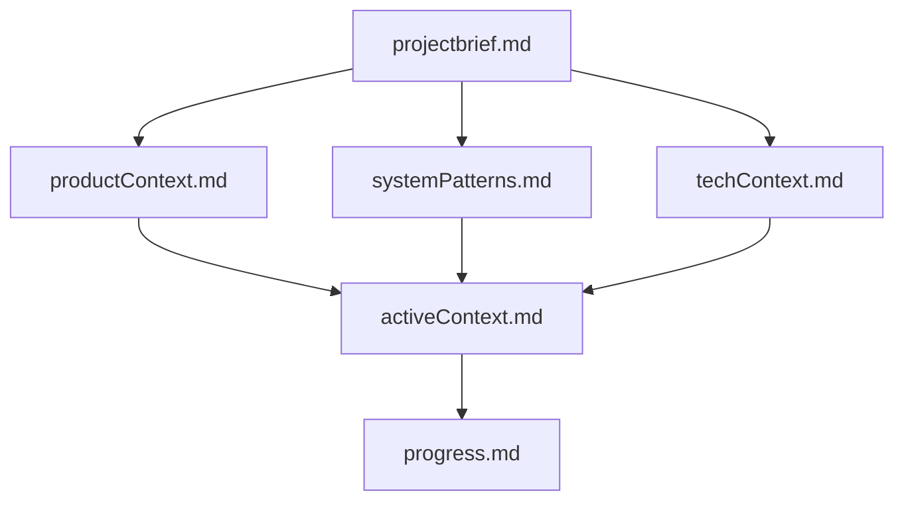

# Deep Dive: The Memory Bank in Cline (2026 Edition)

The **Memory Bank** is one of the most transformative community-driven innovations for Cline (the open-source VS Code AI coding agent, formerly Claude Dev). Introduced in early 2025, it addresses the core limitation of LLMs: statelessness between sessions. By instructing Cline to maintain a structured set of Markdown files (typically in a `memory_bank/` folder or root files like `MEMORY_BANK.md`), it creates a persistent, self-documenting "external memory" that Cline queries and updates automatically.

This deep dive is based on:
- Official Cline docs (cline.bot, 2026 updates)
- Community sources (GitHub repos like nickbaumann98/cline_docs, awesome-clinerules)
- Reddit r/CLine discussions (2025-2026 threads on best practices, deprecation debates)
- Tutorials (YouTube guides, DataCamp articles)
- User benchmarks (token savings, coherence improvements)

As of January 2026, Memory Bank remains widely used despite newer features (e.g., built-in context management)—it's flexible, version-controllable, and integrates seamlessly with rules/Skills.

## Origin and Evolution
- **Origin (Feb 2025)**: Community response to context window limits. Early versions used a single `MEMORY_BANK.md`; popularized via blog posts like "Memory Bank: How to Make Cline Never Forget" (cline.bot/blog).
- **Maturation (Mar-Jun 2025)**: Standardized multi-file structure (projectbrief.md → activeContext.md hierarchy). Added Mermaid diagrams, auto-compaction.
- **2026 Status**: Official docs endorse it as a "custom instructions library" example. Debates on deprecation (due to Plan/Act + Skills) but consensus: Still essential for long-term projects (e.g., monorepos). Variants include MCP servers for remote access.

**Why Revolutionary**: Turns ephemeral chats into a "living project notebook." Users report 70-90% faster resumption, fewer hallucinations.

## Core Concept: How It Works
LLMs reset memory per session. Memory Bank exploits file system access:
- **Instructions/Rules**: Tell Cline: "You have no built-in memory—rely ENTIRELY on Memory Bank files."
- **Files as Brain**: Structured MD files store summaries, decisions, state.
- **Workflows**:
  - **Query**: Cline reads files before acting.
  - **Update**: Appends/summarizes after changes.
  - **Compact**: Prunes old info when bloated.
- **Self-Reinforcing**: Rules mandate perfect documentation—"Your effectiveness depends on Memory Bank accuracy."

Result: Cline behaves like a persistent agent, rebuilding context instantly.

## Standard Structure
Most setups use a `memory_bank/` folder (or root for simplicity). Hierarchical flow (from official docs):



**Core Files**:
1. **projectbrief.md**: Foundation—goals, scope, brief.
2. **productContext.md**: Why/problems solved/UX goals.
3. **systemPatterns.md**: Architecture decisions, patterns.
4. **techContext.md**: Stack, constraints, setup.
5. **activeContext.md**: Current focus, recent changes.
6. **progress.md**: What works/next/blockers.

**Optional**: learnedPatterns.md (evolving rules), diagrams.md (Mermaid).

## Step-by-Step Setup Tutorial
1. **Add Instructions** (via .clinerules or custom instructions):
   Copy from official: https://docs.cline.bot/prompting/cline-memory-bank
   Key snippet:
   ```markdown
   # Memory Bank Protocol
   My memory resets between sessions. Rely ENTIRELY on Memory Bank files.
   Maintain memory_bank/ folder with: projectbrief.md, productContext.md, etc.
   Before tasks: Read all files.
   After changes: Update relevant files with summaries.
   If bloated: Compact/prune.
   ```

2. **Initialize**:
   - Prompt: "Initialize memory bank with this project brief: [paste overview of Xoe-NovAi—torch-free local AI, MkDocs docs, Podman setup]."
   - Cline creates folder/files.

3. **Verify**:
   - Check git: memory_bank/ with populated MDs.
   - Test resumption: Close/reopen VS Code → Prompt "Continue last task" → Cline queries bank.

## Core Workflows
- **Start Session**: Auto-reads bank ("follow custom instructions" trigger).
- **Update**: Prompt "update memory bank" or auto after tasks.
- **Query**: "Search memory bank for auth decisions."
- **Compact**: "Compact memory bank—summarize old entries."

Advanced: Add Mermaid for visual patterns (2025 update—LLMs handle better).

## Advanced Variations
- **Mermaid-Enhanced**: Store diagrams in systemPatterns.md (better prompting than text).
- **Compression Triggers**: Rules for >60% context → auto-compact.
- **Team Mode**: Per-user subfolders; manual merges.
- **MCP Integration**: Remote server for shared banks (alioshr/memory-bank-mcp).
- **Hybrid with .clinerules**: Bank stores dynamic info; rules store static.

## Best Practices
- **Let AI Update**: Hands-off for speed; manual review hallucinations (common early init).
- **Manual Maintenance**: Strike-through outdated; add "user overrides" section.
- **Initialization**: Provide accurate brief—reduces hallucinations.
- **With Plan/Act**: Update bank post-Act.
- **Token Hygiene**: Compact regularly; avoid over-detail.
- **Version Control**: Commit bank—audit trail.
- **Avoid Overload**: 5-7 files max; prune quarterly.

**Troubleshooting**:
- Hallucinations: Reinforce "Only verified info" in rules.
- Missing Updates: Explicit "update memory bank" prompts.
- Bloat: Add compaction rules.

## Integration with Other Features
- **Plan/Act**: Plans reference bank; Act updates.
- **Roles/Skills**: Roles query specific files.
- **Token Efficiency**: Bank replaces history reloads.
- **Rules**: Bank for dynamic; .clinerules for static.

## Pros/Cons & Future
**Pros**: Infinite persistence, coherence, team sharing.  
**Cons**: Setup overhead; potential drift (mitigated by reviews).  
**Future**: Partial overlap with native memory (2026 debates deprecation), but file-based remains superior for control.

Memory Bank elevates Cline to "senior dev with perfect notes." For your Xoe-NovAi project: Initialize with torch-free philosophy, Podman/MkDocs details—it'll make migrations flawless.
