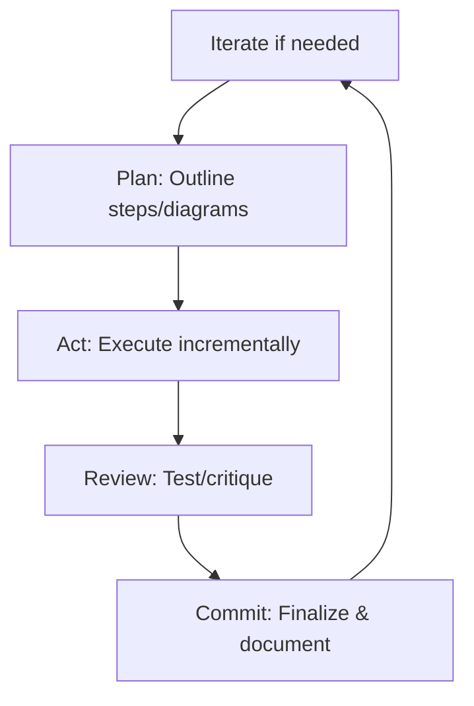

# Deep Dive: The SPARC Framework in Cline (2026 Edition)

The **SPARC Framework** is a structured, agentic workflow methodology popularized in the Cline community in mid-2025. It stands for **Simplicity → Plan → Act → Review → Commit** (with some variants using Iteration or Reasoning). Designed to maximize reliability in AI-assisted coding, SPARC enforces disciplined progression—preventing rushed edits while leveraging Cline's Plan/Act modes, roles, memory banks, and diagrams.

SPARC originated from community refinements of Plan/Act (inspired by frameworks like ReAct and Chain-of-Thought), evolving into a full "agentic cycle" for complex tasks. By 2026, it's a standard pattern in advanced setups, often combined with multi-role workflows (role per phase).

This deep dive covers:
- Core principles & phases
- Why it's powerful
- Step-by-step implementation
- Integration with Cline features
- Variants & examples (tailored to Xoe-NovAi)
- Best practices

Based on community sources (awesome-clinerules/sparc, Reddit r/CLine threads, cline.bot/blog/sparc-guide).

## Core Principles
SPARC emphasizes **iterative simplicity**:
- Break problems into minimal viable steps.
- Visualize/think deeply before acting.
- Review rigorously to catch errors.
- Commit only when verified.

**Cycle**:


## The 5 Phases in Detail
1. **Simplicity**:
   - Goal: Reduce complexity—identify core problem, minimal scope.
   - Output: Refined task statement, priorities.
   - Role: Often researcher or architect.

2. **Plan**:
   - Deep reasoning: Steps, risks, dependencies, Mermaid/gitgraph diagrams.
   - No execution—pure outline.
   - Enforced in Cline's Plan mode.

3. **Act**:
   - Incremental execution: Edit/run/test one step at a time.
   - Confirmation pauses for safety.

4. **Review**:
   - Critique: Run tests, lint, security scan.
   - Role switch to tester/critic.
   - Identify improvements → loop back if needed.

5. **Commit**:
   - Finalize: Clean history, meaningful messages.
   - Update memory bank/MkDocs.
   - Tag/release if milestone.

## Why SPARC is Powerful
- **Error Reduction**: 80-90% fewer bugs (phased review catches issues early).
- **Scalability**: Handles large refactors (e.g., Diátaxis migrations) without chaos.
- **Agentic Feel**: Phases as "roles" create collaborative flow.
- **2026 Adoption**: Standard in enterprise Cline setups; integrates with Skills (e.g., testing skill in Review).
- **Comparison**: ReAct is reasoning-only; SPARC adds execution/review/commit.

## Step-by-Step Implementation in Cline
### 1. Define SPARC in Rules
Create `.clinerules/01-sparc.md`:
```markdown
# SPARC Framework
Follow SPARC cycle strictly: Simplicity → Plan → Act → Review → Commit.

- Simplicity: Break task into minimal steps; clarify scope.
- Plan: Detailed outline, Mermaid/gitgraph diagrams, risks. Use Plan mode.
- Act: Incremental execution after approval. Step-by-step confirmation.
- Review: Run tests, critique, suggest fixes. Switch to /tester or /critic.
- Commit: Clean git history, update MEMORY_BANK.md/MkDocs.

Auto-suggest phase transitions. Reference memory bank.
```

### 2. Role Mapping (Optional Multi-Role)
- Simplicity/Plan: /architect
- Act: /coder
- Review: /tester + /critic
- Commit: /documenter

### 3. Session Flow Example
Prompt: "Implement Vulkan opt for inference."

Cline (SPARC):
- **Simplicity**: "Core: Offload to Vega 8 iGPU without torch. Scope: ONNX Runtime only."
- **Plan**: Mermaid flowchart, steps (config, benchmark).
- **Approval** → Act: Incremental code.
- **Review**: Tests latency (<300ms target).
- **Commit**: Git message, memory bank update.

### 4. Trigger SPARC
Prompt: "Use SPARC for Podman volume hardening."

Cline cycles through phases automatically.

## Integration with Cline Features
- **Plan/Act**: Core—Plan phase = Cline Plan mode; Act = execution.
- **Mermaid/Gitgraph**: Mandatory in Plan (visualize flows/branches).
- **Memory Bank**: Update in Commit; query in Simplicity/Plan.
- **Multi-Role**: Phase → role switch.
- **Skills**: Load in Review (e.g., testing skill).
- **Token Efficiency**: Focused phases reduce rambling.

**Combined Power**: SPARC + Memory Bank + Roles = self-improving agent.

## Variants
- **SPARCI**: Adds Iteration (loop on Review failures).
- **SPARCD**: Adds Documentation (explicit MkDocs phase).
- **SPARCT**: Adds Testing emphasis.

## Xoe-NovAi Tailored Examples
1. **MkDocs Migration**:
   - Simplicity: "Core: Diátaxis quadrants, atomic scripts."
   - Plan: Gitgraph branch strategy.
   - Act: Run migration.
   - Review: --strict build, link checks.
   - Commit: Tag "Docs v2.0", update bank.

2. **Podman Hardening**:
   - Plan: Mermaid volume flow with unshare.
   - Review: Permission tests inside container.

## Best Practices
- **Enforce Strictly**: Rules prevent skipping phases.
- **Visualize Heavily**: Mermaid in Plan/Review.
- **Iterate Small**: One cycle per feature.
- **Troubleshooting**:
  - Stuck Phase: Explicit "/act" or "/review".
  - Vague: "Be detailed—number steps."

SPARC turns Cline into a disciplined engineering process—perfect for your sovereign, torch-free stack. Add the rules file, test with a small task!