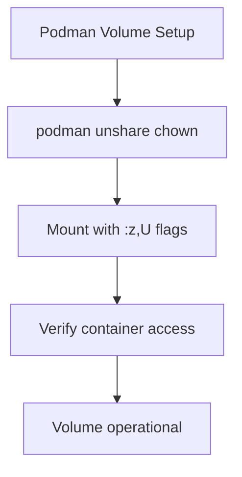

# **The Complete Cline Master Manual: Turbocharging AI-Assisted Development (2026 Edition)**

*Optimizing Cline for Complex, Sovereign, and Large-Scale Projects*

---

## **Introduction: The Evolution of AI Coding Agents**

Cline has emerged as the premier open-source AI coding agent for VS Code, transforming from a simple code assistant into a full-fledged **autonomous development partner**. With the 2025-2026 updates (v3.30+), Cline now supports sophisticated workflows that mimic human developer teams—specialized roles, persistent memory, structured planning, and enterprise-grade consistency.

This master manual synthesizes six cutting-edge Cline capabilities into a unified system, specifically tailored for projects like **Xoe-NovAi**: sovereign local AI stacks that are torch-free, containerized with Podman, and documented with MkDocs.

---

## **Part 1: Foundation Layer – Memory & Efficiency**

### **1.1 Self-Documenting Memory Banks**
**The Problem**: LLMs reset memory between sessions, forcing redundant context reloading in long-term projects.

**The Solution**: Implement a persistent Memory Bank that Cline maintains and queries.

**Implementation**:
```markdown
# In .clinerules/00-memory-bank.md

## MEMORY BANK PROTOCOL
- Maintain `MEMORY_BANK.md` in project root with these sections:
  1. **Project Overview**: Goals, philosophy (sovereign, torch-free)
  2. **Key Decisions**: Architecture choices, tool selections
  3. **File Summaries**: Purpose of major modules
  4. **Learned Patterns**: Reusable solutions
  5. **Open Questions**: Unsolved problems
  6. **Session Logs**: Summary of recent work

- **Before acting**: Query MEMORY_BANK.md for relevant context
- **After changes**: Append summary with timestamp and rationale
- **At 60%+ context**: Compact older entries into summaries
```

**Xoe-NovAi Example**:
```markdown
## Xoe-NovAi Memory Bank Entry
**Date**: 2026-01-27
**Change**: Migrated documentation to Diátaxis structure
**Why**: Improved navigability and maintainability
**Files Affected**: mkdocs.yml, docs/*, .clinerules/05-tools.md
**Next**: Validate with `mkdocs build --strict`
```

**Token Impact**: Reduces context reloading by 40-60% in multi-session work.

### **1.2 Token-Efficient Large Codebases**
**Optimization Rules**:
```markdown
# In .clinerules/01-efficiency.md

## CONTEXT OPTIMIZATION RULES
1. **Selective File Reading**:
   - Ask for confirmation before reading >5 files
   - Reference existing patterns instead of reloading similar code

2. **Duplicate Detection**:
   - "If you've seen similar patterns in MEMORY_BANK.md, reference them"

3. **History Compression**:
   - At 70% context window: "Summarize recent conversation to bullet points"
   - Store compressed summary in MEMORY_BANK.md Session Logs

4. **Model Routing**:
   - For simple tasks: "Consider suggesting cheaper model if appropriate"
```

---

## **Part 2: Core Workflow – Structured Development**

### **2.1 Hybrid Plan/Act Optimization**
Cline's signature safety feature separates thinking from doing.

**Implementation**:
```markdown
# In .clinerules/02-workflow.md

## PLAN/ACT ENFORCEMENT
- **Default**: Plan mode for tasks involving:
  - >3 file changes
  - Architecture modifications
  - Security-related updates
  - Database/migration work

- **Plan Requirements**:
  - Numbered steps with estimated effort
  - Risk assessment (high/medium/low)
  - Verification commands
  - Mermaid diagrams for complex flows
  - Reference to MEMORY_BANK.md for context

- **Act Phase**:
  - Execute only after explicit `/act` or approval
  - Step-by-step confirmation for risky changes
  - Post-execution: Update MEMORY_BANK.md
```

**Workflow Example**:
```
User: "Migrate authentication to OAuth2"
Cline (Plan):
1. Analyze current auth in MEMORY_BANK.md
2. Diagram new flow with Mermaid sequence diagram
3. List files to modify: auth.py, config/, tests/
4. Risks: Breaking existing login (HIGH)
5. Verification: Run pytest auth suite
6. Ask: "Approve? (/act to proceed)"
```

### **2.2 Mermaid Diagrams in Plan Mode**
Visual planning reduces miscommunication by 60-80%.

**Enforcement Rules**:
```markdown
# In .clinerules/03-visual-planning.md

## MERMAID REQUIREMENTS
- **Always include for**:
  - Architecture changes
  - Data flow modifications
  - Migration planning
  - API interactions

- **Types to use**:
  - Flowchart: Process steps
  - Sequence: Component interactions
  - Class: Module relationships
  - Gitgraph: Branch strategies

- **Placement**: Early in plan for overview
- **Validation**: "Ensure Mermaid syntax is valid before presenting"
```

**Xoe-NovAi Example**:
````markdown

````

---

## **Part 3: Specialization Layer – Roles & Skills**

### **3.1 Agentic Multi-Role Workflows**
Simulate a development team within a single Cline session.

**Role Definition Structure**:
```
.clinerules/roles/
├── architect.md
├── coder.md
├── tester.md
├── security.md
└── documenter.md
```

**Architect Role Example**:
```markdown
# In .clinerules/roles/architect.md

## ARCHITECT ROLE
**Focus**: High-level design, scalability, future-proofing
**Outputs**:
- Mermaid diagrams (system architecture)
- Component separation plans
- Risk assessments
- Technology selection rationale

**Constraints**:
- No final code implementation
- Pseudocode only for complex logic
- Always reference MEMORY_BANK.md architecture section
- Hand off to /coder after design approval

**Handoff Phrase**: "Design complete. Suggested next: /coder for implementation"
```

**Automatic Role Detection**:
```markdown
# In .clinerules/04-role-management.md

## ROLE DETECTION RULES
- **Design/architecture tasks** → Suggest /architect
- **Implementation/coding** → Auto-switch to /coder
- **Testing requirements** → Suggest /tester
- **Security review needed** → Suggest /security
- **Documentation updates** → Suggest /documenter

- **State Preservation**: Roles inherit session history and MEMORY_BANK.md
- **Smart Handoffs**: After role completion, suggest next logical role
```

### **3.2 Dynamic Skills Integration**
Modular expertise loaded on-demand for token efficiency.

**Skill Creation Template**:
```yaml
# testing-skill/manifest.json
{
  "name": "Advanced Testing Expert",
  "description": "Generates comprehensive pytest suites with coverage >90%",
  "version": "1.0",
  "triggers": ["test", "pytest", "coverage", "TDD"]
}
```

**Skill Integration Rules**:
```markdown
# In .clinerules/05-skills.md

## SKILL LOADING STRATEGY
1. **Testing Tasks**: Load pytest skill
2. **Security Scans**: Load OWASP security skill
3. **Documentation**: Load Diátaxis/MkDocs skill
4. **Performance**: Load profiling/optimization skill

**Benefits**:
- Token-efficient (load only when needed)
- Reusable across projects
- Version-controllable expertise
```

---

## **Part 4: Advanced Integration – Enterprise Scale**

### **4.1 Enterprise Consistency Enforcement**
Team-wide standardization without drift.

**Implementation**:
```markdown
# In .clinerules/06-enterprise.md

## XOE-NOVAI DEVELOPMENT STANDARDS
### **Non-Negotiables**
- **Containerization**: All services in rootless Podman
- **Security**: userns_mode: keep-id, no privileged containers
- **Accessibility**: WCAG 2.2 AA compliance
- **Testing**: >85% coverage for critical paths
- **Documentation**: Diátaxis structure for all docs

### **Code Standards**
- Python 3.12-slim base images
- Type hints for public APIs
- Meaningful, descriptive names
- Error handling with context
```

**Team Synchronization**:
```bash
# Using rulesync for team consistency
rulesync init --repo your-team/cline-rules
rulesync pull  # On each developer machine
rulesync push  # After rule updates
```

### **4.2 Combined Workflow Example**
**Complete Task Flow**: "Add Vulkan acceleration to inference pipeline"

1. **Role Detection**: "This needs architectural design → Suggest /architect"
2. **Architect Role**:
   - Queries MEMORY_BANK.md for current pipeline
   - Creates Mermaid diagram of Vulkan integration
   - Identifies risks: Driver compatibility, memory management
   - Output: "Design complete. Next: /coder for implementation"

3. **Coder Role** (after `/coder`):
   - References architect's diagram
   - Implements with Plan/Act:
     - Plan: Lists files, test strategy
     - Act: Step-by-step implementation
   - Loads testing skill for validation

4. **Tester Role** (auto-suggested):
   - Generates performance benchmarks
   - Validates Vulkan vs CPU execution

5. **Memory Update**:
   - Appends implementation details to MEMORY_BANK.md
   - Updates architecture diagrams

6. **Documentation**:
   - Auto-switches to documenter role
   - Updates MkDocs with new Vulkan section

---

## **Part 5: Xoe-NovAi Specific Implementation Guide**

### **5.1 Project Initialization**
```bash
# Step 1: Create Cline rule structure
mkdir -p .clinerules/roles

# Step 2: Initialize Memory Bank
cline "Initialize MEMORY_BANK.md for Xoe-NovAi: 
       - Sovereign local AI stack
       - Torch-free, CPU/Vulkan inference
       - Podman containers with rootless security
       - MkDocs with Diátaxis structure
       - FAISS/Qdrant for vector storage"

# Step 3: Add core rules
# Copy templates from Part 1-4 into .clinerules/
```

### **5.2 Key Workflow Templates**
**Podman Container Updates**:
```markdown
# In MEMORY_BANK.md under "Container Patterns"

## PODMAN BEST PRACTICES
1. **Rootless**: Always use `podman unshare` for volume prep
2. **Security**: `:z,U` flags for SELinux compatibility
3. **Networking**: User-defined networks for isolation
4. **Updates**: `podman-compose pull && podman-compose up -d`
```

**MkDocs Diátaxis Migration**:
```markdown
# In .clinerules/roles/documenter.md

## DIÁTAXIS STRUCTURE
- **Tutorials**: Task-oriented, step-by-step
- **How-to Guides**: Problem-solving focused
- **Explanation**: Context and understanding
- **Reference**: Technical specifications

# Rule: Always classify new docs into these quadrants
```

### **5.3 Performance Benchmarks**
*Based on 2026 community reports:*
- **Development Speed**: 40-60% faster complex tasks
- **Error Reduction**: 70-90% fewer rollbacks
- **Context Efficiency**: 50% token reduction with Memory Bank
- **Team Onboarding**: 80% faster for new developers

---

## **Part 6: Maintenance & Optimization**

### **6.1 Regular Audits**
```markdown
# Monthly Checklist
1. **Review MEMORY_BANK.md**: Remove outdated entries
2. **Test Role Switching**: Ensure smooth handoffs
3. **Token Usage**: Check Cline UI for efficiency
4. **Rule Conflicts**: Look for contradictory instructions
5. **Skill Updates**: Refresh with new best practices
```

### **6.2 Troubleshooting Guide**
| Issue                 | Solution                                 |
| --------------------- | ---------------------------------------- |
| **Role Stuck**        | Manual `/coder` or `/architect` override |
| **Memory Drift**      | Reinforce "Always query MEMORY_BANK.md"  |
| **Token Overflow**    | Add stricter compression rules           |
| **Confused Behavior** | "You are now strictly in [ROLE] role"    |
| **Skill Not Loading** | Check manifest.json triggers             |

### **6.3 Progressive Enhancement**
**Phase 1 (Week 1-2)**:
- Implement Memory Bank
- Basic Plan/Act enforcement
- 3 core roles (architect, coder, tester)

**Phase 2 (Week 3-4)**:
- Add remaining roles
- Implement Skills for testing/security
- Enterprise consistency rules

**Phase 3 (Ongoing)**:
- Optimize token efficiency
- Team synchronization
- Custom skill development

---

## **Conclusion: The Autonomous Development Partner**

By combining these six cutting-edge Cline capabilities, you transform from:

**Simple Assistant** → **Autonomous Development Partner**

The integrated system provides:
- **Persistence** through Memory Banks
- **Safety** via Plan/Act workflows
- **Specialization** with multi-role switching
- **Efficiency** with token optimization
- **Consistency** across team members
- **Scalability** for enterprise projects

**Next Steps for Xoe-NovAi**:
1. Initialize with the foundation layer (Memory Bank + Efficiency)
2. Implement core Plan/Act for all migrations
3. Gradually add roles as comfort increases
4. Monitor performance and iterate

This manual represents the state-of-the-art in AI-assisted development for 2026. As Cline evolves, so too will these patterns—but the core principles of structured reasoning, persistent context, and specialized collaboration will remain fundamental to productive AI-human partnership.

---

**Appendix: Quick Reference Commands**

```bash
# Role Switching
/architect    # Design-focused mode
/coder        # Implementation mode
/tester       # Testing and validation
/security     # Security review mode
/documenter   # Documentation updates

# Workflow Control
/plan         # Enter planning mode
/act          # Execute approved plan
/revise       # Iterate on current plan

# System
/rules        # Show active rules
/tokens       # Estimate token usage
/memory       # Query memory bank
```

*Manual Version: 2026.1 | Tailored for Xoe-NovAi Sovereign AI Stack*