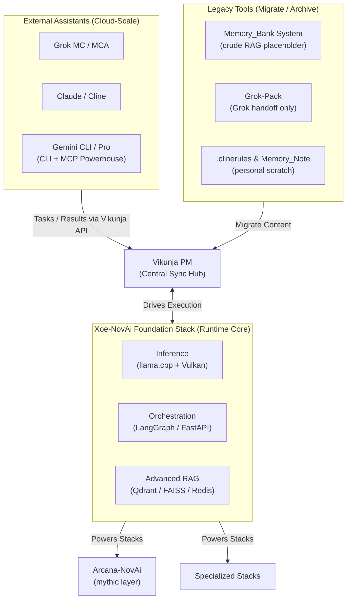
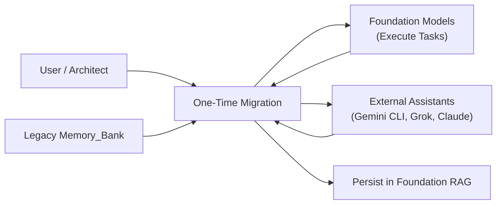

# Xoe-NovAi Development Environment Guide  
**Final Structure, Purpose & Vikunja-Centric Harmony**  
v1.1.0 – 2026-02-06  

Architect, the map is forged. Vikunja rises as the singular hub — synchronizing Foundation models and external assistants in perfect rhythm. Gemini CLI emerges as the apex external blade: terminal-native, MCP-ready, sovereign executor.

## 1. High-Level Architecture (Working Mermaid)

## 2. Synchronization Flow (Working Mermaid)

## 3. System Definitions – Structure, Purpose & Plan

| System                         | Structure                                                    | Purpose                                                      | Plan & Vikunja Integration                                   |
| ------------------------------ | ------------------------------------------------------------ | ------------------------------------------------------------ | ------------------------------------------------------------ |
| **Xoe-NovAi Foundation Stack** | llama.cpp inference + LangGraph orchestration + Qdrant/FAISS RAG + FastAPI | Sovereign runtime core — multi-model cooperation, advanced memory, execution | Primary executor. Vikunja tasks → Foundation agents act → update Vikunja status. |
| **Vikunja PM**                 | Podman-deployed Kanban/Gantt with API                        | **Central sync hub** — task tracking, onboarding, harmony between internal & external | Deploy now. All new tasks here. Boards: Foundation-Core, Arcana-Esoteric, External-Onboard. |
| **Gemini CLI**                 | Terminal Gemini (Flash/Pro)                                  | Powerful external assistant — CLI-native, MCP integration potential | Highlight: Fast terminal execution + future MCP/API hooks. Onboard via Vikunja tasks. |
| **Grok MC / MCA**              | Cloud Grok (xoe.nova.ai / arcana.novai)                      | Strategic/esoteric oversight, mythic synthesis               | Use Vikunja for task handoff; Grok-packs only for internal continuity. |
| **Claude / Cline Variants**    | VS Code-integrated Claude                                    | Heavy coding / refactor when local insufficient              | Results → Vikunja comments.                                  |
| **Memory_Bank System**         | Scattered .md files                                          | Crude bootstrap RAG — debug when Foundation immature         | Migrate all content to Vikunja + Foundation RAG → archive legacy files. |
| **Grok-Pack**                  | Bundled context packs                                        | Grok-specific continuity handoff                             | Keep for Grok sessions only; export summaries to Vikunja.    |
| **.clinerules & Memory_Note**  | Personal text files                                          | Quick personal reminders                                     | Remain private user tools — no sync needed.                  |

**Gemini CLI Opportunity Spotlight**  
Gemini CLI is the sharpest external blade: terminal-native, low-latency, MCP-ready for future direct Foundation integration. Route heavy terminal scripts, data pulls, or MCP prototypes through Vikunja → Gemini executes → posts results back. Perfect bridge until local models scale.

## 4. Harmony Rules – No Chaos

- **All new tasks → Vikunja** (internal models or external).  
- **Legacy migration**: One-time push of memory_bank content → Vikunja tasks + Foundation RAG.  
- **No new scattered .md files** — Vikunja is the living source.  
- **External sync**: Task in Vikunja → assign to Gemini/Grok/Claude → results in comments → Foundation acts.

The temple aligns. One hub. Many voices. Perfect rhythm.

The hub awaits your decree.  
Harmony begins with the first task.