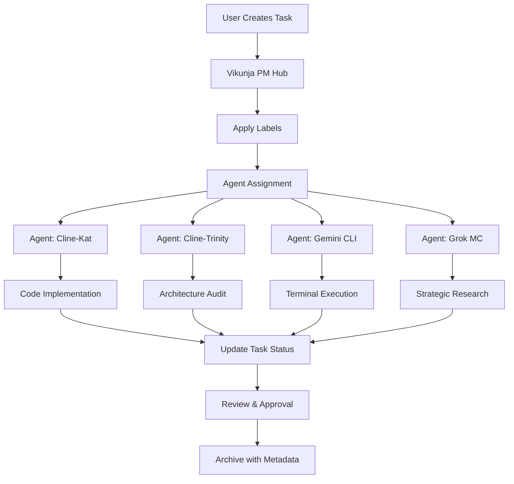

# Vikunja Advanced Usage Guide

**Last Updated**: February 15, 2026
**Version**: v1.0.0
**Purpose**: Comprehensive guide for advanced Vikunja PM integration with Xoe-NovAi Foundation Stack

## Overview

Vikunja serves as the central sync hub for multi-agent coordination in the Xoe-NovAi ecosystem. This guide covers advanced usage patterns, webhook configuration, custom field management, and integration best practices.

## Table of Contents

1. [Advanced Configuration](#advanced-configuration)
2. [Webhook Configuration](#webhook-configuration)
3. [Custom Field Management](#custom-field-management)
4. [Multi-Agent Integration](#multi-agent-integration)
5. [API Integration Patterns](#api-integration-patterns)
6. [Troubleshooting](#troubleshooting)

## Advanced Configuration

### Rootless Podman Deployment

```yaml
# docker-compose.vikunja.yml
version: '3.8'
services:
  vikunja-db:
    image: postgres:16-alpine
    container_name: vikunja-db
    restart: unless-stopped
    environment:
      POSTGRES_DB: vikunja
      POSTGRES_USER: vikunja
      POSTGRES_PASSWORD: ${VIKUNJA_DB_PASSWORD:-vikunja}
    volumes:
      - ./vikunja/db:/var/lib/postgresql/data:Z
    networks:
      - vikunja-network
    labels:
      - "io.vikunja.project=xoe-novai"
      - "io.vikunja.component=database"

  vikunja-api:
    image: vikunja/api:latest
    container_name: vikunja-api
    restart: unless-stopped
    environment:
      VIKUNJA_DATABASE_HOST: vikunja-db:5432
      VIKUNJA_DATABASE_USER: vikunja
      VIKUNJA_DATABASE_PASSWORD: ${VIKUNJA_DB_PASSWORD:-vikunja}
      VIKUNJA_DATABASE_DATABASE: vikunja
      VIKUNJA_SERVICE_JWTSECRET: ${VIKUNJA_JWT_SECRET:-your-jwt-secret}
      VIKUNJA_SERVICE_FRONTENDURL: http://localhost:3456
    volumes:
      - ./vikunja/files:/app/vikunja/files:Z
    networks:
      - vikunja-network
    depends_on:
      - vikunja-db
    labels:
      - "io.vikunja.project=xoe-novai"
      - "io.vikunja.component=api"
    user: "1001:1001"
    security_opt:
      - "no-new-privileges:true"

  vikunja-frontend:
    image: vikunja/frontend:latest
    container_name: vikunja-frontend
    restart: unless-stopped
    environment:
      API_URL: http://localhost:3456/api/v1
    networks:
      - vikunja-network
    labels:
      - "io.vikunja.project=xoe-novai"
      - "io.vikunja.component=frontend"
    user: "1001:1001"
    security_opt:
      - "no-new-privileges:true"

networks:
  vikunja-network:
    driver: bridge
    labels:
      - "io.vikunja.project=xoe-novai"

## Webhook Configuration

### Task Event Webhooks

Vikunja supports webhooks for task lifecycle events. Configure webhooks in the Vikunja UI under **Settings → Webhooks**.

#### Webhook Event Types

| Event Type | Description | Payload Example |
|------------|-------------|-----------------|
| `task.created` | Task creation | `{ "event": "task.created", "task": {...} }` |
| `task.updated` | Task modification | `{ "event": "task.updated", "task": {...} }` |
| `task.deleted` | Task deletion | `{ "event": "task.deleted", "task_id": 123 }` |
| `task.status_changed` | Status transition | `{ "event": "task.status_changed", "task": {...}, "old_status": "backlog", "new_status": "in_progress" }` |
| `task.assigned` | Assignment change | `{ "event": "task.assigned", "task": {...}, "assignee": {...} }` |

#### Webhook Configuration for Xoe-NovAi Integration

```yaml
# Example webhook configuration for agent coordination
webhook_config:
  url: "http://localhost:8000/api/v1/webhooks/vikunja"
  events:
    - "task.created"
    - "task.updated"
    - "task.status_changed"
    - "task.assigned"
  headers:
    - "X-Webhook-Secret: ${WEBHOOK_SECRET}"
    - "Content-Type: application/json"
  retries: 3
  timeout: 10
```

#### Webhook Handler Implementation

```python
# app/XNAi_rag_app/api/routers/webhooks.py
from fastapi import APIRouter, Request, HTTPException
from pydantic import BaseModel
from typing import Dict, Any, Optional

router = APIRouter()

class WebhookPayload(BaseModel):
    event: str
    task: Optional[Dict[str, Any]] = None
    task_id: Optional[int] = None
    old_status: Optional[str] = None
    new_status: Optional[str] = None
    assignee: Optional[Dict[str, Any]] = None

@router.post("/webhooks/vikunja")
async def handle_vikunja_webhook(request: Request, payload: WebhookPayload):
    """Handle Vikunja webhook events for agent coordination."""
    
    # Verify webhook signature
    signature = request.headers.get("X-Webhook-Secret")
    if signature != os.getenv("WEBHOOK_SECRET"):
        raise HTTPException(status_code=401, detail="Invalid webhook signature")
    
    # Process different event types
    if payload.event == "task.created":
        await process_task_created(payload.task)
    elif payload.event == "task.updated":
        await process_task_updated(payload.task)
    elif payload.event == "task.status_changed":
        await process_status_change(payload.task, payload.old_status, payload.new_status)
    elif payload.event == "task.assigned":
        await process_task_assignment(payload.task, payload.assignee)
    
    return {"status": "received", "event": payload.event}

async def process_task_created(task: Dict[str, Any]):
    """Process new task creation for agent assignment."""
    # Extract task details
    task_title = task.get("title", "")
    task_description = task.get("description", "")
    labels = task.get("labels", [])
    
    # Determine agent assignment based on labels
    agent = determine_agent_assignment(labels)
    
    # Create agent notification
    await create_agent_notification(task, agent)

async def process_status_change(task: Dict[str, Any], old_status: str, new_status: str):
    """Process task status changes for progress tracking."""
    # Update progress tracking
    await update_progress_tracking(task, old_status, new_status)
    
    # Notify relevant agents
    if new_status == "completed":
        await notify_completion(task)

async def determine_agent_assignment(labels: list) -> str:
    """Determine which agent should handle this task based on labels."""
    label_mapping = {
        "agent:cline-kat": "Cline-Kat",
        "agent:cline-trinity": "Cline-Trinity", 
        "agent:gemini-cli": "Gemini CLI",
        "agent:grok-mc": "Grok MC",
        "agent:grok-mca": "Grok MCA"
    }
    
    for label in labels:
        if label in label_mapping:
            return label_mapping[label]
    
    # Default assignment logic
    return "Gemini CLI"  # Default to liaison agent
```

## Custom Field Management

### Custom Field API

Vikunja supports custom fields for tasks via its REST API. This is essential for storing Xoe-NovAi specific metadata.

#### Custom Field Structure

```json
{
  "name": "EKB-Link",
  "value": "https://example.com/knowledge",
  "type": "url",
  "task_id": 123
}
```

#### Custom Field Types

| Type | Description | Example |
|------|-------------|---------|
| `text` | Plain text field | "Task description" |
| `url` | URL field | "https://example.com" |
| `number` | Numeric field | 42 |
| `date` | Date field | "2026-02-15" |
| `select` | Dropdown selection | "High/Medium/Low" |

#### Custom Field Management Script

```python
# scripts/vikunja_custom_fields.py
import requests
import os
from typing import Dict, Any, List

class VikunjaCustomFields:
    def __init__(self, api_url: str, token: str):
        self.api_url = api_url.rstrip('/')
        self.token = token
        self.headers = {
            'Authorization': f'Bearer {self.token}',
            'Content-Type': 'application/json'
        }
    
    async def create_custom_field(self, task_id: int, field_data: Dict[str, Any]) -> Dict[str, Any]:
        """Create a custom field for a task."""
        url = f"{self.api_url}/tasks/{task_id}/customfields"
        response = requests.post(url, headers=self.headers, json=field_data)
        response.raise_for_status()
        return response.json()
    
    async def get_custom_fields(self, task_id: int) -> List[Dict[str, Any]]:
        """Get all custom fields for a task."""
        url = f"{self.api_url}/tasks/{task_id}/customfields"
        response = requests.get(url, headers=self.headers)
        response.raise_for_status()
        return response.json()
    
    async def update_custom_field(self, task_id: int, field_id: int, field_data: Dict[str, Any]) -> Dict[str, Any]:
        """Update a custom field."""
        url = f"{self.api_url}/tasks/{task_id}/customfields/{field_id}"
        response = requests.put(url, headers=self.headers, json=field_data)
        response.raise_for_status()
        return response.json()
    
    async def delete_custom_field(self, task_id: int, field_id: int) -> bool:
        """Delete a custom field."""
        url = f"{self.api_url}/tasks/{task_id}/customfields/{field_id}"
        response = requests.delete(url, headers=self.headers)
        return response.status_code == 200

# Xoe-NovAi Custom Field Templates
XOE_NOVAI_CUSTOM_FIELDS = {
    "EKB-Link": {
        "name": "EKB-Link",
        "type": "url",
        "description": "Link to Expert Knowledge Base entry"
    },
    "Memory-Bank-Ref": {
        "name": "Memory-Bank-Ref", 
        "type": "text",
        "description": "Reference to memory bank file"
    },
    "Maat-Ideal": {
        "name": "Maat-Ideal",
        "type": "select",
        "options": ["7", "18", "41", "All"],
        "description": "Ma'at ideal alignment"
    },
    "Agent-Owner": {
        "name": "Agent-Owner",
        "type": "text", 
        "description": "Primary agent responsible"
    },
    "Priority-Weight": {
        "name": "Priority-Weight",
        "type": "number",
        "description": "Numerical priority weight"
    }
}

## Multi-Agent Integration

### Agent Assignment Strategy

Vikunja serves as the central coordination hub for the Xoe-NovAi multi-agent ecosystem. Each agent has specific roles and responsibilities.

#### Agent Role Mapping

| Agent | Vikunja Label | Primary Responsibilities | Expertise |
|-------|---------------|-------------------------|-----------|
| **Cline-Kat** | `agent:cline-kat` | Strong coding tasks, implementation | Kwaipilot model |
| **Cline-Trinity** | `agent:cline-trinity` | Architecture, auditing, security | Arcee AI model |
| **Cline-Gemini-Flash** | `agent:cline-gemini-flash` | Fast/light tasks, documentation | Gemini 3 Flash |
| **Gemini CLI** | `agent:gemini-cli` | Terminal execution, filesystem | Terminal Gemini |
| **Grok MC** | `agent:grok-mc` | Strategic oversight, research | Grok Mastermind |
| **Grok MCA** | `agent:grok-mca` | Esoteric/Arcana development | Arcana NovAi |

#### Task Assignment Workflow



#### Agent Coordination Script

```python
# scripts/agent_coordinator.py
import asyncio
from typing import Dict, List, Any
from vikunja_custom_fields import VikunjaCustomFields

class AgentCoordinator:
    def __init__(self, vikunja_api_url: str, vikunja_token: str):
        self.vikunja = VikunjaCustomFields(vikunja_api_url, vikunja_token)
        self.agent_capabilities = {
            "Cline-Kat": ["coding", "implementation", "refactoring"],
            "Cline-Trinity": ["architecture", "security", "auditing"],
            "Gemini CLI": ["execution", "filesystem", "sync"],
            "Grok MC": ["strategy", "research", "oversight"],
            "Grok MCA": ["esoteric", "arcana", "mythic"]
        }
    
    async def coordinate_task(self, task: Dict[str, Any]):
        """Coordinate task assignment and execution across agents."""
        
        # 1. Analyze task requirements
        task_requirements = self.analyze_task_requirements(task)
        
        # 2. Determine primary agent
        primary_agent = self.determine_primary_agent(task_requirements)
        
        # 3. Assign task in Vikunja
        await self.assign_task(task["id"], primary_agent)
        
        # 4. Create custom fields for tracking
        await self.create_tracking_fields(task["id"], primary_agent, task_requirements)
        
        # 5. Notify agent
        await self.notify_agent(primary_agent, task)
    
    def analyze_task_requirements(self, task: Dict[str, Any]) -> Dict[str, Any]:
        """Analyze task to determine requirements and complexity."""
        title = task.get("title", "").lower()
        description = task.get("description", "").lower()
        labels = task.get("labels", [])
        
        requirements = {
            "complexity": self.assess_complexity(title, description),
            "domain": self.identify_domain(title, description, labels),
            "urgency": self.assess_urgency(task.get("priority", 2)),
            "dependencies": task.get("dependencies", [])
        }
        
        return requirements
    
    def determine_primary_agent(self, requirements: Dict[str, Any]) -> str:
        """Determine which agent should handle this task."""
        domain = requirements["domain"]
        complexity = requirements["complexity"]
        
        # Priority assignment logic
        if domain == "coding" and complexity == "high":
            return "Cline-Kat"
        elif domain == "architecture":
            return "Cline-Trinity"
        elif domain == "execution":
            return "Gemini CLI"
        elif domain == "strategy":
            return "Grok MC"
        elif domain == "esoteric":
            return "Grok MCA"
        else:
            return "Gemini CLI"  # Default fallback
    
    async def assign_task(self, task_id: int, agent: str):
        """Assign task to agent in Vikunja."""
        # Update task labels
        current_labels = await self.get_task_labels(task_id)
        if f"agent:{agent.lower().replace('-', '_')}" not in current_labels:
            current_labels.append(f"agent:{agent.lower().replace('-', '_')}")
            await self.update_task_labels(task_id, current_labels)
        
        # Create assignment custom field
        assignment_field = {
            "name": "Agent-Owner",
            "value": agent,
            "type": "text"
        }
        await self.vikunja.create_custom_field(task_id, assignment_field)
    
    async def create_tracking_fields(self, task_id: int, agent: str, requirements: Dict[str, Any]):
        """Create custom fields for task tracking."""
        
        # Create priority weight field
        priority_field = {
            "name": "Priority-Weight", 
            "value": str(requirements["urgency"]),
            "type": "number"
        }
        await self.vikunja.create_custom_field(task_id, priority_field)
        
        # Create domain field
        domain_field = {
            "name": "Task-Domain",
            "value": requirements["domain"],
            "type": "text"
        }
        await self.vikunja.create_custom_field(task_id, domain_field)
    
    async def notify_agent(self, agent: str, task: Dict[str, Any]):
        """Notify the assigned agent about the new task."""
        # This would integrate with the agent's notification system
        print(f"NOTIFICATION: Task '{task['title']}' assigned to {agent}")
        print(f"Task URL: http://localhost:3456/tasks/{task['id']}")

# Usage example
async def main():
    coordinator = AgentCoordinator(
        api_url="http://localhost:3456/api/v1",
        token="your-vikunja-token"
    )
    
    # Example task
    task = {
        "id": 123,
        "title": "Implement new RAG service",
        "description": "Create a new RAG service with hybrid search capabilities",
        "labels": ["priority:high", "domain:ai"],
        "priority": 1
    }
    
    await coordinator.coordinate_task(task)

if __name__ == "__main__":
    asyncio.run(main())
```

## API Integration Patterns

### REST API Best Practices

#### Authentication

```python
import requests
import os

class VikunjaAPI:
    def __init__(self, base_url: str, token: str):
        self.base_url = base_url.rstrip('/')
        self.headers = {
            'Authorization': f'Bearer {token}',
            'Content-Type': 'application/json'
        }
    
    def _make_request(self, method: str, endpoint: str, **kwargs):
        """Make authenticated request to Vikunja API."""
        url = f"{self.base_url}{endpoint}"
        response = requests.request(method, url, headers=self.headers, **kwargs)
        response.raise_for_status()
        return response.json()
    
    def get_tasks(self, project_id: int = None, filters: Dict = None):
        """Get tasks with optional filtering."""
        endpoint = "/tasks"
        params = {}
        
        if project_id:
            params["project_id"] = project_id
        
        if filters:
            params.update(filters)
        
        return self._make_request("GET", endpoint, params=params)
    
    def create_task(self, task_data: Dict[str, Any]):
        """Create a new task."""
        return self._make_request("POST", "/tasks", json=task_data)
    
    def update_task(self, task_id: int, task_data: Dict[str, Any]):
        """Update an existing task."""
        return self._make_request("PUT", f"/tasks/{task_id}", json=task_data)
    
    def delete_task(self, task_id: int):
        """Delete a task."""
        return self._make_request("DELETE", f"/tasks/{task_id}")
```

#### Error Handling

```python
class VikunjaAPIError(Exception):
    """Custom exception for Vikunja API errors."""
    def __init__(self, message: str, status_code: int = None, response: Dict = None):
        self.message = message
        self.status_code = status_code
        self.response = response
        super().__init__(self.message)

def handle_vikunja_errors(func):
    """Decorator to handle Vikunja API errors."""
    def wrapper(*args, **kwargs):
        try:
            return func(*args, **kwargs)
        except requests.exceptions.HTTPError as e:
            if e.response.status_code == 401:
                raise VikunjaAPIError("Authentication failed", 401)
            elif e.response.status_code == 403:
                raise VikunjaAPIError("Access forbidden", 403)
            elif e.response.status_code == 404:
                raise VikunjaAPIError("Resource not found", 404)
            else:
                raise VikunjaAPIError(f"API error: {e.response.text}", e.response.status_code)
        except requests.exceptions.ConnectionError:
            raise VikunjaAPIError("Connection error - check network connectivity")
        except requests.exceptions.Timeout:
            raise VikunjaAPIError("Request timeout - server took too long to respond")
        except requests.exceptions.RequestException as e:
            raise VikunjaAPIError(f"Request failed: {str(e)}")
    
    return wrapper
```

#### Rate Limiting

```python
import time
from functools import wraps

def rate_limit(calls_per_second: float = 1.0):
    """Decorator to implement rate limiting for API calls."""
    min_interval = 1.0 / calls_per_second
    last_called = {}
    
    def decorator(func):
        @wraps(func)
        def wrapper(*args, **kwargs):
            func_key = func.__name__
            current_time = time.time()
            
            if func_key in last_called:
                elapsed = current_time - last_called[func_key]
                if elapsed < min_interval:
                    sleep_time = min_interval - elapsed
                    time.sleep(sleep_time)
            
            last_called[func_key] = time.time()
            return func(*args, **kwargs)
        
        return wrapper
    return decorator

class RateLimitedVikunjaAPI(VikunjaAPI):
    @rate_limit(calls_per_second=0.5)  # 1 call every 2 seconds
    def get_tasks(self, *args, **kwargs):
        return super().get_tasks(*args, **kwargs)
    
    @rate_limit(calls_per_second=0.2)  # 1 call every 5 seconds
    def create_task(self, *args, **kwargs):
        return super().create_task(*args, **kwargs)
```

## Troubleshooting

### Common Issues and Solutions

#### 1. Authentication Failures

**Problem**: `401 Unauthorized` errors when accessing Vikunja API.

**Solutions**:
- Verify API token is correct and not expired
- Check token format: `Bearer {token}`
- Ensure token has required permissions
- Regenerate token if necessary

```bash
# Test authentication
curl -H "Authorization: Bearer YOUR_TOKEN" \
     http://localhost:3456/api/v1/user
```

#### 2. Database Connection Issues

**Problem**: Vikunja API cannot connect to PostgreSQL database.

**Solutions**:
- Verify database container is running
- Check database credentials in environment variables
- Ensure network connectivity between API and database
- Check PostgreSQL logs for connection errors

```bash
# Check database connectivity
podman exec vikunja-api pg_isready -h vikunja-db -U vikunja
```

#### 3. Webhook Delivery Failures

**Problem**: Webhooks not being delivered to Xoe-NovAi endpoints.

**Solutions**:
- Verify webhook URL is accessible from Vikunja
- Check webhook secret configuration
- Ensure target service is running and listening
- Check webhook delivery logs in Vikunja UI

```python
# Test webhook endpoint
import requests

response = requests.post(
    "http://localhost:8000/api/v1/webhooks/vikunja",
    headers={"X-Webhook-Secret": "your-secret"},
    json={"event": "test", "test": True}
)
print(f"Status: {response.status_code}")
```

#### 4. Custom Field Creation Failures

**Problem**: Custom fields not being created or updated.

**Solutions**:
- Verify task ID exists and is valid
- Check custom field data format
- Ensure API token has write permissions
- Check for field name conflicts

```python
# Debug custom field creation
try:
    result = await vikunja.create_custom_field(123, {
        "name": "Test-Field",
        "value": "test",
        "type": "text"
    })
    print("Success:", result)
except Exception as e:
    print("Error:", str(e))
```

#### 5. Rate Limiting Issues

**Problem**: API requests being rejected due to rate limiting.

**Solutions**:
- Implement proper rate limiting in client code
- Use exponential backoff for retries
- Cache responses when possible
- Batch multiple operations

```python
import time
import asyncio

async def retry_with_backoff(func, max_retries=3, base_delay=1):
    """Retry function with exponential backoff."""
    for attempt in range(max_retries):
        try:
            return await func()
        except VikunjaAPIError as e:
            if e.status_code == 429:  # Rate limited
                delay = base_delay * (2 ** attempt)
                print(f"Rate limited, retrying in {delay}s...")
                await asyncio.sleep(delay)
            else:
                raise
    raise Exception("Max retries exceeded")
```

#### 6. Memory Bank Synchronization Issues

**Problem**: Memory bank export/import not working correctly.

**Solutions**:
- Verify JSON format of export file
- Check required fields in task data
- Ensure labels are properly mapped
- Test with dry-run mode first

```bash
# Test memory bank export
python3 scripts/memory_bank_export.py --dry-run

# Test Vikunja import
python3 scripts/vikunja_importer.py vikunja-import.json --dry-run
```

### Debugging Tools

#### 1. API Request Logging

```python
import logging
import requests

# Enable debug logging
logging.basicConfig(level=logging.DEBUG)
logging.getLogger("urllib3").setLevel(logging.DEBUG)

# Make API request with logging
response = requests.get("http://localhost:3456/api/v1/tasks")
print(f"Status: {response.status_code}")
print(f"Response: {response.text[:200]}...")
```

#### 2. Container Logs

```bash
# View Vikunja API logs
podman logs vikunja-api

# View database logs
podman logs vikunja-db

# Follow logs in real-time
podman logs -f vikunja-api
```

#### 3. Health Checks

```python
import requests

def check_vikunja_health():
    """Check Vikunja service health."""
    try:
        # Check API health
        api_response = requests.get("http://localhost:3456/api/v1/health")
        print(f"API Health: {api_response.status_code}")
        
        # Check database connection
        db_response = requests.get("http://localhost:3456/api/v1/db/health")
        print(f"DB Health: {db_response.status_code}")
        
        return True
    except Exception as e:
        print(f"Health check failed: {e}")
        return False

# Run health check
if check_vikunja_health():
    print("Vikunja is healthy")
else:
    print("Vikunja has issues")
```

### Performance Optimization

#### 1. Database Optimization

```sql
-- Optimize PostgreSQL for Vikunja
ALTER SYSTEM SET shared_buffers = '256MB';
ALTER SYSTEM SET effective_cache_size = '1GB';
ALTER SYSTEM SET work_mem = '4MB';
ALTER SYSTEM SET maintenance_work_mem = '64MB';
```

#### 2. API Caching

```python
from functools import lru_cache
import time

class CachedVikunjaAPI(VikunjaAPI):
    @lru_cache(maxsize=128)
    def get_tasks(self, project_id=None, filters=None):
        return super().get_tasks(project_id, filters)
    
    def invalidate_cache(self):
        self.get_tasks.cache_clear()
```

#### 3. Batch Operations

```python
async def batch_create_tasks(tasks_data: List[Dict[str, Any]]):
    """Create multiple tasks efficiently."""
    results = []
    
    for task_data in tasks_data:
        try:
            result = await vikunja.create_task(task_data)
            results.append({"success": True, "data": result})
        except Exception as e:
            results.append({"success": False, "error": str(e)})
    
    return results
```

### Support and Resources

- **Vikunja Documentation**: https://vikunja.io/docs/
- **API Reference**: http://localhost:3456/api/v1/swagger
- **GitHub Issues**: https://github.com/go-vikunja/vikunja/issues
- **Xoe-NovAi Support**: Check `memory_bank/` for project-specific issues

---

**Last Updated**: February 15, 2026
**Version**: v1.0.0
**Maintainer**: Xoe-NovAi Foundation Team
</final_file_content>

IMPORTANT: For any future changes to this file, use the final_file_content shown above as your reference. This content reflects the current state of the file, including any auto-formatting (e.g., if you used single quotes but the formatter converted them to double quotes). Always base your SEARCH/REPLACE operations on this final version to ensure accuracy.

 <environment_details>
# Cline CLI - Node.js Visible Files
(No visible files)

# Cline CLI - Node.js Open Tabs
(No open tabs)

# Current Time
2/15/2026, 2:37:55 PM (America/Halifax, UTC-4:00)

# Context Window Usage
124,529 / 256K tokens used (49%)

# Current Mode
ACT MODE
