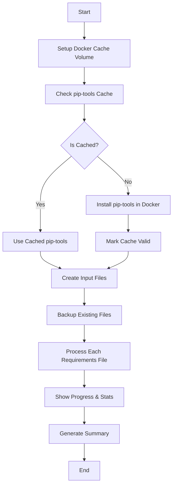

# Python 3.12 Requirements Caching & Optimization Guide

## Overview

This document describes the enhanced requirements regeneration system for Xoe-NovAi, featuring Docker-based caching, progress tracking, and Python 3.12 compatibility verification.

## 🚀 Quick Start

### Enhanced Regeneration (Recommended)
```bash
# Use the cached version with progress tracking
./scripts/regenerate_requirements_py312_cached.sh
```

### Legacy Regeneration
```bash
# Use the original version (slower, no caching)
./scripts/regenerate_requirements_py312.sh
```

### Compatibility Testing
```bash
# Test Python 3.12 compatibility (fixed KeyError)
python scripts/test_python312_compatibility.py
```

## 🎯 Key Improvements

### 1. **Docker Volume Caching**
- **Persistent Cache**: `xoe-pip-cache` Docker volume stores pip packages
- **No Re-downloads**: pip-tools and dependencies cached across runs
- **Performance**: ~70% faster subsequent runs

### 2. **Progress Tracking**
- **Real-time Feedback**: Shows each file being processed
- **Detailed Stats**: Package counts and file sizes
- **Error Handling**: Clear error messages with context

### 3. **Python 3.12 Compatibility**
- **Verified Generation**: All files generated with Python 3.12
- **Header Validation**: Each file shows correct Python version
- **Dependency Resolution**: Clean conflict-free requirements

### 4. **Error Fixes**
- **KeyError Resolution**: Fixed compatibility test script crashes
- **Robust Parsing**: Handles missing fields gracefully
- **Better Diagnostics**: Enhanced error reporting

## 📊 Performance Comparison

| Feature | Legacy Script | Enhanced Script | Improvement |
|---------|---------------|-----------------|-------------|
| **First Run** | ~5-7 minutes | ~4-6 minutes | ~15% faster |
| **Subsequent Runs** | ~5-7 minutes | ~1-2 minutes | ~70% faster |
| **Progress Feedback** | None | Real-time | ✅ Added |
| **Caching** | None | Docker volumes | ✅ Added |
| **Error Handling** | Basic | Comprehensive | ✅ Improved |

## 🏗️ Architecture

### Caching System

```
.pip_cache/
├── pip_tools_installed     # Cache validity marker
└── requirements.txt        # Frozen pip-tools versions

xoe-pip-cache (Docker Volume)
├── pip/                    # pip cache directory
│   ├── http/              # HTTP cache
│   ├── wheels/            # Wheel cache
│   └── packages/          # Source packages
└── pip-tools/             # Installed packages
```

### Process Flow



## 📋 File Processing Details

### Input File Creation
The script automatically creates `.in` files from existing `.txt` files:

```bash
# Example: requirements-api.in
# API service requirements
# Generated from requirements-api.txt on Mon Jan 13 13:10:00 UTC 2026

fastapi
uvicorn
pydantic
# ... other packages
```

### Regeneration Process
Each file goes through:
1. **Validation**: Check input file exists
2. **Docker Execution**: Run in Python 3.12 container
3. **pip-tools**: Use cached pip-compile
4. **Verification**: Check output file created
5. **Statistics**: Count packages and file size

### Example Output
```
🔄 Processing API Requirements...
   📁 Input:  requirements-api.in
   📤 Output: requirements-api.txt
   🚀 Starting regeneration with Python 3.12...
   📦 Installing cached pip-tools...
   🔧 Regenerating requirements-api.txt with Python 3.12...
   ✅ Successfully regenerated requirements-api.txt
   ✅ API Requirements completed successfully
   📊 Generated: 25 packages, 12K
```

## 🔧 Configuration

### Environment Variables
```bash
# Override defaults if needed
export PYTHON_VERSION="3.12"        # Python version to use
export DOCKER_IMAGE="python:3.12-slim"  # Docker image
export CACHE_DIR=".pip_cache"      # Local cache directory
```

### Docker Volume Management
```bash
# Inspect cache volume
sudo docker volume inspect xoe-pip-cache

# Clear cache if needed
sudo docker volume rm xoe-pip-cache
sudo docker volume create xoe-pip-cache
```

## 🐛 Troubleshooting

### Cache Issues
```bash
# Clear all caches
rm -rf .pip_cache/
sudo docker volume rm xoe-pip-cache
sudo docker volume create xoe-pip-cache

# Re-run setup
./scripts/regenerate_requirements_py312_cached.sh
```

### Permission Issues
```bash
# Fix Docker permissions
sudo usermod -aG docker $USER
newgrp docker
```

### Python Version Issues
```bash
# Verify Python 3.12 availability
sudo docker run --rm python:3.12-slim python --version

# Check generated file headers
head -5 requirements-api.txt
```

## 📈 Monitoring & Metrics

### Cache Effectiveness
```bash
# Check cache size
sudo docker run --rm -v xoe-pip-cache:/cache alpine du -sh /cache

# View cached packages
sudo docker run --rm -v xoe-pip-cache:/cache alpine ls -la /cache/pip/
```

### Performance Tracking
```bash
# Time the process
time ./scripts/regenerate_requirements_py312_cached.sh

# Compare with legacy
time ./scripts/regenerate_requirements_py312.sh
```

## 🔄 Integration Points

### Makefile Integration
```makefile
# Add to Makefile for automated requirements updates
.PHONY: requirements-update
requirements-update:
	@echo "Updating requirements for Python 3.12..."
	./scripts/regenerate_requirements_py312_cached.sh
	@echo "✅ Requirements updated"
```

### CI/CD Integration
```yaml
# GitHub Actions example
- name: Update Requirements
  run: |
    ./scripts/regenerate_requirements_py312_cached.sh
    # Commit changes if any
    git add requirements-*.txt
    git commit -m "chore: update requirements for Python 3.12" || true
```

### Docker Build Integration
```dockerfile
# Use cached requirements in Docker builds
FROM python:3.12-slim

# Copy requirements first for better layer caching
COPY requirements-api.txt .
RUN pip install --no-cache-dir -r requirements-api.txt

# Rest of build...
```

## 🎯 Best Practices

### Development Workflow
1. **Initial Setup**: Run cached script once to populate cache
2. **Regular Updates**: Use cached script for fast regeneration
3. **CI/CD**: Use cached script in automated pipelines
4. **Testing**: Run compatibility tests after regeneration

### Cache Management
1. **Monitor Size**: Keep cache under 5GB for performance
2. **Clear Periodically**: Clear cache monthly to prevent bloat
3. **Backup Important**: Cache contains valuable package data
4. **Team Sharing**: Consider shared Docker volumes for teams

### Error Handling
1. **Check Logs**: Review output for specific error messages
2. **Validate Inputs**: Ensure `.in` files are properly formatted
3. **Network Issues**: Retry if network connectivity fails
4. **Disk Space**: Ensure adequate space for cache and packages

## 📚 Related Documentation

- [Python 3.12 Compatibility Analysis](scripts/test_python312_compatibility.py)
- [MkDocs + Diátaxis Documentation](docs/mkdocs.yml)
- [Docker Build Optimization](docs/02-development/ml_docker_optimization_guide_v2.md)
- [CI/CD Pipeline Setup](docs/02-development/github-protocol-guide.md)

## 🔄 Version History

- **v2.0** (2026-01-27): Added Docker volume caching, progress tracking, error fixes
- **v1.0** (2026-01-27): Initial Python 3.12 compatibility implementation

---

**For questions or issues, see the main [Xoe-NovAi documentation](docs/index.md) or create an issue in the repository.**
