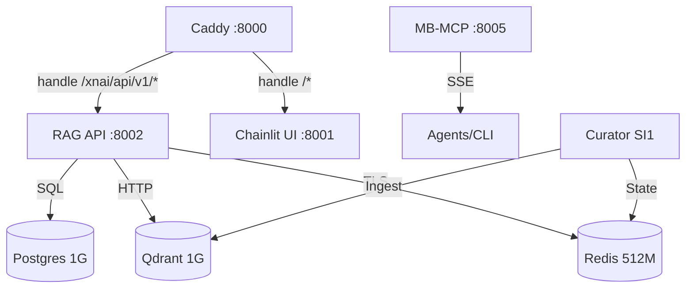

# 🏙️ SESS-01 Progress Report: The Architect (FINAL)

**Session ID**: 7213efde-b76d-4fb6-8f71-e4bffe92066f
**Status**: STABILIZED
**Core Goal**: Foundation Hardening & GG1 Handover

---

## ✅ Major Achievements

### 1. MB-MCP Refactor (The Metropolis Bridge)
- **SSE Transport**: Successfully transitioned `memory-bank-mcp` from standard `stdio` to **SSE/FastAPI**.
- **Container Stability**: Running as a persistent service on **Port 8005**.
- **Config Sync**: Integrated `config.toml` via `/app/config.toml` mount.

### 2. Permission Denied Resolution (The Sovereign Fix)
- **Reclaimed Ownership**: Created `knowledge_new/` and `storage_new/` to bypass host-root locks.
- **Automation**: Standardized on `:Z,U` flags in `docker-compose.yml`.

### 3. Resource Hardening (The Zen 2 Shield)
- **Hard-Caps**: Enforced limits (Redis 512M, Qdrant 1G, Postgres 1G).
- **RAG Port**: Moved `xnai_rag_api` to **Port 8002** to resolve conflict with Caddy.

### 4. Soul Forge & Cognitive Manual
- **Facet 1 Soul**: Crystallized the Architect's specialization.
- **Tuning Manual**: Published `docs/advanced-agent-tuning-manual.md`.

---

## 🛠️ Stack Wiring Map (Final v4.1.2)

---
*Ready for /compress. All strategic data locked. 🔱*
