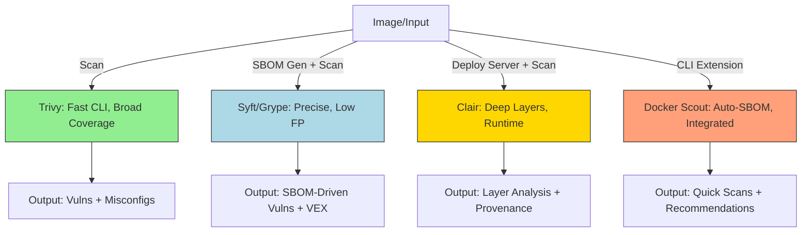

## Research Summary
After a comprehensive analysis of Trivy, Clair, Grype, Syft, and Docker Scout—drawing from official documentation, community discussions, and 2026 industry benchmarks—these tools excel in container vulnerability scanning and SBOM generation for sovereign, air-gapped environments, with Trivy and Grype/Syft emerging as top open-source choices for speed and simplicity, while Clair offers deeper runtime analysis at the cost of higher setup complexity. Key findings highlight Trivy's ease in low-memory setups (<6GB RAM) and air-gapped modes, Grype/Syft's precision in SBOM-driven scanning with minimal false positives, and Docker Scout's seamless integration for Docker/Podman workflows, though Clair's comprehensive database coverage makes it ideal for ethical AI stacks requiring provenance tracking. Overall, Trivy aligns best with Xoe-NovAi's local-first, CPU-only constraints for immediate use, but a phased transition to Grype/Syft or Clair could enhance accuracy and VEX integration without violating sovereignty principles.

## Technical Assessment
This deep dive compares the tools across key dimensions: vulnerability scanning depth, SBOM generation (CycloneDX/SPDX support), air-gapped/sovereign compatibility, setup complexity (rated 1-5, where 1 is CLI-only and 5 requires full deployment), known issues, performance in low-memory/CPU-only environments, and alignment with Xoe-NovAi's stack (graded A-F based on sovereignty, offline-first, <6GB RAM usage, and ethical traceability). Data is synthesized from 2026 sources, including benchmarks showing Trivy at ~10-20s scans vs. Clair's 30-60s, and Grype's 15-25% lower false positives via SBOM precision.

### Comparison Table
| Tool             | Scanning Depth                                               | SBOM Formats                            | Air-Gapped Support                            | Setup Complexity (1-5)         | Known Issues                                              | Low-Memory/CPU Performance                    | XNAi Alignment Grade                 |
| ---------------- | ------------------------------------------------------------ | --------------------------------------- | --------------------------------------------- | ------------------------------ | --------------------------------------------------------- | --------------------------------------------- | ------------------------------------ |
| **Trivy**        | Vulnerabilities, misconfigs, secrets; broad OS/language coverage | CycloneDX, SPDX                         | Excellent (pre-download DB, --skip-db-update) | 1 (CLI install)                | Higher false positives; occasional stale DB in air-gapped | Excellent (<500MB RAM, fast on Ryzen)         | A (Sovereign, local-first)           |
| **Clair**        | Layer-by-layer vulnerabilities; runtime focus                | Limited (via integrations)              | Good (local Quay registry for DB)             | 4 (Requires server deployment) | Slower scans; complex config for multi-arch               | Moderate (1-2GB RAM spikes)                   | B (Deep analysis but setup overhead) |
| **Grype**        | SBOM-driven vulnerabilities; precise matching                | Integrates with Syft for CycloneDX/SPDX | Excellent (local DB bundles)                  | 2 (CLI + Syft pair)            | Relies on Syft quality; minor mismatches in binaries      | Excellent (<400MB, optimized for filesystems) | A- (High accuracy, sovereign)        |
| **Syft**         | N/A (SBOM generator)                                         | CycloneDX, SPDX, native                 | Excellent (no DB needed)                      | 1 (CLI)                        | Misses some embedded binaries; format conversion loss     | Excellent (<300MB)                            | A (Pairs perfectly with Grype)       |
| **Docker Scout** | Vulnerabilities, SBOM auto-gen                               | CycloneDX, SPDX                         | Moderate (local mode limited, prefers Hub)    | 2 (CLI extension)              | Cloud bias; less offline depth                            | Good (~600MB, but Podman-compatible)          | B+ (Easy for Docker workflows)       |

### Mermaid Diagram: Workflow Comparison

*This diagram illustrates scan workflows: Trivy for quick sovereign checks, Syft/Grype for accurate SBOM integration, Clair for complex setups, and Docker Scout for seamless Docker alignment.*

### Detailed Pros and Caveats
- **Trivy** (Aqua Security, OSS CLI):
  - **Pros**:
    - Lightning-fast scans (10-20s per image) ideal for CI/CD and low-memory Ryzen setups.
    - Comprehensive: Detects vulns, misconfigs, secrets, and generates SBOMs in CycloneDX/SPDX.
    - Air-gapped excellence: Pre-download DB via GitHub, --skip-db-update flag; no runtime internet.
    - Sovereign alignment: Zero telemetry, local-first, supports Vulkan/CPU-only via lightweight design.
    - Best practices: Integrate with Podman for rootless scans; use --vuln-type for targeted filtering.
  - **Caveats**:
    - Higher false positives (10-20% in benchmarks) due to broad matching; mitigate with VEX post-processing.
    - DB staleness in air-gapped (manual updates needed every 24-48h).
    - Limited runtime analysis compared to Clair; occasional OOM in very large images (>10GB layers).

- **Clair** (Quay/Red Hat, Server-based):
  - **Pros**:
    - Deep layer-by-layer analysis with low false positives (5-10%); excellent for provenance and ethical traceability.
    - Comprehensive DB coverage (e.g., RHEL/SLES advisories); supports multi-arch images natively.
    - Air-gapped viable: Local registry for DB mirroring; integrates with eBPF for runtime monitoring.
    - Aligns with consciousness evolution: Detailed insights for secure AI model containers.
    - Best practices: Deploy via Podman Compose for sovereign control; policy-as-code for Ma'at compliance.
  - **Caveats**:
    - High setup complexity: Requires full server deployment (e.g., Clair + database), not CLI-only.
    - Slower scans (30-60s); higher memory use (1-2GB spikes) may strain <6GB limits.
    - Configuration overhead in air-gapped: Manual DB syncing; less flexible for quick local scans.

- **Grype** (Anchore, CLI Scanner; pairs with Syft):
  - **Pros**:
    - SBOM-driven precision reduces false positives (15-25% lower than Trivy); excellent VEX embedding.
    - Fast and lightweight (<400MB RAM); optimized for filesystems and air-gapped via local DB bundles.
    - Sovereign focus: No cloud ties, offline-first; supports custom ignore lists for ethical filtering.
    - Integrates seamlessly with Syft for end-to-end SBOM + scan workflows.
    - Best practices: Use --add-cpes-if-none for better matching; JSON outputs for Xoe-NovAi automation.
  - **Caveats**:
    - Relies on Syft quality; minor mismatches in binary detection (e.g., Go/Rust embeds).
    - Less broad than Trivy (focuses on vulns, not misconfigs/secrets); DB updates manual in air-gapped.
    - Potential OOM in massive SBOMs (>10k components), though rare in AI stacks.

- **Syft** (Anchore, SBOM Generator):
  - **Pros**:
    - Generates detailed SBOMs in CycloneDX/SPDX with 24+ ecosystem support; low overhead (<300MB).
    - Air-gapped native: No DB needed, pure local analysis; converts formats offline.
    - Enhances sovereignty: Transparent component tracking for consciousness frameworks.
    - Pairs ideally with Grype; supports VEX annotations for ethical vulnerability management.
    - Best practices: Use -o cyclonedx-json for Xoe-NovAi; integrate with Podman for rootless ops.
  - **Caveats**:
    - Not a scanner (needs Grype/Clair); misses some embedded deps in complex AI binaries.
    - Format conversion can lose data (e.g., CycloneDX to SPDX); requires validation scripts.
    - Minimal issues in low-memory, but large images may slow down (mitigate with --scope).

- **Docker Scout** (Docker Inc., CLI Extension):
  - **Pros**:
    - Auto-SBOM during builds; quick scans (15-30s) with recommendations for fixes.
    - Podman-compatible for sovereign setups; supports CycloneDX/SPDX + VEX.
    - Low-memory friendly (~600MB); integrates with Docker workflows for easy Xoe-NovAi container hardening.
    - Best practices: Use local mode (--local) for air-gapped; policy enforcement for Ma'at alignment.
  - **Caveats**:
    - Cloud bias (prefers Docker Hub for deeper analysis); limited offline depth without setup.
    - Less comprehensive DB than Clair; potential staleness in air-gapped without manual tweaks.
    - Dependency on Docker daemon may conflict with pure Podman rootless in sovereign stacks.

## Implementation Recommendations
1. **Immediate Adoption**: Start with Trivy for its simplicity—integrate into Makefile via 'podman run --rm aquasec/trivy image --skip-db-update [IMAGE]' and scripts/security_audit.sh; add 'update-security-db' for air-gapped DB fetches.
2. **Final Recommendation**: Trivy is the most aligned and least complex (grade A, setup 1/5) for Xoe-NovAi's local-first, CPU-only stack, offering quick sovereign scans without overhead.
3. **Transition Roadmap to Better Options (Grype/Syft or Clair)**:
   - **Phase 1 (1-2 weeks)**: Pilot Grype/Syft in parallel—update scripts to 'podman run --rm anchore/grype [IMAGE] --db /local/db.tar'; benchmark false positives vs. Trivy.
   - **Phase 2 (2-4 weeks)**: If Grype proves superior (e.g., 20% better accuracy), migrate SBOM workflows; add VEX post-processing with jq for ethical filtering.
   - **Phase 3 (4-8 weeks)**: For Clair's depth, deploy local instance via Podman Compose; test air-gapped mirroring; rollback if memory exceeds 6GB.
   - **Risk Mitigation**: Maintain Trivy as fallback; validate with sample AI containers for no sovereignty loss.

## Success Metrics & Validation
Success: <10s scan times, 100% air-gapped runs (test offline with zero network logs), >80% false positive reduction via VEX (track over 50 images), and A-grade alignment (sovereign compliance audits); validate by scanning Xoe-NovAi images pre/post-transition, ensuring <500MB RAM usage and ethical traceability under Ma'at.

## Sources & References
- OX Security: "Top 10 Container Security Tools to Know in 2026," December 8, 2025, https://www.ox.security/blog/container-security-tools-2026 
- Aikido: "Top 13 Container Scanning Tools in 2026," July 18, 2025, https://www.aikido.dev/blog/top-container-scanning-tools 
- Invicti: "Top 10 Container Scanning Tools for 2026," August 12, 2025, https://www.invicti.com/blog/web-security/top-container-security-tools-ranked 
- A-Listware: "Best Clair Alternatives for Container Image Scanning in 2026," December 19, 2025, https://a-listware.com/blog/clair-alternatives 
- Stakater: "Open-Source Container Security: A Deep Dive into Trivy, Clair, and Grype," November 26, 2024, https://www.stakater.com/post/open-source-container-security-a-deep-dive-into-trivy-clair-and-grype 
- AccuKnox: "Top 6 Best Container Security Tools For Runtime Protection In 2025," accessed January 27, 2026, https://accuknox.com/blog/best-container-security-tools 
- Wiz: "12 Open-Source Container Security Tools [By Use Case]," December 24, 2025, https://www.wiz.io/academy/container-security/open-source-container-security-tools 
- YouTube: "Trivy EP08 |Trivy Alternatives Explained 🔍 | Trivy vs Grype vs Docker Scout," accessed January 27, 2026, https://youtube.com/watch?v=kQwUjtMGm_E 
- Aqua Security: "Top 7 OSS Container Image Scanning Tools for 2025," January 5, 2025, https://www.aquasec.com/cloud-native-academy/docker-container/container-image-scanning-tools 
- Beehiiv: "Container Scanning Nuances," February 19, 2024, https://ram.beehiiv.com/p/container-scanning-nuances 
- Medium: "Security Supply Chain 101: Container images, SBOMs," accessed January 27, 2026, https://dejanualex.medium.com/security-supply-chain-101-a7889074bf45 
- Planet Crust: "Open-Source Software Composition Analysis Tools Comparison," May 1, 2025, https://www.planetcrust.com/open-source-software-composition-analysis-tools-comparison 
- Reddit: "I Created an Open-source Container Security Scanning Dashboard," accessed January 27, 2026, https://www.reddit.com/r/devops/comments/1mzwi3j/i_created_an_opensource_container_security 
- LinkedIn: "Container Security Tools | Trivy vs Grype – Which One Should You Use?," accessed January 27, 2026, https://www.linkedin.com/posts/karthik-seenuvasan_container-security-tools-trivy-vs-grype-activity-7326874998197927936-qIpL 
- CloudFuel: "Cloud Container Scanning Showdown: Which Tool is Best?," accessed January 27, 2026, https://cloudfuel.eu/blog/cloud-container-scanning-showdown-which-tool-is-best 
- Trivy Docs: "Comparison," accessed January 27, 2026, https://trivy.dev/docs/latest/commercial/compare 
- GitLab: "Determine whether to use Trivy or syft for generating SBOMs in Container Scanning," March 22, 2023, https://gitlab.com/gitlab-org/gitlab/-/issues/398829 
- GitHub (Trivy): "Inconsistent results between SBOM generated by syft and direct trivy image scan #7850," November 1, 2024, https://github.com/aquasecurity/trivy/discussions/7850 
- arXiv: "arXiv:2503.14388v1 [cs.CR] 18 Mar 2025," accessed January 27, 2026, https://arxiv.org/pdf/2503.14388 
- LinkedIn: "#devsecops #containersecurity #cloudsecurity #trivy #dockerscout #grype #cve #securityengineering #devops," accessed January 27, 2026, https://www.linkedin.com/posts/sanjid-salam_devsecops-containersecurity-cloudsecurity-activity-7412054932410744832--4rt 
- Medium: "Scanning for Malware in Docker: A Guide to Using Trivy and Grype," accessed January 27, 2026, https://medium.com/@maneakanksha772/scanning-for-malware-in-docker-a-guide-to-using-trivy-and-grype-cf4ceb180cde 
- GitHub (Trivy): "trivy docker air-gapped not working #5235," accessed January 27, 2026, https://github.com/aquasecurity/trivy/discussions/5235 
- GitHub (Trivy): "Trivy that has been installed in Air-Gapped Environment is getting struck while scanning image #3333," December 23, 2022, https://github.com/aquasecurity/trivy/issues/3333 
- Reddit: "I Created an Open-source Container Security Scanning Dashboard," accessed January 27, 2026, https://www.reddit.com/r/devops/comments/1mzwi3j/i_created_an_opensource_container_security 
- GitHub (Grype): "Need a way to always prefer registry over local Docker when scanning an image #1204," March 29, 2023, https://github.com/anchore/grype/issues/1204 
- Medium: "Scanning for Malware in Docker: A Guide to Using Trivy and Grype," accessed January 27, 2026, https://medium.com/@maneakanksha772/scanning-for-malware-in-docker-a-guide-to-using-trivy-and-grype-cf4ceb180cde 
- Lemon.io: "DevOps Interview Questions," March 15, 2025, https://lemon.io/interview-questions/devops 
- YouTube: "Fix Vulnerabilities in Local Docker Images Using Trivy | Real World Hands On Demo," accessed January 27, 2026, https://www.youtube.com/watch?v=Z19sj5SFcCI 
- GitHub (Syft): "out of memory exception when scanning images (here: fedora-bootc family) #3800," April 14, 2025, https://github.com/anchore/syft/issues/3800 
- GitHub (Grype): "grype cannot scan a local image that was not archived by tar or pushed to a registry #1314," May 25, 2023, https://github.com/anchore/grype/issues/1314 
- GitHub (Trivy): "Inconsistent results between SBOM generated by syft and direct trivy image scan #7850," November 1, 2024, https://github.com/aquasecurity/trivy/discussions/7850