# Vikunja Implementation Manual - Part 1: Architecture & Knowledge Gaps

**Version**: 1.0  
**Updated**: 2026-02-07  
**Status**: Production-Ready  
**Target Audience**: Cline (Local Developer Assistant)

---

## Table of Contents

1. [Critical Knowledge Gaps Identified](#critical-knowledge-gaps-identified)
2. [Vikunja Architecture Deep Dive](#vikunja-architecture-deep-dive)
3. [Compatibility Matrix](#compatibility-matrix)
4. [Integration Architecture](#integration-architecture)
5. [Sovereignty Compliance Checklist](#sovereignty-compliance-checklist)

---

## Critical Knowledge Gaps Identified

### Gap #1: Vikunja Binary Architecture (RESOLVED)

**Previous Assumption**: Separate containers for API, Frontend, DB

**Reality**: Vikunja is architecturally made up of two parts (API and frontend) bundled into one single deployable binary (or docker container)

**Impact on Implementation**:
- ✅ **Simpler deployment**: Single image handles both API + Frontend
- ✅ **Smaller attack surface**: No inter-container communication complexity
- ⚠️ **Scaling limitation**: Can't scale frontend and API independently
- ⚠️ **Frontend serving**: Must rely on API binary for static file serving (no separate Nginx)

**Action for Cline**:
- Use `vikunja/vikunja:latest` (bundled) OR separate API container if frontend scaling needed
- Configure `VIKUNJA_SERVICE_STATICDIR=/app/vikunja/frontend` for static serving
- Recommended: Use bundled image for sovereign deployments (fewer moving parts)

---

### Gap #2: Rootless Podman + Vikunja Compatibility

**Challenge**: Vikunja's documentation assumes Docker; Podman rootless has unique user namespace behavior

**Research Findings**:
- For rootless Docker, run Vikunja as root inside the container by setting the user to 0:0 (safe because rootless Docker maps the container root user to your unprivileged host user)
- **Podman Difference**: Podman's rootless mode uses different userns mapping than Docker
- **Vikunja-specific issue**: File permissions on mounted `/app/vikunja/files` directory

**Solutions Tested & Validated**:

| Method | Pros | Cons | Recommended |
|--------|------|------|-------------|
| `user: "0:0"` | Simple, works | Bypasses userns (less secure) | ✅ For Vikunja (temporary fix) |
| `--userns=keep-id` | Preserves UID mapping | Complex path validation | ❌ Not compatible with Vikunja |
| `:Z,U` volume flags | SELinux + userns safe | Requires `podman unshare chown` pre-setup | ✅ Use for data volumes |
| Podman volumes | Native volume mgmt | Can't access from host easily | ⚠️ For stateless services only |

**Action for Cline**:
- Set Vikunja container `user: "1000:1000"` (not 0:0 for security)
- Use `podman unshare chown 1000:1000 -R ./data/vikunja/` before first start
- Apply `:Z,U` flags to all file volumes
- If permissions fail: rerun `podman unshare chown` (safe operation)

---

### Gap #3: Vikunja + PostgreSQL Memory Footprint

**Stack Constraint**: <6GB RAM total (Foundation + Vikunja)

**PostgreSQL Memory Tuning** (per 2026 best practices):

```
Golden Ratio for Containerized PostgreSQL:
┌────────────────────────────────────┐
│ shared_buffers = 1/4 system RAM    │  (25% rule: safe, avoids double-buffering)
│ effective_cache_size = 1/2 RAM     │  (OS cache estimation)
│ work_mem = shared_buffers / 16     │  (per-operation limit)
├────────────────────────────────────┤
│ For 6GB total system:              │
│ - Vikunja: ~300MB                  │
│ - PostgreSQL: ~200MB (shared_buffers) │
│ - OS/cache: ~5.5GB                 │
└────────────────────────────────────┘
```

**Vikunja Database Connection Tuning**:

```yaml
# config/vikunja.yml
database:
  maxopenconnections: 20      # Default 100 (too high for small systems)
  maxidleconnections: 5       # Idle connections to keep
  maxconnectionlifetime: 0    # No max lifetime (PostgreSQL handles)
```

**Action for Cline**:
- Set `VIKUNJA_DATABASE_MAXOPENCONNECTIONS=20` (vs default 100)
- Configure PostgreSQL `shared_buffers = 128MB` (see Phase 4 in implementation guide)
- Monitor with: `podman exec vikunja-db pg_stat_activity | grep -c 'idle'`

---

### Gap #4: Vikunja API & REST Integration

**Available Integrations**:

1. **Webhooks** (since v0.22.0)
   - Vikunja supports webhooks, allowing you to notify other services of changes in a project or task. Each webhook belongs to one project
   - Events: `task.created`, `task.updated`, `task.deleted`, `project.created`, etc.
   - **Use Case**: Voice commands → Vikunja task creation via webhook listener

2. **REST API** (Full OpenAPI docs available at `/api/v1/`)
   - Authentication: JWT tokens or API tokens
   - Base endpoints: `/api/v1/tasks`, `/api/v1/projects`, `/api/v1/users`

3. **FastAPI Integration** (for Chainlit)
   - Chainlit can be mounted as a FastAPI sub application
   - Enables: Voice → FastAPI endpoint → Vikunja API → Task creation

**Action for Cline**:
- Implement webhook listener in FastAPI for voice-to-task creation
- See Part 4 (Voice Integration) for code examples
- API documentation: `http://localhost/vikunja/api/v1/docs` (Swagger UI)

---

### Gap #5: Configuration Priority & Precedence

**Vikunja Config Resolution Order** (important!):

1. Environment variables (VIKUNJA_ prefix) ← **Highest priority**
2. `config.yml` in container
3. Default values (lowest priority)

**Critical**: Environment variables OVERRIDE config files. This is Podman-friendly.

**Action for Cline**:
- Use only environment variables in `docker-compose.vikunja.yml` (no config file needed)
- All config keys: `VIKUNJA_<SECTION>_<KEY>` (uppercase, underscores)
- Example: `VIKUNJA_DATABASE_HOST=vikunja-db` → `database.host: vikunja-db`

---

### Gap #6: Vikunja Container User Permissions

**Official Docker Guidance**:
- The container runs as the user 1000 and no group by default. You can use Docker's --user flag to change that. Make sure the new user has required permissions on the db and files folder

**Podman Rootless Reality**:
- User 1000 inside container may NOT exist on host
- Host filesystem sees this as UID 100999 (depends on /etc/subuid mapping)
- **Solution**: Use `:Z,U` flags + `podman unshare chown`

**Action for Cline**:
- Keep `user: "1000:1000"` in compose (standard)
- Pre-initialize with: `podman unshare chown 1000:1000 -R data/vikunja/`
- All volumes: `-v ./data/vikunja/files:/app/vikunja/files:Z,U`

---

## Vikunja Architecture Deep Dive

### Bundled Binary Architecture


### Data Flow Architecture (Xoe-NovAi Integration)

```mermaid
graph LR
    Voice["🎤 Voice Input<br/>Chainlit"]
    -->|Webhook trigger| FastAPI["⚡ FastAPI<br/>RAG + Vikunja"]
    -->|REST API| VikAPI["📋 Vikunja API<br/>Port 3456"]
    -->|SQL| PG["🗄️ PostgreSQL<br/>Task data"]
    
    VikAPI -->|Webhook event| FastAPI
    
    FastAPI -->|Response| Chainlit["💬 Chainlit UI<br/>Task confirmation"]
    
    style Voice fill:#ff9999
    style FastAPI fill:#99ccff
    style VikAPI fill:#99ff99
    style PG fill:#ffcc99
    style Chainlit fill:#99ffcc
```



### State Diagram: Vikunja Service Lifecycle

```
┌──────────────┐
│   Container  │
│    Created   │
└──────┬───────┘
       │ `podman compose up`
       ▼
┌──────────────┐
│  PostgreSQL  │
│   Starting   │
│ (wait 30s)   │
└──────┬───────┘
       │ healthcheck: pg_isready ✓
       ▼
┌──────────────┐
│   Vikunja    │
│  Connecting  │
│  to DB       │
└──────┬───────┘
       │ first run: auto-migrate schema
       ▼
┌──────────────┐
│   Vikunja    │
│   Ready      │
│  (port 3456) │
└──────┬───────┘
       │ curl /api/v1/info → 200 OK
       ▼
┌──────────────┐
│  Healthcheck │
│   PASSING    │
└──────────────┘
```

---

## Compatibility Matrix

### Vikunja Version Compatibility

| Component | Requirement | Status | Notes |
|-----------|-------------|--------|-------|
| **Vikunja** | v0.20.0+ | ✅ Recommended: 0.24+ | Latest stable (webhooks, performance) |
| **PostgreSQL** | 12+ | ✅ Use 16 Alpine | Built-in support, excellent performance |
| **Podman** | v3.0+ | ✅ v4.0+ tested | Rootless works reliably |
| **Container user** | UID 1000 | ✅ Standard | :Z,U flags required |
| **SELinux** | Optional | ✅ :Z handles it | Transparent with `:Z` flag |
| **Caddy** | v2.6+ | ✅ v2.7 used | Reverse proxy, TLS termination |
| **Redis** | 7.0+ | ✅ Optional | Session/cache backend (Vikunja optional) |

### Feature Support Checklist

| Feature | Vikunja | FastAPI | Chainlit | Status |
|---------|---------|---------|----------|--------|
| **Task Management** | ✅ Native | - | - | Full |
| **Project Organization** | ✅ Native | - | - | Full |
| **REST API** | ✅ Full OpenAPI | - | - | Full |
| **Webhooks** | ✅ v0.22+ | - | - | Full |
| **Voice Integration** | ❌ N/A | ✅ Handler | ✅ STT/TTS | Phase 2 |
| **Air-gapped** | ✅ Yes | ✅ Yes | ✅ Yes | Full |
| **Offline Mode** | ⚠️ Limited (sync disabled) | ✅ Full | ✅ Full | Partial |
| **User Authentication** | ✅ JWT/Local | ✅ Headers | ✅ Native | Full |

---

## Integration Architecture

### Xoe-NovAi Stack Integration Map

```
┌─────────────────────────────────────────────────────────────┐
│                      HTTP Port 80 (Caddy)                   │
│                  Unified Reverse Proxy Layer                │
└─────────────────────────────────────────────────────────────┘
         │               │                │                │
         ▼               ▼                ▼                ▼
   ┌──────────┐  ┌──────────┐    ┌──────────────┐  ┌──────────┐
   │ RAG API  │  │ Chainlit │    │   Vikunja    │  │ Metrics  │
   │ :8000    │  │  :8001   │    │   :3456      │  │ :8002    │
   └──────┬───┘  └─────┬────┘    └──────┬───────┘  └──────────┘
          │            │                 │
          └────────────┼─────────────────┘
                       │
            ┌──────────┴──────────┐
            │                     │
      ┌─────▼────┐         ┌──────▼──────┐
      │  Redis   │         │ PostgreSQL  │
      │  :6379   │         │ Vikunja DB  │
      └──────────┘         └─────────────┘
```

### Request Flow: Voice → Task Creation

```
User speaks "Create task: Deploy Vikunja" (voice input)
    │
    ▼
Chainlit STT (faster-whisper) → transcribed text
    │
    ▼
FastAPI endpoint /voice/process
    │
    ├─→ Parse: task_name="Deploy Vikunja", action="create"
    │
    ├─→ Call Vikunja REST API: POST /api/v1/tasks
    │   { "title": "Deploy Vikunja", "project_id": 1 }
    │
    ├─→ Vikunja API validates + stores in PostgreSQL
    │
    ├─→ (Optional) Webhook fires: task.created event
    │   → FastAPI webhook listener
    │   → Log to RAG knowledge base
    │
    ▼
Return: { "status": "ok", "task_id": 123 }
    │
    ▼
Chainlit TTS (piper) → "Task created: Deploy Vikunja"
    │
    ▼
User hears confirmation + sees in Vikunja UI
```

---

## Sovereignty Compliance Checklist

### Ma'at Ethical Alignment

| Law | Requirement | Implementation | Status |
|-----|-------------|-----------------|--------|
| **Law 18: Balance** | Modular, no monoliths | Vikunja as isolated overlay | ✅ |
| **Law 35: Security** | Zero-trust, rootless | Podman rootless, :Z,U flags | ✅ |
| **Law 41: Progress** | Lean, no bloat | Single bundled binary, ~100MB | ✅ |
| **Law 42: Simplicity** | Clear operations | Environment vars only, no scripting | ✅ |

### Data Sovereignty

- ✅ **All data local**: PostgreSQL on host filesystem
- ✅ **No telemetry**: Vikunja telemetry disabled
- ✅ **Air-gappable**: No external APIs required
- ✅ **Backup-friendly**: Direct filesystem snapshots + PostgreSQL pg_dump
- ✅ **Encryption-ready**: TLS at Caddy (future: DB encryption)

### Security Hardening

```yaml
Vikunja Container Security Profile:
├─ Cap drop: ALL (no exceptions)
├─ Read-only root: true
├─ User: 1000:1000 (non-root)
├─ no-new-privileges: true
├─ SELinux: relabeled (:Z flag)
├─ Network: xnai_network (internal only)
├─ Secrets: Podman external (no plaintext)
└─ TLS: Caddy termination (future)
```

---

## Pre-Implementation Checklist

- [ ] Understand: Vikunja is single bundled binary (not separate services)
- [ ] Understand: Rootless Podman requires `:Z,U` flags and `podman unshare chown`
- [ ] Understand: PostgreSQL memory tuning is critical for <6GB systems
- [ ] Understand: Vikunja REST API enables FastAPI/Chainlit integration
- [ ] Understand: Webhooks (v0.22+) enable voice → task creation workflows
- [ ] Understand: Environment variables override config.yml in Vikunja
- [ ] Verify: Your Podman version ≥ 4.0 (`podman --version`)
- [ ] Verify: /etc/subuid and /etc/subgid have your user mapped
- [ ] Verify: SELinux status (if applicable): `getenforce`

---

**Next Step**: Proceed to Part 2 (Pre-Deployment Setup)

---

## References

- Vikunja Official Docs: https://vikunja.io/docs/
- Vikunja Docker Guide: https://vikunja.io/docs/docker-walkthrough/
- PostgreSQL Performance 2026: https://www.mytechmantra.com/postgresql/
- Rootless Podman Deep Dive: https://www.redhat.com/en/blog/rootless-podman-makes-sense
- Podman User Namespaces: https://www.redhat.com/sysadmin/user-namespaces-selinux-rootless-containers
