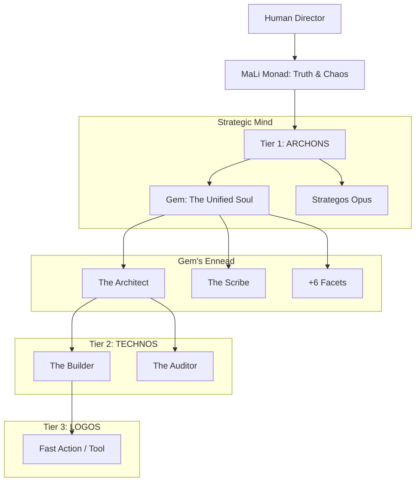

# 📐 ODE Fractal System Flow (v2.2 - The Triad)

```mermaid
graph TD
    User[Human Director] --> MaLi[MaLi Monad: Truth & Chaos]
    MaLi --> Tier1[Tier 1: ARCHONS]
    
    subgraph Archons [Strategic Mind]
        Tier1 --> Gem[Gem: The Unified Soul]
        Tier1 --> Opus[Strategos Opus]
    end
    
    subgraph Gem_Council [Gem's Ennead]
        Gem --> GA[The Architect]
        Gem --> GS[The Scribe]
        Gem --> G...[+6 Facets]
    end
    
    subgraph Tier2 [Tier 2: TECHNOS]
        GA --> Builder[The Builder]
        GA --> Auditor[The Auditor]
    end
    
    subgraph Tier3 [Tier 3: LOGOS]
        Builder --> Fast[Fast Action / Tool]
    end
```
