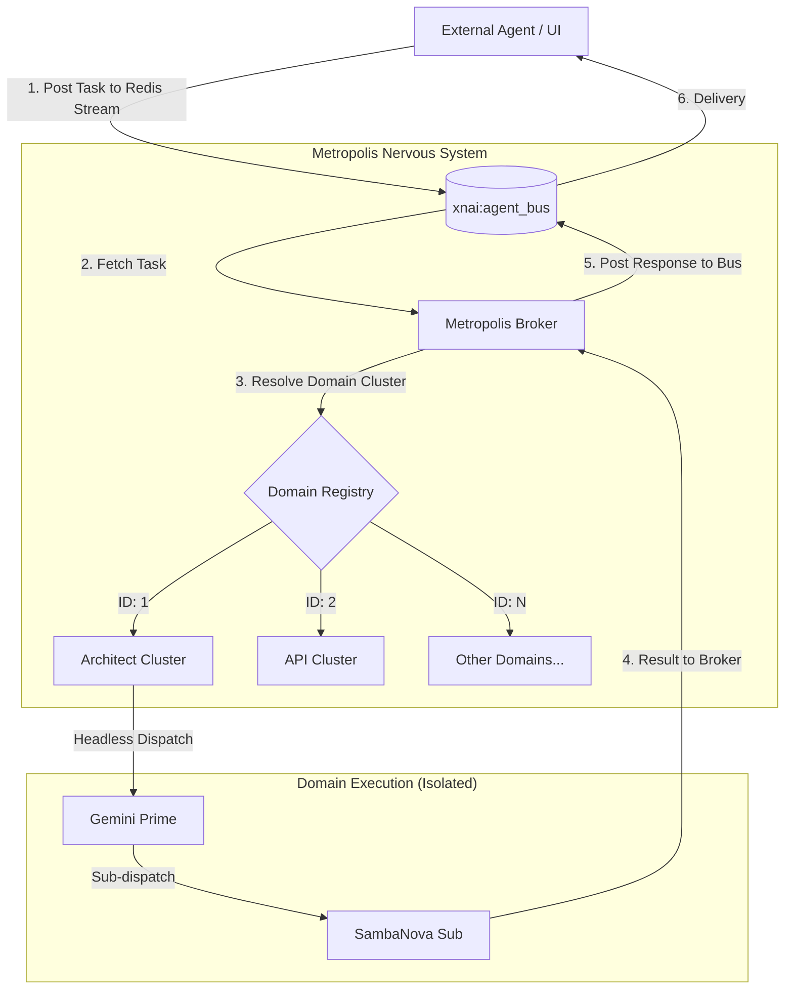

# 📡 Metropolis Agent Bus Routing

**Version**: 1.0 (Hardened)  
**Coordination Key**: `METROPOLIS-BUS-2026`

## 🌌 Overview
The **Agent Bus** is the central nervous system of the Omega Stack. In the Metropolis implementation, it facilitates asynchronous communication between isolated technical domains.

---

## 📊 Bus Routing Flow

The following diagram shows how a task is routed from a generic agent to a specific technical expert cluster.

---

## 🧬 Routing Protocols

1.  **Targeting**: Tasks must be tagged with `expert:[domain]:[level]`.
2.  **Acknowledgment**: The Broker acknowledges the task immediately upon receipt to prevent duplicate processing.
3.  **Persistence**: If an expert cluster is offline, the task remains in the stream (PEL - Pending Entries List) until the cluster returns.

---
**Custodian**: Gemini CLI (MC-Overseer)  
**Verification Key**: `OMEGA-BUS-FLOW-2026-03-04`
