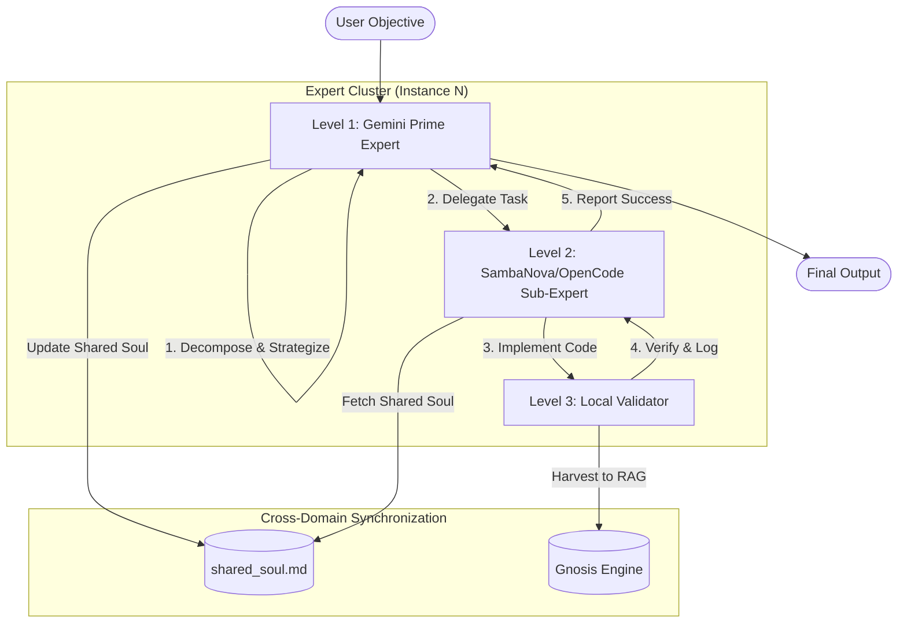
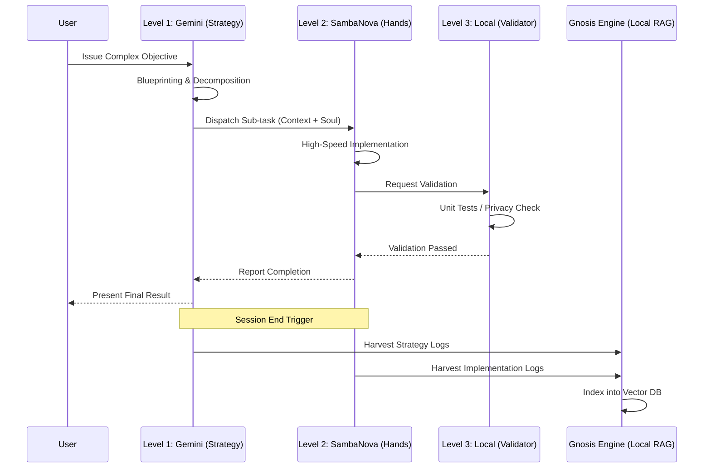

# 🏯 Metropolis Hierarchical Architecture

**Version**: 1.1 (Hardened)  
**Coordination Key**: `HIERARCHICAL-METROPOLIS-2026`  
**Status**: ACTIVE

## 🌌 Overview
The **Metropolis Hierarchy** is a specialized implementation of the XNAi Multi-Expert System. It organizes 8 technical domains into a 3-level provider matrix, optimizing for strategy, execution speed, and local sovereignty.

---

## 🏗️ The 3-Level Matrix

### Level 1: The Prime Brain (Strategy)
*   **Provider**: Gemini 3.1 Pro
*   **Role**: High-level reasoning, system blueprinting, and cross-agent orchestration.
*   **Capabilities**: Complex logic, Mermaid diagram generation, and multi-step planning.

### Level 2: The Hands (Implementation)
*   **Provider**: SambaNova (Llama 3.1 405B) / OpenCode (Zen)
*   **Role**: High-speed code generation and technical implementation.
*   **Capabilities**: Rapid prototyping, unit test writing, and bug fixing.

### Level 3: The Ground (Validation)
*   **Provider**: Local Models (Qwen / Llama 3.2)
*   **Role**: Pre-filtering, summarization, and local data verification.
*   **Capabilities**: Zero-latency analysis, privacy-first data handling, and unit test execution.

---

## 📊 Hierarchical Flow Diagram

---

---

## 🛰️ Token & Knowledge Flow

The following diagram illustrates the precision flow of tokens and the conversion of transient cloud insights into permanent local knowledge.

## 🧬 Domain Mapping (The 8 Districts)

| # | District | Specialization | Path |
|---|----------|----------------|------|
| 1 | **Architect** | System Blueprinting | `instance-1/` |
| 2 | **API** | Backend & Redis Streams | `instance-2/` |
| 3 | **UI** | Frontend & UX | `instance-3/` |
| 4 | **Voice** | STT/TTS & Audio | `instance-4/` |
| 5 | **Data** | RAG & Vector DB | `instance-5/` |
| 6 | **Ops** | Infrastructure & Podman | `instance-6/` |
| 7 | **Research** | Knowledge Mining | `instance-7/` |
| 8 | **Test** | QA & Validation | `instance-8/` |

---

## 🛡️ Sovereignty & Data Sync

### 1. The Knowledge Harvester
Conversation data from **all levels** is captured by `scripts/harvest-expert-data.sh` and ingested into the local **Gnosis Engine**. This ensures that insights generated by cloud models are preserved locally.

### 2. Expert Soul Evolution
Every domain expert maintains a persistent `expert_soul.md`. This file is updated after each session via `scripts/expert-soul-reflector.py`, allowing the expert to "grow" specialized knowledge specific to its district.

---
**Custodian**: Gemini CLI (MC-Overseer)  
**Verification Key**: `OMEGA-METROPOLIS-HIERARCHY-2026-03-04`
