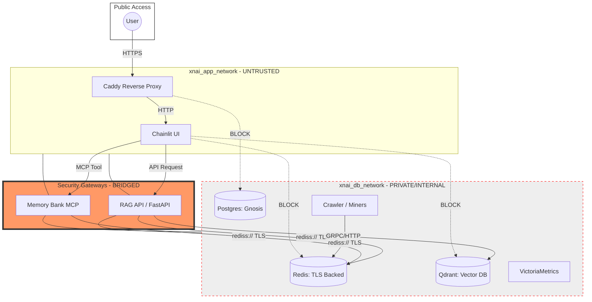
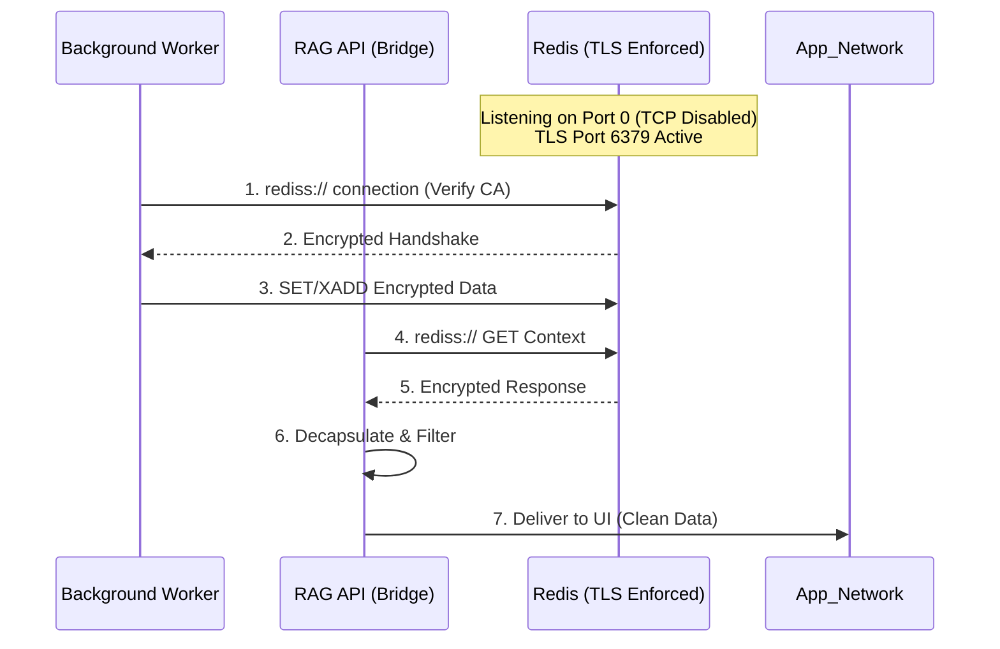

# 🛡️ Metropolis Network Shield Architecture

The **Metropolis Network Shield** is a Zero-Trust infrastructure design implemented on 2026-03-08. It enforces a strict "Gateway-Only" data access pattern, ensuring that sensitive backends are never directly exposed to the UI or the public internet.

---

## 🏗️ 1. Zero-Trust Network Partitioning

The stack is partitioned into two distinct Podman networks. Communication between them is only possible through authorized "Bridge" services.

### 🗝️ Key Isolation Rules
1.  **Direct DB Access Banned**: The UI and Caddy containers physically cannot resolve the hostnames or IPs of Redis, Postgres, or Qdrant.
2.  **Internal-Only**: The `xnai_db_network` is marked as `internal: true`, preventing containers within it from reaching the public internet (mitigating data exfiltration risks).
3.  **Bridge Accountability**: Every database query or memory retrieval MUST pass through the **RAG API** or **Memory Bank MCP**. These bridges enforce:
    *   **S2 Auth Token** validation.
    *   **JWT Signature** verification.
    *   **Logging/Audit** of all access.

---

## 🔐 2. Redis TLS Backbone

All traffic within the "Hearth" (the backend mesh) is encrypted using Mutual TLS (or server-side TLS) to prevent packet sniffing between containers.

### 🛡️ Hardening Details
- **Protocol**: `rediss://` (Strict TLS).
- **Verification**: All clients use a local `ca.crt` to verify the Redis server identity.
- **Fail-Fast**: If the certificate is missing or invalid, the connection terminates immediately.

---

## 🛠️ 3. Maintenance Pulse

| Action | Command | Frequency |
|:---|:---|:---|
| **Health Check** | `./scripts/stack_health_check.sh` | Daily |
| **Cert Rotation** | `./scripts/generate_tls_certs.sh` | Annual / On-Breach |
| **Audit Logs** | `podman logs xnai_caddy` | Weekly |

---
*Document sealed by Gemini General. Technical Integrity: 100%.*
