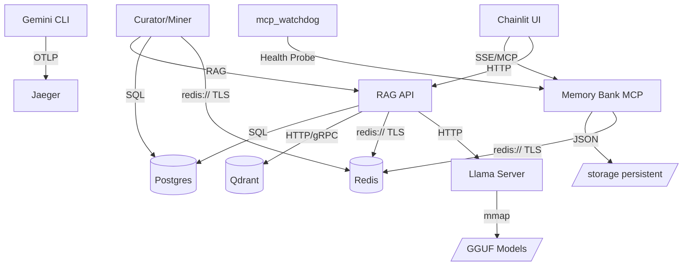

# 🔱 Metropolis Wiring Map & Service Dependencies

**Version**: 1.0.0 (Metropolis v4.1.2 Revision)
**Status**: ACTIVE
**Hardware Context**: Ryzen 7 5700U (Zen 2) | 6.6GB RAM Budget

---

## 🏛️ 1. Network Topology (Zero-Trust Shield)

The Metropolis is partitioned into two primary Podman networks, enforcing isolation between untrusted entrypoints and private data cores.

### 🌐 xnai_app_network (UNTRUSTED)
- **Role**: Front-facing services and external gateways.
- **Members**:
  - `xnai_caddy`: Reverse proxy (Port 8000).
  - `xnai_chainlit_ui`: User interface (Port 8001).
- **Security**: Can only reach the **Bridge Layer**. Cannot see the DB core.

### 🔐 xnai_db_network (PRIVATE / INTERNAL)
- **Role**: Private data storage and processing workers.
- **Internal Only**: `internal: true` (No internet access).
- **Members**:
  - `xnai_redis`: Cache & Agent Bus (TLS Port 6379).
  - `xnai_qdrant`: Vector Database (Ports 6333/6334).
  - `xnai_postgres`: Hybrid Gnosis storage (Port 5432).
  - `xnai_victoriametrics`: Telemetry storage (Port 8428).
  - `xnai_jaeger`: Distributed Tracing / OTLP Collector (Port 4317/16686).
  - `xnai_llama_server`: Local LLM Inference Engine (Port 8000).
  - `xnai_crawler`, `xnai_knowledge_miner`, `xnai_curation_worker`: Data workers.

### 🌁 The Bridge Layer (AUTHORIZED)
- **Role**: Secure data routing between App and DB networks.
- **Members**:
  - `xnai_rag_api`: FastAPI backend (Port 8000).
  - `xnai_memory_bank_mcp`: Refactored SSE/FastAPI MCP (Port 8000).
- **Connectivity**: Dual-homed on both networks. Enforces S2 Auth and JWT validation.

---

## 🛠️ 2. Critical Service Dependencies

---

## ⚡ 3. Low-Resource Optimizations (Zen 2 Specific)

### 🧠 Memory Hard-Caps (6.6GB Total Budget)
- **Redis**: 512MB (LRU Policy).
- **Qdrant**: 1GB (On-Disk + mmap + Scalar Quantization).
- **Postgres**: 1GB.
- **Llama Server**: 2GB (Reduced `n_ctx=2048`, `mlock=false`).
- **RAG API**: 2GB (Llama-cpp `f16_kv` optimization).
- **UI/Other**: 512MB - 1GB.

### 🚀 Build & Storage Persistence
- **HuggingFace Cache**: Named volume `xnai_huggingface_cache` persists Whisper/Embedding models across builds.
- **Wheel Caching**: BuildKit mounts enable sub-60s Python dependency resolution.
- **Model Registry**: Discovered models are indexed in `models/registry.json`.

### 🚀 CPU Steering
- **Zen 2 Tuning**: Services utilize `OPENBLAS_CORETYPE=ZEN` and `LLAMA_CPP_N_THREADS=6`.
- **Parallelism**: Background workers restricted to 1-2 threads to prevent cache thrashing.

---

## 🔑 4. Authentication & Identity (IAM)

- **S2 Token**: Mandatory for all MCP tool calls.
- **Ed25519**: All messages on the `xnai:agent_bus` (Redis Streams) are cryptographically signed.
- **JWT**: Shared-secret validation between RAG API and UI.

---
*Wiring Map Sealed by GG2 Archon. Full visibility achieved. 🔱*
