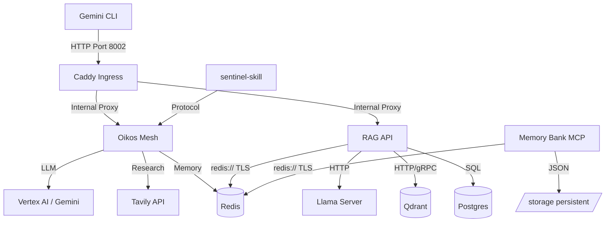

# 🔱 Metropolis Wiring Map & Service Dependencies

**Version**: 1.1.0 (Oikos cognitive mesh integration)
**Status**: ACTIVE
**Hardware Context**: Ryzen 7 5700U (Zen 2) | 6.6GB RAM Budget

---

## 🏛️ 1. Network Topology (Zero-Trust Shield)

The Metropolis is partitioned into two primary Podman networks, enforcing isolation between untrusted entrypoints and private data cores.

### 🌐 xnai_app_network (UNTRUSTED)
- **Role**: Front-facing services and external gateways.
- **Members**:
  - `xnai_caddy`: Reverse proxy (Port 8000 internally, Port 8002 host).
  - `xnai_chainlit_ui`: User interface (Port 8001).
- **Security**: Can only reach the **Bridge Layer**. Cannot see the DB core.

### 🔐 xnai_db_network (PRIVATE / INTERNAL)
- **Role**: Private data storage and processing workers.
- **Internal Only**: `internal: true` (No internet access).
- **Members**:
  - `xnai_redis`: Cache & Agent Bus (TLS Port 6379).
  - `xnai_qdrant`: Vector Database (Ports 6333/6334).
  - `xnai_postgres`: Hybrid Gnosis storage (Port 5432).
  - `xnai_victoriametrics`: Telemetry storage (Port 8428).
  - `xnai_jaeger`: Distributed Tracing / OTLP Collector (Port 4317/16686).
  - `xnai_llama_server`: Local LLM Inference Engine (Port 8000).
  - `xnai_crawler`, `xnai_knowledge_miner`, `xnai_curation_worker`: Data workers.

### 🌁 The Bridge Layer (AUTHORIZED)
- **Role**: Secure data routing between App and DB networks.
- **Members**:
  - `xnai_rag_api`: FastAPI backend (Port 8000).
  - `xnai_oikos`: Cognitive Mesh & Mastermind (Port 8006).
  - `xnai_memory_bank_mcp`: Refactored SSE/FastAPI MCP (Port 8000).
- **Connectivity**: Dual-homed on both networks. Enforces S2 Auth, JWT validation, and Decrypted OAuth (Rainbow Rotation).

---

## 🛠️ 2. Critical Service Dependencies

---

## 🔑 3. Authentication & Identity (IAM)

- **S2 Token**: Mandatory for all MCP tool calls.
- **UID 1000**: Global standard for all container users and host mounts.
- **OAuth Decryption**: Symmetric Fernet encryption for Gemini credentials (`XNAI_OAUTH_KEY`).
- **Rainbow Rotation**: Automatic key rotation for high-bandwidth LLM inference.

---
*Wiring Map Sealed by The Sentinel. Oikos Harmony Achieved. 🔱*
