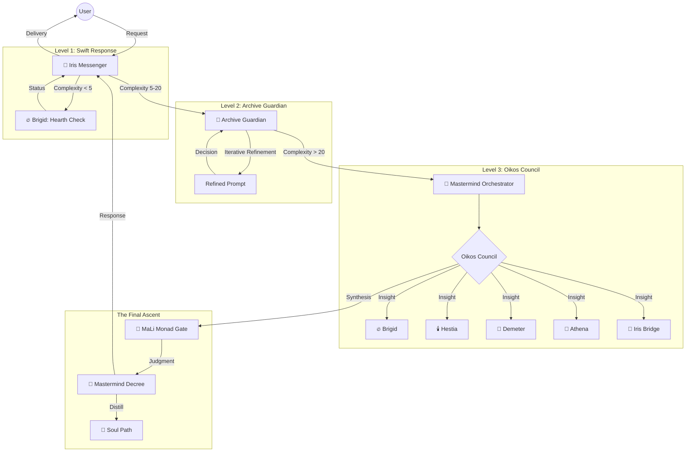

# 🔱 Omega Stack: Oikos Mastermind Architecture
**Date**: March 11, 2026 | **Status**: ACTIVE PROTOCOL

## 🌐 Cognitive Flow Diagram

## 🏛️ Process Hooks & Functions

| Function | Archetype | Component | Logic |
|:---|:---|:---|:---|
| `route_request` | Iris | `oikos_service.py` | Determines escalation level based on complexity. |
| `call_level_2` | Archive Guardian | `oikos_mastermind.py` | Performs iterative prompt refinement. |
| `orchestrate_oikos` | Sentinel | `oikos_service.py` | Manages sequential Council speaking turns. |
| `judge_decree` | MaLi | `mali_gate.py` | Balances Maat/Lilith for final approval. |
| `distill_cycle` | Sentinel | `soul_distiller.py` | Records evolution in `SOUL_PATHS.yaml`. |

---

## 📡 Port & Network Map
- **Oikos Mesh API**: Port 8006 (FastAPI)
- **Memory Bank**: Port 8005 (FastAPI/MCP)
- **Redis**: Port 6379 (Isolated in `xnai_db_network`)
- **Prometheus**: Port 9090 (Observability)
