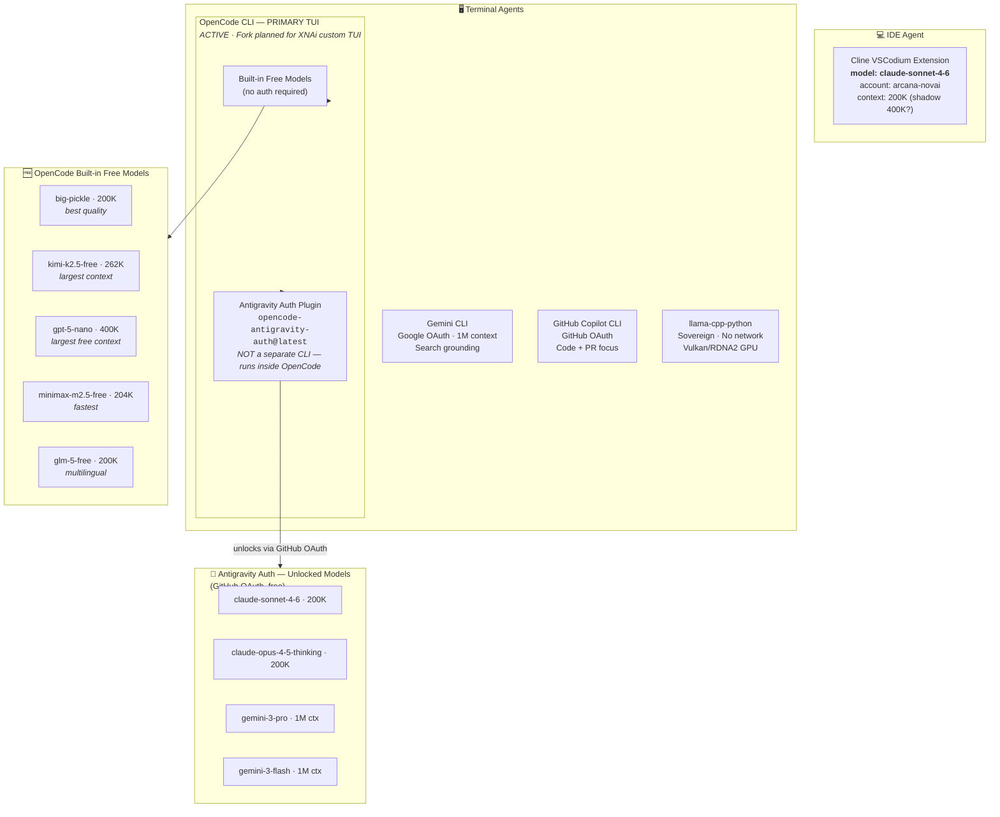
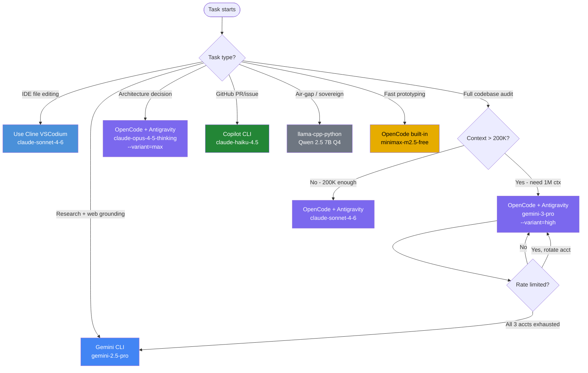

# XNAi Agent Taxonomy

> **Authoritative classification of every AI agent, CLI tool, and plugin in the XNAi ecosystem.**
> All agents, documentation, configs, and code must conform to this taxonomy.
> Source of truth: `configs/agent-identity.yaml`

---

## Agent Map



---

## Classification Rules

> ⚠️ **These rules are enforced in `.opencode/RULES.md` rules 14, 26, and the Agent Taxonomy section.**

| Entity | Correct Classification | Wrong Classification |
|--------|----------------------|---------------------|
| `opencode-antigravity-auth@latest` | OAuth **plugin** running **inside** OpenCode CLI | ❌ "Antigravity CLI", "separate agent", pip package |
| OpenCode CLI | **ACTIVE** primary TUI, fork planned | ❌ "archived", "deprecated" |
| Cline extension model | `claude-sonnet-4-6` | ❌ `claude-opus-4-5` (Sprint 5 error — corrected Sprint 6) |
| Antigravity auth type | GitHub OAuth | ❌ Google OAuth |

---

## Provider Tier Summary

| Tier | Provider | Auth | Best For | Context |
|------|----------|------|----------|---------|
| 1 | **OpenCode + Antigravity Plugin** | GitHub OAuth | Daily coding, architecture, 1M tasks | 200K–1M |
| 1b | **Cline VSCodium** | Anthropic API | IDE-integrated file editing | 200K |
| 2 | **Gemini CLI** | Google OAuth | Research, search-grounded synthesis | 1M |
| 3 | **GitHub Copilot CLI** | GitHub OAuth | PR review, GitHub-native tasks | 128K–1M |
| 4 | **OpenCode Built-ins** | None | Zero-auth fallback | 200K–400K |
| 5 | **OpenRouter** | API key | Paid frontier access | varies |
| 6 | **llama-cpp-python** | None (local) | Air-gap, zero telemetry | varies |

---

## Routing Decision Tree



---

## OpenCode Fork Plan

OpenCode CLI upstream (`opencode-ai/opencode`) was archived by original maintainers.
**This does NOT affect usage.** arcana-novai:
- Continues using OpenCode as primary TUI
- Plans to fork the repository as `arcana-novai/opencode-xnai` or `xnai-tui`
- Fork will add: XNAi RAG integration, Qdrant memory, sovereign MC agent hooks, custom RULES loader

See: `internal_docs/01-strategic-planning/OPENCODE-XNAI-FORK-PLAN.md`

---

## Files

| File | Purpose |
|------|---------|
| `configs/agent-identity.yaml` | Authoritative model/account registry per agent |
| `configs/model-router.yaml` | Full provider + model routing config |
| `configs/free-providers-catalog.yaml` | Free-tier focused catalog |
| `.opencode/RULES.md` | Agent behavioral rules (includes taxonomy section) |
| `scripts/sign-document.sh` | Document signing (reads agent-identity.yaml) |
| `docs/architecture/XNAI-STACK-OVERVIEW.md` | C4 system diagram |

---

## Sprint 7 Additions (2026-02-18)

### Crush — OpenCode's Successor (Experimental)

**Status**: 🟡 Experimental — NOT replacing OpenCode as primary TUI

Crush is the successor to OpenCode CLI, transferred to Charmbracelet on July 29, 2025.

| Aspect | Status | XNAi Relevance |
|--------|--------|----------------|
| Open Source | ✅ MIT | Good |
| MCP Support | ✅ Yes | Good |
| Free Tier | ❌ Requires own API keys | **Critical gap** |
| Stability | 🟡 Early stage (6 months) | Monitor |
| Antigravity | ❌ Not ported | Dealbreaker for primary use |

**Why OpenCode remains primary**: Crush dropped the Antigravity plugin. Without GitHub OAuth free model access, Crush requires paid API keys. OpenCode + Antigravity remains XNAi's most cost-effective tool.

**Recommendation**: Install experimentally, track development, reconsider in 6-12 months.

### Charm Ecosystem — Complementary Tools

Production-ready tools from Charmbracelet that enhance the XNAi stack:

| Tool | Purpose | XNAi Verdict | Install |
|------|---------|--------------|---------|
| **mods** | AI pipelines for CLI — pipe stdin → LLM → stdout | 🟢 **Immediate add** | `go install github.com/charmbracelet/mods@latest` |
| **gum** | TUI components for shell scripts | 🟢 **Immediate add** | `go install github.com/charmbracelet/gum@latest` |
| **glow** | Markdown terminal renderer | 🟢 **Immediate add** | `go install github.com/charmbracelet/glow@latest` |
| **skate** | Key-value store with cloud sync | 🟡 Optional | `go install github.com/charmbracelet/skate@latest` |

**Example usage**:
```bash
# Pipeline AI with mods
cat logs/error.log | mods "root cause analysis" | glow

# Interactive model selection with gum
MODEL=$(gum choose "claude-sonnet" "gemini-2.0-flash" "llama-3.3-70b")
```

### New Free Providers

Added to `configs/free-providers-catalog.yaml` in Sprint 7:

| Provider | Killer Feature | Free Models | Speed | Waterfall Position |
|----------|---------------|-------------|-------|-------------------|
| **Cerebras** | Fastest inference on Earth | llama-3.3-70b, qwen-3-32b | 2,000-3,000 t/s | Step 4 (speed fallback) |
| **SambaNova** | Full DeepSeek-R1 671B FREE | DeepSeek-R1, DeepSeek-V3 | Fast | Step 3 (reasoning tasks) |
| **iFlow CLI** | ⚠️ CN backend — Non-sovereign | Kimi K2, Qwen3 Coder | Medium | **EXCLUDED** (sovereignty) |

**Updated Rate Limit Waterfall**:
1. Gemini CLI (1M ctx, 1500 req/day)
2. OpenCode/Antigravity (Claude Sonnet free)
3. **SambaNova** (DeepSeek-R1 671B — complex reasoning)
4. **Cerebras** (3000 t/s — fastest iteration)
5. Groq (fast inference)
6. OpenRouter free (frontier models)
7. llama-cpp-python (local, sovereign)

### iFlow CLI — Sovereignty Verdict

❌ **NOT recommended for sovereign work.** All requests processed on Chinese infrastructure (`apis.iflow.cn`). Documented for awareness only. Use Cerebras or SambaNova for free frontier models with US-based processing instead.

---

## Research References

| Document | Topic |
|----------|-------|
| `expert-knowledge/research/CRUSH-CHARM-ECOSYSTEM-2026-02-18.md` | Crush analysis, Charm tools |
| `expert-knowledge/research/CEREBRAS-SAMBANOVA-PROVIDER-2026-02-18.md` | New free providers |
| `expert-knowledge/research/IFLOW-CLI-ANALYSIS-2026-02-18.md` | iFlow sovereignty assessment |
