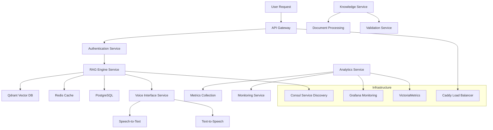

# Modular Architecture Documentation

## Overview

XNAi Foundation is built on a **modular microservices architecture** that provides flexibility, scalability, and maintainability while leveraging our sophisticated 24-service infrastructure.

## Architecture Principles

### 1. Service Independence
- Each service is independently deployable and scalable
- Services communicate via well-defined APIs
- Loose coupling through asynchronous messaging
- Clear separation of concerns

### 2. Event-Driven Design
- Redis Streams for asynchronous communication
- Event sourcing for audit trails and replayability
- Decoupled service interactions
- Fault tolerance through message persistence

### 3. Container Orchestration
- Docker Compose for local development
- Kubernetes support for production scaling
- Health checks and auto-recovery
- Resource isolation and security

### 4. Observability
- Structured logging across all services
- Metrics collection with Prometheus
- Distributed tracing for request flows
- Real-time monitoring with Grafana

## Service Categories

### Core Services (Essential)
- **RAG Engine**: Main retrieval and generation service
- **Voice Interface**: Speech-to-text and text-to-speech
- **Authentication**: User and agent authentication
- **Knowledge Management**: Document processing and storage

### Infrastructure Services (Support)
- **Consul**: Service discovery and configuration
- **Redis**: Caching and message queuing
- **PostgreSQL**: Primary data storage
- **Qdrant**: Vector database for embeddings

### Monitoring Services (Observability)
- **Prometheus**: Metrics collection
- **Grafana**: Visualization and dashboards
- **VictoriaMetrics**: Time-series storage
- **AlertManager**: Alert routing and management

### Development Services (Optional)
- **MkDocs**: Documentation serving
- **Caddy**: Reverse proxy and load balancing
- **Vikunja**: Project management and task tracking

## Service Communication Patterns

### Synchronous Communication
- RESTful APIs with JSON payloads
- gRPC for high-performance internal communication
- Health checks and readiness probes
- Circuit breaker patterns for resilience

### Asynchronous Communication
- Redis Streams for event-driven workflows
- Message persistence and replay capability
- Dead letter queues for failed messages
- Event sourcing for audit trails

### Service Discovery
- Consul for dynamic service registration
- Load balancing with health checks
- Configuration management
- Distributed locking for coordination

## Data Flow Architecture



## Configuration Management

### Environment-Based Configuration
```yaml
# Environment-specific configurations
environments:
  development:
    debug: true
    hot_reload: true
    resource_limits:
      memory: "2GB"
      cpu: "2"
  
  staging:
    debug: false
    resource_limits:
      memory: "4GB"
      cpu: "4"
  
  production:
    debug: false
    resource_limits:
      memory: "8GB"
      cpu: "8"
```

### Service-Specific Configuration
```yaml
# Service configuration template
services:
  rag_engine:
    replicas: 3
    health_check:
      path: /health
      interval: 30s
      timeout: 10s
    circuit_breaker:
      failure_threshold: 5
      recovery_timeout: 60s
  
  voice_interface:
    replicas: 2
    resource_limits:
      memory: "1GB"
      cpu: "1"
```

## Security Architecture

### Network Security
- Service mesh with mutual TLS
- Network policies for service isolation
- Firewall rules for external access
- VPN for remote access

### Authentication & Authorization
- JWT-based authentication
- Role-based access control (RBAC)
- Service-to-service authentication
- API key management

### Data Security
- Encryption at rest for sensitive data
- Encryption in transit for all communications
- Secure secret management
- Audit logging for compliance

## Deployment Strategies

### Blue-Green Deployment
- Zero-downtime deployments
- Traffic switching between environments
- Rollback capabilities
- Health validation before traffic switch

### Canary Releases
- Gradual rollout to percentage of users
- Metrics monitoring during rollout
- Automatic rollback on failure detection
- A/B testing capabilities

### Rolling Updates
- Sequential service updates
- Health check validation
- Resource-aware scheduling
- Minimal impact on performance

## Scaling Strategies

### Horizontal Scaling
- Auto-scaling based on metrics
- Load balancing across instances
- Service mesh for traffic distribution
- Database read replicas

### Vertical Scaling
- Resource allocation adjustments
- Memory and CPU optimization
- Storage scaling
- Network bandwidth optimization

### Database Scaling
- Read replicas for query distribution
- Sharding for large datasets
- Caching layers for performance
- Connection pooling optimization

## Monitoring and Observability

### Metrics Collection
- Application metrics (response times, throughput)
- System metrics (CPU, memory, disk, network)
- Business metrics (user engagement, feature usage)
- Custom metrics for specific use cases

### Logging Strategy
- Structured logging with JSON format
- Centralized log aggregation
- Log levels and filtering
- Log retention policies

### Distributed Tracing
- Request flow visualization
- Performance bottleneck identification
- Service dependency mapping
- Error propagation tracking

### Alerting Strategy
- Smart alerting with minimal noise
- Escalation policies for critical issues
- Alert fatigue prevention
- Integration with incident management

## Performance Optimization

### Caching Strategies
- Multi-level caching (L1, L2, L3)
- Cache invalidation strategies
- Cache warming for critical data
- CDN for static assets

### Database Optimization
- Query optimization and indexing
- Connection pooling
- Read/write splitting
- Data partitioning strategies

### Network Optimization
- Content delivery networks
- Compression for data transfer
- Connection reuse
- Protocol optimization

## Disaster Recovery

### Backup Strategies
- Automated backup schedules
- Multi-region backup storage
- Backup validation and testing
- Point-in-time recovery

### Failover Mechanisms
- Automatic failover for critical services
- Health check-based failover
- Manual failover procedures
- Cross-region replication

### Recovery Procedures
- Automated recovery scripts
- Manual recovery procedures
- Recovery time objectives (RTO)
- Recovery point objectives (RPO)

## Development Workflow

### Local Development
- Docker Compose for local environment
- Hot reloading for development
- Service isolation for testing
- Local debugging capabilities

### Testing Strategy
- Unit tests for individual services
- Integration tests for service interactions
- End-to-end tests for complete workflows
- Performance tests for scalability

### CI/CD Pipeline
- Automated testing and deployment
- Multi-environment deployment
- Security scanning and compliance
- Rollback capabilities

## Future Enhancements

### Service Mesh Integration
- Istio or Linkerd for advanced networking
- Advanced traffic management
- Security policies and mTLS
- Observability enhancements

### AI Model Management
- Model versioning and deployment
- A/B testing for models
- Model performance monitoring
- Automated model retraining

### Edge Computing
- Edge deployment capabilities
- Local processing for latency reduction
- Edge-to-cloud synchronization
- Bandwidth optimization

This modular architecture provides a solid foundation for building, deploying, and scaling the XNAi Foundation platform while maintaining flexibility for future enhancements and optimizations.