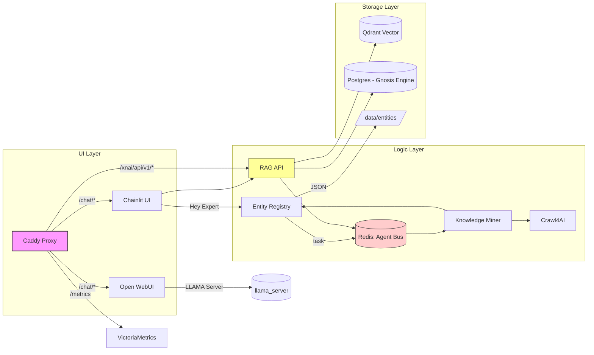

# Service Wiring & Build Guidelines

This document explains how the various containers in the Xoe‑NovAi stack are connected and provides guidance
for building and slimming images.

## 🧩 High‑Level Architecture



- **Caddy** is the entry point; routes are defined in `Caddyfile`.
- `open-webui` and `chainlit` provide user interfaces; both talk to the RAG API or other services.
- The **RAG API** (FastAPI) is the core LLM/RAG engine; it reads from Redis/Qdrant and (optionally) Postgres.
- **Workers** (`crawler`, `curation_worker`, `knowledge_miner`) perform background tasks via Redis streams.
- Persistence is in Redis streams, Qdrant vectors, filesystem JSON, and optional PostgreSQL.

## 🔧 Build & Image Guidelines

The base image (`xnai-base:latest`) now contains only *runtime* dependencies; build tools such as
`build-essential` and `cmake` have been removed to shrink the image (previously ~715 MB).  Any service
that needs to compile Python extensions must perform the compilation in its own *builder stage* or
use a separate build image.

### Recommended pattern (multi-stage)

```dockerfile
# Stage 1: builder (adds compilers temporarily)
FROM xnai-base:latest AS builder
RUN apt-get update && apt-get install -y --no-install-recommends \
        build-essential cmake git wget curl \
    && rm -rf /var/lib/apt/lists/*

WORKDIR /app
COPY requirements.txt ./
RUN uv pip install --system -r requirements.txt

# Stage 2: runtime
FROM xnai-base:latest
WORKDIR /app
# copy installed packages
COPY --from=builder /usr/local/lib/python3.12 /usr/local/lib/python3.12
COPY --from=builder /usr/local/bin/uv /usr/local/bin/uv
COPY . /app
```

- Only the **runtime** image is pushed to registries; the builder stage is discarded after build.
- This pattern is already applied in `Dockerfile`, `Dockerfile.chainlit`, `Dockerfile.crawl`, and 
  `Dockerfile.curation_worker`.

### Naming conventions

- `xnai-base:latest` – runtime base image with minimal libraries.
- `xnai-base-build:latest` *(optional)* – if an all‑in‑one build image is ever required, create this
  by copying the old `Dockerfile.base` contents; not currently used by service Dockerfiles.

### .dockerignore

The root of the repository contains a `.dockerignore` that excludes large folders such as
`data/`, `models/`, `logs/`, etc.  All service build contexts should reuse this file or add
context‑specific ignores where appropriate.


## 📚 Additional notes

- The **Postgres** service is used for the Gnosis/Hybrid GraphRAG engine; it is optional and not
  required for basic RAG functionality.  If it is absent, RAG falls back to Redis/Qdrant.
- The `open-webui` container is external (GHCR image). Its layers are large (≈4 GB); refer to the
  handoff note for strategy on building a trimmed fork.

---

This document should be updated whenever new services are added or the build strategy changes.