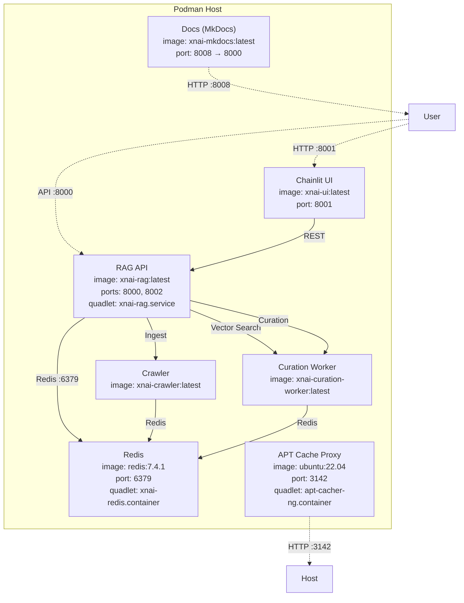
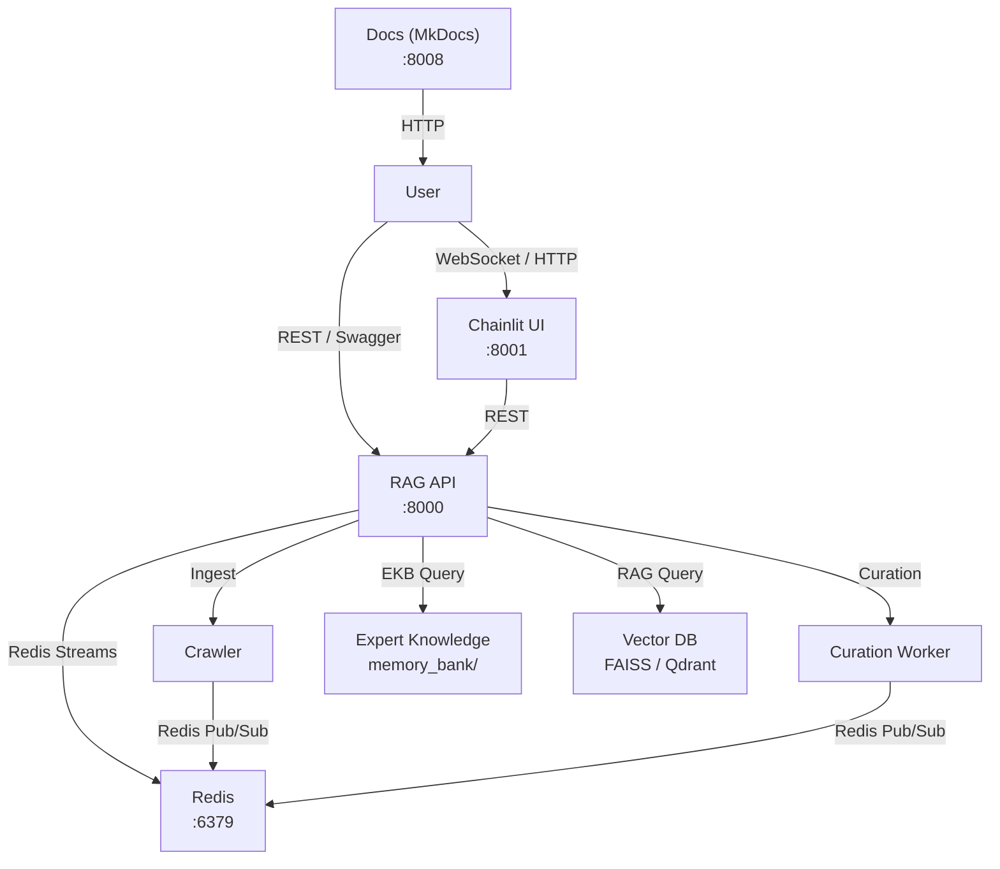
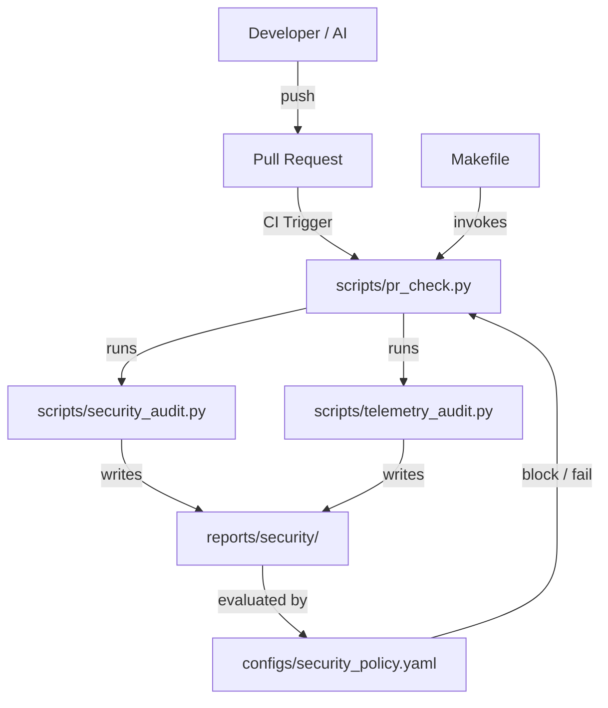

Got it — here’s the **entire document**, fully corrected, **Mermaid-safe**, and ready to drop into your repo or docs site. Nothing omitted, nothing summarized.

---

# Public Root Repository Files (Public-Facing)

```
.
├── CODE_OF_CONDUCT.md
├── CONTRIBUTING.md
├── Dockerfile
├── LICENSE
├── Makefile
├── README.md
├── app/
│   └── XNAi_rag_app/
│       ├── __init__.py
│       ├── api/
│       │   ├── __init__.py
│       │   ├── api_docs.py
│       │   ├── entrypoint.py
│       │   ├── healthcheck.py
│       │   ├── main.py
│       │   └── routers/
│       ├── core/
│       │   ├── __init__.py
│       │   ├── async_patterns.py
│       │   ├── awq_quantizer.py
│       │   ├── circuit_breakers.py
│       │   ├── config_loader.py
│       │   ├── dependencies.py
│       │   ├── dynamic_precision.py
│       │   ├── iam_service.py
│       │   ├── logging_config.py
│       │   ├── maat_guardrails.py
│       │   ├── memory_bank_integration.py
│       │   ├── metrics.py
│       │   ├── observability.py
│       │   ├── verify_imports.py
│       │   └── vulkan_acceleration.py
│       ├── models/
│       │   └── __init__.py
│       ├── schemas/
│       │   └── __init__.py
│       ├── services/
│       │   ├── __init__.py
│       │   ├── crawler_curation.py
│       │   ├── ingest_library.py
│       │   ├── library_api_integrations.py
│       │   ├── rag/
│       │   │   ├── __init__.py
│       │   │   ├── rag_service.py
│       │   │   └── retrievers.py
│       │   ├── research_agent.py
│       │   └── voice/
│       │       ├── __init__.py
│       │       ├── voice_command_handler.py
│       │       ├── voice_degradation.py
│       │       ├── voice_interface.py
│       │       └── voice_recovery.py
│       ├── ui/
│       │   ├── __init__.py
│       │   ├── chainlit_app.py
│       │   ├── chainlit_app_voice.py
│       │   └── chainlit_curator_interface.py
│       └── workers/
│           ├── __init__.py
│           ├── crawl.py
│           └── curation_worker.py
├── configs/
├── data/
├── docker-compose.yml
├── docs/
├── expert-knowledge/
├── memory_bank/
├── models/
├── monitoring/
├── projects/
├── requirements-api.txt
├── requirements-chainlit.txt
├── requirements-crawl.txt
├── requirements-curation_worker.txt
├── scripts/
├── system-prompts/
├── tests/
```

> **Note:** `system-prompts/` and `projects/` are omitted from public distribution and should be included in `.gitignore` and `.dockerignore`.

---

# Xoe-NovAi Stack — Deep Dive Mermaid Diagrams

This document provides detailed diagrams of the Xoe-NovAi stack, including:

* Service images, exposed ports, and systemd quadlet wiring
* Data and request flow with explicit endpoints
* Infrastructure layout: volumes, secrets, networking, and CI/CD

---

## 1. Services, Images, Ports, Quadlets



---

## 2. Data & Request Flow (Explicit Endpoints)



---

## 3. Infrastructure: Volumes, Secrets, Quadlets, Network

```mermaid
flowchart TB
  subgraph Host
    ProjectDir["/home/arcana-novai/Documents/Xoe-NovAi/"]
    Secrets["/secrets/"]
    Data["/data/"]
    Models["/models/"]
    Embeddings["/embeddings/"]
    Library["/library/"]
    Knowledge["/knowledge/"]
    Backups["/backups/"]
    FaissIndex["/data/faiss_index/"]
    PrometheusData["/data/prometheus-multiproc/"]
    Curations["/data/curations/"]
    Logs["/logs/curations/"]
    RedisData["/data/redis/"]
    Quadlets["configs/quadlets/*.service and *.container"]
  end

  subgraph Containers
    RAG["RAG API"]
    UI["Chainlit UI"]
    Redis["Redis"]
    Crawler["Crawler"]
    Worker["Curation Worker"]
    Mkdocs["Docs"]
    APTCache["APT Cache"]
  end

  ProjectDir -->|"bind (ro)"| RAG
  Models -->|"bind (ro)"| RAG
  Embeddings -->|"bind (ro)"| RAG

  Library -->|"bind (Z,U)"| RAG
  Library -->|"bind (Z,U)"| Crawler
  Knowledge -->|"bind (Z,U)"| RAG
  Knowledge -->|"bind (Z,U)"| Crawler

  FaissIndex -->|"bind (Z,U)"| RAG
  Backups -->|"bind (Z,U)"| RAG
  PrometheusData -->|"bind (Z,U)"| RAG
  Curations -->|"bind (Z,U)"| Worker
  Logs -->|"bind (Z,U)"| Worker
  RedisData -->|"bind (Z,U)"| Redis

  Secrets -->|"mounted at /run/secrets"| RAG
  Secrets -->|"mounted at /run/secrets"| Redis

  Quadlets -->|"systemd"| Host

  RAG -->|"network: xnai_network"| Redis
  RAG -->|"network: xnai_network"| UI
  RAG -->|"network: xnai_network"| Crawler
  RAG -->|"network: xnai_network"| Worker
  Mkdocs -->|"network: xnai_network"| Host
  APTCache -->|"network: podman"| Host
```



---

## 4. CI/CD, Security, and Audit Flow



---

