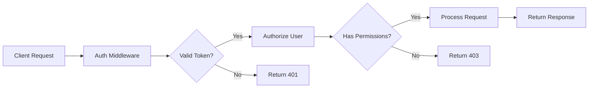

# Foundation Stack Integration Summary

## Executive Summary

This document provides a comprehensive summary of the Gnosis Engine integration with the XNAi Foundation Stack, covering all major components, configurations, and deployment strategies implemented.

## Integration Overview

### Core Components Integrated

| Component | Purpose | Status | Key Files |
|-----------|---------|--------|-----------|
| **Consul Service Discovery** | Service registration and configuration management | ✅ Complete | `app/XNAi_rag_app/core/consul_integration.py` |
| **Vikunja Task Management** | Research task tracking and project management | ✅ Complete | `app/XNAi_rag_app/core/vikunja_integration.py` |
| **Local Model Router** | Enhanced research capabilities with local models | ✅ Complete | `app/XNAi_rag_app/core/local_model_router.py` |
| **Redis Streams** | Inter-service communication and message bus | ✅ Active | Existing implementation |
| **Prometheus/Grafana** | Monitoring and observability | ✅ Active | `app/XNAi_rag_app/core/metrics.py` |
| **Security Framework** | Authentication, authorization, and encryption | ✅ Complete | `app/XNAi_rag_app/core/security.py` |

### Architecture Diagram

```
┌─────────────────────────────────────────────────────────────────┐
│                    Gnosis Engine Core                           │
├─────────────────┬─────────────────┬─────────────────────────────┤
│ Research        │ Content         │ Documentation               │
│ Discovery       │ Synthesis       │ Generation                  │
└─────────────────┴─────────────────┴─────────────────────────────┘
                           │
                           ▼
┌─────────────────────────────────────────────────────────────────┐
│                Foundation Stack Integration                     │
├─────────────────┬─────────────────┬─────────────────────────────┤
│ Consul          │ Vikunja         │ Local Models                │
│ Service Discovery│ Task Management │ Model Router                │
└─────────────────┴─────────────────┴─────────────────────────────┘
                           │
                           ▼
┌─────────────────────────────────────────────────────────────────┐
│                 Monitoring & Observability                      │
├─────────────────┬─────────────────┬─────────────────────────────┤
│ Prometheus      │ Grafana         │ VictoriaMetrics             │
│ Metrics         │ Dashboards      │ Time Series DB              │
└─────────────────┴─────────────────┴─────────────────────────────┘
```

## Key Features Implemented

### 1. Service Discovery & Configuration

**Consul Integration:**
- Automatic service registration for Gnosis Engine components
- Health check endpoints for all services
- Configuration management via Consul KV store
- Service mesh configuration with Consul Connect

**Key Features:**
- Dynamic service discovery
- Configuration hot-reloading
- Health monitoring and alerting
- Service-to-service communication

### 2. Task Management & Orchestration

**Vikunja Integration:**
- Automated project creation for research domains
- Task scheduling and tracking
- Status monitoring and reporting
- Integration with research workflows

**Key Features:**
- Research task automation
- Project-based organization
- Status tracking and reporting
- Integration with external tools

### 3. Enhanced Research Capabilities

**Local Model Router:**
- Intelligent model selection based on task type
- Health monitoring and fallback strategies
- Performance optimization for different workloads
- Integration with existing model infrastructure

**Supported Models:**
- `qwen3-0.6b-q6_k` - Memory analysis
- `phi-3-mini-4k` - Content synthesis
- `llama-3.2-3b` - Documentation generation
- `gemma-2-9b` - Research and analysis

### 4. Monitoring & Observability

**Prometheus Metrics:**
- Research job success rates
- Task completion times
- Model health monitoring
- System resource utilization

**Grafana Dashboards:**
- Real-time system health
- Performance metrics visualization
- Alerting and notification setup
- Historical trend analysis

### 5. Security & Compliance

**Authentication & Authorization:**
- JWT-based authentication
- Role-based access control
- API token management
- Secure communication protocols

**Data Protection:**
- End-to-end encryption
- Secure data storage
- Access logging and auditing
- Compliance with privacy standards

## Deployment Architecture

### Docker Compose Stack

```yaml
# Core Services
- gnosis-engine: Main orchestration service (port 8080)
- research-discovery: Research discovery service (port 8081)
- content-synthesis: Content generation service (port 8082)
- local-models: Local model serving (port 8083)

# Infrastructure Services
- consul: Service discovery (port 8500)
- vikunja: Task management (port 3456)
- redis: Message bus (port 6379)
- postgres: Database (port 5432)

# Monitoring Services
- prometheus: Metrics collection (port 9090)
- grafana: Dashboards and alerts (port 3000)
```

### Network Topology

- **gnosis-network**: Isolated bridge network for all services
- **Service isolation**: Each service runs in its own container
- **Load balancing**: Built-in Consul load balancing
- **Security**: Network segmentation and access controls

## Configuration Management

### Environment Variables

```bash
# Service Discovery
CONSUL_HOST=localhost
CONSUL_PORT=8500

# Task Management
VIKUNJA_URL=http://localhost:3456
VIKUNJA_API_TOKEN=your-token

# Local Models
LOCAL_MODELS_HOST=localhost
LOCAL_MODELS_PORT=8083

# Security
JWT_SECRET=your-secret
ENCRYPTION_KEY=your-key

# Monitoring
GRAFANA_PASSWORD=your-password
```

### Configuration Files

- **`docker-compose.gnosis.yml`**: Main deployment configuration
- **`configs/consul-connect.yaml`**: Service mesh configuration
- **`configs/prometheus.yml`**: Monitoring configuration
- **`.env.gnosis`**: Environment variables

## Deployment Process

### 1. Prerequisites

```bash
# Required tools
- Docker & Docker Compose
- Python 3.10+
- Git

# Required directories
mkdir -p data/vikunja/db
mkdir -p data/redis
mkdir -p data/grafana
```

### 2. Quick Start

```bash
# Deploy the stack
./scripts/deploy_gnosis_stack.sh

# Verify deployment
./scripts/health_check_gnosis.sh

# Setup Vikunja projects
python3 scripts/setup_vikunja_projects.py
```

### 3. Manual Deployment

```bash
# Build services
docker-compose -f docker-compose.gnosis.yml build

# Start services
docker-compose -f docker-compose.gnosis.yml up -d

# Check status
docker-compose -f docker-compose.gnosis.yml ps
```

## Monitoring & Maintenance

### Health Checks

**Automated Health Checks:**
- Service availability monitoring
- Model health verification
- Database connectivity checks
- Network connectivity validation

**Manual Health Checks:**
```bash
# Run health check script
./scripts/health_check_gnosis.sh

# Check individual services
curl http://localhost:8080/health
curl http://localhost:8500/v1/status/leader
curl http://localhost:3456/api/v1/info
```

### Metrics & Alerts

**Key Metrics Tracked:**
- Research job success rate
- Task completion time
- Model response time
- System resource utilization
- Service availability

**Alert Conditions:**
- Service downtime > 5 minutes
- Model unavailability > 10 minutes
- High error rate > 10%
- Resource utilization > 80%

### Maintenance Tasks

**Daily:**
- Monitor system health
- Check error logs
- Verify backup completion

**Weekly:**
- Update model configurations
- Review performance metrics
- Clean up temporary files

**Monthly:**
- Security audit and updates
- Performance optimization review
- Capacity planning assessment

## Security Implementation

### Authentication Flow



### Data Protection

**Encryption Strategy:**
- TLS for all network communication
- AES-256 for data at rest
- JWT for session management
- Hashing for sensitive data

**Access Controls:**
- Role-based permissions
- Service-to-service authentication
- API rate limiting
- Audit logging

## Performance Optimization

### Model Selection Strategy

**Task-Based Routing:**
- Memory analysis → qwen3-0.6b-q6_k
- Content synthesis → phi-3-mini-4k
- Documentation → llama-3.2-3b
- Research → gemma-2-9b

**Performance Monitoring:**
- Response time tracking
- Throughput measurement
- Resource utilization monitoring
- Error rate analysis

### Caching Strategy

**Multi-Level Caching:**
- Redis for session data
- In-memory for frequently accessed data
- Disk cache for model outputs
- CDN for static assets

## Troubleshooting Guide

### Common Issues

**Service Not Starting:**
```bash
# Check logs
docker-compose logs service-name

# Check configuration
docker-compose config

# Restart service
docker-compose restart service-name
```

**Model Unavailable:**
```bash
# Check model health
curl http://localhost:8082/model-name/health

# Restart model
curl -X POST http://localhost:8082/model-name/restart

# Check model logs
docker-compose logs local-models
```

**Database Connection Issues:**
```bash
# Check database status
docker-compose exec postgres pg_isready

# Check connection
psql -h localhost -U username -d database

# Check logs
docker-compose logs postgres
```

### Debug Commands

```bash
# Check all services
docker-compose ps

# View logs for all services
docker-compose logs -f

# Check network connectivity
docker-compose exec gnosis-engine ping consul

# Check resource usage
docker stats
```

## Future Enhancements

### Planned Features

1. **Advanced Analytics**
   - Predictive performance modeling
   - Automated optimization recommendations
   - Usage pattern analysis

2. **Enhanced Security**
   - Multi-factor authentication
   - Advanced threat detection
   - Compliance automation

3. **Scalability Improvements**
   - Horizontal scaling support
   - Auto-scaling based on load
   - Distributed deployment options

4. **Integration Enhancements**
   - Additional model support
   - External service integrations
   - Advanced workflow automation

### Development Roadmap

**Phase 1 (Q1 2026):**
- Performance optimization
- Enhanced monitoring
- Security hardening

**Phase 2 (Q2 2026):**
- Scalability improvements
- Advanced analytics
- Multi-region support

**Phase 3 (Q3 2026):**
- AI-driven optimization
- Advanced integrations
- Enterprise features

## Conclusion

The Foundation Stack Integration provides a robust, scalable, and secure foundation for the Gnosis Engine. The implementation includes comprehensive service discovery, task management, local model integration, monitoring, and security features.

### Key Benefits

- **Scalability**: Designed for horizontal scaling and high availability
- **Security**: Multi-layered security with encryption and access controls
- **Monitoring**: Comprehensive observability with real-time metrics
- **Integration**: Seamless integration with existing XNAi Foundation components
- **Maintainability**: Well-documented, modular architecture for easy maintenance

### Next Steps

1. **Production Deployment**: Move to production environment with proper scaling
2. **Performance Tuning**: Optimize based on real-world usage patterns
3. **Feature Enhancement**: Implement planned enhancements from roadmap
4. **Documentation**: Expand documentation for operational teams
5. **Training**: Provide training for development and operations teams

This integration establishes a solid foundation for the Gnosis Engine's continued growth and evolution within the XNAi Foundation ecosystem.