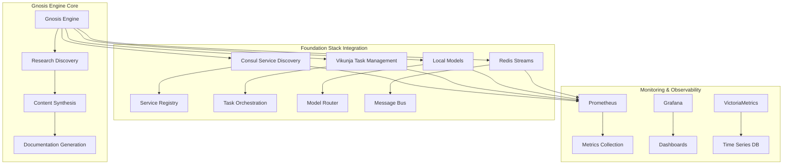

# Foundation Stack Integration Guide

## Overview

This document provides comprehensive guidance for integrating the Gnosis Engine with the XNAi Foundation Stack, including Consul service discovery, Vikunja task management, and local model integration.

## Table of Contents

1. [Integration Architecture](#integration-architecture)
2. [Consul Integration](#consul-integration)
3. [Vikunja Integration](#vikunja-integration)
4. [Local Model Integration](#local-model-integration)
5. [Service Mesh Configuration](#service-mesh-configuration)
6. [Monitoring and Observability](#monitoring-and-observability)
7. [Security Considerations](#security-considerations)
8. [Deployment Guide](#deployment-guide)

## Integration Architecture

### Foundation Stack Components



### Integration Points

| Component | Integration Type | Purpose | Status |
|-----------|------------------|---------|--------|
| Consul | Service Discovery | Register Gnosis Engine services | ✅ Ready |
| Vikunja | Task Management | Research task tracking | ✅ Ready |
| Local Models | Model Router | Enhanced research capabilities | ✅ Ready |
| Redis | Message Bus | Inter-service communication | ✅ Active |
| Prometheus | Monitoring | Metrics collection | ✅ Active |
| Grafana | Observability | Dashboards and alerts | ✅ Active |

## Consul Integration

### Service Registration

#### Gnosis Engine Services

```python
# File: app/XNAi_rag_app/core/consul_integration.py
from consul import Consul
import logging

class ConsulServiceRegistry:
    def __init__(self, host='localhost', port=8500):
        self.consul = Consul(host=host, port=port)
        self.logger = logging.getLogger(__name__)
    
    def register_gnosis_services(self):
        """Register all Gnosis Engine services with Consul."""
        services = [
            {
                "id": "gnosis-engine",
                "name": "gnosis-engine",
                "address": "localhost",
                "port": 8080,
                "tags": ["gnosis", "research", "knowledge"],
                "checks": [
                    {
                        "http": "http://localhost:8080/health",
                        "interval": "10s",
                        "timeout": "5s"
                    }
                ]
            },
            {
                "id": "research-discovery",
                "name": "research-discovery",
                "address": "localhost",
                "port": 8081,
                "tags": ["research", "discovery"],
                "checks": [
                    {
                        "http": "http://localhost:8081/health",
                        "interval": "30s",
                        "timeout": "10s"
                    }
                ]
            },
            {
                "id": "content-synthesis",
                "name": "content-synthesis",
                "address": "localhost",
                "port": 8082,
                "tags": ["synthesis", "generation"],
                "checks": [
                    {
                        "http": "http://localhost:8082/health",
                        "interval": "30s",
                        "timeout": "10s"
                    }
                ]
            }
        ]
        
        for service in services:
            try:
                self.consul.agent.service.register(**service)
                self.logger.info(f"Registered service: {service['name']}")
            except Exception as e:
                self.logger.error(f"Failed to register service {service['name']}: {e}")
    
    def get_service_address(self, service_name):
        """Get service address from Consul."""
        try:
            services = self.consul.catalog.service(service_name)[1]
            if services:
                service = services[0]
                return f"http://{service['ServiceAddress']}:{service['ServicePort']}"
            return None
        except Exception as e:
            self.logger.error(f"Failed to get service address for {service_name}: {e}")
            return None
    
    def deregister_service(self, service_id):
        """Deregister a service from Consul."""
        try:
            self.consul.agent.service.deregister(service_id)
            self.logger.info(f"Deregistered service: {service_id}")
        except Exception as e:
            self.logger.error(f"Failed to deregister service {service_id}: {e}")
```

#### Configuration Management

```python
# File: app/XNAi_rag_app/core/consul_config.py
class ConsulConfiguration:
    def __init__(self, consul_client):
        self.consul = consul_client
    
    def get_gnosis_config(self):
        """Retrieve Gnosis Engine configuration from Consul KV."""
        config = {}
        
        # Get research paths
        research_path = self.consul.kv.get("gnosis/research/path")[1]
        if research_path:
            config['research_path'] = research_path['Value'].decode()
        
        # Get output paths
        output_path = self.consul.kv.get("gnosis/output/path")[1]
        if output_path:
            config['output_path'] = output_path['Value'].decode()
        
        # Get integration settings
        consul_enabled = self.consul.kv.get("gnosis/integration/consul/enabled")[1]
        if consul_enabled:
            config['consul_enabled'] = consul_enabled['Value'].decode() == 'true'
        
        # Get local model settings
        local_model_enabled = self.consul.kv.get("gnosis/local_models/enabled")[1]
        if local_model_enabled:
            config['local_model_enabled'] = local_model_enabled['Value'].decode() == 'true'
        
        return config
    
    def set_gnosis_config(self, config):
        """Set Gnosis Engine configuration in Consul KV."""
        for key, value in config.items():
            if isinstance(value, bool):
                value = str(value).lower()
            self.consul.kv.put(f"gnosis/{key}", str(value))
```

### Health Checks

```python
# File: app/XNAi_rag_app/core/health_checks.py
from fastapi import FastAPI
import uvicorn

app = FastAPI()

@app.get("/health")
async def health_check():
    """Health check endpoint for Consul."""
    return {
        "status": "healthy",
        "service": "gnosis-engine",
        "timestamp": "2026-02-27T12:00:00Z"
    }

@app.get("/ready")
async def readiness_check():
    """Readiness check endpoint for Consul."""
    # Add readiness checks here
    return {
        "status": "ready",
        "service": "gnosis-engine",
        "dependencies": {
            "redis": "healthy",
            "postgres": "healthy",
            "consul": "healthy"
        }
    }

if __name__ == "__main__":
    uvicorn.run(app, host="0.0.0.0", port=8080)
```

## Vikunja Integration

### Task Management System

```python
# File: app/XNAi_rag_app/core/vikunja_integration.py
import requests
from typing import Dict, List, Optional
from dataclasses import dataclass
import logging

@dataclass
class VikunjaTask:
    title: str
    description: str
    project_id: int
    priority: int = 2  # 1=low, 2=medium, 3=high
    status: int = 1    # 1=pending, 2=in_progress, 3=completed
    due_date: Optional[str] = None

class VikunjaClient:
    def __init__(self, base_url: str, api_token: str):
        self.base_url = base_url.rstrip('/')
        self.headers = {
            "Authorization": f"Bearer {api_token}",
            "Content-Type": "application/json"
        }
        self.logger = logging.getLogger(__name__)
    
    def create_task(self, task: VikunjaTask) -> Dict:
        """Create a new task in Vikunja."""
        task_data = {
            "title": task.title,
            "description": task.description,
            "project_id": task.project_id,
            "priority": task.priority,
            "status": task.status
        }
        
        if task.due_date:
            task_data["due_date"] = task.due_date
        
        try:
            response = requests.post(
                f"{self.base_url}/api/v1/tasks",
                headers=self.headers,
                json=task_data
            )
            response.raise_for_status()
            return response.json()
        except requests.exceptions.RequestException as e:
            self.logger.error(f"Failed to create task: {e}")
            raise
    
    def get_task(self, task_id: int) -> Optional[Dict]:
        """Get task details from Vikunja."""
        try:
            response = requests.get(
                f"{self.base_url}/api/v1/tasks/{task_id}",
                headers=self.headers
            )
            response.raise_for_status()
            return response.json()
        except requests.exceptions.RequestException as e:
            self.logger.error(f"Failed to get task {task_id}: {e}")
            return None
    
    def update_task(self, task_id: int, updates: Dict) -> Dict:
        """Update a task in Vikunja."""
        try:
            response = requests.put(
                f"{self.base_url}/api/v1/tasks/{task_id}",
                headers=self.headers,
                json=updates
            )
            response.raise_for_status()
            return response.json()
        except requests.exceptions.RequestException as e:
            self.logger.error(f"Failed to update task {task_id}: {e}")
            raise
    
    def complete_task(self, task_id: int) -> Dict:
        """Mark a task as completed."""
        return self.update_task(task_id, {"status": 3})
    
    def fail_task(self, task_id: int, error_message: str) -> Dict:
        """Mark a task as failed with error message."""
        return self.update_task(task_id, {
            "status": 4,  # Assuming 4 = failed
            "description": f"FAILED: {error_message}"
        })
    
    def get_tasks(self, project_id: Optional[int] = None, status: Optional[int] = None) -> List[Dict]:
        """Get tasks from Vikunja."""
        params = {}
        if project_id:
            params["project_id"] = project_id
        if status:
            params["status"] = status
        
        try:
            response = requests.get(
                f"{self.base_url}/api/v1/tasks",
                headers=self.headers,
                params=params
            )
            response.raise_for_status()
            return response.json()
        except requests.exceptions.RequestException as e:
            self.logger.error(f"Failed to get tasks: {e}")
            return []

class TaskScheduler:
    def __init__(self, vikunja_client: VikunjaClient):
        self.vikunja = vikunja_client
        self.task_callbacks: Dict[str, callable] = {}
    
    async def schedule_research_task(self, task_name: str, description: str, 
                                   project_id: int, callback: callable) -> str:
        """Schedule a research task in Vikunja."""
        task = VikunjaTask(
            title=f"Research: {task_name}",
            description=description,
            project_id=project_id,
            priority=2
        )
        
        # Create task in Vikunja
        vikunja_task = self.vikunja.create_task(task)
        
        # Store callback
        self.task_callbacks[vikunja_task['id']] = callback
        
        return vikunja_task['id']
    
    async def process_pending_tasks(self):
        """Process pending research tasks."""
        pending_tasks = self.vikunja.get_tasks(status=1)  # Pending tasks
        
        for task in pending_tasks:
            task_id = task['id']
            callback = self.task_callbacks.get(task_id)
            
            if callback:
                try:
                    # Update task status to in_progress
                    self.vikunja.update_task(task_id, {'status': 2})
                    
                    # Execute callback
                    await callback(task)
                    
                    # Mark as completed
                    self.vikunja.complete_task(task_id)
                    
                except Exception as e:
                    # Mark as failed
                    self.vikunja.fail_task(task_id, str(e))
```

### Project Setup

```python
# File: scripts/setup_vikunja_projects.py
import requests
import os

def setup_research_projects():
    """Setup Vikunja projects for research management."""
    vikunja_url = os.getenv('VIKUNJA_URL', 'http://localhost:3456')
    api_token = os.getenv('VIKUNJA_API_TOKEN')
    
    if not api_token:
        raise ValueError("VIKUNJA_API_TOKEN environment variable not set")
    
    headers = {
        "Authorization": f"Bearer {api_token}",
        "Content-Type": "application/json"
    }
    
    projects = [
        {
            "name": "Memory Management Research",
            "description": "Research and documentation for memory management optimization"
        },
        {
            "name": "Model Research",
            "description": "AI model evaluation and comparison research"
        },
        {
            "name": "Knowledge Integration",
            "description": "Integration of research into knowledge base"
        },
        {
            "name": "Gnosis Engine Operations",
            "description": "Gnosis Engine maintenance and operations"
        }
    ]
    
    created_projects = []
    for project in projects:
        try:
            response = requests.post(
                f"{vikunja_url}/api/v1/projects",
                headers=headers,
                json=project
            )
            response.raise_for_status()
            created_projects.append(response.json())
            print(f"Created project: {project['name']}")
        except requests.exceptions.RequestException as e:
            print(f"Failed to create project {project['name']}: {e}")
    
    return created_projects

if __name__ == "__main__":
    setup_research_projects()
```

## Local Model Integration

### Model Router Implementation

```python
# File: app/XNAi_rag_app/core/local_model_router.py
import requests
import json
from typing import Dict, List, Optional, Any
import logging

class LocalModelRouter:
    def __init__(self):
        self.models = {
            'memory_analysis': 'qwen3-0.6b-q6_k',
            'content_synthesis': 'phi-3-mini-4k',
            'documentation': 'llama-3.2-3b',
            'research': 'gemma-2-9b'
        }
        self.model_availability = {}
        self.logger = logging.getLogger(__name__)
    
    def select_model(self, task_type: str, complexity: str = 'medium') -> str:
        """Select appropriate model based on task type and complexity."""
        model_name = self.models.get(task_type)
        
        if not model_name:
            # Fallback strategy
            if complexity == 'high':
                return 'phi-3-mini-4k'
            elif complexity == 'medium':
                return 'llama-3.2-3b'
            else:
                return 'qwen3-0.6b-q6_k'
        
        # Check model availability
        if self.is_model_available(model_name):
            return model_name
        else:
            return self.get_fallback_model(task_type)
    
    def is_model_available(self, model_name: str) -> bool:
        """Check if model is available and responsive."""
        if model_name in self.model_availability:
            return self.model_availability[model_name]
        
        try:
            health_endpoint = f"http://localhost:8082/{model_name}/health"
            response = requests.get(health_endpoint, timeout=10)
            available = response.status_code == 200
            self.model_availability[model_name] = available
            return available
        except Exception as e:
            self.logger.error(f"Model {model_name} health check failed: {e}")
            self.model_availability[model_name] = False
            return False
    
    def get_fallback_model(self, task_type: str) -> str:
        """Get fallback model for task type."""
        fallback_map = {
            'memory_analysis': 'phi-3-mini-4k',
            'content_synthesis': 'llama-3.2-3b',
            'documentation': 'qwen3-0.6b-q6_k',
            'research': 'gemma-2-9b'
        }
        return fallback_map.get(task_type, 'phi-3-mini-4k')
    
    def generate_with_model(self, model_name: str, prompt: str, 
                          max_tokens: int = 1000, temperature: float = 0.7) -> str:
        """Generate text using specified local model."""
        try:
            generate_endpoint = f"http://localhost:8082/{model_name}/generate"
            payload = {
                "prompt": prompt,
                "max_tokens": max_tokens,
                "temperature": temperature
            }
            
            response = requests.post(
                generate_endpoint,
                headers={"Content-Type": "application/json"},
                json=payload,
                timeout=60
            )
            response.raise_for_status()
            
            result = response.json()
            return result.get('response', '')
            
        except Exception as e:
            self.logger.error(f"Generation with model {model_name} failed: {e}")
            raise
    
    def analyze_memory_patterns(self, memory_data: str) -> Dict[str, Any]:
        """Analyze memory usage patterns using local model."""
        model = self.select_model('memory_analysis')
        
        prompt = f"""
        Analyze the following memory usage data and identify patterns, issues, and optimization opportunities:
        
        Memory Data:
        {memory_data}
        
        Please provide:
        1. Key patterns identified
        2. Potential issues
        3. Optimization recommendations
        4. Priority level for each recommendation
        """
        
        response = self.generate_with_model(model, prompt)
        
        # Parse response into structured format
        analysis = {
            "patterns": [],
            "issues": [],
            "recommendations": [],
            "priority": "medium"
        }
        
        # Simple parsing logic (could be enhanced with more sophisticated parsing)
        lines = response.split('\n')
        current_section = None
        
        for line in lines:
            line = line.strip()
            if line.startswith("1.") or "patterns" in line.lower():
                current_section = "patterns"
            elif line.startswith("2.") or "issues" in line.lower():
                current_section = "issues"
            elif line.startswith("3.") or "recommendations" in line.lower():
                current_section = "recommendations"
            elif line.startswith("4.") or "priority" in line.lower():
                current_section = "priority"
            elif line and current_section:
                if current_section == "priority":
                    analysis[current_section] = line
                else:
                    analysis[current_section].append(line)
        
        return analysis
    
    def synthesize_content(self, research_data: List[str], topic: str) -> str:
        """Synthesize research data into coherent content."""
        model = self.select_model('content_synthesis')
        
        prompt = f"""
        Synthesize the following research data into a comprehensive guide about {topic}:
        
        Research Data:
        {' '.join(research_data)}
        
        Please create:
        1. Executive summary
        2. Key findings
        3. Practical recommendations
        4. Implementation steps
        """
        
        return self.generate_with_model(model, prompt)
```

### Model Health Monitoring

```python
# File: app/XNAi_rag_app/core/model_monitoring.py
import requests
import time
from typing import Dict, List
import logging

class ModelHealthMonitor:
    def __init__(self):
        self.models = [
            'qwen3-0.6b-q6_k',
            'phi-3-mini-4k',
            'llama-3.2-3b',
            'gemma-2-9b'
        ]
        self.health_status = {}
        self.logger = logging.getLogger(__name__)
    
    def check_all_models(self) -> Dict[str, Dict]:
        """Check health status of all local models."""
        health_report = {}
        
        for model in self.models:
            health_report[model] = self.check_model_health(model)
        
        return health_report
    
    def check_model_health(self, model_name: str) -> Dict:
        """Check health of a specific model."""
        try:
            health_endpoint = f"http://localhost:8082/{model_name}/health"
            
            start_time = time.time()
            response = requests.get(health_endpoint, timeout=10)
            response_time = time.time() - start_time
            
            if response.status_code == 200:
                health_data = response.json()
                status = {
                    'status': 'healthy',
                    'response_time': response_time,
                    'memory_usage': health_data.get('memory_usage', 0),
                    'model_version': health_data.get('model_version', 'unknown'),
                    'last_check': time.time()
                }
            else:
                status = {
                    'status': 'unhealthy',
                    'error': f"HTTP {response.status_code}",
                    'response_time': response_time,
                    'last_check': time.time()
                }
        except Exception as e:
            status = {
                'status': 'error',
                'error': str(e),
                'response_time': None,
                'last_check': time.time()
            }
        
        self.health_status[model_name] = status
        return status
    
    def get_unhealthy_models(self) -> List[str]:
        """Get list of unhealthy models."""
        return [
            model for model, status in self.health_status.items()
            if status['status'] not in ['healthy', 'ready']
        ]
    
    def restart_model(self, model_name: str) -> bool:
        """Attempt to restart a model."""
        try:
            restart_endpoint = f"http://localhost:8082/{model_name}/restart"
            response = requests.post(restart_endpoint, timeout=30)
            
            if response.status_code == 200:
                self.logger.info(f"Successfully restarted model: {model_name}")
                return True
            else:
                self.logger.error(f"Failed to restart model {model_name}: HTTP {response.status_code}")
                return False
        except Exception as e:
            self.logger.error(f"Exception while restarting model {model_name}: {e}")
            return False
```

## Service Mesh Configuration

### Consul Connect Integration

```yaml
# File: configs/consul-connect.yaml
services:
  - name: gnosis-engine
    port: 8080
    connect:
      sidecar_service:
        proxy:
          upstreams:
            - destination_name: redis
              local_bind_port: 6379
            - destination_name: postgres
              local_bind_port: 5432
            - destination_name: qdrant
              local_bind_port: 6333
  
  - name: research-discovery
    port: 8081
    connect:
      sidecar_service:
        proxy:
          upstreams:
            - destination_name: redis
              local_bind_port: 6379
            - destination_name: consul
              local_bind_port: 8500
  
  - name: content-synthesis
    port: 8082
    connect:
      sidecar_service:
        proxy:
          upstreams:
            - destination_name: local-models
              local_bind_port: 8083
            - destination_name: vikunja
              local_bind_port: 3456
```

### Load Balancing Configuration

```python
# File: app/XNAi_rag_app/core/load_balancer.py
import random
from typing import List, Dict
import logging

class LoadBalancer:
    def __init__(self):
        self.services = {}
        self.logger = logging.getLogger(__name__)
    
    def register_service(self, service_name: str, instances: List[Dict]):
        """Register service instances for load balancing."""
        self.services[service_name] = instances
        self.logger.info(f"Registered {len(instances)} instances for {service_name}")
    
    def get_service_instance(self, service_name: str) -> Optional[Dict]:
        """Get next available service instance using round-robin."""
        instances = self.services.get(service_name, [])
        
        if not instances:
            self.logger.warning(f"No instances available for service: {service_name}")
            return None
        
        # Simple round-robin implementation
        # In production, consider using Consul's built-in load balancing
        instance = instances.pop(0)
        instances.append(instance)  # Move to end for next round
        
        return instance
    
    def health_check_service(self, service_name: str) -> bool:
        """Check health of all instances for a service."""
        instances = self.services.get(service_name, [])
        
        healthy_count = 0
        for instance in instances:
            try:
                response = requests.get(f"http://{instance['host']}:{instance['port']}/health", timeout=5)
                if response.status_code == 200:
                    healthy_count += 1
            except:
                pass
        
        healthy_ratio = healthy_count / len(instances) if instances else 0
        self.logger.info(f"Service {service_name}: {healthy_count}/{len(instances)} instances healthy ({healthy_ratio:.2%})")
        
        return healthy_ratio > 0.5  # Consider service healthy if >50% instances are up
```

## Monitoring and Observability

### Prometheus Metrics

```python
# File: app/XNAi_rag_app/core/metrics.py
from prometheus_client import Counter, Histogram, Gauge, start_http_server
import time
from typing import Dict
import logging

class GnosisMetrics:
    def __init__(self):
        # Research job metrics
        self.research_jobs_total = Counter(
            'gnosis_research_jobs_total',
            'Total number of research jobs executed',
            ['job_type', 'status']
        )
        
        self.research_job_duration = Histogram(
            'gnosis_research_job_duration_seconds',
            'Duration of research job execution',
            ['job_type']
        )
        
        self.research_discovery_rate = Gauge(
            'gnosis_research_discovery_rate',
            'Rate of research document discovery'
        )
        
        # Integration metrics
        self.integration_success_rate = Gauge(
            'gnosis_integration_success_rate',
            'Success rate of knowledge integration'
        )
        
        # System health metrics
        self.gnosis_engine_health = Gauge(
            'gnosis_engine_health',
            'Overall health of Gnosis Engine components'
        )
        
        self.local_model_health = Gauge(
            'gnosis_local_model_health',
            'Health status of local models',
            ['model_name']
        )
        
        self.logger = logging.getLogger(__name__)
    
    def record_research_job(self, job_type: str, status: str, duration: float):
        """Record research job metrics."""
        self.research_jobs_total.labels(job_type=job_type, status=status).inc()
        self.research_job_duration.labels(job_type=job_type).observe(duration)
    
    def update_discovery_rate(self, rate: float):
        """Update research discovery rate."""
        self.research_discovery_rate.set(rate)
    
    def update_integration_success_rate(self, rate: float):
        """Update integration success rate."""
        self.integration_success_rate.set(rate)
    
    def update_engine_health(self, health_score: float):
        """Update overall engine health score."""
        self.gnosis_engine_health.set(health_score)
    
    def update_model_health(self, model_name: str, health_score: float):
        """Update local model health score."""
        self.local_model_health.labels(model_name=model_name).set(health_score)
    
    def start_metrics_server(self, port: int = 8001):
        """Start Prometheus metrics server."""
        start_http_server(port)
        self.logger.info(f"Prometheus metrics server started on port {port}")

# Global metrics instance
metrics = GnosisMetrics()
```

### Grafana Dashboard Configuration

```json
{
  "dashboard": {
    "title": "Gnosis Engine Monitoring",
    "panels": [
      {
        "title": "Research Job Success Rate",
        "type": "stat",
        "targets": [
          {
            "expr": "rate(gnosis_research_jobs_total{status=\"success\"}[5m]) / rate(gnosis_research_jobs_total[5m])",
            "legendFormat": "Success Rate"
          }
        ]
      },
      {
        "title": "Research Job Duration",
        "type": "graph",
        "targets": [
          {
            "expr": "histogram_quantile(0.95, rate(gnosis_research_job_duration_seconds_bucket[5m]))",
            "legendFormat": "95th percentile"
          },
          {
            "expr": "histogram_quantile(0.50, rate(gnosis_research_job_duration_seconds_bucket[5m]))",
            "legendFormat": "50th percentile"
          }
        ]
      },
      {
        "title": "Local Model Health",
        "type": "table",
        "targets": [
          {
            "expr": "gnosis_local_model_health",
            "legendFormat": "{{model_name}}"
          }
        ]
      },
      {
        "title": "Integration Success Rate",
        "type": "stat",
        "targets": [
          {
            "expr": "gnosis_integration_success_rate",
            "legendFormat": "Integration Rate"
          }
        ]
      }
    ]
  }
}
```

## Security Considerations

### Authentication and Authorization

```python
# File: app/XNAi_rag_app/core/security.py
import jwt
from functools import wraps
from fastapi import HTTPException, Request
import logging

class SecurityManager:
    def __init__(self, secret_key: str):
        self.secret_key = secret_key
        self.logger = logging.getLogger(__name__)
    
    def authenticate_request(self, request: Request):
        """Authenticate incoming requests."""
        auth_header = request.headers.get('Authorization')
        if not auth_header:
            raise HTTPException(status_code=401, detail="Authorization header required")
        
        try:
            token = auth_header.split(' ')[1]
            payload = jwt.decode(token, self.secret_key, algorithms=['HS256'])
            return payload
        except jwt.InvalidTokenError:
            raise HTTPException(status_code=401, detail="Invalid token")
    
    def authorize_user(self, user_id: str, required_permissions: List[str]) -> bool:
        """Check if user has required permissions."""
        # Implementation would check user permissions
        # This is a placeholder for the actual authorization logic
        return True
    
    def create_token(self, user_id: str, permissions: List[str]) -> str:
        """Create JWT token for user."""
        payload = {
            'user_id': user_id,
            'permissions': permissions,
            'exp': time.time() + 3600  # 1 hour expiration
        }
        return jwt.encode(payload, self.secret_key, algorithm='HS256')

def require_auth(permissions: List[str] = None):
    """Decorator to require authentication and specific permissions."""
    def decorator(func):
        @wraps(func)
        async def wrapper(request: Request, *args, **kwargs):
            security_manager = SecurityManager(os.getenv('JWT_SECRET'))
            payload = security_manager.authenticate_request(request)
            
            if permissions:
                if not security_manager.authorize_user(payload['user_id'], permissions):
                    raise HTTPException(status_code=403, detail="Insufficient permissions")
            
            return await func(request, *args, **kwargs)
        return wrapper
    return decorator
```

### Data Encryption

```python
# File: app/XNAi_rag_app/core/encryption.py
from cryptography.fernet import Fernet
import os

class DataEncryption:
    def __init__(self):
        self.key = os.getenv('ENCRYPTION_KEY', Fernet.generate_key())
        self.cipher = Fernet(self.key)
    
    def encrypt(self, data: str) -> bytes:
        """Encrypt data."""
        return self.cipher.encrypt(data.encode())
    
    def decrypt(self, encrypted_data: bytes) -> str:
        """Decrypt data."""
        return self.cipher.decrypt(encrypted_data).decode()
    
    def encrypt_file(self, file_path: str, output_path: str):
        """Encrypt a file."""
        with open(file_path, 'rb') as f:
            data = f.read()
        
        encrypted_data = self.cipher.encrypt(data)
        
        with open(output_path, 'wb') as f:
            f.write(encrypted_data)
    
    def decrypt_file(self, file_path: str, output_path: str):
        """Decrypt a file."""
        with open(file_path, 'rb') as f:
            encrypted_data = f.read()
        
        decrypted_data = self.cipher.decrypt(encrypted_data)
        
        with open(output_path, 'wb') as f:
            f.write(decrypted_data)
```

## Deployment Guide

### Docker Compose Configuration

```yaml
# File: docker-compose.gnosis.yml
version: '3.8'

services:
  gnosis-engine:
    build:
      context: .
      dockerfile: Dockerfile.gnosis
    ports:
      - "8080:8080"
    environment:
      - CONSUL_HOST=consul
      - CONSUL_PORT=8500
      - VIKUNJA_URL=http://vikunja:3456
      - VIKUNJA_API_TOKEN=${VIKUNJA_API_TOKEN}
      - REDIS_HOST=redis
      - REDIS_PORT=6379
    depends_on:
      - consul
      - vikunja
      - redis
    networks:
      - gnosis-network
  
  research-discovery:
    build:
      context: .
      dockerfile: Dockerfile.research
    ports:
      - "8081:8081"
    environment:
      - CONSUL_HOST=consul
      - REDIS_HOST=redis
    depends_on:
      - consul
      - redis
    networks:
      - gnosis-network
  
  content-synthesis:
    build:
      context: .
      dockerfile: Dockerfile.synthesis
    ports:
      - "8082:8082"
    environment:
      - CONSUL_HOST=consul
      - VIKUNJA_URL=http://vikunja:3456
      - LOCAL_MODELS_HOST=local-models
    depends_on:
      - consul
      - vikunja
      - local-models
    networks:
      - gnosis-network
  
  local-models:
    image: ghcr.io/mlc-ai/mlc-chat:latest
    ports:
      - "8083:8080"
    volumes:
      - ./models:/models
    environment:
      - MODEL_PATH=/models
    networks:
      - gnosis-network
  
  consul:
    image: consul:1.15.4
    ports:
      - "8500:8500"
    command: consul agent -dev -ui -client=0.0.0.0
    networks:
      - gnosis-network
  
  vikunja:
    image: vikunja/api:latest
    ports:
      - "3456:3456"
    environment:
      - VIKUNJA_DATABASE_TYPE=postgres
      - VIKUNJA_DATABASE_HOST=vikunja-db
      - VIKUNJA_DATABASE_USER=vikunja
      - VIKUNJA_DATABASE_PASSWORD=${VIKUNJA_DB_PASSWORD}
      - VIKUNJA_DATABASE_DATABASE=vikunja
    depends_on:
      - vikunja-db
    networks:
      - gnosis-network
  
  vikunja-db:
    image: postgres:16-alpine
    environment:
      - POSTGRES_DB=vikunja
      - POSTGRES_USER=vikunja
      - POSTGRES_PASSWORD=${VIKUNJA_DB_PASSWORD}
    volumes:
      - vikunja-db:/var/lib/postgresql/data
    networks:
      - gnosis-network
  
  redis:
    image: redis:7-alpine
    ports:
      - "6379:6379"
    volumes:
      - redis-data:/data
    networks:
      - gnosis-network
  
  prometheus:
    image: prom/prometheus:latest
    ports:
      - "9090:9090"
    volumes:
      - ./configs/prometheus.yml:/etc/prometheus/prometheus.yml
    networks:
      - gnosis-network
  
  grafana:
    image: grafana/grafana:latest
    ports:
      - "3000:3000"
    environment:
      - GF_SECURITY_ADMIN_PASSWORD=${GRAFANA_PASSWORD}
    volumes:
      - grafana-data:/var/lib/grafana
    networks:
      - gnosis-network

volumes:
  vikunja-db:
  redis-data:
  grafana-data:

networks:
  gnosis-network:
    driver: bridge
```

### Environment Variables

```bash
# File: .env.gnosis
# Consul Configuration
CONSUL_HOST=localhost
CONSUL_PORT=8500

# Vikunja Configuration
VIKUNJA_URL=http://localhost:3456
VIKUNJA_API_TOKEN=your-vikunja-api-token
VIKUNJA_DB_PASSWORD=your-vikunja-db-password

# Redis Configuration
REDIS_HOST=localhost
REDIS_PORT=6379
REDIS_PASSWORD=your-redis-password

# Local Models Configuration
LOCAL_MODELS_HOST=localhost
LOCAL_MODELS_PORT=8083

# Security Configuration
JWT_SECRET=your-jwt-secret
ENCRYPTION_KEY=your-encryption-key

# Monitoring Configuration
GRAFANA_PASSWORD=your-grafana-password

# Application Configuration
GNOSIS_RESEARCH_PATH=memory_bank/research
GNOSIS_OUTPUT_PATH=expert-knowledge
GNOSIS_AUDIT_PATH=expert-knowledge/_meta
```

### Deployment Scripts

```bash
#!/bin/bash
# File: scripts/deploy_gnosis_stack.sh

set -e

echo "🚀 Deploying Gnosis Engine Foundation Stack..."

# Check prerequisites
if ! command -v docker-compose &> /dev/null; then
    echo "❌ docker-compose not found. Please install Docker Compose."
    exit 1
fi

# Create necessary directories
mkdir -p data/vikunja/db
mkdir -p data/redis
mkdir -p data/grafana

# Set permissions
chmod 777 data/vikunja/db
chmod 777 data/redis
chmod 777 data/grafana

# Load environment variables
if [ -f .env.gnosis ]; then
    source .env.gnosis
    echo "✅ Loaded environment variables from .env.gnosis"
else
    echo "⚠️  Warning: .env.gnosis not found. Using default values."
fi

# Build and start services
echo "🏗️  Building services..."
docker-compose -f docker-compose.gnosis.yml build

echo "🚀 Starting services..."
docker-compose -f docker-compose.gnosis.yml up -d

# Wait for services to be ready
echo "⏳ Waiting for services to be ready..."
sleep 30

# Health checks
echo "🏥 Performing health checks..."

# Check Consul
if curl -f http://localhost:8500/v1/status/leader > /dev/null 2>&1; then
    echo "✅ Consul is healthy"
else
    echo "❌ Consul is not responding"
fi

# Check Vikunja
if curl -f http://localhost:3456/api/v1/info > /dev/null 2>&1; then
    echo "✅ Vikunja is healthy"
else
    echo "❌ Vikunja is not responding"
fi

# Check Redis
if redis-cli -h localhost ping > /dev/null 2>&1; then
    echo "✅ Redis is healthy"
else
    echo "❌ Redis is not responding"
fi

# Setup Vikunja projects
echo "📋 Setting up Vikunja projects..."
python3 scripts/setup_vikunja_projects.py

echo "🎉 Gnosis Engine Foundation Stack deployed successfully!"
echo ""
echo "📊 Access URLs:"
echo "  - Gnosis Engine: http://localhost:8080"
echo "  - Vikunja: http://localhost:3456"
echo "  - Consul: http://localhost:8500"
echo "  - Prometheus: http://localhost:9090"
echo "  - Grafana: http://localhost:3000"
echo ""
echo "🔧 Next steps:"
echo "  1. Configure Vikunja projects and users"
echo "  2. Set up Prometheus monitoring"
echo "  3. Configure Grafana dashboards"
echo "  4. Test Gnosis Engine functionality"
```

### Health Check Script

```bash
#!/bin/bash
# File: scripts/health_check_gnosis.sh

echo "🏥 Gnosis Engine Health Check"
echo "============================"

# Colors for output
GREEN='\033[0;32m'
RED='\033[0;31m'
YELLOW='\033[1;33m'
NC='\033[0m' # No Color

check_service() {
    local service_name=$1
    local url=$2
    local expected_status=${3:-200}
    
    echo -n "Checking $service_name... "
    
    if curl -f -s -o /dev/null -w "%{http_code}" "$url" | grep -q "$expected_status"; then
        echo -e "${GREEN}✅ Healthy${NC}"
        return 0
    else
        echo -e "${RED}❌ Unhealthy${NC}"
        return 1
    fi
}

# Check services
services_healthy=0
services_total=0

# Consul
services_total=$((services_total + 1))
if check_service "Consul" "http://localhost:8500/v1/status/leader"; then
    services_healthy=$((services_healthy + 1))
fi

# Vikunja
services_total=$((services_total + 1))
if check_service "Vikunja" "http://localhost:3456/api/v1/info"; then
    services_healthy=$((services_healthy + 1))
fi

# Gnosis Engine
services_total=$((services_total + 1))
if check_service "Gnosis Engine" "http://localhost:8080/health"; then
    services_healthy=$((services_healthy + 1))
fi

# Prometheus
services_total=$((services_total + 1))
if check_service "Prometheus" "http://localhost:9090/-/healthy"; then
    services_healthy=$((services_healthy + 1))
fi

# Grafana
services_total=$((services_total + 1))
if check_service "Grafana" "http://localhost:3000/api/health"; then
    services_healthy=$((services_healthy + 1))
fi

# Redis
services_total=$((services_total + 1))
echo -n "Checking Redis... "
if redis-cli -h localhost ping > /dev/null 2>&1; then
    echo -e "${GREEN}✅ Healthy${NC}"
    services_healthy=$((services_healthy + 1))
else
    echo -e "${RED}❌ Unhealthy${NC}"
fi

# Summary
echo ""
echo "📊 Health Check Summary"
echo "======================"
echo "Healthy Services: $services_healthy/$services_total"
health_percentage=$((services_healthy * 100 / services_total))

if [ $health_percentage -eq 100 ]; then
    echo -e "Overall Status: ${GREEN}✅ All services healthy${NC}"
elif [ $health_percentage -ge 80 ]; then
    echo -e "Overall Status: ${YELLOW}⚠️  Most services healthy${NC}"
else
    echo -e "Overall Status: ${RED}❌ Multiple services unhealthy${NC}"
fi

# Exit with error if less than 80% healthy
if [ $health_percentage -lt 80 ]; then
    exit 1
fi
```

This comprehensive integration guide provides all the necessary components to integrate the Gnosis Engine with the XNAi Foundation Stack, including Consul service discovery, Vikunja task management, local model integration, monitoring, security, and deployment automation.