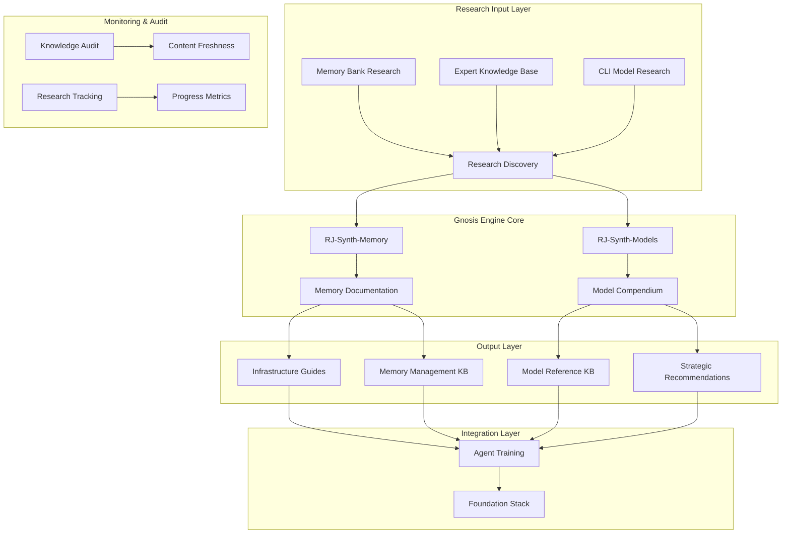
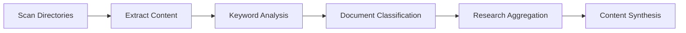
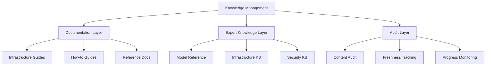
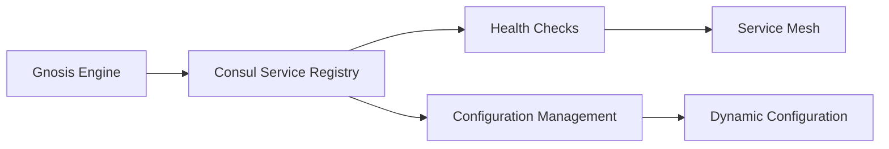
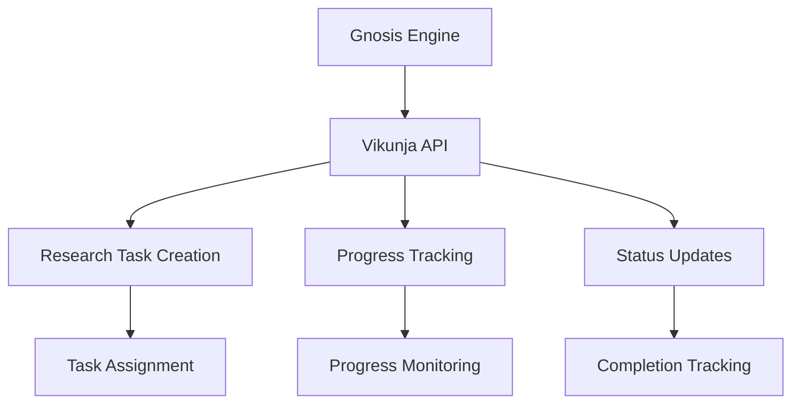
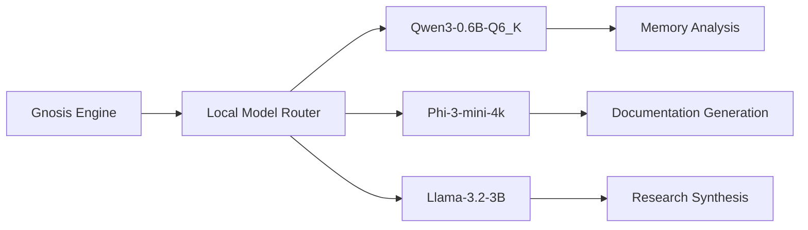
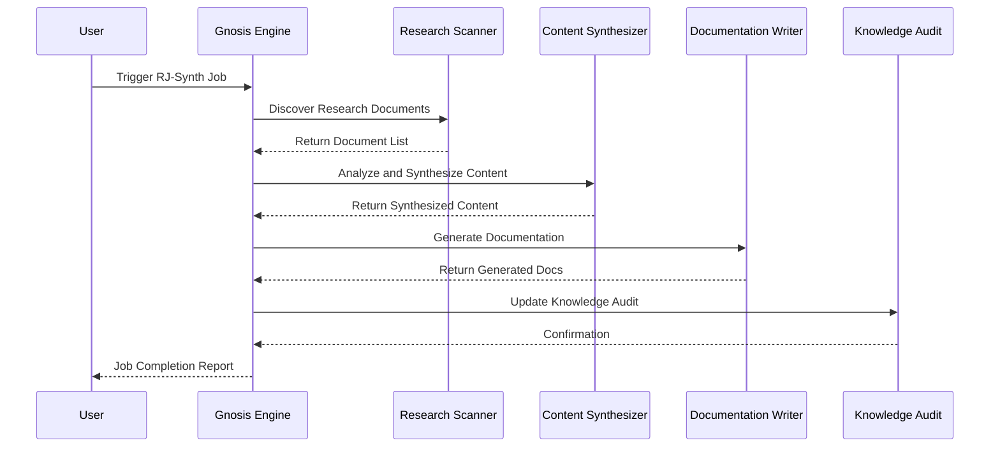
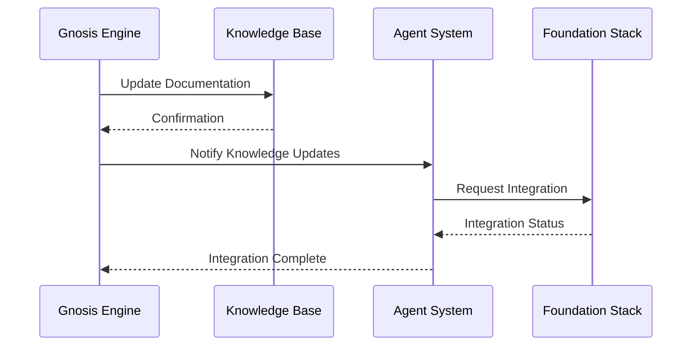
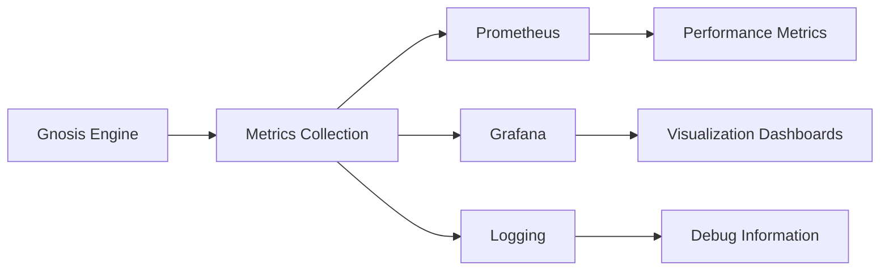

# Gnosis Engine Architecture

## Overview

The Gnosis Engine is a sophisticated research synthesis and knowledge management system that transforms raw research findings into structured documentation and expert knowledge bases. It serves as the central intelligence hub for the XNAi Foundation, enabling continuous learning and knowledge organization.

## Architecture Diagram



## Core Components

### 1. Research Discovery System

**Purpose**: Automatically discovers and categorizes research documents across the project.

**Components**:
- **Memory Bank Scanner**: Searches `memory_bank/research/` for relevant documents
- **Expert Knowledge Scanner**: Scans `expert-knowledge/` for existing domain knowledge
- **CLI Research Scanner**: Identifies model and tool research documents
- **Keyword Matching**: Uses domain-specific keywords to filter relevant content

**Process Flow**:


### 2. RJ-Synth Jobs

#### RJ-Synth-Memory
**Purpose**: Synthesizes memory management research into comprehensive documentation.

**Input Sources**:
- Memory management research documents
- Performance optimization studies
- Infrastructure configuration guides
- Troubleshooting procedures

**Output Artifacts**:
- `docs/03-how-to-guides/infrastructure/memory-management.md`
- `expert-knowledge/infrastructure/memory-management.md`
- Knowledge audit updates

#### RJ-Synth-Models
**Purpose**: Transforms model research into structured expert knowledge.

**Input Sources**:
- Model evaluation reports
- Performance benchmarks
- Context window analyses
- Provider comparison studies

**Output Artifacts**:
- `expert-knowledge/model-reference/MODEL-RESEARCH-COMPENDIUM.md`
- Strategic recommendations
- Implementation guidelines

### 3. Knowledge Management System

#### Documentation Structure


#### Expert Knowledge Base Organization
```
expert-knowledge/
├── _meta/
│   ├── knowledge-audit.yaml
│   └── domain-index.md
├── model-reference/
│   ├── MODEL-RESEARCH-COMPENDIUM.md
│   ├── CLI-FEATURE-COMPARISON-MATRIX.md
│   └── ANTIGRAVITY-FREE-TIER-MODELS.md
├── infrastructure/
│   └── memory-management.md
└── security/
    └── [existing security docs]
```

## Integration with Foundation Stack

### 1. Consul Integration

**Service Discovery for Gnosis Engine**:


**Implementation Strategy**:
- Register Gnosis Engine components as Consul services
- Implement health checks for research job status
- Use Consul KV for configuration management
- Enable service mesh for inter-component communication

### 2. Vikunja Integration

**Task Management for Research Jobs**:


**Implementation Strategy**:
- Create Vikunja projects for each research domain
- Automate task creation for new research jobs
- Track progress through Vikunja's task management
- Generate completion reports via API

### 3. Local Model Integration

**Enhanced Research Capabilities**:


**Implementation Strategy**:
- Integrate local models for research processing
- Use specialized models for different research types
- Implement model selection based on research complexity
- Add fallback mechanisms for model availability

## Process Workflows

### Research Job Execution Workflow


### Knowledge Integration Workflow


## Configuration Management

### Environment Variables
```bash
# Gnosis Engine Configuration
export GNOSIS_ENGINE_ENABLED=true
export GNOSIS_RESEARCH_PATH=memory_bank/research
export GNOSIS_OUTPUT_PATH=expert-knowledge
export GNOSIS_AUDIT_PATH=expert-knowledge/_meta

# Integration Services
export CONSUL_ENABLED=true
export CONSUL_HOST=localhost
export CONSUL_PORT=8500

export VIKUNJA_ENABLED=true
export VIKUNJA_URL=http://localhost:3456
export VIKUNJA_API_KEY=${VIKUNJA_API_KEY}

# Local Models
export LOCAL_MODEL_ENABLED=true
export MEMORY_MODEL=qwen3-0.6b-q6_k
export SYNTHESIS_MODEL=phi-3-mini-4k
export DOCUMENTATION_MODEL=llama-3.2-3b
```

### Configuration Files
```yaml
# configs/gnosis-engine.yaml
gnosis_engine:
  research:
    memory_keywords:
      - memory
      - zram
      - swap
      - performance
      - optimization
    model_keywords:
      - model
      - gpt
      - claude
      - gemini
      - context
      - benchmark
  output:
    documentation_path: docs/03-how-to-guides
    expert_kb_path: expert-knowledge
    audit_path: expert-knowledge/_meta
  integration:
    consul:
      enabled: true
      host: localhost
      port: 8500
    vikunja:
      enabled: true
      url: http://localhost:3456
    local_models:
      enabled: true
      memory_model: qwen3-0.6b-q6_k
      synthesis_model: phi-3-mini-4k
      documentation_model: llama-3.2-3b
```

## Monitoring and Observability

### Metrics Collection


### Key Metrics
- **Research Discovery Rate**: Documents discovered per hour
- **Synthesis Success Rate**: Successful job completions
- **Documentation Quality**: Content completeness and accuracy
- **Integration Latency**: Time to update knowledge bases
- **System Health**: Component availability and performance

### Alerting Strategy
```yaml
# Alerting Rules
alerts:
  research_job_failure:
    condition: research_jobs_failed > 3
    severity: critical
    message: "Multiple research job failures detected"
    
  documentation_stale:
    condition: documentation_age > 90d
    severity: warning
    message: "Documentation may be outdated"
    
  integration_failure:
    condition: integration_failures > 5
    severity: critical
    message: "Knowledge integration failures detected"
```

## Security Considerations

### Access Control
- Role-based access to research documents
- Secure API endpoints for integrations
- Audit logging for all operations
- Data encryption for sensitive research

### Data Privacy
- Sanitization of sensitive information in research
- Secure storage of research findings
- Controlled access to expert knowledge base
- Compliance with data protection regulations

## Future Enhancements

### Planned Integrations
1. **Advanced Analytics**: ML-driven research pattern analysis
2. **Automated Testing**: Validation of generated documentation
3. **Multi-Modal Research**: Integration of audio/video research sources
4. **Collaborative Features**: Multi-agent research coordination

### Scalability Improvements
1. **Distributed Processing**: Parallel research job execution
2. **Caching Strategies**: Research result caching for performance
3. **Load Balancing**: Distribution of research workloads
4. **Auto-Scaling**: Dynamic resource allocation based on demand

This architecture provides a robust foundation for the Gnosis Engine while ensuring seamless integration with the broader XNAi Foundation stack.