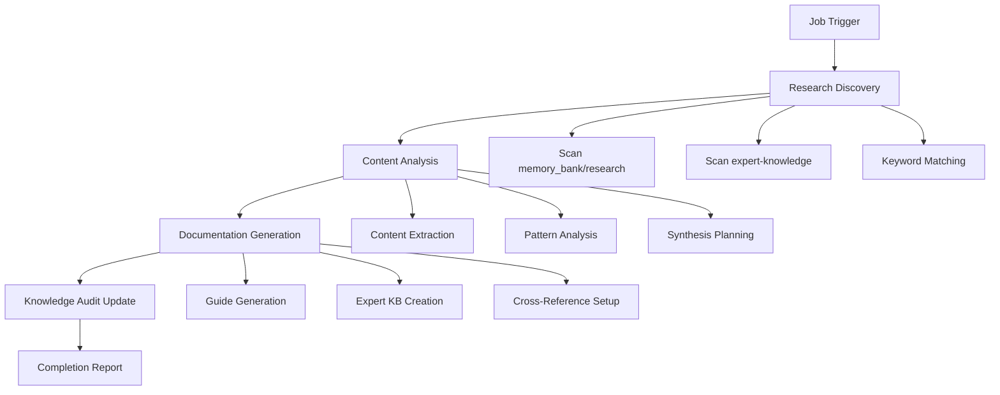
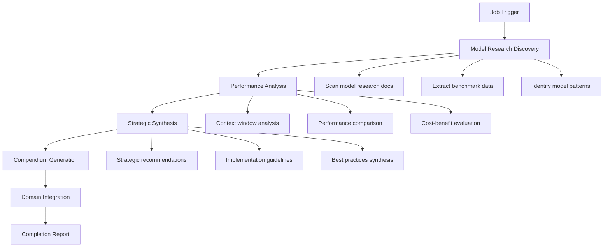

# Gnosis Engine Protocols

## Overview

This document defines the operational protocols, workflows, and best practices for the Gnosis Engine system. It serves as a comprehensive guide for system administrators, developers, and operators.

## Table of Contents

1. [Research Job Protocols](#research-job-protocols)
2. [Integration Protocols](#integration-protocols)
3. [Monitoring and Alerting](#monitoring-and-alerting)
4. [Security Protocols](#security-protocols)
5. [Troubleshooting Guide](#troubleshooting-guide)
6. [Best Practices](#best-practices)

## Research Job Protocols

### Job Execution Protocol

#### 1. RJ-Synth-Memory Job Protocol

**Purpose**: Systematic synthesis of memory management research into documentation.

**Execution Flow**:


**Input Validation**:
- Verify research document accessibility
- Check document format (Markdown)
- Validate content structure
- Ensure sufficient research sources (minimum 3 documents)

**Output Requirements**:
- Documentation must follow MkDocs structure
- Expert KB must include frontmatter metadata
- Cross-references must be valid
- Content must be comprehensive and actionable

#### 2. RJ-Synth-Models Job Protocol

**Purpose**: Transform model research into structured expert knowledge.

**Execution Flow**:


**Input Validation**:
- Verify model benchmark data accuracy
- Check for latest model specifications
- Validate performance metrics
- Ensure comprehensive coverage

**Output Requirements**:
- Compendium must include executive summary
- Performance data must be current
- Strategic recommendations must be actionable
- Implementation guidelines must be detailed

### Job Scheduling Protocol

#### Automated Scheduling
```yaml
# Research Job Schedule
research_schedule:
  rj_synth_memory:
    frequency: weekly
    day: sunday
    time: "02:00"
    priority: high
    
  rj_synth_models:
    frequency: monthly
    day: first_sunday
    time: "03:00"
    priority: medium
    
  knowledge_audit:
    frequency: daily
    time: "01:00"
    priority: low
```

#### Manual Execution Protocol
```bash
# Manual Job Execution
python3 scripts/rj-synth-memory.py --verbose
python3 scripts/rj-synth-models.py --verbose

# With dry-run for testing
python3 scripts/rj-synth-memory.py --dry-run --verbose
python3 scripts/rj-synth-models.py --dry-run --verbose
```

## Integration Protocols

### Consul Integration Protocol

#### Service Registration
```python
# Consul Service Registration
def register_gnosis_services():
    services = [
        {
            "id": "gnosis-engine",
            "name": "gnosis-engine",
            "address": "localhost",
            "port": 8080,
            "tags": ["gnosis", "research", "knowledge"],
            "checks": [
                {
                    "http": "http://localhost:8080/health",
                    "interval": "10s",
                    "timeout": "5s"
                }
            ]
        },
        {
            "id": "research-discovery",
            "name": "research-discovery",
            "address": "localhost",
            "port": 8081,
            "tags": ["research", "discovery"],
            "checks": [
                {
                    "http": "http://localhost:8081/health",
                    "interval": "30s",
                    "timeout": "10s"
                }
            ]
        }
    ]
    
    for service in services:
        consul_client.agent.service.register(**service)
```

#### Configuration Management
```python
# Consul Configuration Retrieval
def get_gnosis_config():
    config = {}
    
    # Get research paths
    research_path = consul_client.kv.get("gnosis/research/path")[1]['Value'].decode()
    config['research_path'] = research_path
    
    # Get output paths
    output_path = consul_client.kv.get("gnosis/output/path")[1]['Value'].decode()
    config['output_path'] = output_path
    
    # Get integration settings
    consul_enabled = consul_client.kv.get("gnosis/integration/consul/enabled")[1]['Value'].decode()
    config['consul_enabled'] = consul_enabled == 'true'
    
    return config
```

### Vikunja Integration Protocol

#### Task Management
```python
# Vikunja Task Creation
def create_research_task(task_name, description, project_id):
    task_data = {
        "title": task_name,
        "description": description,
        "project_id": project_id,
        "priority": 2,  # Medium priority
        "status": 1,    # Pending
        "due_date": None
    }
    
    response = requests.post(
        f"{VIKUNJA_URL}/api/v1/tasks",
        headers={"Authorization": f"Bearer {VIKUNJA_API_KEY}"},
        json=task_data
    )
    
    return response.json()

# Progress Tracking
def update_task_progress(task_id, progress, status):
    update_data = {
        "progress": progress,
        "status": status
    }
    
    response = requests.put(
        f"{VIKUNJA_URL}/api/v1/tasks/{task_id}",
        headers={"Authorization": f"Bearer {VIKUNJA_API_KEY}"},
        json=update_data
    )
    
    return response.json()
```

#### Project Structure
```python
# Vikunja Project Setup
def setup_research_projects():
    projects = [
        {"name": "Memory Management Research", "description": "Research and documentation for memory management"},
        {"name": "Model Research", "description": "AI model evaluation and comparison research"},
        {"name": "Knowledge Integration", "description": "Integration of research into knowledge base"}
    ]
    
    created_projects = []
    for project in projects:
        response = requests.post(
            f"{VIKUNJA_URL}/api/v1/projects",
            headers={"Authorization": f"Bearer {VIKUNJA_API_KEY}"},
            json=project
        )
        created_projects.append(response.json())
    
    return created_projects
```

### Local Model Integration Protocol

#### Model Selection Strategy
```python
# Model Router Implementation
class LocalModelRouter:
    def __init__(self):
        self.models = {
            'memory_analysis': 'qwen3-0.6b-q6_k',
            'content_synthesis': 'phi-3-mini-4k',
            'documentation': 'llama-3.2-3b'
        }
        self.model_availability = {}
    
    def select_model(self, task_type, complexity='medium'):
        model_name = self.models.get(task_type)
        
        if not model_name:
            # Fallback strategy
            if complexity == 'high':
                return 'phi-3-mini-4k'
            elif complexity == 'medium':
                return 'llama-3.2-3b'
            else:
                return 'qwen3-0.6b-q6_k'
        
        # Check model availability
        if self.is_model_available(model_name):
            return model_name
        else:
            return self.get_fallback_model(task_type)
    
    def is_model_available(self, model_name):
        # Check if model is loaded and responsive
        try:
            response = requests.get(f"http://localhost:8082/{model_name}/health")
            return response.status_code == 200
        except:
            return False
    
    def get_fallback_model(self, task_type):
        # Return appropriate fallback based on task
        fallback_map = {
            'memory_analysis': 'phi-3-mini-4k',
            'content_synthesis': 'llama-3.2-3b',
            'documentation': 'qwen3-0.6b-q6_k'
        }
        return fallback_map.get(task_type, 'phi-3-mini-4k')
```

#### Model Health Monitoring
```python
# Model Health Check
def check_model_health(model_name):
    health_endpoint = f"http://localhost:8082/{model_name}/health"
    
    try:
        response = requests.get(health_endpoint, timeout=10)
        if response.status_code == 200:
            health_data = response.json()
            return {
                'status': 'healthy',
                'response_time': health_data.get('response_time', 0),
                'memory_usage': health_data.get('memory_usage', 0),
                'model_version': health_data.get('model_version', 'unknown')
            }
        else:
            return {'status': 'unhealthy', 'error': f"HTTP {response.status_code}"}
    except Exception as e:
        return {'status': 'error', 'error': str(e)}
```

## Monitoring and Alerting

### Metrics Collection Protocol

#### Prometheus Metrics
```python
# Prometheus Metrics Definition
from prometheus_client import Counter, Histogram, Gauge

# Research job metrics
research_jobs_total = Counter(
    'gnosis_research_jobs_total',
    'Total number of research jobs executed',
    ['job_type', 'status']
)

research_job_duration = Histogram(
    'gnosis_research_job_duration_seconds',
    'Duration of research job execution',
    ['job_type']
)

research_discovery_rate = Gauge(
    'gnosis_research_discovery_rate',
    'Rate of research document discovery'
)

# Integration metrics
integration_success_rate = Gauge(
    'gnosis_integration_success_rate',
    'Success rate of knowledge integration'
)

# System health metrics
gnosis_engine_health = Gauge(
    'gnosis_engine_health',
    'Overall health of Gnosis Engine components'
)
```

#### Custom Metrics Collection
```python
# Custom Metrics Collection
class GnosisMetrics:
    def __init__(self):
        self.metrics = {}
    
    def collect_research_metrics(self):
        # Count research documents
        research_count = len(list(Path('memory_bank/research').glob('*.md')))
        self.metrics['research_document_count'] = research_count
        
        # Calculate synthesis success rate
        total_jobs = self.get_total_jobs()
        successful_jobs = self.get_successful_jobs()
        success_rate = successful_jobs / total_jobs if total_jobs > 0 else 0
        self.metrics['synthesis_success_rate'] = success_rate
        
        # Measure documentation freshness
        freshness = self.calculate_documentation_freshness()
        self.metrics['documentation_freshness'] = freshness
        
        return self.metrics
    
    def get_total_jobs(self):
        # Implementation to count total jobs
        pass
    
    def get_successful_jobs(self):
        # Implementation to count successful jobs
        pass
    
    def calculate_documentation_freshness(self):
        # Implementation to calculate freshness
        pass
```

### Alerting Rules

#### Critical Alerts
```yaml
# Prometheus Alerting Rules
groups:
  - name: gnosis_engine_alerts
    rules:
      - alert: ResearchJobFailure
        expr: increase(gnosis_research_jobs_total{status="failed"}[1h]) > 3
        for: 5m
        labels:
          severity: critical
        annotations:
          summary: "Multiple research job failures detected"
          description: "{{ $value }} research jobs have failed in the last hour"
      
      - alert: DocumentationStale
        expr: gnosis_documentation_freshness < 0.8
        for: 1h
        labels:
          severity: warning
        annotations:
          summary: "Documentation may be outdated"
          description: "Documentation freshness is below 80%"
      
      - alert: IntegrationFailure
        expr: gnosis_integration_success_rate < 0.9
        for: 10m
        labels:
          severity: critical
        annotations:
          summary: "Knowledge integration failures detected"
          description: "Integration success rate is below 90%"
```

#### Warning Alerts
```yaml
      - alert: ModelUnavailable
        expr: up{job="local_models"} == 0
        for: 2m
        labels:
          severity: warning
        annotations:
          summary: "Local model service unavailable"
          description: "Local model service has been down for more than 2 minutes"
      
      - alert: ConsulServiceDown
        expr: consul_up == 0
        for: 1m
        labels:
          severity: warning
        annotations:
          summary: "Consul service unavailable"
          description: "Consul service has been down for more than 1 minute"
```

## Security Protocols

### Access Control

#### Role-Based Access
```yaml
# Access Control Configuration
access_control:
  roles:
    researcher:
      permissions:
        - read_research
        - execute_jobs
        - view_metrics
      restrictions:
        - no_write_expert_kb
        - no_modify_config
    
    administrator:
      permissions:
        - all_permissions
      restrictions: []
    
    readonly:
      permissions:
        - read_documentation
        - view_metrics
      restrictions:
        - no_job_execution
        - no_config_modification
```

#### API Security
```python
# API Security Implementation
from functools import wraps
import jwt
from datetime import datetime, timedelta

def authenticate_api_request(f):
    @wraps(f)
    def decorated_function(*args, **kwargs):
        auth_header = request.headers.get('Authorization')
        if not auth_header:
            return {'error': 'Authorization header required'}, 401
        
        try:
            token = auth_header.split(' ')[1]
            payload = jwt.decode(token, SECRET_KEY, algorithms=['HS256'])
            
            # Check token expiration
            if payload['exp'] < datetime.utcnow().timestamp():
                return {'error': 'Token expired'}, 401
            
            # Check user permissions
            if not has_permission(payload['user_id'], request.endpoint):
                return {'error': 'Insufficient permissions'}, 403
            
            return f(*args, **kwargs)
        except jwt.InvalidTokenError:
            return {'error': 'Invalid token'}, 401
    
    return decorated_function

def has_permission(user_id, endpoint):
    # Implementation to check user permissions
    pass
```

### Data Privacy

#### Research Data Sanitization
```python
# Data Sanitization
import re

class ResearchDataSanitizer:
    def __init__(self):
        self.sensitive_patterns = [
            r'\b\d{4}-\d{4}-\d{4}-\d{4}\b',  # Credit card numbers
            r'\b\d{3}-\d{2}-\d{4}\b',        # SSN
            r'\b[A-Za-z0-9._%+-]+@[A-Za-z0-9.-]+\.[A-Z|a-z]{2,}\b',  # Email
            r'\b\d{1,3}\.\d{1,3}\.\d{1,3}\.\d{1,3}\b'  # IP addresses
        ]
    
    def sanitize_content(self, content):
        sanitized = content
        for pattern in self.sensitive_patterns:
            sanitized = re.sub(pattern, '[REDACTED]', sanitized, flags=re.IGNORECASE)
        return sanitized
    
    def validate_research_document(self, document_path):
        with open(document_path, 'r') as f:
            content = f.read()
        
        # Check for sensitive data
        for pattern in self.sensitive_patterns:
            if re.search(pattern, content, re.IGNORECASE):
                return False, "Document contains sensitive information"
        
        return True, "Document is safe for processing"
```

## Troubleshooting Guide

### Common Issues

#### Research Discovery Failures
**Symptoms**: No research documents found
**Causes**:
- Incorrect research path configuration
- File permission issues
- Missing keyword definitions

**Solutions**:
```bash
# Check research path
echo $GNOSIS_RESEARCH_PATH

# Verify file permissions
ls -la memory_bank/research/

# Test keyword matching
python3 -c "
from pathlib import Path
docs = list(Path('memory_bank/research').glob('*.md'))
print(f'Found {len(docs)} documents')
"
```

#### Integration Failures
**Symptoms**: Knowledge base not updating
**Causes**:
- Service connectivity issues
- Authentication failures
- Configuration errors

**Solutions**:
```bash
# Check service connectivity
curl -f http://localhost:8500/v1/status/leader
curl -f http://localhost:3456/api/v1/health

# Verify authentication
echo $VIKUNJA_API_KEY | head -c 10

# Test configuration
python3 -c "
import yaml
with open('configs/gnosis-engine.yaml') as f:
    config = yaml.safe_load(f)
print('Configuration loaded successfully')
"
```

#### Model Integration Issues
**Symptoms**: Local models not responding
**Causes**:
- Model not loaded
- Resource constraints
- Network connectivity

**Solutions**:
```bash
# Check model status
curl http://localhost:8082/qwen3-0.6b-q6_k/health

# Verify resource usage
nvidia-smi  # For GPU models
free -h     # For memory usage

# Test model response
curl -X POST http://localhost:8082/qwen3-0.6b-q6_k/generate \
  -H "Content-Type: application/json" \
  -d '{"prompt": "Hello", "max_tokens": 10}'
```

### Diagnostic Tools

#### Health Check Script
```bash
#!/bin/bash
# Gnosis Engine Health Check

echo "=== Gnosis Engine Health Check ==="

# Check research paths
echo "Research Path: $GNOSIS_RESEARCH_PATH"
if [ -d "$GNOSIS_RESEARCH_PATH" ]; then
    echo "✓ Research path exists"
    echo "  Documents: $(find $GNOSIS_RESEARCH_PATH -name '*.md' | wc -l)"
else
    echo "✗ Research path does not exist"
fi

# Check output paths
echo "Output Path: $GNOSIS_OUTPUT_PATH"
if [ -d "$GNOSIS_OUTPUT_PATH" ]; then
    echo "✓ Output path exists"
else
    echo "✗ Output path does not exist"
fi

# Check services
echo "=== Service Status ==="
services=("consul:8500" "vikunja:3456" "prometheus:9090")
for service in "${services[@]}"; do
    host=$(echo $service | cut -d: -f1)
    port=$(echo $service | cut -d: -f2)
    if curl -s -f "http://$host:$port" > /dev/null; then
        echo "✓ $service"
    else
        echo "✗ $service"
    fi
done

echo "=== Health Check Complete ==="
```

#### Log Analysis
```python
# Log Analysis Script
import re
from datetime import datetime, timedelta

def analyze_gnosis_logs(log_file):
    with open(log_file, 'r') as f:
        logs = f.readlines()
    
    # Parse log entries
    errors = []
    warnings = []
    successes = []
    
    for log in logs:
        if 'ERROR' in log:
            errors.append(log)
        elif 'WARNING' in log:
            warnings.append(log)
        elif 'completed' in log.lower():
            successes.append(log)
    
    # Generate report
    report = {
        'total_entries': len(logs),
        'errors': len(errors),
        'warnings': len(warnings),
        'successes': len(successes),
        'error_rate': len(errors) / len(logs) if logs else 0
    }
    
    return report

# Usage
report = analyze_gnosis_logs('/var/log/gnosis-engine.log')
print(f"Error rate: {report['error_rate']:.2%}")
```

## Best Practices

### Research Job Management

#### Job Isolation
- Run research jobs in isolated environments
- Use separate processes for different job types
- Implement proper error handling and cleanup
- Monitor resource usage during job execution

#### Content Quality Assurance
- Validate research source credibility
- Cross-reference multiple sources
- Ensure documentation accuracy
- Maintain consistent formatting and structure

### Integration Management

#### Service Dependencies
- Implement proper service startup order
- Use health checks for dependency validation
- Implement graceful degradation for failed services
- Monitor integration performance metrics

#### Configuration Management
- Use environment variables for configuration
- Implement configuration validation
- Support dynamic configuration updates
- Maintain configuration versioning

### Security Best Practices

#### Data Protection
- Encrypt sensitive research data
- Implement proper access controls
- Regular security audits
- Data retention and deletion policies

#### API Security
- Use HTTPS for all API communications
- Implement rate limiting
- Use strong authentication mechanisms
- Regular security testing and updates

### Performance Optimization

#### Resource Management
- Monitor memory and CPU usage
- Implement caching for frequently accessed data
- Use efficient data structures and algorithms
- Optimize database queries and operations

#### Scalability Considerations
- Design for horizontal scaling
- Implement load balancing
- Use asynchronous processing where appropriate
- Monitor performance metrics and trends

This protocol document provides comprehensive guidance for operating and maintaining the Gnosis Engine system effectively and securely.