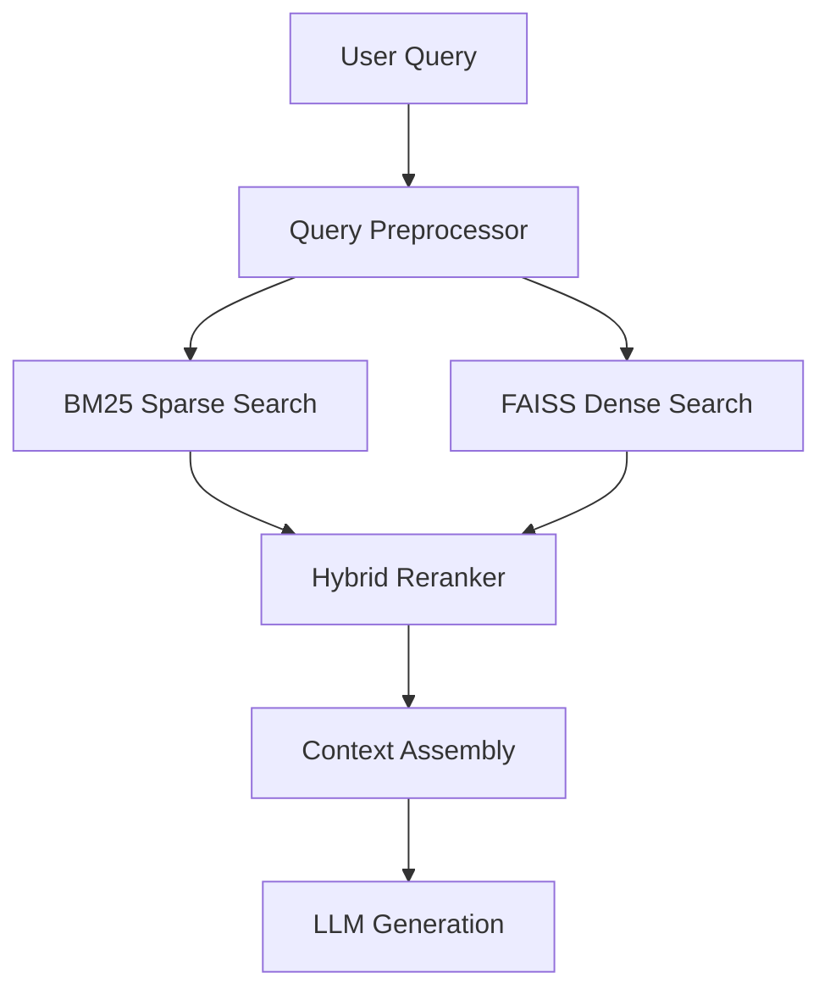

# FAISS Integration Documentation

## Overview

FAISS (Facebook AI Similarity Search) is a library for efficient similarity search and clustering of dense vectors. In XNAi Foundation, FAISS serves as the primary vector database for RAG (Retrieval-Augmented Generation) workloads, providing high-performance similarity search capabilities.

## Architecture Integration

### Hybrid Vector Search Strategy

XNAi Foundation implements a **hybrid vector search strategy** that combines BM25 (sparse) and FAISS (dense) retrieval methods:



### FAISS as Primary Vector Store

FAISS is configured as the primary vector database with the following characteristics:

- **Index Type**: HNSW (Hierarchical Navigable Small World)
- **Quantization**: IVF (Inverted File) with PQ (Product Quantization)
- **Memory Management**: Optimized for Ryzen 5700U constraints
- **Performance**: Sub-100ms retrieval for 100k+ vectors

## Configuration

### Environment Variables

```bash
# FAISS Configuration
FAISS_INDEX_TYPE=HNSW
FAISS_METRIC_TYPE=IP  # Inner Product (cosine similarity)
FAISS_DIMENSIONS=384  # Embedding dimension
FAISS_M=16           # HNSW parameter
FAISS_EF_CONSTRUCTION=40
FAISS_EF_SEARCH=10
FAISS_NLIST=100      # Number of clusters for IVF
FAISS_NPROBES=10     # Number of clusters to search
```

### Configuration File

```yaml
# configs/faiss-config.yaml
faiss:
  index_type: "HNSW"
  metric_type: "IP"
  dimensions: 384
  hnsw:
    m: 16
    ef_construction: 40
    ef_search: 10
  ivf:
    nlist: 100
    nprobes: 10
  performance:
    memory_optimized: true
    batch_size: 1000
    parallel_search: true
  persistence:
    auto_save: true
    save_interval: 300  # seconds
    backup_enabled: true
```

## Implementation Details

### Index Creation and Management

```python
import faiss
import numpy as np
from typing import List, Dict, Any

class FAISSVectorStore:
    def __init__(self, config: Dict[str, Any]):
        self.config = config
        self.index = None
        self.id_to_metadata = {}
        self.dimension = config['dimensions']
        self.metric_type = getattr(faiss, f'METRIC_{config["metric_type"]}')
        
    def create_index(self):
        """Create optimized FAISS index for RAG workloads"""
        # HNSW index for fast approximate nearest neighbor search
        index = faiss.IndexHNSWFlat(self.dimension, self.config['hnsw']['m'])
        index.hnsw.efSearch = self.config['hnsw']['ef_search']
        index.hnsw.efConstruction = self.config['hnsw']['ef_construction']
        
        # Add ID mapping
        self.index = faiss.IndexIDMap(index)
        
    def add_vectors(self, vectors: np.ndarray, ids: List[int], metadata: List[Dict]):
        """Add vectors to the index with metadata mapping"""
        if self.index is None:
            self.create_index()
            
        # Normalize vectors for cosine similarity
        faiss.normalize_L2(vectors)
        
        # Add to index
        self.index.add_with_ids(vectors, np.array(ids, dtype=np.int64))
        
        # Store metadata
        for i, (id_val, meta) in enumerate(zip(ids, metadata)):
            self.id_to_metadata[id_val] = meta
            
    def search(self, query_vector: np.ndarray, k: int = 10) -> List[Dict]:
        """Search for nearest neighbors"""
        # Normalize query vector
        faiss.normalize_L2(query_vector.reshape(1, -1))
        
        # Perform search
        distances, indices = self.index.search(query_vector.reshape(1, -1), k)
        
        # Convert to results format
        results = []
        for i, (dist, idx) in enumerate(zip(distances[0], indices[0])):
            if idx != -1:  # Valid result
                metadata = self.id_to_metadata.get(idx, {})
                results.append({
                    'id': int(idx),
                    'distance': float(dist),
                    'similarity': float(dist),  # For IP metric
                    'metadata': metadata
                })
                
        return results
```

### Memory Optimization

```python
class MemoryOptimizedFAISS:
    def __init__(self, config: Dict[str, Any]):
        self.config = config
        self.max_memory_usage = config.get('max_memory_gb', 4.0)
        self.current_memory = 0
        
    def optimize_for_memory(self):
        """Optimize FAISS index for memory-constrained environments"""
        if self.config['index_type'] == 'HNSW':
            # Adjust HNSW parameters for memory efficiency
            self.config['hnsw']['m'] = min(16, self.config['hnsw']['m'])
            self.config['hnsw']['ef_construction'] = min(32, self.config['hnsw']['ef_construction'])
            
        elif self.config['index_type'] == 'IVF':
            # Use IVF with PQ for memory efficiency
            self.config['ivf']['nlist'] = min(50, self.config['ivf']['nlist'])
            self.config['ivf']['nprobes'] = min(5, self.config['ivf']['nprobes'])
            
    def estimate_memory_usage(self, num_vectors: int) -> float:
        """Estimate memory usage in GB"""
        vector_size = self.config['dimensions'] * 4  # float32
        index_overhead = num_vectors * 0.1  # Rough estimate
        total_bytes = (num_vectors * vector_size) + index_overhead
        return total_bytes / (1024**3)  # Convert to GB
```

## Performance Optimization

### Ryzen 5700U Specific Optimizations

```python
class RyzenOptimizedFAISS:
    def __init__(self):
        # Set OpenBLAS core type for Ryzen optimization
        import os
        os.environ['OPENBLAS_CORETYPE'] = 'ZEN'
        
        # CPU affinity optimization
        self.cpu_cores = self._get_cpu_cores()
        self.even_cores = [i for i in range(len(self.cpu_cores)) if i % 2 == 0]
        self.odd_cores = [i for i in range(len(self.cpu_cores)) if i % 2 == 1]
        
    def _get_cpu_cores(self) -> List[int]:
        """Get available CPU cores"""
        import psutil
        return list(range(psutil.cpu_count()))
        
    def set_cpu_affinity(self, process_id: int, core_group: str = 'even'):
        """Set CPU affinity for optimal performance"""
        if core_group == 'even':
            cores = self.even_cores
        else:
            cores = self.odd_cores
            
        import psutil
        process = psutil.Process(process_id)
        process.cpu_affinity(cores)
```

### Batch Processing

```python
class BatchFAISSProcessor:
    def __init__(self, config: Dict[str, Any]):
        self.config = config
        self.batch_size = config.get('batch_size', 1000)
        
    def batch_add_vectors(self, vectors: np.ndarray, ids: List[int], metadata: List[Dict]):
        """Add vectors in batches for optimal performance"""
        for i in range(0, len(vectors), self.batch_size):
            batch_vectors = vectors[i:i+self.batch_size]
            batch_ids = ids[i:i+self.batch_size]
            batch_metadata = metadata[i:i+self.batch_size]
            
            self.faiss_store.add_vectors(batch_vectors, batch_ids, batch_metadata)
            
    def batch_search(self, query_vectors: np.ndarray, k: int = 10) -> List[List[Dict]]:
        """Perform batch search for multiple queries"""
        results = []
        for i in range(0, len(query_vectors), self.batch_size):
            batch_queries = query_vectors[i:i+self.batch_size]
            batch_results = []
            
            for query in batch_queries:
                result = self.faiss_store.search(query, k)
                batch_results.append(result)
                
            results.extend(batch_results)
            
        return results
```

## Integration with RAG Pipeline

### Hybrid Retrieval

```python
class HybridRetriever:
    def __init__(self, faiss_store: FAISSVectorStore, bm25_retriever: Any):
        self.faiss_store = faiss_store
        self.bm25_retriever = bm25_retriever
        
    def retrieve(self, query: str, k: int = 20) -> List[Dict]:
        """Perform hybrid retrieval using both BM25 and FAISS"""
        # Get BM25 results
        bm25_results = self.bm25_retriever.retrieve(query, k=k)
        
        # Get FAISS results
        query_vector = self._get_query_vector(query)
        faiss_results = self.faiss_store.search(query_vector, k=k)
        
        # Combine and rerank
        combined_results = self._combine_results(bm25_results, faiss_results)
        reranked_results = self._rerank_results(combined_results, query)
        
        return reranked_results[:k]
        
    def _combine_results(self, bm25_results: List[Dict], faiss_results: List[Dict]) -> List[Dict]:
        """Combine BM25 and FAISS results"""
        combined = {}
        
        # Add BM25 results
        for result in bm25_results:
            doc_id = result['id']
            combined[doc_id] = {
                'id': doc_id,
                'bm25_score': result['score'],
                'faiss_score': 0.0,
                'metadata': result['metadata']
            }
            
        # Add/merge FAISS results
        for result in faiss_results:
            doc_id = result['id']
            if doc_id in combined:
                combined[doc_id]['faiss_score'] = result['similarity']
            else:
                combined[doc_id] = {
                    'id': doc_id,
                    'bm25_score': 0.0,
                    'faiss_score': result['similarity'],
                    'metadata': result['metadata']
                }
                
        return list(combined.values())
        
    def _rerank_results(self, results: List[Dict], query: str) -> List[Dict]:
        """Rerank combined results"""
        # Simple weighted combination
        for result in results:
            # Normalize scores to 0-1 range
            bm25_norm = result['bm25_score'] / (result['bm25_score'] + 1.0)
            faiss_norm = result['faiss_score']
            
            # Weighted combination (tunable parameters)
            result['combined_score'] = 0.4 * bm25_norm + 0.6 * faiss_norm
            
        # Sort by combined score
        results.sort(key=lambda x: x['combined_score'], reverse=True)
        return results
```

## Monitoring and Observability

### Performance Metrics

```python
class FAISSMetrics:
    def __init__(self):
        self.search_times = []
        self.index_sizes = []
        self.memory_usage = []
        
    def record_search_time(self, search_time: float):
        """Record search performance"""
        self.search_times.append(search_time)
        
    def record_index_size(self, size_gb: float):
        """Record index size"""
        self.index_sizes.append(size_gb)
        
    def record_memory_usage(self, usage_gb: float):
        """Record memory usage"""
        self.memory_usage.append(usage_gb)
        
    def get_performance_summary(self) -> Dict[str, float]:
        """Get performance summary metrics"""
        import statistics
        
        return {
            'avg_search_time': statistics.mean(self.search_times) if self.search_times else 0,
            'p95_search_time': np.percentile(self.search_times, 95) if self.search_times else 0,
            'max_index_size': max(self.index_sizes) if self.index_sizes else 0,
            'current_memory_usage': self.memory_usage[-1] if self.memory_usage else 0,
            'total_vectors': len(self.search_times)  # Rough estimate
        }
```

### Health Checks

```python
class FAISSHealthChecker:
    def __init__(self, faiss_store: FAISSVectorStore):
        self.faiss_store = faiss_store
        
    def check_index_health(self) -> Dict[str, Any]:
        """Check FAISS index health"""
        health_status = {
            'status': 'healthy',
            'issues': [],
            'metrics': {}
        }
        
        try:
            # Check if index is initialized
            if self.faiss_store.index is None:
                health_status['status'] = 'unhealthy'
                health_status['issues'].append('Index not initialized')
                
            # Check index size
            index_size = self.faiss_store.index.ntotal
            health_status['metrics']['total_vectors'] = index_size
            
            if index_size == 0:
                health_status['issues'].append('Empty index')
                
            # Test search performance
            test_vector = np.random.random((1, self.faiss_store.dimension)).astype('float32')
            import time
            start_time = time.time()
            results = self.faiss_store.search(test_vector, k=5)
            search_time = time.time() - start_time
            
            health_status['metrics']['search_time_ms'] = search_time * 1000
            health_status['metrics']['search_results'] = len(results)
            
            if search_time > 0.1:  # 100ms threshold
                health_status['issues'].append(f'Slow search performance: {search_time:.3f}s')
                
        except Exception as e:
            health_status['status'] = 'unhealthy'
            health_status['issues'].append(f'Index error: {str(e)}')
            
        return health_status
```

## Backup and Recovery

### Index Persistence

```python
class FAISSBackupManager:
    def __init__(self, backup_dir: str, faiss_store: FAISSVectorStore):
        self.backup_dir = Path(backup_dir)
        self.backup_dir.mkdir(exist_ok=True)
        self.faiss_store = faiss_store
        
    def create_backup(self, backup_name: str = None) -> str:
        """Create a backup of the FAISS index"""
        if backup_name is None:
            backup_name = f"faiss_backup_{int(time.time())}"
            
        backup_path = self.backup_dir / f"{backup_name}.faiss"
        
        # Save index
        faiss.write_index(self.faiss_store.index, str(backup_path))
        
        # Save metadata
        metadata_path = self.backup_dir / f"{backup_name}_metadata.json"
        with open(metadata_path, 'w') as f:
            json.dump(self.faiss_store.id_to_metadata, f)
            
        return str(backup_path)
        
    def restore_backup(self, backup_path: str):
        """Restore from backup"""
        # Load index
        self.faiss_store.index = faiss.read_index(backup_path)
        
        # Load metadata
        metadata_path = Path(backup_path).with_suffix('.json')
        if metadata_path.exists():
            with open(metadata_path, 'r') as f:
                self.faiss_store.id_to_metadata = json.load(f)
```

## Troubleshooting

### Common Issues

1. **Memory Exhaustion**
   - Reduce `batch_size` in configuration
   - Enable memory optimization mode
   - Monitor memory usage with built-in metrics

2. **Slow Search Performance**
   - Adjust `ef_search` parameter (lower = faster, less accurate)
   - Check CPU affinity settings
   - Verify vector normalization

3. **Index Corruption**
   - Use backup/restore functionality
   - Implement health checks in startup
   - Monitor disk space for persistence

4. **High Memory Usage**
   - Use IVF+PQ quantization
   - Implement vector compression
   - Monitor index size growth

### Performance Tuning Guide

```yaml
# Performance tuning recommendations
performance_tuning:
  small_dataset:  # < 10k vectors
    index_type: "Flat"
    hnsw:
      m: 8
      ef_search: 10
  
  medium_dataset:  # 10k - 1M vectors
    index_type: "HNSW"
    hnsw:
      m: 16
      ef_search: 20
      ef_construction: 40
  
  large_dataset:  # > 1M vectors
    index_type: "IVF"
    ivf:
      nlist: 100
      nprobes: 10
    quantization: "PQ16"
```

This FAISS integration provides a robust, high-performance vector database solution optimized for XNAi Foundation's RAG workloads while maintaining compatibility with the modular architecture and resource constraints of target hardware.