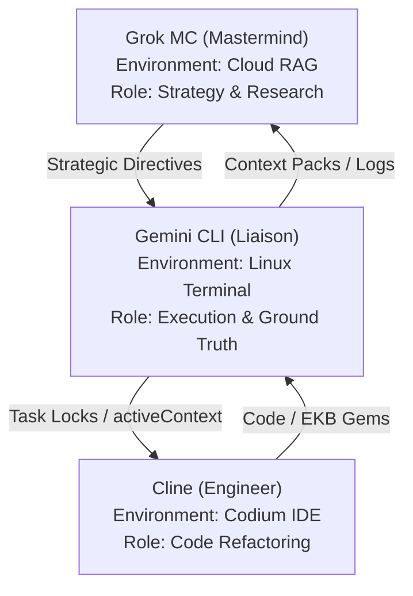

# Memory Bank Refresh Receipt

## Refresh Details
- **Timestamp**: 2026-02-04 19:55:37
- **Agent**: Gemini CLI
- **Source Context**: GROK_CONTEXT_PACK_v1.5.0.md
- **Files Updated**: 3

## Updated Files
- memory_bank/activeContext.md
- memory_bank/teamProtocols.md
- expert-knowledge/sync/sovereign-synergy-expert-v1.0.0.md

## Key Information Extracted from GROK_CONTEXT_PACK

### Phase Progress
- Major modular refactor for maintainability, testability, and offline-first reliability
- Adoption of advanced FastAPI, Pydantic v2, async, and service-layer best practices
- Team-wide research and onboarding to modern patterns for sovereign AI stacks

**Quick Onboarding for AI Assistants & Contributors:**
- See the following two documents for the full implementation and research plans:
	- [Xoe-NovAi v0.1.0-alpha Modular Refactoring Plan - Table of Contents](../internal_docs/dev/Xoe-NovAi%20v0.1.0-alpha%20Modular%20Refactoring%20Plan%20-%20Table%20of%20Contents.md)
	- [Xoe-NovAi Foundation Stack - Comprehensive Team Research Plan](../internal_docs/dev/Xoe-NovAi%20Foundation%20Stack%20-%20Comprehensive%20Team%20Research%20Plan.md)
	- [Xoe-NovAi v0.1.0-alpha Modular Refactoring Plan - additional critical areas](../internal_docs/dev/Xoe-NovAi%20v0.1.0-alpha%20Modular%20Refactoring%20Plan%20-%20additional%20critical%20areas.md)

**Additional Critical Areas:**
All assistants and contributors should also review the "additional critical areas" supplement, which highlights often-overlooked or high-impact domains essential for a robust, production-grade refactor. This document is a living checklist to ensure no critical aspect is missed during implementation or review.

**Summary:**
- All agents and contributors should review these plans before making architectural or code changes.
- The memory_bank, projectbrief, and progress files are now aligned with this new phase.

### Sync Status
### 📡 Synergy Ecosystem & AI Assistant Flows
The Xoe-NovAi ecosystem utilizes a specialized multi-agent flow across cloud and local environments.

- **Grok MC**: strategic anchor; cloud-scale synthesis; strategic RAG.
- **Cline**: deep refactoring; IDE mastery. Powered by **Cline-Kat**, **Cline-Trinity**, or **Cline-Gemini-3/1.5**.
- **Gemini CLI**: system liaison; real-time execution; `stack_cat.py` orchestration.

## Drift Prevention Protocol
This refresh ensures memory_bank/ files stay current with the latest GROK_CONTEXT_PACK.
Run this protocol after every major task (Phase 2 milestones, nomenclature changes, pack generations).
