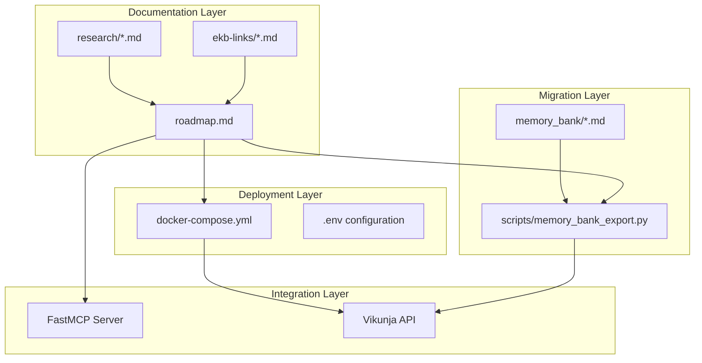

# Vikunja Deployment Artifacts v1.0.0

## Overview

This document captures all deployment artifacts for Vikunja integration as part of the Xoe-NovAi stack. These files implement Grok MC's Elite Strategy with rootless security, FastMCP integration, and systematic migration from memory_bank.

## Artifacts Inventory

### 1. Deployment Configuration
**File**: `docker-compose.yml`
**Purpose**: Rootless Podman deployment with health checks
**Key Features**:
- Postgres 16 backend with persistent volumes
- Vikunja API v1 with health monitoring
- Local-only frontend with CORS disabled
- Rootless container security (no privileged operations)
- Health check dependencies for smart lag mitigation

### 2. Migration Tooling
**File**: `scripts/memory_bank_export.py`
**Purpose**: Memory bank to Vikunja task exporter
**Key Features**:
- Frontmatter extraction from markdown files
- Ma'at ideal, agent, and status labeling system
- Custom field mapping (Owner, Date, EKB-Links, Version)
- Priority classification (critical/high/medium/low)
- Project assignment and domain mapping

### 3. Implementation Roadmap
**File**: `docs/05-research/vikunja-implementation-roadmap.md`
**Purpose**: 10-week phased implementation strategy
**Key Phases**:
- Phase 0: Pre-deployment audit and preparation
- Phase 1: Migration and rootless Podman deployment
- Phase 2: FastMCP MCP integration layer
- Phase 3: Agent workflow integration
- Phase 4: Advanced automation features
- Phase 5: Optimization and Trinity hardening

### 4. Research Documentation
**Folder**: `docs/06-development-log/vikunja-integration/`
**Content**:
- `Vikunja Research Delivery Elite Gap Closure.md`: Detailed research findings
- `Gemini API & CLI MCP Elite Strategy (2026 Locked).md`: API/CLI integration patterns
- `Xoe-NovAi Vikunja Integration Sovereign Migration & Organization Guide.md`: Full integration guide

## Cross-Reference Architecture



## Usage Instructions

### Initial Deployment
```bash
# Generate random DB password
export VIKUNJA_DB_PASSWORD=$(openssl rand -hex 16)

# Start Vikunja quad (rootless)
podman-compose -f docker-compose.yml up -d --userns=keep-id

# Verify health
podman-compose -f docker-compose.yml logs
```

### Memory Bank Export
```bash
# Export all tasks with dry run
chmod +x scripts/memory_bank_export.py
./scripts/memory_bank_export.py --dry-run memory_bank vikunja-import.json

# Review export
cat vikunja-import.json

# Import (requires API token from UI)
python scripts/vikunja_import.py --token $VIKUNJA_API_TOKEN vikunja-import.json
```

### FastMCP Server Testing
```bash
# Run prototype server
python scripts/mcp_servers/vikunja_mcp.py

# Test via curl
curl -X POST http://localhost:8080/api/v1/tools/create_vikunja_task \
  -H "Content-Type: application/json" \
  -d '{
    "title": "Test Task",
    "desc": "This is a test task", 
    "project_id": 1
  }'
```

## EKB Links

- **Docker Compose**: `/home/arcana-novai/Documents/xnai-foundation/docker-compose.yml`
- **Export Script**: `/home/arcana-novai/Documents/xnai-foundation/scripts/memory_bank_export.py`
- **Roadmap**: `/home/arcana-novai/Documents/xnai-foundation/docs/05-research/vikunja-implementation-roadmap.md`
- **Research Logs**: `/home/arcana-novai/Documents/xnai-foundation/docs/06-development-log/vikunja-integration/`

## Ma'at Alignment

| Ideal | Implementation |
|-------|---------------|
| **7 - Truth** | Accurate task mapping from memory_bank metadata |
| **18 - Balance** | Harmonious integration strategy across agents |
| **41 - Advancement** | Modern PM tooling with elite deployment practices |

## Next Action
**Commit artifacts and proceed with Phase 0 audit**