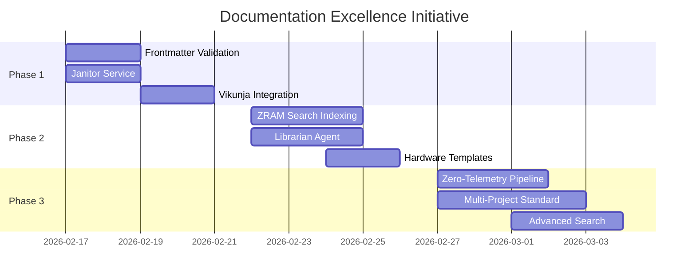

# XOE-NOVAI FOUNDATION: DOCUMENTATION EXCELLENCE STRATEGY v2.0
**Version**: 2.0.0 | **Status**: ACTIVE IMPLEMENTATION | **Priority**: CRITICAL  
**Created**: 2026-02-17 | **Last Updated**: 2026-02-17T17:17:00Z

---

## Executive Summary

This document defines the **Strategic Documentation Excellence Initiative** - a comprehensive, multi-agent approach to transforming Xoe-NovAi Foundation's documentation system into an intelligent, automated, self-sustaining ecosystem.

### Vision Statement
> *Documentation that maintains itself, evolves with the project, and serves both human and AI agents with equal effectiveness.*

### Core Principles
1. **Automation First**: 80% reduction in manual documentation tasks
2. **Zero-Telemetry Sovereignty**: All tools respect privacy constraints
3. **Multi-Agent Orchestration**: Clear roles and handoff protocols
4. **Hardware-Aware Optimization**: Ryzen/Vulkan/ZRAM-optimized performance
5. **Living Documentation**: Continuous freshness and quality assurance

---

## Part 1: Strategic Framework

### 1.1 Current State Analysis

| Component | Current State | Gap | Impact |
|-----------|--------------|-----|--------|
| Frontmatter | Inconsistent (20+/349 files) | No validation | Unreliable metadata |
| Genealogy Tracker | Manual updates | No automation | Drift and staleness |
| Vikunja Integration | Basic import script | No lifecycle sync | Manual coordination |
| Search Indexing | Standard Qdrant | No ZRAM optimization | Suboptimal performance |
| Agent Roles | No Librarian role | Missing automation | Manual oversight |

### 1.2 Target State Architecture

```
┌─────────────────────────────────────────────────────────────────────┐
│                    DOCUMENTATION EXCELLENCE SYSTEM                   │
├─────────────────────────────────────────────────────────────────────┤
│  ┌─────────────┐  ┌─────────────┐  ┌─────────────┐  ┌─────────────┐ │
│  │  LIBRARIAN  │  │     QA      │  │   SEARCH    │  │ INTEGRATION │ │
│  │   AGENT     │  │   AGENT     │  │   AGENT     │  │   AGENT     │ │
│  └──────┬──────┘  └──────┬──────┘  └──────┬──────┘  └──────┬──────┘ │
│         │                │                │                │        │
│         └────────────────┴────────────────┴────────────────┘        │
│                                   │                                  │
│                        ┌──────────▼──────────┐                       │
│                        │    AGENT BUS        │                       │
│                        │  (Redis Streams)    │                       │
│                        └──────────┬──────────┘                       │
│                                   │                                  │
│  ┌─────────────┐  ┌─────────────┐  ┌─────────────┐  ┌─────────────┐ │
│  │  CRAWLER    │  │  CURATION   │  │   VIKUNJA   │  │   QDRANT    │ │
│  │   SYSTEM    │  │   BRIDGE    │  │    SYNC     │  │   SEARCH    │ │
│  └─────────────┘  └─────────────┘  └─────────────┘  └─────────────┘ │
└─────────────────────────────────────────────────────────────────────┘
```

---

## Part 2: Implementation Phases

### PHASE 1: FOUNDATION (Week 1)

#### Objective
Establish core infrastructure for automated documentation management.

#### Research Requests

**REQ-DOC-001: Documentation System Audit**
```yaml
assigned_to: Gemini CLI
priority: P0-CRITICAL
objective: Comprehensive audit of current documentation state
deliverables:
  - Frontmatter usage analysis across all markdown files
  - Genealogy Tracker automation opportunities
  - Current Vikunja integration assessment
  - ZRAM-aware indexing feasibility study
timeline: 2 days
```

**REQ-DOC-002: Multi-Agent Documentation Protocols**
```yaml
assigned_to: Copilot
priority: P0-CRITICAL
objective: Design agent protocols for documentation maintenance
deliverables:
  - Librarian Agent role specification
  - Documentation QA protocols
  - Automated freshness monitoring design
  - Agent Bus integration plan
timeline: 2 days
```

#### Implementation Tasks

##### Task 1.1: Automated Frontmatter Validation
```bash
# Create validation script
scripts/validate_frontmatter.py
```
**Required Fields**:
- `last_updated`: Date of last modification
- `status`: draft | active | deprecated | archived
- `category`: Reference | Tutorial | How-to | Explanation
- `hardware_context`: Required for performance docs

**Makefile Integration**:
```makefile
docs-validate-frontmatter:
	@python3 scripts/validate_frontmatter.py --report
```

##### Task 1.2: Smart Janitor Service
```bash
# Create janitor script
scripts/doc_janitor.py
```
**Capabilities**:
- Identify stale files (>90 days without update)
- Create Vikunja review tasks for outdated content
- Move deprecated files to `07-archives/` with metadata preservation
- Generate freshness reports

##### Task 1.3: Vikunja-Documentation Integration
```yaml
# Webhook configuration
endpoint: /api/v1/documentation/events
events:
  - document.created
  - document.updated
  - document.deprecated
  - review.required
```

---

### PHASE 2: OPTIMIZATION (Week 2)

#### Objective
Optimize performance and implement AI-driven quality assurance.

#### Research Requests

**REQ-DOC-003: ZRAM-Aware Search Optimization**
```yaml
assigned_to: Gemini CLI
priority: P1-HIGH
objective: Leverage ZRAM for documentation search performance
deliverables:
  - Qdrant ZRAM configuration guide
  - Tiered indexing strategy (hot/warm/cold)
  - Performance benchmarks for 6.6GB RAM
  - Memory footprint analysis
timeline: 3 days
```

**REQ-DOC-004: AI-Powered Documentation Quality**
```yaml
assigned_to: Copilot
priority: P1-HIGH
objective: Implement AI-driven documentation quality assurance
deliverables:
  - Content quality scoring algorithm
  - Style consistency validation rules
  - Technical accuracy verification system
  - Automated suggestion generation
timeline: 3 days
```

#### Implementation Tasks

##### Task 2.1: ZRAM-Aware Search Indexing
```yaml
# Qdrant configuration
storage:
  type: memory
  zram_enabled: true
  cache_size: 512MB
  
indexing:
  tiers:
    hot: 7 days  # Active documentation
    warm: 30 days # Recently accessed
    cold: 90+ days # Archive candidates
```

##### Task 2.2: Librarian Agent Implementation
```python
# Agent role definition
class LibrarianAgent:
    """
    Documentation maintenance and quality assurance agent.
    
    Responsibilities:
    - Monitor documentation freshness
    - Validate frontmatter compliance
    - Coordinate with QA Agent for quality checks
    - Trigger archival processes
    - Generate reports and metrics
    """
    
    triggers:
      - schedule: "0 */6 * * *"  # Every 6 hours
      - event: document.created
      - event: document.updated
    
    actions:
      - validate_frontmatter
      - check_freshness
      - update_genealogy
      - create_review_tasks
```

##### Task 2.3: Hardware-Aware Documentation Templates
```markdown
<!-- Template: Performance Documentation -->
---
last_updated: {{ date }}
status: active
category: How-to
hardware_context:
  cpu: AMD Ryzen 5700U (Zen 2)
  ram: 6.6GB available
  gpu: AMD Radeon Graphics (RADV RENOIR)
  zram: 12GB zstd swap
  vulkan: 25.3.5
---

## Hardware Requirements
- **Minimum RAM**: {{ min_ram }}
- **Recommended**: {{ recommended_ram }}
- **Vulkan Version**: {{ vulkan_version }}

## Performance Notes
{{ performance_considerations }}
```

---

### PHASE 3: ADVANCED FEATURES (Week 3+)

#### Objective
Implement intelligent features and multi-project standardization.

#### Research Requests

**REQ-DOC-005: Zero-Telemetry Documentation Pipeline**
```yaml
assigned_to: Gemini CLI
priority: P2-MEDIUM
objective: Ensure documentation tools respect zero-telemetry constraint
deliverables:
  - Local-only linter configuration (Vale setup)
  - Offline documentation generation workflow
  - Telemetry-free analytics system design
  - Air-gap capable deployment guide
timeline: 3 days
```

**REQ-DOC-006: Multi-Project Documentation Standardization**
```yaml
assigned_to: Copilot
priority: P2-MEDIUM
objective: Create documentation standards for all Xoe-NovAi projects
deliverables:
  - Universal documentation templates
  - Cross-project consistency guidelines
  - Automated standardization tools
  - Documentation versioning strategy
timeline: 4 days
```

#### Implementation Tasks

##### Task 3.1: Zero-Telemetry Documentation Pipeline
```yaml
# Vale configuration for local linting
StylesPath: .vale/styles
MinAlertLevel: suggestion

rules:
  - XoeNovAi.Terms
  - XoeNovAi.Style
  - XoeNovAi.Format
  
# Analytics (local-only)
analytics:
  type: local
  storage: sqlite
  path: data/doc-analytics.db
```

##### Task 3.2: Multi-Project Standardization
```yaml
# Project documentation config
projects:
  xnai-foundation:
    docs_dir: docs/
    template: foundation
    style_guide: sovereign
    
  xnai-agent-toolkit:
    docs_dir: docs/
    template: toolkit
    style_guide: developer
    
  xnai-model-cards:
    docs_dir: knowledge/model_cards/
    template: model-card
    style_guide: technical
```

##### Task 3.3: Advanced Search & Discovery
```yaml
# Semantic search configuration
search:
  type: semantic
  embedder: all-MiniLM-L12-v2
  vector_store: qdrant
  
  features:
    - semantic_search
    - content_recommendations
    - relationship_mapping
    - change_detection
```

---

## Part 3: Agent Integration & Roles

### 3.1 Librarian Agent

**Role**: Primary documentation maintenance and quality assurance

**Responsibilities**:
- Monitor documentation freshness (stale detection)
- Validate frontmatter compliance
- Coordinate archival processes
- Generate freshness reports
- Interface with Vikunja for task management

**Triggers**:
- Schedule: Every 6 hours
- Events: document.created, document.updated
- Manual: `make docs-check`

**Output Channels**:
- Redis Stream: `doc:events`
- Vikunja: Review tasks
- Memory Bank: Status updates

### 3.2 QA Agent

**Role**: Content quality and consistency validation

**Responsibilities**:
- Content quality scoring
- Style consistency enforcement
- Technical accuracy verification
- Link validation
- Format compliance

**Triggers**:
- Event: document.ready_for_review
- Schedule: Daily quality scan
- Manual: `make docs-quality-check`

**Output Channels**:
- Redis Stream: `doc:quality`
- Vikunja: Quality issues
- Memory Bank: Quality metrics

### 3.3 Search Agent

**Role**: Index optimization and search relevance

**Responsibilities**:
- Maintain search index
- Optimize query performance
- Tune relevance rankings
- Monitor search analytics

**Triggers**:
- Event: document.indexed
- Schedule: Weekly optimization
- Manual: `make docs-index-rebuild`

**Output Channels**:
- Redis Stream: `search:events`
- Qdrant: Index updates
- Memory Bank: Performance metrics

### 3.4 Integration Agent

**Role**: Cross-project standardization and template management

**Responsibilities**:
- Maintain documentation templates
- Ensure cross-project consistency
- Manage documentation versions
- Coordinate multi-project updates

**Triggers**:
- Event: project.created
- Schedule: Monthly standardization check
- Manual: `make docs-standardize`

**Output Channels**:
- Redis Stream: `integration:events`
- Vikunja: Standardization tasks
- Memory Bank: Consistency reports

---

## Part 4: Curation & Crawling Integration

### 4.1 Content Discovery Pipeline

```yaml
pipeline:
  discovery:
    source: crawler_system
    output: library/_staging/
    format: markdown
    
  assessment:
    agent: QA Agent
    criteria:
      - relevance_score > 0.7
      - quality_score > 0.6
      - no_duplicate_content
      
  enrichment:
    agent: Librarian Agent
    actions:
      - extract_metadata
      - populate_frontmatter
      - assign_category
      - link_to_related
      
  publication:
    destination: appropriate_category
    notification: Vikunja task created
```

### 4.2 Curation Bridge Configuration

```python
# Curation bridge for documentation
class DocCurationBridge:
    """
    Bridge between crawling system and documentation pipeline.
    """
    
    def process_discovered_content(self, content):
        # 1. Assess quality
        quality = self.qa_agent.assess(content)
        
        # 2. Extract metadata
        metadata = self.librarian_agent.extract_metadata(content)
        
        # 3. Categorize
        category = self.classifier.categorize(content)
        
        # 4. Create documentation
        doc = self.create_document(content, metadata, category)
        
        # 5. Queue for review
        self.vikunja.create_review_task(doc)
        
        return doc
```

### 4.3 Resource Provisioning

```yaml
# Agent resource access
resources:
  librarian_agent:
    - docs/ (read/write)
    - internal_docs/ (read/write)
    - memory_bank/ (read/write)
    - data/doc-analytics.db (read/write)
    
  qa_agent:
    - docs/ (read)
    - internal_docs/ (read)
    - .vale/ (read/write)
    
  search_agent:
    - data/qdrant/ (read/write)
    - docs/ (read)
    - internal_docs/ (read)
    
  integration_agent:
    - docs/templates/ (read/write)
    - all project docs/ (read)
```

---

## Part 5: Vikunja Task Integration

### 5.1 Project Structure

```yaml
vikunja_projects:
  documentation-health:
    name: "Documentation Health & Maintenance"
    color: "#4A90D9"
    labels:
      - freshness
      - quality
      - archival
      - review
      
  documentation-excellence:
    name: "Documentation Excellence Initiative"
    color: "#50C878"
    labels:
      - phase-1
      - phase-2
      - phase-3
      - research
      - implementation
```

### 5.2 Task Templates

```yaml
# Freshness review task
task_template:
  title: "Review: {document_title}"
  description: |
    This document has not been updated in {days_since_update} days.
    
    Please review for:
    - Content accuracy
    - Link validity
    - Hardware context relevance
    - Frontmatter completeness
    
    Location: {document_path}
  labels: [freshness, review]
  priority: MEDIUM
  due_date: +7 days
  
# Quality issue task
task_template:
  title: "Quality Issue: {issue_type}"
  description: |
    Issue detected in {document_title}:
    
    {issue_description}
    
    Suggested fix: {suggested_fix}
  labels: [quality, {issue_type}]
  priority: HIGH
```

### 5.3 Automated Task Creation

```python
# Automated task creation rules
task_rules:
  - trigger: days_since_update > 90
    action: create_freshness_review_task
    
  - trigger: quality_score < 0.5
    action: create_quality_improvement_task
    
  - trigger: broken_links_detected
    action: create_link_repair_task
    
  - trigger: frontmatter_missing
    action: create_frontmatter_task
```

---

## Part 6: Success Metrics & KPIs

### 6.1 System Performance Metrics

| Metric | Target | Measurement Method |
|--------|--------|-------------------|
| Documentation Freshness | 95% files < 90 days | Janitor script scan |
| Search Response Time | < 5 seconds | Performance monitoring |
| Frontmatter Compliance | 100% complete | Validation script |
| Maintenance Automation | 80% reduction | Task tracking |

### 6.2 Agent Performance Metrics

| Agent | Metric | Target |
|-------|--------|--------|
| Librarian | Freshness detection accuracy | 95% |
| QA | Quality assessment accuracy | 90% |
| Search | Search relevance score | 90% |
| Integration | Standardization compliance | 100% |

### 6.3 User Experience Metrics

| Metric | Target | Measurement |
|--------|--------|-------------|
| Document Discovery Time | < 30 seconds | User testing |
| Content Quality Rating | 4.5/5 | User feedback |
| Maintenance Overhead | 75% reduction | Time tracking |

---

## Part 7: Risk Mitigation

### 7.1 Technical Risks

| Risk | Mitigation |
|------|------------|
| RAM Constraints | ZRAM-aware indexing, tiered caching |
| Performance Impact | Incremental implementation, monitoring |
| Integration Complexity | Modular design, clear interfaces |
| Agent Coordination | Redis Streams, clear protocols |

### 7.2 Operational Risks

| Risk | Mitigation |
|------|------------|
| Quality Assurance | Multi-layer validation, human oversight |
| Change Management | Gradual rollout, feedback integration |
| Knowledge Loss | Memory Bank updates, documentation |

---

## Part 8: Implementation Timeline



---

## Part 9: Commands Reference

### Makefile Targets

```makefile
# Documentation Excellence Commands
docs-validate-frontmatter: ## Validate frontmatter across all files
	@python3 scripts/validate_frontmatter.py --report

docs-janitor: ## Run documentation janitor service
	@python3 scripts/doc_janitor.py --scan

docs-janitor-archive: ## Archive stale documentation
	@python3 scripts/doc_janitor.py --archive

docs-quality-check: ## Run quality assessment
	@python3 scripts/doc_quality.py --check

docs-index-rebuild: ## Rebuild search index
	@python3 scripts/indexer.py --rebuild

docs-standardize: ## Run standardization check
	@python3 scripts/doc_standardize.py --check

docs-excellence-status: ## Show documentation excellence status
	@python3 scripts/doc_excellence_status.py
```

---

## Appendices

### A. Research Request Templates

See: `internal_docs/02-research-lab/RESEARCH-REQUEST-TEMPLATES/`

### B. Agent Protocol Specifications

See: `internal_docs/00-system/AGENT-PROTOCOLS.md`

### C. Hardware Context Templates

See: `internal_docs/00-system/DOCUMENTATION-TEMPLATES/`

---

**Document Status**: ACTIVE IMPLEMENTATION  
**Last Updated**: 2026-02-17T17:17:00Z  
**Maintained By**: Xoe-NovAi Documentation Excellence Team  
**Related Documents**: GENEALOGY.md, AGENT-PROTOCOLS.md, VIKUNJA-INTEGRATION.md