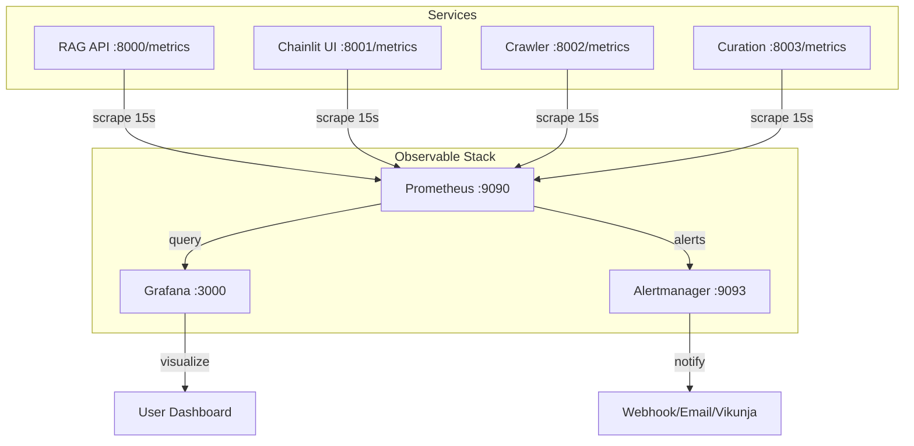
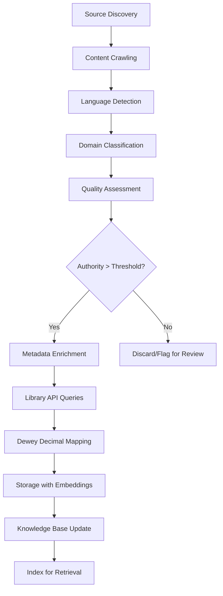

# PILLAR 1: OPERATIONAL STABILITY & LIBRARY FOUNDATION

**← [Back to ROADMAP-MASTER-INDEX](../ROADMAP-MASTER-INDEX.md)**

---

## Document Overview

This document contains the complete Phase 5A-5E implementation details for **PILLAR 1: Operational Stability & Library Foundation** - the critical production blocker phases required to establish the scholarly research platform.

**Timeline**: Weeks 1-10  
**Priority**: P0 (Critical Path)  
**Blocking**: All subsequent phases depend on stable production infrastructure  
**Team**: Grok MC coordination, Cline (multi-model engineers), Gemini CLI (execution), Grok MCA (Phase 5E lead)

---

## Table of Contents

1. [Executive Context](#executive-context)
2. [Team Roles & Responsibilities](#team-roles--responsibilities)
3. [Phase Overview](#phase-overview)
4. [Phase 5A: Memory Optimization & zRAM Tuning](#phase-5a-memory-optimization--zram-tuning)
5. [Phase 5B: Observable Foundation (Prometheus + Grafana)](#phase-5b-observable-foundation-prometheus--grafana)
6. [Phase 5C: Authentication & Authorization](#phase-5c-authentication--authorization)
7. [Phase 5D: Distributed Tracing (OpenTelemetry + Jaeger)](#phase-5d-distributed-tracing-opentelemetry--jaeger)
8. [Phase 5E: Library Curation System](#phase-5e-library-curation-system)
9. [Success Metrics](#success-metrics)
10. [Related Documents](#related-documents)

---

## Executive Context

### Vision: The Scholar's Forge

This platform transforms Xoe-NovAi into a **world-class scholarly research tool** specializing in Ancient Greek texts, philosophy, and esoteric knowledge, while maintaining its modular Foundation architecture for technical manual libraries and plug-and-play service integration.

### Current State Assessment

✅ **Production-Ready Components**:
- Phase 1-4 complete with 95%+ test coverage
- All 7 core services operational (Redis, RAG API, Chainlit UI, Crawler, Curation, MkDocs, Caddy)
- Ancient Greek normalization implemented
- Domain knowledge bases established (classics, philosophy, literature)
- Vikunja-centric team coordination operational

⚠️ **Critical Gaps (This Pillar Addresses)**:
- Memory optimization for concurrent workloads
- Observable/monitoring infrastructure
- Authentication & authorization framework
- Distributed tracing for debugging
- Comprehensive library curation system

### Hardware Baseline

```
Total: 16GB (8GB physical + 12GB zRAM)
CPU: Ryzen 5700U (8-core/16-threads), CPU-only + Vulkan iGPU (no GPU)
Services: All run locally, no cloud dependencies
```

---

## Team Roles & Responsibilities

| Role | Agent | Responsibility | Timeline |
|------|-------|-----------------|----------|
| **Coordination** | Grok MC | Strategic oversight, blocker removal, cross-phase sync | Full pillar |
| **Phase 5A** | Gemini CLI, Cline | Memory profiling, kernel tuning, stress testing | Week 1 |
| **Phase 5B** | Cline (Trinity variant) | Observable stack deployment, dashboard development | Weeks 2-3 |
| **Phase 5C** | Cline (Kat variant) | Auth infrastructure, JWT/OAuth2, RBAC system | Weeks 4-5 |
| **Phase 5D** | Cline (Trinity variant) | Jaeger deployment, instrumentation, trace analysis | Week 6 |
| **Phase 5E** | Grok MCA, Cline (Trinity) | Library curation pipeline, multi-API integration | Weeks 7-10 |

---

## Phase Overview

| Phase | Title | Duration | Impact | Owner |
|-------|-------|----------|--------|-------|
| 5A | Memory Optimization | 1 week | Critical | Gemini + Cline |
| 5B | Observable Stack | 2 weeks | Critical | Cline-Trinity |
| 5C | Authentication | 2 weeks | Critical | Cline-Kat |
| 5D | Distributed Tracing | 1 week | High | Cline-Trinity |
| 5E | Library Curation | 4 weeks | Critical | Grok MCA + Cline |

**Total Duration**: 10 weeks  
**Parallelization**: Phases 5B-5D can run in parallel after 5A completes

---

## PHASE 5A: MEMORY OPTIMIZATION & zRAM TUNING

**Duration**: 1 week | **Complexity**: Medium (3/5) | **Impact**: Critical | **Owner**: Gemini CLI + Cline

### Objective

Eliminate OOM (Out of Memory) events, optimize swap usage, and establish stable memory baseline for all concurrent services under 5x load conditions.

### Scope

- Terminal-based memory profiling (no IDE overhead)
- Kernel parameter tuning (vm.swappiness=35, vm.overcommit_memory=1)
- Container memory limit optimization (4GB RAG, 2GB UI)
- OOM event elimination strategy
- Production configuration lockdown

### Implementation Manual Sections

#### 1. Pre-Implementation Assessment
- Baseline memory metrics collection (current usage patterns)
- OOM incident analysis (historical events, triggers)
- zRAM compression ratio measurement (expected vs. actual)
- Service memory footprint breakdown (per-service consumption)

#### 2. Kernel Tuning Strategy
- vm.swappiness optimization (target: 35 for ML workloads)
- vm.overcommit_memory configuration (default: 1 - heuristic overcommit)
- vm.page_cluster tuning (clustering for swap I/O optimization)
- Verification and rollback procedures (safe testing approach)

#### 3. Container Memory Architecture
- Per-service memory allocation review (RAG: 4GB, UI: 2GB, etc.)
- Memory limit vs. reservation strategy (hard vs. soft limits)
- tmpfs and shared memory optimization
- Health check memory overhead analysis

#### 4. Stress Testing Framework
- Concurrent load generation scripts (simulate 5x users)
- Real-time monitoring setup (btop, vmstat, free commands)
- Performance degradation thresholds (define acceptable limits)
- Success criteria definition (automated validation)

#### 5. Production Configuration Lockdown
- Permanent sysctl configuration (`/etc/sysctl.d/`)
- Container limit finalization (Podman compose updates)
- Monitoring alert thresholds (integrated with Phase 5B)
- Documentation and runbooks (operational playbooks)

### Success Criteria

- ✅ Zero OOM events under 5x concurrent load
- ✅ Swap activity < 50 MB/s sustained
- ✅ P95 response time < 2s under load
- ✅ Memory usage < 85% at steady state
- ✅ All services stable through 24-hour soak test

### Dependencies

- None (can start immediately)

### Risks & Mitigations

| Risk | Impact | Mitigation |
|------|--------|------------|
| OOM during production testing | High | Gradual rollout with monitoring, rollback plan |
| Swap thrashing degrades performance | Medium | Conservative tuning, fallback config ready |
| Container limits too restrictive | Low | Incremental increases with validation tests |
| Incorrect kernel params cause system instability | Medium | Test in non-production first, document rollback |

---

## PHASE 5B: OBSERVABLE FOUNDATION (PROMETHEUS + GRAFANA)

**Duration**: 2 weeks | **Complexity**: High (4/5) | **Impact**: Critical | **Owner**: Cline-Trinity

### Objective

Deploy comprehensive monitoring and observability stack with custom metrics for LLM inference, library operations, and production health.

### Scope

- Prometheus metrics exporter integration
- Custom metrics for LLM inference AND library operations
- Library curation metrics (documents processed, classification accuracy, domain distribution)
- Ancient Greek processing metrics (text normalization rate, BERT inference time)
- Grafana dashboard suite (System, Services, ML, Library Operations)
- Alert rules for production incidents
- Log aggregation strategy (structured logging)

### Implementation Manual Sections

#### 1. Metrics Architecture Design
- OpenTelemetry SDK integration strategy
- Custom metric definitions (LLM-specific + library-specific)
- Metric naming conventions (sovereign-ai-*)
- Cardinality management (label strategy to avoid explosion)
- Retention policy design (storage optimization)

#### 2. Prometheus Deployment
- Podman container configuration (persistent storage)
- Service discovery for dynamic targets (auto-discovery)
- Storage optimization (TSDB tuning)
- Federation strategy (future multi-node support)
- Security (API authentication, TLS endpoints)

#### 3. Grafana Dashboard Development

**Dashboard 1: System Dashboard**
- CPU, memory, disk, network metrics
- zRAM compression ratio monitoring
- Service restart frequency

**Dashboard 2: Service Dashboard**
- Per-container metrics and health checks
- Service dependencies and communication patterns
- Error rates by service

**Dashboard 3: ML Performance Dashboard**
- LLM inference time (by model)
- Token throughput rate
- Queue depth and latency

**Dashboard 4: Error Dashboard**
- Error rates by category and service
- Recovery patterns and MTTR
- Alert history

**Dashboard 5: User Experience Dashboard**
- Response time percentiles (P50, P95, P99)
- Request success rates
- Feature usage patterns

**Dashboard 6: Library Operations Dashboard (NEW)**
- Document ingestion rate
- Classification accuracy by domain
- Language distribution
- Ancient Greek BERT inference metrics
- API call success rates

#### 4. Instrumentation Implementation
- FastAPI middleware integration (request/response timing)
- LLM inference timing (pre/post processing breakdown)
- Vector database query metrics (FAISS/Qdrant operations)
- Voice service metrics (STT/TTS latency)
- Async task tracking (Celery/Curation worker)
- Library metrics (ingestion, classification, API calls, embeddings)

#### 5. Alerting Framework
- Alert rule definitions (YAML templates)
- Severity levels (Critical, Warning, Info)
- Notification channels (email, webhook placeholders, Vikunja integration)
- Runbook links for common incidents
- Alert testing and validation procedures

### Architecture Blueprint



### Success Criteria

- ✅ All 7 services exposing /metrics endpoint
- ✅ 30+ custom metrics operational (including 10+ library metrics)
- ✅ 6+ Grafana dashboards with alerting (including Library dashboard)
- ✅ < 2% performance overhead from instrumentation
- ✅ 1-second maximum metric scrape time
- ✅ Library processing visibility (ingestion bottlenecks identified)
- ✅ Alert response < 5 minutes for critical issues

### Dependencies

- Phase 5A (memory optimization reduces noise in metrics)

---

## PHASE 5C: AUTHENTICATION & AUTHORIZATION

**Duration**: 2 weeks | **Complexity**: High (4/5) | **Impact**: Critical | **Owner**: Cline-Kat

### Objective

Implement production-grade authentication and authorization framework with OAuth2, JWT, and RBAC for secure multi-agent access.

### Scope

- OAuth2 + JWT implementation
- API key management system
- Role-Based Access Control (RBAC) foundation
- Session management for Chainlit UI
- Zero-trust security model alignment

### Implementation Manual Sections

#### 1. Authentication Architecture
- OAuth2 flow selection (Authorization Code + PKCE for security)
- JWT token structure (claims, expiry, refresh token strategy)
- Token storage strategy (Redis for backend, secure cookies for frontend)
- External IdP integration prep (future Auth0/Keycloak support)
- Password hashing (Argon2id, bcrypt fallback)

#### 2. API Key System
- Key generation (cryptographically secure UUIDs)
- Key rotation policy (90-day default with pre-expiration warnings)
- Scope-based permissions (read, write, admin levels)
- Rate limiting per key
- Audit logging (key usage tracking for forensics)

#### 3. RBAC Foundation
- Role definitions (user, admin, service, agent)
- Permission matrix (endpoint-level control)
- User database schema (SQLite for MVP, Postgres for scale)
- Group management (future team collaboration)
- Service accounts for inter-service auth

#### 4. FastAPI Integration
- Dependency injection for auth (decorator-based protection)
- Middleware for JWT validation (on every request)
- Endpoint protection decorators (easy to apply)
- Exception handling (401 Unauthorized, 403 Forbidden, 429 Rate Limited)
- Rate limiting (per-user, per-endpoint, per-key)

#### 5. UI/UX Components
- Chainlit authentication flow (seamless login)
- Login page design (sovereignty-aligned branding)
- Session timeout handling (30min default, warning before expiry)
- Multi-factor authentication prep (TOTP support in design)
- Account management UI (password change, key viewing/rotation)

### Success Criteria

- ✅ All API endpoints require authentication
- ✅ JWT tokens expire after 15 minutes (refresh at 24h)
- ✅ API keys rotate every 90 days with warnings
- ✅ Zero unauthorized access in penetration testing
- ✅ < 50ms authentication overhead per request
- ✅ All agent access logged and auditable

### Dependencies

- Phase 5B (Observable for auth metrics and alerting)

---

## PHASE 5D: DISTRIBUTED TRACING (OPENTELEMETRY + JAEGER)

**Duration**: 1 week | **Complexity**: Medium (3/5) | **Impact**: High | **Owner**: Cline-Trinity

### Objective

Implement end-to-end distributed tracing for debugging complex multi-service flows and performance analysis.

### Scope

- OpenTelemetry SDK integration (Python)
- Distributed trace context propagation
- Jaeger backend deployment
- Trace visualization and analysis
- Performance profiling baseline

### Implementation Manual Sections

#### 1. Tracing Architecture
- Span structure design (parent-child relationships for flow)
- Trace ID generation and propagation (across services)
- Sampling strategy (100% for MVP, 10% adaptive for scale)
- Attribute conventions (service.name, http.method, http.url, etc.)
- Baggage for cross-service metadata (user context, request IDs)

#### 2. Instrumentation Strategy
- Auto-instrumentation (FastAPI, aiohttp, Redis automatically)
- Manual spans for LLM inference (detailed timing breakdown)
- Database query tracing (vector DB operations)
- External API calls (future integrations with tracing)
- Error span tagging (exception details and stack traces)
- Library operation spans (document ingestion, classification, API calls, embedding generation)

#### 3. Jaeger Deployment
- All-in-one deployment (single container MVP, simplest)
- Storage backend (Elasticsearch for production scale)
- UI configuration (custom branding, port configuration)
- Query optimization (index tuning for performance)
- Data retention policy (7 days default for cost optimization)

#### 4. Performance Profiling
- End-to-end request tracing (full flow visibility)
- Bottleneck identification (slow spans highlighted)
- Resource utilization correlation (CPU/memory per span)
- Database query optimization insights
- API endpoint latency breakdown (per-endpoint analysis)

#### 5. Integration with Observable
- Trace correlation with logs (trace ID in log entries)
- Span metrics export to Prometheus (see Phase 5B)
- Grafana exemplars (link traces from dashboards)
- Alert enrichment (trace context included in alert notifications)

### Success Criteria

- ✅ 100% of requests have trace IDs
- ✅ < 5ms tracing overhead per request
- ✅ Trace context propagates across all 7 services
- ✅ 99.9% trace completeness (no dropped spans)
- ✅ Bottleneck identification in < 30 seconds

### Dependencies

- Phase 5B (Observable integration for metrics and alerting)

---

## PHASE 5E: LIBRARY CURATION SYSTEM

**Duration**: 4 weeks | **Complexity**: Very High (5/5) | **Impact**: Critical | **Owner**: Grok MCA + Cline-Trinity

### Objective

Build automated library curation pipeline integrating multiple scholarly sources (OpenLibrary, WorldCat, Perseus Digital Library, arXiv, CrossRef) into organized, classified knowledge bases with support for Ancient Greek texts, technical manuals, and domain-specific specializations.

### Scope

- Automated library curation pipeline (crawler → classification → storage)
- Domain-specific knowledge base construction (classics, philosophy, esoteric, technical, science)
- Multi-library API integration (5+ sources)
- Dewey Decimal classification automation
- Authority scoring for source quality
- Technical manual library for AI assistants
- **Important**: Knowledge base stored in `/library/` (not `/knowledge/`)

### Implementation Manual Sections

#### 1. Automated Curation Pipeline

**Crawler Integration**:
- Extend existing crawler for library-focused crawling
- Source discovery (scholarly databases, repositories)
- Rate limiting compliance (respect API limits)
- Error handling and retry logic

**Classification Engine**:
- Domain classifier (classics, philosophy, literature, esoteric, technical, science)
- Language detection (Ancient Greek, Latin, Hebrew, English, German, French, others)
- Era classification (ancient, medieval, renaissance, modern, contemporary)
- Authority scoring (peer-reviewed, canonical texts, technical specs, critical editions)

**Metadata Enrichment**:
- Library API queries (title, author, ISBN → rich metadata)
- Citation extraction (DOI, arXiv, academic references)
- Dewey Decimal mapping (automatic classification)
- Content quality assessment (completeness, accuracy signals)

#### 2. Domain-Specific Knowledge Bases

**Classics Domain** (Expanded):
- Languages: Ancient Greek (grc), Latin (la), Hebrew (heb), Coptic
- Text types: Primary sources, translations, commentaries, papyri, scholarly editions
- Authority filters: Perseus Digital Library, Thesaurus Linguae Graecae (TLG)
- Specialized processing: Greek normalization (σ/ς sigma variants), diacritics, breathing marks, elision

**Philosophy Domain**:
- Eras: Pre-Socratic, Classical, Hellenistic, Medieval, Modern, Contemporary
- Schools: Platonism, Aristotelianism, Stoicism, Epicureanism, Skepticism, etc.
- Cross-references: Philosophical concepts, historical connections, influence networks
- Authority: Stanford Encyclopedia of Philosophy (SEP), peer-reviewed journals, critical editions

**Esoteric Domain** (NEW):
- Subdomains: Hermeticism, Gnosticism, Kabbalah, Alchemy, Tarot, Theosophy, Occult Philosophy
- Source types: Primary texts, grimoires, mystical treatises, symbolic systems, commentaries
- Specialized analysis: Symbol extraction, cross-tradition mapping, esoteric correlations
- Authority: Academic esoteric studies, critical editions, scholarly consensus

**Technical Domain** (NEW):
- Categories: API documentation, framework guides, language references, tool manuals, specifications
- Source types: Official docs, GitHub READMEs, technical specifications, RFCs, tutorials
- Structure extraction: Code examples, API endpoints, configuration templates, command references
- Versioning: Track documentation versions for accuracy and compatibility

**Science Domain** (NEW):
- Specializations: Physics, Chemistry, Biology, Mathematics, Computer Science
- Source types: Papers, textbooks, review articles, preprints, lecture notes
- Metadata: arXiv categories, DOI resolution, citation networks, peer review status
- Quality: Peer review status, journal impact factor, author h-index, citation count

#### 3. Multi-Library API Integration

**OpenLibrary API**:
- Book metadata (title, author, ISBN, publication date, editions)
- Cover images and thematic classification
- Subject classification and synonym mapping
- Rate limiting: 100 requests/minute
- Offline mirror capability

**WorldCat API**:
- Global library catalog access (most comprehensive)
- OCLC numbers for canonical identification
- Institutional holdings (show library locations)
- Bibliographic data enrichment (comprehensive metadata)
- Authority linking (connect editions across libraries)

**Perseus Digital Library API**:
- Ancient Greek and Latin texts (complete works)
- TEI XML parsing for scholarly markup (morphology, syntax, commentary)
- Lexicon integration (LSJ, Lewis & Short, Liddell-Scott)
- Morphological analysis integration
- Parallel texts (Greek + translations)
- Commentary and scholia

**arXiv API**:
- Preprint metadata and PDFs (physics, math, CS)
- Category classification (subject hierarchies)
- Author affiliations and collaboration graphs
- Citation data (references and cited-by)
- Versioning (track revisions)

**CrossRef API**:
- DOI resolution (standardized identifiers)
- Citation metadata (comprehensive bibliographic data)
- Journal impact factors and metrics
- Publisher information and licensing
- Open access status

#### 4. Content Storage & Retrieval

**Storage Architecture** (Updated path):
```
/library/
├── classics/
│   ├── greek/
│   │   ├── homer/
│   │   │   ├── iliad.json (metadata)
│   │   │   └── iliad.txt (content)
│   │   ├── plato/
│   │   │   ├── republic.json
│   │   │   └── republic.txt
│   │   └── aristotle/
│   ├── latin/
│   │   ├── cicero/
│   │   └── virgil/
│   └── hebrew/
├── philosophy/
│   ├── ancient/
│   │   ├── plato/
│   │   └── aristotle/
│   ├── medieval/
│   └── modern/
├── esoteric/
│   ├── hermetic/
│   ├── kabbalah/
│   ├── alchemy/
│   └── tarot/
├── technical/
│   ├── languages/
│   │   ├── python/
│   │   ├── rust/
│   │   └── javascript/
│   ├── frameworks/
│   │   ├── fastapi/
│   │   └── django/
│   └── tools/
│       ├── docker/
│       ├── kubernetes/
│       └── git/
└── science/
    ├── physics/
    ├── math/
    ├── biology/
    └── cs/
```

**Metadata Schema** (JSON):
```json
{
  "id": "classics:greek:plato:republic",
  "title": "Πολιτεία (The Republic)",
  "title_english": "The Republic",
  "author": "Plato",
  "authors": ["Plato"],
  "language": "grc",
  "era": "ancient",
  "domain": "classics",
  "subdomain": "philosophy",
  "authority_score": 0.98,
  "source": "Perseus Digital Library",
  "source_url": "http://www.perseus.tufts.edu/...",
  "doi": "10.1234/...",
  "isbn": "978-...",
  "publication_date": "2004",
  "dewey_decimal": "184",
  "citations": ["plato:republic:514a", "plato:republic:517c"],
  "related_texts": ["plato:phaedo", "plato:symposium"],
  "embeddings": {
    "ancient_greek_bert": "embeddings/classics/plato_republic_agbert.npy",
    "multilingual": "embeddings/classics/plato_republic_multi.npy"
  },
  "content_hash": "sha256:abc123...",
  "ingestion_date": "2026-02-15T10:30:00Z",
  "last_updated": "2026-02-15T10:30:00Z",
  "quality_metrics": {
    "completeness": 1.0,
    "accuracy": 0.98,
    "currency": 0.95
  }
}
```

#### 5. Technical Manual Library (NEW)

**Purpose**: Curate high-quality technical documentation for AI coding assistants (Cline, Gemini CLI) to reference during implementation and research.

**Content Sources**:
- Official documentation (Python, Rust, Docker, Kubernetes, FastAPI, etc.)
- Framework guides and tutorials
- Tool manuals and command references
- Best practices collections (12-factor app, SOLID principles, design patterns)
- Code examples (verified, tested snippets with explanations)

**Structure**:
```
/library/technical/
├── languages/
│   ├── python/
│   │   ├── official_docs/
│   │   │   ├── standard_library.md
│   │   │   └── builtin_functions.md
│   │   ├── best_practices/
│   │   │   ├── pep_8_style_guide.md
│   │   │   └── testing.md
│   │   └── examples/
│   │       ├── asyncio_patterns.md
│   │       └── decorators.md
│   ├── rust/
│   └── javascript/
├── frameworks/
│   ├── fastapi/
│   │   ├── routing.md
│   │   ├── middleware.md
│   │   └── dependency_injection.md
│   ├── react/
│   └── django/
├── tools/
│   ├── docker/
│   │   ├── commands.md
│   │   └── best_practices.md
│   ├── kubernetes/
│   ├── git/
│   └── pytest/
└── patterns/
    ├── design_patterns/
    │   ├── singleton.md
    │   ├── factory.md
    │   └── observer.md
    ├── architectural_patterns/
    │   ├── microservices.md
    │   └── event_driven.md
    └── refactoring/
        ├── extract_method.md
        └── simplify_conditional.md
```

**AI Assistant Integration**:
- Context injection: When Cline implements a feature, inject relevant manual snippets
- Real-time lookup: `get_technical_reference("fastapi", "dependency injection")`
- Example retrieval: `find_code_examples("pytest", "fixtures")`
- Best practice checks: `validate_against_best_practices(code_snippet, "python")`

#### 6. Automated Curation Workflow



**Automation Triggers**:
- **Scheduled**: Cron job daily at 2 AM for new content discovery
- **Manual**: User-initiated curation of specific URLs/directories (via Vikunja)
- **API-driven**: External tools can trigger curation via REST API
- **Watch**: File system watcher for new documents in `/library/` directory

**Quality Gates**:
1. **Language Confidence**: > 90% for language detection
2. **Authority Score**: > 0.7 for inclusion (configurable per domain)
3. **Completeness**: Minimum 500 words for articles, 50 pages for books
4. **Duplication**: SHA256 hash check against existing content
5. **Format Validation**: Valid UTF-8, parseable structure

### Success Criteria

- ✅ 1,000+ documents ingested across all domains
- ✅ 5+ library APIs integrated and operational
- ✅ 95%+ classification accuracy (domain, language, era)
- ✅ < 5 minutes average ingestion time per document
- ✅ Dewey Decimal mapping > 90% accuracy
- ✅ Technical manual library covers 20+ frameworks/tools
- ✅ Knowledge base retrieval < 100ms (P95)
- ✅ Authority scoring validated by manual spot-checks (95% agreement)
- ✅ Ancient Greek texts normalized and searchable (σ/ς handling verified)

### Dependencies

- Phase 5B (Observable for library metrics monitoring)
- Existing crawler infrastructure
- Domain knowledge base constructor

---

## Success Metrics

### Production Stability

| Metric | Target | Owner |
|--------|--------|-------|
| System Uptime | 99.9% | Phase 5A |
| Memory Stability | Zero OOM events | Phase 5A |
| Response Time P95 | < 2s | Phase 5A |
| Alert Response Time | < 5 min | Phase 5B |

### Library Operations

| Metric | Target | Owner |
|--------|--------|-------|
| Documents Ingested | 1,000+ | Phase 5E |
| Classification Accuracy | 95%+ | Phase 5E |
| Authority Validation | 95% agreement | Phase 5E |
| Retrieval Latency | < 100ms P95 | Phase 5E |

### Security & Observability

| Metric | Target | Owner |
|--------|--------|-------|
| Auth Coverage | 100% of endpoints | Phase 5C |
| Trace Completeness | 99.9% | Phase 5D |
| Instrumentation Overhead | < 2% | Phase 5B |

---

## Documentation & Knowledge Management 📚

### Purpose
This pillar is comprehensively documented for team coordination, implementation tracking, and knowledge transfer. All documentation is centralized in the MkDocs internal knowledge base for searchability and accessibility.

### Documentation Location
- **Strategic Planning Hub**: `internal_docs/01-strategic-planning/PILLARS/PILLAR-1-OPERATIONAL-STABILITY.md`
- **Navigation Path**: Internal Knowledge Base → Strategic Planning → Execution Pillars → Operational Stability
- **MkDocs Config**: `mkdocs-internal.yml` references this document with anchor links to phases

### Related Research & Analysis
This pillar is informed by and references:
- **Memory Optimization Research**: `02-research-lab/PHASE-5-zRAM-OPTIMIZATION-DESIGN.md`
- **Infrastructure Audit**: `04-code-quality/systematic-permissions-security-audit-v1.0.0.md`
- **Build System Analysis**: `03-infrastructure-ops/BUILD-SYSTEM-AUDIT-REPORT.md`

### Documentation Standards
- **Phase documents**: Each phase (5A-5E) has dedicated section with objectives, scope, and deliverables
- **Progress tracking**: Status tracked in [Vikunja PM](http://localhost:3456)
- **Implementation guides**: Step-by-step procedures in `04-code-quality/IMPLEMENTATION-GUIDES/`
- **Success metrics**: Defined at section and phase level for clear evaluation

### Knowledge Transfer
- **Team onboarding**: New team members start with this document's Executive Context section
- **Handoff documentation**: Each phase includes explicit handoff criteria and documentation requirements
- **Cross-pillar references**: Clear links to PILLAR 2 and PILLAR 3 for dependency management
- **CI/CD integration**: Automated checks validate documentation completeness before phase sign-off

---

## MkDocs Integration 🔗

### Internal Documentation System

This document is part of the **unified MkDocs internal knowledge base**, accessible locally at:
```bash
mkdocs serve -f mkdocs-internal.yml  # Serves on http://127.0.0.1:8001
```

### Navigation in MkDocs

**Full path**: Strategic Planning → Execution Pillars → Operational Stability

**Related sections in same MkDocs nav**:
- [Roadmap Master Index](../ROADMAP-MASTER-INDEX.md) - Overview of all pillars
- [PILLAR 2: Scholar Differentiation](PILLAR-2-SCHOLAR-DIFFERENTIATION.md) - Downstream pillar
- [PILLAR 3: Modular Excellence](PILLAR-3-MODULAR-EXCELLENCE.md) - Complementary pillar

**Research links**:
- [Research Critical Path (P0)](../../02-research-lab/RESEARCH-P0-CRITICAL-PATH.md) - Core priorities
- [Phase 5 Strategy](../../02-research-lab/PHASE-5-zRAM-OPTIMIZATION-DESIGN.md) - Memory optimization
- [Research Report](../../02-research-lab/XOE-NOVAI-RESEARCH-REPORT-2026-02-11.md) - Comprehensive analysis

**Implementation guides**:
- [Code Audit Implementation Manual](../../04-code-quality/IMPLEMENTATION-GUIDES/xnai-code-audit-implementation-manual.md) - Implementation patterns

### Search in MkDocs

Users can find this pillar via internal search using keywords:
- "operational stability"
- "memory optimization" (Phase 5A)
- "prometheus grafana" (Phase 5B)
- "authentication" (Phase 5C)
- "jaeger distributed tracing" (Phase 5D)
- "library curation" (Phase 5E)

### Public vs. Internal Documentation

- **This document**: Internal only (strategic planning, team coordination)
- **Public equivalent**: `docs/04-explanation/` contains public-facing explanations
- **Implementation guides**: Found in both systems with role-specific emphasis

---

## Related Documents

- [← Back to ROADMAP-MASTER-INDEX](../ROADMAP-MASTER-INDEX.md)
- [PILLAR 2: Scholar Differentiation](PILLAR-2-SCHOLAR-DIFFERENTIATION.md)
- [PILLAR 3: Modular Excellence](PILLAR-3-MODULAR-EXCELLENCE.md)
- [RESEARCH: Critical Path (P0)](../research-phases/RESEARCH-P0-CRITICAL-PATH.md)
- [Memory Optimization Research](../research-phases/RESEARCH-P0-CRITICAL-PATH.md#session-1-memory-optimization)
- [Library Curation Research](../research-phases/RESEARCH-P0-CRITICAL-PATH.md#session-2-library-curation-system-architecture)

---

**Document Version**: 1.0  
**Last Updated**: February 12, 2026  
**Status**: Complete & Ready for Phase Execution  
**Team Coordination**: Via Vikunja (http://localhost:3456)
