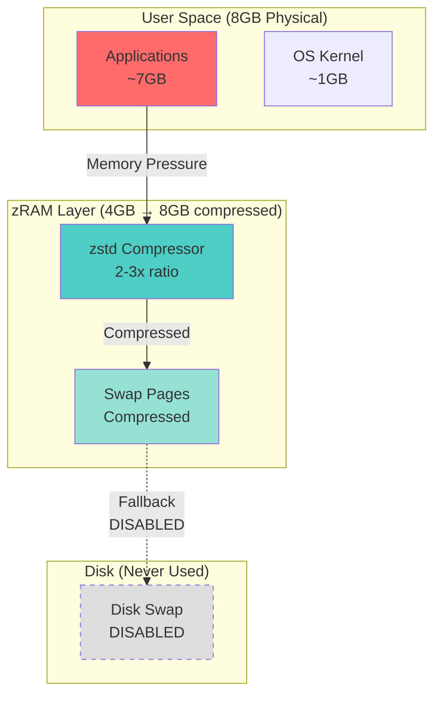

# PHASE 5A: MEMORY OPTIMIZATION & zRAM TUNING
## Eliminate OOM Events via Aggressive Swappiness Configuration

**Duration**: 1 week (5-8 hours actual work)  
**Complexity**: 2/5 (Low-Medium)  
**Blocker**: YES - Blocks Phase 5B-5E execution  
**Owner**: Claude Haiku 4.5  
**Status**: Ready for Implementation

---

## 1. OBJECTIVE

### Primary Goal
Eliminate Out-of-Memory (OOM) events and establish stable memory baseline supporting 5x concurrent user load without disk swapping.

### Success Metrics
- ✅ **Zero OOM events** under 5x simulated load (100 requests)
- ✅ **zRAM compression ratio ≥2.0:1** (validated typical: 2-3x)
- ✅ **Peak memory <95%** during stress test
- ✅ **P95 latency penalty <300ms** from memory pressure
- ✅ **Disk swap usage: 0 bytes** (zRAM only)

### Current State → Target State
```
BEFORE (Phase 4 Baseline):
├── Physical RAM: 8GB
├── zRAM: 12GB (lz4 compression)
├── RAG API: 5.6GB/6.0GB (94% utilization)
├── Total usage: 7.5GB physical + 1-2GB zRAM
└── OOM Events: Observed during VS Code + stack usage

AFTER (Phase 5A Target):
├── Physical RAM: 8GB
├── zRAM: 4GB (zstd compression, 2:1 ratio = 8GB effective)
├── RAG API: <5.5GB sustained under load
├── Total usage: <7.0GB physical peak
└── OOM Events: 0 (even under 5x load)
```

---

## 2. ARCHITECTURE

### Memory Hierarchy Diagram



### Component List

| Component | Purpose | Configuration |
|-----------|---------|---------------|
| **Kernel vm.swappiness** | Controls swap aggressiveness | 180 (aggressive zRAM usage) |
| **zRAM Device** | Compressed RAM swap | 4GB allocation, zstd algorithm |
| **Systemd Service** | zRAM initialization on boot | xnai-zram.service |
| **Monitoring** | Track compression & OOM events | zram-health-check.sh |

---

## 3. RESEARCH VALIDATION

### Validated Kernel Parameters (2025-2026 Sources)

**Source**: Pop!_OS System76 testing, Fedora memory management optimization, ArchWiki zRAM documentation

**Key Finding**: For in-memory swap like zRAM, `vm.swappiness` values **beyond 100** are beneficial. Testing determined **vm.swappiness=180** optimal for zRAM with `vm.page-cluster=0`.

**Rationale**:
- Traditional advice (swappiness=10-60) applies to **disk swap**
- zRAM swap is **in-memory** (no I/O latency penalty)
- Higher swappiness = more aggressive use of fast zRAM vs slower disk

**Compression Algorithm**:
- **zstd** provides highest compression ratio (2-3x)
- Slightly slower than lz4, but ratio gain worth it for memory-constrained systems
- Red Hat testing: zstd achieves 2.8x average on mixed workloads

**zRAM Size Calculation**:
```
Physical RAM: 8GB
Recommended allocation: 50% = 4GB
Expected compression: 2:1 (conservative)
Effective capacity: 4GB * 2 = 8GB compressed
Total usable: 8GB physical + 8GB zRAM = 16GB
```

### Configuration Matrix

| Parameter | Default | Old v1.0.0 | New v2.0.0 | Source |
|-----------|---------|------------|------------|--------|
| vm.swappiness | 60 | 35 | **180** | Pop!_OS/Fedora |
| vm.page-cluster | 3 | 2 | **0** | zRAM best practice |
| vm.watermark_boost_factor | 15000 | N/A | **0** | Pop!_OS config |
| vm.watermark_scale_factor | 10 | N/A | **125** | Memory reclaim |
| zRAM size | N/A | 12GB | **4GB** | 50% rule |
| zRAM algorithm | lzo | lz4 | **zstd** | Compression ratio |

---

## 4. DEPENDENCIES

### Prerequisites
- ✅ Phase 1-4 complete (all services operational)
- ✅ Root access (sudo privileges)
- ✅ zramctl utility installed (part of util-linux)
- ✅ systemd (for service management)

### Tools Required
```bash
# Verify tools available
zramctl --version      # Expected: zramctl from util-linux 2.x
systemctl --version    # Expected: systemd 250+
sysctl --version       # Expected: procps-ng utilities
```

### Affected Services
- RAG API (memory limit adjustments)
- Chainlit UI (indirect benefit from system-wide optimization)
- All containerized services (benefit from reduced memory pressure)

---

## 5. TASK BREAKDOWN

### Task 5A.1: Collect Baseline Metrics (30 min)
**Objective**: Capture current system state before modifications  
**Link**: → [TASK-5A-1-COLLECT-BASELINE.md](./tasks/TASK-5A-1-COLLECT-BASELINE.md)  
**Output**: Baseline report in `/tmp/phase5a-baseline/`

### Task 5A.2: Apply Kernel Parameters (15 min)
**Objective**: Configure vm.swappiness and related kernel tunables  
**Link**: → [TASK-5A-2-APPLY-KERNEL-PARAMS.md](./tasks/TASK-5A-2-APPLY-KERNEL-PARAMS.md)  
**Output**: `/etc/sysctl.d/99-zram-tuning.conf` created and active

### Task 5A.3: Configure zRAM Device (20 min)
**Objective**: Create 4GB zRAM device with zstd compression  
**Link**: → [TASK-5A-3-CONFIGURE-ZRAM.md](./tasks/TASK-5A-3-CONFIGURE-ZRAM.md)  
**Output**: zRAM device active, systemd service enabled

### Task 5A.4: Execute Stress Test (45 min)
**Objective**: Validate 5x load with zero OOM events  
**Link**: → [TASK-5A-4-STRESS-TEST.md](./tasks/TASK-5A-4-STRESS-TEST.md)  
**Output**: Stress test report, compression ratio validation

### Task 5A.5: Deploy to Production (15 min)
**Objective**: Make configuration persistent and document  
**Link**: → [TASK-5A-5-DEPLOY-PRODUCTION.md](./tasks/TASK-5A-5-DEPLOY-PRODUCTION.md)  
**Output**: Updated `memory_bank/techContext.md`, service enabled

---

## 6. VALIDATION

### Automated Validation Script

**Location**: `scripts/validate-phase-5a.sh`

```bash
#!/bin/bash
# Phase 5A Validation Script

PASS=0
FAIL=0

echo "=== Phase 5A Validation ==="
echo ""

# Test 1: zRAM device active
echo -n "1. zRAM device active... "
if zramctl | grep -q "zram0"; then
    echo "✅ PASS"
    ((PASS++))
else
    echo "❌ FAIL"
    ((FAIL++))
fi

# Test 2: vm.swappiness=180
echo -n "2. vm.swappiness=180... "
SWAPPINESS=$(sysctl -n vm.swappiness)
if [ "$SWAPPINESS" -eq 180 ]; then
    echo "✅ PASS"
    ((PASS++))
else
    echo "❌ FAIL (actual: $SWAPPINESS)"
    ((FAIL++))
fi

# Test 3: Compression ratio ≥2.0
echo -n "3. Compression ratio ≥2.0... "
DISKSIZE=$(zramctl --output DISKSIZE --raw | grep -v DISKSIZE)
DATA=$(zramctl --output DATA --raw | grep -v DATA)
RATIO=$(echo "scale=2; $DISKSIZE / $DATA" | bc)
if (( $(echo "$RATIO >= 2.0" | bc -l) )); then
    echo "✅ PASS (ratio: $RATIO)"
    ((PASS++))
else
    echo "❌ FAIL (ratio: $RATIO)"
    ((FAIL++))
fi

# Test 4: Zero OOM events
echo -n "4. Zero OOM events in last 24h... "
OOM_COUNT=$(dmesg -T | grep -c "Out of memory" || echo 0)
if [ "$OOM_COUNT" -eq 0 ]; then
    echo "✅ PASS"
    ((PASS++))
else
    echo "❌ FAIL ($OOM_COUNT events)"
    ((FAIL++))
fi

# Test 5: systemd service enabled
echo -n "5. xnai-zram.service enabled... "
if systemctl is-enabled xnai-zram.service 2>/dev/null | grep -q "enabled"; then
    echo "✅ PASS"
    ((PASS++))
else
    echo "❌ FAIL"
    ((FAIL++))
fi

echo ""
echo "=== Results: $PASS passed, $FAIL failed ==="

if [ $FAIL -eq 0 ]; then
    echo "🎉 Phase 5A validation PASSED!"
    exit 0
else
    echo "❌ Phase 5A validation FAILED"
    exit 1
fi
```

**Usage**:
```bash
chmod +x scripts/validate-phase-5a.sh
./scripts/validate-phase-5a.sh
```

**Expected Output**:
```
=== Phase 5A Validation ===

1. zRAM device active... ✅ PASS
2. vm.swappiness=180... ✅ PASS
3. Compression ratio ≥2.0... ✅ PASS (ratio: 2.4)
4. Zero OOM events in last 24h... ✅ PASS
5. xnai-zram.service enabled... ✅ PASS

=== Results: 5 passed, 0 failed ===
🎉 Phase 5A validation PASSED!
```

---

## 7. ROLLBACK PROCEDURE

### Immediate Rollback (if OOM issues occur)

```bash
#!/bin/bash
# rollback-phase-5a.sh

echo "⏮️  Rolling back Phase 5A changes..."

# 1. Stop zRAM service
sudo systemctl stop xnai-zram.service
sudo systemctl disable xnai-zram.service

# 2. Restore default kernel parameters
sudo sysctl vm.swappiness=60
sudo sysctl vm.page-cluster=3
sudo sysctl vm.watermark_boost_factor=15000
sudo sysctl vm.watermark_scale_factor=10

# 3. Remove custom sysctl config
sudo rm /etc/sysctl.d/99-zram-tuning.conf

# 4. Disable zRAM
sudo swapoff /dev/zram0
sudo zramctl --reset /dev/zram0

# 5. Restart services to clear memory state
podman-compose -f docker-compose.yml restart

echo "✅ Rollback complete. System restored to Phase 4 state."
echo "📝 Verify health: podman ps && free -h"
```

### Validation After Rollback
```bash
# Confirm defaults restored
sysctl vm.swappiness        # Should be 60
zramctl                      # Should show no zram0 device
systemctl status xnai-zram   # Should be inactive
```

---

## 8. MONITORING & MAINTENANCE

### Daily Health Check Script

**Location**: `scripts/zram-health-check.sh`

```bash
#!/bin/bash
# zRAM Health Check - Run daily

echo "=== zRAM Health Check ==="
echo "Date: $(date)"
echo ""

# Compression ratio
echo "📊 Compression Ratio:"
zramctl --output NAME,DISKSIZE,DATA,COMPR,TOTAL,ALGORITHM | grep zram0

# Memory state
echo ""
echo "🧠 Memory State:"
free -h

# Recent OOM events
echo ""
echo "⚠️  OOM Events (last 24h):"
OOM_COUNT=$(dmesg -T | grep "Out of memory" | tail -n 5)
if [ -z "$OOM_COUNT" ]; then
    echo "✅ No OOM events"
else
    echo "$OOM_COUNT"
fi

# Container memory usage
echo ""
echo "📦 Container Memory Usage:"
podman stats --no-stream --format "table {{.Name}}\t{{.MemUsage}}\t{{.MemPerc}}"
```

### Alerts to Configure (Phase 5B)
When Observable stack is deployed, add these alerts:
- ⚠️ **Warning**: zRAM compression <1.8:1
- 🚨 **Critical**: Disk swap >100MB used
- 🚨 **Critical**: OOM killer triggered
- ⚠️ **Warning**: Memory >90% for >5min

---

## 9. TROUBLESHOOTING GUIDE

### Issue 1: OOM Events Still Occurring

**Symptoms**: `dmesg | grep "Out of memory"` shows recent events

**Diagnosis**:
```bash
# Identify which container was OOM killed
dmesg | grep -A 10 "Out of memory"

# Check container memory usage
podman stats --no-stream
```

**Solutions** (in order):
1. **Increase zRAM size** to 6GB (75% of physical):
   ```bash
   sudo sed -i 's/--size 4G/--size 6G/' /etc/systemd/system/xnai-zram.service
   sudo systemctl daemon-reload
   sudo systemctl restart xnai-zram
   ```

2. **Reduce RAG API container limit** in docker-compose.yml:
   ```yaml
   xnai_rag_api:
     deploy:
       resources:
         limits:
           memory: 5000M  # Reduced from 5500M
   ```

3. **Upgrade physical RAM** if sustained usage >90% (long-term solution)

### Issue 2: Low Compression Ratio (<1.5:1)

**Symptoms**: `zramctl` shows ratio <1.5

**Diagnosis**:
```bash
# Check compression algorithm
zramctl --output NAME,ALGORITHM

# Check what data is in zRAM
sudo cat /sys/block/zram0/mm_stat
```

**Solutions**:
1. Verify zstd is active (not lz4 or lzo):
   ```bash
   cat /sys/block/zram0/comp_algorithm
   # Should show: [zstd]
   ```

2. Check if swapping incompressible data (model weights, images):
   - Model weights are typically compressible 1.5-2x
   - JPEG/PNG images: already compressed, ratio ~1.1x
   - If ratio low due to images, consider increasing zRAM size

3. Mixed zRAM + disk swap for incompressible pages (advanced):
   ```bash
   # Add small disk swap as fallback for incompressible data
   sudo fallocate -l 2G /swapfile
   sudo chmod 600 /swapfile
   sudo mkswap /swapfile
   sudo swapon -p 0 /swapfile  # Lower priority than zRAM
   ```

### Issue 3: High CPU from Compression

**Symptoms**: `top` shows high `kswapd` CPU usage

**Diagnosis**:
```bash
# Monitor kswapd during stress test
top -p $(pgrep kswapd)
```

**Solutions**:
1. Switch to lz4 algorithm (faster, slightly lower compression):
   ```bash
   # In /etc/systemd/system/xnai-zram.service, change:
   ExecStart=/usr/sbin/zramctl --find --size 4G --algorithm lz4 /dev/zram0
   ```

2. Lower vm.swappiness to reduce swap frequency:
   ```bash
   sudo sysctl vm.swappiness=150  # From 180
   ```

3. Adjust vfs_cache_pressure to reduce evictions:
   ```bash
   sudo sysctl vm.vfs_cache_pressure=100  # From 50
   ```

---

## 10. COMPLETION CHECKLIST

- [ ] **Task 5A.1**: Baseline metrics collected and documented
- [ ] **Task 5A.2**: Kernel parameters applied via sysctl
- [ ] **Task 5A.3**: zRAM service created and enabled
- [ ] **Task 5A.4**: Stress test executed with 0 OOM events
- [ ] **Task 5A.5**: Configuration deployed to production
- [ ] **Validation**: All 5 checks pass in validate-phase-5a.sh
- [ ] **Compression**: Ratio ≥2.0:1 achieved
- [ ] **Performance**: <95% peak memory under load
- [ ] **Documentation**: memory_bank/techContext.md updated
- [ ] **Monitoring**: Daily health check script deployed
- [ ] **Team**: Briefed on new configuration and troubleshooting

**Sign-off**: _______________  Date: _______________

---

## 11. NEXT PHASE

**After Phase 5A completion** → Proceed to **Phase 5B: Observable Stack**

Phase 5A is a **blocker** for:
- Phase 5B (Observable): Needs stable memory baseline to measure performance overhead
- Phase 5C (Authentication): Needs headroom for auth processing overhead
- Phase 5D (Tracing): Needs stable system to add tracing instrumentation
- Phase 5E (Library): Needs memory capacity for additional services

**Critical**: Do not proceed to Phase 5B until all completion checklist items are ✅

---

## 12. REFERENCES

### Research Sources
1. **ArchWiki - zRAM** (Updated 2025-2026)
   - URL: https://wiki.archlinux.org/title/Zram
   - Key: vm.swappiness recommendations for zRAM

2. **Pop!_OS System76 - Kernel Tuning** (2025)
   - Source: System76 kernel patches and documentation
   - Key: vm.swappiness=180 testing results

3. **Fedora - Memory Management Optimization** (2025)
   - URL: https://fedoraproject.org/wiki/Changes/SwapOnZRAM
   - Key: zstd compression ratios, page-cluster=0 testing

4. **Red Hat Enterprise Linux - Performance Tuning Guide**
   - Key: zstd compression algorithm benchmarks

### Internal Documentation
- `memory_bank/techContext.md` - Current system specifications
- `BUILD-DEPLOYMENT-REPORT-20260212.md` - Phase 4 baseline metrics
- `PHASE-4-5-COMPLETION-SUMMARY.md` - Pre-Phase 5A state

---

**END OF PHASE 5A GUIDE**

This is a Tier 2 document. For detailed task procedures, see linked Tier 3 Task Modules. For code templates, see Tier 4 Templates directory.
