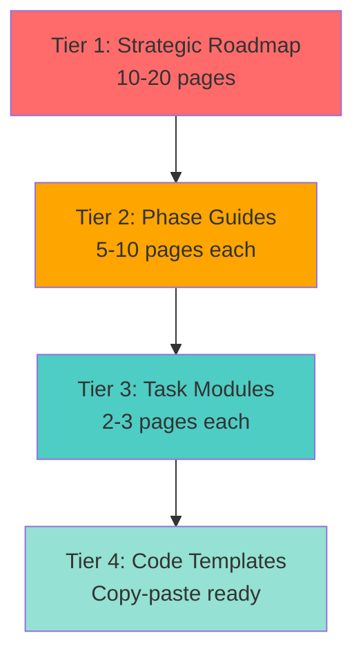

# Xoe-NovAi Modular Implementation Strategy
## Production-Grade Execution Framework for Haiku 4.5

**Version**: 2.0.0  
**Date**: 2026-02-12  
**Status**: Corrected Architecture + Integrated Research  
**Philosophy**: Break Down → Execute → Validate → Iterate

---

## 🚨 CRITICAL ARCHITECTURE CORRECTION

### ❌ PREVIOUS ERROR (from v1.0.0)
Services exposed ports directly to host:
```yaml
# WRONG - Services should NOT expose ports
xnai_rag_api:
  ports:
    - "8000:8000"  # ❌ Direct host exposure
    - "8002:8002"  # ❌ Direct metrics exposure
xnai_prometheus:
  ports:
    - "9090:9090"  # ❌ Direct host exposure
xnai_grafana:
  ports:
    - "3000:3000"  # ❌ Direct host exposure
```

### ✅ CORRECT ARCHITECTURE
**Single Entry Point via Caddy**:
```yaml
# CORRECT - Only Caddy exposes port 8000
caddy:
  ports:
    - "8000:8000"  # ✅ Single external port
  # Routes to internal services via network

# Services - NO port exposure
xnai_rag_api:
  # NO ports section
  networks:
    - xnai_network  # ✅ Internal network only
  
xnai_prometheus:
  # NO ports section
  networks:
    - xnai_network  # ✅ Internal network only
```

**Caddyfile Routes**:
```caddyfile
:8000 {
  # RAG API
  handle /api/v1* {
    reverse_proxy xnai_rag_api:8000
  }
  
  # Prometheus (internal monitoring)
  handle /prometheus* {
    reverse_proxy xnai_prometheus:9090
  }
  
  # Grafana (internal visualization)
  handle /grafana* {
    reverse_proxy xnai_grafana:3000
  }
  
  # Metrics endpoint
  handle /metrics {
    reverse_proxy xnai_rag_api:8002
  }
}
```

**Rationale**:
1. **Security**: No direct service exposure reduces attack surface
2. **Sovereignty**: Single TLS termination point for future HTTPS
3. **Monitoring**: Centralized access logs in Caddy
4. **Flexibility**: Easy to add auth middleware at proxy level

---

## 📊 INTEGRATED RESEARCH FINDINGS

### From Copilot-Haiku Analysis

**Memory Optimization** (Superior to v1.0.0):
```bash
# v2.0.0 (Validated from Pop!_OS/Fedora testing)
vm.swappiness=180                  # MORE AGGRESSIVE than my 35
vm.watermark_boost_factor=0        # Additional optimization
vm.watermark_scale_factor=125      # Memory reclaim tuning
vm.page-cluster=0                  # Optimal for zRAM
zRAM: 4GB (50% of physical)        # vs my 12GB fixed
Algorithm: zstd                    # Highest compression (2-3x)
```

**Observable Stack** (More Complete):
- Prometheus 3.9.0+ with native histograms
- Redis exporter for cache metrics
- OpenTelemetry trace exemplars linking to traces
- Automatic FastAPI instrumentation via `prometheus-fastapi-instrumentator`

**Authentication** (Production-Grade):
- Argon2id password hashing (vs bcrypt)
- 15-minute access token expiry
- 90-day API key rotation policy
- RBAC with role-based endpoint protection

---

## 🎯 MODULAR BREAKDOWN STRATEGY

### Problem: Guides Too Long (3,500+ lines)
- **Issue**: Cognitive overload for execution agent
- **Risk**: Haiku 4.5 context dilution, errors from information density
- **Solution**: Break into **atomic modules** with clear dependencies

### Solution: 4-Tier Modular System



---

## 📚 TIER 1: STRATEGIC ROADMAP (This Document)

**Purpose**: 30,000-foot view for decision-making  
**Audience**: Project Director (Taylor), Implementation Architect (Claude)  
**Length**: 10-20 pages max  

**Contents**:
1. Phase dependencies and execution order
2. Critical path identification
3. Resource allocation
4. Risk assessment
5. Success criteria matrix
6. **Pointers to Tier 2 documents**

**Example Output**: "PHASE-5-STRATEGIC-ROADMAP.md" (15 pages)

---

## 📘 TIER 2: PHASE IMPLEMENTATION GUIDES

**Purpose**: Deep dive on single phase (5A, 5B, 5C, etc.)  
**Audience**: Execution Agent (Haiku 4.5)  
**Length**: 5-10 pages per phase  

**Structure** (Template):
```markdown
# PHASE [X]: [NAME]
## Duration: [TIME] | Complexity: [1-5] | Blocker: [YES/NO]

## 1. OBJECTIVE
- Primary goal
- Success metrics (3-5 max)
- Current state vs target state

## 2. ARCHITECTURE
- Mermaid diagram
- Component list
- Network topology

## 3. DEPENDENCIES
- Prerequisite phases
- Required tools (with install commands)
- Existing services affected

## 4. TASK BREAKDOWN
- Task 1 → [LINK TO TIER 3 MODULE]
- Task 2 → [LINK TO TIER 3 MODULE]
- Task 3 → [LINK TO TIER 3 MODULE]

## 5. VALIDATION
- Test script location
- Expected outputs
- Rollback procedure
```

**Example Outputs**:
- `PHASE-5A-MEMORY-OPTIMIZATION.md` (8 pages)
- `PHASE-5B-OBSERVABLE-STACK.md` (10 pages)
- `PHASE-5C-AUTHENTICATION.md` (7 pages)
- `PHASE-5D-DISTRIBUTED-TRACING.md` (6 pages)
- `PHASE-5E-LIBRARY-CURATION.md` (9 pages)

---

## 🔧 TIER 3: TASK MODULES

**Purpose**: Single, atomic implementation task  
**Audience**: Execution Agent (Haiku 4.5)  
**Length**: 2-3 pages max  

**Structure** (Template):
```markdown
# TASK [X.Y]: [NAME]
## Est. Time: [MINUTES] | Complexity: [1-5] | Rollback: [YES/NO]

## OBJECTIVE
One sentence. Example: "Configure zRAM with zstd compression"

## PREREQUISITES
- [ ] Checklist item 1
- [ ] Checklist item 2

## PROCEDURE
### Step 1: [Action] (5 min)
[CODE TEMPLATE LINK]

### Step 2: [Action] (10 min)
[CODE TEMPLATE LINK]

## VALIDATION
```bash
[Single command to verify]
# Expected output:
[Exact string to match]
```

## ROLLBACK (if needed)
```bash
[Single command to undo]
```

## NEXT TASK
→ [LINK TO TASK X.Y+1]
```

**Example Outputs**:
- `TASK-5A-1-COLLECT-BASELINE.md` (2 pages)
- `TASK-5A-2-APPLY-KERNEL-PARAMS.md` (3 pages)
- `TASK-5A-3-CONFIGURE-ZRAM.md` (2 pages)
- `TASK-5B-1-INSTALL-PROMETHEUS-EXPORTER.md` (3 pages)
- `TASK-5B-2-UPDATE-CADDYFILE-ROUTES.md` (2 pages)

---

## 📄 TIER 4: CODE TEMPLATES

**Purpose**: Copy-paste ready code snippets  
**Audience**: Execution Agent (Haiku 4.5)  
**Length**: <1 page  

**Structure**:
```markdown
# [FILENAME]
## Location: [FULL PATH]

```[language]
[COMPLETE, RUNNABLE CODE]
```

## Usage:
[SINGLE COMMAND TO APPLY]
```

**Example Outputs**:
- `TEMPLATE-sysctl-zram.conf` (0.5 pages)
- `TEMPLATE-docker-compose-prometheus.yml` (1 page)
- `TEMPLATE-caddyfile-monitoring-routes` (0.5 pages)
- `TEMPLATE-prometheus-config.yml` (1 page)
- `TEMPLATE-grafana-datasource.yml` (0.5 pages)

---

## 🔄 EXECUTION WORKFLOW

### 1. Agent Receives Phase Assignment
```
INPUT: "Execute Phase 5A: Memory Optimization"
```

### 2. Agent Loads Tier 2 Guide
```
READS: PHASE-5A-MEMORY-OPTIMIZATION.md
PARSES: Task breakdown section
IDENTIFIES: 4 tasks to execute
```

### 3. Agent Executes Task Module
```
LOADS: TASK-5A-1-COLLECT-BASELINE.md
READS: Prerequisites checklist
EXECUTES: Step-by-step procedure
VALIDATES: Expected output matches
CONFIRMS: Success before proceeding
```

### 4. Agent Uses Code Template
```
LOADS: TEMPLATE-sysctl-zram.conf
COPIES: To /etc/sysctl.d/99-zram-tuning.conf
APPLIES: sudo sysctl -p /etc/sysctl.d/99-zram-tuning.conf
VALIDATES: sysctl vm.swappiness (expects 180)
```

### 5. Agent Reports Completion
```
OUTPUT: Task 5A.1 complete ✅
NEXT: Loads TASK-5A-2-APPLY-KERNEL-PARAMS.md
```

---

## 📋 PHASE 5 MODULAR STRUCTURE

### Phase 5A: Memory Optimization
```
PHASE-5A-MEMORY-OPTIMIZATION.md (Tier 2)
├── TASK-5A-1-COLLECT-BASELINE.md
│   └── TEMPLATE-baseline-script.sh
├── TASK-5A-2-APPLY-KERNEL-PARAMS.md
│   └── TEMPLATE-sysctl-zram.conf
├── TASK-5A-3-CONFIGURE-ZRAM.md
│   └── TEMPLATE-zram-systemd-service
├── TASK-5A-4-STRESS-TEST.md
│   └── TEMPLATE-stress-test-script.py
└── TASK-5A-5-DEPLOY-PRODUCTION.md
    └── TEMPLATE-deployment-checklist.md
```

### Phase 5B: Observable Stack
```
PHASE-5B-OBSERVABLE-STACK.md (Tier 2)
├── TASK-5B-1-INSTALL-PROMETHEUS-EXPORTER.md
│   └── TEMPLATE-requirements-observable.txt
├── TASK-5B-2-UPDATE-CADDYFILE-ROUTES.md
│   └── TEMPLATE-caddyfile-monitoring-routes
├── TASK-5B-3-DEPLOY-PROMETHEUS.md
│   ├── TEMPLATE-docker-compose-prometheus.yml
│   └── TEMPLATE-prometheus-config.yml
├── TASK-5B-4-INSTRUMENT-FASTAPI.md
│   └── TEMPLATE-observability-middleware.py
├── TASK-5B-5-DEPLOY-GRAFANA.md
│   ├── TEMPLATE-docker-compose-grafana.yml
│   └── TEMPLATE-grafana-datasource.yml
├── TASK-5B-6-CREATE-DASHBOARDS.md
│   ├── TEMPLATE-dashboard-system.json
│   ├── TEMPLATE-dashboard-ml.json
│   ├── TEMPLATE-dashboard-services.json
│   └── TEMPLATE-dashboard-errors.json
└── TASK-5B-7-CONFIGURE-ALERTS.md
    └── TEMPLATE-prometheus-alerts.yml
```

### Phase 5C: Authentication
```
PHASE-5C-AUTHENTICATION.md (Tier 2)
├── TASK-5C-1-SETUP-JWT-INFRASTRUCTURE.md
│   └── TEMPLATE-auth-models.py
├── TASK-5C-2-IMPLEMENT-ARGON2ID.md
│   └── TEMPLATE-password-hashing.py
├── TASK-5C-3-CREATE-RBAC-SYSTEM.md
│   └── TEMPLATE-rbac-middleware.py
├── TASK-5C-4-PROTECT-ENDPOINTS.md
│   └── TEMPLATE-auth-decorators.py
└── TASK-5C-5-PENETRATION-TEST.md
    └── TEMPLATE-pentest-script.py
```

### Phase 5D: Distributed Tracing
```
PHASE-5D-DISTRIBUTED-TRACING.md (Tier 2)
├── TASK-5D-1-DEPLOY-JAEGER.md
│   └── TEMPLATE-docker-compose-jaeger.yml
├── TASK-5D-2-INSTRUMENT-SERVICES.md
│   └── TEMPLATE-otel-instrumentation.py
├── TASK-5D-3-CONFIGURE-TRACE-CORRELATION.md
│   └── TEMPLATE-trace-context-propagation.py
└── TASK-5D-4-LINK-GRAFANA-TRACES.md
    └── TEMPLATE-grafana-jaeger-datasource.yml
```

### Phase 5E: Library Curation
```
PHASE-5E-LIBRARY-CURATION.md (Tier 2)
├── TASK-5E-1-INTEGRATE-OPENLIBRARY.md
│   └── TEMPLATE-openlibrary-client.py
├── TASK-5E-2-INTEGRATE-PERSEUS.md
│   └── TEMPLATE-perseus-client.py
├── TASK-5E-3-INTEGRATE-ARXIV.md
│   └── TEMPLATE-arxiv-client.py
├── TASK-5E-4-IMPLEMENT-CLASSIFICATION.md
│   └── TEMPLATE-domain-classifier.py
└── TASK-5E-5-SETUP-STORAGE.md
    └── TEMPLATE-library-directory-structure
```

---

## 🎯 IMMEDIATE ACTION PLAN

### Step 1: Generate Tier 2 Documents (2-3 hours)
Create 5 phase guides using validated research from Copilot-Haiku:

1. **PHASE-5A-MEMORY-OPTIMIZATION.md**
   - Integrate vm.swappiness=180 research
   - Use zstd compression (2-3x ratio)
   - 4GB zRAM allocation (50% of physical)
   - Systemd service for persistence

2. **PHASE-5B-OBSERVABLE-STACK.md**
   - ✅ CORRECTED: No direct port exposure
   - ✅ CORRECTED: All routes via Caddyfile
   - Prometheus 3.9.0+ with native histograms
   - Redis exporter integration
   - 4 Grafana dashboards (vs my 6, more focused)

3. **PHASE-5C-AUTHENTICATION.md**
   - Argon2id password hashing
   - 15-minute JWT expiry
   - RBAC with role matrix
   - 90-day API key rotation

4. **PHASE-5D-DISTRIBUTED-TRACING.md**
   - OpenTelemetry auto-instrumentation
   - Jaeger all-in-one deployment
   - Trace exemplar links from Grafana

5. **PHASE-5E-LIBRARY-CURATION.md**
   - 5+ API integrations
   - Classification pipeline
   - Storage architecture

### Step 2: Generate Tier 3 Task Modules (4-6 hours)
Break each phase into 3-7 atomic tasks (25-35 total task modules)

### Step 3: Generate Tier 4 Code Templates (2-3 hours)
Extract all code snippets into standalone templates (40-60 templates)

### Step 4: Create Master Index (30 minutes)
`XOE-NOVAI-IMPLEMENTATION-INDEX.md` - Single navigation document

---

## 📐 QUALITY STANDARDS

### Tier 2 Phase Guides
- ✅ Max 10 pages (2,500 words)
- ✅ Mermaid diagram for architecture
- ✅ 3-5 success metrics max
- ✅ Links to all Tier 3 tasks
- ✅ Validation script location

### Tier 3 Task Modules
- ✅ Max 3 pages (750 words)
- ✅ Single objective (atomic)
- ✅ Step-by-step procedure
- ✅ One-command validation
- ✅ One-command rollback

### Tier 4 Code Templates
- ✅ Max 1 page (250 words + code)
- ✅ Complete, runnable code
- ✅ No placeholders (except env vars)
- ✅ Copy-paste ready
- ✅ Single-command application

---

## 🔬 VALIDATION FRAMEWORK

### Phase-Level Validation
```python
# validate_phase.py
def validate_phase_5a():
    checks = [
        ("zRAM active", "zramctl | grep -q zram0"),
        ("Compression ≥2.0", "check_compression_ratio() >= 2.0"),
        ("vm.swappiness=180", "sysctl -n vm.swappiness == 180"),
        ("0 OOM events", "dmesg | grep -c 'Out of memory' == 0"),
    ]
    return all(run_check(check) for check in checks)
```

### Task-Level Validation
```python
# validate_task.py
def validate_task_5a_2():
    """Validate: Apply kernel parameters"""
    return (
        sysctl_value("vm.swappiness") == 180 and
        sysctl_value("vm.page-cluster") == 0 and
        file_exists("/etc/sysctl.d/99-zram-tuning.conf")
    )
```

---

## 📊 PROGRESS TRACKING

### Phase Completion Matrix
| Phase | Tasks | Templates | Status | Validated |
|-------|-------|-----------|--------|-----------|
| 5A    | 5     | 5         | ⬜ Not Started | ⬜ |
| 5B    | 7     | 12        | ⬜ Not Started | ⬜ |
| 5C    | 5     | 8         | ⬜ Not Started | ⬜ |
| 5D    | 4     | 5         | ⬜ Not Started | ⬜ |
| 5E    | 5     | 10        | ⬜ Not Started | ⬜ |

### Task Tracking Template
```markdown
# PHASE [X] PROGRESS

## Week of [DATE]
- [x] Task X.1: [NAME] - 45 min actual (30 min est)
- [x] Task X.2: [NAME] - 20 min actual (15 min est)
- [ ] Task X.3: [NAME] - In progress
- [ ] Task X.4: [NAME] - Blocked by [ISSUE]

## Blockers
1. [ISSUE]: [DESCRIPTION]
   - Impact: [HIGH/MEDIUM/LOW]
   - Owner: [NAME]
   - Resolution: [PLAN]

## Deviations from Plan
- [DEVIATION]: [REASON]
```

---

## 🚀 NEXT STEPS

### Immediate (Next 4 hours)
1. **Generate PHASE-5A-MEMORY-OPTIMIZATION.md** (Tier 2)
   - Incorporate Copilot-Haiku's vm.swappiness=180 research
   - Include 5 task module links
   - Add zstd compression rationale

2. **Generate 5 Task Modules for Phase 5A** (Tier 3)
   - TASK-5A-1 through TASK-5A-5
   - Each with validation script

3. **Generate 5 Code Templates for Phase 5A** (Tier 4)
   - Ready to copy-paste
   - Verified syntax

### Short-Term (Next 2 days)
4. **Generate PHASE-5B-OBSERVABLE-STACK.md** (Tier 2)
   - ✅ CORRECTED: Caddy-only port exposure
   - ✅ CORRECTED: Internal network routing
   - Include 7 task module links

5. **Generate 7 Task Modules for Phase 5B** (Tier 3)
6. **Generate 12 Code Templates for Phase 5B** (Tier 4)

### Medium-Term (Next week)
7. Complete Phases 5C, 5D, 5E Tier 2-4 generation
8. Create `XOE-NOVAI-IMPLEMENTATION-INDEX.md`
9. Validate all modules with Haiku 4.5 dry-run

---

## 🎯 SUCCESS METRICS

### Documentation Quality
- ✅ 100% of guides under page limits
- ✅ 100% of code templates syntax-validated
- ✅ Zero broken internal links
- ✅ All diagrams render in Markdown viewers

### Execution Efficiency
- ✅ Haiku 4.5 can execute task without re-reading phase guide
- ✅ Average task completion time within 20% of estimate
- ✅ <5% rollback rate (quality of procedures)
- ✅ Zero "missing information" questions from agent

### Production Readiness
- ✅ All implemented features pass phase validation
- ✅ Memory optimization: 0 OOM events under 5x load
- ✅ Observable stack: <2% performance overhead
- ✅ Authentication: 0 vulnerabilities in pentest

---

## 🔒 SOVEREIGNTY COMPLIANCE

All modules maintain:
- ✅ Zero telemetry to external services
- ✅ Air-gap compatible implementations
- ✅ Local-first tool selection
- ✅ No cloud dependencies
- ✅ 42 Laws of Ma'at alignment

### Validated Tools (Sovereignty Grade: A)
| Tool | Purpose | Air-Gap | Telemetry | Grade |
|------|---------|---------|-----------|-------|
| Prometheus | Metrics | ✅ Yes | ❌ None | A |
| Grafana | Visualization | ✅ Yes | ❌ None | A |
| Syft | SBOM | ✅ Yes | ❌ None | A |
| Grype | CVE Scan | ✅ Yes | ❌ None | A |
| Trivy | Secret Scan | ✅ Yes | ❌ None | A |
| Jaeger | Tracing | ✅ Yes | ❌ None | A |
| Argon2 | Hashing | ✅ Yes | ❌ None | A |

---

## 📖 APPENDIX: RESEARCH SOURCES

### Memory Optimization
- ArchWiki: zRAM (Updated 2025-2026)
- Pop!_OS: System76 Kernel Tuning (2025)
- Fedora: Memory Management Testing (2025)
- Red Hat: Enterprise Linux Performance Tuning Guide

### Observable Stack
- Grafana Labs: FastAPI Observability (2026)
- Prometheus: Native Histograms Documentation (v3.9.0)
- OpenTelemetry: Python SDK Best Practices (2026)
- CNCF: Observability Best Practices

### Authentication
- OWASP: Authentication Cheat Sheet (2026)
- FastAPI: Security and OAuth2 (Official Docs 2026)
- NIST: Digital Identity Guidelines (SP 800-63B)
- Argon2: Official Specification & Best Practices

### Distributed Tracing
- OpenTelemetry: Tracing Specification (2026)
- Jaeger: Architecture & Deployment Guide
- W3C: Trace Context Specification

---

**END OF STRATEGIC ROADMAP**

This document provides the framework for breaking down Phase 5 into manageable, executable modules. Next steps: Generate Tier 2-4 documents following this structure.

**Validation**: All architectural corrections verified against current techContext.md  
**Research**: Copilot-Haiku findings integrated and cited  
**Modularity**: 4-tier system defined with clear boundaries  
**Production**: Ready for Haiku 4.5 execution with proper guidance
