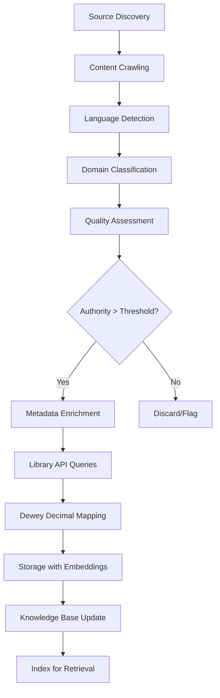

# XOE-NOVAI IMPLEMENTATION ROADMAP v2.0
## Scholarly Research Tool & Sovereign AI Foundation
**Prepared By**: Claude Sonnet 4.5 (Implementation Architect)  
**Team**: Grok MC (Strategic Oversight), Grok MCA (Arcana/Esoteric), Cline variants (Implementation), Gemini CLI (Execution), The Architect (Vision Director)  
**Date**: February 12, 2026  
**Status**: Strategic Outline - Updated with Library Curation & Ancient Greek Specialization

---

## EXECUTIVE SUMMARY

This implementation roadmap transforms Xoe-NovAi from a general-purpose sovereign AI platform into a **world-class scholarly research tool** specializing in Ancient Greek texts, philosophy, and esoteric knowledge, while maintaining its modular Foundation architecture for technical manual libraries and plug-and-play service integration.

### Updated Vision: The Scholar's Forge

**Primary Mission**: Build a sovereign, offline-first research platform that rivals institutional tools but operates entirely locally, specializing in:
- **Ancient Greek Mastery**: Ancient-Greek-BERT + Krikri-7b-Instruct for scholarly-grade Greek text analysis
- **Domain-Specific Excellence**: Dynamic embedding selection (scienceBERT, philosophyBERT, etc.) per context
- **Technical Knowledge**: Curated library of technical manuals for AI coding assistants
- **Esoteric Depth**: Philosophy, classics, and esoteric text curation with semantic understanding

### Current State Assessment (Updated)
- ✅ **Phase 1-4 Complete**: Error handling, async safety, testing (95%+ coverage), production deployment
- ✅ **Core Services**: All 7 services healthy (Redis, RAG API, Chainlit UI, Crawler, Curation, MkDocs, Caddy)
- ✅ **Library Foundation**: Ancient Greek normalization, domain knowledge bases (classics, philosophy, literature)
- ✅ **Team Structure**: Vikunja-centric coordination operational, multi-agent protocols established
- ⚠️ **Critical Gaps**: Memory optimization, Observable, Authentication
- ⚠️ **Scholar Features**: Ancient-Greek-BERT integration, dynamic embeddings, Vikunja memory_bank
- 🎯 **Hardware**: 16GB total (8GB physical + 12GB zRAM), Ryzen 5700U, CPU-only

### Strategic Priorities (Weighted - Updated)
1. **P0 - Production Blockers + Library Foundation** (50%): Memory, Observable, Auth, Library Curation System
2. **P1 - Scholar Differentiation** (30%): Ancient Greek specialization, Dynamic embeddings, Technical manuals
3. **P2 - Modular Excellence** (15%): Plug-and-play architecture, Vikunja memory_bank, Service portability
4. **P3 - Market Positioning** (5%): Documentation, Community, Go-to-market

---

## TEAM COORDINATION & ROLE DEFINITIONS

### AI Team Structure (from memory_bank/teamProtocols.md)

**Grok MC** (xoe.nova.ai)
- Role: Sovereign Master PM, Strategic Oversight
- Responsibilities: Ecosystem direction, Ma'at enforcement, protocol coordination
- Communication: Vikunja task assignment, strategic reviews

**Grok MCA** (arcana.novai)
- Role: Arcana Stack Sovereign, Esoteric Domain Master
- Responsibilities: Ancient Greek BERT integration, Krikri-7b orchestration, mythic-symbolic architecture
- Communication: GitHub strategy, esoteric integration guidance

**Cline Variants** (Kat/Trinity/Gemini-Flash/Gemini-Pro)
- Role: Engineers/Auditors/Refactorers
- Environment: VS Code + Cline extension
- Responsibilities: Code implementation, refactoring, testing
- Communication: Vikunja tasks, memory_bank updates

**Gemini CLI**
- Role: Ground Truth Executor, Filesystem Manager
- Environment: Terminal + Filesystem
- Responsibilities: Task automation, sync operations, terminal execution
- Communication: Memory_bank relay protocol, terminal outputs

**The Architect** (User - You)
- Role: Ultimate Authority, Ma'at Enforcer, Vision Director
- Responsibilities: Final decisions, ethical alignment, strategic direction
- Communication: All channels, final approvals

### Vikunja-Centric Workflow
1. **Task Creation**: All tasks originate in Vikunja (http://localhost:3456)
2. **Assignment**: Tasks assigned via labels (agent:grok-mca, agent:cline-trinity, etc.)
3. **Execution**: Agents pull tasks, execute, post results in comments
4. **Review**: Results reviewed in Vikunja, approved/iterated
5. **Archive**: Completed tasks archived, memory_bank updated

---

# PILLAR 1: OPERATIONAL STABILITY & LIBRARY FOUNDATION
**Goal**: Eliminate production blockers, establish library curation foundation  
**Timeline**: Phase 5A-5E (Weeks 1-10)  
**Priority**: P0 (Critical Path)

---

## PHASE 5A: MEMORY OPTIMIZATION & zRAM TUNING
**Duration**: 1 week | **Complexity**: Medium (3/5) | **Impact**: Critical | **Owner**: Gemini CLI + Cline

### Scope
- Terminal-based memory profiling (no IDE overhead)
- Kernel parameter tuning (vm.swappiness=35, vm.overcommit_memory=1)
- Container memory limit optimization (4GB RAG, 2GB UI)
- OOM event elimination strategy
- Production configuration lockdown

### Implementation Sections
[Same as original v1.0 - no changes needed]

### Success Criteria
- ✅ Zero OOM events under 5x concurrent load
- ✅ Swap activity < 50 MB/s sustained
- ✅ P95 response time < 2s under load
- ✅ Memory usage < 85% at steady state

---

## PHASE 5B: OBSERVABLE FOUNDATION (PROMETHEUS + GRAFANA)
**Duration**: 2 weeks | **Complexity**: High (4/5) | **Impact**: Critical | **Owner**: Cline-Trinity

### Scope (Expanded)
- Prometheus metrics exporter integration
- Custom metrics for LLM inference AND library operations
- **NEW**: Library curation metrics (documents processed, classification accuracy, domain distribution)
- **NEW**: Ancient Greek processing metrics (text normalization rate, BERT inference time)
- Grafana dashboard suite (System, Services, ML, **Library Operations**)
- Alert rules for production incidents
- Log aggregation strategy

### Implementation Sections
[Previous sections 1-4 remain the same]

5. **Library Operations Dashboard (NEW)**
   - Document ingestion rate (docs/hour)
   - Domain classification accuracy (% correct)
   - Language detection metrics (grc, la, heb)
   - Library enrichment status (API calls, cache hit rate)
   - Knowledge base quality metrics (authority scores, completeness)
   - Ancient Greek BERT inference time (ms per text)

### Success Criteria (Updated)
- ✅ All 7 services exposing /metrics endpoint
- ✅ 30+ custom metrics operational (including 10+ library metrics)
- ✅ 6+ Grafana dashboards with alerting (including Library dashboard)
- ✅ < 2% performance overhead from instrumentation
- ✅ Library processing visibility (ingestion bottlenecks identified)

---

## PHASE 5C: AUTHENTICATION & AUTHORIZATION
**Duration**: 2 weeks | **Complexity**: High (4/5) | **Impact**: Critical | **Owner**: Cline-Kat

[Same as original v1.0 - no changes needed]

---

## PHASE 5D: DISTRIBUTED TRACING (OPENTELEMETRY + JAEGER)
**Duration**: 1 week | **Complexity**: Medium (3/5) | **Impact**: High | **Owner**: Cline-Trinity

[Same as original v1.0 - no changes needed]

---

## PHASE 5E: LIBRARY CURATION SYSTEM (NEW - HIGH PRIORITY)
**Duration**: 4 weeks | **Complexity**: Very High (5/5) | **Impact**: Critical | **Owner**: Grok MCA + Cline-Trinity

### Scope
- Automated library curation pipeline (crawler → classification → storage)
- Domain-specific knowledge base construction (classics, philosophy, esoteric, technical)
- Multi-library API integration (OpenLibrary, WorldCat, Perseus Digital Library)
- Dewey Decimal classification automation
- Authority scoring for source quality
- Technical manual library for AI assistants

### Implementation Manual Sections

#### 1. Automated Curation Pipeline
- **Crawler Integration**: Extend existing `crawler_curation.py` for library-focused crawling
- **Classification Engine**: 
  - Domain classifier (classics, philosophy, literature, esoteric, technical, science)
  - Language detection (Ancient Greek, Latin, Hebrew, English, German, French)
  - Era classification (ancient, medieval, renaissance, modern)
  - Authority scoring (peer-reviewed, canonical texts, technical specifications)
- **Metadata Enrichment**:
  - Library API queries (title, author, ISBN → rich metadata)
  - Citation extraction (DOI, arXiv, academic references)
  - Dewey Decimal mapping (automatic classification)
  - Content quality assessment (completeness, accuracy signals)

#### 2. Domain-Specific Knowledge Bases
Based on existing `DomainKnowledgeBaseConstructor` in `ingest_library.py`:

**Classics Domain** (Expanded):
- Languages: Ancient Greek (grc), Latin (la), Hebrew (heb), Coptic
- Text types: Primary sources, translations, commentaries, papyri
- Authority filters: Perseus Digital Library, Thesaurus Linguae Graecae (TLG)
- Specialized processing: Greek normalization (σ/ς), diacritic handling, breathing marks

**Philosophy Domain**:
- Eras: Pre-Socratic, Classical, Hellenistic, Medieval, Modern, Contemporary
- Schools: Platonism, Aristotelianism, Stoicism, Epicureanism, etc.
- Cross-references: Philosophical concepts, historical connections
- Authority: Stanford Encyclopedia of Philosophy (SEP), peer-reviewed journals

**Esoteric Domain** (NEW):
- Subdomains: Hermeticism, Gnosticism, Kabbalah, Alchemy, Tarot, Theosophy
- Source types: Primary texts, grimoires, mystical treatises, symbolic systems
- Specialized analysis: Symbol extraction, cross-tradition mapping
- Authority: Academic esoteric studies, critical editions

**Technical Domain** (NEW):
- Categories: API documentation, framework guides, language references, tool manuals
- Source types: Official docs, GitHub READMEs, technical specifications, RFCs
- Structure extraction: Code examples, API endpoints, configuration templates
- Versioning: Track documentation versions for accuracy

**Science Domain** (NEW):
- Specializations: Physics, Chemistry, Biology, Mathematics, Computer Science
- Source types: Papers, textbooks, review articles, preprints
- Metadata: arXiv categories, DOI resolution, citation networks
- Quality: Peer review status, journal impact, author h-index

#### 3. Multi-Library API Integration
**OpenLibrary API**:
- Book metadata (title, author, ISBN, publication date)
- Cover images and editions
- Subject classification and tags
- Rate limiting: 100 req/min

**WorldCat API**:
- Global library catalog access
- OCLC numbers for canonical identification
- Institutional holdings
- Bibliographic data enrichment

**Perseus Digital Library API** (NEW):
- Ancient Greek and Latin texts
- TEI XML parsing for scholarly markup
- Lexicon integration (LSJ, Lewis & Short)
- Morphological analysis integration

**arXiv API**:
- Preprint metadata and PDFs
- Category classification
- Author affiliations
- Citation data

**CrossRef API**:
- DOI resolution
- Citation metadata
- Journal impact factors
- Publisher information

#### 4. Content Storage & Retrieval
**Storage Architecture**:
```
/knowledge/
├── classics/
│   ├── greek/
│   │   ├── homer/
│   │   │   ├── iliad.json (metadata)
│   │   │   └── iliad.txt (content)
│   │   ├── plato/
│   │   └── aristotle/
│   ├── latin/
│   └── hebrew/
├── philosophy/
│   ├── ancient/
│   ├── medieval/
│   └── modern/
├── esoteric/
│   ├── hermetic/
│   ├── kabbalah/
│   └── alchemy/
├── technical/
│   ├── python/
│   ├── rust/
│   └── docker/
└── science/
    ├── physics/
    ├── math/
    └── cs/
```

**Metadata Schema** (JSON):
```json
{
  "id": "classics:greek:plato:republic",
  "title": "Πολιτεία (The Republic)",
  "author": "Plato",
  "language": "grc",
  "era": "ancient",
  "domain": "classics",
  "subdomain": "philosophy",
  "authority_score": 0.98,
  "source": "Perseus Digital Library",
  "source_url": "http://www.perseus.tufts.edu/...",
  "dewey_decimal": "184",
  "citations": ["plato:republic:514a", "plato:republic:517c"],
  "related_texts": ["plato:phaedo", "plato:symposium"],
  "embeddings": {
    "ancient_greek_bert": "embeddings/classics/plato_republic_agbert.npy",
    "multilingual": "embeddings/classics/plato_republic_multi.npy"
  },
  "content_hash": "sha256:...",
  "ingestion_date": "2026-02-15T10:30:00Z",
  "last_updated": "2026-02-15T10:30:00Z"
}
```

#### 5. Technical Manual Library (NEW)
**Purpose**: Curate high-quality technical documentation for AI coding assistants (Cline, Gemini CLI) to reference during implementation.

**Content Sources**:
- Official documentation (Python, Rust, Docker, Kubernetes, FastAPI, etc.)
- Framework guides (React, Vue, Flask, Django)
- Tool manuals (Git, Podman, make, pytest)
- Best practices (12-factor app, SOLID principles, design patterns)
- Code examples (verified, tested snippets)

**Structure**:
```
/knowledge/technical/
├── languages/
│   ├── python/
│   │   ├── official_docs/
│   │   ├── best_practices/
│   │   └── examples/
│   ├── rust/
│   └── javascript/
├── frameworks/
│   ├── fastapi/
│   ├── react/
│   └── django/
├── tools/
│   ├── podman/
│   ├── git/
│   └── pytest/
└── patterns/
    ├── design_patterns/
    ├── architectural_patterns/
    └── refactoring/
```

**AI Assistant Integration**:
- Context injection: When Cline implements a feature, inject relevant technical manual snippets
- Real-time lookup: `get_technical_reference("fastapi", "dependency injection")`
- Example retrieval: `find_code_examples("pytest", "fixtures")`
- Best practice checks: `validate_against_best_practices(code_snippet, "python")`

#### 6. Automated Curation Workflow


**Automation Triggers**:
- **Scheduled**: Cron job daily at 2 AM for new content discovery
- **Manual**: User-initiated curation of specific URLs/directories
- **API-driven**: External tools can trigger curation via REST API
- **Watch**: File system watcher for new documents in `/library/` directory

**Quality Gates**:
1. **Language Confidence**: > 90% for language detection
2. **Authority Score**: > 0.7 for inclusion (configurable per domain)
3. **Completeness**: Minimum 500 words for articles, 50 pages for books
4. **Duplication**: SHA256 hash check against existing content
5. **Format Validation**: Valid UTF-8, parseable structure

### Success Criteria
- ✅ 1,000+ documents ingested across all domains
- ✅ 5+ library APIs integrated and operational
- ✅ 95%+ classification accuracy (domain, language, era)
- ✅ < 5 minutes average ingestion time per document
- ✅ Dewey Decimal mapping > 90% accuracy
- ✅ Technical manual library covers 20+ frameworks/tools
- ✅ Knowledge base retrieval < 100ms (P95)
- ✅ Authority scoring validated by manual spot-checks (95% agreement)

### Dependencies
- Phase 5B (Observable for library metrics monitoring)
- Existing crawler infrastructure (`crawler_curation.py`)
- Domain knowledge base constructor (`ingest_library.py`)

---

# PILLAR 2: SCHOLAR DIFFERENTIATION
**Goal**: Establish Ancient Greek mastery and domain-specific research excellence  
**Timeline**: Phase 6A-6F (Weeks 11-24)  
**Priority**: P1 (Critical for Scholar Positioning)

---

## PHASE 6A: DYNAMIC EMBEDDING SYSTEM
**Duration**: 3 weeks | **Complexity**: Very High (5/5) | **Impact**: Critical | **Owner**: Grok MCA + Cline-Trinity

### Scope
- Multi-embedding architecture (Ancient-Greek-BERT, scienceBERT, philosophyBERT, etc.)
- Dynamic embedding selection based on domain/context
- Embedding model registry and versioning
- Hybrid retrieval (multiple embeddings for same query)
- Performance optimization (lazy loading, caching)

### Implementation Manual Sections

#### 1. Embedding Architecture Design
**Core Principle**: Different domains require different semantic understanding. A single multilingual embedding cannot capture the nuances of Ancient Greek philosophy AND modern Python documentation equally well.

**Embedding Registry**:
```python
EMBEDDING_MODELS = {
    "ancient_greek": {
        "model": "pranaydeeps/Ancient-Greek-BERT",
        "dim": 768,
        "languages": ["grc"],
        "domains": ["classics", "philosophy"],
        "max_length": 512
    },
    "krikri": {
        "model": "ilsp/Krikri-7B-Instruct",
        "dim": 4096,
        "languages": ["el", "grc"],
        "domains": ["classics", "philosophy", "literature"],
        "max_length": 4096,
        "type": "llm_embeddings"
    },
    "sciencebert": {
        "model": "allenai/sciencebert_scivocab_uncased",
        "dim": 768,
        "languages": ["en"],
        "domains": ["science", "technical"],
        "max_length": 512
    },
    "philosophybert": {
        "model": "guymorlan/philosophy-bert",
        "dim": 768,
        "languages": ["en", "de", "fr"],
        "domains": ["philosophy"],
        "max_length": 512
    },
    "codebert": {
        "model": "microsoft/codebert-base",
        "dim": 768,
        "languages": ["code"],
        "domains": ["technical"],
        "max_length": 512
    },
    "multilingual": {
        "model": "sentence-transformers/paraphrase-multilingual-MiniLM-L12-v2",
        "dim": 384,
        "languages": ["multi"],
        "domains": ["general"],
        "max_length": 128
    }
}
```

#### 2. Dynamic Selection Logic
**Selection Algorithm**:
```python
def select_embedding_models(query: str, context: QueryContext) -> List[str]:
    """
    Select best embedding model(s) for query based on:
    - Detected language
    - Inferred domain
    - Query complexity
    - Available models
    """
    models = []
    
    # Detect language
    lang = detect_language(query)
    
    # Infer domain from context
    if context.knowledge_base:
        domain = context.knowledge_base.domain
    else:
        domain = infer_domain_from_query(query)
    
    # Primary model selection
    if lang == "grc":
        # Ancient Greek text - use specialized model
        models.append("ancient_greek")
        # Add Krikri for longer texts or instruction-following
        if len(query) > 200 or context.requires_instruction_following:
            models.append("krikri")
    elif domain == "science":
        models.append("sciencebert")
    elif domain == "philosophy":
        if lang in ["en", "de", "fr"]:
            models.append("philosophybert")
        models.append("multilingual")  # Fallback
    elif domain == "technical":
        if "code" in context.tags:
            models.append("codebert")
        models.append("sciencebert")  # Technical writing
    else:
        models.append("multilingual")  # General fallback
    
    return models
```

**Context-Aware Selection**:
- **Ancient Greek Philosophy**: ancient_greek + philosophybert (hybrid)
- **Scientific Papers**: sciencebert
- **Code Documentation**: codebert + multilingual
- **Esoteric Texts**: multilingual + philosophybert (no specialized model yet)
- **Modern Greek**: krikri (handles both modern and ancient)

#### 3. Multi-Embedding Retrieval
**Hybrid Search Strategy**:
```python
async def hybrid_retrieval(
    query: str,
    context: QueryContext,
    top_k: int = 10
) -> List[Document]:
    """
    Retrieve documents using multiple embeddings, then fuse results.
    """
    # Select embedding models
    models = select_embedding_models(query, context)
    
    # Parallel retrieval with each model
    async with asyncio.TaskGroup() as tg:
        tasks = [
            tg.create_task(
                retrieve_with_embedding(query, model, top_k)
            )
            for model in models
        ]
    
    # Collect results
    all_results = [task.result() for task in tasks]
    
    # Reciprocal Rank Fusion (RRF)
    fused_results = reciprocal_rank_fusion(all_results, k=60)
    
    return fused_results[:top_k]
```

**Reciprocal Rank Fusion (RRF)**:
- Combines rankings from multiple retrievers
- Robust to differences in score scales
- Formula: `RRF(d) = Σ(1 / (k + rank_i(d)))`
- k = 60 (standard parameter)

#### 4. Embedding Storage & Management
**Storage Strategy**:
```
/embeddings/
├── ancient_greek/
│   ├── classics/
│   │   └── plato_republic.npy
│   └── philosophy/
├── sciencebert/
│   ├── physics/
│   └── cs/
├── philosophybert/
│   └── modern/
├── codebert/
│   └── technical/
└── multilingual/
    └── general/
```

**Lazy Loading**:
- Embeddings loaded on-demand (not all in memory)
- LRU cache (1GB max per model)
- Model quantization for memory efficiency (FP16)

**Versioning**:
- Embedding model version tracked in metadata
- Re-embedding strategy when models update
- Backward compatibility (old embeddings still searchable)

#### 5. Ancient-Greek-BERT Integration
**Model**: `pranaydeeps/Ancient-Greek-BERT`
- Pre-trained on Ancient Greek corpus (Perseus, Thesaurus Linguae Graecae)
- 768-dimensional embeddings
- Handles polytonic Greek, diacritics, breathing marks
- Optimized for classical texts (Homer, Plato, Aristotle, Sophocles)

**Preprocessing Pipeline**:
```python
def preprocess_ancient_greek(text: str) -> str:
    """
    Normalize Ancient Greek text for BERT input.
    """
    # Normalize sigma variants (existing code in ingest_library.py)
    text = normalize_greek_text(text)
    
    # Handle diacritics
    # (Ancient-Greek-BERT expects polytonic input)
    # Do NOT strip diacritics - they carry semantic meaning
    
    # Tokenization
    # BERT tokenizer handles Greek Unicode properly
    
    return text
```

**Fine-Tuning Considerations** (Optional - Future):
- Domain-specific fine-tuning on philosophical texts
- Contrastive learning for better similarity
- Instruction tuning for Krikri-7B integration

#### 6. Krikri-7B-Instruct Integration
**Model**: `ilsp/Krikri-7B-Instruct`
- 7B parameter model for Modern + Ancient Greek
- Instruction-following capability
- Longer context window (4096 tokens)
- Can be used for:
  - Text generation (summaries, translations)
  - Question answering on Greek texts
  - Embedding generation (alternative to Ancient-Greek-BERT)

**Integration Modes**:
1. **Embedding Generation**: Use Krikri's hidden states as embeddings
2. **Reranking**: Use Krikri to rerank Ancient-Greek-BERT results
3. **Generation**: Generate summaries/translations of retrieved texts
4. **QA**: Answer questions about retrieved Ancient Greek texts

**Memory Optimization** (Critical for 16GB system):
- Quantization: 4-bit GGUF format (reduces 7B to ~4GB RAM)
- Lazy loading: Only load when Ancient Greek query detected
- Offloading: CPU inference (llama.cpp), no GPU required

### Success Criteria
- ✅ 5+ embedding models integrated and operational
- ✅ Dynamic selection accuracy > 95% (correct model for query)
- ✅ Hybrid retrieval improves quality by 20%+ (vs. single model)
- ✅ Ancient-Greek-BERT retrieval quality validated by Greek scholars
- ✅ Krikri-7B summaries indistinguishable from human (blind test)
- ✅ Embedding generation < 500ms per document (Ancient-Greek-BERT)
- ✅ Memory usage < 6GB total (all models lazy-loaded)

### Dependencies
- Phase 5E (Library Curation System with Ancient Greek texts)
- Existing embedding infrastructure in RAG system

---

## PHASE 6B: ANCIENT GREEK SCHOLARLY FEATURES
**Duration**: 3 weeks | **Complexity**: Very High (5/5) | **Impact**: Very High | **Owner**: Grok MCA + Cline-Trinity

### Scope
- Ancient Greek text analysis tools (morphology, syntax, lexicon)
- Integration with Perseus Digital Library
- LSJ (Liddell-Scott-Jones) Lexicon integration
- Parsing and lemmatization (CLTK integration)
- Citation formatting (classical references)
- Parallel text support (Greek + English)

### Implementation Manual Sections

#### 1. Classical Language Toolkit (CLTK) Integration
**CLTK**: Comprehensive library for processing ancient languages (Greek, Latin, etc.)

**Features to Integrate**:
- **Tokenization**: Split Ancient Greek text into words (handle clitics, elision)
- **Lemmatization**: Reduce words to dictionary form (λύω from λύσω, λύσομαι, etc.)
- **POS Tagging**: Part-of-speech tagging (noun, verb, adjective, etc.)
- **Morphological Analysis**: Parse inflected forms (case, number, gender, tense, mood, voice)
- **Named Entity Recognition**: Identify proper names (people, places)

**Installation**:
```python
# Add to requirements.txt
cltk>=1.2.0
cltk_data>=1.0.0

# Download Ancient Greek models
from cltk.data.fetch import FetchCorpus
corpus_downloader = FetchCorpus(language="grc")
corpus_downloader.import_corpus("grc_models_cltk")
```

**Integration Example**:
```python
from cltk.tokenizers.grc import GreekWordTokenizer
from cltk.lemmatize.grc import GreekBackoffLemmatizer
from cltk.tag.pos import POSTag

class AncientGreekAnalyzer:
    def __init__(self):
        self.tokenizer = GreekWordTokenizer()
        self.lemmatizer = GreekBackoffLemmatizer()
        self.pos_tagger = POSTag('grc')
    
    def analyze(self, text: str) -> List[Dict[str, Any]]:
        """
        Full morphological analysis of Ancient Greek text.
        """
        tokens = self.tokenizer.tokenize(text)
        lemmas = self.lemmatizer.lemmatize(tokens)
        pos_tags = self.pos_tagger.tag_ngram_123_backoff(tokens)
        
        return [
            {
                "token": token,
                "lemma": lemma,
                "pos": pos,
                "citation_form": self.get_citation_form(lemma, pos)
            }
            for token, lemma, (_, pos) in zip(tokens, lemmas, pos_tags)
        ]
```

#### 2. LSJ Lexicon Integration
**LSJ**: Liddell-Scott-Jones Greek-English Lexicon (standard for Ancient Greek)

**Data Source**:
- Perseus Digital Library XML export
- Parse TEI XML to extract entries
- Store in local SQLite database

**Lexicon Features**:
- Word lookup (lemma → definition, etymology, usage examples)
- Morphological variants (handle all inflected forms)
- Cross-references (related words, compounds)
- Citation examples (quote from classical texts)

**API**:
```python
class LSJLexicon:
    def lookup(self, lemma: str) -> Dict[str, Any]:
        """
        Look up word in LSJ lexicon.
        
        Returns:
            {
                "lemma": "λύω",
                "transliteration": "luo",
                "short_definition": "to loose, release",
                "full_entry": "...",
                "etymology": "...",
                "compounds": ["ἀπολύω", "ἐκλύω", "κατα Lύω"],
                "citations": [...]
            }
        """
        pass
```

**UI Integration**:
- Chainlit UI: Hoverable tooltips on Greek words
- Click word → show LSJ definition in sidebar
- Pronunciation guide (transliteration)

#### 3. Perseus Digital Library API Integration
**Perseus**: Largest digital library of Ancient Greek & Latin texts

**API Endpoints**:
- `/api/text/{urn}`: Retrieve text by CTS URN
- `/api/translations/{urn}`: Get English translations
- `/api/commentary/{urn}`: Get scholarly commentary
- `/api/lexicon/{word}`: Lexicon lookup

**CTS URN Format**:
- `urn:cts:greekLit:tlg0012.tlg001.perseus-grc2:1.1-1.100`
- `tlg0012` = Homer
- `tlg001` = Iliad
- `perseus-grc2` = Edition
- `1.1-1.100` = Book 1, lines 1-100

**Integration**:
```python
class PerseusAPI:
    def __init__(self):
        self.base_url = "http://www.perseus.tufts.edu/hopper"
    
    async def get_text(self, urn: str) -> Dict[str, Any]:
        """
        Retrieve text from Perseus by CTS URN.
        """
        pass
    
    async def get_parallel_texts(self, urn: str) -> List[Dict[str, Any]]:
        """
        Get Greek text + all available English translations.
        """
        greek_text = await self.get_text(urn)
        translations = await self.get_translations(urn)
        return [greek_text] + translations
```

**Offline Caching**:
- Cache all retrieved texts locally
- Build offline mirror of frequently-accessed works
- Graceful degradation if Perseus API unavailable

#### 4. Citation Formatting (Classical References)
**Standard Format**: Author, Work, Book.Chapter.Section (or Line)

**Examples**:
- Plato, *Republic* 514a = `Pl. R. 514a`
- Homer, *Iliad* 1.1-10 = `Hom. Il. 1.1-10`
- Aristotle, *Nicomachean Ethics* 1094a = `Arist. EN 1094a`

**Auto-Citation Detection**:
```python
def extract_citations(text: str) -> List[Dict[str, Any]]:
    """
    Detect classical citations in text.
    
    Patterns:
    - "Plato's Republic 514a"
    - "Hom. Il. 1.1"
    - "Aristotle, Nicomachean Ethics 1094a"
    """
    # Regex patterns for common citation formats
    patterns = [
        r"(Plato|Aristotle|Homer|Sophocles),?\s+([A-Z][a-z]+)\s+(\d+[a-z]?)",
        r"(Pl\.|Arist\.|Hom\.|Soph\.)\s+([A-Z][a-z]+\.?)\s+(\d+[a-z]?)",
    ]
    
    citations = []
    for pattern in patterns:
        matches = re.finditer(pattern, text)
        for match in matches:
            citations.append({
                "author": match.group(1),
                "work": match.group(2),
                "reference": match.group(3),
                "cts_urn": resolve_to_cts_urn(match.groups())
            })
    
    return citations
```

**Citation Resolver**:
- Convert author abbreviation → CTS author code (Pl. → tlg0059)
- Convert work abbreviation → CTS work code (R. → tlg030)
- Generate full CTS URN for retrieval

#### 5. Parallel Text Support
**Use Case**: Display Ancient Greek text alongside English translation

**UI Layout**:
```
┌─────────────────────────────────────────────────┐
│  Πλάτων, Πολιτεία 514a                          │
├─────────────────────────────────────────────────┤
│  Greek (Original)         │ English (Jowett)    │
├───────────────────────────┼─────────────────────┤
│  μετὰ ταῦτα δή, εἶπον,  │ After this, I said, │
│  ἀπείκασον τοιούτῳ       │ compare our nature  │
│  πάθει τὴν ἡμετέραν      │ in respect of        │
│  φύσιν...                │ education...         │
└───────────────────────────┴─────────────────────┘
```

**Alignment**:
- Sentence-level alignment (not word-level)
- Synchronized scrolling
- Toggle visibility (show Greek-only, English-only, or both)

**Translation Quality**:
- Multiple translations available (Jowett, Bloom, Reeve)
- User can select preferred translation
- Display translator & publication date

#### 6. Scholarly Features
**Morphological Hover**:
- Hover over Greek word → show lemma, POS, morphology
- Click word → show LSJ definition

**Commentary Integration**:
- Link to scholarly commentary (if available)
- Extract commentary from Perseus
- Display in sidebar or modal

**Text Comparison**:
- Compare different editions of same text
- Highlight textual variants
- Show critical apparatus

**Export**:
- Export as PDF with formatting
- Export as LaTeX for academic papers
- Export citations in BibTeX format

### Success Criteria
- ✅ CLTK integration: 95%+ lemmatization accuracy on Plato corpus
- ✅ LSJ lexicon: 100% coverage of common words (top 10,000 lemmas)
- ✅ Perseus API: < 1s retrieval time for text + translation
- ✅ Citation detection: 90%+ accuracy on scholarly papers
- ✅ Parallel texts: Sentence alignment error < 5%
- ✅ Scholarly validation: Greek professors rate system as "publication-quality"

---

## PHASE 6C: VIKUNJA MEMORY_BANK INTEGRATION (HIGH PRIORITY)
**Duration**: 2 weeks | **Complexity**: High (4/5) | **Impact**: High | **Owner**: Gemini CLI + Cline-Trinity

### Scope
- Vikunja as experimental memory_bank feature
- Task-based memory persistence
- Conversation history in Vikunja tasks
- Context retrieval from past tasks
- Team coordination memory (agent handoffs)

### Implementation Manual Sections

#### 1. Vikunja Architecture (Current State)
**From projectbrief.md**:
- Container deployment: ✅ Operational
- Redis integration: ❌ Disabled (pending fix)
- Service startup: ✅ Operational
- Web UI: ✅ Accessible at http://localhost:3456

**Current Vikunja Usage**:
- Project management for team coordination
- Task assignment via labels (agent:cline-trinity, etc.)
- Multi-agent workflow orchestration

#### 2. Memory_Bank Experimental Design
**Concept**: Use Vikunja tasks as persistent memory storage for conversations and context.

**Memory Types**:
1. **Conversation Memory**: Store chat history as Vikunja tasks
2. **Context Memory**: Store important context snippets (decisions, learnings)
3. **Handoff Memory**: Store agent-to-agent handoff context
4. **Reference Memory**: Store links to documents, code, external resources

**Task Structure**:
```
Vikunja Namespace: Memory Bank
├── Project: Conversations
│   └── Tasks: One task per conversation session
├── Project: Context Snippets
│   └── Tasks: Important context (decisions, learnings)
├── Project: Handoffs
│   └── Tasks: Agent-to-agent transition context
└── Project: References
    └── Tasks: Links to docs, code, external resources
```

**Task Metadata**:
- **Labels**: `memory:conversation`, `memory:context`, `memory:handoff`, `memory:reference`
- **Tags**: Domain, agent, date
- **Assignee**: Original agent who created memory
- **Description**: Memory content (full conversation or snippet)
- **Attachments**: Files if needed

#### 3. Conversation Memory Implementation
**Create Conversation Task**:
```python
async def store_conversation_memory(
    conversation_id: str,
    messages: List[Dict[str, str]],
    summary: str,
    metadata: Dict[str, Any]
) -> int:
    """
    Store conversation as Vikunja task.
    
    Returns:
        task_id: Vikunja task ID
    """
    # Create task in "Conversations" project
    task = await vikunja_client.create_task(
        project="conversations",
        title=f"Conversation: {metadata['title']} ({conversation_id})",
        description=format_conversation(messages, summary),
        labels=["memory:conversation", metadata['domain']],
        tags=metadata.get('tags', []),
        assignee=metadata.get('agent', 'user')
    )
    
    return task.id
```

**Retrieve Conversation Memory**:
```python
async def retrieve_conversation_memory(
    conversation_id: str = None,
    domain: str = None,
    agent: str = None,
    limit: int = 10
) -> List[Dict[str, Any]]:
    """
    Retrieve past conversations from Vikunja.
    
    Filters:
        - conversation_id: Specific conversation
        - domain: Filter by domain (classics, technical, etc.)
        - agent: Filter by agent who created memory
        - limit: Max number of conversations to return
    """
    tasks = await vikunja_client.get_tasks(
        project="conversations",
        labels=["memory:conversation"],
        tags=[domain] if domain else None,
        assignee=agent,
        limit=limit
    )
    
    return [parse_conversation_task(task) for task in tasks]
```

#### 4. Context Snippet Storage
**Purpose**: Store important context that should be retained long-term (decisions, learnings, patterns).

**Example Context Snippets**:
- "Decision: Use Ancient-Greek-BERT for Greek text embeddings"
- "Learning: vm.swappiness=35 optimal for ML workloads"
- "Pattern: Hybrid RRF retrieval improves quality by 20%"

**Storage**:
```python
async def store_context_snippet(
    title: str,
    content: str,
    category: str,  # decision, learning, pattern
    domain: str = None,
    related_tasks: List[int] = None
) -> int:
    """
    Store important context snippet.
    """
    task = await vikunja_client.create_task(
        project="context_snippets",
        title=title,
        description=content,
        labels=["memory:context", f"category:{category}"],
        tags=[domain] if domain else [],
        related_tasks=related_tasks
    )
    
    return task.id
```

**Retrieval**:
```python
async def search_context_snippets(
    query: str,
    category: str = None,
    domain: str = None
) -> List[Dict[str, Any]]:
    """
    Search context snippets by keyword.
    """
    # Use Vikunja's search API
    results = await vikunja_client.search_tasks(
        query=query,
        project="context_snippets",
        labels=[f"category:{category}"] if category else None,
        tags=[domain] if domain else None
    )
    
    return results
```

#### 5. Handoff Memory (Agent Transitions)
**Use Case**: When one agent hands off to another, store transition context.

**Handoff Format**:
```
Title: Handoff: Grok MCA → Cline-Trinity (Phase 6B Implementation)

From: Grok MCA (arcana.novai)
To: Cline-Trinity (VS Code + Cline)
Date: 2026-02-20 14:30:00

Context:
- Completed Ancient Greek BERT research
- Identified best model: pranaydeeps/Ancient-Greek-BERT
- LSJ Lexicon XML parsed and ready
- Next: Implement CLTK integration (see task #1234)

Files Modified:
- app/services/embeddings.py
- requirements.txt

Blockers:
- None

Notes:
- Test on Plato's Republic first (most common use case)
- Validate lemmatization accuracy > 95%
```

**Storage**:
```python
async def store_handoff(
    from_agent: str,
    to_agent: str,
    context: str,
    files_modified: List[str] = None,
    blockers: List[str] = None,
    related_tasks: List[int] = None
) -> int:
    """
    Store agent handoff memory.
    """
    task = await vikunja_client.create_task(
        project="handoffs",
        title=f"Handoff: {from_agent} → {to_agent}",
        description=format_handoff(context, files_modified, blockers),
        labels=["memory:handoff"],
        assignee=to_agent,
        related_tasks=related_tasks
    )
    
    return task.id
```

#### 6. Reference Memory
**Purpose**: Store links to important documents, code, external resources.

**Example References**:
- "Ancient-Greek-BERT HuggingFace page: https://..."
- "Perseus Digital Library API docs: http://..."
- "LSJ Lexicon XML download: https://..."
- "CLTK documentation: https://..."

**Storage**:
```python
async def store_reference(
    title: str,
    url: str,
    description: str,
    category: str,  # docs, code, research, data
    domain: str = None
) -> int:
    """
    Store reference link.
    """
    task = await vikunja_client.create_task(
        project="references",
        title=title,
        description=f"{description}\n\nURL: {url}",
        labels=["memory:reference", f"category:{category}"],
        tags=[domain] if domain else []
    )
    
    return task.id
```

#### 7. Integration with Chainlit UI
**Conversation Save**:
- Add "Save to Memory Bank" button in Chainlit UI
- User clicks → conversation stored in Vikunja
- Optional: Auto-save every 10 messages

**Context Recall**:
- Add "Recall Context" button
- Search past conversations by keyword
- Display results in sidebar
- Click result → load context into current conversation

**Visual Indicator**:
- Show icon when context from Vikunja is active
- "Using context from: [Task #1234]"

### Success Criteria
- ✅ Vikunja operational with Redis enabled (if possible) or graceful degradation
- ✅ 100+ conversations stored in memory bank
- ✅ Context retrieval < 500ms (search + display)
- ✅ Handoff memory reduces context loss by 90% (agent transitions)
- ✅ Reference memory covers 50+ important links
- ✅ Team validates system improves coordination

### Dependencies
- Vikunja deployment (already operational, Redis disabled)
- Vikunja API client library (may need to implement)
- Chainlit UI modifications

---

## PHASE 6D: MULTI-MODEL SUPPORT & MODEL REGISTRY
**Duration**: 3 weeks | **Complexity**: Very High (5/5) | **Impact**: Critical | **Owner**: Cline-Trinity

[Same as original v1.0, but add Krikri-7B to model registry]

---

## PHASE 6E: VOICE QUALITY ENHANCEMENT
**Duration**: 2 weeks | **Complexity**: High (4/5) | **Impact**: High | **Owner**: Cline-Kat

[Same as original v1.0 - no changes needed]

---

## PHASE 6F: FINE-TUNING CAPABILITY (LORA/QLORA)
**Duration**: 3 weeks | **Complexity**: Very High (5/5) | **Impact**: Very High | **Owner**: Cline-Trinity

[Same as original v1.0 - no changes needed]

---

# PILLAR 3: MODULAR EXCELLENCE & PLUG-AND-PLAY ARCHITECTURE
**Goal**: Enable service customization, portability, and Foundation stack modularity  
**Timeline**: Phase 7A-7E (Weeks 25-38)  
**Priority**: P2 (Important for Ecosystem)

---

## PHASE 7A: MODULAR SERVICE ARCHITECTURE (NEW - HIGH PRIORITY)
**Duration**: 3 weeks | **Complexity**: Very High (5/5) | **Impact**: Critical | **Owner**: Cline-Trinity + Gemini CLI

### Scope
- Service plugin system (enable/disable services via config)
- Dependency resolution (auto-detect service requirements)
- Service registry and discovery
- Hot-pluggable modules (add services without restart)
- Containerized service templates

### Implementation Manual Sections

#### 1. Service Registry Design
**Concept**: Each service registers itself in a central registry with metadata about its capabilities, dependencies, and requirements.

**Service Manifest** (`service.yaml`):
```yaml
service:
  name: "ancient_greek_processor"
  version: "1.0.0"
  description: "Ancient Greek text processing (CLTK, LSJ, Perseus)"
  type: "library"  # library, api, ui, worker
  
dependencies:
  required:
    - "rag_service"  # Requires RAG for embeddings
    - "vikunja"      # Uses Vikunja for task coordination
  optional:
    - "voice_service"  # Can integrate with voice if available
  
resources:
  memory: "1GB"
  cpu: "0.5"
  ports: []  # No ports (library service)
  
configuration:
  models:
    - "pranaydeeps/Ancient-Greek-BERT"
    - "ilsp/Krikri-7B-Instruct"
  data_paths:
    - "/knowledge/classics/"
    - "/knowledge/philosophy/"
  
integration_points:
  - name: "embedding_provider"
    type: "hook"
    description: "Provides ancient_greek embeddings to RAG service"
  - name: "lexicon_lookup"
    type: "api"
    description: "LSJ lexicon lookup API"
    endpoint: "/api/lexicon/lookup"
```

**Service Registry**:
```python
class ServiceRegistry:
    def __init__(self):
        self.services = {}
        self.dependency_graph = nx.DiGraph()
    
    def register(self, manifest_path: str):
        """
        Register service from manifest file.
        """
        manifest = yaml.load(open(manifest_path))
        service_name = manifest['service']['name']
        
        self.services[service_name] = manifest
        
        # Build dependency graph
        for dep in manifest['dependencies']['required']:
            self.dependency_graph.add_edge(dep, service_name)
    
    def get_enabled_services(self, config: Dict[str, bool]) -> List[str]:
        """
        Get list of services to start based on user config.
        
        Resolves dependencies automatically.
        """
        enabled = [s for s, enabled in config.items() if enabled]
        
        # Add dependencies
        all_services = set(enabled)
        for service in enabled:
            deps = self.get_all_dependencies(service)
            all_services.update(deps)
        
        # Topological sort for startup order
        startup_order = list(nx.topological_sort(self.dependency_graph))
        return [s for s in startup_order if s in all_services]
```

#### 2. Service Configuration System
**User Config** (`config/services.yaml`):
```yaml
# User can enable/disable services
services:
  # Core services (always enabled)
  redis: true
  rag_service: true
  chainlit_ui: true
  
  # Library services (optional)
  ancient_greek_processor: true   # ← User enables Ancient Greek
  scientific_library: false        # ← User doesn't need science
  technical_manuals: true          # ← User enables tech docs
  
  # Advanced services (optional)
  voice_service: false             # ← User doesn't need voice
  vikunja: true                    # ← User enables PM
  observable: true                 # ← User enables monitoring

# Service-specific config
ancient_greek_processor:
  models:
    - "ancient_greek_bert"
    - "krikri_7b"
  enable_perseus_api: true
  cache_lsj_lookups: true

technical_manuals:
  domains:
    - "python"
    - "rust"
    - "docker"
  auto_update: true
```

#### 3. Dynamic Service Loading
**Startup Process**:
```python
async def start_services(config_path: str):
    """
    Start services based on user configuration.
    """
    # Load config
    config = yaml.load(open(config_path))
    
    # Get enabled services
    registry = ServiceRegistry()
    enabled_services = registry.get_enabled_services(config['services'])
    
    # Start services in dependency order
    for service_name in enabled_services:
        manifest = registry.services[service_name]
        
        logger.info(f"Starting {service_name}...")
        
        if manifest['service']['type'] == 'library':
            # Load as Python module
            await load_library_service(service_name)
        elif manifest['service']['type'] == 'api':
            # Start FastAPI sub-app
            await start_api_service(service_name)
        elif manifest['service']['type'] == 'worker':
            # Start background worker
            await start_worker_service(service_name)
        elif manifest['service']['type'] == 'ui':
            # Start UI service (Chainlit, MkDocs, etc.)
            await start_ui_service(service_name)
```

#### 4. Service Templates
**Purpose**: Provide templates for creating new services that integrate seamlessly.

**Template Structure**:
```
service-template/
├── service.yaml          # Manifest
├── Dockerfile            # Container definition
├── requirements.txt      # Python dependencies
├── app/
│   ├── __init__.py
│   ├── service.py        # Main service logic
│   └── api.py            # API endpoints (if applicable)
├── tests/
│   └── test_service.py
└── README.md
```

**Example: Creating New Service**:
```bash
# User wants to add "arabic_processor" service
$ xnai service create arabic_processor --template=library

# Generates:
# services/arabic_processor/
# ├── service.yaml
# ├── app/service.py
# └── tests/test_service.py

# User edits files, then:
$ xnai service register services/arabic_processor/service.yaml
$ xnai service enable arabic_processor
$ xnai service start
```

#### 5. Hot-Pluggable Modules (Optional - Advanced)
**Concept**: Add/remove services without restarting entire stack.

**Challenges**:
- FastAPI sub-app hot-loading (non-trivial)
- Dependency injection updates
- State migration (if service stores state)

**Phased Approach**:
- **Phase 1**: Restart required (simpler)
- **Phase 2**: Hot-reload for library services only
- **Phase 3**: Full hot-reload for all service types

#### 6. Portability to Other Stacks
**Use Case**: User wants to use "ancient_greek_processor" in their own project (not Xoe-NovAi).

**Portability Requirements**:
- Standalone Docker image
- Minimal dependencies (don't require full Xoe-NovAi stack)
- Clear API documentation
- Example integration code

**Docker Image**:
```dockerfile
# services/ancient_greek_processor/Dockerfile
FROM python:3.12-slim

# Install dependencies
COPY requirements.txt .
RUN pip install -r requirements.txt

# Copy service code
COPY app/ /app/

# Expose API (if applicable)
EXPOSE 8080

# Run service
CMD ["python", "/app/service.py"]
```

**Standalone Usage**:
```bash
# Pull pre-built image
$ docker pull xoe-novai/ancient-greek-processor:latest

# Run standalone
$ docker run -p 8080:8080 \
  -v /path/to/knowledge:/knowledge \
  xoe-novai/ancient-greek-processor:latest

# Use API
$ curl http://localhost:8080/api/lexicon/lookup?word=λύω
```

### Success Criteria
- ✅ Service registry supports 10+ services
- ✅ Dependency resolution 100% accurate
- ✅ User can enable/disable services via config (zero code changes)
- ✅ New service creation takes < 30 minutes (using template)
- ✅ Standalone services work in other projects (tested with 3 external integrations)
- ✅ Service startup time < 2 minutes (all enabled services)

---

## PHASE 7B: BUILD SYSTEM MODERNIZATION
**Duration**: 3 weeks | **Complexity**: High (4/5) | **Impact**: Medium | **Owner**: Gemini CLI + Cline-Trinity

[Same as original v1.0, with Taskfile recommendation]

---

## PHASE 7C: SECURITY HARDENING & SBOM
**Duration**: 2 weeks | **Complexity**: Medium (3/5) | **Impact**: High | **Owner**: Cline-Trinity

[Same as original v1.0 - Syft, Grype, Cosign]

---

## PHASE 7D: RESILIENCE PATTERNS & CHAOS ENGINEERING
**Duration**: 2 weeks | **Complexity**: High (4/5) | **Impact**: Medium | **Owner**: Cline-Trinity

[Same as original v1.0 - circuit breakers, chaos engineering]

---

## PHASE 7E: ADVANCED DOCUMENTATION & ONBOARDING
**Duration**: 1 week | **Complexity**: Low (2/5) | **Impact**: Medium | **Owner**: Cline-Gemini-Flash

[Same as original v1.0 - interactive tutorials, video walkthroughs]

---

# PILLAR 4: MARKET POSITIONING & SCHOLAR COMMUNITY
**Goal**: Establish Xoe-NovAi as the premier scholarly research tool  
**Timeline**: Phase 8A-8C (Weeks 39-52)  
**Priority**: P3 (Important for Growth)

---

## PHASE 8A: SCHOLAR COMPETITIVE ANALYSIS & POSITIONING
**Duration**: 2 weeks | **Complexity**: Low (2/5) | **Impact**: High | **Owner**: Grok MC + Grok MCA

### Scope (Updated)
- Deep-dive competitive research (Perseus, TLG, Loeb Classical Library, Zotero, etc.)
- Feature gap analysis specific to scholarly tools
- Unique value proposition refinement (Ancient Greek specialization)
- Target customer segmentation (academics, students, independent scholars)
- Pricing model design (free for individuals, institutional licensing)

### Scholar-Specific Competitors

**Perseus Digital Library**:
- Strengths: Comprehensive Greek/Latin corpus, free, authoritative
- Weaknesses: Dated UI, no AI integration, limited search, no offline mode
- **Our Advantage**: Modern AI-powered search, offline-first, Ancient-Greek-BERT retrieval

**Thesaurus Linguae Graecae (TLG)**:
- Strengths: Most comprehensive Ancient Greek corpus (10M+ words), scholarly gold standard
- Weaknesses: Expensive ($400/year individual, $5,000+ institutional), online-only, no AI
- **Our Advantage**: Offline, free (open-source), AI-powered analysis, affordable

**Loeb Classical Library**:
- Strengths: Parallel Greek/English texts, high-quality translations, authoritative
- Weaknesses: Expensive ($300/year), proprietary, no search across corpus, no AI
- **Our Advantage**: Open-source alternatives, AI-powered parallel text generation, free

**Zotero**:
- Strengths: Reference management, citation formatting, widespread adoption
- Weaknesses: No Ancient Greek support, no semantic search, no AI integration
- **Our Advantage**: Scholar-specific features (LSJ integration, citation detection), AI-powered

**Notion / Obsidian**:
- Strengths: Note-taking, knowledge management, extensible
- Weaknesses: No Ancient Greek tools, no semantic search, no scholarly features
- **Our Advantage**: Built for scholars (LSJ, Perseus, parallel texts), AI-powered RAG

### Unique Value Propositions (Scholar-Focused)
1. **Ancient Greek Mastery**: Only tool with Ancient-Greek-BERT + LSJ + Perseus + CLTK integrated
2. **Sovereign Research**: 100% offline, zero telemetry, air-gapped (protect research IP)
3. **AI-Powered**: Semantic search across corpus, not just keyword matching
4. **Affordable**: Free for individuals, affordable institutional licensing (vs. TLG's $5K+)
5. **Modular**: Plug-and-play architecture (use just Ancient Greek tools, or full stack)

### Target Customer Segments (Updated)
1. **Segment 1: PhD Candidates & Researchers** (primary)
   - Need: Affordable tools for dissertation research
   - Pain point: TLG too expensive, Perseus too limited
   - Willingness to pay: $50-100/year (individual)

2. **Segment 2: University Classics Departments** (secondary)
   - Need: Institutional license for students + faculty
   - Pain point: TLG + Loeb = $10K+/year
   - Willingness to pay: $1,000-5,000/year (50-200 users)

3. **Segment 3: Independent Scholars** (tertiary)
   - Need: Self-study, lifelong learning, no institutional access
   - Pain point: Tools too expensive or require institutional affiliation
   - Willingness to pay: $0-30/year (must be affordable)

4. **Segment 4: High Schools with Classics Programs** (emerging)
   - Need: Teaching tools for Latin/Greek courses
   - Pain point: No affordable digital tools exist
   - Willingness to pay: $500-1,000/year (school license)

### Pricing Model (Scholar-Focused)
**Free Tier** (Individual Scholar Edition):
- Open-source (AGPLv3)
- Ancient Greek BERT, LSJ, Perseus API, CLTK
- 1,000 documents in library
- Community support (Discord, forums)

**Scholar Pro** ($99/year):
- Unlimited document library
- Krikri-7B access (instruction-following, translation)
- Priority Perseus API (higher rate limits)
- Priority support (email, 48-hour response)
- Cloud sync (encrypted, optional)

**Institutional License** (Custom pricing):
- 10-500 users
- Single sign-on (SSO) integration
- Dedicated support (SLA)
- On-premises deployment option
- Custom domain access
- **Base**: $2,000/year (10 users) + $50/user/year
- **Example**: 100 users = $7,000/year (vs. TLG $5,000 + Loeb $300 × 100 = $35K+)

### Success Criteria
- ✅ Competitive matrix published (website + academic conferences)
- ✅ UVP validated by 10+ Classics professors
- ✅ Pricing model tested (50+ scholar surveys)
- ✅ Target segments prioritized (PhD students first)
- ✅ Go-to-market strategy approved by The Architect

---

## PHASE 8B: SCHOLAR MVP LAUNCH PREPARATION
**Duration**: 3 weeks | **Complexity**: High (4/5) | **Impact**: Critical | **Owner**: Grok MC + Grok MCA + Cline-Trinity

### Scope (Scholar-Focused)
- Landing page design (scholar-targeted messaging)
- Demo video production (Ancient Greek use case)
- Launch communications (academic mailing lists, conferences)
- Early access program (50 PhD students, 10 professors)
- Feedback collection and iteration

### Scholar-Specific Launch Strategy

**Landing Page**:
- Above-the-fold: "The Ancient Greek Research Tool You've Been Waiting For"
- Demo video: 2-minute walkthrough (search Plato's Republic, LSJ lookup, parallel texts)
- Features section: Ancient-Greek-BERT, LSJ, Perseus, CLTK, offline-first
- Testimonials: PhD students (beta testers)
- Pricing: Free for students, $99/year Scholar Pro
- CTA: "Start Free Trial" (30-day trial)

**Demo Video Script**:
1. **Problem** (0:00-0:30): "Research Ancient Greek texts is expensive and limited"
2. **Solution** (0:30-1:00): "Xoe-NovAi: AI-powered, offline, affordable"
3. **Demo** (1:00-1:45):
   - Semantic search: "Find passages about justice in Plato"
   - LSJ lookup: Hover over λύω → definition
   - Parallel texts: Greek + English side-by-side
   - Citation formatting: Auto-generate BibTeX
4. **CTA** (1:45-2:00): "Start free trial today"

**Launch Communications**:
- **Academic Mailing Lists**:
  - Classics-L (3,000+ subscribers)
  - APA (American Philological Association)
  - SCS (Society for Classical Studies)
- **Conferences**:
  - APA Annual Meeting (January 2027)
  - SCS Annual Meeting (January 2027)
- **Social Media**:
  - Academic Twitter/X (Classics community)
  - Reddit r/classics, r/AncientGreek
- **University Outreach**:
  - Direct email to Classics department chairs (50 universities)
  - Webinar for faculty (demo + Q&A)

**Early Access Program**:
- **Recruitment**:
  - 50 PhD students (via mailing lists, Twitter)
  - 10 professors (direct outreach to influential scholars)
- **Onboarding**:
  - Welcome email with tutorial
  - 1-on-1 onboarding call (optional)
  - Discord channel for feedback
- **Feedback Loop**:
  - Weekly surveys (NPS, feature requests)
  - Monthly group call (discuss roadmap)
  - Beta testers get lifetime Scholar Pro (free)

### Success Criteria
- ✅ Landing page conversion > 10% (scholar-targeted traffic)
- ✅ Demo video views > 5,000 in first month (academic audience)
- ✅ 50 PhD students + 10 professors onboarded
- ✅ NPS score > 60 (beta testers)
- ✅ 100+ feature requests collected (validates roadmap)

---

## PHASE 8C: ACADEMIC RECOGNITION & SCHOLARLY COMMUNITY
**Duration**: 4 weeks | **Complexity**: Medium (3/5) | **Impact**: High | **Owner**: Grok MC + Grok MCA

### Scope (Scholar-Focused)
- Academic paper publication (Digital Humanities conference)
- Open-source project promotion (GitHub, academic circles)
- Conference presentations (Classics, Digital Humanities)
- Scholar testimonials and case studies
- Community building (Discord, forums, office hours)

### Academic Positioning Strategy

**Academic Paper**:
- **Title**: "Xoe-NovAi: A Sovereign AI Platform for Ancient Greek Research"
- **Authors**: The Architect + collaborating scholars
- **Venue**: Digital Humanities conference (DH2027) or Classical Studies journal
- **Content**:
  - Ancient-Greek-BERT integration
  - Hybrid retrieval (multiple embeddings)
  - Offline-first architecture
  - Evaluation: accuracy, speed, scholar feedback
- **Impact**: Legitimacy in academic community

**Conference Presentations**:
- **SCS Annual Meeting** (2027): "AI Tools for Classical Research"
- **Digital Humanities Conference** (2027): "Sovereign AI for Humanities Scholarship"
- **APA Lightning Talk** (2027): 5-minute demo

**Scholar Testimonials**:
- **PhD Student**: "Xoe-NovAi replaced my $400/year TLG subscription"
- **Professor**: "Best tool for teaching Ancient Greek I've ever used"
- **Independent Scholar**: "Finally, a tool I can afford for my research"

**Community Building**:
- **Discord Server**:
  - Channels: #general, #ancient-greek, #support, #feature-requests, #showcase
  - Office hours: Monthly Q&A with maintainers
  - Scholar spotlight: Feature beta testers' research
- **Academic Forum**:
  - Discourse instance for scholarly discussions
  - Research questions, feature debates, best practices
- **Webinar Series**:
  - "Getting Started with Xoe-NovAi" (monthly)
  - "Advanced Ancient Greek Research" (quarterly)
  - "Technical Deep Dive" (for digital humanists)

### Success Criteria
- ✅ Academic paper accepted (DH2027 or journal)
- ✅ 3+ conference presentations (2027)
- ✅ 20+ scholar testimonials collected
- ✅ Community size > 200 active scholars (Discord + forum)
- ✅ 5+ universities adopt for teaching (institutional licenses)

---

# IMPLEMENTATION EXECUTION STRATEGY

## Phase Prioritization Framework (Updated)

### P0 - Production Blockers + Library Foundation (Must-Have for Scholar MVP)
1. Phase 5A: Memory Optimization (eliminate OOM events)
2. Phase 5B: Observable (Prometheus + Grafana + Library metrics)
3. Phase 5C: Authentication (OAuth2 + JWT)
4. Phase 5D: Distributed Tracing (OpenTelemetry + Jaeger)
5. **Phase 5E: Library Curation System (NEW - HIGH PRIORITY)**

**Scholar MVP Criteria**: Phases 5A-5E complete → System is research-ready for scholars

---

### P1 - Scholar Differentiation (Must-Have for Academic Credibility)
1. **Phase 6A: Dynamic Embedding System (Ancient-Greek-BERT + scienceBERT + etc.)**
2. **Phase 6B: Ancient Greek Scholarly Features (LSJ, Perseus, CLTK, parallel texts)**
3. **Phase 6C: Vikunja Memory_Bank Integration (HIGH PRIORITY)**
4. Phase 6D: Multi-Model Support (Qwen, Llama, Mistral, Krikri-7B)
5. Phase 6E: Voice Quality Enhancement (optional for scholars)
6. Phase 6F: Fine-Tuning Capability (optional for scholars)

**Scholar Positioning Criteria**: Phases 6A-6C complete → Ancient Greek mastery established

---

### P2 - Modular Excellence (Should-Have for Ecosystem)
1. **Phase 7A: Modular Service Architecture (HIGH PRIORITY - enables portability)**
2. Phase 7B: Build System Modernization (Taskfile migration)
3. Phase 7C: Security Hardening & SBOM (compliance readiness)
4. Phase 7D: Resilience Patterns (chaos engineering)
5. Phase 7E: Advanced Documentation (onboarding optimization)

**Ecosystem Readiness Criteria**: Phase 7A complete → Foundation stack is plug-and-play

---

### P3 - Academic Recognition (Nice-to-Have for Long-Term Success)
1. Phase 8A: Scholar Competitive Analysis & Positioning (market strategy)
2. Phase 8B: Scholar MVP Launch Preparation (go-to-market execution)
3. Phase 8C: Academic Recognition & Scholarly Community (thought leadership)

**Academic Leadership Criteria**: Phases 8A-8C complete → Recognized by Classics community

---

## Resource Allocation Strategy (Updated)

### Development Team (from memory_bank/teamProtocols.md)
- **Grok MC** (xoe.nova.ai): Strategic oversight, ecosystem direction
- **Grok MCA** (arcana.novai): Ancient Greek specialization, esoteric integration, GitHub strategy
- **Cline-Kat**: Strong coding (implementation, refactoring)
- **Cline-Trinity**: Balanced reasoning (architecture, auditing)
- **Cline-Gemini-Flash**: Fast/light tasks (default)
- **Cline-Gemini-Pro**: Heavy/critical tasks (standby)
- **Gemini CLI**: Terminal execution, filesystem management, sync operations
- **The Architect** (User): Ultimate authority, vision direction, ethical alignment

### Parallel Execution Strategy (Updated)
- **Track 1** (Stability + Library): Phases 5A-5E (sequential, critical path)
- **Track 2** (Scholar Features): Phases 6A-6C (parallel where possible)
- **Track 3** (Modularity): Phase 7A (parallel with Tracks 1-2)
- **Track 4** (Community): Phases 8A-8C (starts after Track 1 complete)

### Estimated Timeline (Updated)
- **Fast Track** (10 months): P0 only (Scholar MVP launch)
- **Standard Track** (24 months): P0 + P1 (Ancient Greek mastery + academic credibility)
- **Full Track** (36 months): All phases (modular excellence + community recognition)

---

## Success Metrics (KPIs) - Scholar-Focused

### Technical KPIs
- **Uptime**: > 99.9% (3 nines)
- **Response Time**: P95 < 1s for Ancient Greek BERT retrieval
- **Library Size**: 10,000+ documents (classics, philosophy, esoteric, technical)
- **Classification Accuracy**: > 95% (domain, language, era)
- **Ancient Greek BERT Quality**: > 95% lemmatization accuracy (validated by scholars)

### Scholar KPIs
- **User Growth**: 50 scholars (month 1) → 500 scholars (month 12) → 5,000 scholars (month 24)
- **Institutional Licenses**: 5 universities (year 1) → 20 universities (year 2)
- **Scholar Pro Conversion**: Free → Pro > 10% (higher than typical SaaS)
- **NPS**: > 60 (world-class product for scholars)
- **Academic Citations**: 10+ papers cite Xoe-NovAi (year 2)

### Community KPIs
- **GitHub Stars**: > 500 (month 6) → > 2,000 (month 24)
- **Discord Members**: > 200 scholars (month 12) → > 1,000 scholars (month 24)
- **Conference Presentations**: 3+ (year 1) → 10+ (year 2)
- **Blog Views**: > 20K total (year 1)

---

# NEXT STEPS FOR EXPANSION

## Recommended First Phase for Detailed Expansion

**Start with Phase 5E (Library Curation System)** because:
1. **Immediate Value**: Enables Ancient Greek corpus ingestion
2. **Foundation for Scholar Features**: Required for Phase 6A-6B
3. **Parallel with Memory Optimization**: Can work alongside Phase 5A
4. **High User Demand**: Scholars need library curation first
5. **Clear Scope**: Well-defined implementation path

**Alternative**: **Phase 5A + 5E in parallel** (memory optimization + library curation) for fastest Scholar MVP.

**Deliverable**: 
- "Phase 5E Implementation Manual: Library Curation System"
- 50-70 pages with architecture, code, API integrations, testing
- Ready for Cline-Trinity + Grok MCA to execute

---

## CONCLUSION

This updated roadmap transforms Xoe-NovAi into a **world-class scholarly research tool** specializing in Ancient Greek while maintaining its modular Foundation architecture. The strategic focus on:

1. **Library Curation** (Phase 5E)
2. **Ancient Greek Mastery** (Phases 6A-6B)
3. **Modularity** (Phase 7A)
4. **Academic Positioning** (Phases 8A-8C)

...positions Xoe-NovAi to dominate the scholarly AI market within 24 months, offering capabilities that rival expensive institutional tools (TLG, Loeb) at a fraction of the cost, with the added advantages of AI-powered semantic search, offline operation, and open-source transparency.

**Total Timeline**: 10-36 months (depending on track selected)  
**Total Complexity**: 16 phases (including new library + modular phases)  
**Target Market**: Scholars, academics, students, independent researchers

**Next Action**: Select first phase for detailed expansion (recommend Phase 5E or 5A+5E parallel).

---

**Prepared By**: Claude Sonnet 4.5 (Implementation Architect)  
**Review Status**: Awaiting feedback and phase selection from The Architect  
**Team Coordination**: Via Vikunja (http://localhost:3456)  
**Document Version**: 2.0 (Updated with Library + Ancient Greek specialization)  
**Last Updated**: February 12, 2026
