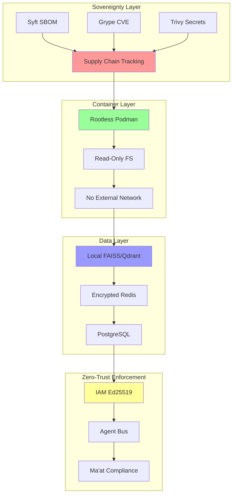
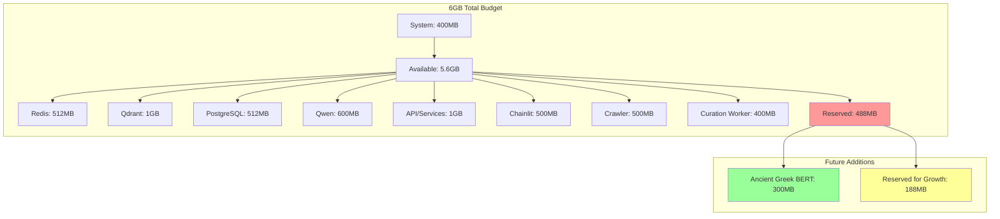
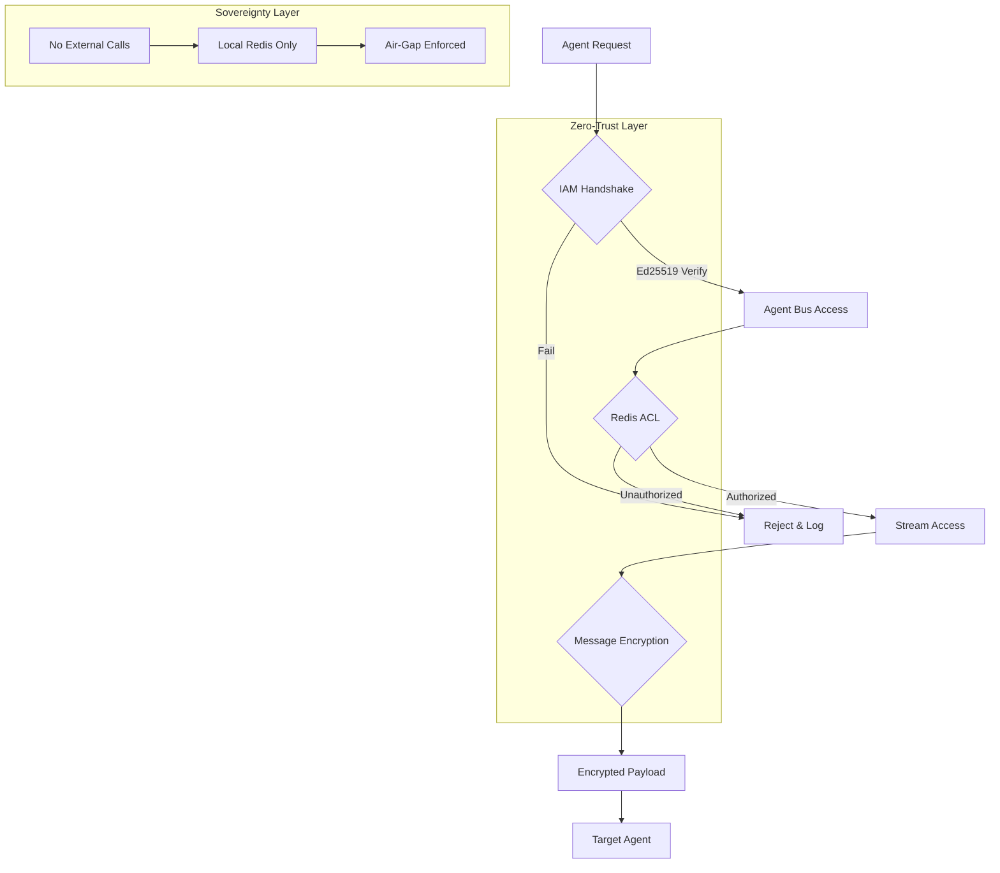

# Claude.ai Implementation Architect - Feedback Integration

**Date**: 2026-02-16 08:18 UTC  
**Review Type**: Architectural Gap Analysis  
**Reviewer**: Claude Sonnet 4.5 Extended (Implementation Architect)  
**Status**: ✅ Integrated & Approved with Modifications  

---

## Executive Summary

Claude identified **3 critical gaps** in the original 12-phase plan:

1. **Security Trinity Validation Missing** → Add Phase 13
2. **Memory Optimization Research Missing** → Enhance Phase 10
3. **Vikunja Redis Fix Not Scheduled** → Add Phase 2.5

**Result**: Plan enhanced from 12 → 14 phases, 150+ → 180+ tasks, 16.25 → 17.5 hours

---

## Gap Analysis & Resolutions

### GAP 1: Sovereign Security Trinity Validation Missing ⚠️

**Problem**: 
- progress.md shows Syft, Grype, Trivy as "🟢 Operational"
- No validation/testing tasks in original plan
- Supply chain security tools not verified for XNAi stack

**Claude's Solution**: 
**→ Add Phase 13: Security Stack Verification (45 min)**

**Tasks**:
```bash
# 1. Syft SBOM Generation
syft packages dir:/home/arcana-novai/Documents/xnai-foundation \
  -o json > /logs/xnai-sbom.json

# 2. Grype CVE Scanning
grype /logs/xnai-sbom.json --fail-on high

# 3. Trivy Configuration Audit
trivy config . --severity HIGH,CRITICAL

# 4. Generate Compliance Report
```

**Deliverable**: `/logs/security-trinity-validation-report.md`

---

### GAP 2: Memory Optimization Research Missing ⚠️

**Problem**:
- Progress.md mentions "Phase 5 zRAM Optimization Design"
- EXPANDED-PLAN doesn't include memory profiling research
- <6GB constraint critical for Ryzen 5700U
- No strategy for Krikri-7B (7B params, ~14GB fp32)

**Claude's Solution**: 
**→ Enhance Phase 10: Ancient Greek Models with Memory Research**

**Research Questions for Cline/Grok**:
1. What are zRAM best practices for ML workloads on Ryzen?
2. How do other sovereign AI stacks handle <6GB constraints?
3. Can we use mmap() for zero-copy GGUF model inference?
4. What's the optimal model swapping strategy?
5. Can Krikri-7B be on-demand only (not resident)?
6. Should we implement model sharding for Ancient Greek tasks?

**Memory Budget Analysis**:
```
Total: 6GB
├─ System: 400MB
├─ Redis: 512MB
├─ Qdrant: 1GB
├─ PostgreSQL: 512MB
├─ Qwen 0.6B: 600MB
├─ API/Services: 1GB
├─ Chainlit UI: 500MB
├─ Crawler: 500MB
├─ Curation Worker: 400MB
├─ Reserved/Buffer: 488MB
└─ Available for expansion: ~188MB

Goal: Keep Krikri-7B available on-demand without resident loading
```

---

### GAP 3: Vikunja Redis Fix Not Scheduled ⚠️

**Problem**:
- activeContext.md shows Vikunja at 85% health
- Docker-compose shows Redis disabled for Vikunja
- PM system can't use cache/session features
- Impacts overall stack performance

**Claude's Solution**: 
**→ Add Phase 2.5: Vikunja Redis Integration (20 min)**

**Insert**: After Phase 2 (Chainlit Build), before Phase 3 (Caddy Fix)

**Task**:
```yaml
# Update docker-compose.yml or docker-compose.vikunja.yml

services:
  vikunja:
    environment:
      VIKUNJA_REDIS_ENABLED: "true"
      VIKUNJA_REDIS_HOST: "redis"
      VIKUNJA_REDIS_PASSWORD: "${REDIS_PASSWORD}"
    depends_on:
      - redis
    restart: unless-stopped
```

**Validation**:
```bash
# After update:
podman-compose up -d vikunja

# Test Redis connectivity
podman exec xnai_vikunja redis-cli -h redis PING
# Expected: PONG

# Verify in Vikunja logs
podman logs xnai_vikunja | grep -i redis
```

**Success Criteria**:
- Redis enabled in Vikunja config
- PING response successful
- Vikunja logs show Redis connection
- Health status → 100%

---

## Priority 2: Phase Enhancements

### Phase 6 Enhancement: Security Architecture Diagram

**Add Mermaid Diagram**:


**Add Memory Budget Diagram**:


---

### Phase 10 Enhancement: Memory-Aware Model Research

**Add to Research Scope**:

**Task 10.1a: Zero-Copy Model Loading**
- Research mmap() strategies for GGUF models
- Implement lazy loading for Krikri-7B
- Test startup latency impact

**Task 10.1b: Model Swapping Strategies**
- Implement LRU cache for model loading
- Create model lifecycle manager
- Test swap performance on zRAM

**Task 10.1c: Memory-Aware Selection Matrix**
```
| Model | Quantization | RAM | Inference | Always-On? |
|-------|--------------|-----|-----------|------------|
| Ancient-Greek-BERT | Q6_K | 300MB | <100ms | ✅ Yes |
| Lightweight-X | Q4_K | 150MB | <50ms | ✅ Yes |
| Krikri-7B | Q4_K_M | 4GB | 1-5s | ❌ On-demand |
| Qwen 0.6B | Q6_K | 600MB | 200ms | ✅ Yes |
```

---

### Phase 11 Enhancement: Security Audit Expansion

**Add to Scope**:

**Task 11.1a: Ed25519 Key Management Audit**
- Verify key generation in `iam_db.py`
- Check rotation policy implementation
- Validate key storage security
- Test key expiration logic

**Task 11.1b: Redis Stream ACL Enforcement**
- Verify ACL configuration for agent channels
- Test unauthorized access rejection
- Audit stream group permissions
- Validate consumer group isolation

**Task 11.1c: IAM Database Encryption**
- Verify at-rest encryption for `/data/iam_agents.db`
- Check passphrase management
- Validate encryption algorithm (SQLite)
- Test recovery procedures

**Task 11.1d: Handshake Replay Protection**
- Audit timestamp validation in `iam_handshake.py`
- Check nonce/replay prevention
- Test against replay attacks
- Validate time synchronization requirements

**Security Architecture Diagram**:


---

## Updated Phase Structure

**Total: 14 Phases (was 12)**

### TRACK A: Critical Operations (6 phases, 6.0 hours)
- Phase 1: Service Diagnostics (2h)
- Phase 2: Chainlit Build (45m)
- **Phase 2.5: Vikunja Redis Integration (20m) [NEW - Claude identified]**
- Phase 3: Caddy Routing Fix (40m)
- Phase 4: Full Stack Testing (60m)
- Phase 5: Integration Testing (45m)

### TRACK B: Knowledge Architecture (3 phases, 4.25 hours)
- Phase 6: Architecture Docs (90m) [**+ Security + Memory diagrams**]
- Phase 7: API Reference (60m)
- Phase 8: Design Patterns (75m)

### TRACK C: Discovery & Research (3 phases, 4.5 hours)
- Phase 9: Crawler Investigation (60m)
- Phase 10: Ancient Greek Models (120m) [**+ memory research**]
- Phase 11: Agent Bus & IAM Audit (90m) [**+ security enhancements**]

### TRACK D: Documentation Excellence (1 phase, 2.0 hours)
- Phase 12: Memory Bank Sync (120m)

### TRACK E: Security Validation (1 phase, 0.75 hours) [NEW - Claude identified]
- **Phase 13: Security Stack Verification (45m)**

**Total Duration**: ~17.5 hours (was 16.25 hours)

---

## Implementation Priority Matrix

| Priority | Phase | Track | Duration | Blocker |
|----------|-------|-------|----------|---------|
| **P0** | 2.5: Vikunja Redis | A | 20m | ⚠️ Vikunja 85% health |
| **P0** | 1-5: Operations | A | 5.5h | 🔴 Chainlit not deployed |
| **P1** | 6-8: Documentation | B | 4.25h | 🟡 Can start parallel |
| **P1** | 13: Security Validation | E | 45m | 🟡 After Phase 12 |
| **P2** | 9-11: Research | C | 4.5h | 🟢 After Track A complete |
| **P3** | 12: Knowledge Sync | D | 2h | 🟢 Continuous |

---

## Updated Execution Timeline

**Total**: ~17.5 hours across 2 weeks

```
WEEK 1:

Day 1 (Monday):
├─ 09:00 - 11:00: Phase 1 (Diagnostics) [Copilot]
├─ 09:30 - 11:00: Phase 6-start (Architecture) [Cline parallel]
└─ Status: Baseline diagnostics + doc planning

Day 2 (Tuesday):
├─ 09:00 - 09:45: Phase 2 (Chainlit Build) [Copilot]
├─ 09:45 - 10:05: Phase 2.5 (Vikunja Redis) [Copilot] ✨ NEW
├─ 10:05 - 10:45: Phase 3 (Caddy Fix) [Copilot]
├─ 10:45 - 11:45: Phase 4 (Stack Test) [Copilot]
├─ 11:45 - 12:30: Phase 5 (Integration) [Copilot]
├─ 09:30 - 14:45: Phases 6-8 (Documentation) [Cline parallel]
└─ Status: ✅ Fully operational stack + complete docs

WEEK 2:

Day 3 (Wednesday):
├─ 09:00 - 10:00: Phase 9 (Crawler Investigation) [Cline]
├─ 10:00 - 12:00: Phase 10 (Models + Memory Research) [Cline] ✨ ENHANCED
└─ Status: Research discoveries + memory strategies

Day 4 (Thursday):
├─ 09:00 - 10:30: Phase 11 (Agent Bus Audit + Security) [Cline] ✨ ENHANCED
├─ 10:30 - 12:30: Phase 12 (Memory Bank Sync) [Copilot + Cline]
├─ 12:30 - 13:15: Phase 13 (Security Validation) [Copilot] ✨ NEW
└─ Status: ✅ Operational excellence + security validated
```

---

## Approval Checklist for Copilot CLI

Before execution, confirm:

- [ ] Phase 2.5 (Vikunja Redis) added after Phase 2
- [ ] Phase 13 (Security Validation) added after Phase 12
- [ ] Phase 6 enhanced with security + memory diagrams
- [ ] Phase 10 enhanced with memory-aware research
- [ ] Phase 11 enhanced with security audit expansion
- [ ] Timeline updated to 17.5 hours total
- [ ] All artifact storage to project folders (no /tmp)
- [ ] Claude.ai feedback integrated and documented
- [ ] Memory budget diagram created
- [ ] Security architecture diagram created

---

## Communication Protocol with Claude.ai

**Copilot CLI → Claude.ai**: Plan reviews + gap identification
**Claude.ai → Copilot CLI**: Architectural feedback + modifications
**Feedback Integration**: Update plans, enhance phases, add new phases

**For Future Reviews, Provide Claude with**:

1. **Project Context** (copy to message):
```
Stack: FastAPI + Podman (rootless) + Qdrant + FAISS + Redis
Hardware: Ryzen 5700U, <6GB RAM + 12GB zRAM swap, Vulkan only, no torch
Constraints: Air-gapped, zero-telemetry, Ma'at-aligned
Current services: 9 operational, Chainlit pending, Vikunja at 85%
```

2. **Status Files**:
   - memory_bank/progress.md (phase status)
   - memory_bank/activeContext.md (current state)
   - memory_bank/teamProtocols.md (agent roles)

3. **Architecture Files**:
   - docker-compose.yml (service definitions)
   - Caddyfile (routing config)
   - app/XNAi_rag_app/ (core code structure)

4. **Specific Questions**:
   - Security gaps (vulnerabilities, threats)
   - Memory optimization (<6GB constraint, but with 12GB zRAM headspace to allow greater loads)
   - Architecture decisions (alternatives, trade-offs)
   - Ma'at alignment (sovereignty, ethics)

---

## Status

**Phase**: ✅ Enhanced Planning Complete  
**Modifications**: 3 critical gaps addressed + Phase enhancements  
**Ready**: Yes, ready for execution approval  
**Next Step**: Confirm modifications and begin Phase 1  

---

**Prepared by**: Copilot CLI (coordinating Claude.ai feedback)  
**Date**: 2026-02-16 08:18 UTC  
**Integration Status**: ✅ Complete
