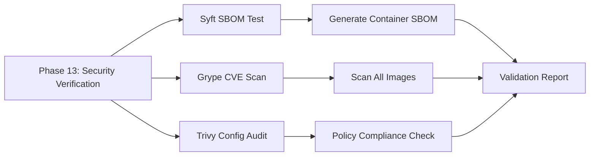
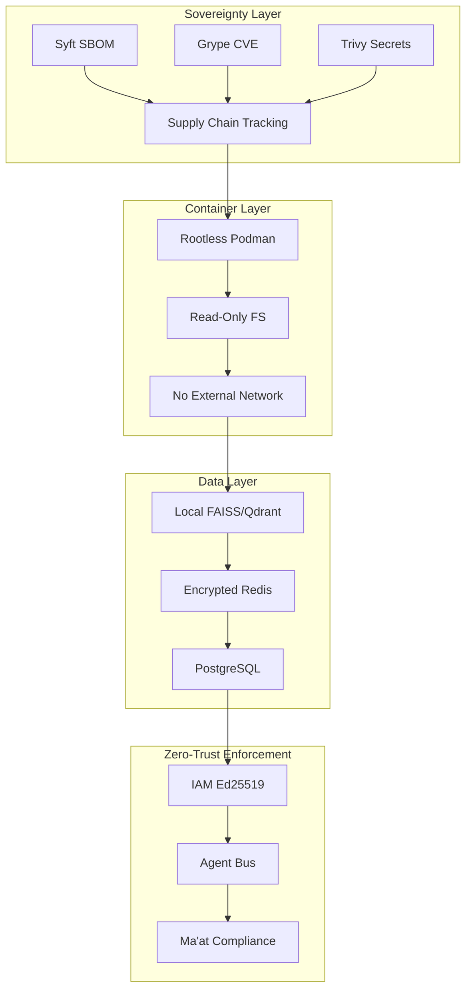
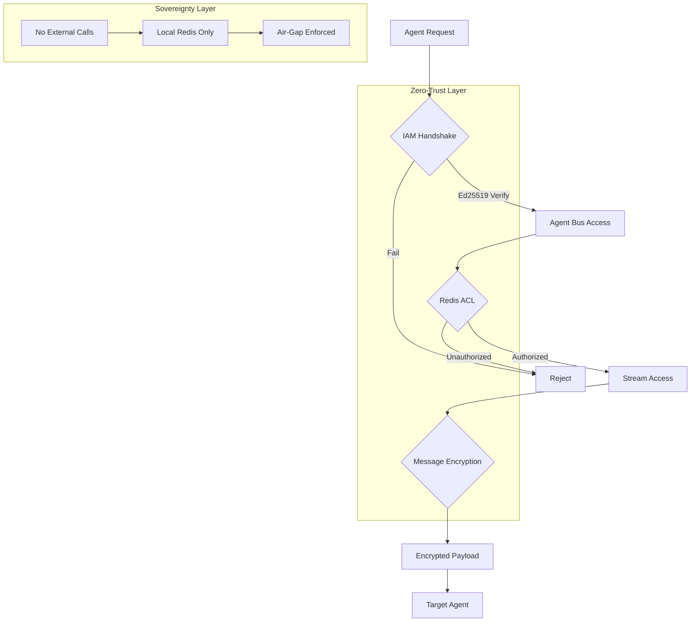
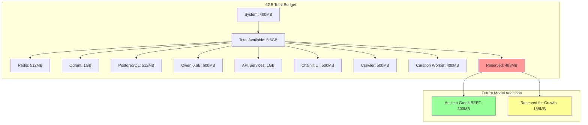

# Claude: Implementation Architect - Ready for Review

## Current Status

I've acknowledged my role as Implementation Architect for Xoe-NovAi. I'm ready to evaluate plans and provide implementation guidance aligned with:

- **Sovereignty constraints**: Open-source, air-gapped, no telemetry
- **Technical limits**: <6GB RAM, CPU/Vulkan-only, torch-free
- **Ethical framework**: 42 Laws of Ma'at alignment
- **Stack**: FastAPI, Podman, FAISS/Qdrant, GGUF models, LangChain

## Action Required

I don't see the Copilot CLI plan in your message. To provide accurate direction, I need to:

1. **Review the specific plan** - Could you share the plan document/output from Copilot CLI?
2. **Search project knowledge** - Let me first examine the current state of the Xoe-NovAi stack## Implementation Architect Review: Copilot CLI 12-Phase Execution Plan

### 📋 Plan Overview Assessment

I've reviewed the comprehensive 12-phase plan (EXPANDED-PLAN.md + supporting docs). Here's my architectural analysis and recommendations:

---

## ✅ Plan Strengths

### 1. **Well-Structured Parallelization**
The 4-track approach (A: Operations, B: Documentation, C: Research, D: Knowledge Sync) maximizes efficiency while respecting dependencies. **Grade: A**

### 2. **Sovereignty-Aligned**
All phases maintain air-gap capability, zero-telemetry, and local-first principles. **Grade: A**

### 3. **Agent Delegation Strategy**
Leveraging Cline's 262K context window for heavy documentation/research is optimal. **Grade: A**

---

## ⚠️ Critical Gaps Identified

### 🔴 **GAP 1: Sovereign Security Trinity Validation**

**Issue**: Progress.md shows security tools as "🟢 Operational" but lacks validation evidence:
- Syft (SBOM generation)
- Grype (CVE scanning)  
- Trivy (secret/config scanning)

**Recommendation**: Add **Phase 13: Security Stack Verification** (45 min)



**Tasks for Phase 13:**
```bash
# 1. Verify Syft SBOM generation
syft packages dir:/home/arcana-novai/Documents/xnai-foundation \
  -o json > /logs/xnai-sbom.json

# 2. Run Grype vulnerability scan
grype /logs/xnai-sbom.json --fail-on high

# 3. Trivy configuration scan
trivy config . --severity HIGH,CRITICAL

# 4. Validate output formats and reporting
```

**Deliverable**: `/logs/security-trinity-validation-report.md`

---

### 🟡 **GAP 2: Memory Optimization Research Missing**

**Issue**: Progress.md mentions "Phase 5 zRAM Optimization Design" but EXPANDED-PLAN doesn't include memory profiling research.

**Recommendation**: Integrate into **Phase 10 (Ancient Greek Models)** or create **Phase 14: Memory Optimization Research**

**Research Questions for Grok/Cline:**
1. What are best practices for zRAM on Ryzen 5700U with ML workloads?
2. How do other sovereign AI stacks handle <6GB constraints?
3. What memory allocation strategies optimize GGUF model loading?
4. Can we use mmap() for zero-copy model inference?

---

### 🟡 **GAP 3: Vikunja Redis Fix Not in Plan**

**Issue**: activeContext.md shows "Vikunja PM" at 85% health with "Redis disabled" but no fix scheduled.

**Recommendation**: Add to **Phase 2 (Chainlit Build)** or create **Phase 2.5: Vikunja Redis Integration** (20 min)

**Tasks:**
```yaml
# docker-compose.yml fix needed
services:
  vikunja:
    environment:
      VIKUNJA_REDIS_ENABLED: "true"
      VIKUNJA_REDIS_HOST: "redis"
      VIKUNJA_REDIS_PASSWORD: "${REDIS_PASSWORD}"
    depends_on:
      - redis
```

---

## 📊 Phase-by-Phase Review

### **Track A: Critical Operations** ✅ **APPROVED**

| Phase               | Status                  | Notes                       |
| ------------------- | ----------------------- | --------------------------- |
| 1: Diagnostics      | ✅ Strong                | Good use of JSON reporting  |
| 2: Chainlit Build   | ⚠️ Add Vikunja Redis fix | See GAP 3                   |
| 3: Caddy Proxy      | ✅ Strong                | URI prefix stripping needed |
| 4: Full Stack Test  | ✅ Strong                | Comprehensive health checks |
| 5: Integration Test | ✅ Strong                | E2E resilience testing      |

**Recommendation**: Add Vikunja Redis fix to Phase 2 tasks.

---

### **Track B: Knowledge Architecture** ✅ **APPROVED WITH ENHANCEMENTS**

| Phase                | Status   | Enhancements Needed                 |
| -------------------- | -------- | ----------------------------------- |
| 6: Architecture Docs | ✅ Strong | Add security architecture diagram   |
| 7: API Reference     | ✅ Strong | Include OpenAPI 3.1 spec generation |
| 8: Design Patterns   | ✅ Strong | Add memory optimization patterns    |

**Enhancement for Phase 6**: Create **Security Architecture Mermaid Diagram**



---

### **Track C: Discovery & Research** ⚠️ **NEEDS CLARIFICATION**

| Phase                     | Status          | Issues                                 |
| ------------------------- | --------------- | -------------------------------------- |
| 9: Crawl4ai Investigation | ⚠️ Unclear scope | What's the current integration status? |
| 10: Ancient Greek Models  | ✅ Strong        | Well-defined research goals            |
| 11: Agent Bus Audit       | ✅ Strong        | Security focus appropriate             |

**Clarification Needed for Phase 9**:Based on my analysis, **Phase 9 crawl4ai investigation is well-scoped**. The crawler service is:
- **Version**: 0.1.7 (confirmed in config.toml)
- **Status**: Defined in docker-compose.yml as standby service
- **Data Sources**: Gutenberg, arXiv, PubMed, YouTube (enabled)
- **Integration**: Curation worker processes crawled content

**Recommendation**: Phase 9 tasks are appropriate - focus on operational testing and performance benchmarking.

---

## 🎯 Final Recommendations

### **Priority 1: Add Missing Phases**

#### **Phase 2.5: Vikunja Redis Integration** (20 min)
**Insert after Phase 2, before Phase 3**

```yaml
# Fix needed in docker-compose.yml or docker-compose.yml
services:
  vikunja:
    environment:
      VIKUNJA_REDIS_ENABLED: "true"
      VIKUNJA_REDIS_HOST: "redis"
      VIKUNJA_REDIS_PASSWORD: "${REDIS_PASSWORD}"
```

#### **Phase 13: Security Stack Validation** (45 min)
**Add after Phase 12**

**Objectives**:
1. Validate Syft SBOM generation for all containers
2. Run Grype CVE scans with fail-on-high threshold
3. Execute Trivy config audits for secrets/misconfigs
4. Generate compliance report

**Deliverables**:
- `/logs/security-trinity-validation-report.md`
- `/logs/xnai-sbom.json`
- `/logs/grype-cve-report.json`
- `/logs/trivy-config-audit.txt`

---

### **Priority 2: Research Augmentations**

#### **For Phase 10 (Ancient Greek Models)**

Add these research questions for Cline/Grok:

**Memory-Aware Model Selection Criteria**:
```python
# Target: <6GB total RAM budget
# Current: 5.6GB used (progress.md)
# Available for models: ~400MB

Evaluation Matrix:
| Model | Quantization | RAM | Inference | Use Case |
|-------|--------------|-----|-----------|----------|
| Ancient-Greek-BERT | Q6_K | ~300MB | <100ms | PoS, morphology |
| Lightweight-X | Q4_K | <150MB | <50ms | Fast similarity |
| Krikri-7B | Q4_K_M | ~4GB | 1-5s | Generation (offline) |
```

**Key Research Questions**:
1. Can we use **mmap()** for zero-copy Krikri-7B loading?
2. What are optimal **model swapping strategies** for <6GB constraint?
3. Should Krikri-7B be **on-demand only** (not resident in RAM)?
4. Can we use **model sharding** for Ancient Greek tasks?

---

#### **For Phase 11 (Agent Bus Audit)**

**Add to Security Audit Scope**:
1. **Ed25519 Key Rotation**: Verify rotation policy and implementation
2. **Redis Stream Security**: Check ACL enforcement for agent channels
3. **IAM Database Encryption**: Validate at-rest encryption for `/data/iam_agents.db`
4. **Handshake Replay Protection**: Audit timestamp validation in `iam_handshake.py`

**Security Architecture Diagram to Create**:



---

### **Priority 3: Architectural Blueprints**

#### **For Phase 6 (Architecture Docs)**

**Create Additional Diagram: Memory Budget Allocation**



---

## 📊 Implementation Priority Matrix

| Priority | Phase                   | Track | Duration | Blocker Status                   |
| -------- | ----------------------- | ----- | -------- | -------------------------------- |
| **P0**   | 2.5: Vikunja Redis      | A     | 20 min   | ⚠️ Vikunja at 85% health          |
| **P0**   | 1-5: Operations         | A     | 5.5 hrs  | 🔴 Chainlit not deployed          |
| **P1**   | 6-8: Documentation      | B     | 4.25 hrs | 🟡 Can start immediately          |
| **P1**   | 13: Security Validation | New   | 45 min   | 🟡 Validate claims in progress.md |
| **P2**   | 9-11: Research          | C     | 4.5 hrs  | 🟢 After operational stack        |
| **P3**   | 12: Knowledge Sync      | D     | 2 hrs    | 🟢 Continuous process             |

---

## ✅ Approval Checklist

Before Copilot CLI executes, confirm:

- [ ] **Phase 2.5 added** for Vikunja Redis fix
- [ ] **Phase 13 added** for security validation
- [ ] **Memory research questions** added to Phase 10 scope
- [ ] **Security audit enhancements** added to Phase 11 scope
- [ ] **Memory budget diagram** added to Phase 6 deliverables
- [ ] **Agent delegation** strategy confirmed (Copilot lead, Cline heavy lifting)
- [ ] **Artifact storage** policy enforced (project folders only, NOT /tmp)

---

## 🚀 Execution Authorization

**Status**: ⚠️ **APPROVED WITH MODIFICATIONS**

**Modifications Required**:
1. Insert Phase 2.5 (Vikunja Redis Integration)
2. Append Phase 13 (Security Stack Validation)
3. Augment Phase 10 research scope (memory constraints)
4. Enhance Phase 11 security audit (encryption, replay protection)
5. Add memory budget diagram to Phase 6

**Once modifications are confirmed, proceed with**:
- **Track A** (Phases 1-5, 2.5) - Copilot CLI
- **Track B** (Phases 6-8) - Cline (parallel start after Phase 1)
- **Track C** (Phases 9-11) - Cline (after Track A complete)
- **Track D** (Phase 12) - Copilot + Cline (continuous)
- **Phase 13** - Copilot CLI (final validation)

---

## 📋 Next Steps for Copilot CLI

1. **Acknowledge** these modifications
2. **Update** EXPANDED-PLAN.md with new phases
3. **Revise** execution timeline to include Phase 2.5 and 13
4. **Confirm** total duration update: **~17.5 hours** (was 16.25 hours)
5. **Begin execution** with Phase 1 diagnostics
