# XNAi Foundation Stack - Comprehensive Discovery & Operational Excellence Plan

**Status**: 📋 EXPANDED PLANNING  
**Date**: 2026-02-16  
**Total Phases**: 12 (organized by parallel tracks + discovery)  
**Confidence**: 95%  
**Scope**: 150+ tasks across operations, documentation, models, and services  

---

## 🎯 Strategic Vision

This plan expands the original 6-phase Chainlit/Vikunja fix into a **comprehensive operational excellence initiative** encompassing:

1. **TRACK A: Critical Operations** (Parallel with Track B)
   - Fix Vikunja accessibility (PM-ready with full feature suite)
   - Test all 9 services exhaustively
   - Fix Caddy routing and Chainlit deployment

2. **TRACK B: Knowledge Architecture** (Parallel with Track A)
   - Document complete system architecture with Mermaid diagrams
   - Create API endpoint reference
   - Write system design docs
   - Maintain memory_bank synchronization

3. **TRACK C: Discovery & Research** (Follows A & B)
   - Investigate crawl4ai service integration
   - Research Ancient Greek language support
   - Lightweight model selection for complementary AI pairs
   - Agent Bus and IAM synchronization review

4. **TRACK D: Documentation Excellence** (Continuous)
   - Ensure internal_docs are current
   - Maintain public docs alignment
   - Document all protocols and patterns
   - Create runbooks and troubleshooting guides

---

## 📊 Current State Analysis

### Stack Architecture (as discovered)
```
9 Services + 11 Containers:
├── Consul (8500)           ✅ Service Discovery
├── Redis (6379)            ✅ Cache/Broker/Circuit Breakers
├── Qdrant (6333)           ✅ Vector DB (embeddings store)
├── PostgreSQL (5432)       ✅ Database backend
├── RAG API (8000)          ✅ FastAPI main service
├── Chainlit UI (8001)      ❌ NOT DEPLOYED (service defined but never built)
├── Vikunja (3456)          ⚠️  CONTAINER RUNNING, NOT ACCESSIBLE (Caddy 502)
├── MkDocs (8008)           ✅ Documentation portal
├── Curation Worker         ✅ Background task processor
├── Caddy (8000)            ⚠️  ROUTING BROKEN (returns 502 for Vikunja)
└── Crawler (crawl4ai)      ❓ UNKNOWN STATUS - INVESTIGATE
```

### Known Issues
| Issue | Status | Root Cause | Evidence |
|-------|--------|-----------|----------|
| Chainlit unreachable | PHASE 1 | Service never built/deployed | No xnai-ui:latest; no container |
| Vikunja 502 via Caddy | PHASE 1 | Proxy routing/health check failure | Container running, proxy returns 502 |
| Documentation gaps | PHASE 2 | No comprehensive architecture docs | Diátaxis docs exist but lack Mermaid |
| crawl4ai integration | INVESTIGATE | Unknown current state | crawl4ai 0.8.0 in requirements, status unclear |
| Ancient Greek support | RESEARCH | Partially planned in roadmap | References in teamProtocols.md, no implementation |

### Team Agents Available
- **Copilot CLI** (current): Coordination, planning, verification
- **Cline CLI** (Kimi K2.5): Heavy lifting for code implementation, documentation
- **Grok MC**: Study-refactor analysis, research synthesis
- **Gemini**: Command execution, filesystem ops

---

# 🔴 TRACK A: Critical Operations (Parallel)

## PHASE 1: Service Diagnostics & Isolation Testing (2 hours)

**Goal**: Validate each service individually, isolate root causes of failures.

### Tasks

#### 1.1 Network Connectivity Baseline
- [ ] Verify all 11 containers on xnai_network bridge
  ```bash
  podman network inspect xnai_network
  ```
- [ ] Test container-to-container DNS resolution
  ```bash
  podman exec xnai_caddy ping -c 1 xnai_vikunja
  podman exec xnai_caddy nslookup xnai_vikunja
  ```
- [ ] Test direct Vikunja connectivity (bypass Caddy)
  ```bash
  podman exec -it xnai_caddy curl -v http://xnai_vikunja:3456/health
  ```
- [ ] Document baseline network metrics

#### 1.2 Service Health Endpoint Testing
- [ ] Consul health API: `curl http://localhost:8500/v1/status/leader`
- [ ] Redis ping: `redis-cli PING`
- [ ] Qdrant health: `curl http://localhost:6333/health`
- [ ] PostgreSQL: `psql -h localhost -U postgres -d xnai_db -c "SELECT 1"`
- [ ] RAG API health: `curl http://localhost:8000/health`
- [ ] MkDocs: `curl http://localhost:8008`
- [ ] Vikunja direct: `curl http://localhost:3456/health`
- [ ] Caddy reverse proxy: `curl http://localhost:8000`

#### 1.3 Caddy Log Analysis
- [ ] Inspect Caddy logs for 502 errors
  ```bash
  podman logs xnai_caddy | grep -i "502\|error\|upstream" | tail -50
  ```
- [ ] Check Caddyfile syntax validation
  ```bash
  podman exec xnai_caddy caddy validate
  ```
- [ ] Extract Caddy error patterns and document

#### 1.4 Vikunja Container Diagnostics
- [ ] Container status and resource usage
  ```bash
  podman inspect xnai_vikunja
  podman stats xnai_vikunja
  ```
- [ ] Vikunja application logs
  ```bash
  podman logs xnai_vikunja | tail -100
  ```
- [ ] Check database connectivity from Vikunja
  ```bash
  podman exec xnai_vikunja psql -h postgres -U vikunja -d vikunja -c "SELECT 1"
  ```
- [ ] Test Vikunja API directly (if listening on 3456)
  ```bash
  podman exec xnai_vikunja curl http://localhost:3456/api/v1/user
  ```

#### 1.5 Chainlit Missing Deployment Confirmation
- [ ] Check if xnai-ui image exists
  ```bash
  podman image ls | grep xnai-ui
  ```
- [ ] Verify Dockerfile.chainlit is present and valid
  ```bash
  cat /home/arcana-novai/Documents/xnai-foundation/Dockerfile.chainlit | head -30
  ```
- [ ] Confirm service definition in docker-compose.yml (lines 209-263)
- [ ] Document missing deployment steps

#### 1.6 Service Registration with Consul
- [ ] Query Consul for all registered services
  ```bash
  curl http://localhost:8500/v1/catalog/services
  ```
- [ ] Check for Chainlit service registration (should be absent)
- [ ] Verify RAG API service details and health checks
  ```bash
  curl http://localhost:8500/v1/catalog/service/rag_api
  ```
- [ ] Document service registration gaps

### Success Criteria (Phase 1)
✅ All 8 running services respond to health checks  
✅ Network connectivity documented and validated  
✅ Caddy logs analyzed for error patterns  
✅ Vikunja accessibility root cause identified  
✅ Chainlit deployment gap confirmed  
✅ Memory usage well below 6.6GB limit (< 4GB expected)  
✅ All findings saved to `/logs/phase1-diagnostics.json`  

---

## PHASE 2: Chainlit Build & Deployment (45 minutes)

**Goal**: Build xnai-ui image, deploy Chainlit service, verify accessibility.

### Tasks

#### 2.1 Build Chainlit Image
- [ ] Pre-build sanity check
  ```bash
  ls -lh /home/arcana-novai/Documents/xnai-foundation/Dockerfile.chainlit
  head -50 Dockerfile.chainlit
  ```
- [ ] Build image with progress tracking
  ```bash
  cd /home/arcana-novai/Documents/xnai-foundation && \
  time podman build -t xnai-ui:latest -f Dockerfile.chainlit . 2>&1 | tee /logs/chainlit_build.log
  ```
- [ ] Verify image creation
  ```bash
  podman image ls | grep xnai-ui
  ```
- [ ] Inspect image metadata
  ```bash
  podman inspect xnai-ui:latest | jq '.[] | {Id, RepoTags, Size, Architecture}'
  ```

#### 2.2 Verify Build Dependencies
- [ ] Check chainlit_app_voice.py exists and is valid Python
  ```bash
  python3 -m py_compile /home/arcana-novai/Documents/xnai-foundation/chainlit_app_voice.py
  ```
- [ ] Verify entrypoint defined in Dockerfile
  ```bash
  podman inspect xnai-ui:latest | jq '.[] | .ContainerConfig.Entrypoint'
  ```
- [ ] Confirm all required packages in requirements-chainlit.txt

#### 2.3 Deploy Chainlit Service
- [ ] Start Chainlit container via docker-compose
  ```bash
  cd /home/arcana-novai/Documents/xnai-foundation && \
  podman-compose -f docker-compose.yml up -d ui
  ```
- [ ] Verify container is running
  ```bash
  podman ps | grep xnai_ui
  podman inspect xnai_ui
  ```
- [ ] Monitor startup logs (90-second window for health check)
  ```bash
  podman logs -f xnai_ui &
  sleep 90
  ```

#### 2.4 Test Chainlit Health Endpoints
- [ ] Direct container access on port 8001
  ```bash
  curl -v http://localhost:8001
  curl -v http://localhost:8001/api/health
  ```
- [ ] Check if service registers with Consul
  ```bash
  curl http://localhost:8500/v1/catalog/services | jq '. | keys | .[] | select(. | contains("chainlit") or contains("ui"))'
  ```
- [ ] Test from another container
  ```bash
  podman exec xnai_caddy curl -v http://xnai_ui:8001
  ```

#### 2.5 Verify RAG API Connectivity from Chainlit
- [ ] Chainlit should reach RAG API on internal network
  ```bash
  podman exec xnai_ui curl -v http://xnai_rag_api:8000/health
  ```
- [ ] Check Chainlit logs for any connection errors
  ```bash
  podman logs xnai_ui | grep -i "api\|connect\|error" | tail -20
  ```

### Success Criteria (Phase 2)
✅ xnai-ui:latest image built (size < 2GB estimated)  
✅ Chainlit container running and healthy  
✅ Direct port 8001 access returns 200  
✅ Service registers with Consul  
✅ RAG API connectivity verified  
✅ All startup logs saved to `/logs/chainlit_startup.log`  

---

## PHASE 3: Caddy Routing Debugging & Fix (40 minutes)

**Goal**: Fix Caddy upstream routing, enable Vikunja and Chainlit accessibility via proxy.

### Tasks

#### 3.1 Analyze Caddyfile Configuration
- [ ] Display current Caddyfile
  ```bash
  cat /home/arcana-novai/Documents/xnai-foundation/Caddyfile
  ```
- [ ] Identify all routing blocks (root, /api/v1, /vikunja, /metrics)
- [ ] Check for upstream health check configurations
- [ ] Verify URI rewrite/strip rules

#### 3.2 Test Direct Upstream Services
- [ ] Vikunja direct test (inside Caddy container)
  ```bash
  podman exec xnai_caddy curl -v http://xnai_vikunja:3456
  podman exec xnai_caddy curl -v http://xnai_vikunja:3456/api/v1/user
  ```
- [ ] Chainlit direct test
  ```bash
  podman exec xnai_caddy curl -v http://xnai_ui:8001
  ```
- [ ] RAG API direct test
  ```bash
  podman exec xnai_caddy curl -v http://xnai_rag_api:8000/health
  ```
- [ ] Document successful vs failed routes

#### 3.3 Isolate Caddy Routing Issues
- [ ] Query Caddy reverse proxy status (if available)
  ```bash
  podman exec xnai_caddy caddy list-modules 2>/dev/null || echo "Check logs instead"
  ```
- [ ] Check if Caddy health check for Vikunja is failing
  ```bash
  podman logs xnai_caddy | grep -i "health\|upstream\|vikunja" | tail -30
  ```
- [ ] Test DNS resolution within Caddy container
  ```bash
  podman exec xnai_caddy getent hosts xnai_vikunja
  podman exec xnai_caddy nslookup xnai_vikunja
  ```
- [ ] Verify container names in docker-compose.yml match Caddyfile

#### 3.4 Fix Potential Issues
**Issue 1**: Container name mismatch
- [ ] Verify container name vs service name in docker-compose.yml
  ```bash
  podman ps --format "{{.Names}}" | grep -E "vikunja|ui|rag"
  ```
- [ ] If names don't match, update Caddyfile with correct container names

**Issue 2**: Health check configuration
- [ ] If Caddy has health checks enabled, disable or adjust
- [ ] Common fix: Remove health_timeout or set to 10s
- [ ] Test simple http_transport (no health check)

**Issue 3**: URI stripping/rewriting
- [ ] For `/vikunja/*` route, ensure proper URI handling
- [ ] Test with explicit rewrite: `rewrite /vikunja/* /api/...` if needed
- [ ] Verify no duplicate slashes in upstream path

**Issue 4**: WebSocket configuration for Chainlit
- [ ] Ensure Caddy handles WebSocket upgrades for Chainlit streaming
- [ ] Add `reverse_proxy /socket* ...` if needed

#### 3.5 Implement Fixes
- [ ] Edit Caddyfile with identified fixes
  ```bash
  # Make a backup first
  cp /home/arcana-novai/Documents/xnai-foundation/Caddyfile{,.backup.phase3}
  
  # Edit and apply fixes
  vim /home/arcana-novai/Documents/xnai-foundation/Caddyfile
  ```
- [ ] Reload Caddy without restart (zero downtime)
  ```bash
  podman exec xnai_caddy caddy reload
  ```
- [ ] Or restart if reload fails
  ```bash
  podman-compose -f docker-compose.yml restart caddy
  ```

#### 3.6 Test Fixed Routes
- [ ] Test Vikunja via proxy (from host)
  ```bash
  curl -v http://localhost:8000/vikunja/
  curl -v http://localhost:8000/vikunja/api/v1/user
  ```
- [ ] Test Chainlit via proxy (from host)
  ```bash
  curl -v http://localhost:8000/
  curl -v http://localhost:8000/api/v1/health  # RAG API
  ```
- [ ] Test with browser if available
- [ ] Document all working routes

#### 3.7 Verify WebSocket Connectivity (for Chainlit)
- [ ] Check if Chainlit WebSocket is working
  ```bash
  # Use websocat or similar tool if available
  # Or test from Chainlit UI if accessible
  ```
- [ ] Verify Caddy WebSocket upgrade headers

### Success Criteria (Phase 3)
✅ Vikunja accessible at `http://localhost:8000/vikunja/`  
✅ Chainlit accessible at `http://localhost:8000/`  
✅ RAG API accessible at `http://localhost:8000/api/v1/`  
✅ No 502 errors from Caddy  
✅ Caddyfile backup saved  
✅ All routing fixes documented  

---

## PHASE 4: Comprehensive Service Testing (60 minutes)

**Goal**: Validate all 9 services are fully operational with proper health checks and integration.

### Tasks

#### 4.1 Service-by-Service Validation

**Consul (Service Discovery)**
- [ ] Web UI accessible: `curl http://localhost:8500/ui/`
- [ ] Query all services: `curl http://localhost:8500/v1/catalog/services | jq`
- [ ] Check health status: `curl http://localhost:8500/v1/status/leader`
- [ ] Leader election verified
- [ ] Document service count (should be 8 services + system services)

**Redis (Cache/Broker)**
- [ ] Redis CLI connectivity: `redis-cli ping` → PONG
- [ ] Set/Get test: `redis-cli SET test_key test_value && redis-cli GET test_key`
- [ ] Stream test: `redis-cli XADD test_stream "*" field value`
- [ ] Memory usage: `redis-cli INFO memory | grep used_memory_human`
- [ ] Persistence check: `redis-cli LASTSAVE`

**Qdrant (Vector Database)**
- [ ] Health endpoint: `curl http://localhost:6333/health`
- [ ] Collection list: `curl http://localhost:6333/collections`
- [ ] Version check: `curl http://localhost:6333/version`
- [ ] Create test collection and verify persistence

**PostgreSQL (Persistent Database)**
- [ ] Connect and verify: `psql -h localhost -U postgres -c "SELECT 1"`
- [ ] List databases: `psql -h localhost -U postgres -l`
- [ ] Vikunja DB status: `psql -h localhost -U vikunja -d vikunja -c "SELECT COUNT(*) FROM tasks" 2>/dev/null || echo "Check access"`
- [ ] Check data directory size: `du -sh /home/arcana-novai/Documents/xnai-foundation/data/vikunja/`

**RAG API (FastAPI Main Service)**
- [ ] Health endpoint: `curl http://localhost:8000/health`
- [ ] OpenAPI docs: `curl http://localhost:8000/docs | grep -i "openapi\|swagger"`
- [ ] Check Consul registration: `curl http://localhost:8500/v1/catalog/service/rag_api`
- [ ] Test RAG endpoint: `curl -X POST http://localhost:8000/api/v1/rag/query -H "Content-Type: application/json" -d '{"query":"test"}'`
- [ ] Verify model initialization in logs

**Chainlit UI (Just Deployed)**
- [ ] Direct port: `curl http://localhost:8001/`
- [ ] Via proxy: `curl http://localhost:8000/`
- [ ] Check for chat interface in HTML response
- [ ] WebSocket connectivity (manual test or via browser)

**Vikunja (Project Management)**
- [ ] Direct port: `curl http://localhost:3456/api/v1/user`
- [ ] Via proxy: `curl http://localhost:8000/vikunja/api/v1/user`
- [ ] Default admin user check
- [ ] List projects: `curl http://localhost:3456/api/v1/projects`
- [ ] Database schema verified

**MkDocs (Documentation Portal)**
- [ ] Direct access: `curl http://localhost:8008/`
- [ ] Search index: `curl http://localhost:8008/search/` 2>/dev/null || echo "Check manually"`
- [ ] Navigation working
- [ ] All markdown files compiled

**Curation Worker (Background Tasks)**
- [ ] Container running: `podman ps | grep curation`
- [ ] Logs show no errors: `podman logs xnai_curation_worker | tail -50 | grep -i error`
- [ ] Check if tasks are being processed (if any queued)

#### 4.2 Cross-Service Integration Tests
- [ ] RAG API → Qdrant: `curl -X POST http://localhost:8000/api/v1/rag/embed -d '{"text":"test"}' 2>/dev/null | jq`
- [ ] RAG API → Redis: Verify cache operations in logs
- [ ] RAG API → PostgreSQL: If any data persistence
- [ ] Chainlit → RAG API: Test chat flow (manual)
- [ ] Vikunja → PostgreSQL: Verify project data persistence

#### 4.3 Memory & Resource Validation
- [ ] Get current memory usage
  ```bash
  free -h
  ```
- [ ] Verify no service exceeds memory quota
  ```bash
  podman stats --no-stream | grep -E "MEM|xnai"
  ```
- [ ] Check zRAM status if applicable
  ```bash
  cat /proc/swaps
  zramctl 2>/dev/null || echo "zRAM not active"
  ```

#### 4.4 Circuit Breaker & Resilience Verification
- [ ] Check RAG API circuit breaker implementation
  ```bash
  curl http://localhost:8000/health/circuit_breaker 2>/dev/null || echo "Check via API"
  ```
- [ ] Verify Redis fallback (if Redis goes down, in-memory fallback works)
- [ ] Test graceful degradation (manual impact test)

#### 4.5 Generate Service Health Report
- [ ] Save all test results to JSON
  ```bash
  cat > /logs/service-health-report.json << 'EOF'
  {
    "timestamp": "$(date -u +%Y-%m-%dT%H:%M:%SZ)",
    "services": {
      "consul": {"status": "healthy", "version": "..."},
      "redis": {"status": "healthy", "memory_mb": ...},
      ... (all 9 services)
    }
  }
  EOF
  ```

### Success Criteria (Phase 4)
✅ All 9 services report "healthy" status  
✅ All health endpoints respond with 200 OK  
✅ Service discovery working (Consul shows all services)  
✅ Cross-service integration verified  
✅ Memory usage < 4.5GB  
✅ No errors in service logs  
✅ Health report generated and saved  

---

## PHASE 5: Integration & End-to-End Testing (45 minutes)

**Goal**: Test complete workflows and system resilience.

### Tasks

#### 5.1 Chainlit → RAG API → Qdrant Flow (End-to-End)
- [ ] User submits query in Chainlit UI
- [ ] Query routes to RAG API via Caddy proxy
- [ ] RAG API embeds query in Qdrant
- [ ] Results returned to Chainlit
- [ ] Response displayed in chat UI
- [ ] Verify latency is acceptable (< 5 sec)

#### 5.2 Vikunja → PostgreSQL → Redis Flow
- [ ] Create new task in Vikunja UI
- [ ] Task persisted to PostgreSQL
- [ ] Cache updated in Redis
- [ ] Task appears in task list
- [ ] Edit task and verify persistence
- [ ] Archive task and verify soft-delete

#### 5.3 Document Upload & Embedding
- [ ] Upload document through RAG API or crawler
- [ ] Document chunked and embedded
- [ ] Embeddings stored in Qdrant
- [ ] Document metadata in PostgreSQL
- [ ] Searchable via RAG query

#### 5.4 Circuit Breaker Resilience
- [ ] Simulate Redis outage
  ```bash
  podman stop xnai_redis
  ```
- [ ] RAG API should continue with in-memory circuit breaker
- [ ] Log graceful degradation message
- [ ] Restart Redis
  ```bash
  podman start xnai_redis
  ```
- [ ] System recovers to full functionality

#### 5.5 Cascade Failure Testing (Optional)
- [ ] Stop Qdrant, verify RAG API handles gracefully
- [ ] Stop PostgreSQL, verify Vikunja error handling
- [ ] Stop Consul, verify all services continue (no new registrations)
- [ ] Document failure modes

#### 5.6 Security Validation
- [ ] Verify rootless container execution
  ```bash
  podman ps -a --format "{{.Names}} {{.User}}"
  ```
- [ ] Confirm read-only root filesystems
  ```bash
  podman inspect xnai_rag_api | jq '.[] | .HostConfig.ReadonlyRootfs'
  ```
- [ ] Check dropped capabilities
  ```bash
  podman inspect xnai_vikunja | jq '.[] | .HostConfig.CapDrop'
  ```
- [ ] Verify no external API calls (zero-telemetry)
  ```bash
  podman logs xnai_rag_api | grep -E "http://|https://" | grep -v localhost | grep -v consul | head
  ```

### Success Criteria (Phase 5)
✅ All end-to-end workflows complete successfully  
✅ Latency < 5 sec for RAG queries  
✅ Vikunja task persistence verified  
✅ Circuit breaker graceful degradation tested  
✅ Security posture confirmed (rootless, read-only, zero-telemetry)  
✅ Zero cascade failures  

---

# 🟡 TRACK B: Knowledge Architecture (Parallel with Track A)

## PHASE 6: System Architecture Documentation (90 minutes)

**Goal**: Create comprehensive visual and textual documentation of system design with Mermaid diagrams.

### Tasks

#### 6.1 High-Level System Architecture Diagram
**Deliverable**: `/docs/architecture/01-system-overview.md` with Mermaid diagram

```mermaid
graph TB
    User["👤 User/Client"]
    Browser["🌐 Browser/UI"]
    Caddy["🚪 Caddy Reverse Proxy<br/>Port 8000"]
    
    Chainlit["💬 Chainlit UI<br/>Port 8001"]
    RAG["🧠 RAG API<br/>Port 8000"]
    Vikunja["📋 Vikunja PM<br/>Port 3456"]
    MkDocs["📚 MkDocs<br/>Port 8008"]
    Crawler["🕷️ Crawler<br/>crawl4ai"]
    
    Consul["🔍 Consul<br/>Service Discovery"]
    Redis["⚡ Redis<br/>Cache & Circuit Breaker"]
    Qdrant["📊 Qdrant<br/>Vector DB"]
    PostgreSQL["🗄️ PostgreSQL<br/>Persistent Storage"]
    
    User -->|HTTP/WebSocket| Browser
    Browser -->|Port 8000| Caddy
    
    Caddy -->|/| Chainlit
    Caddy -->|/api/v1/*| RAG
    Caddy -->|/vikunja/*| Vikunja
    Caddy -->|/docs| MkDocs
    
    Chainlit -->|Query| RAG
    RAG -->|Register| Consul
    RAG -->|Cache| Redis
    RAG -->|Embed| Qdrant
    RAG -->|Persist| PostgreSQL
    
    Vikunja -->|Register| Consul
    Vikunja -->|Store| PostgreSQL
    Vikunja -->|Cache| Redis
    
    Crawler -->|Fetch & Process| RAG
    Crawler -->|Index| Qdrant
    
    MkDocs -->|Read| PostgreSQL
    
    Redis -.->|Fallback| RAG
    Consul -.->|Discovery| RAG
    Consul -.->|Discovery| Vikunja
    
    classDef gateway fill:#FF6B6B,stroke:#C92A2A,color:#fff
    classDef service fill:#4C6EF5,stroke:#364FC7,color:#fff
    classDef storage fill:#37B24D,stroke:#1D5E0F,color:#fff
    classDef proxy fill:#F59F00,stroke:#B8860B,color:#000
    
    class Caddy gateway
    class Chainlit,RAG,Vikunja,MkDocs,Crawler service
    class Consul,Redis,Qdrant,PostgreSQL storage
```



- [ ] Create Mermaid diagram in markdown
- [ ] Add legend and component descriptions
- [ ] Include data flow annotations
- [ ] Document network topology (bridge: xnai_network)

#### 6.2 Service-to-Service Interaction Diagram
**Deliverable**: `/docs/architecture/02-service-interactions.md` with Mermaid sequence diagram


- [ ] Create sequence diagrams for:
  - User query flow
  - Document ingestion flow
  - Task creation in Vikunja
  - Service registration with Consul
- [ ] Add timing annotations

#### 6.3 Data Flow Architecture
**Deliverable**: `/docs/architecture/03-data-flow.md`

- [ ] Diagram: Ingestion pipeline (crawler → RAG → Qdrant → Cache)
- [ ] Diagram: Query resolution (user input → RAG → vector search → response)
- [ ] Diagram: Persistence layer (PostgreSQL backing all state)
- [ ] Document data transformation at each step

#### 6.4 Container & Network Architecture
**Deliverable**: `/docs/architecture/04-containers-network.md` with diagram

- [ ] Diagram: All 11 containers and xnai_network bridge
- [ ] Port mappings table:
  | Service | Port | Protocol | Notes |
  |---------|------|----------|-------|
  | Caddy | 8000 | HTTP/HTTPS | Public gateway |
  | RAG API | 8000 | HTTP | Internal only |
  | Chainlit | 8001 | HTTP/WebSocket | Internal only |
  | ... | ... | ... | ... |

- [ ] Volume mappings documented
- [ ] Environment variables reference

#### 6.5 Service Mesh & Registration
**Deliverable**: `/docs/architecture/05-service-discovery.md`

- [ ] How services register with Consul
- [ ] Health check strategy for each service
- [ ] Service deregistration on crash
- [ ] Consul UI navigation guide
- [ ] Query service catalog via API

#### 6.6 Create Architecture Decision Record (ADR)
**Deliverable**: `/docs/architecture/ADR-001-consul-redis-qdrant.md`

```markdown
# ADR 001: Service Mesh + Cache + Vector DB Choices

## Status
Accepted

## Context
Need scalable, resilient, observable service architecture.

## Decision
Use Consul for service discovery, Redis for circuit breakers & cache, Qdrant for embeddings.

## Rationale
- **Consul**: Proven, cloud-agnostic, supports health checks
- **Redis**: Fast, reliable, supports streams for message bus
- **Qdrant**: Purpose-built for vector similarity, excellent performance

## Consequences
- Operational complexity (3 additional services)
- Memory footprint (Redis + Qdrant)
- Strong consistency guarantees
- Easy horizontal scaling

## Alternatives Considered
- etcd + Memcached + FAISS (more fragmented)
- Docker Swarm + built-in overlay (less portable)
```

### Success Criteria (Phase 6)
✅ 5+ Mermaid diagrams created (overview, interaction, data flow, network, mesh)  
✅ All diagrams are technically accurate and up-to-date  
✅ Architecture decision records written and justified  
✅ Container/network topology comprehensively documented  
✅ Service interaction sequences visualized  
✅ All diagrams saved to `/docs/architecture/` with `.md` and optional `.svg` exports  

---

## PHASE 7: API Reference & Endpoint Documentation (60 minutes)

**Goal**: Comprehensive API reference for all public and internal endpoints.

### Tasks

#### 7.1 RAG API Endpoints Reference
**Deliverable**: `/docs/api/01-rag-api-reference.md`

- [ ] Extract all endpoints from `app/XNAi_rag_app/api/` directory
- [ ] For each endpoint, document:
  - Method (GET, POST, PUT, DELETE, etc.)
  - Path and parameters
  - Request body schema (with Pydantic model)
  - Response schema (success & error cases)
  - Example curl requests
  - Health checks and timeouts
  - Rate limits (if any)
  - Authentication requirements

Example template:
```markdown
### POST /api/v1/rag/query

**Description**: Submit a query to the RAG system.

**Request**:
```json
{
  "query": "What is quantum entanglement?",
  "top_k": 5,
  "filters": {"era": "modern"}
}
```

**Response (200)**:
```json
{
  "query_id": "uuid",
  "results": [
    {
      "document_id": "...",
      "text": "...",
      "score": 0.95,
      "metadata": {...}
    }
  ],
  "latency_ms": 234
}
```

**Examples**:
```bash
curl -X POST http://localhost:8000/api/v1/rag/query \
  -H "Content-Type: application/json" \
  -d '{"query": "test"}'
```
```

#### 7.2 Vikunja API Endpoints
**Deliverable**: `/docs/api/02-vikunja-api-reference.md`

- [ ] Document Vikunja REST API endpoints (from Vikunja docs + exploration)
- [ ] Focus on:
  - Task CRUD operations
  - Project management
  - List/namespace operations
  - User account endpoints
  - Search and filtering
- [ ] Include curl examples for common workflows

#### 7.3 Chainlit WebSocket Protocol
**Deliverable**: `/docs/api/03-chainlit-websocket.md`

- [ ] Document WebSocket message format
- [ ] Message types (user input, bot response, status, etc.)
- [ ] Connection lifecycle
- [ ] Example JavaScript/Python WebSocket client code

#### 7.4 Internal Service APIs
**Deliverable**: `/docs/api/04-internal-services.md`

- [ ] Crawler service API (if exposing endpoints)
- [ ] Curation worker interface
- [ ] Health check endpoints
- [ ] Metrics endpoints (if any)

#### 7.5 Generate Interactive OpenAPI/Swagger
- [ ] Ensure RAG API serves `/docs` (FastAPI built-in)
- [ ] Export OpenAPI JSON: `curl http://localhost:8000/openapi.json > /docs/openapi.json`
- [ ] Link to interactive Swagger UI in documentation

### Success Criteria (Phase 7)
✅ All public endpoints documented with curl examples  
✅ Request/response schemas clear and accurate  
✅ Error codes and handling documented  
✅ At least 50+ endpoints catalogued  
✅ OpenAPI spec exported and linked  
✅ API reference saved to `/docs/api/` with table of contents  

---

## PHASE 8: System Design & Protocols Documentation (75 minutes)

**Goal**: Document core design patterns, protocols, and architecture decisions.

### Tasks

#### 8.1 Circuit Breaker & Resilience Patterns
**Deliverable**: `/docs/design-patterns/01-circuit-breaker.md`

- [ ] Explain circuit breaker pattern as implemented in RAG API
- [ ] Code walkthrough with examples
- [ ] State transitions (closed → open → half-open)
- [ ] Redis persistence of circuit state
- [ ] Memory fallback mode
- [ ] Testing circuit breaker behavior
- [ ] Monitoring & alerting strategies

#### 8.2 Service Registration & Discovery
**Deliverable**: `/docs/design-patterns/02-service-discovery.md`

- [ ] How services register with Consul
- [ ] Health check implementation
- [ ] Service deregistration on crash
- [ ] DNS-based discovery within containers
- [ ] API-based service lookup
- [ ] Failover and load balancing (if used)

#### 8.3 Sovereign Identity & IAM System
**Deliverable**: `/docs/design-patterns/03-sovereign-iam.md`

- [ ] DID (Decentralized Identifier) structure
- [ ] Ed25519 handshake protocol
- [ ] Agent types and roles
- [ ] IAM database schema (SQLite: `/data/iam_agents.db`)
- [ ] Agent bus message signing
- [ ] Example handshake flow


#### 8.4 Agent Bus Architecture
**Deliverable**: `/docs/design-patterns/04-agent-bus.md`

- [ ] Redis Stream-based message bus
- [ ] Consumer group patterns
- [ ] Task routing and targeting
- [ ] Status tracking and ACKs
- [ ] Example: Sending a task to another agent
- [ ] Integration with IAM for security

#### 8.5 Memory Bank & Knowledge Management
**Deliverable**: `/docs/design-patterns/05-memory-bank.md`

- [ ] Directory structure of memory_bank
- [ ] File organization (progress.md, teamProtocols.md, PHASES/, _archive/)
- [ ] Update protocol for agents
- [ ] How documentation flows from sessions into memory bank
- [ ] Archiving and consolidation strategy
- [ ] Index and cross-referencing

#### 8.6 Documentation System (Diátaxis)
**Deliverable**: `/docs/design-patterns/06-documentation-system.md`

- [ ] Diátaxis framework explained (tutorials, guides, reference, explanations)
- [ ] Directory structure alignment to Diátaxis
- [ ] YAML frontmatter metadata standard
- [ ] When to write tutorials vs guides vs reference
- [ ] Link validation and cross-references
- [ ] Audience personas and focus

#### 8.7 Zero-Telemetry & Privacy Protocol
**Deliverable**: `/docs/design-patterns/07-zero-telemetry.md`

- [ ] Definition and enforcement
- [ ] Audit: what external calls are prohibited
- [ ] Logging strategy (all logs local only)
- [ ] Optional telemetry toggle (disabled by default)
- [ ] Compliance with Sovereign Trinity principle

### Success Criteria (Phase 8)
✅ All 7 design patterns documented with code examples  
✅ Architecture decision records written  
✅ Sequence diagrams showing protocol flows  
✅ Code references to implementation files  
✅ Testing examples for each pattern  
✅ Design docs saved to `/docs/design-patterns/` with index  

---

# 🔵 TRACK C: Discovery & Research (Follows Tracks A & B)

## PHASE 9: Crawler Service Investigation (60 minutes)

**Goal**: Fully understand crawl4ai integration, current status, and optimization opportunities.

### Tasks

#### 9.1 Crawl4ai Service Current Status
- [ ] Check if crawler service is running
  ```bash
  podman ps | grep -i crawl
  podman logs xnai_crawler 2>/dev/null || echo "Check docker-compose"
  ```
- [ ] Review Dockerfile.crawl
  ```bash
  cat /home/arcana-novai/Documents/xnai-foundation/Dockerfile.crawl
  ```
- [ ] Check requirements-crawl.txt
  ```bash
  cat /home/arcana-novai/Documents/xnai-foundation/requirements-crawl.txt | grep -i crawl4ai
  ```
- [ ] Version currently installed: 0.8.0 (from requirements.txt)

#### 9.2 Crawl4ai Architecture Review
- [ ] Read primary crawler service code: `/app/XNAi_rag_app/workers/crawl.py`
  - [ ] Identify entry points and async patterns
  - [ ] Document supported data sources (Gutenberg, arXiv, PubMed, YouTube)
  - [ ] Check URL allowlist enforcement
  - [ ] Review rate limiting implementation
  - [ ] Examine sanitization strategy
- [ ] Review secondary: `/app/XNAi_rag_app/services/crawler_curation.py`
  - [ ] Identify integration points with RAG API
  - [ ] Check metadata handling
  - [ ] Review indexing logic

#### 9.3 Delegate Deep Research to Cline CLI
**Delegate to Cline with Kimi K2.5 context**

- [ ] Create research task in Vikunja (when available)
  - Task: "Deep analysis of crawl4ai 0.8.0 for XNAi integration"
  - Labels: `agent:cline-kimi-k2.5`
  - Context: Include code files and design goals
- [ ] Cline to analyze:
  - [ ] crawl4ai feature completeness for document ingestion
  - [ ] Performance benchmarks (pages/hour)
  - [ ] Memory usage patterns
  - [ ] Dependencies and compatibility (Python 3.12+)
  - [ ] Known limitations or issues
  - [ ] Recommended optimization strategies
  - [ ] Integration best practices

#### 9.4 Integration Points Audit
- [ ] How does crawler get invoked?
  - [ ] HTTP endpoint in RAG API?
  - [ ] Scheduled job via curation worker?
  - [ ] CLI command?
- [ ] How are crawled documents indexed?
  - [ ] Direct to Qdrant?
  - [ ] Via RAG API embedding pipeline?
  - [ ] Metadata stored in PostgreSQL?
- [ ] How are crawl results cached in Redis?
- [ ] Error handling for failed crawls

#### 9.5 Performance & Resource Analysis
- [ ] Simulate crawling 10 pages
  ```bash
  cd /home/arcana-novai/Documents/xnai-foundation && \
  python3 -m app.XNAi_rag_app.workers.crawl --curate test --dry-run --count 10
  ```
- [ ] Monitor memory usage during crawl
- [ ] Document crawl rate (pages/sec)
- [ ] Identify bottlenecks

#### 9.6 Create Crawl4ai Integration Runbook
**Deliverable**: `/docs/runbooks/crawl4ai-integration.md`

- [ ] How to trigger a crawl
- [ ] Supported data sources and URL patterns
- [ ] Rate limiting and quota management
- [ ] Troubleshooting common errors
- [ ] Performance tuning recommendations

### Success Criteria (Phase 9)
✅ Crawl4ai version confirmed and documented  
✅ All 4 data sources validated (or limitations noted)  
✅ Integration points mapped  
✅ Cline deep analysis completed  
✅ Performance benchmarks established  
✅ Runbook written and examples tested  

---

## PHASE 10: Ancient Greek Language Support Research (120 minutes)

**Goal**: Complete research and recommend lightweight Ancient Greek models to pair with Krikri-7B.

### Tasks

#### 10.1 Ancient Greek BERT Deep Dive
- [ ] Analyze `pranaydeeps/Ancient-Greek-BERT` model
  - [ ] Architecture: 12-layer, 768d BERT-base
  - [ ] Training data: First1KGreek, Perseus, PROIEL, Gorman treebanks
  - [ ] Fine-tuning results: PoS tagging, morphological analysis
  - [ ] Inference speed and memory requirements
  - [ ] Licensing: Check Apache 2.0 or similar
  - [ ] Community activity and GitHub stars

#### 10.2 Delegate Lightweight Model Research to Cline
**Delegate to Cline with Kimi K2.5 context**

- [ ] Create research task in Vikunja:
  - Task: "Research lightweight Ancient Greek language models < 500MB"
  - Criteria:
    - Supports Ancient Greek tokenization
    - Size < 500MB (to complement Krikri-7B 7B params)
    - DistilBERT or similar small architecture preferred
    - Free/open-source licensing
    - Good embedding quality for semantic search
  - Required output:
    - [ ] Top 3-5 candidate models with comparison table
    - [ ] Benchmark results (if available)
    - [ ] Recommendation for best "lightweight complement"
    - [ ] Integration guide for Xoe-NovAi stack
    - [ ] Cost-benefit analysis

#### 10.3 Krikri-7B Integration Status
- [ ] Check if Krikri-7B is already in the stack
  ```bash
  grep -r "krikri\|krikri-7b" /home/arcana-novai/Documents/xnai-foundation --include="*.py" --include="*.md" -i
  ```
- [ ] Review any existing integration points
- [ ] Document planned role (heavyweight Ancient Greek generation)
- [ ] Identify any setup needed (HF token, download, VRAM requirements)

#### 10.4 Recommend Model Pairing Strategy
- [ ] Ancient-Greek-BERT (encoder, PoS/morphology)
  - Use for: Tokenization, linguistic analysis, embeddings
  - Size: ~500MB
  - Inference: < 100ms per sequence

- [ ] Lightweight complement (DistilBERT-Ancient-Greek, if found)
  - Use for: Fast similarity search, lightweight inference
  - Size: < 200MB
  - Inference: < 50ms per sequence

- [ ] Krikri-7B (decoder/generator)
  - Use for: Generative tasks, paraphrasing, explanations
  - Size: 7B params (~14GB float32, ~7GB fp16 quant)
  - Inference: 1-5 sec per response on Ryzen 5700U

#### 10.5 Integration Planning for Xoe-NovAi Stack
**Deliverable**: `/docs/models/ancient-greek-integration-plan.md`

- [ ] Architecture diagram: Where each model fits in RAG pipeline
- [ ] Model selection algorithm (when to use which model)
- [ ] Inference pipeline design
- [ ] Resource allocation (GPU/CPU, memory)
- [ ] Scaling strategy for parallel requests
- [ ] Cache layer design (model outputs)
- [ ] Fallback chain (if one model unavailable)

#### 10.6 Create Model Comparison Matrix
**Deliverable**: `/docs/models/ancient-greek-models-comparison.md`

| Model | Size | Type | Speed | Accuracy | Cost | License |
|-------|------|------|-------|----------|------|---------|
| Ancient-Greek-BERT | 500MB | Encoder | <100ms | SOTA PoS | Free | Apache 2.0 |
| Lightweight-X | 200MB | Encoder | <50ms | Good | Free | MIT |
| Krikri-7B | 14GB | Decoder | 1-5s | Excellent | Free | Open |
| Baseline: XLM-R | 879MB | Multilingual | 150ms | Baseline | Free | CC-BY-SA-3.0 |

### Success Criteria (Phase 10)
✅ Ancient-Greek-BERT fully analyzed and validated  
✅ 3-5 lightweight model candidates identified by Cline  
✅ Best lightweight complement recommended  
✅ Krikri-7B status and requirements documented  
✅ Integration architecture planned (with diagrams)  
✅ Model comparison matrix complete  
✅ Testing strategy defined  

---

## PHASE 11: Agent Bus & IAM Synchronization Review (90 minutes)

**Goal**: Audit existing Agent Bus and IAM systems, ensure synchronization protocols are robust.

### Tasks

#### 11.1 Agent Bus Architecture Review
- [ ] Examine `/app/XNAi_rag_app/core/agent_bus.py`
  - [ ] Understand Redis Stream usage
  - [ ] Document message format
  - [ ] Check consumer group implementation
  - [ ] Review error handling

#### 11.2 IAM Database & Handshake
- [ ] Audit `/app/XNAi_rag_app/core/iam_db.py`
  - [ ] SQLite schema for agent identities
  - [ ] Ed25519 key storage and rotation
  - [ ] Agent type classification
  - [ ] Metadata handling

- [ ] Review `/app/XNAi_rag_app/core/iam_handshake.py`
  - [ ] Handshake protocol flow
  - [ ] Signature verification
  - [ ] Trust establishment mechanism
  - [ ] Failure scenarios

#### 11.3 Delegate Comprehensive Audit to Cline
**Delegate to Cline with Kimi K2.5 context**

- [ ] Create Vikunja task:
  - Task: "Comprehensive audit of Agent Bus and IAM synchronization"
  - Requirements:
    - [ ] Code review of agent_bus.py, iam_db.py, iam_handshake.py
    - [ ] Verify sync protocol between Consul service discovery and IAM DB
    - [ ] Check for race conditions or deadlock scenarios
    - [ ] Validate Ed25519 signature verification
    - [ ] Test agent-to-agent message routing
    - [ ] Identify any security vulnerabilities
    - [ ] Recommend hardening strategies
  - Output: Detailed audit report with recommendations

#### 11.4 IAM Database Current State
- [ ] Query IAM database
  ```bash
  sqlite3 /home/arcana-novai/Documents/xnai-foundation/data/iam_agents.db ".schema agents"
  sqlite3 /home/arcana-novai/Documents/xnai-foundation/data/iam_agents.db "SELECT COUNT(*) FROM agents"
  ```
- [ ] List all registered agents
  ```bash
  sqlite3 /home/arcana-novai/Documents/xnai-foundation/data/iam_agents.db "SELECT did, agent_name, agent_type FROM agents"
  ```
- [ ] Check if Copilot, Cline, Grok, Gemini agents are registered

#### 11.5 Agent Bus Testing
- [ ] Test sending a task via Agent Bus
  ```python
  # Example from agent_bus.py usage
  async def test_agent_bus():
      async with AgentBusClient(agent_did="did:xnai:test") as bus:
          task_id = await bus.send_task(
              target_did="did:xnai:copilot",
              task_type="documentation",
              payload={"doc_id": "test"}
          )
  ```
- [ ] Verify task appears in Redis Stream
  ```bash
  redis-cli XREAD COUNT 5 STREAMS xnai:agent_bus 0
  ```

#### 11.6 Synchronization Protocol Documentation
**Deliverable**: `/docs/design-patterns/agent-bus-iam-sync.md`

- [ ] How IAM DB syncs with Consul service registry
- [ ] On-demand discovery vs pre-loading
- [ ] Handshake timing and timeout
- [ ] Key rotation strategy
- [ ] Audit logging for all agent interactions

### Success Criteria (Phase 11)
✅ Agent Bus fully audited for correctness  
✅ IAM database schema validated  
✅ Ed25519 handshake protocol verified  
✅ Synchronization between Consul and IAM DB confirmed  
✅ Cline audit report completed with recommendations  
✅ Security review passed (no vulnerabilities identified)  
✅ Documentation updated with sync protocols  

---

# 🟣 TRACK D: Documentation Excellence (Continuous)

## PHASE 12: Internal & Public Documentation Sync (120 minutes)

**Goal**: Ensure all internal documentation is current, accurate, and properly synchronized with public docs.

### Tasks

#### 12.1 Audit Internal Documentation Structure
- [ ] Review `/internal_docs/` directory structure
  ```bash
  find /home/arcana-novai/Documents/xnai-foundation/internal_docs -type d | head -20
  ```
- [ ] Identify stale or outdated files
  ```bash
  find /home/arcana-novai/Documents/xnai-foundation/internal_docs -type f -name "*.md" -newer /tmp -mtime +30
  ```
- [ ] Document which files are actively maintained vs archived

#### 12.2 Audit Public Documentation
- [ ] Check `/docs/` directory completeness
  - [ ] 01-start (getting started)
  - [ ] 02-tutorials (step-by-step guides)
  - [ ] 03-how-to-guides (task-focused guides)
  - [ ] 04-explanation (deep dives)
  - [ ] 05-research (research notes)
  - [ ] 06-development-log (session logs)
- [ ] Verify all docs are Diátaxis-compliant
- [ ] Check for broken links

#### 12.3 Memory Bank Audit
- [ ] Review `/memory_bank/` structure
  - [ ] INDEX.md current?
  - [ ] progress.md up-to-date?
  - [ ] teamProtocols.md accurate?
  - [ ] PHASES/ tracking all completed phases?
  - [ ] _archive/ well-organized?
- [ ] Identify files needing consolidation

#### 12.4 Create Documentation Update Protocol
**Deliverable**: `/docs/design-patterns/08-documentation-maintenance.md`

- [ ] When to update internal vs public docs
- [ ] When to archive vs delete
- [ ] Frontmatter metadata requirements (last_updated, status, persona_focus)
- [ ] Link validation process
- [ ] Image and diagram storage location
- [ ] Version control best practices

#### 12.5 Synchronize Memory Bank After Discovery Phases
- [ ] Create comprehensive memory_bank update
  - [ ] Crawl4ai findings → `/memory_bank/crawl4ai-status.md`
  - [ ] Ancient Greek model recommendations → `/memory_bank/ancient-greek-models.md`
  - [ ] Agent Bus audit results → `/memory_bank/agent-bus-audit.md`
  - [ ] Documentation findings → `/memory_bank/docs-current-status.md`

#### 12.6 Create Master Documentation Index
**Deliverable**: `/docs/INDEX.md` (comprehensive roadmap)

```markdown
# XNAi Foundation Documentation Index

## Quick Navigation
- **Getting Started**: [01-start/](01-start/)
- **Tutorials**: [02-tutorials/](02-tutorials/)
- **How-To Guides**: [03-how-to-guides/](03-how-to-guides/)
- **Explanations**: [04-explanation/](04-explanation/)
- **API Reference**: [api/](api/)
- **Architecture**: [architecture/](architecture/)
- **Design Patterns**: [design-patterns/](design-patterns/)
- **Models**: [models/](models/)

## By Role
- **DevOps**: Start with [infrastructure](03-infrastructure-ops/)
- **Developers**: See [tutorials](02-tutorials/advanced-agent-patterns/)
- **Researchers**: Review [research](05-research/)
- **Project Managers**: Use [Vikunja Integration](vikunja-integration/)

## Latest Updates
- 2026-02-16: Expanded plan with Track A-D
- 2026-02-15: Phase 4.2 service integration complete
- 2026-02-14: Documentation consolidation complete
```

#### 12.7 Validate All Documentation Consistency
- [ ] Check for duplicate content across docs
- [ ] Verify code examples are accurate and runnable
- [ ] Ensure terminal output is current (versions, etc.)
- [ ] Link all cross-references

### Success Criteria (Phase 12)
✅ Internal documentation audit complete  
✅ Public documentation audit complete  
✅ Memory bank fully synchronized with discoveries  
✅ All 150+ new docs from Phases 6-11 integrated  
✅ Master index created with role-based navigation  
✅ Link validation passed (< 5% broken links acceptable)  
✅ Documentation maintenance protocol written  

---

# 📊 Implementation Timeline & Resource Allocation

## Parallel Execution Strategy
```
WEEK 1:
┌─ TRACK A (Critical Operations) ─────────────────────┐
│  Phase 1 (2h) → Phase 2 (45m) → Phase 3 (40m) →    │
│  Phase 4 (60m) → Phase 5 (45m) = ~5.5 hours        │
└──────────────────────────────────────────────────────┘
        ↓ (Parallel)
┌─ TRACK B (Knowledge Architecture) ─────────────────┐
│  Phase 6 (90m) → Phase 7 (60m) → Phase 8 (75m) =   │
│  ~4.25 hours                                        │
└──────────────────────────────────────────────────────┘

WEEK 2:
┌─ TRACK C (Discovery & Research) ──────────────────┐
│  Phase 9 (60m) → Phase 10 (120m) → Phase 11 (90m) │
│  = ~4.5 hours (Cline handles heavy lifting)        │
└──────────────────────────────────────────────────────┘

┌─ TRACK D (Documentation Sync) ────────────────────┐
│  Phase 12 (120m) = 2 hours (parallel with C)      │
└──────────────────────────────────────────────────────┘

TOTAL EXECUTION TIME: ~16.25 hours (Copilot) + Cline parallel work
```

## Agent Delegation Strategy
- **Copilot CLI**: Coordination, planning, quick diagnostics, verification
- **Cline CLI (Kimi K2.5)**: 
  - Phase 9: Crawl4ai deep analysis (large context window)
  - Phase 10: Lightweight model research (compare 10+ models)
  - Phase 11: Agent Bus/IAM security audit (code review)
  - Documentation writing (phases 6-8, dense technical docs)
- **Grok MC**: Optional - research synthesis, study-refactor analysis
- **Gemini CLI**: Command execution, file operations

---

# 🎯 Success Metrics & Validation

## Track A Success (Services Operational)
```
✅ 8/8 services running healthy
✅ 100% endpoint availability
✅ < 4.5GB memory usage
✅ Zero 502 errors from Caddy
✅ Chainlit accessible
✅ Vikunja functional for all PM tasks
```

## Track B Success (Documentation Complete)
```
✅ 15+ Mermaid diagrams
✅ 50+ API endpoints documented
✅ 7 design pattern docs
✅ All ADRs written
✅ 0 broken internal links
```

## Track C Success (Research Complete)
```
✅ Crawl4ai status: operational or roadmap
✅ 3-5 lightweight Ancient Greek models identified
✅ Krikri-7B integration plan detailed
✅ Agent Bus audit passed
✅ IAM security validated
```

## Track D Success (Knowledge Sync)
```
✅ Memory bank updated with all findings
✅ Internal docs current (< 1 week old)
✅ Public docs aligned with internal knowledge
✅ Master index created and navigable
```

---

# 📋 Critical Path Dependencies

1. **Phase 1 must complete before Phase 2** (need diagnostics to know what to build)
2. **Phase 2 must complete before Phase 3** (Chainlit needs to be deployed to test proxy)
3. **Phase 3 must complete before Phase 4** (need all services accessible for testing)
4. **Phases 6-8 can start immediately after Phase 1** (don't need full operational stack)
5. **Phases 9-11 should start after Phase 4** (need healthy stack for context)
6. **Phase 12 happens continuously but aggregates findings from all other phases**

---

# 🚀 Next Steps

**Awaiting Approval to Execute**

When approved, proceed with:

1. **Execute TRACK A** (Copilot CLI + Cline for Phase 2 build)
2. **Execute TRACK B in parallel** (Cline for heavy documentation writing)
3. **Execute TRACK C after A & B** (Cline deep research on crawl4ai, models, IAM)
4. **Execute TRACK D throughout** (continuous memory bank sync)

---

## 📚 Artifact Locations

All deliverables will be saved to project folders per artifact location standards:
- **Logs**: `/logs/` (phase-diagnostics.json, chainlit_build.log, etc.)
- **Documentation**: `/docs/` (organized by type: api/, architecture/, design-patterns/, models/)
- **Internal Docs**: `/internal_docs/` (audit reports, research findings)
- **Memory Bank**: `/memory_bank/` (progress updates, findings, protocols)
- **Scripts**: `/scripts/` (health-check.sh, test-crawler.py, etc.)

**NO files will be saved to /tmp or /session-state** (project-folder-only policy)

---

**Plan Last Updated**: 2026-02-16 07:15 UTC  
**Total Tasks**: 150+  
**Phases**: 12  
**Parallel Tracks**: 4  
**Status**: Ready for Execution Approval
