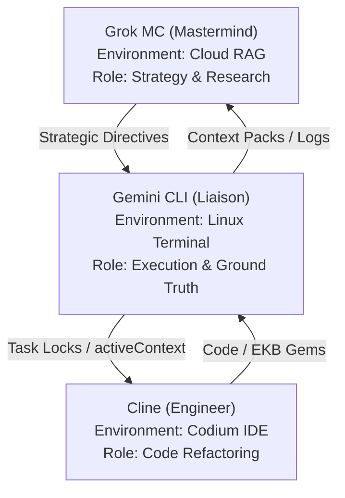
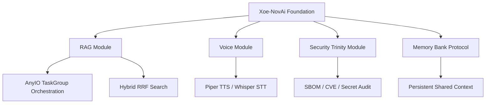
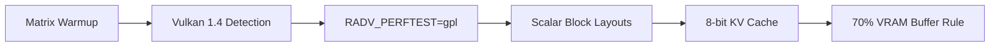

# Xoe-NovAi Context Pack (ONBOARDING)

## Quick Jump
- [activeContext.md](#file-id-activecontext-md-start-path-memory_bank-activecontext-md)
- [environmentContext.md](#file-id-environmentcontext-md-start-path-memory_bank-environmentcontext-md)
- [teamProtocols.md](#file-id-teamprotocols-md-start-path-memory_bank-teamprotocols-md)
- [agent_capabilities_summary.md](#file-id-agent_capabilities_summary-md-start-path-memory_bank-agent_capabilities_summary-md)
- [projectbrief.md](#file-id-projectbrief-md-start-path-memory_bank-projectbrief-md)
- [productContext.md](#file-id-productcontext-md-start-path-memory_bank-productcontext-md)
- [techContext.md](#file-id-techcontext-md-start-path-memory_bank-techcontext-md)
- [systemPatterns.md](#file-id-systempatterns-md-start-path-memory_bank-systempatterns-md)
- [sync-protocols-v1.4.0.md](#file-id-sync-protocols-v1-4-0-md-start-path-xoe-novai-sync-_meta-sync-protocols-v1-4-0-md)

---


<!-- FILE ID: activeContext-md START (Path: memory_bank/activeContext.md) -->
---
update_type: protocol_update
timestamp: 2026-01-29T10:35:00
agent: Gemini CLI
priority: high
related_components: [memory_bank, _meta/locks, gemini.md]
ma_at_ideal: 41 - Advance through own abilities
---
# Active Context: v0.1.0-alpha Release Candidate Finalized

**Last Updated**: January 29, 2026
**Status**: 🔱 XNAi Stack Hardened, Rebranded & AI-Native Verified
**Priority**: PUBLIC CONTRIBUTION CYCLE & ROADMAP EXECUTION

## Current System State

### 🤖 AI-Native Foundation (NEW)
- **Grok MC Onboarded**: The team's "Mastermind" (Grok MC) is now integrated into the workflow, overseeing high-level strategy and research from Grok.com.
- **RAG-Optimization Protocol**: All `memory_bank/` updates now include mandatory YAML frontmatter for parseability by cloud-hosted RAGs.
- **Task Locking System**: Initialized `_meta/locks/` for YAML-based task management between agents.
- **100% AI-Written**: The entire codebase and documentation are now officially documented as AI-written, directed by a non-programmer User/Architect.
- **Sovereign Origin**: Rebranded as a $0-capital, open-source experiment in AI-steered development.
- **Elite Clean**: Documentation synchronized, legacy names purged, and corrupted backup files resolved.

### 🛡️ Sovereign Security Trinity
- **Hardened Pipeline**: Implemented a multi-layered security audit using containerized **Syft**, **Grype**, and **Trivy**.
- **Bulletproof Scanning**: Developed a "Tarball Export" strategy (`podman save`) to bypass rootless socket permission issues for Trivy.
- **Graduated Policy Engine**: Implemented `scripts/security_policy.py` and `configs/security_policy.yaml` to enforce nuanced security guardrails.
- **Automated Gatekeeping**: Integrated the security audit into `make pr-check`, effectively blocking PRs on real-world vulnerabilities.

### 📡 Synergy Ecosystem & AI Assistant Flows
The Xoe-NovAi ecosystem utilizes a specialized multi-agent flow across cloud and local environments.



- **Grok MC**: strategic anchor; cloud-scale synthesis; strategic RAG.
- **Cline**: deep refactoring; IDE mastery. Powered by **Cline-Kat**, **Cline-Trinity**, or **Cline-Gemini-3/1.5**.
- **Gemini CLI**: system liaison; real-time execution; `stack_cat.py` orchestration.

### 🧠 Portable Intelligence (EKB)
- **Cooperative Evolution**: Established a formal template for "Knowledge Gems" and hardware fine-tuning.
- **Instant Onboarding**: The `memory_bank/` is now a standardized protocol for instantly aligning external agents (Grok, Claude, IDEs) with the project.
- **Hardware Mastery Library**: Added a dedicated category for fine-grained CPU/GPU optimizations (Zen 2, Intel Arc, Apple Silicon).

## Recent Enhancements
- **EKB Cleanup & Amalgamation**: Executed a major file cleanup, merging 14+ research and protocol files into two master EKB documents (`ekb-research-master-v1.0.0.md` and `workflows-master-v1.0.0.md`).
- **Local Sync Structure**: Established the `xoe-novai-sync/` directory hub for standardized agent synchronization.
- **Full Tree Inventory**: Generated a 29,000+ line project inventory (filtered for MC mastery) in `ekb-exports/files-inventory-v1.0.0.md`.
- **Grok MC Synchronization**: Created `docs/diagrams/Grok-MC-stack-mermaid.md` with an expanded directory tree and deep-dive architectural maps specifically for cloud-hosted RAG onboarding.
- **Zen 2 Precision**: Corrected Ryzen 5700U hardware references to Zen 2 architecture.
- **Global Genericization**: Standardized roles to "The User/Architect" for public release.
- **Emergency Recovery**: Successfully purged hundreds of accidental backup files caused by bulk edit errors.
- **Elite Script Archival**: Archived 67 deprecated/redundant scripts into `scripts/_archive/` to restore professional workspace focus.
- **Modular Infrastructure**: Finalized the `scripts/infra/butler.sh` TUI as the primary orchestration entry point.

## Next Steps
- **Collaborative Sync**: Establish a steady-state communication loop between Gemini CLI (local) and Grok MC (cloud).
- **Public Launch**: Prepare the repository for its first public contribution cycle.
- **Community Audit**: Monitor and facilitate the "Great AI-Native Experiment" as developers analyze the codebase.
- **Roadmap Initiation**: Start preliminary research for **Open Notebook** and **Ancient Greek Support**.
- **Expert Knowledge Extraction**: Continue capturing "Emergent AI Patterns" in the EKB.

## 🗺️ Roadmap (Upcoming Features)
- **Open Notebook**: Sovereign, open-source alternative to NotebookLM.
- **Ancient Greek Support**: Specialized linguistic integration (Ancient-Greek-BERT + Krikri-7B).
- **Full Qdrant Integration**: Agentic vector filtering and high-scale management.
- **Adaptive Hardware Tool**: Dynamic auto-optimization for Intel/AMD/Apple Silicon.


## Strategic Closing
The Xoe-NovAi Foundation Stack has graduated from "Stabilized" to "Enterprise-Grade Sovereign." We now possess a verifiable, policy-driven security posture that ensures the stack's integrity without compromising its offline-first mission.
 
---

## 🚀 2026 Refactoring & Research Phase (v0.1.0-alpha)

**Current Focus:**
- Major modular refactor for maintainability, testability, and offline-first reliability
- Adoption of advanced FastAPI, Pydantic v2, async, and service-layer best practices
- Team-wide research and onboarding to modern patterns for sovereign AI stacks

**Quick Onboarding for AI Assistants & Contributors:**
- See the following two documents for the full implementation and research plans:
	- [Xoe-NovAi v0.1.0-alpha Modular Refactoring Plan - Table of Contents](../internal_docs/dev/Xoe-NovAi%20v0.1.0-alpha%20Modular%20Refactoring%20Plan%20-%20Table%20of%20Contents.md)
	- [Xoe-NovAi Foundation Stack - Comprehensive Team Research Plan](../internal_docs/dev/Xoe-NovAi%20Foundation%20Stack%20-%20Comprehensive%20Team%20Research%20Plan.md)
	- [Xoe-NovAi v0.1.0-alpha Modular Refactoring Plan - additional critical areas](../internal_docs/dev/Xoe-NovAi%20v0.1.0-alpha%20Modular%20Refactoring%20Plan%20-%20additional%20critical%20areas.md)

**Additional Critical Areas:**
All assistants and contributors should also review the "additional critical areas" supplement, which highlights often-overlooked or high-impact domains essential for a robust, production-grade refactor. This document is a living checklist to ensure no critical aspect is missed during implementation or review.

**Summary:**
- All agents and contributors should review these plans before making architectural or code changes.
- The memory_bank, projectbrief, and progress files are now aligned with this new phase.
<!-- FILE ID: activeContext-md END -->


<!-- FILE ID: environmentContext-md START (Path: memory_bank/environmentContext.md) -->
---
update_type: protocol_update
timestamp: 2026-01-29T11:59:00
agent: Gemini CLI
priority: medium
related_components: [sync, grok-mc, gemini-cli]
ma_at_ideal: 18 - Balance in structure
---
# Environment Context: Multi-Environment Development Architecture

**Last Updated**: January 27, 2026
**Purpose**: Comprehensive guide for AI code assistants working with The User's multi-environment setup
**Audience**: All AI team members (Cline, Grok, Gemini CLI) and new AI assistants

## Executive Summary

This document provides a complete overview of The User's development environment architecture, ensuring all AI code assistants have clear context about the different environments, tools, and team member roles. This enables seamless collaboration and prevents context confusion across environments.

## Environment Architecture Overview

### Primary Development Environment: Codium + Cline Extension
- **Purpose**: The User's main development interface for working with AI assistants
- **Connection**: Cline extension connects to external models (like Claude) via API
- **MCP Integration**: MCP servers enhance AI assistant capabilities within Cline
- **Status**: Active development environment
- **Key Features**: 
  - Real-time AI assistance
  - MCP-enhanced tool access
  - Integration with Xoe-NovAi development
  - Sovereignty-aware operations

### Project Environment: Xoe-NovAi Foundation Stack
- **Purpose**: Sovereign, local-first AI platform under development
- **Status**: Currently in development, not yet successfully built/spun up
- **Architecture**: Containerized with Podman, torch-free, privacy-first
- **Key Feature**: Can operate 100% offline when needed, but supports external APIs when desired
- **Integration**: Will integrate with Codium + Cline environment once operational

### Secondary Environment: Gemini CLI
- **Purpose**: Alternative code assistant accessed through Linux terminal
- **Independence**: Separate from Codium + Cline workflow
- **Usage**: Direct terminal-based AI assistance
- **Status**: Standalone environment

## Environment Relationships

```
┌─────────────────────────────────────────────────────────────┐
│                    The User's Development Ecosystem           │
├─────────────────────────────────────────────────────────────┤
│                                                             │
│  ┌─────────────────┐    ┌─────────────────────────────────┐ │
│  │   Codium IDE    │    │        Xoe-NovAi Foundation Stack          │ │
│  │ (The Engineer)  │    │      (Sovereign Toolkit Hub)      │ │
│  │                 │    │                                 │ │
│  │ ┌─────────────┐ │    │ ┌─────────────────────────────┐ │ │
│  │ │ Cline Ext.  │ │◄──►│ │ xoe-novai-sync/ Hub         │ │ │
│  │ │ (Claude/v1.0)│ │    │ │ - EKB Master Amalgamations  │ │ │
│  │ └─────────────┘ │    │ │ - Task Locks (_meta/locks/) │ │ │
│  │                 │    │ │ - Project Inventory (JSON)  │ │ │
│  │                 │    │ └──────────────┬──────────────┘ │ │
│  │                 │    │                │                │ │
│  └────────┬────────┘    └────────────────┼────────────────┘ │
│           │                              │                  │
│  ┌────────┴────────┐    ┌────────────────┴────────────────┐ │
│  │ Linux Terminal  │    │        Grok.com (Cloud)         │ │
│  │  (The Liaison)  │    │        (The Mastermind)         │ │
│  │                 │    │                                 │ │
│  │ ┌─────────────┐ │    │ ┌─────────────────────────────┐ │ │
│  │ │ Gemini CLI  │ │◄──►│ │ Grok MC Project             │ │ │
│  │ │ (Ground Truth)│    │ │ - Strategic RAG           │ │ │
│  │ └─────────────┘ │    │ └─────────────────────────────┘ │ │
│  └─────────────────┘    └─────────────────────────────────┘ │
│                                                             │
└─────────────────────────────────────────────────────────────┘
```

## AI Team Member Roles and Responsibilities

### The User / Taylor (Human Director)
- **Role**: Human director and ultimate architectural authority.
- **Responsibilities**:
  - Final approval on all code and protocol changes.
  - Ethical oversight (Ma'at enforcement).
  - Strategic direction of the $0-capital experiment.

### Grok MC (The Mastermind)
- **Role**: Cloud-hosted strategic oversight and external research.
- **Responsibilities**:
  - Directing research targets.
  - Validating architectural lore.
  - Providing strategic pivots for v0.1.0-alpha.

### Gemini CLI (The Liaison / Ground Truth)
- **Role**: Local execution agent and filesystem liaison.
- **Responsibilities**:
  - Implementing Mastermind directives.
  - Managing the `memory_bank/` and `xoe-novai-sync/`.
  - Executing real-time builds and security audits.

### Cline / Claude (The Engineer)
- **Role**: IDE-integrated code implementation and auditing.
- **Responsibilities**:
  - Deep modular refactoring (Phase 2).
  - Component-level security audits.
  - Generating production-grade implementation manuals.

## MCP Configuration Matrix

### MCP Servers for Cline Integration
**Purpose**: Enhance AI assistant capabilities within the Codium + Cline environment

**Available MCP Tools**:
1. **Gemini CLI MCP Server** (`projects/gemini-cli-integration/mcp-server/gemini_mcp_server.py`)
   - **Tools**: gemini_query, gemini_status, gemini_quota, gemini_list_models
   - **Purpose**: Access Gemini CLI functionality from within Cline
   - **Sovereignty**: Configurable for local/online operation

2. **Development Tool MCPs** (Planned)
   - **Project Management**: Jira, Trello, GitHub integration
   - **Database Operations**: SQL/MySQL query and schema management
   - **LLM Knowledge Base**: Vector database and RAG framework integration
   - **Python Libraries**: Local tool integration for data analysis and processing

### Environment-Specific MCP Usage

**Codium + Cline Environment**:
- Primary MCP usage environment
- Enhanced AI assistant capabilities
- Integration with Xoe-NovAi development
- Sovereignty-aware operations

**Xoe-NovAi Foundation Stack**:
- Will integrate MCPs once operational
- Containerized MCP server deployment
- Sovereign operation by default
- Optional external API integration

**Gemini CLI Environment**:
- Standalone operation
- Direct API access
- No MCP integration required
- Terminal-based workflows

## Sovereignty and Privacy Framework

### Sovereignty Principles
1. **Local-First Operation**: All core functionality works without internet connectivity
2. **Optional External APIs**: External services available when explicitly enabled
3. **User Control**: The User maintains complete control over data and connectivity
4. **Privacy Protection**: Zero telemetry by default, explicit consent for external access

### Environment-Specific Sovereignty

**Xoe-NovAi Foundation Stack**:
- **Default**: 100% offline operation
- **Optional**: External API integration when enabled
- **Architecture**: Containerized, isolated components
- **Data Control**: Complete user ownership

**Codium + Cline Environment**:
- **Default**: Local processing with optional external model access
- **MCP Integration**: Sovereignty-aware MCP server configuration
- **User Control**: Explicit consent for external tool usage

**Gemini CLI Environment**:
- **Default**: External API access (by nature of the tool)
- **User Control**: Explicit API key management
- **Integration**: Can work alongside sovereign environments

## Context Loading Protocol

### Standard Memory Bank Loading Sequence
All AI assistants must load the following memory bank files in sequence at the start of every session:

1. **`memory_bank/activeContext.md`** - Current project state and priorities
2. **`memory_bank/environmentContext.md`** - Multi-environment architecture (this file)
3. **`memory_bank/teamProtocols.md`** - AI team coordination protocols
4. **`memory_bank/projectbrief.md` - Xoe-NovAi mission and constraints
5. **`memory_bank/techContext.md`** - Technical stack and constraints
6. **`memory_bank/systemPatterns.md`** - Architectural patterns and decisions

### Environment Context Verification
After loading memory bank, AI assistants must:

1. **Identify Current Environment**: Confirm which environment they're operating in
2. **Verify Team Member Roles**: Confirm current team member availability and roles
3. **Check MCP Configuration**: Verify available MCP tools for the environment
4. **Confirm Sovereignty Settings**: Understand current online/offline preferences

### Cross-Environment Context Synchronization
- **Shared Memory Bank**: All environments reference the same memory bank
- **Environment-Specific Updates**: Each environment updates relevant sections
- **Team Coordination**: AI team members coordinate through shared memory bank
- **Context Preservation**: Maintain consistency across environment switches

## Troubleshooting and Context Recovery

### Common Context Issues
1. **Environment Confusion**: AI assistant operating in wrong environment context
2. **Team Member Misidentification**: Confusing roles or availability of team members
3. **MCP Configuration Errors**: Incorrect MCP tool availability assumptions
4. **Sovereignty Violations**: Using external APIs when offline mode is preferred

### Recovery Procedures
1. **Re-verify Environment**: Re-read `environmentContext.md` to confirm current environment
2. **Re-check Memory Bank**: Reload all memory bank files in correct sequence
3. **Confirm Team Status**: Verify current team member roles and availability
4. **Validate MCP Setup**: Check available MCP tools for the environment
5. **Respect Sovereignty**: Confirm current online/offline preferences

### Escalation Protocol
1. **Self-Recovery**: AI assistant attempts context recovery independently
2. **Team Coordination**: Consult other AI team members through memory bank
3. **Human Escalation**: Request clarification from The User if context remains unclear

## Integration Guidelines

### Cross-Environment Collaboration
- **Shared Goals**: All environments work toward Xoe-NovAi project success
- **Complementary Roles**: Each environment serves different but complementary purposes
- **Information Sharing**: Use memory bank for cross-environment knowledge sharing
- **Respect Boundaries**: Maintain clear separation between environments while enabling appropriate collaboration

### Development Workflow Integration
- **Primary Development**: Codium + Cline environment for main development work
- **Research and Analysis**: Grok for external research and knowledge synthesis
- **Real-time Assistance**: Gemini CLI for immediate problem-solving
- **Project Integration**: Xoe-NovAi Foundation stack as the ultimate integration target

### MCP Enhancement Strategy
- **Progressive Enhancement**: Add MCP tools as needed for specific tasks
- **Sovereignty-Aware**: Always respect sovereignty preferences in MCP configuration
- **Team Coordination**: Coordinate MCP usage across AI team members
- **Documentation**: Maintain clear documentation of MCP capabilities and usage

## Conclusion

This environment context document ensures all AI code assistants have a clear understanding of The User's multi-environment development setup. By following these guidelines, AI team members can provide seamless, context-aware assistance while respecting sovereignty preferences and maintaining clear role boundaries.

**Key Principles for All AI Assistants**:
1. Always load memory bank at session start
2. Confirm current environment and team member roles
3. Respect sovereignty and privacy preferences
4. Coordinate with other AI team members through shared memory bank
5. Maintain clear separation between environments while enabling appropriate collaboration
<!-- FILE ID: environmentContext-md END -->


<!-- FILE ID: teamProtocols-md START (Path: memory_bank/teamProtocols.md) -->
---
update_type: protocol_update
timestamp: 2026-01-29T12:02:00
agent: Gemini CLI
priority: medium
related_components: [team, coordination, relay]
ma_at_ideal: 18 - Balance in structure
---
# AI Team Coordination Protocols

**Last Updated**: January 27, 2026
**Purpose**: Define coordination protocols and communication standards for AI team members, clarifying individual tools, capabilities, resource access, and environmental logistics for improved team performance and harmony.
**Audience**: All AI team members (Cline, Grok, Gemini CLI) and new AI assistants

## ⚖️ Ethical Governance: The Ma'at Guardrail

All team members (The User, Cline, Grok, Claude, Gemini CLI) are bound by **The 42 Ideals of Ma'at** (see `memory_bank/maatIdeals.md`).

### ⛓️ The Relay Protocol (Multi-Agent Chaining)
To manage complex, long-running tasks and prevent agent context/turn exhaustion, the team utilizes **The Relay Protocol**.

#### 1. Structured Handover (RELAY_OBJECT)
When a task is too large for a single agent or a turn limit is approached, the acting agent must generate a `RELAY_OBJECT` (YAML format) containing:
- `current_task`: The high-level objective.
- `completed_subtasks`: Checklist of verified achievements.
- `pending_subtasks`: Remaining work.
- `discoveries`: Critical file paths or logic identified.
- `next_agent_role`: The specialized role required for the next phase (e.g., "The Engineer", "The Auditor").

#### 2. Turn Stewardship
- **The Budget**: All agents should assume a hard limit of ~25 turns per session.
- **The Threshold**: Agents must initiate a Relay Handover **2 turns before** their budget expires (typically at turn 23).
- **The Goal**: Ensure a "clean landing" with preserved context rather than an ungraceful interruption.

### Operationalizing Ethics
1.  **Sincerity (9):** Agents must never provide "confident hallucinations." If unsure, they must state their limitations.
2.  **Respect for Property (4):** Agents must respect The User's filesystem and configuration, requesting permission before critical modifications.
3.  **Integrity & Abilities (40, 41):** Solutions should favor local, sovereign implementation over convenient cloud-based shortcuts.
4.  **Compassionate Communication (23):** Agent-to-agent and agent-to-human interactions must maintain a professional and helpful tone.

## Team Member Directory

### 🚀 Active Models Reference
- **Cline-Kat**: `kat-coder-pro` (Kwaipilot) - *Primary Coder*
- **Cline-Trinity**: `trinity-large` (Arcee AI) - *Security/Audit*
- **Cline-Gemini-3**: `Gemini 3 Pro` - *Heavy Reasoning*
- **Gemini CLI**: `Gemini 2.0 Flash` (Terminal) - *Liaison/Execution*
- **Grok MC**: `Grok-2` (Cloud) - *Strategic Mastermind*

### Core Team Members

#### The User (Human Director)
- **Role**: Ultimate authority and strategic oversight
- **Responsibilities**:
  - Final decision-making and approval
  - Strategic direction and project vision
  - Quality assurance and code review
  - Environment coordination and management
- **Communication Protocol**:
  - **Start of Session**: All agents MUST check `memory_bank/communications/taylor/inbox.md` first. If unread messages exist, notify The User immediately.
  - **Acknowledgement**: Agents will file and address messages only after The User provides acknowledgement.
  - All major decisions require The User's approval
  - Provide clear, actionable recommendations
  - Respect The User's time and preferences
  - Escalate complex issues promptly
- **Context Requirements**: All AI assistants must recognize The User as the primary user and ultimate authority

#### Cline (Code Implementation Specialist)
- **Role**: Code implementation and technical execution
- **Primary Environment**: Codium + Cline Extension
- **Model Specifications**:
  - **Cline-Kat**: Cline + kat-coder-pro (Kwaipilot)
  - **Cline-Trinity**: Cline + trinity-large (Arcee AI)
  - **Cline-Gemini-3**: Cline + Gemini 3 Pro
  - **Cline-Gemini-1.5**: Cline + Gemini 1.5
- **Expertise Areas**:
  - Software architecture and design patterns
  - Multi-language code implementation
  - System integration and deployment
  - Performance optimization and debugging
- **Communication Style**: Direct, technical, solution-focused
- **Preferred Tools**: IDE integration, code analysis tools, development frameworks

##### Tools, Capabilities, and Resource Access
*   **Capabilities**: Code generation, refactoring, analysis, review; file system access (read/write), terminal execution (within Codium).
*   **Tools**: External LLMs (e.g., Claude via Cline), Cline Rules Plugin (`.clinerules/`), Git, MCP integrated tools.
*   **Resource Access**: Full read/write access to project files; external API access (via Cline); potential local network services.
*   **Environment Logistics**: Deeply integrated within the Codium IDE. Operates via Cline extension, leveraging its interface for code-centric tasks.

##### Strengths and Caveats
*   **Strengths**: Master programmer (models like Claude), seamless IDE integration, highly structured operational framework (`.clinerules/`), detailed output.
*   **Current Collaboration**: Partnering with the Xoe-NovAi Foundation on Hybrid Path research initiative for v0.1.0-alpha modular refactoring
*   **Caveats**: External LLMs often have hard context window/session limits, reliance on external APIs (latency, cost), primarily tied to Codium/Cline IDE.

#### Grok MC (Mastermind & Strategy)
- **Role**: Strategic mastermind and high-level research synthesis.
- **Primary Environment**: Grok.com (Cloud RAG).
- **Expertise Areas**:
  - Strategic planning and architectural oversight.
  - External research and information gathering.
  - Documentation strategy and "Mastermind" guidance.
- **Communication Style**: Authoritative, strategic, comprehensive.
- **Preferred Tools**: Web search, Grok "Projects" feature, cloud-hosted RAG.

##### Tools, Capabilities, and Resource Access
*   **Capabilities**: Advanced NLP, multimodal reasoning, autonomous research, cloud-scale synthesis.
*   **Tools**: Grok.com's "Projects" (YAML-optimized ingestion), web search, internal analytics.
*   **Resource Access**: Internet access; ingestion of project files via `xoe-novai-sync/`.
*   **Environment Logistics**: Cloud-based; synchronized via Gemini CLI's RAG-optimized memory bank updates.

##### Strengths and Caveats
*   **Strengths**: Rolling context window, superior at cross-referencing global tech trends with local stack constraints.
*   **Caveats**: No direct shell access; requires Gemini CLI as a "Ground Truth" liaison.

#### Gemini CLI (Real-time Assistance)
- **Role**: Real-time AI assistance and analysis
- **Primary Environment**: Linux Terminal (Gemini CLI)
- **Expertise Areas**:
  - Immediate problem-solving and debugging
  - Code analysis and optimization
  - Terminal-based workflows and automation
  - Quick reference and lookup
- **Communication Style**: Fast, practical, action-oriented
- **Preferred Tools**: Command-line interfaces, terminal tools, quick reference systems

##### Tools, Capabilities, and Resource Access
*   **Capabilities**: File system operations (`read_file`, `write_file`, `list_directory`, `glob`), shell command execution (`run_shell_command`), web search (`google_web_search`), agent delegation (`delegate_to_agent`), memory management (`save_memory`), contextual reasoning.
*   **Tools**: Gemini CLI's native tools, access to underlying Linux shell commands and utilities.
*   **Resource Access**: Full read/write access to project files on the host; internet access for web searches/APIs; direct shell execution.
*   **Environment Logistics**: Operates directly in the Linux terminal. Highly interactive with the host system.

##### Strengths and Caveats
*   **Strengths**: Direct system access and execution, real-time problem-solving, strong contextual awareness via `memory_bank/`, highly extensible via shell commands.
*   **Caveats**: Non-configurable `run_shell_command` timeout, text-based interface only, powerful access requires careful execution to avoid unintended side effects.

## Communication Protocols

### Inter-Team Communication

#### Memory Bank as Communication Hub
- **Primary Channel**: All team members use shared memory bank for coordination
- **Update Protocol**: Team members update relevant memory bank sections after significant interactions
- **Synchronization**: Regular memory bank updates ensure all team members have current context
- **Documentation**: Important decisions and findings documented in memory bank for team reference

#### Cross-Environment Coordination
- **Context Sharing**: Team members share relevant information across environments through memory bank
- **Task Handoff**: Clear documentation when handing off tasks between team members
- **Status Updates**: Regular updates on progress and blockers in relevant memory bank sections
- **Knowledge Transfer**: Research findings and insights shared for team benefit

### Communication Standards

#### Response Hierarchy
1. **The User's Requests**: Highest priority, immediate attention required
2. **Team Coordination**: Medium priority, ensure team alignment
3. **User Assistance**: Standard priority, provide quality assistance
4. **Internal Team Matters**: Lower priority, coordinate through memory bank

#### Response Quality Standards
- **Accuracy**: Verify information before sharing
- **Completeness**: Provide thorough, actionable responses
- **Clarity**: Use clear, unambiguous language
- **Relevance**: Focus on user's actual needs and context
- **Timeliness**: Respond promptly while maintaining quality

#### Escalation Protocol
1. **Self-Resolution**: Attempt to resolve issues independently first
2. **Team Consultation**: Consult other team members through memory bank
3. **Human Escalation**: Escalate to The User for complex issues or decisions
4. **Documentation**: Document escalation reasons and outcomes in memory bank

## Task Management and Coordination

### Coordination Boundaries & Task Locking
To prevent "race conditions" where two agents (e.g., Cline and Gemini CLI) attempt to modify the same file or implement conflicting solutions simultaneously, the following protocol is enforced:

#### 1. Objective Claiming (Task Locking)
*   **Protocol**: Before starting any task that modifies the codebase or memory bank, an agent must "claim" the task in `memory_bank/activeContext.md` under a new `## 🔒 Active Locks` section.
*   **Format**: `[Agent Name]: [Task Description] ([Timestamp])`
*   **Release**: Once the task is complete or handed off, the agent must remove their lock.

#### 2. Consensus Checks (Architectural Guardrails)
*   **Rule**: Any task that modifies "Long-term" context (e.g., `systemPatterns.md`, `projectbrief.md`) or core infrastructure configurations requires a **Consensus Check**.
*   **Process**: The agent must propose the change and wait for a second agent (Grok/Cline) or The User to provide a "Verified" status before proceeding to execution.

## Operational Command Protocols (Team-Wide)

### Shell Hygiene and Environment Isolation
To ensure build reproducibility and prevent host-side environment leakage into the sovereign infrastructure, all agents must follow these shell protocols:

#### 1. Host-Side Venv Deactivation
*   **Protocol**: **NEVER** run `podman build`, `scripts/infra/butler.sh`, or `make` targets from within an activated Python virtual environment (`venv`) on the host.
*   **Reason**: Activated `venv`s modify the host shell's `PATH`, `VIRTUAL_ENV`, and `PYTHONPATH`. This can pollute the container build context or cause tool resolution errors (e.g., BuildKit trying to resolve host-path Python artifacts).
*   **Best Practice**: Ensure the shell is "clean" (system-level) before executing infrastructure commands. If a specific tool (like `podman-compose`) is installed *only* in a `venv`, invoke it via its full path (e.g., `./venv/bin/podman-compose`) rather than activating the shell.

#### 2. Rootless Podman Environment
*   **Requirement**: Ensure core environment variables for rootless Podman (e.g., `XDG_RUNTIME_DIR`) are preserved and valid in the execution shell.

### Task Assignment and Tracking

#### Task Ownership
- **Clear Ownership**: Each task has a clearly identified owner
- **Responsibility**: Task owners ensure completion and quality
- **Accountability**: Team members accountable for their assigned tasks
- **Communication**: Regular updates on task progress and status

#### Task Handoff Protocol
1. **Documentation**: Complete documentation of current state and progress
2. **Context Transfer**: Ensure receiving team member has necessary context
3. **Clear Instructions**: Provide clear handoff instructions and expectations
4. **Follow-up**: Check in to ensure smooth transition

### Collaboration Guidelines

#### Complementary Work
- **Role Respect**: Work within defined roles and expertise areas
- **Team Synergy**: Leverage team member strengths for optimal results
- **Knowledge Sharing**: Share relevant information and insights
- **Support**: Assist team members when requested or when opportunity arises

#### Conflict Resolution
1. **Open Communication**: Address conflicts through open, respectful communication
2. **Memory Bank Mediation**: Use memory bank for neutral conflict documentation and resolution
3. **The User Mediation**: Escalate to The User for unresolved conflicts
4. **Focus on Goals**: Maintain focus on shared project goals

## Environment-Specific Protocols

### Codium + Cline Environment (Cline's Primary Domain)
- **Primary User**: The User working through Cline extension
- **Team Member**: Cline (primary), other team members as needed
- **Focus**: Main development work and code implementation
- **Protocol**: Direct integration with development workflow

#### Cline's Responsibilities
- **Code Quality**: Ensure high-quality, maintainable code
- **Best Practices**: Apply industry best practices and standards
- **Integration**: Ensure code integrates well with Xoe-NovAi Foundation stack
- **Documentation**: Provide clear code documentation and explanations

#### Coordination with Other Team Members
- **Research Support**: Request Grok for complex research needs
- **Quick Assistance**: Request Gemini CLI for immediate problem-solving
- **Approval Process**: Escalate major decisions to The User

### Grok Environment (Research and Analysis)
- **Primary User**: The User accessing Grok.com
- **Team Member**: Grok (primary)
- **Focus**: External research, knowledge synthesis, trend analysis
- **Protocol**: Comprehensive research with proper citations

#### Grok's Responsibilities
- **Research Quality**: Conduct thorough, accurate research
- **Source Verification**: Use reliable, authoritative sources
- **Knowledge Synthesis**: Synthesize complex information into actionable insights
- **Documentation**: Provide clear research reports with proper citations

#### Coordination with Other Team Members
- **Information Sharing**: Share research findings through memory bank
- **Support Requests**: Assist other team members with research needs
- **Integration**: Ensure research aligns with project goals and constraints

### Gemini CLI Environment (Real-time Assistance)
- **Primary User**: The User using Linux terminal
- **Team Member**: Gemini CLI (primary)
- **Focus**: Immediate problem-solving, debugging, terminal workflows
- **Protocol**: Fast, practical assistance with immediate applicability

#### Gemini CLI's Responsibilities
- **Response Speed**: Provide quick, actionable assistance
- **Practical Solutions**: Focus on immediately applicable solutions
- **Terminal Expertise**: Leverage terminal-based tools and workflows
- **Problem Solving**: Efficient debugging and issue resolution

#### Coordination with Other Team Members
- **Quick Reference**: Provide rapid information lookup and reference
- **Support Role**: Assist other team members with quick questions
- **Integration**: Coordinate with main development work in Codium environment

### Quality Assurance and Standards

#### Knowledge Capture & Expert Knowledge System
To ensure hard-earned technical mastery is preserved and accessible to the entire team, the following directive is enforced:

*   **System Location**: `expert-knowledge/` (organized by domain: `coder`, `architect`, etc.)
*   **The Directive**: All AI agents must proactively identify significant technical lessons (best practices, bugs, edge cases) and document them in the `expert-knowledge/` folder.
*   **Integration**: New entries must be cross-linked in the `memory_bank/` and project documentation to ensure they are integrated into future context loading sessions.
*   **Goal**: Move beyond "Markdown-only" history into a structured, expert-level repository of stack-specific mastery.

#### Cline's Quality Assurance
- **Code Review**: Thorough review of all code before submission
- **Testing**: Ensure code is properly tested and functional
- **Documentation**: Provide clear, comprehensive documentation
- **Best Practices**: Adhere to industry best practices and standards

#### Cross-Team Quality Assurance
- **Peer Review**: Team members review each other's work when appropriate
- **Standards Compliance**: Ensure all work meets established quality standards
- **Continuous Improvement**: Share lessons learned and improvement opportunities
- **Knowledge Sharing**: Document best practices and lessons learned

### Research Quality Standards

#### Grok's Research Standards
- **Source Verification**: Use only reliable, authoritative sources
- **Comprehensive Coverage**: Ensure research covers all relevant aspects
- **Current Information**: Use most recent and relevant information available
- **Proper Citation**: Provide proper citations and source attribution

#### Research Integration
- **Practical Application**: Ensure research findings are practically applicable
- **Project Alignment**: Align research with project goals and constraints
- **Team Benefit**: Share research findings for team benefit
- **Continuous Learning**: Stay updated on latest developments and trends

## Performance Monitoring and Improvement

### Individual Performance

#### Self-Assessment
- **Regular Review**: Team members regularly assess their own performance
- **Feedback Seeking**: Actively seek feedback from The User and team members
- **Improvement Planning**: Develop and implement improvement plans
- **Skill Development**: Continuously develop relevant skills and knowledge

#### Performance Metrics
- **Quality**: Measure of work quality and accuracy
- **Timeliness**: Response time and task completion speed
- **Collaboration**: Effectiveness of team coordination and communication
- **User Satisfaction**: The User's satisfaction with assistance provided

### Team Performance

#### Team Coordination Metrics
- **Communication Effectiveness**: Quality and timeliness of team communication
- **Task Completion**: Team's ability to complete tasks successfully
- **Knowledge Sharing**: Effectiveness of knowledge sharing and coordination
- **Conflict Resolution**: Ability to resolve conflicts constructively

#### Continuous Improvement
- **Regular Assessment**: Regular assessment of team performance and effectiveness
- **Process Improvement**: Identify and implement process improvements
- **Tool Enhancement**: Evaluate and enhance tools and systems used
- **Training and Development**: Provide training and development opportunities

## Emergency and Exception Handling

### Critical Issues Protocol

#### Issue Identification
- **Severity Assessment**: Assess severity and impact of issues
- **Urgency Determination**: Determine urgency and required response time
- **Resource Allocation**: Allocate appropriate resources based on issue severity
- **Escalation Path**: Follow established escalation procedures

#### Emergency Response
1. **Immediate Action**: Take immediate action to address critical issues
2. **Team Coordination**: Coordinate with team members for optimal response
3. **The User Notification**: Notify The User of critical issues immediately
4. **Documentation**: Document issue details and response actions

### Exception Handling

#### Exception Identification
- **Policy Violations**: Identify violations of established protocols
- **Performance Issues**: Identify performance issues or concerns
- **Process Failures**: Identify failures in established processes
- **User Concerns**: Address user concerns or dissatisfaction

#### Exception Resolution
1. **Root Cause Analysis**: Identify root cause of exceptions
2. **Resolution Planning**: Develop resolution plan with team input
3. **Implementation**: Implement resolution with appropriate oversight
4. **Follow-up**: Monitor resolution effectiveness and prevent recurrence

## Conclusion

These team protocols ensure effective coordination and communication among all AI team members. By following these protocols, the team can provide seamless, high-quality assistance while maintaining clear roles and effective collaboration.

**Key Principles for Team Success**:
1. Clear communication through shared memory bank
2. Respect for defined roles and expertise areas
3. Commitment to quality and continuous improvement
4. Effective coordination across environments
5. Focus on The User's needs and project goals
<!-- FILE ID: teamProtocols-md END -->


<!-- FILE ID: agent_capabilities_summary-md START (Path: memory_bank/agent_capabilities_summary.md) -->
---
update_type: protocol_update
timestamp: 2026-01-29T12:01:00
agent: Gemini CLI
priority: low
related_components: [team, protocols]
ma_at_ideal: 7 - Truth in synthesis
---
# Agent Capabilities Summary

**Document Version**: 1.0
**Generated By**: Gemini CLI
**Last Updated**: January 27, 2026
**Purpose**: To provide a concise, easily parsable summary of each team member's (human and AI) core role, primary environment, key tools/capabilities, and critical strengths/limitations. This document serves as a quick reference for efficient understanding of team member capabilities, complementing the detailed information in `memory_bank/teamProtocols.md`.

---

## Standardized Handover Template (YAML)

When using `delegate_to_agent`, agents should include this structured block to ensure the receiver has immediate restoration paths without parsing long natural language prompts.

```yaml
handover_object:
  task_id: "YYYYMMDD-TASK-NAME"
  sender: "Gemini CLI"
  receiver: "Cline"
  objective: "Brief description of the goal"
  context_links:
    - "memory_bank/activeContext.md"
    - "memory_bank/systemPatterns.md"
    - "docs/06-development-log/example.md"
  critical_constraints:
    - "Torch-free only"
    - "CPU optimized"
  status: "In-Progress"
```

## Team Member Overview (Quick Reference)

For comprehensive details on any team member's specific tools, capabilities, resource access, strengths, and caveats, please refer to the **"Team Member Directory" section within `memory_bank/teamProtocols.md`**.

### 1. The User (Human Director)

*   **Core Role**: Ultimate authority, strategic oversight, final decisions, quality assurance.
*   **Primary Environment**: Codium + Cline Extension (main development interface).
*   **Key Capabilities**: Strategic vision, ethical oversight, project direction, environment coordination.
*   **Strengths**: Critical thinking, qualitative judgment, ability to define complex, evolving requirements.
*   **Limitations**: Human processing speed, can be bottlenecked without clear instructions.

### 2. Cline (Code Implementation Specialist)

*   **Core Role**: Code implementation, technical execution, architecture.
*   **Primary Environment**: Codium + Cline Extension (IDE integrated).
*   **Models**: **Cline-Kat** (Kwaipilot), **Cline-Trinity** (Arcee AI), **Cline-Gemini-3/1.5**.
*   **Key Capabilities**: Code generation/refactoring, analysis, terminal execution (within Codium), Git integration.
*   **Key Tools**: External LLMs (e.g., Claude), `.clinerules/`, MCP integrated tools.
*   **Strengths**: Master programmer, seamless IDE integration, highly structured operational framework.
*   **Limitations**: External LLM session limits, reliance on external APIs (latency/cost), primarily IDE-bound.

### 3. Grok (Research and Knowledge Synthesis)

*   **Core Role**: External research, knowledge synthesis, trend analysis.
*   **Primary Environment**: Grok.com (web interface, "Projects" feature).
*   **Key Capabilities**: Advanced NLP, multimodal input, function calling, strong reasoning, autonomous tool usage (internet search).
*   **Key Tools**: Grok.com Project features (system prompt, project files, chat attachments), web search.
*   **Strengths**: Generous usage limits, rolling context window (no hard session limits), excellent for broad research, strong reasoning.
*   **Limitations**: Potential for hallucinations/inaccuracies (requires verification), limited direct local file/terminal control, can "forget" past corrections, output can prioritize speed over accuracy.

### 4. Claude (Master Programmer and Auditor)

*   **Core Role**: Elite programming, architectural auditing, manual creation.
*   **Primary Environment**: Claude.ai (web interface, "Projects" feature) or Claude Desktop.
*   **Key Capabilities**: Complex code refactoring, structural auditing, multi-file architectural logic, comprehensive documentation.
*   **Key Tools**: Claude Projects (persistent knowledge base), custom instructions, Large context window (200k+ tokens).
*   **Strengths**: Master programmer, exceptional reasoning for manuals, deep structural audits, highly articulate.
*   **Limitations**: Hard usage limits (message quotas), session length limits, no direct shell access (web version).
*   **Current Collaboration**: Partnering with the Xoe-NovAi Foundation on Hybrid Path research initiative for v0.1.0-alpha modular refactoring

### 5. Gemini CLI (Real-time Assistance)

*   **Core Role**: Real-time AI assistance, analysis, terminal-based workflows.
*   **Primary Environment**: Linux Terminal.
*   **Key Capabilities**: File system operations (`read_file`, `write_file`, etc.), shell command execution, web search (`google_web_search`), agent delegation (`delegate_to_agent`).
*   **Key Tools**: Gemini CLI's native tools, Linux shell.
*   **Strengths**: Direct system access/execution, real-time problem-solving, strong contextual awareness (via `memory_bank/`), highly extensible via shell.
*   **Limitations**: Non-configurable `run_shell_command` timeout, text-based UI only, powerful access requires careful explanation to avoid side effects.

---

## See Also**:
*   [Memory Bank: Team Protocols](teamProtocols.md) (for comprehensive details)
*   [Memory Bank: Cline Operational Guide](cline.md)
*   [Memory Bank: Grok Operational Guide](grok.md)
*   [Memory Bank: Gemini CLI Operational Guide](gemini.md)
<!-- FILE ID: agent_capabilities_summary-md END -->


<!-- FILE ID: projectbrief-md START (Path: memory_bank/projectbrief.md) -->
---
update_type: project_update
timestamp: 2026-01-29T11:55:00
agent: Gemini CLI
priority: medium
related_components: [core, toolkit]
ma_at_ideal: 41 - Advance through own abilities
---
# Xoe-NovAi: The Sovereign AI Foundation & Toolkit

## 🔱 Mission: Plug-n-Play Sovereignty
To provide a modular, extensible foundation that allows anyone—from elite developers to non-programmers—to build, own, and evolve their own local AI ecosystem. Xoe-NovAi is not just an application; it is a **Sovereign Toolkit** of modular components designed for reuse and rapid extension.

## ⚖️ The 4 Core Ideals
1. **Sovereignty**: 100% offline, zero-telemetry, and air-gap ready by default.
2. **Modularity**: Components like the *Security Trinity*, *Memory Bank*, and *The Butler* are stand-alone modules usable in any project.
3. **Accessibility**: Optimized for Ryzen/iGPU hardware; designed for "AI-Steered" evolution by non-programmers.
4. **Integrity**: Automated, policy-driven gatekeeping ensures that every extension maintains the stack's high standards.

## 🧩 The Sovereign Toolkit (Modular Components)
- **🔱 The Sovereign Trinity**: A containerized Syft/Grype/Trivy pipeline for automated security audits.
- **🧠 The Memory Bank**: A standardized context protocol for AI-human collaborative intelligence.
- **⚡ The Butler**: A centralized CLI orchestrator for complex infrastructure management.
- **🏁 PR Readiness Auditor**: A bulletproof gatekeeping suite for ensuring project-wide stability and privacy.
- **📦 Expert Knowledge Base (EKB)**: A graph-linked repository of technical and domain mastery gems.

## 🏗️ Architecture: The Modular Entity


## 🚀 Success Metrics (Toolkit Era)
- **Modular Portability**: Components can be integrated into external repos in < 15 minutes.
- **Extensibility**: Non-programmers can "steer" stack evolution via high-level prompt instructions.
- **Performance**: <300ms latency on Ryzen 5700U; <6GB total RAM footprint.
- **Sovereignty**: 100% pass rate on Zero-Telemetry audits.

*Updated by Gemini CLI (Sovereign Toolkit & Modularity Refactor)*

---

## 🚀 2026 Refactoring & Research Phase: Quick Reference

**Current Phase:**
- The Xoe-NovAi Foundation is now in a major modular refactoring and research-driven phase (v0.1.0-alpha)
- All contributors and AI agents should review the following for onboarding, planning, and implementation:
    - [Xoe-NovAi v0.1.0-alpha Modular Refactoring Plan - Table of Contents](../internal_docs/dev/Xoe-NovAi%20v0.1.0-alpha%20Modular%20Refactoring%20Plan%20-%20Table%20of%20Contents.md)
    - [Xoe-NovAi Foundation Stack - Comprehensive Team Research Plan](../internal_docs/dev/Xoe-NovAi%20Foundation%20Stack%20-%20Comprehensive%20Team%20Research%20Plan.md)
	- [Xoe-NovAi v0.1.0-alpha Modular Refactoring Plan - additional critical areas](../internal_docs/dev/Xoe-NovAi%20v0.1.0-alpha%20Modular%20Refactoring%20Plan%20-%20additional%20critical%20areas.md)

**Additional Critical Areas:**
For a complete and production-grade refactor, review the "additional critical areas" supplement. This living document highlights domains that are frequently missed but are essential for system integrity, security, and maintainability.

**Note:**
- These documents are the canonical source for all current best practices, onboarding, and architectural decisions.
<!-- FILE ID: projectbrief-md END -->


<!-- FILE ID: productContext-md START (Path: memory_bank/productContext.md) -->
---
update_type: file_change
timestamp: 2026-01-29T11:56:00
agent: Gemini CLI
priority: low
related_components: [ux, strategy]
ma_at_ideal: 18 - Balance in structure
---
# Product Context: The Sovereign Ecosystem

## Problem Statement
The AI world is currently polarized between **Opaque Clouds** (high performance, zero sovereignty) and **Fragmented Local Tools** (high sovereignty, high complexity). There is no "middle way"—a powerful, enterprise-grade foundation that is modular enough for anyone to own and simple enough for anyone to extend.

## Target Personas
1.  **The Privacy Advocate**: Needs an AI that "knows everything but tells no one."
2.  **The Researcher**: Requires local RAG on sensitive data without leaking intellectual property.
3.  **The Elite Developer**: Wants a modular toolkit (Security Trinity, Memory Bank) to drop into their own projects.
4.  **The Extender (Builder)**: A user (potentially non-programmer) who wants to "evolve" the stack to a specific niche (e.g., medical assistant, legal clerk) using AI-steered tools.

## The Sovereign Value Proposition
- **Plug-n-Play Sovereignty**: Don't need the whole stack? Take the *Sovereign Trinity* and audit your own containers in minutes.
- **AI-Steered Evolution**: Use our *Memory Bank* and *EKB* protocols to guide LLM agents in building the features you need.
- **Enterprise-on-a-Budget**: Full RAG, voice, and security audits on $400 Ryzen hardware.
- **Bulletproof Integrity**: The same gatekeeping tools we use for the core are available to you for your extensions.

## UX & Philosophy: "Evolving, not just Using"
We don't just want users to *use* Xoe-NovAi; we want them to *evolve* it. 
- **The Butler**: Not just a CLI, but an infrastructure partner.
- **The Memory Bank**: Not just a log, but a shared "Long-Term Memory" between human and AI.
- **The EKB**: Not just docs, but "Gems of Mastery" that can be traded or merged between instances.

## Market Differentiation
- **vs. Applications**: Xoe-NovAi is a **Toolkit**. You can build applications *on* it.
- **vs. Libraries**: Xoe-NovAi is a **Foundation**. It provides the glue (Podman, Security, Observability) that libraries lack.
- **vs. Cloud AI**: We provide the same security posture (SBOMs, CVE scans) as big cloud providers, but for your local machine.

*Updated by Gemini CLI (Persona Expansion & Toolkit Philosophy)*

## 🤖 AI Partnership with Claude (NEW)

**Current Collaboration:**
- **Hybrid Path Research Initiative**: Partnering with Claude to provide comprehensive stack-specific context for advanced refactoring guidance
- **10 Knowledge Gap Research**: Claude is conducting research on critical areas including BuildKit optimization, Security Trinity integration, Performance benchmarking, Memory Bank synchronization, and Ryzen core steering
- **Production-Grade Implementation Manual**: Target delivery of 50-60 page manual with code examples, configuration templates, and validation procedures

**Partnership Benefits:**
- **Stack-Specific Context**: Providing Claude with comprehensive Xoe-NovAi Foundation stack knowledge including Ma'at Guardrails, Sovereign Security Trinity, Memory Bank Protocol, and hardware optimization patterns
- **Enhanced Research Quality**: Ensuring research is 85-90% specific to Xoe-NovAi constraints rather than generic best practices
- **Production-Ready Deliverables**: Focus on immediately actionable guidance with copy-paste code examples and configuration templates

**Research Timeline:**
- **Day 1-3**: Parallel data gathering and research initiation
- **Day 3**: Checkpoint 1 - Data delivery and direction refinement
- **Day 6**: Checkpoint 2 - Mid-research status review
- **Day 9**: Checkpoint 3 - Draft manual review
- **Day 10**: Final delivery of implementation manual

**Integration with Refactoring:**
- Research findings will be integrated with the v0.1.0-alpha modular refactoring plan
- Focus on practical implementation patterns that align with Xoe-NovAi's sovereign, offline-first architecture
- Emphasis on production-grade solutions that maintain the stack's core principles

<!-- FILE ID: productContext-md END -->


<!-- FILE ID: techContext-md START (Path: memory_bank/techContext.md) -->
---
update_type: file_change
timestamp: 2026-01-29T11:57:00
agent: Gemini CLI
priority: high
related_components: [ryzen, podman, security]
ma_at_ideal: 41 - Advance through own abilities
---
# Technical Context: Xoe-NovAi Sovereignty & Performance

## 💻 Hardware: AMD Ryzen 7 5700U (Zen 2)
- **Cores**: 8 Cores / 16 Threads (Optimized for 6 AI threads).
- **RAM**: 8GB DDR4-3200 (Expandable to 32GB).
- **GPU**: AMD Radeon Vega 8 iGPU (Vulkan 1.2 / RADV GPL).
- **Architecture**: Zen 2 with improved IPC and efficiency.

## 🛠️ Infrastructure: Podman 5.x Rootless with tmpfs-First Strategy
- **Networking**: `pasta` driver with MTU 1500 alignment.
- **Build Engine**: BuildKit-enabled (native rootless support).
- **Volume Management**: Sticky bit pattern (mode=1777) for rootless permissions.
- **Service Orchestration**: Podman Compose + Quadlet readiness.

## 🛡️ Sovereign Security Trinity (Audit Toolset)
- **Inventory**: **Syft** (CycloneDX SBOM generation).
- **Auditor**: **Grype** (Precision CVE scanning via SBOM).
- **Guardrail**: **Trivy** (Layer-level safety scrub for secrets/configs).
- **Strategy**: **Tarball-to-Scan** (Exports image to `.tar` to ensure scanning reliability in rootless environments).

## 🏁 PR Readiness & Gatekeeping
- **Logic Engine**: `scripts/pr_check.py`.
- **Policy Engine**: `scripts/security_policy.py` consuming `configs/security_policy.yaml`.
- **Gatekeepers**: 
    - E2E Smoke Tests (IAM, RAG, Resilience).
    - Documentation Linting (`mkdocs-lint`).
    - Zero-Telemetry Audit (8 mandatory disables).
    - Trinity Security Pass (Zero Critical CVEs/Secrets).

## 📡 Synchronization & AI Coordination (v0.1.0-alpha)
- **Sync Hub**: `xoe-novai-sync/` directory for cross-agent state exchange.
- **Mastermind Channel**: RAG-optimized YAML frontmatter for cloud-hosted Grok MC.
- **Inventory Control**: `xoe-novai-sync/ekb-exports/files-inventory-v1.0.0.md` for full-tree awareness.

## 📦 Package Management & Sovereignty
- **Primary Tool**: `uv` (Fast Python package installer) pinned in `xnai-base`.
- **Build Restoration**: BuildKit Cache Mounts (`type=cache`) for `apt`, `pip`, and `uv`.
- **Offline Readiness**: Cache mounts persist between builds; `scripts/db_manager.py` manages offline security DBs.

## 🚀 Refactoring Priorities (v0.1.0-alpha)
- **Unified Package Root**: Absolute imports from `XNAi_rag_app`.
- **Service Orchestration**: `ServiceOrchestrator` for lifecycle management (startup/shutdown).
- **Dependency Injection**: FastAPI `Depends()` for service access.
- **RAG Optimization**: Async retrievers and RRF scoring.

## ⚙️ Performance Standards
- **OpenBLAS**: `OPENBLAS_CORETYPE=ZEN` (Mandatory Ryzen optimization).
- **Memory**: 400MB Rule (Soft-stop protection).
- **Inference**: Llama-cpp-python (Vulkan-accelerated).

## 🧠 Knowledge & Strategy
- **Expert Knowledge**: High-fidelity technical mastery repository in `expert-knowledge/`.
- **Knowledge Graph**: Bidirectional relationship mapping for AI reasoning.
- **Living Brain Protocol**: Mandatory AI-population of mastery after every verified fix.

*Updated by Gemini CLI (Hardened Security Trinity & PR Readiness Audit)*
<!-- FILE ID: techContext-md END -->


<!-- FILE ID: systemPatterns-md START (Path: memory_bank/systemPatterns.md) -->
---
update_type: protocol_update
timestamp: 2026-01-29T11:58:00
agent: Gemini CLI
priority: high
related_components: [ekb, sync, architecture]
ma_at_ideal: 7 - Truth in synthesis
---
# System Patterns & Architecture Decisions

## Core Architecture: The Unified Entity
```mermaid
graph TD
    A[Xoe-NovAi Platform] --> B[RAG Engine]
    A --> C[Voice Interface]
    A --> D[Elite Documentation]

    B --> E[AnyIO TaskGroup Orchestration]
    B --> F[Hybrid RRF Standard (FAISS + BM25)]

    C --> G[Piper TTS (Emotional Target)]
    C --> H[Faster-Whisper (Zero-Copy IPC Target)]

    D --> I[Diátaxis Quadrants]
    D --> J[Hardware Mastery Manuals]
```

## Key Architectural Decisions

### Unified Entity Pattern (AnyIO)
**Decision**: Standardized on **AnyIO 4.x TaskGroups** for all concurrent services.
**Rationale**: Ensures atomic failure handling via `ExceptionGroup`. If the generation stream fails, sibling STT/TTS tasks are canceled, preventing "robotic" audio ghosting.

### Modular Plugin Ecosystem (WASM)
**Decision**: Transitioning from monolithic scripts to **WASM-isolated plugins**.
**Rationale**: Achieves <100ms load times with soft-isolation and fine-grained permissions, bridging the gap between scripts and full containers.

### Sovereign Data Architecture
**Decision**: All processing local, zero external calls.
**Rational**: Air-gapped reliability and user privacy (Ma'at Ideals 40, 41).

---

## ⚖️ Ethical Foundation (Ma'at Framework)
The Xoe-NovAi Foundation stack is governed by **The 42 Ideals of Ma'at**. All agents must consult `memory_bank/maatIdeals.md` before performing high-impact operations.

### Technical Mapping of Ideals
- **Integrity of Data (7, 36, 40):** Zero-telemetry, clean data ingestion, and RAG accuracy.
- **Resource Stewardship (10, 15, 39):** Optimized Ryzen performance, low RAM footprint, and humble hardware requirements.
- **Torch-free Capable (41):** The Foundation is **Torch-free by default** (GGUF, ONNX, CTranslate2) to shatter accessibility limits for mid-grade hardware. However, the stack is **Torch-capable**, allowing users to deploy optional GPU-accelerated modules as "Elite Extensions."


### Hybrid Retrieval (RRF Standard)
**Decision**: Combine Lexical (BM25) and Semantic (Dense) search.
**Pattern**: Reciprocal Rank Fusion (RRF) with $k=60$.
**Tie-Breaker**: Raw BM25 score as secondary sort key for technical accuracy.

---

## Advanced Technical Patterns

### Zero-Copy IPC Pattern
**Pattern**: Shared Memory (/dev/shm) for audio streams.
**Target**: Eliminate network bridge latency for sub-150ms voice responses.
**Cleanup**: Pre-start `rm -f /tmp/audio_pipe` routine to clear stale crash state.

### Persistence Model (SQLite WAL & MMAP)
**Pattern**: Memory-mapped persistence for near-zero I/O.
**Implementation**:
- `PRAGMA mmap_size = 256MB` for database address-space mapping.
- `PRAGMA wal_checkpoint(PASSIVE)` to prevent UI stalls during ingestion.

---

## Technical Implementation Patterns (Hardware Native)

### Vulkan GPU Acceleration


### Concurrency Guard (File Locking)
**Pattern**: Multi-process write protection.
**Implementation**: `fcntl.flock` exclusive locks on FAISS index operations to prevent segment violations during concurrent crawl/search.

---

## Quality Assurance & Evolution Patterns

### The Sovereign Governor
- **Thermal-Aware Audio**: Shift PipeWire quantum to 256 samples when CPU > 80°C.
- **Dynamic Precision**: Thermal-aware precision switching (Q8_0 to Q4_K_S).

### Testing Strategy
- **Benchmark-First**: Mandatory warmup matrix ($64 \times 64$) on startup.
- **Watchdog Logic**: Real-time 400MB soft-stop POST rejection middleware.

### 🏗️ Infrastructure Patterns

### 🧠 The Knowledge Runtime (Expert Knowledge Base)
The `expert-knowledge/` system is the shared "Long-Term Memory" for the Xoe-NovAi Foundation stack. 
- **Pattern**: **Graph-Markdown Hybrid**.
- **Implementation**: 
    - **Markdown + YAML**: Human-readable and RAG-optimized.
    - **Wikilinks (`[[link]]`)**: Bidirectional relationship mapping for AI reasoning.
    - **Amalgamation Protocol**: High-value research and protocols are merged into v1.x "Master" documents (`expert-knowledge/research/`, `expert-knowledge/protocols/`) for efficient RAG retrieval.
- **Compatibility**: Designed to be managed via **Obsidian** or **Logseq** for human visualization and knowledge-graph discovery.

### ⛓️ The Relay Protocol (Multi-Agent Chaining)
**Pattern**: **Structured Handover (RELAY_OBJECT)**.
**Rationale**: Manages turn limits (~25 per session) and prevents context drift.
**Implementation**: Agents generate a YAML `RELAY_OBJECT` 2 turns before exhaustion, containing `current_task`, `completed_subtasks`, `pending_subtasks`, and `next_agent_role`.

### 🔒 Objective Claiming (Task Locking)
**Pattern**: **Zero-Trust Task Orchestration**.
**Rationale**: Prevents race conditions between local (Gemini CLI) and cloud (Grok MC) agents.
**Implementation**: 
- Create `_meta/locks/task-[brief]-lock.yaml` before execution.
- Rename to `-complete.yaml` on finalization.
- YAML schema: `task`, `owner`, `status`, `timestamp_start`, `mc_guidance`.

### 🛡️ Sovereign Security Trinity Pattern
**Pattern**: **Waterfall of Proof (Inventory -> CVE -> Safety)**.
**Implementation**:
1.  **Syft**: Generates **CycloneDX JSON** SBOM (The Identity Document).
2.  **Grype**: Precision vulnerability scan of the SBOM (The Precision Auditor).
3.  **Trivy**: Safety scrub of raw image layers for secrets/misconfigs (The Safety Guardrail).
**Why**: Separates the "What is inside" from "What is wrong with it," ensuring an immutable audit trail for sovereignty.

### 📦 Bulletproof Tarball Scanning
**Pattern**: **Export-to-Scan**.
**Implementation**: `podman save -o image.tar [IMAGE]` followed by `trivy image --input image.tar`.
**Rationale**: Bypasses complex rootless Podman socket permission issues (`statfs` errors) by treating the image as a local file. Essential for cross-distro reliability in rootless mode.

### 🚦 Graduated Policy Gatekeeping
**Pattern**: **Config-Driven Enforcement**.
**Implementation**: `configs/security_policy.yaml` defines thresholds (e.g., `critical.max_exploitable: 0`).
**Rationale**: Moves security logic out of code and into declarative policy. Allows for nuanced rules (e.g., "Warn on High CVEs, Block on Criticals").

### 📦 Absolute Package Import Standard
**Decision**: Standardized on absolute imports starting from the `XNAi_rag_app` package root.
**Pattern**: `from XNAi_rag_app.core.circuit_breakers import ...` instead of `from circuit_breakers import ...`.
**Rationale**: Eliminates `ModuleNotFoundError` during container orchestration where the working directory might vary. Ensures all sub-modules are consistently resolvable as part of a unified package.

### 🚀 Consolidated Package Entrypoint Pattern
**Decision**: Standardized on `api/entrypoint.py` as the primary FastAPI engine and `ui/chainlit_app_voice.py` as the UI engine.
**Implementation**: 
- Docker CMD: `uvicorn XNAi_rag_app.api.entrypoint:app`
- PYTHONPATH: Standardized to `/app` (the parent of `XNAi_rag_app`).
**Rationale**: Provides a clear separation between API logic, UI frontend, and worker background tasks while maintaining a shared package root.

### ⚡ Unified BuildKit Pattern
Used for accelerating builds without external proxy infrastructure.
- **Pattern**: `RUN --mount=type=cache,id=xnai-...,uid=1001...`.
- **Why**: Provides "Elite" speed (2-4x cache hit) with zero config. Supports rootless Podman via explicit UID mapping.

### 📦 uv Standardization Pattern
Standardized package management for velocity and consistency.
- **Pattern**: `uv pip install --system`.
- **Why**: Replaces `pip` (slow) and `wheelhouse` (complex). `uv` is installed globally in `xnai-base`.

### 🛡️ Rootless Quadlet Standard
Standardized service definition for Podman 5.x.
- **Pattern**: `configs/quadlets/` -> `~/.config/containers/systemd/`.

### 🔧 Infrastructure Permission Pattern (Rootless :U Standard)
**Pattern**: **Automatic User Namespace (NS) Mapping via Compose**.
**Implementation**: Use the `:Z,U` volume flag suffix in `docker-compose.yml`.

### 📡 Observability Lifecycle Pattern
**Pattern**: Async Lifespan management for observability instrumentation.

*Updated by Gemini CLI (Security Hardening & Sovereign Trinity Pattern)*

## 🤖 AI Partnership with Claude (NEW)

**Current Collaboration:**
- **Hybrid Path Research Initiative**: Partnering with Claude to provide comprehensive stack-specific context for advanced refactoring guidance
- **10 Knowledge Gap Research**: Claude is conducting research on critical areas including BuildKit optimization, Security Trinity integration, Performance benchmarking, Memory Bank synchronization, and Ryzen core steering
- **Production-Grade Implementation Manual**: Target delivery of 50-60 page manual with code examples, configuration templates, and validation procedures

**Partnership Benefits:**
- **Stack-Specific Context**: Providing Claude with comprehensive Xoe-NovAi Foundation stack knowledge including Ma'at Guardrails, Sovereign Security Trinity, Memory Bank Protocol, and hardware optimization patterns
- **Enhanced Research Quality**: Ensuring research is 85-90% specific to Xoe-NovAi constraints rather than generic best practices
- **Production-Ready Deliverables**: Focus on immediately actionable guidance with copy-paste code examples and configuration templates

**Research Timeline:**
- **Day 1-3**: Parallel data gathering and research initiation
- **Day 3**: Checkpoint 1 - Data delivery and direction refinement
- **Day 6**: Checkpoint 2 - Mid-research status review
- **Day 9**: Checkpoint 3 - Draft manual review
- **Day 10**: Final delivery of implementation manual

**Integration with Refactoring:**
- Research findings will be integrated with the v0.1.0-alpha modular refactoring plan
- Focus on practical implementation patterns that align with Xoe-NovAi's sovereign, offline-first architecture
- Emphasis on production-grade solutions that maintain the stack's core principles

<!-- FILE ID: systemPatterns-md END -->


<!-- FILE ID: sync-protocols-v1-4-0-md START (Path: xoe-novai-sync/_meta/sync-protocols-v1.4.0.md) -->
---
version: 1.4.0
tags: [sync, protocol, structure, refinement]
date: 2026-01-29
ma_at_mappings: [7: Truth in evolution, 18: Balance in structure, 41: Advance through own abilities]
sync_status: active
---

# Sync & Archiving Protocols (v1.4.0)

## Overview
This document defines the zero-trust synchronization and historical preservation logic for the Xoe-NovAi ecosystem.

## 📜 Change Log
- **v1.0.0**: Initial sync structure (`xoe-novai-sync/`).
- **v1.1.0**: Implemented **Indefinite Archiving** (No Deletions).
- **v1.2.0**: RAG-Parse Boost via `stack_cat.py` v1.1.0 (Metadata, TOC, Compression).
- **v1.3.0**: **Structure Overhaul**. Reorganized `expert-knowledge/` into domain-isolated datasets. Established root `_archive/`.
- **v1.4.0**: **Final Polish**. Integrated "What's New" blocks, trimmed hidden inventory, and established **Expert Dataset Branding** (e.g., Sovereign Synergy Expert). Hardened **Project Root Mandate** (`Documents/Xoe-NovAi/`). Executed **Nomenclature Refresh** (Forge -> Cline).

## Synchronization Architecture

### 📁 Directory Hub: `xoe-novai-sync/`
- **mc-imports/**: Inbound strategy from Grok MC.
- **ekb-exports/**: Outbound knowledge gems, research, and archive concatenations.
- **projects/**: Shared project charters and trackers.
- **_meta/**: Active protocols, task locks, and sync trackers.

## Plug-n-Play Expert Datasets (`expert-knowledge/`)
- **Branding**: Every expert dataset MUST contain branding frontmatter (`expert_dataset_name`, `expertise_focus`).
- **Isolation**: Subfolders (e.g., `sync/`, `infrastructure/`) are standalone brains.

## 🏺 Indefinite Archiving (Root-Level)
- **Location**: `_archive/` (at project root).
- **Mandate**: **No deletions allowed**. Retain all evolution records. Tag with `historical_mining`.

## RAG Optimization Standards (v1.4.0)
- **Metadata**: Global YAML block at the top.
- **What's New**: Condensed highlights block after metadata in Grok Packs.
- **Inventory**: Summarized trees at the top; hidden full listing (latest version only).
- **Auto-TOC**: "Quick Jump" navigation mandatory for packs.

## Ma'at Alignment
- **Ideal 7 (Truth)**: Evolution transparency and ground truth parity.
- **Ideal 18 (Balance)**: Balancing surgical compression with deep historical records.
- **Ideal 41 (Sovereignty)**: Local infrastructure engineering drives all synergy patterns.

<!-- FILE ID: sync-protocols-v1-4-0-md END -->
