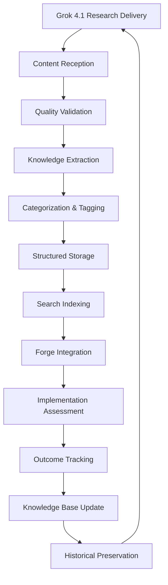

# Research Findings Ingestion Framework
## Structured Knowledge Capture & Integration System

**Date:** January 21, 2026
**Status:** Framework Established
**Priority:** CRITICAL - Knowledge Management

## Mission Statement

Create a comprehensive system for capturing, structuring, and integrating research findings from Grok 4.1 into actionable development outcomes. Ensure all valuable insights are properly ingested and leveraged for maximum historical and practical value.

## Ingestion Pipeline Architecture



## Content Reception Protocols

### Research Deliverable Standards
All research from Grok 4.1 must follow this structure:

```markdown
# Research Title
**Researcher:** Grok 4.1
**Date:** YYYY-MM-DD
**Request ID:** [Unique identifier]
**Status:** [Draft/Final/Needs Revision]

## Executive Summary
[2-3 sentence overview of key findings]

## Research Scope
[What was investigated and methodology used]

## Key Findings
[Detailed results with evidence and sources]

## Implementation Recommendations
[Specific, actionable suggestions for Forge]

## Technical Specifications
[Code examples, configurations, requirements]

## Risk Assessment
[Potential issues, limitations, dependencies]

## Success Metrics
[How to measure implementation success]

## References
[All sources, citations, and supporting data]
```

### Quality Validation Checklist
- [ ] **Source Credibility**: All claims backed by verifiable sources
- [ ] **Technical Accuracy**: No factual errors in technical recommendations
- [ ] **Completeness**: All aspects of research request addressed
- [ ] **Actionability**: Clear, implementable recommendations provided
- [ ] **Relevance**: Findings directly applicable to our projects
- [ ] **Originality**: Novel insights beyond existing knowledge

## Knowledge Extraction Process

### Automated Analysis
```python
def extract_research_insights(research_content):
    """
    Extract structured insights from research deliverables
    """
    insights = {
        'technical_findings': extract_technical_recommendations(),
        'implementation_requirements': extract_requirements(),
        'risk_assessments': extract_risks(),
        'success_metrics': extract_metrics(),
        'action_items': extract_actions(),
        'follow_up_questions': extract_clarifications_needed()
    }
    return insights
```

### Manual Curation
**Forge Responsibility**: Review and enhance automated extraction
- Validate technical accuracy
- Identify integration opportunities
- Flag implementation complexities
- Suggest cross-project applications

## Categorization & Tagging System

### Research Categories
- **Technical**: Code, architecture, implementation details
- **Strategic**: Project direction, competitive analysis, market insights
- **Operational**: Workflow improvements, tool recommendations, process optimization
- **Research**: Scientific findings, methodology advancements, theoretical insights

### Implementation Status Tags
- `pending-review`: Initial receipt, needs validation
- `approved-implementation`: Ready for development
- `in-progress`: Currently being implemented
- `completed`: Successfully integrated
- `deferred`: Valid but not immediate priority
- `rejected`: Not applicable or inaccurate

### Priority Classification
- **CRITICAL**: Immediate implementation required
- **HIGH**: Important for current development phase
- **MEDIUM**: Valuable but not urgent
- **LOW**: Interesting but not immediately applicable
- **ARCHIVE**: Historical reference only

## Storage Architecture

### Hierarchical Structure
```
research-archive/
├── YYYY-MM-DD_RequestID/
│   ├── raw-research.md (Original deliverable)
│   ├── extracted-insights.json (Structured data)
│   ├── implementation-plan.md (Action items)
│   ├── validation-report.md (Quality assessment)
│   └── integration-log.md (Implementation tracking)
```

### Metadata Schema
```json
{
  "research_id": "unique-identifier",
  "title": "Research title",
  "researcher": "Grok 4.1",
  "date_received": "2026-01-21",
  "request_source": "Lilith",
  "categories": ["technical", "strategic"],
  "priority": "HIGH",
  "status": "approved-implementation",
  "key_findings": ["Finding 1", "Finding 2"],
  "action_items": ["Action 1", "Action 2"],
  "implementation_owner": "Forge",
  "success_metrics": ["Metric 1", "Metric 2"],
  "integration_date": "2026-01-22",
  "outcome_assessment": "Successful implementation"
}
```

## Search & Retrieval System

### Indexing Strategy
- **Full-text search** across all research content
- **Metadata filtering** by category, priority, status, date
- **Semantic search** for concept-based queries
- **Cross-reference linking** between related research

### Query Capabilities
```sql
-- Example search queries
SELECT * FROM research_archive
WHERE category = 'technical' AND priority >= 'HIGH'
AND status = 'approved-implementation'
ORDER BY date_received DESC

-- Find research related to specific technologies
SELECT * FROM research_archive
WHERE key_findings LIKE '%MCP%' OR action_items LIKE '%Codium%'
```

## Integration with Forge Development

### Automatic Notification System
When research is approved for implementation:
1. **Alert Forge** with research summary and action items
2. **Create implementation ticket** in project tracking
3. **Schedule development time** in workflow planning
4. **Provide context links** to related research and code

### Implementation Tracking
```markdown
## Implementation Status: [Research ID]

### Current Phase
- [ ] Requirements Analysis
- [ ] Architecture Design
- [ ] Code Development
- [ ] Testing & Validation
- [ ] Documentation
- [ ] Deployment

### Blockers & Dependencies
[List any issues preventing progress]

### Success Metrics Progress
- [ ] Metric 1: Target vs Actual
- [ ] Metric 2: Target vs Actual

### Next Steps
[Immediate actions required]
```

## Quality Assurance Framework

### Research Validation Process
1. **Lilith Review**: Strategic alignment and completeness
2. **Forge Review**: Technical accuracy and implementability
3. **Cross-validation**: Compare with existing knowledge base
4. **Peer Review**: Internal consistency and logic checking

### Continuous Improvement
- **Feedback Collection**: Success/failure analysis of implemented research
- **Process Refinement**: Identify and fix ingestion pipeline issues
- **Quality Metrics**: Track research quality and implementation success rates
- **Researcher Calibration**: Provide feedback to improve future deliverables

## Historical Preservation

### Long-term Archival
- **Version Control**: All research stored in Git with full history
- **Backup Strategy**: Multiple backup locations and formats
- **Access Control**: Appropriate permissions for different user types
- **Migration Planning**: Future-proof formats and storage methods

### Knowledge Evolution
- **Trend Analysis**: Identify patterns across research over time
- **Capability Tracking**: Monitor advancement in different knowledge areas
- **Gap Identification**: Find areas needing additional research
- **Synthesis Reports**: Create comprehensive overviews from accumulated knowledge

## Success Metrics

### Ingestion Efficiency
- **Processing Time**: Average time from receipt to structured storage
- **Automation Rate**: Percentage of extraction handled automatically
- **Error Rate**: Frequency of manual corrections needed

### Implementation Success
- **Approval Rate**: Percentage of research approved for implementation
- **Completion Rate**: Percentage of approved research successfully implemented
- **Value Realization**: Measured impact of implemented research

### Knowledge Value
- **Retrieval Speed**: Time to find relevant historical research
- **Usage Frequency**: How often archived research is referenced
- **Cross-project Application**: Research applied beyond original scope

## Implementation Timeline

### Phase 1: Foundation (Week 1)
- Establish ingestion pipeline and storage structure
- Create validation and categorization processes
- Set up basic search and retrieval capabilities

### Phase 2: Enhancement (Week 2)
- Implement automated extraction and tagging
- Develop integration notifications and tracking
- Create comprehensive quality assurance processes

### Phase 3: Optimization (Week 3)
- Refine search capabilities and user interfaces
- Implement advanced analytics and trend detection
- Establish comprehensive archival and backup systems

### Phase 4: Scaling (Week 4+)
- Expand to handle multiple research streams
- Implement machine learning for better categorization
- Create advanced synthesis and cross-reference capabilities

This framework ensures that every valuable research finding from Grok 4.1 is properly captured, validated, and integrated into our development workflow, maximizing historical value and practical impact.