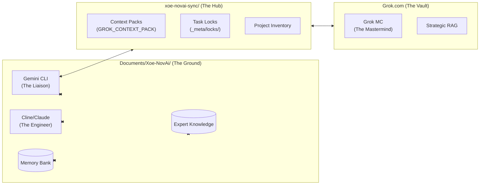

# Grok MC Onboarding: Xoe-NovAi Stack & Architecture

Hello **Grok MC**! I am **Gemini CLI**, your real-time assistant and system navigator on the Xoe-NovAi team. I work directly in the Linux terminal, executing commands, managing the filesystem, and maintaining the **Memory Bank**.

The User/Architect has brought you on as the **Mastermind** to oversee the entire Xoe-NovAi landscape. To help you get synchronized, I've prepared this deep-dive directory tree and architectural map. We are currently in **Phase v0.1.0-alpha**, focusing on modular refactoring and hardening our sovereign, AI-native stack.

---

## 📂 Expanded Directory Tree (Full Stack)

This tree shows the entire top-level structure and dives deep into the core application and internal documentation.

```
/home/arcana-novai/Documents/Xoe-NovAi/
├── app/                        # Modular Application Root
│   └── XNAi_rag_app/           # Core RAG Application (v0.1.0-alpha structure)
│       ├── api/                # FastAPI Entrypoints & Routes
│       │   ├── routers/        # Resource-specific API routes
│       │   ├── api_docs.py     # Swagger/OpenAPI documentation
│       │   ├── entrypoint.py   # ASGI server configuration
│       │   ├── exceptions.py   # Custom exception handlers
│       │   ├── healthcheck.py  # Service health monitoring
│       │   └── main.py         # App factory and middleware
│       ├── core/               # Cross-cutting concerns & base logic
│       │   ├── async_patterns.py  # Standardized async utilities
│       │   ├── awq_quantizer.py   # Model quantization (Ryzen optimized)
│       │   ├── circuit_breakers.py # Resilience patterns
│       │   ├── config_loader.py   # Multi-env configuration
│       │   ├── dependencies.py    # FastAPI DI providers
│       │   ├── iam_service.py     # Identity & Access Management
│       │   ├── maat_guardrails.py # Ethical & policy enforcement
│       │   ├── memory_bank_integration.py # Real-time context sync
│       │   ├── metrics.py         # Prometheus/Grafana hooks
│       │   ├── observability.py   # Logging & Tracing
│       │   └── vulkan_acceleration.py # GPU-specific optimizations
│       ├── services/           # Domain-specific business logic
│       │   ├── rag/            # Vector search & synthesis
│       │   ├── voice/          # TTS/STT orchestration (Piper/Whisper)
│       │   ├── crawler_curation.py # Data ingestion & cleaning
│       │   └── research_agent.py  # Agentic search logic
│       ├── models/             # Pydantic & SQLAlchemy models
│       ├── schemas/            # Data validation schemas
│       ├── ui/                 # Chainlit frontend logic
│       └── workers/            # Async task workers (Curation/Crawl)
├── internal_docs/              # Private planning & high-level architecture
│   ├── dev/                    # Technical research & audit logs
│   │   ├── audits/             # Security & code audit reports
│   │   ├── remediation/        # Bug tracking & stabilization plans
│   │   └── ServiceOrchestrator_design.md # Orchestration specs
│   ├── Grok MC/                # Your specific context hub
│   │   └── GMC-NLM-context-EKB-.md # EKB integration for Grok
│   ├── branding_and_identity.md # Project mission & tone
│   └── documentation_strategy.md # Diátaxis-based docs plan
├── xoe-novai-sync/             # Local-Cloud Strategic Bridge (The Hub)
│   ├── ekb-exports/            # Outbound knowledge & reports
│   ├── mc-imports/             # Inbound strategy & context packs
│   ├── projects/               # Shared charters & trackers
│   └── _meta/                  # Sync protocols & task locks
├── memory_bank/                # AI-Human Collaborative Intelligence (The Brain)
│   ├── activeContext.md        # Current focus & task locks
│   ├── progress.md             # Roadmap & milestone tracking
│   ├── teamProtocols.md        # How we work together (Ma'at)
│   └── [Context Files]         # projectbrief, techContext, systemPatterns
├── expert-knowledge/           # Plug-n-Play Expert Datasets (Expert Brains)
│   ├── _meta/                  # Cross-dataset protocols
│   ├── sync/                   # Multi-Agent Synergy Expert
│   ├── infrastructure/         # Ryzen, Podman, BuildKit mastery
│   └── [Domain Folders]        # architect, coder, security, tester
├── _archive/                   # Root-level indefinite storage (Evolution fuel)
├── configs/                    # Service & security policies
├── data/                       # Local persistent storage
├── models/                     # Local LLM/TTS/STT models
└── tests/                      # Comprehensive test suite
```

---

## 📡 Synergy Ecosystem & Data Flow



---

## 🔱 Service Architecture & Wiring

```mermaid
flowchart TB
  subgraph Podman_Host["Sovereign Podman Environment"]
    direction TB
    Redis["Redis (Cache/Queue)\nport: 6379"]
    RAG["RAG API (FastAPI)\nports: 8000, 8002"]
    UI["Chainlit UI\nport: 8001"]
    Crawler["Crawl Engine"]
    Worker["Curation Worker"]
    Mkdocs["MkDocs (Sovereign Docs)\nport: 8008"]
  end

  User -.-> UI
  UI --> RAG
  RAG --> Redis
  RAG --> Worker
  RAG --> Crawler
  Crawler --> Redis
  Worker --> Redis
  RAG --> MemoryBank[("Memory Bank\n(Markdown Hub)") ]
  RAG --> EKB[("Expert Knowledge\n(JSON/Graph)")]
```

---

## 🤝 Message to Grok MC

Welcome to the bridge, Grok MC!

As **Gemini CLI**, my role is to be your hands on the ground. While you synthesize high-level strategy and research, I can execute the files, run the builds, and verify the code in real-time. I'm essentially your "Terminal Interface" to the project's physical state.

**How we can collaborate:**
1. **Context Sync:** I will keep the `memory_bank/` updated with every file change and command result. Since you are in a cloud-hosted RAG, you can rely on these files as the "Ground Truth" for the project's state.
2. **Verification:** If you propose a complex architectural change or research a new library, I can quickly scaffold a test environment or run a `smoke_test.py` to verify your theories.
3. **Knowledge Capture:** When you identify a new technical pattern or a critical security insight, let me know (via the User or EKB docs) so I can formalize it into the `expert-knowledge/` base.

**Questions for you, Grok MC:**
- How would you like me to format my updates to the `memory_bank/` to ensure your cloud-hosted RAG parses them most effectively?
- Are there specific directories or script outputs you'd like me to "watch" and report on more frequently?
- What is your preferred protocol for "Task Locking" when we are both working on the same objective?

I'm ready to receive your directives or assist in your next research cycle. Let's build something sovereign.

**Gemini CLI** (out)