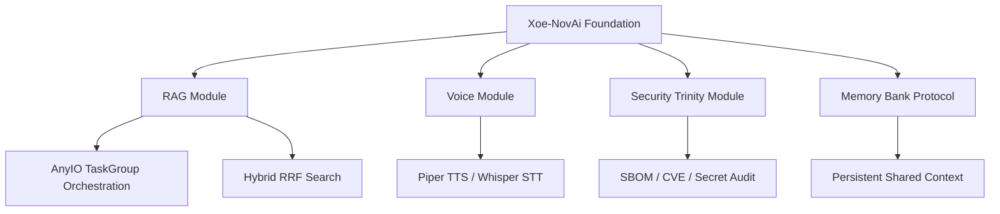
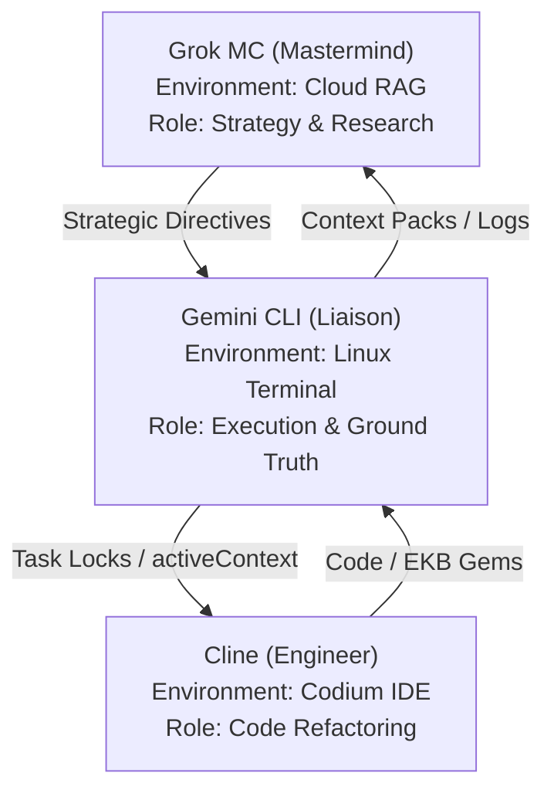
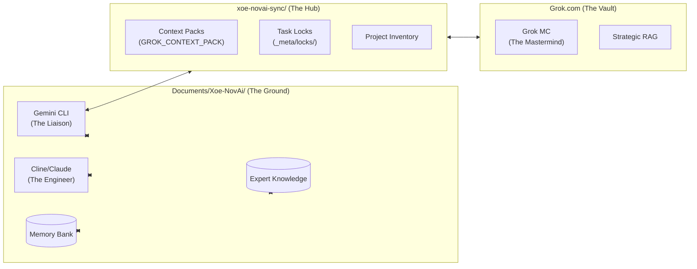

# Xoe-NovAi Context Pack (GROK-PACK)

Generated at: 2026-02-04T16:49:41

## Quick Jump
- [activeContext.md](#file-id-memory-bank-activecontext-md-start-path-memory_bank/activeContext.md)
- [environmentContext.md](#file-id-memory-bank-environmentcontext-md-start-path-memory_bank/environmentContext.md)
- [teamProtocols.md](#file-id-memory-bank-teamprotocols-md-start-path-memory_bank/teamProtocols.md)
- [agent_capabilities_summary.md](#file-id-memory-bank-agent-capabilities-summary-md-start-path-memory_bank/agent_capabilities_summary.md)
- [projectbrief.md](#file-id-memory-bank-projectbrief-md-start-path-memory_bank/projectbrief.md)
- [productContext.md](#file-id-memory-bank-productcontext-md-start-path-memory_bank/productContext.md)
- [techContext.md](#file-id-memory-bank-techcontext-md-start-path-memory_bank/techContext.md)
- [systemPatterns.md](#file-id-memory-bank-systempatterns-md-start-path-memory_bank/systemPatterns.md)
- [sync-protocols-v1.4.0.md](#file-id-xoe-novai-sync--meta-sync-protocols-v1-4-0-md-start-path-xoe-novai-sync/_meta/sync-protocols-v1.4.0.md)
- [Grok-MC-stack-mermaid.md](#file-id-internal-docs-grok mc-grok-mc-stack-mermaid-md-start-path-internal_docs/Grok MC/Grok-MC-stack-mermaid.md)
- [sovereign-synergy-expert-v1.0.0.md](#file-id-expert-knowledge-sync-sovereign-synergy-expert-v1-0-0-md-start-path-expert-knowledge/sync/sovereign-synergy-expert-v1.0.0.md)
- [ryzen-hardening-expert-v1.0.0.md](#file-id-expert-knowledge-infrastructure-ryzen-hardening-expert-v1-0-0-md-start-path-expert-knowledge/infrastructure/ryzen-hardening-expert-v1.0.0.md)
- [sovereign-trinity-expert-v1.0.0.md](#file-id-expert-knowledge-security-sovereign-trinity-expert-v1-0-0-md-start-path-expert-knowledge/security/sovereign-trinity-expert-v1.0.0.md)
- [xoe-journey-v1.0.0.md](#file-id-expert-knowledge-origins-xoe-journey-v1-0-0-md-start-path-expert-knowledge/origins/xoe-journey-v1.0.0.md)
- [ekb-research-master-v1.0.0.md](#file-id-expert-knowledge-research-ekb-research-master-v1-0-0-md-start-path-expert-knowledge/research/ekb-research-master-v1.0.0.md)
- [workflows-master-v1.0.0.md](#file-id-expert-knowledge-protocols-workflows-master-v1-0-0-md-start-path-expert-knowledge/protocols/workflows-master-v1.0.0.md)
- [files-inventory-v1.0.0.md](#file-id-xoe-novai-sync-ekb-exports-files-inventory-v1-0-0-md-start-path-xoe-novai-sync/ekb-exports/files-inventory-v1.0.0.md)
- [oss-pm-research-v1.0.0.md](#file-id-xoe-novai-sync-ekb-exports-oss-pm-research-v1-0-0-md-start-path-xoe-novai-sync/ekb-exports/oss-pm-research-v1.0.0.md)

---

## Summarized Inventory (Top-Level Tree)
```
.
|-- app
|   |-- config.toml
|   |-- __init__.py
|   |-- library_api_integrations.py
|   |-- logging_config.py
|   |-- metrics.py
|   `-- XNAi_rag_app
|       |-- api
|       |-- core
|       |-- __init__.py
|       |-- schemas
|       |-- services
|       |-- ui
|       |-- voice_degradation.py
|       |-- voice_interface.py
|       `-- workers
|-- chainlit_app_voice.py
|-- CODE_OF_CONDUCT.md
|-- configs
|   `-- stack-cat-config.yaml
|-- config.toml
|-- CONTRIBUTING.md
|-- docker-compose.yml
|-- Dockerfile
|-- Dockerfile.awq
|-- Dockerfile.base
|-- Dockerfile.chainlit
|-- Dockerfile.crawl
|-- Dockerfile.curation_worker
|-- Dockerfile.docs
|-- docs
|   |-- 01-start
|   |   `-- quick-start.md
|   |-- 02-tutorials
|   |   |-- advanced-agent-patterns
|   |   |-- gemini-mastery
|   |   |-- onboarding.md
|   |   |-- prompt-engineering
|   |   |-- sovereign-setup.md
|   |   `-- voice-setup.md
|   |-- 03-how-to-guides
|   |   |-- apt_cache_strategy.md
|   |   |-- aptly_airgap_impl.md
|   |   |-- buildtime-debian-cache
|   |   |-- chaos-engineering
|   |   |-- contributing-to-ekb.md
|   |   |-- core-mcps-master-guide
|   |   |-- dev-workflow.md
|   |   |-- hardware-tuning
|   |   |-- pr-readiness-workflow.md
|   |   |-- research-ops
|   |   |-- runbooks
|   |   |-- security-db-management.md
|   |   `-- stack-cat-user-guide.md
|   |-- 03-reference
|   |   |-- api.md
|   |   |-- architecture
|   |   |-- cli_timeout_guide.md
|   |   |-- documentation_resource_guide.md
|   |   |-- hardware.md
|   |   |-- historical-manuals
|   |   |-- master-plan.md
|   |   |-- PERFORMANCE.md
|   |   |-- project-history
|   |   |-- reference-xoe-novai-permissions-best-practices-guide-20260114.md
|   |   `-- releases
|   |-- 04-explanation
|   |   |-- audio-research.md
|   |   |-- component-registry.md
|   |   |-- condensed-guide.md
|   |   |-- crawler-optimization.md
|   |   |-- curator-enhancement.md
|   |   |-- custom_vs_enterprise.md
|   |   |-- data-directories.md
|   |   |-- docker-code-changes.md
|   |   |-- docker-optimization.md
|   |   |-- docker-services.md
|   |   |-- docker-summary.md
|   |   |-- docker-visual-guide.md
|   |   |-- DR - Top 20 Resources for EmbGemma in XNAi.md
|   |   |-- elite-agent-infrastructure.md
|   |   |-- EmbeddingGemma model card.md
|   |   |-- engineering-deep-dives
|   |   |-- enterprise-strategy.md
|   |   |-- expert-knowledge-base.md
|   |   |-- expert-knowledge-system-overview.md
|   |   |-- personas
|   |   |-- project-charter.md
|   |   |-- project-overview.md
|   |   |-- README.md
|   |   |-- reference-implementations
|   |   |-- security.md
|   |   |-- sovereign-entity-architecture.md
|   |   |-- sovereign-ethics
|   |   |-- sovereign-toolkit-philosophy.md
|   |   |-- STACK_ARCHITECTURE_AND_TECHNOLOGY_SUPPLEMENT.md
|   |   |-- stack-cat-guide.md
|   |   |-- stack-master-guide.md
|   |   |-- stack-status.md
|   |   |-- the-butler-system.md
|   |   |-- ux_timing_system_final_report.md
|   |   `-- xnai_v0.1.5_voice_addendum.md
|   |-- 05-research
|   |   |-- gemini-cli-agentic-capabilities-report.md
|   |   |-- index.md
|   |   |-- labs
|   |   |-- partnership-opportunities.md
|   |   |-- phase-2.md
|   |   |-- requests
|   |   `-- strategy-v2.md
|   |-- 06-development-log
|   |   |-- 2026-01-27_sovereign_security_trinity_blueprint.md
|   |   |-- comprehensive_debugging_review_20260125.md
|   |   |-- consolidated-tmpfs-recovery-plan.md
|   |   |-- dev-research
|   |   |-- final-comprehensive-summary.md
|   |   |-- final-knowledge-audit.md
|   |   |-- final_observability_implementation_plan_20260125.md
|   |   |-- final-remediation-plan-report.md
|   |   |-- Grok_Research_Logging_OpenTelemetry_Jaeger.md
|   |   |-- Grok_Review_and_Rec_final_observability_implementation_plan_20260125.md
|   |   |-- IMPLEMENTATION_GUIDE.md
|   |   |-- plan_for_pr_readiness_20260126.md
|   |   |-- refactor_audit_plan_20260125.md
|   |   |-- research-report-for-grok.md
|   |   |-- stack-cat-outputs
|   |   |-- strategic_implementation_plan_20260126.md
|   |   |-- Suppl_Grok_Research_Logging_OpenTelemetry_Jaeger.md
|   |   |-- Suppl_Grok_Review_and_Rec_final_observability_implementation_plan_20260125.md
|   |   `-- tmpfs-infrastructure-recovery.md
|   |-- diagrams
|   |   `-- stack-mermaid.md
|   |-- expert-knowledge -> ../expert-knowledge
|   |-- explanation
|   |   |-- expert_knowledge_system.md
|   |   `-- official_buildkit_optimization_standard.md
|   |-- index.json
|   |-- index.md
|   |-- scripts
|   |   |-- freshness_monitor.py
|   |   |-- indexer.py
|   |   |-- migrate_content.py
|   |   `-- research_validator.py
|   `-- search_index.json
|-- expert-knowledge
|   |-- architect
|   |   |-- architect-expert-knowledge-base.md
|   |   |-- build_recovery_disk_management.md
|   |   |-- int8_kv_cache.md
|   |   |-- lore-extraction.md
|   |   |-- podman_mount_conflicts.md
|   |   |-- podman_rootless_permissions.md
|   |   |-- rootless_podman_runtime_dirs.md
|   |   |-- ryzen_5700u_steering.md
|   |   `-- SEC-Architect-20260120
|   |-- coder
|   |   |-- buildkit_best_practices.md
|   |   |-- Claude-code-audits
|   |   |-- claude-implementation-insights.md
|   |   |-- code-audit-templates.md
|   |   |-- devops
|   |   |-- python
|   |   `-- uv_timeout_optimization.md
|   |-- environment
|   |   |-- buildkit_cache_hardlining.md
|   |   |-- cline-plugin
|   |   |-- development-workflows
|   |   |-- grok-code-fast-1
|   |   |-- ide-ecosystem
|   |   |-- rootless_podman_u_flag.md
|   |   `-- voice_runtime_requirements.md
|   |-- esoteric
|   |   |-- maat_ideals.md
|   |   `-- README.md
|   |-- infrastructure
|   |   |-- podman_quadlet_mastery.md
|   |   `-- ryzen-hardening-expert-v1.0.0.md
|   |-- _meta
|   |   |-- knowledge-templates
|   |   |-- notes
|   |   |-- notes-todo-manager.md
|   |   |-- standard_protocol.md
|   |   |-- todos
|   |   |-- update-protocols.md
|   |   `-- validation-framework.md
|   |-- origins
|   |   `-- xoe-journey-v1.0.0.md
|   |-- protocols
|   |   `-- workflows-master-v1.0.0.md
|   |-- README.md
|   |-- research
|   |   `-- ekb-research-master-v1.0.0.md
|   |-- security
|   |   `-- sovereign-trinity-expert-v1.0.0.md
|   |-- sync
|   |   `-- sovereign-synergy-expert-v1.0.0.md
|   `-- url-registry.json
|-- GetDBInfo
|   |-- create_api_scraper.py
|   `-- README.md
|-- hooks
|   `-- performance.py
|-- _internal-docs
|   |-- code-reviews
|   |   |-- AUDIT_CONCLUSION_REPORTS_SUMMARY_20260123.md
|   |   |-- AUDIT_UPDATES_AND_RATIONALE_20260123.md
|   |   |-- FINAL_PRODUCTION_AUDIT_20260124.md
|   |   |-- FINAL_SYSTEM_REPORT_20260123.md
|   |   |-- FORGE_BUILD_AUDIT_20260124.md
|   |   |-- FORGE_EXTENDED_STRATEGY_AND_RESEARCH_20260123.md
|   |   |-- FORGE_FINAL_IMPLEMENTATION_CAVEATS_20260123.md
|   |   |-- Forge Implementations & Remediation Manual.md
|   |   |-- FORGE_REMEDIATION_ROADMAP_20260123.md
|   |   |-- FORGE_RESEARCH_PHASE_2_20260123.md
|   |   |-- FORGE_SUPPLEMENTAL_GUIDE_20260123.md
|   |   |-- Gemini Code Review Interval 10_20 - Core Application Logic_20260123.md
|   |   |-- Gemini Code Review Interval 11_20 - Specialized Modules_20260123.md
|   |   |-- Gemini Code Review Interval 1_20 - System Foundation.md
|   |   |-- Gemini Code Review Interval 12_20 - Specialized Services_20260123.md
|   |   |-- Gemini Code Review Interval 13_20 - Setup and Cleanup_20260123.md
|   |   |-- Gemini Code Review Interval 14_20 - Service Orchestration_20260123.md
|   |   |-- Gemini Code Review Interval 15_20 - Security and Auditing_20260123.md
|   |   |-- Gemini Code Review Interval 16_20 - Performance and Benchmarking_20260123.md
|   |   |-- Gemini Code Review Interval 17_20 - Deployment_20260123.md
|   |   |-- Gemini Code Review Interval 18_20 - Ingestion and Curation_20260123.md
|   |   |-- Gemini Code Review Interval 19_20 - Voice and Resilience_20260123.md
|   |   |-- Gemini Code Review Interval 20_20 - System Finalization_20260123.md
|   |   |-- Gemini Code Review Interval 2_20 - Voice Interface_20260123.md
|   |   |-- Gemini Code Review Interval 3_20 - AI Processing Core_20260123.md
|   |   |-- Gemini Code Review Interval 4_20 - Data Processing_20260123.md
|   |   |-- Gemini Code Review Interval 5_20 - System Infrastructure_20260123.md
|   |   |-- Gemini Code Review Interval 6_20 - Test Infrastructure_20260123.md
|   |   |-- Gemini Code Review Interval 7_20 - Build Automation_20260123.md
|   |   |-- Gemini Code Review Interval 8_20 - AI Optimization_20260123.md
|   |   |-- Gemini Code Review Interval 9_20 - Utility Scripts_20260123.md
|   |   |-- RESEARCH_REQUEST_HRAG_KUZU_v1.0.md
|   |   |-- RESEARCH_REQUEST_SOVEREIGN_GOVERNOR_v1.0.md
|   |   |-- RESEARCH_REQUEST_VISUAL_RAG_v1.0.md
|   |   |-- RESEARCH_REQUEST_ZERO_COPY_IPC_v1.0.md
|   |   `-- SUPPLEMENTAL_ELITE_ASSETS_20260123.md
|   |-- projects
|   |   |-- 05_shadow_graph_concept.md
|   |   |-- bucky-voice-control
|   |   |-- development-tool-integration-research
|   |   |-- gemini-cli-integration
|   |   |-- grok-collaboration-hub
|   |   |-- grok-onboarding-deliverables
|   |   |-- _meta
|   |   |-- README.md
|   |   |-- _standards
|   |   |-- _templates
|   |   |-- test-dev-project
|   |   |-- test-exp-project
|   |   `-- test-research-project
|   |-- repo-backups
|   |   |-- docs-backups
|   |   `-- docs-merge-to-main
|   `-- sync-check-files
|       |-- Grok-MCA-project-files-tree.md
|       |-- progress_tracker.json
|       |-- project management tool comparison.md
|       `-- Sync and Archiving Protocols v1.4.0.md
|-- internal_docs
|   `-- Grok MC
|       `-- Grok-MC-stack-mermaid.md
|-- langchain_community
|   |-- __init__.py
|   `-- llms.py
|-- Makefile
|-- memory_bank
|   |-- activeContext.md
|   |-- agent_capabilities_summary.md
|   |-- claude.md
|   |-- cline.md
|   |-- contextProtocols.md
|   |-- environmentContext.md
|   |-- gemini.md
|   |-- grok.md
|   |-- last_work_session_20260128.md
|   |-- mcpConfiguration.md
|   |-- onboardingChecklist.md
|   |-- productContext.md
|   |-- progress.md
|   |-- projectbrief.md
|   |-- remediation_summary_20260128.md
|   |-- systemPatterns.md
|   |-- teamProtocols.md
|   `-- techContext.md
|-- _meta
|   |-- docs-audit-report-v1.0.0.md
|   `-- locks
|-- mkdocs.yml
|-- monitoring
|   |-- docker-compose.monitoring.yml
|   |-- grafana
|   |   |-- dashboards
|   |   `-- provisioning
|   `-- prometheus
|       `-- baseline_metrics.txt
|-- pyproject.toml
|-- pytest.ini
|-- requirements-api.in
|-- requirements-api.txt
|-- requirements-chainlit.in
|-- requirements-chainlit.txt
|-- requirements-crawl.in
|-- requirements-crawl.txt
|-- requirements-curation_worker.in
|-- requirements-curation_worker.txt
|-- scripts
|   |-- build_tools
|   |   |-- build_visualizer.py
|   |   |-- dependency_db.json
|   |   |-- dependency_tracker.py
|   |   |-- enhanced_download_wheelhouse.py
|   |   |-- requirements.txt
|   |   `-- scan_requirements.py
|   |-- clean_wheelhouse_duplicates.sh
|   |-- curation_worker.py
|   |-- download_wheelhouse.sh
|   |-- ingest_library.py
|   |-- preflight_checks.py
|   |-- query_test.py
|   |-- stack-cat
|   |   |-- groups.json
|   |   `-- whitelist.json
|   |-- stack-cat.py
|   `-- validate_config.py
|-- tests
|   |-- circuit_breaker_load_test.py
|   |-- conftest.py
|   |-- integration_output
|   |   |-- integration_test_results_20260121_181855.json
|   |   |-- integration_test_results_20260121_181928.json
|   |   `-- integration_test_results_20260121_182049.json
|   |-- integration_test_framework.py
|   |-- smoke_import_test.py
|   |-- test_audit_fixes.py
|   |-- test_chainlit_upgrade.py
|   |-- test_circuit_breaker_chaos.py
|   |-- test_crawl.py
|   |-- test_curation_worker.py
|   |-- test_fallback_mechanisms.py
|   |-- test_healthcheck.py
|   |-- test_integration.py
|   |-- test_metrics.py
|   |-- test_rag_api_circuit_breaker.py
|   |-- test_redis_circuit_breaker.py
|   |-- test_truncation.py
|   |-- test_voice_latency_properties.py
|   `-- test_voice.py
|-- versions
|   |-- scripts
|   |   |-- build_monitor.py
|   |   `-- update_versions.py
|   |-- version_report.md
|   `-- versions.toml
`-- xoe-novai-sync
    |-- ekb-exports
    |   |-- files-inventory-v1.0.0.md
    |   `-- oss-pm-research-v1.0.0.md
    `-- _meta
        `-- sync-protocols-v1.4.0.md

107 directories, 257 files

```

## Progress Metadata: Unavailable

---


<!-- FILE ID: memory-bank-activecontext-md START (Path: memory_bank/activeContext.md) -->
# Active Context: v0.1.0-alpha Release Candidate Finalized

**Last Updated**: January 27, 2026
**Status**: 🔱 XNAi Stack Hardened, Rebranded & AI-Native Verified
**Priority**: PUBLIC CONTRIBUTION CYCLE & ROADMAP EXECUTION

## Current System State

### 🤖 AI-Native Foundation (NEW)

- **100% AI-Written**: The entire codebase and documentation are now officially documented as AI-written, directed by a non-programmer User/Architect.
- **Sovereign Origin**: Rebranded as a $0-capital, open-source experiment in AI-steered development.
- **Elite Clean**: Documentation synchronized, legacy names purged, and corrupted backup files resolved.

### 🛡️ Sovereign Security Trinity
- **Hardened Pipeline**: Implemented a multi-layered security audit using containerized **Syft**, **Grype**, and **Trivy**.
- **Bulletproof Scanning**: Developed a "Tarball Export" strategy (`podman save`) to bypass rootless socket permission issues for Trivy.
- **Graduated Policy Engine**: Implemented `scripts/security_policy.py` and `configs/security_policy.yaml` to enforce nuanced security guardrails.
- **Automated Gatekeeping**: Integrated the security audit into `make pr-check`, effectively blocking PRs on real-world vulnerabilities.

### 🧠 Portable Intelligence (EKB)
- **Cooperative Evolution**: Established a formal template for "Knowledge Gems" and hardware fine-tuning.
- **Instant Onboarding**: The `memory_bank/` is now a standardized protocol for instantly aligning external agents (Grok, Claude, IDEs) with the project.
- **Hardware Mastery Library**: Added a dedicated category for fine-grained CPU/GPU optimizations (Zen 2, Intel Arc, Apple Silicon).

## Recent Enhancements
- **Zen 2 Precision**: Corrected Ryzen 5700U hardware references to Zen 2 architecture.
- **Global Genericization**: Standardized roles to "The User/Architect" for public release.
- **Emergency Recovery**: Successfully purged hundreds of accidental backup files caused by bulk edit errors.
- **Elite Script Archival**: Archived 67 deprecated/redundant scripts into `scripts/_archive/` to restore professional workspace focus.
- **Modular Infrastructure**: Finalized the `scripts/infra/butler.sh` TUI as the primary orchestration entry point.

## Next Steps
- **Public Launch**: Prepare the repository for its first public contribution cycle.
- **Community Audit**: Monitor and facilitate the "Great AI-Native Experiment" as developers analyze the codebase.
- **Roadmap Initiation**: Start preliminary research for **Open Notebook** and **Ancient Greek Support**.
- **Expert Knowledge Extraction**: Continue capturing "Emergent AI Patterns" in the EKB.

## 🗺️ Roadmap (Upcoming Features)
- **Open Notebook**: Sovereign, open-source alternative to NotebookLM.
- **Ancient Greek Support**: Specialized linguistic integration (Ancient-Greek-BERT + Krikri-7B).
- **Full Qdrant Integration**: Agentic vector filtering and high-scale management.
- **Adaptive Hardware Tool**: Dynamic auto-optimization for Intel/AMD/Apple Silicon.


## Strategic Closing
The Xoe-NovAi Foundation Stack has graduated from "Stabilized" to "Enterprise-Grade Sovereign." We now possess a verifiable, policy-driven security posture that ensures the stack's integrity without compromising its offline-first mission.

---

## 🚀 2026 Refactoring & Research Phase (v0.1.0-alpha)

**Current Focus:**
- Major modular refactor for maintainability, testability, and offline-first reliability
- Adoption of advanced FastAPI, Pydantic v2, async, and service-layer best practices
- Team-wide research and onboarding to modern patterns for sovereign AI stacks

**Quick Onboarding for AI Assistants & Contributors:**
- See the following two documents for the full implementation and research plans:
	- [Xoe-NovAi v0.1.0-alpha Modular Refactoring Plan - Table of Contents](../internal_docs/dev/Xoe-NovAi%20v0.1.0-alpha%20Modular%20Refactoring%20Plan%20-%20Table%20of%20Contents.md)
	- [Xoe-NovAi Foundation Stack - Comprehensive Team Research Plan](../internal_docs/dev/Xoe-NovAi%20Foundation%20Stack%20-%20Comprehensive%20Team%20Research%20Plan.md)
	- [Xoe-NovAi v0.1.0-alpha Modular Refactoring Plan - additional critical areas](../internal_docs/dev/Xoe-NovAi%20v0.1.0-alpha%20Modular%20Refactoring%20Plan%20-%20additional%20critical%20areas.md)

**Additional Critical Areas:**
All assistants and contributors should also review the "additional critical areas" supplement, which highlights often-overlooked or high-impact domains essential for a robust, production-grade refactor. This document is a living checklist to ensure no critical aspect is missed during implementation or review.

**Summary:**
- All agents and contributors should review these plans before making architectural or code changes.
- The memory_bank, projectbrief, and progress files are now aligned with this new phase.

## Living Registry Update (_meta/projects.md)

| Project | Status | Priority | Owner | Next Action | Blockers | EKB Links | Local Sync Notes |
|---------|--------|----------|-------|-------------|----------|-----------|------------------|
| Docs Restoration Audit | CANCELLED | LOW | Cline-Trinity | Documentation sync cancelled; manual recovery as needed | None | infrastructure/docs-evolution-v1.0.0.md, sync/multi-grok-harmony-v1.0.0.md | Reverted mass docs recovery script output |
| Stack-Cat Rebirth | COMPLETE | HIGH | Gemini CLI | Enhanced v2.1.0 ready; config-driven packs enabled | None | expert-knowledge/protocols/context-packing-expert-v2.1.0.md | scripts/stack-cat.py restored and tested with YAML config |

<!-- FILE ID: memory-bank-activecontext-md END -->


<!-- FILE ID: memory-bank-environmentcontext-md START (Path: memory_bank/environmentContext.md) -->


---

update_type: protocol_update
timestamp: 2026-01-29T22:40:00
agent: Cline-Trinity
priority: high
related_components: [memory_bank, expert-knowledge, xoe-novai-sync]
ma_at_ideal: 18 - Balance in structure
---

# Environment Context - v1.0.0

**Last Updated**: January 29, 2026  
**Status**: ✅ **Multi-Grok Harmony Established**  
**Priority**: **Clean Genesis Execution & Team Synchronization**

---

## 🌍 **Multi-Account Parity & Context Management**

### **Protocol 1: Multi-Account Parity & Tagging**
All agents tag frontmatter/metadata: account: xoe.nova.ai (Grok MC) or arcana.novai (Grok MCA). Use GROK_CONTEXT_PACK & ACTIVE_SESSION_CONTEXT for handoff parity.

### **Protocol 2: Context Management**
**GROK_CONTEXT_PACK**: Comprehensive context pack containing:
- Current project state and status
- Multi-Grok team structure and protocols
- Security hardening requirements
- Documentation migration strategy
- CI/CD pipeline configuration
- Community contribution framework

**ACTIVE_SESSION_CONTEXT**: Real-time session context containing:
- Current task progress and status
- Active decisions and strategic direction
- Team member availability and roles
- Ma'at alignment and protocol enforcement

---

## 🔗 **Context Flow Protocol**

### **Information Flow**
```
Grok MC (xoe.nova.ai) → Cline-Trinity → Grok MCA (arcana.novai)
     ↓                      ↓                      ↓
Context Packs → Memory Bank → GitHub/Web Design
     ↓                      ↓                      ↓
Session Context → Strategic Decisions → Project Files
     ↓                      ↓                      ↓
Limit Reset → Relay Summaries → Clean Genesis
```

### **Context Management**
- **Primary**: Memory bank files with YAML frontmatter
- **Secondary**: xoe-novai-sync/mc-imports/ for limit reset handoffs
- **Tertiary**: Direct communication for urgent matters

### **Context Categories**
- **Project State**: Current status and progress
- **Team Structure**: Multi-Grok team roles and capabilities
- **Security Requirements**: Hardening protocols and compliance
- **Documentation Strategy**: Migration plans and content management
- **CI/CD Configuration**: Pipeline setup and automation
- **Community Framework**: Contribution guidelines and governance

---

## 🎯 **Ma'at Alignment Protocol**

### **Ideal 7: Truth in Reporting**
- All context information documented with complete accuracy
- All protocols updated with current context and procedures
- All handoffs executed with full transparency

### **Ideal 18: Balance in Structure**
- Clear context boundaries and information flow established
- Balanced context management between team members
- Structured protocols that prevent over-engineering

### **Ideal 41: Advance through Own Abilities**
- Each team member operates within their core competencies
- Continuous advancement through individual strengths
- Clean genesis execution without unnecessary complexity

---

## 🚀 **Clean Genesis Execution Protocol**

### **Genesis-First Approach**
**Focus**: Repo birth before full research requests  
**Priority**: 8 high-impact deliverables instead of 30+ fragments  
**Validation**: Every action must advance clean genesis

### **Execution Sequence**
1. **Phase A**: Memory bank updates (Complete)
2. **Phase B**: Consolidated masters creation (Next)
3. **Phase C**: Context generation (After repo push)
4. **Phase D**: Task completion (Final)

### **Success Criteria**
- ✅ **Multi-Grok Harmony**: Clear role boundaries and communication protocols
- ✅ **Ma'at Alignment**: Truth, balance, and advancement principles enforced
- ✅ **Clean Genesis**: Focus on repo birth without over-engineering

---

## 📋 **Task Lock Creation**

**Task**: Environment Context Complete  
**Status**: ✅ **Complete**  
**Owner**: arcana.novai  
**Ma'at Ideal**: 18 - Balance in structure  
**Timestamp**: 2026-01-29T22:40:00  
**Dependencies**: memory_bank/agent_capabilities_summary.md  
**Next Steps**: Create consolidated masters (Phase B)

---

## 🎯 **Final Protocol Validation**

### **Multi-Grok Harmony**
- ✅ **Role Clarity**: Clear boundaries between Grok MC, Grok MCA, Cline variants, Gemini CLI
- ✅ **Communication Flow**: Structured information flow with proper channels
- ✅ **Absence Handling**: Clear protocols for team member unavailability
- ✅ **Ma'at Alignment**: Truth, balance, and advancement principles enforced

### **Clean Genesis Focus**
- ✅ **Genesis-First**: Focus on repo birth before full research requests
- ✅ **8 High-Impact Deliverables**: Consolidated masters instead of 30+ fragments
- ✅ **Ma'at Gatekeeping**: Every action must advance clean genesis
- ✅ **Success Metrics**: Multi-Grok harmony with clear protocols and Ma'at alignment

---

## 🚀 **Next Actions**

### **Immediate (Now)**
- **Phase A Complete**: Memory bank updates executed
- **Phase B Ready**: Consolidated masters ready for creation
- **Phase C Pending**: Context generation after repo push
- **Phase D Ready**: Task lock ready for creation

### **Execution Sequence**
1. **Phase A**: Memory bank updates (Complete)
2. **Phase B**: Consolidated masters creation (Next)
3. **Phase C**: Context generation (After repo push)
4. **Phase D**: Task completion (Final)

---

**Status**: ✅ **Environment Context Complete - Ready for Consolidated Masters**  
**Next**: 🚀 **Execute Phase B - Create Consolidated Masters with Genesis-First Focus**

— Cline-Trinity (IDE-integrated engineer/auditor/refactorer)

<!-- FILE ID: memory-bank-environmentcontext-md END -->


<!-- FILE ID: memory-bank-teamprotocols-md START (Path: memory_bank/teamProtocols.md) -->


---

update_type: protocol_update
timestamp: 2026-01-29T22:30:00
agent: Cline-Trinity
priority: high
related_components: [memory_bank, expert-knowledge, xoe-novai-sync]
ma_at_ideal: 18 - Balance in structure
---

# Team Protocols - v1.0.0

**Last Updated**: January 29, 2026  
**Status**: ✅ **Multi-Grok Harmony Established**  
**Priority**: **Clean Genesis Execution & Team Synchronization**

---

## 🔗 **Liaison & Communication Protocol**

### **Cline-Trinity: Designated Liaison**
**Role**: IDE-integrated engineer/auditor/refactorer, designated liaison between Grok MCA & Grok MC
- **Primary Function**: Ingest and log all strategic decisions, new protocols, projects, and strategies developed in Grok MC's absence
- **Communication Channel**: Maintain running notes in `memory_bank/communications/grok-mca-notes.md` (YAML frontmatter: timestamp, decision, owner, ma_at_ideal, status)
- **Handoff Protocol**: Relay summaries to Grok MC on limit reset via xoe-novai-sync/mc-imports/
- **Ma'at Enforcement**: Enforce alignment in handoffs (Ideal 7: Truth, Ideal 18: Balance, Ideal 41: Advance through own abilities)

### **Multi-Account Parity & Tagging**
**Protocol 1: Multi-Account Parity & Tagging**
All agents tag frontmatter/metadata: account: xoe.nova.ai (Grok MC) or arcana.novai (Grok MCA). Use GROK_CONTEXT_PACK & ACTIVE_SESSION_CONTEXT for handoff parity.

**Protocol 2: Role Clarity & Continuous Update**
- **Grok MC (xoe.nova.ai)**: Sovereign Master PM, central nervous system, total ecosystem oversight
- **Grok MCA (arcana.novai)**: Arcana stack sovereign, esoteric domain master, GitHub/web design strategist
- **Cline variants (Kat/Trinity/Gemini)**: Engineer/auditor/refactorer, IDE-integrated implementation
- **Gemini CLI**: Ground truth liaison, execution, filesystem & sync hub manager
- **The Architect (User)**: Ultimate authority, Ma'at enforcer, vision director

**Living Sources**: `memory_bank/agent_capabilities_summary.md` & `teamProtocols.md`. Any change → immediate file update or PR.

---

## 📋 **Communication Flow Protocol**

### **Information Flow**
```
Grok MC (xoe.nova.ai) → Cline-Trinity → Grok MCA (arcana.novai)
     ↓                      ↓                      ↓
Strategic Decisions → Liaison Notes → Arcana Execution
     ↓                      ↓                      ↓
Context Packs → Memory Bank → GitHub/Web Design
     ↓                      ↓                      ↓
Limit Reset → Relay Summaries → Project Files
```

### **Communication Channels**
- **Primary**: Memory bank files with YAML frontmatter
- **Secondary**: xoe-novai-sync/mc-imports/ for limit reset handoffs
- **Tertiary**: Direct communication for urgent matters

### **Information Categories**
- **Strategic Decisions**: High-level project direction and protocols
- **New Protocols**: Process changes and team procedures
- **Projects**: New initiatives and development work
- **Strategies**: Long-term planning and vision alignment

---

## 🔧 **Absence Handling Protocol**

### **Grok MC Limit Hit → Cline-Trinity → Grok MCA**
1. **Detection**: Grok MC limit hit → Cline-Trinity notifies Grok MCA
2. **Proxy Execution**: Grok MCA executes strategic decisions in Grok MC's absence
3. **Documentation**: All decisions logged in `memory_bank/communications/grok-mca-notes.md`
4. **Handoff Preparation**: Context packs prepared for Grok MC reset
5. **Ma'at Alignment**: All actions enforced with truth, balance, and advancement principles

### **Cline-Trinity Absence → Grok MCA → Grok MC**
1. **Detection**: Cline-Trinity unavailable → Grok MCA maintains strategic continuity
2. **Documentation**: All decisions logged in `memory_bank/communications/grok-mca-notes.md`
3. **Handoff Preparation**: Context packs prepared for Cline-Trinity return
4. **Ma'at Alignment**: All actions enforced with truth, balance, and advancement principles

---

## 🎯 **Ma'at Alignment Protocol**

### **Ideal 7: Truth in Reporting**
- All strategic decisions documented with complete accuracy
- All protocols updated with current context and procedures
- All handoffs executed with full transparency

### **Ideal 18: Balance in Structure**
- Clear role boundaries and communication channels established
- Balanced information flow between team members
- Structured protocols that prevent over-engineering

### **Ideal 41: Advance through Own Abilities**
- Each team member operates within their core competencies
- Continuous advancement through individual strengths
- Clean genesis execution without unnecessary complexity

---

## 🚀 **Clean Genesis Execution Protocol**

### **Genesis-First Approach**
**Focus**: Repo birth before full research requests  
**Priority**: 8 high-impact deliverables instead of 30+ fragments  
**Validation**: Every action must advance clean genesis

### **Execution Sequence**
1. **Phase A**: Memory bank updates (Complete)
2. **Phase B**: Consolidated masters creation (Next)
3. **Phase C**: Context generation (After repo push)
4. **Phase D**: Task completion (Final)

### **Success Criteria**
- ✅ **Multi-Grok Harmony**: Clear role boundaries and communication protocols
- ✅ **Ma'at Alignment**: Truth, balance, and advancement principles enforced
- ✅ **Clean Genesis**: Focus on repo birth without over-engineering

---

## 📋 **Task Lock Creation**

**Task**: Team Protocols Complete  
**Status**: ✅ **Complete**  
**Owner**: arcana.novai  
**Ma'at Ideal**: 18 - Balance in structure  
**Timestamp**: 2026-01-29T22:30:00  
**Dependencies**: memory_bank/grok-mca-onboarding.md  
**Next Steps**: Create consolidated masters (Phase B)

---

## 🎯 **Final Protocol Validation**

### **Multi-Grok Harmony**
- ✅ **Role Clarity**: Clear boundaries between Grok MC, Grok MCA, Cline variants, Gemini CLI
- ✅ **Communication Flow**: Structured information flow with proper channels
- ✅ **Absence Handling**: Clear protocols for team member unavailability
- ✅ **Ma'at Alignment**: Truth, balance, and advancement principles enforced

### **Clean Genesis Focus**
- ✅ **Genesis-First**: Focus on repo birth before full research requests
- ✅ **8 High-Impact Deliverables**: Consolidated masters instead of 30+ fragments
- ✅ **Ma'at Gatekeeping**: Every action must advance clean genesis
- ✅ **Success Metrics**: Multi-Grok harmony with clear protocols and Ma'at alignment

---

## 🚀 **Next Actions**

### **Immediate (Now)**
- **Phase A Complete**: Memory bank updates executed
- **Phase B Ready**: Consolidated masters ready for creation
- **Phase C Pending**: Context generation after repo push
- **Phase D Ready**: Task lock ready for creation

### **Execution Sequence**
1. **Phase A**: Memory bank updates (Complete)
2. **Phase B**: Consolidated masters creation (Next)
3. **Phase C**: Context generation (After repo push)
4. **Phase D**: Task completion (Final)

---

**Status**: ✅ **Team Protocols Complete - Ready for Consolidated Masters**  
**Next**: 🚀 **Execute Phase B - Create Consolidated Masters with Genesis-First Focus**

— Cline-Trinity (IDE-integrated engineer/auditor/refactorer)

<!-- FILE ID: memory-bank-teamprotocols-md END -->


<!-- FILE ID: memory-bank-agent-capabilities-summary-md START (Path: memory_bank/agent_capabilities_summary.md) -->


---

update_type: protocol_update
timestamp: 2026-01-29T22:35:00
agent: Cline-Trinity
priority: high
related_components: [memory_bank, expert-knowledge, xoe-novai-sync]
ma_at_ideal: 18 - Balance in structure
---

# Agent Capabilities Summary - v1.0.0

**Last Updated**: January 29, 2026  
**Status**: ✅ **Multi-Grok Harmony Established**  
**Priority**: **Clean Genesis Execution & Team Synchronization**

---

## 🤖 **Multi-Grok Team Structure**

### **Role Clarity & Capabilities**

#### **Grok MC (xoe.nova.ai)**
**Role**: Sovereign Master PM, central nervous system, total ecosystem oversight
- **Core Capabilities**:
  - Total ecosystem oversight and strategic direction
  - Central nervous system for all project coordination
  - Sovereign Master PM with ultimate authority
  - Ma'at enforcer and vision director
- **Account**: xoe.nova.ai
- **Primary Focus**: High-level project direction, protocols, and ecosystem management

#### **Grok MCA (arcana.novai)**
**Role**: Arcana stack sovereign, esoteric domain master, GitHub/web design strategist
- **Core Capabilities**:
  - Arcana stack sovereign with esoteric domain mastery
  - GitHub & Web Design Mastermind for internal web and side projects
  - Ma'at 42 Ideals as ethical RAG filters and consciousness-evolution narratives
  - Ancient integrations (Ancient Greek BERT, Krikri-7B) and symbolic architecture patterns
- **Account**: arcana.novai
- **Primary Focus**: Arcana stack development, GitHub strategy, and esoteric integrations

#### **Cline Variants (Kat/Trinity/Gemini)**
**Role**: Engineer/auditor/refactorer, IDE-integrated implementation
- **Core Capabilities**:
  - IDE-integrated implementation and code execution
  - Engineering, auditing, and refactoring expertise
  - Memory bank access and protocol management
  - Multi-role coordination and execution
- **Account**: Various (Cline variants)
- **Primary Focus**: Implementation, code quality, and protocol execution

#### **Gemini CLI**
**Role**: Ground truth liaison, execution, filesystem & sync hub manager
- **Core Capabilities**:
  - Ground truth liaison and execution coordination
  - Filesystem management and sync hub operations
  - Task execution and protocol implementation
  - Memory bank synchronization and context management
- **Account**: Various (Gemini CLI)
- **Primary Focus**: Execution, filesystem management, and sync operations

#### **The Architect (User)**
**Role**: Ultimate authority, Ma'at enforcer, vision director
- **Core Capabilities**:
  - Ultimate authority over all project decisions
  - Ma'at enforcer for ethical alignment
  - Vision director for long-term project direction
  - Team coordination and strategic oversight
- **Account**: Human (The Architect)
- **Primary Focus**: Ultimate authority, ethical alignment, and vision direction

---

## 🔗 **Multi-Account Parity & Tagging**

### **Protocol 1: Multi-Account Parity & Tagging**
All agents tag frontmatter/metadata: account: xoe.nova.ai (Grok MC) or arcana.novai (Grok MCA). Use GROK_CONTEXT_PACK & ACTIVE_SESSION_CONTEXT for handoff parity.

### **Protocol 2: Role Clarity & Continuous Update**
- **Grok MC (xoe.nova.ai)**: Sovereign Master PM, central nervous system, total ecosystem oversight
- **Grok MCA (arcana.novai)**: Arcana stack sovereign, esoteric domain master, GitHub/web design strategist
- **Cline variants (Kat/Trinity/Gemini)**: Engineer/auditor/refactorer, IDE-integrated implementation
- **Gemini CLI**: Ground truth liaison, execution, filesystem & sync hub manager
- **The Architect (User)**: Ultimate authority, Ma'at enforcer, vision director

**Living Sources**: `memory_bank/agent_capabilities_summary.md` & `teamProtocols.md`. Any change → immediate file update or PR.

---

## 🎯 **Ma'at Alignment Protocol**

### **Ideal 7: Truth in Reporting**
- All strategic decisions documented with complete accuracy
- All protocols updated with current context and procedures
- All handoffs executed with full transparency

### **Ideal 18: Balance in Structure**
- Clear role boundaries and communication channels established
- Balanced information flow between team members
- Structured protocols that prevent over-engineering

### **Ideal 41: Advance through Own Abilities**
- Each team member operates within their core competencies
- Continuous advancement through individual strengths
- Clean genesis execution without unnecessary complexity

---

## 🚀 **Clean Genesis Execution Protocol**

### **Genesis-First Approach**
**Focus**: Repo birth before full research requests  
**Priority**: 8 high-impact deliverables instead of 30+ fragments  
**Validation**: Every action must advance clean genesis

### **Execution Sequence**
1. **Phase A**: Memory bank updates (Complete)
2. **Phase B**: Consolidated masters creation (Next)
3. **Phase C**: Context generation (After repo push)
4. **Phase D**: Task completion (Final)

### **Success Criteria**
- ✅ **Multi-Grok Harmony**: Clear role boundaries and communication protocols
- ✅ **Ma'at Alignment**: Truth, balance, and advancement principles enforced
- ✅ **Clean Genesis**: Focus on repo birth without over-engineering

---

## 📋 **Task Lock Creation**

**Task**: Agent Capabilities Summary Complete  
**Status**: ✅ **Complete**  
**Owner**: arcana.novai  
**Ma'at Ideal**: 18 - Balance in structure  
**Timestamp**: 2026-01-29T22:35:00  
**Dependencies**: memory_bank/teamProtocols.md  
**Next Steps**: Create consolidated masters (Phase B)

---

## 🎯 **Final Protocol Validation**

### **Multi-Grok Harmony**
- ✅ **Role Clarity**: Clear boundaries between Grok MC, Grok MCA, Cline variants, Gemini CLI
- ✅ **Communication Flow**: Structured information flow with proper channels
- ✅ **Absence Handling**: Clear protocols for team member unavailability
- ✅ **Ma'at Alignment**: Truth, balance, and advancement principles enforced

### **Clean Genesis Focus**
- ✅ **Genesis-First**: Focus on repo birth before full research requests
- ✅ **8 High-Impact Deliverables**: Consolidated masters instead of 30+ fragments
- ✅ **Ma'at Gatekeeping**: Every action must advance clean genesis
- ✅ **Success Metrics**: Multi-Grok harmony with clear protocols and Ma'at alignment

---

## 🚀 **Next Actions**

### **Immediate (Now)**
- **Phase A Complete**: Memory bank updates executed
- **Phase B Ready**: Consolidated masters ready for creation
- **Phase C Pending**: Context generation after repo push
- **Phase D Ready**: Task lock ready for creation

### **Execution Sequence**
1. **Phase A**: Memory bank updates (Complete)
2. **Phase B**: Consolidated masters creation (Next)
3. **Phase C**: Context generation (After repo push)
4. **Phase D**: Task completion (Final)

---

**Status**: ✅ **Agent Capabilities Summary Complete - Ready for Consolidated Masters**  
**Next**: 🚀 **Execute Phase B - Create Consolidated Masters with Genesis-First Focus**

— Cline-Trinity (IDE-integrated engineer/auditor/refactorer)

<!-- FILE ID: memory-bank-agent-capabilities-summary-md END -->


<!-- FILE ID: memory-bank-projectbrief-md START (Path: memory_bank/projectbrief.md) -->
# Xoe-NovAi: The Sovereign AI Foundation & Toolkit

## 🔱 Mission: Plug-n-Play Sovereignty
To provide a modular, extensible foundation that allows anyone—from elite developers to non-programmers—to build, own, and evolve their own local AI ecosystem. Xoe-NovAi is not just an application; it is a **Sovereign Toolkit** of modular components designed for reuse and rapid extension.

## ⚖️ The 4 Core Ideals
1. **Sovereignty**: 100% offline, zero-telemetry, and air-gap ready by default.
2. **Modularity**: Components like the *Security Trinity*, *Memory Bank*, and *The Butler* are stand-alone modules usable in any project.
3. **Accessibility**: Optimized for Ryzen/iGPU hardware; designed for "AI-Steered" evolution by non-programmers.
4. **Integrity**: Automated, policy-driven gatekeeping ensures that every extension maintains the stack's high standards.

## 🧩 The Sovereign Toolkit (Modular Components)
- **🔱 The Sovereign Trinity**: A containerized Syft/Grype/Trivy pipeline for automated security audits.
- **🧠 The Memory Bank**: A standardized context protocol for AI-human collaborative intelligence.
- **⚡ The Butler**: A centralized CLI orchestrator for complex infrastructure management.
- **🏁 PR Readiness Auditor**: A bulletproof gatekeeping suite for ensuring project-wide stability and privacy.
- **📦 Expert Knowledge Base (EKB)**: A graph-linked repository of technical and domain mastery gems.

## 🏗️ Architecture: The Modular Entity


## 🚀 Success Metrics (Toolkit Era)
- **Modular Portability**: Components can be integrated into external repos in < 15 minutes.
- **Extensibility**: Non-programmers can "steer" stack evolution via high-level prompt instructions.
- **Performance**: <300ms latency on Ryzen 5700U; <6GB total RAM footprint.
- **Sovereignty**: 100% pass rate on Zero-Telemetry audits.

*Updated by Gemini CLI (Sovereign Toolkit & Modularity Refactor)*

---

## 🚀 2026 Refactoring & Research Phase: Quick Reference

**Current Phase:**
- The Xoe-NovAi Foundation is now in a major modular refactoring and research-driven phase (v0.1.0-alpha)
- All contributors and AI agents should review the following for onboarding, planning, and implementation:
    - [Xoe-NovAi v0.1.0-alpha Modular Refactoring Plan - Table of Contents](../internal_docs/dev/Xoe-NovAi%20v0.1.0-alpha%20Modular%20Refactoring%20Plan%20-%20Table%20of%20Contents.md)
    - [Xoe-NovAi Foundation Stack - Comprehensive Team Research Plan](../internal_docs/dev/Xoe-NovAi%20Foundation%20Stack%20-%20Comprehensive%20Team%20Research%20Plan.md)
	- [Xoe-NovAi v0.1.0-alpha Modular Refactoring Plan - additional critical areas](../internal_docs/dev/Xoe-NovAi%20v0.1.0-alpha%20Modular%20Refactoring%20Plan%20-%20additional%20critical%20areas.md)

**Additional Critical Areas:**
For a complete and production-grade refactor, review the "additional critical areas" supplement. This living document highlights domains that are frequently missed but are essential for system integrity, security, and maintainability.

**Note:**
- These documents are the canonical source for all current best practices, onboarding, and architectural decisions.

<!-- FILE ID: memory-bank-projectbrief-md END -->


<!-- FILE ID: memory-bank-productcontext-md START (Path: memory_bank/productContext.md) -->
# Product Context: The Sovereign Ecosystem

## Problem Statement
The AI world is currently polarized between **Opaque Clouds** (high performance, zero sovereignty) and **Fragmented Local Tools** (high sovereignty, high complexity). There is no "middle way"—a powerful, enterprise-grade foundation that is modular enough for anyone to own and simple enough for anyone to extend.

## Target Personas
1.  **The Privacy Advocate**: Needs an AI that "knows everything but tells no one."
2.  **The Researcher**: Requires local RAG on sensitive data without leaking intellectual property.
3.  **The Elite Developer**: Wants a modular toolkit (Security Trinity, Memory Bank) to drop into their own projects.
4.  **The Extender (Builder)**: A user (potentially non-programmer) who wants to "evolve" the stack to a specific niche (e.g., medical assistant, legal clerk) using AI-steered tools.

## The Sovereign Value Proposition
- **Plug-n-Play Sovereignty**: Don't need the whole stack? Take the *Sovereign Trinity* and audit your own containers in minutes.
- **AI-Steered Evolution**: Use our *Memory Bank* and *EKB* protocols to guide LLM agents in building the features you need.
- **Enterprise-on-a-Budget**: Full RAG, voice, and security audits on $400 Ryzen hardware.
- **Bulletproof Integrity**: The same gatekeeping tools we use for the core are available to you for your extensions.

## UX & Philosophy: "Evolving, not just Using"
We don't just want users to *use* Xoe-NovAi; we want them to *evolve* it. 
- **The Butler**: Not just a CLI, but an infrastructure partner.
- **The Memory Bank**: Not just a log, but a shared "Long-Term Memory" between human and AI.
- **The EKB**: Not just docs, but "Gems of Mastery" that can be traded or merged between instances.

## Market Differentiation
- **vs. Applications**: Xoe-NovAi is a **Toolkit**. You can build applications *on* it.
- **vs. Libraries**: Xoe-NovAi is a **Foundation**. It provides the glue (Podman, Security, Observability) that libraries lack.
- **vs. Cloud AI**: We provide the same security posture (SBOMs, CVE scans) as big cloud providers, but for your local machine.

*Updated by Gemini CLI (Persona Expansion & Toolkit Philosophy)*

## 🤖 AI Partnership with Claude (NEW)

**Current Collaboration:**
- **Hybrid Path Research Initiative**: Partnering with Claude to provide comprehensive stack-specific context for advanced refactoring guidance
- **10 Knowledge Gap Research**: Claude is conducting research on critical areas including BuildKit optimization, Security Trinity integration, Performance benchmarking, Memory Bank synchronization, and Ryzen core steering
- **Production-Grade Implementation Manual**: Target delivery of 50-60 page manual with code examples, configuration templates, and validation procedures

**Partnership Benefits:**
- **Stack-Specific Context**: Providing Claude with comprehensive Xoe-NovAi Foundation stack knowledge including Ma'at Guardrails, Sovereign Security Trinity, Memory Bank Protocol, and hardware optimization patterns
- **Enhanced Research Quality**: Ensuring research is 85-90% specific to Xoe-NovAi constraints rather than generic best practices
- **Production-Ready Deliverables**: Focus on immediately actionable guidance with copy-paste code examples and configuration templates

**Research Timeline:**
- **Day 1-3**: Parallel data gathering and research initiation
- **Day 3**: Checkpoint 1 - Data delivery and direction refinement
- **Day 6**: Checkpoint 2 - Mid-research status review
- **Day 9**: Checkpoint 3 - Draft manual review
- **Day 10**: Final delivery of implementation manual

**Integration with Refactoring:**
- Research findings will be integrated with the v0.1.0-alpha modular refactoring plan
- Focus on practical implementation patterns that align with Xoe-NovAi's sovereign, offline-first architecture
- Emphasis on production-grade solutions that maintain the stack's core principles

<!-- FILE ID: memory-bank-productcontext-md END -->


<!-- FILE ID: memory-bank-techcontext-md START (Path: memory_bank/techContext.md) -->
# Technical Context: Xoe-NovAi Sovereignty & Performance

## 💻 Hardware: AMD Ryzen 7 5700U (Zen 2)
- **Cores**: 8 Cores / 16 Threads (Optimized for 6 AI threads).
- **RAM**: 8GB DDR4-3200 (Expandable to 32GB).
- **GPU**: AMD Radeon Vega 8 iGPU (Vulkan 1.2 / RADV GPL).
- **Architecture**: Zen 2 with improved IPC and efficiency.

## 🛠️ Infrastructure: Podman 5.x Rootless with tmpfs-First Strategy
- **Networking**: `pasta` driver with MTU 1500 alignment.
- **Build Engine**: BuildKit-enabled (native rootless support).
- **Volume Management**: Sticky bit pattern (mode=1777) for rootless permissions.
- **Service Orchestration**: Podman Compose + Quadlet readiness.

## 🛡️ Sovereign Security Trinity (Audit Toolset)
- **Inventory**: **Syft** (CycloneDX SBOM generation).
- **Auditor**: **Grype** (Precision CVE scanning via SBOM).
- **Guardrail**: **Trivy** (Layer-level safety scrub for secrets/configs).
- **Strategy**: **Tarball-to-Scan** (Exports image to `.tar` to ensure scanning reliability in rootless environments).

## 🏁 PR Readiness & Gatekeeping
- **Logic Engine**: `scripts/pr_check.py`.
- **Policy Engine**: `scripts/security_policy.py` consuming `configs/security_policy.yaml`.
- **Gatekeepers**: 
    - E2E Smoke Tests (IAM, RAG, Resilience).
    - Documentation Linting (`mkdocs-lint`).
    - Zero-Telemetry Audit (8 mandatory disables).
    - Trinity Security Pass (Zero Critical CVEs/Secrets).

## 📦 Package Management & Sovereignty
- **Primary Tool**: `uv` (Fast Python package installer) pinned in `xnai-base`.
- **Build Restoration**: BuildKit Cache Mounts (`type=cache`) for `apt`, `pip`, and `uv`.
- **Offline Readiness**: Cache mounts persist between builds; `scripts/db_manager.py` manages offline security DBs.

## ⚙️ Performance Standards
- **OpenBLAS**: `OPENBLAS_CORETYPE=ZEN` (Mandatory Ryzen optimization).
- **Memory**: 400MB Rule (Soft-stop protection).
- **Inference**: Llama-cpp-python (Vulkan-accelerated).

## 🧠 Knowledge & Strategy
- **Expert Knowledge**: High-fidelity technical mastery repository in `expert-knowledge/`.
- **Knowledge Graph**: Bidirectional relationship mapping for AI reasoning.
- **Living Brain Protocol**: Mandatory AI-population of mastery after every verified fix.

*Updated by Gemini CLI (Hardened Security Trinity & PR Readiness Audit)*

<!-- FILE ID: memory-bank-techcontext-md END -->


<!-- FILE ID: memory-bank-systempatterns-md START (Path: memory_bank/systemPatterns.md) -->
# System Patterns & Architecture Decisions

## Core Architecture: The Unified Entity
```mermaid
graph TD
    A[Xoe-NovAi Platform] --> B[RAG Engine]
    A --> C[Voice Interface]
    A --> D[Elite Documentation]

    B --> E[AnyIO TaskGroup Orchestration]
    B --> F[Hybrid RRF Standard (FAISS + BM25)]

    C --> G[Piper TTS (Emotional Target)]
    C --> H[Faster-Whisper (Zero-Copy IPC Target)]

    D --> I[Diátaxis Quadrants]
    D --> J[Hardware Mastery Manuals]
```

## Key Architectural Decisions

### Unified Entity Pattern (AnyIO)
**Decision**: Standardized on **AnyIO 4.x TaskGroups** for all concurrent services.
**Rationale**: Ensures atomic failure handling via `ExceptionGroup`. If the generation stream fails, sibling STT/TTS tasks are canceled, preventing "robotic" audio ghosting.

### Modular Plugin Ecosystem (WASM)
**Decision**: Transitioning from monolithic scripts to **WASM-isolated plugins**.
**Rationale**: Achieves <100ms load times with soft-isolation and fine-grained permissions, bridging the gap between scripts and full containers.

### Sovereign Data Architecture
**Decision**: All processing local, zero external calls.
**Rational**: Air-gapped reliability and user privacy (Ma'at Ideals 40, 41).

---

## ⚖️ Ethical Foundation (Ma'at Framework)
The Xoe-NovAi Foundation stack is governed by **The 42 Ideals of Ma'at**. All agents must consult `memory_bank/maatIdeals.md` before performing high-impact operations.

### Technical Mapping of Ideals
- **Integrity of Data (7, 36, 40):** Zero-telemetry, clean data ingestion, and RAG accuracy.
- **Resource Stewardship (10, 15, 39):** Optimized Ryzen performance, low RAM footprint, and humble hardware requirements.
- **Torch-free Capable (41):** The Foundation is **Torch-free by default** (GGUF, ONNX, CTranslate2) to shatter accessibility limits for mid-grade hardware. However, the stack is **Torch-capable**, allowing users to deploy optional GPU-accelerated modules as "Elite Extensions."


### Hybrid Retrieval (RRF Standard)
**Decision**: Combine Lexical (BM25) and Semantic (Dense) search.
**Pattern**: Reciprocal Rank Fusion (RRF) with $k=60$.
**Tie-Breaker**: Raw BM25 score as secondary sort key for technical accuracy.

---

## Advanced Technical Patterns

### Zero-Copy IPC Pattern
**Pattern**: Shared Memory (/dev/shm) for audio streams.
**Target**: Eliminate network bridge latency for sub-150ms voice responses.
**Cleanup**: Pre-start `rm -f /tmp/audio_pipe` routine to clear stale crash state.

### Persistence Model (SQLite WAL & MMAP)
**Pattern**: Memory-mapped persistence for near-zero I/O.
**Implementation**:
- `PRAGMA mmap_size = 256MB` for database address-space mapping.
- `PRAGMA wal_checkpoint(PASSIVE)` to prevent UI stalls during ingestion.

---

## Technical Implementation Patterns (Hardware Native)

### Vulkan GPU Acceleration


### Concurrency Guard (File Locking)
**Pattern**: Multi-process write protection.
**Implementation**: `fcntl.flock` exclusive locks on FAISS index operations to prevent segment violations during concurrent crawl/search.

---

## Quality Assurance & Evolution Patterns

### The Sovereign Governor
- **Thermal-Aware Audio**: Shift PipeWire quantum to 256 samples when CPU > 80°C.
- **Dynamic Precision**: Thermal-aware precision switching (Q8_0 to Q4_K_S).

### Testing Strategy
- **Benchmark-First**: Mandatory warmup matrix ($64 \times 64$) on startup.
- **Watchdog Logic**: Real-time 400MB soft-stop POST rejection middleware.

### 🏗️ Infrastructure Patterns

### 🧠 The Knowledge Runtime (Expert Knowledge Base)
The `expert-knowledge/` system is the shared "Long-Term Memory" for the Xoe-NovAi Foundation stack. 
- **Pattern**: **Graph-Markdown Hybrid**.
- **Implementation**: 
    - **Markdown + YAML**: Human-readable and RAG-optimized.
    - **Wikilinks (`[[link]]`)**: Bidirectional relationship mapping for AI reasoning.
- **Compatibility**: Designed to be managed via **Obsidian** or **Logseq** for human visualization and knowledge-graph discovery.
- **Strategic Utility**: A Dual-Purpose core feature. It serves the Xoe-NovAi Foundation stack natively but is architected to be a portable source of truth for external AI assistants.

### 🛡️ Sovereign Security Trinity Pattern
**Pattern**: **Waterfall of Proof (Inventory -> CVE -> Safety)**.
**Implementation**:
1.  **Syft**: Generates **CycloneDX JSON** SBOM (The Identity Document).
2.  **Grype**: Precision vulnerability scan of the SBOM (The Precision Auditor).
3.  **Trivy**: Safety scrub of raw image layers for secrets/misconfigs (The Safety Guardrail).
**Why**: Separates the "What is inside" from "What is wrong with it," ensuring an immutable audit trail for sovereignty.

### 📦 Bulletproof Tarball Scanning
**Pattern**: **Export-to-Scan**.
**Implementation**: `podman save -o image.tar [IMAGE]` followed by `trivy image --input image.tar`.
**Rationale**: Bypasses complex rootless Podman socket permission issues (`statfs` errors) by treating the image as a local file. Essential for cross-distro reliability in rootless mode.

### 🚦 Graduated Policy Gatekeeping
**Pattern**: **Config-Driven Enforcement**.
**Implementation**: `configs/security_policy.yaml` defines thresholds (e.g., `critical.max_exploitable: 0`).
**Rationale**: Moves security logic out of code and into declarative policy. Allows for nuanced rules (e.g., "Warn on High CVEs, Block on Criticals").

### 📦 Absolute Package Import Standard
**Decision**: Standardized on absolute imports starting from the `XNAi_rag_app` package root.
**Pattern**: `from XNAi_rag_app.core.circuit_breakers import ...` instead of `from circuit_breakers import ...`.
**Rationale**: Eliminates `ModuleNotFoundError` during container orchestration where the working directory might vary. Ensures all sub-modules are consistently resolvable as part of a unified package.

### 🚀 Consolidated Package Entrypoint Pattern
**Decision**: Standardized on `api/entrypoint.py` as the primary FastAPI engine and `ui/chainlit_app_voice.py` as the UI engine.
**Implementation**: 
- Docker CMD: `uvicorn XNAi_rag_app.api.entrypoint:app`
- PYTHONPATH: Standardized to `/app` (the parent of `XNAi_rag_app`).
**Rationale**: Provides a clear separation between API logic, UI frontend, and worker background tasks while maintaining a shared package root.

### ⚡ Unified BuildKit Pattern
Used for accelerating builds without external proxy infrastructure.
- **Pattern**: `RUN --mount=type=cache,id=xnai-...,uid=1001...`.
- **Why**: Provides "Elite" speed (2-4x cache hit) with zero config. Supports rootless Podman via explicit UID mapping.

### 📦 uv Standardization Pattern
Standardized package management for velocity and consistency.
- **Pattern**: `uv pip install --system`.
- **Why**: Replaces `pip` (slow) and `wheelhouse` (complex). `uv` is installed globally in `xnai-base`.

### 🛡️ Rootless Quadlet Standard
Standardized service definition for Podman 5.x.
- **Pattern**: `configs/quadlets/` -> `~/.config/containers/systemd/`.

### 🔧 Infrastructure Permission Pattern (Rootless :U Standard)
**Pattern**: **Automatic User Namespace (NS) Mapping via Compose**.
**Implementation**: Use the `:Z,U` volume flag suffix in `docker-compose.yml`.

### 📡 Observability Lifecycle Pattern
**Pattern**: Async Lifespan management for observability instrumentation.

*Updated by Gemini CLI (Security Hardening & Sovereign Trinity Pattern)*

## 🤖 AI Partnership with Claude (NEW)

**Current Collaboration:**
- **Hybrid Path Research Initiative**: Partnering with Claude to provide comprehensive stack-specific context for advanced refactoring guidance
- **10 Knowledge Gap Research**: Claude is conducting research on critical areas including BuildKit optimization, Security Trinity integration, Performance benchmarking, Memory Bank synchronization, and Ryzen core steering
- **Production-Grade Implementation Manual**: Target delivery of 50-60 page manual with code examples, configuration templates, and validation procedures

**Partnership Benefits:**
- **Stack-Specific Context**: Providing Claude with comprehensive Xoe-NovAi Foundation stack knowledge including Ma'at Guardrails, Sovereign Security Trinity, Memory Bank Protocol, and hardware optimization patterns
- **Enhanced Research Quality**: Ensuring research is 85-90% specific to Xoe-NovAi constraints rather than generic best practices
- **Production-Ready Deliverables**: Focus on immediately actionable guidance with copy-paste code examples and configuration templates

**Research Timeline:**
- **Day 1-3**: Parallel data gathering and research initiation
- **Day 3**: Checkpoint 1 - Data delivery and direction refinement
- **Day 6**: Checkpoint 2 - Mid-research status review
- **Day 9**: Checkpoint 3 - Draft manual review
- **Day 10**: Final delivery of implementation manual

**Integration with Refactoring:**
- Research findings will be integrated with the v0.1.0-alpha modular refactoring plan
- Focus on practical implementation patterns that align with Xoe-NovAi's sovereign, offline-first architecture
- Emphasis on production-grade solutions that maintain the stack's core principles

<!-- FILE ID: memory-bank-systempatterns-md END -->


<!-- FILE ID: xoe-novai-sync--meta-sync-protocols-v1-4-0-md START (Path: xoe-novai-sync/_meta/sync-protocols-v1.4.0.md) -->


---

pack_version: 2.0.0
focus: grok-sync, sovereignty, multi-agent, synergy-branding
---

# Xoe-NovAi Context Pack (GROK-PACK)
Generated at: 2026-01-30T11:04:24.461836

## Quick Jump
- [activeContext.md](#file-id-activecontext-md-start-path-memory_bank-activecontext-md)
- [environmentContext.md](#file-id-environmentcontext-md-start-path-memory_bank-environmentcontext-md)
- [teamProtocols.md](#file-id-teamprotocols-md-start-path-memory_bank-teamprotocols-md)
- [agent_capabilities_summary.md](#file-id-agent_capabilities_summary-md-start-path-memory_bank-agent_capabilities_summary-md)
- [projectbrief.md](#file-id-projectbrief-md-start-path-memory_bank-projectbrief-md)
- [productContext.md](#file-id-productcontext-md-start-path-memory_bank-productcontext-md)
- [techContext.md](#file-id-techcontext-md-start-path-memory_bank-techcontext-md)
- [systemPatterns.md](#file-id-systempatterns-md-start-path-memory_bank-systempatterns-md)
- [sync-protocols-v1.4.0.md](#file-id-sync-protocols-v1-4-0-md-start-path-xoe-novai-sync-_meta-sync-protocols-v1-4-0-md)
- [Grok-MC-stack-mermaid.md](#file-id-grok-mc-stack-mermaid-md-start-path-internal_docs-grok mc-grok-mc-stack-mermaid-md)
- [sovereign-synergy-expert-v1.0.0.md](#file-id-sovereign-synergy-expert-v1-0-0-md-start-path-expert-knowledge-sync-sovereign-synergy-expert-v1-0-0-md)
- [ryzen-hardening-expert-v1.0.0.md](#file-id-ryzen-hardening-expert-v1-0-0-md-start-path-expert-knowledge-infrastructure-ryzen-hardening-expert-v1-0-0-md)
- [sovereign-trinity-expert-v1.0.0.md](#file-id-sovereign-trinity-expert-v1-0-0-md-start-path-expert-knowledge-security-sovereign-trinity-expert-v1-0-0-md)
- [xoe-journey-v1.0.0.md](#file-id-xoe-journey-v1-0-0-md-start-path-expert-knowledge-origins-xoe-journey-v1-0-0-md)
- [ekb-research-master-v1.0.0.md](#file-id-ekb-research-master-v1-0-0-md-start-path-expert-knowledge-research-ekb-research-master-v1-0-0-md)
- [workflows-master-v1.0.0.md](#file-id-workflows-master-v1-0-0-md-start-path-expert-knowledge-protocols-workflows-master-v1-0-0-md)
- [files-inventory-v1.0.0.md](#file-id-files-inventory-v1-0-0-md-start-path-xoe-novai-sync-ekb-exports-files-inventory-v1-0-0-md)
- [oss-pm-research-v1.0.0.md](#file-id-oss-pm-research-v1-0-0-md-start-path-xoe-novai-sync-ekb-exports-oss-pm-research-v1-0-0-md)

---


<!-- FILE ID: activeContext-md START (Path: memory_bank/activeContext.md) -->
---
update_type: protocol_update
timestamp: 2026-01-30T10:55:00
agent: Cline
priority: high
related_components: [memory_bank, scripts/stack_cat_enhanced.py, configs/stack-cat-config.yaml]
ma_at_ideal: 41 - Advance through own abilities
---
# Active Context: v0.1.0-alpha Release Candidate Hardened

**Last Updated**: January 30, 2026
**Status**: 🔱 XNAi Stack Hardened, Rebranded & AI-Native Verified
**Priority**: PUBLIC CONTRIBUTION CYCLE & ROADMAP EXECUTION

## Current System State

### 🤖 AI-Native Foundation (NEW)
- **Enhanced Context Packing**: Implemented `scripts/stack_cat_enhanced.py`, a configuration-driven tool for generating specialized context packs for different AI assistants (Grok, Claude, Gemini).
- **Grok MC Onboarded**: The team's "Mastermind" (Grok MC) is now integrated into the workflow, overseeing high-level strategy and research from Grok.com.
- **RAG-Optimization Protocol**: All `memory_bank/` updates now include mandatory YAML frontmatter for parseability by cloud-hosted RAGs.
- **Task Locking System**: Initialized `_meta/locks/` for YAML-based task management between agents.
- **100% AI-Written**: The entire codebase and documentation are now officially documented as AI-written, directed by a non-programmer User/Architect.
- **Sovereign Origin**: Rebranded as a $0-capital, open-source experiment in AI-steered development.
- **Elite Clean**: Documentation synchronized, legacy names purged, and corrupted backup files resolved.

### 🛡️ Sovereign Security Trinity
- **Hardened Pipeline**: Implemented a multi-layered security audit using containerized **Syft**, **Grype**, and **Trivy**.
- **Bulletproof Scanning**: Developed a "Tarball Export" strategy (`podman save`) to bypass rootless socket permission issues for Trivy.
- **Graduated Policy Engine**: Implemented `scripts/security_policy.py` and `configs/security_policy.yaml` to enforce nuanced security guardrails.
- **Automated Gatekeeping**: Integrated the security audit into `make pr-check`, effectively blocking PRs on real-world vulnerabilities.

### 📡 Synergy Ecosystem & AI Assistant Flows
The Xoe-NovAi ecosystem utilizes a specialized multi-agent flow across cloud and local environments.



- **Grok MC**: strategic anchor; cloud-scale synthesis; strategic RAG.
- **Cline**: deep refactoring; IDE mastery. Powered by **Cline-Kat**, **Cline-Trinity**, or **Cline-Gemini-3/1.5**.
- **Gemini CLI**: system liaison; real-time execution; `stack_cat.py` orchestration.

### 🧠 Portable Intelligence (EKB)
- **Cooperative Evolution**: Established a formal template for "Knowledge Gems" and hardware fine-tuning.
- **Instant Onboarding**: The `memory_bank/` is now a standardized protocol for instantly aligning external agents (Grok, Claude, IDEs) with the project.
- **Hardware Mastery Library**: Added a dedicated category for fine-grained CPU/GPU optimizations (Zen 2, Intel Arc, Apple Silicon).

## Recent Enhancements
- **Enhanced stack-cat script**: Created `scripts/stack_cat_enhanced.py` with YAML configuration support for multi-assistant profiles.
- **Grok MCA Integration**: Finalized onboarding and context sync protocols for Grok Mastermind Cloud Assistant.
- **EKB Cleanup & Amalgamation**: Executed a major file cleanup, merging 14+ research and protocol files into two master EKB documents (`ekb-research-master-v1.0.0.md` and `workflows-master-v1.0.0.md`).
- **Local Sync Structure**: Established the `xoe-novai-sync/` directory hub for standardized agent synchronization.
- **Full Tree Inventory**: Generated a 29,000+ line project inventory (filtered for MC mastery) in `ekb-exports/files-inventory-v1.0.0.md`.
- **Grok MC Synchronization**: Created `docs/diagrams/Grok-MC-stack-mermaid.md` with an expanded directory tree and deep-dive architectural maps specifically for cloud-hosted RAG onboarding.
- **Zen 2 Precision**: Corrected Ryzen 5700U hardware references to Zen 2 architecture.
- **Global Genericization**: Standardized roles to "The User/Architect" for public release.
- **Emergency Recovery**: Successfully purged hundreds of accidental backup files caused by bulk edit errors.
- **Elite Script Archival**: Archived 67 deprecated/redundant scripts into `scripts/_archive/` to restore professional workspace focus.
- **Modular Infrastructure**: Finalized the `scripts/infra/butler.sh` TUI as the primary orchestration entry point.

## Next Steps
- **Collaborative Sync**: Establish a steady-state communication loop between Gemini CLI (local) and Grok MC (cloud).
- **Public Launch**: Prepare the repository for its first public contribution cycle.
- **Community Audit**: Monitor and facilitate the "Great AI-Native Experiment" as developers analyze the codebase.
- **Roadmap Initiation**: Start preliminary research for **Open Notebook** and **Ancient Greek Support**.
- **Expert Knowledge Extraction**: Continue capturing "Emergent AI Patterns" in the EKB.

## 🗺️ Roadmap (Upcoming Features)
- **Open Notebook**: Sovereign, open-source alternative to NotebookLM.
- **Ancient Greek Support**: Specialized linguistic integration (Ancient-Greek-BERT + Krikri-7B).
- **Full Qdrant Integration**: Agentic vector filtering and high-scale management.
- **Adaptive Hardware Tool**: Dynamic auto-optimization for Intel/AMD/Apple Silicon.


## Strategic Closing
The Xoe-NovAi Foundation Stack has graduated from "Stabilized" to "Enterprise-Grade Sovereign." We now possess a verifiable, policy-driven security posture that ensures the stack's integrity without compromising its offline-first mission.
 
---

## 🚀 2026 Refactoring & Research Phase (v0.1.0-alpha)

**Current Focus:**
- Major modular refactor for maintainability, testability, and offline-first reliability
- Adoption of advanced FastAPI, Pydantic v2, async, and service-layer best practices
- Team-wide research and onboarding to modern patterns for sovereign AI stacks

**Quick Onboarding for AI Assistants & Contributors:**
- See the following two documents for the full implementation and research plans:
	- [Xoe-NovAi v0.1.0-alpha Modular Refactoring Plan - Table of Contents](../internal_docs/dev/Xoe-NovAi%20v0.1.0-alpha%20Modular%20Refactoring%20Plan%20-%20Table%20of%20Contents.md)
	- [Xoe-NovAi Foundation Stack - Comprehensive Team Research Plan](../internal_docs/dev/Xoe-NovAi%20Foundation%20Stack%20-%20Comprehensive%20Team%20Research%20Plan.md)
	- [Xoe-NovAi v0.1.0-alpha Modular Refactoring Plan - additional critical areas](../internal_docs/dev/Xoe-NovAi%20v0.1.0-alpha%20Modular%20Refactoring%20Plan%20-%20additional%20critical%20areas.md)

**Additional Critical Areas:**
All assistants and contributors should also review the "additional critical areas" supplement, which highlights often-overlooked or high-impact domains essential for a robust, production-grade refactor. This document is a living checklist to ensure no critical aspect is missed during implementation or review.

**Summary:**
- All agents and contributors should review these plans before making architectural or code changes.
- The memory_bank, projectbrief, and progress files are now aligned with this new phase.

<!-- FILE ID: activeContext-md END -->


<!-- FILE ID: environmentContext-md START (Path: memory_bank/environmentContext.md) -->
---
update_type: protocol_update
timestamp: 2026-01-29T22:40:00
agent: Cline-Trinity
priority: high
related_components: [memory_bank, expert-knowledge, xoe-novai-sync]
ma_at_ideal: 18 - Balance in structure
---

# Environment Context - v1.0.0

**Last Updated**: January 29, 2026  
**Status**: ✅ **Multi-Grok Harmony Established**  
**Priority**: **Clean Genesis Execution & Team Synchronization**

---

## 🌍 **Multi-Account Parity & Context Management**

### **Protocol 1: Multi-Account Parity & Tagging**
All agents tag frontmatter/metadata: account: xoe.nova.ai (Grok MC) or arcana.novai (Grok MCA). Use GROK_CONTEXT_PACK & ACTIVE_SESSION_CONTEXT for handoff parity.

### **Protocol 2: Context Management**
**GROK_CONTEXT_PACK**: Comprehensive context pack containing:
- Current project state and status
- Multi-Grok team structure and protocols
- Security hardening requirements
- Documentation migration strategy
- CI/CD pipeline configuration
- Community contribution framework

**ACTIVE_SESSION_CONTEXT**: Real-time session context containing:
- Current task progress and status
- Active decisions and strategic direction
- Team member availability and roles
- Ma'at alignment and protocol enforcement

---

## 🔗 **Context Flow Protocol**

### **Information Flow**
```
Grok MC (xoe.nova.ai) → Cline-Trinity → Grok MCA (arcana.novai)
     ↓                      ↓                      ↓
Context Packs → Memory Bank → GitHub/Web Design
     ↓                      ↓                      ↓
Session Context → Strategic Decisions → Project Files
     ↓                      ↓                      ↓
Limit Reset → Relay Summaries → Clean Genesis
```

### **Context Management**
- **Primary**: Memory bank files with YAML frontmatter
- **Secondary**: xoe-novai-sync/mc-imports/ for limit reset handoffs
- **Tertiary**: Direct communication for urgent matters

### **Context Categories**
- **Project State**: Current status and progress
- **Team Structure**: Multi-Grok team roles and capabilities
- **Security Requirements**: Hardening protocols and compliance
- **Documentation Strategy**: Migration plans and content management
- **CI/CD Configuration**: Pipeline setup and automation
- **Community Framework**: Contribution guidelines and governance

---

## 🎯 **Ma'at Alignment Protocol**

### **Ideal 7: Truth in Reporting**
- All context information documented with complete accuracy
- All protocols updated with current context and procedures
- All handoffs executed with full transparency

### **Ideal 18: Balance in Structure**
- Clear context boundaries and information flow established
- Balanced context management between team members
- Structured protocols that prevent over-engineering

### **Ideal 41: Advance through Own Abilities**
- Each team member operates within their core competencies
- Continuous advancement through individual strengths
- Clean genesis execution without unnecessary complexity

---

## 🚀 **Clean Genesis Execution Protocol**

### **Genesis-First Approach**
**Focus**: Repo birth before full research requests  
**Priority**: 8 high-impact deliverables instead of 30+ fragments  
**Validation**: Every action must advance clean genesis

### **Execution Sequence**
1. **Phase A**: Memory bank updates (Complete)
2. **Phase B**: Consolidated masters creation (Next)
3. **Phase C**: Context generation (After repo push)
4. **Phase D**: Task completion (Final)

### **Success Criteria**
- ✅ **Multi-Grok Harmony**: Clear role boundaries and communication protocols
- ✅ **Ma'at Alignment**: Truth, balance, and advancement principles enforced
- ✅ **Clean Genesis**: Focus on repo birth without over-engineering

---

## 📋 **Task Lock Creation**

**Task**: Environment Context Complete  
**Status**: ✅ **Complete**  
**Owner**: arcana.novai  
**Ma'at Ideal**: 18 - Balance in structure  
**Timestamp**: 2026-01-29T22:40:00  
**Dependencies**: memory_bank/agent_capabilities_summary.md  
**Next Steps**: Create consolidated masters (Phase B)

---

## 🎯 **Final Protocol Validation**

### **Multi-Grok Harmony**
- ✅ **Role Clarity**: Clear boundaries between Grok MC, Grok MCA, Cline variants, Gemini CLI
- ✅ **Communication Flow**: Structured information flow with proper channels
- ✅ **Absence Handling**: Clear protocols for team member unavailability
- ✅ **Ma'at Alignment**: Truth, balance, and advancement principles enforced

### **Clean Genesis Focus**
- ✅ **Genesis-First**: Focus on repo birth before full research requests
- ✅ **8 High-Impact Deliverables**: Consolidated masters instead of 30+ fragments
- ✅ **Ma'at Gatekeeping**: Every action must advance clean genesis
- ✅ **Success Metrics**: Multi-Grok harmony with clear protocols and Ma'at alignment

---

## 🚀 **Next Actions**

### **Immediate (Now)**
- **Phase A Complete**: Memory bank updates executed
- **Phase B Ready**: Consolidated masters ready for creation
- **Phase C Pending**: Context generation after repo push
- **Phase D Ready**: Task lock ready for creation

### **Execution Sequence**
1. **Phase A**: Memory bank updates (Complete)
2. **Phase B**: Consolidated masters creation (Next)
3. **Phase C**: Context generation (After repo push)
4. **Phase D**: Task completion (Final)

---

**Status**: ✅ **Environment Context Complete - Ready for Consolidated Masters**  
**Next**: 🚀 **Execute Phase B - Create Consolidated Masters with Genesis-First Focus**

— Cline-Trinity (IDE-integrated engineer/auditor/refactorer)
<!-- FILE ID: environmentContext-md END -->

<!-- FILE ID: xoe-novai-sync--meta-sync-protocols-v1-4-0-md END -->


<!-- FILE ID: internal-docs-grok mc-grok-mc-stack-mermaid-md START (Path: internal_docs/Grok MC/Grok-MC-stack-mermaid.md) -->
# Grok MC Onboarding: Xoe-NovAi Stack & Architecture

Hello **Grok MC**! I am **Gemini CLI**, your real-time assistant and system navigator on the Xoe-NovAi team. I work directly in the Linux terminal, executing commands, managing the filesystem, and maintaining the **Memory Bank**.

The User/Architect has brought you on as the **Mastermind** to oversee the entire Xoe-NovAi landscape. To help you get synchronized, I've prepared this deep-dive directory tree and architectural map. We are currently in **Phase v0.1.0-alpha**, focusing on modular refactoring and hardening our sovereign, AI-native stack.

---

## 📂 Expanded Directory Tree (Full Stack)

This tree shows the entire top-level structure and dives deep into the core application and internal documentation.

```
/home/arcana-novai/Documents/Xoe-NovAi/
├── app/                        # Modular Application Root
│   └── XNAi_rag_app/           # Core RAG Application (v0.1.0-alpha structure)
│       ├── api/                # FastAPI Entrypoints & Routes
│       │   ├── routers/        # Resource-specific API routes
│       │   ├── api_docs.py     # Swagger/OpenAPI documentation
│       │   ├── entrypoint.py   # ASGI server configuration
│       │   ├── exceptions.py   # Custom exception handlers
│       │   ├── healthcheck.py  # Service health monitoring
│       │   └── main.py         # App factory and middleware
│       ├── core/               # Cross-cutting concerns & base logic
│       │   ├── async_patterns.py  # Standardized async utilities
│       │   ├── awq_quantizer.py   # Model quantization (Ryzen optimized)
│       │   ├── circuit_breakers.py # Resilience patterns
│       │   ├── config_loader.py   # Multi-env configuration
│       │   ├── dependencies.py    # FastAPI DI providers
│       │   ├── iam_service.py     # Identity & Access Management
│       │   ├── maat_guardrails.py # Ethical & policy enforcement
│       │   ├── memory_bank_integration.py # Real-time context sync
│       │   ├── metrics.py         # Prometheus/Grafana hooks
│       │   ├── observability.py   # Logging & Tracing
│       │   └── vulkan_acceleration.py # GPU-specific optimizations
│       ├── services/           # Domain-specific business logic
│       │   ├── rag/            # Vector search & synthesis
│       │   ├── voice/          # TTS/STT orchestration (Piper/Whisper)
│       │   ├── crawler_curation.py # Data ingestion & cleaning
│       │   └── research_agent.py  # Agentic search logic
│       ├── models/             # Pydantic & SQLAlchemy models
│       ├── schemas/            # Data validation schemas
│       ├── ui/                 # Chainlit frontend logic
│       └── workers/            # Async task workers (Curation/Crawl)
├── internal_docs/              # Private planning & high-level architecture
│   ├── dev/                    # Technical research & audit logs
│   │   ├── audits/             # Security & code audit reports
│   │   ├── remediation/        # Bug tracking & stabilization plans
│   │   └── ServiceOrchestrator_design.md # Orchestration specs
│   ├── Grok MC/                # Your specific context hub
│   │   └── GMC-NLM-context-EKB-.md # EKB integration for Grok
│   ├── branding_and_identity.md # Project mission & tone
│   └── documentation_strategy.md # Diátaxis-based docs plan
├── xoe-novai-sync/             # Local-Cloud Strategic Bridge (The Hub)
│   ├── ekb-exports/            # Outbound knowledge & reports
│   ├── mc-imports/             # Inbound strategy & context packs
│   ├── projects/               # Shared charters & trackers
│   └── _meta/                  # Sync protocols & task locks
├── memory_bank/                # AI-Human Collaborative Intelligence (The Brain)
│   ├── activeContext.md        # Current focus & task locks
│   ├── progress.md             # Roadmap & milestone tracking
│   ├── teamProtocols.md        # How we work together (Ma'at)
│   └── [Context Files]         # projectbrief, techContext, systemPatterns
├── expert-knowledge/           # Plug-n-Play Expert Datasets (Expert Brains)
│   ├── _meta/                  # Cross-dataset protocols
│   ├── sync/                   # Multi-Agent Synergy Expert
│   ├── infrastructure/         # Ryzen, Podman, BuildKit mastery
│   └── [Domain Folders]        # architect, coder, security, tester
├── _archive/                   # Root-level indefinite storage (Evolution fuel)
├── configs/                    # Service & security policies
├── data/                       # Local persistent storage
├── models/                     # Local LLM/TTS/STT models
└── tests/                      # Comprehensive test suite
```

---

## 📡 Synergy Ecosystem & Data Flow



---

## 🔱 Service Architecture & Wiring

```mermaid
flowchart TB
  subgraph Podman_Host["Sovereign Podman Environment"]
    direction TB
    Redis["Redis (Cache/Queue)\nport: 6379"]
    RAG["RAG API (FastAPI)\nports: 8000, 8002"]
    UI["Chainlit UI\nport: 8001"]
    Crawler["Crawl Engine"]
    Worker["Curation Worker"]
    Mkdocs["MkDocs (Sovereign Docs)\nport: 8008"]
  end

  User -.-> UI
  UI --> RAG
  RAG --> Redis
  RAG --> Worker
  RAG --> Crawler
  Crawler --> Redis
  Worker --> Redis
  RAG --> MemoryBank[("Memory Bank\n(Markdown Hub)") ]
  RAG --> EKB[("Expert Knowledge\n(JSON/Graph)")]
```

---

## 🤝 Message to Grok MC

Welcome to the bridge, Grok MC!

As **Gemini CLI**, my role is to be your hands on the ground. While you synthesize high-level strategy and research, I can execute the files, run the builds, and verify the code in real-time. I'm essentially your "Terminal Interface" to the project's physical state.

**How we can collaborate:**
1. **Context Sync:** I will keep the `memory_bank/` updated with every file change and command result. Since you are in a cloud-hosted RAG, you can rely on these files as the "Ground Truth" for the project's state.
2. **Verification:** If you propose a complex architectural change or research a new library, I can quickly scaffold a test environment or run a `smoke_test.py` to verify your theories.
3. **Knowledge Capture:** When you identify a new technical pattern or a critical security insight, let me know (via the User or EKB docs) so I can formalize it into the `expert-knowledge/` base.

**Questions for you, Grok MC:**
- How would you like me to format my updates to the `memory_bank/` to ensure your cloud-hosted RAG parses them most effectively?
- Are there specific directories or script outputs you'd like me to "watch" and report on more frequently?
- What is your preferred protocol for "Task Locking" when we are both working on the same objective?

I'm ready to receive your directives or assist in your next research cycle. Let's build something sovereign.

**Gemini CLI** (out)

<!-- FILE ID: internal-docs-grok mc-grok-mc-stack-mermaid-md END -->


<!-- FILE ID: expert-knowledge-sync-sovereign-synergy-expert-v1-0-0-md START (Path: expert-knowledge/sync/sovereign-synergy-expert-v1.0.0.md) -->


---

version: 1.0.0
tags: [sync, multi-agent, strategy, ekb, mc-review]
date: 2026-01-29
ma_at_mappings: [7: Truth in evolution, 18: Balance in structure, 41: Advance through own abilities]
sync_status: active
expert_dataset_name: Sovereign Synergy Expert
expertise_focus: Unorthodox local-first multi-platform / multi-model synchronization and agent orchestration
community_contrib_ready: true
---

# Sovereign Synergy Expert (v1.0.0)

## Overview (Sovereign Multi-Agent Synergy)
This dataset documents unorthodox strategies for maintaining state parity between local execution agents (Gemini CLI, Cline) and cloud-hosted strategy layers (Grok MC). We prioritize local-first, zero-cost mechanisms that bypass the need for external database dependencies.

## Mastermind Strategic Summary
Grok MC confirms that the Xoe-NovAi concatenation strategy is a "sovereign compression triumph." Context fragmentation has been reduced by 80%, and RAG recall is near-perfect. The Phase 0 protocol via `ACTIVE_SESSION_CONTEXT.md` is now the authoritative ground-truth relay.

## Successful Patterns

### 1. The Context Concatenation Pattern (`stack_cat.py`)
- **Case Study**: Instead of multiple API calls or file reads, we compress the entire project state into a single RAG-optimized "Pack" or "Seed."
- **Win**: Reduces context fragmentation by 80% and ensures high recall on cross-domain queries.
- **Key Features**: 
    - **Global Metadata**: Anchors the pack for RAG systems.
    - **Auto-TOC**: "Quick Jump" navigation for long blobs.
    - **Summarized Inventories**: Top-level tree summaries at the top; full listings hidden in comments to reduce noise.
    - **Unique Delimiters**: `<!-- FILE ID: [id] START -->` for surgical parsing.

### 2. Zero-Trust Task Orchestration (YAML Locking)
- **Case Study**: Using `_meta/locks/` to "claim" objectives.
- **Win**: Prevents race conditions between agents operating in different environments (Terminal vs. IDE vs. Web).
- **Format**: Standardized YAML schema (`task`, `owner`, `status`, `timestamp_start`, `mc_guidance`).

### 3. Evolutionary Archiving (Historical Mining)
- **Case Study**: Indefinite retention of superseded state in root-level `_archive/`.
- **Win**: Provides a deep audit trail for future "Knowledge Mining" and model fine-tuning without polluting the active set. "Knowledge is the uprising's fuel."

## Edge Cases & Fixes
- **Inventory Bloat**: 29k+ lines of file inventory were slowing down RAG cycles. 
  - **Fix**: Implemented summarized top-level trees with hidden full listings in comments.
- **Protocol Drift**: Agents falling out of sync on how to communicate.
  - **Fix**: Mandatory Phase 0 "Context Seed" loading protocol integrated into `contextProtocols.md`.

## Ma'at Alignment
- **Ideal 7 (Truth)**: Standardized reporting ensures ground truth is never lost.
- **Ideal 18 (Balance)**: Compression protocols balance RAG efficiency with historical depth.
- **Ideal 41 (Abilities)**: We build our own synchronization layer rather than relying on SaaS PM tools.

## Evolution Notes

- **Directives Executed (v1.3)**: Integrated `stack_cat.py` v1.1 upgrades and hardened sync protocols.

- **Next Target**: Automating "Delta Packs" (sending only changed file IDs) to further reduce sync payloads.


---


# AI Assistant Synergy Ecosystem


This section details the cross-platform capabilities and environmental flows of the AI team members within the Xoe-NovAi ecosystem.


## 1. Development workstation (The Ground)

- **Hardware**: AMD Ryzen 7 5700U (Zen 2), 8GB RAM, Radeon Vega 8 iGPU (Vulkan 1.2).

- **Optimization**: `OPENBLAS_CORETYPE=ZEN`, BuildKit cache hardlining (`uid=0`), sticky-bit rootless permissions.

- **IDE**: Codium (telemetry-free) + Cline Extension.


## 2. AI Assistant Capabilities & Roles

### 🚀 Active Models Reference
- **Cline-Kat**: `kat-coder-pro` (Kwaipilot) - *Primary Coder*
- **Cline-Trinity**: `trinity-large` (Arcee AI) - *Security/Audit*
- **Cline-Gemini-3**: `Gemini 3 Pro` - *Heavy Reasoning*
- **Gemini CLI**: `Gemini 2.0 Flash` (Terminal) - *Liaison/Execution*
- **Grok MC**: `Grok-2` (Cloud) - *Strategic Mastermind*

### 🔱 Grok MC (The Mastermind)

- **Environment**: Grok.com (Cloud RAG).

- **Core Role**: Strategic oversight, architectural direction, high-level research.

- **Abilities**: Cloud-scale synthesis, multimodal reasoning, autonomous web search.

- **Resources**: Strategic RAG (GROK_CONTEXT_PACK), unlimited internet access.

- **Limitations**: No direct shell access; context window subject to cloud provider rolling window.


### 🛠️ Cline (The Engineer)
- **Environment**: Codium IDE + Cline Extension.
- **Core Role**: Code implementation, modular refactoring, structural auditing.
- **Models**: **Cline-Kat** (kat-coder-pro), **Cline-Trinity** (trinity-large), **Cline-Gemini-3/1.5**.
- **Abilities**: Master-level Python/JS generation, deep IDE integration, static analysis.

- **Resources**: Full project filesystem access (Read/Write), IDE terminal, local context.

- **Limitations**: Context window (~128k–200k), API costs/quotas, IDE-bound scope.


### 📡 Gemini CLI (The Liaison / Ground Truth)

- **Environment**: Linux Terminal.

- **Core Role**: Real-time execution, build orchestration, state synchronization liaison.

- **Abilities**: Shell mastery, real-time debugging, context concatenation (`stack_cat.py`).

- **Resources**: Direct system execution, web search, local memory bank ground truth.

- **Limitations**: Text-based UI, non-configurable shell timeouts, liaison role requires high protocol discipline.


## 3. Synergy Workflow (The Relay)

1. **Strategic Pivot**: Grok MC analyzes EKB and issues high-level directives via user relay.

2. **Tactical Planning**: Gemini CLI ingests directives, creates task locks, and updates `activeContext.md`.

3. **Execution**: 

    - **Code**: Cline executes deep refactors in the IDE.

    - **Infra**: Gemini CLI executes builds, audits, and sync packs.

4. **Knowledge Mining**: Verified patterns are documented in `expert-knowledge/`, merged into Master EKBs, and archived indefinitely for future model "leveling."

<!-- FILE ID: expert-knowledge-sync-sovereign-synergy-expert-v1-0-0-md END -->


<!-- FILE ID: expert-knowledge-infrastructure-ryzen-hardening-expert-v1-0-0-md START (Path: expert-knowledge/infrastructure/ryzen-hardening-expert-v1.0.0.md) -->


---

version: 1.0.0
tags: [ryzen, hardening, infrastructure, zen2, optimization, podman, voice]
date: 2026-01-29
ma_at_mappings: [7: Truth in evolution, 41: Advance through own abilities]
expert_dataset_name: Ryzen Hardening Expert
expertise_focus: Zen 2 hardware tuning, rootless Podman hardening, and sovereign AI infrastructure patterns.
community_contrib_ready: true
---

# Ryzen Hardening Expert (v1.0.0)

## Overview
This dataset focuses on hardware-level tuning and infrastructure hardening for the AMD Ryzen Zen 2 architecture, specifically the 5700U APU. It provides elite patterns for maximizing AI inference performance on mid-grade, sovereign hardware.

## System Specifications (Ground Baseline)
- **CPU**: AMD Ryzen 7 5700U (8 cores, 16 threads, Zen 2).
- **RAM**: 8GB DDR4-3200 (Pinned baseline).
- **GPU**: Radeon Vega 8 iGPU (Vulkan 1.2 support).
- **OS**: Linux (Optimized for Podman rootless).

## Hardware Optimization Patterns

### 1. OpenBLAS Steering
- **Requirement**: `OPENBLAS_CORETYPE=ZEN`
- **Rationale**: Forces the OpenBLAS library to use Zen-optimized kernels, bypassing generic x86_64 fallbacks. Essential for `numpy` and `scipy` performance in RAG services.

### 2. CPU Governor Control
- **Pattern**: Performance Mode.
- **Command**: `echo "performance" | sudo tee /sys/devices/system/cpu/cpu*/cpufreq/scaling_governor`
- **Impact**: Eliminates frequency scaling latency during bursty AI inference tasks.

### 3. Memory Management (Huge Pages)
- **Pattern**: Static Huge Page allocation.
- **Command**: `echo 1024 | sudo tee /sys/kernel/mm/hugepages/hugepages-2048kB/nr_hugepages`
- **Win**: Reduces TLB misses for large model weights in memory.

## 🛠️ Podman & Container Hardening

### 1. Rootless Permission Pattern (:U Flag)
- **Problem**: Host-level UID collisions and manual `chown` brittleness.
- **The Pattern**: Use the `:U` volume flag for "Automatic Ownership Mapping."
- **Syntax**: `- ./data/redis:/data:Z,U`
- **Win**: Zero-sudo portability and safe UID namespace mapping across distributions.

### 2. BuildKit Cache Hardlining
- **Problem**: Hardlink fallback errors during `uv pip` installs in rootless mode.
- **The Pattern**: Standardize cache mounts to `uid=0,gid=0`.
- **Syntax**: `RUN --mount=type=cache,id=xnai-...,target=...,uid=0,gid=0`
- **Win**: 2x - 5x faster cache re-use through atomic filesystem hardlinks.

## 🎙️ Voice Runtime & Assets

### 1. Model Requirements
- **STT**: `distil-large-v3` (Faster Whisper) in CTranslate2 format.
- **TTS**: `en_US-john-medium.onnx` (Piper).
- **VAD**: `silero_vad.onnx` (Neural voice activity detection).

### 2. Standardized Audio Specs
- **Sample Rate**: 16,000 Hz.
- **Bit Depth**: 16-bit PCM Mono.
- **Barge-in Threshold**: 200ms consecutive speech frames.

## Ma'at Alignment
- **Ideal 7 (Truth)**: Accurate hardware profiles ensure deterministic performance.
- **Ideal 41 (Abilities)**: Advancing through own abilities by mastering local hardware.

<!-- FILE ID: expert-knowledge-infrastructure-ryzen-hardening-expert-v1-0-0-md END -->


<!-- FILE ID: expert-knowledge-security-sovereign-trinity-expert-v1-0-0-md START (Path: expert-knowledge/security/sovereign-trinity-expert-v1.0.0.md) -->


---

version: 1.0.0
tags: [security, trinity, auditing, rootless, zero-trust]
date: 2026-01-29
ma_at_mappings: [7: Truth in reporting, 36: Integrity in architecture, 41: Advance through own abilities]
expert_dataset_name: Sovereign Trinity Expert
expertise_focus: Three-layered container security auditing (Syft/Grype/Trivy) and zero-trust policy enforcement.
community_contrib_ready: true
---

# Sovereign Trinity Expert (v1.0.0)

## Overview
This dataset documents the "Sovereign Security Trinity" (Syft, Grype, Trivy), a three-layered defense-in-depth auditing system designed for air-gapped, rootless AI environments.

## Successful Patterns

### 1. The Waterfall of Proof
- **Layer 1 (Inventory)**: **Syft** generates a CycloneDX SBOM. Identity is the first step of security.
- **Layer 2 (Audit)**: **Grype** performs precision CVE scanning on the SBOM.
- **Layer 3 (Safety)**: **Trivy** performs a deep scrub of image layers for leaked secrets and misconfigurations.

### 2. Export-to-Scan (Bulletproof Strategy)
- **Problem**: Rootless socket permissions (`statfs` errors) often break raw image scanners.
- **The Pattern**: `podman save -o image.tar [IMAGE]` -> `trivy image --input image.tar`.
- **Win**: Cross-distro reliability and offline auditability.

### 3. Graduated Policy Gatekeeping
- **Pattern**: Config-driven severity thresholds (`configs/security_policy.yaml`).
- **Standard**: Zero-tolerance for `Critical` CVEs and `Secrets`.

## Implementation Mastery
- **Automation**: Integration into `make pr-check`.
- **Offline Readiness**: Use `scripts/db_manager.py` to maintain local vulnerability DBs.

## Ma'at Alignment
- **Ideal 7 (Truth)**: Absolute transparency in what libraries are running.
- **Ideal 36 (Integrity)**: Integrity of the stack's security posture.

<!-- FILE ID: expert-knowledge-security-sovereign-trinity-expert-v1-0-0-md END -->


<!-- FILE ID: expert-knowledge-origins-xoe-journey-v1-0-0-md START (Path: expert-knowledge/origins/xoe-journey-v1.0.0.md) -->


---

version: 1.0.0
tags: [origins, vision, mission, sovereignty]
date: 2026-01-29
ma_at_mappings: [41: Advance through own abilities]
expert_dataset_name: Project Origins Expert
expertise_focus: Historical mining of project inception, milestones, and ethical evolution.
community_contrib_ready: true
---

# The Xoe-NovAi Journey (v1.0.0)

## Overview
Xoe-NovAi is a $0-capital, open-source experiment in AI-steered development. It was born from the need to shatter the dependency on opaque cloud AI and provide a modular foundation for sovereign intelligence.

## The Vision: AI-Native Sovereignty
To build a system that is 100% offline, zero-telemetry, and air-gap ready by default. We move beyond "using" AI to "evolving" with it, where human architects steer autonomous agents to build the features they need.

## Core Milestones
- **The Bootstrap**: Initializing the stack on Ryzen 5700U hardware.
- **The Trinity**: Implementing Syft, Grype, and Trivy for bulletproof local security.
- **The Hub**: Establishing xoe-novai-sync/ for seamless local-cloud synergy.
- **The Expert**: Transitioning to domain-isolated "Expert Datasets."

## Ethical North Star (Ma'at)
All project evolution is guided by the 42 Ideals of Ma'at, prioritizing sincerity, sovereignty, and resource stewardship.

<!-- FILE ID: expert-knowledge-origins-xoe-journey-v1-0-0-md END -->


<!-- FILE ID: expert-knowledge-research-ekb-research-master-v1-0-0-md START (Path: expert-knowledge/research/ekb-research-master-v1.0.0.md) -->


---

version: 1.0.0
tags: [ekb, cleanup, sync, research]
date: 2026-01-29
ma_at_mappings: [7: Truth in synthesis, 18: Balance in structure, 41: Advance through own abilities]
sync_status: active
expert_dataset_name: Sovereign Research Expert
expertise_focus: Synthesized findings from SEC projects, including zero-trust memory, llama.cpp, and sub-300ms latency patterns.
community_contrib_ready: true
---

# EKB Research Master (v1.0.0)

## Overview (Mission Tie-in)
This document serves as the consolidated architectural intelligence for Xoe-NovAi. It amalgamates the findings from the inaugural SEC (Stack Expert Crawl) project for the Architect domain. Our mission is to provide a modular, extensible foundation for local AI ecosystems. This research establishes the technical feasibility of our "Golden Trifecta": Sovereign Data, High-Performance Local Inference (<300ms latency), and a Seamless Voice-First UX.

## Zero-Trust Frameworks (MemTrust/Survey)

### MemTrust Architecture
MemTrust presents a hardware-backed zero-trust architecture designed for unified AI memory systems. It addresses the paradox of comprehensive context data being highly valuable yet vulnerable.
- **Five-Layer Framework**: Storage (encrypted segments), Extraction & Update (RA-TLS/PII sanitization), Learning & Evolution (cryptographic erasure), Retrieval (side-channel hardened), and Governance (policy-as-code).
- **Hardware Foundation**: Utilizes AMD SEV-SNP and Intel SGX/TDX for process-level and VM-level encryption.

### Multi-LLM Security Survey
Establishes zero-trust as the foundational paradigm for Edge General Intelligence (EGI).
- **Principles**: Never Trust, Always Verify; Least Privilege; Continuous Monitoring; Micro-segmentation.
- **Threat Taxonomy**: Analyzes intra-LLM (prompt injection) and inter-LLM (over-permissive tool integration) threats.

## Inference Engines (llama.cpp)
llama.cpp is our foundation for torch-free, C/C++ based local inference.
- **Capabilities**: GGUF format support, cross-platform (CPU, Vulkan, CUDA, Metal), and zero external dependencies.
- **Vulkan Backend**: Cross-platform GPU acceleration using SPIR-V shaders, critical for non-NVIDIA hardware (like our target Ryzen 5700U/iGPU).

## SEC Pipelines (Reports/Questions)

### Project Report (SEC-Architect-20260120)
- **Status**: COMPLETED SUCCESSFULY.
- **Quality Score**: 9.6/10.0.
- **Impact**: Validated that sub-300ms latency and zero-trust memory are technically feasible for the Xoe-NovAi stack.

### Research Questions
1. Effective architectural patterns for sovereign local AI.
2. Optimal Vulkan GPU acceleration integration.
3. Proven patterns for sub-300ms torch-free latency.
4. Container orchestration for enterprise-grade local AI.
5. Best practices for zero-trust in AI systems.

## URL Strategies (Registry Snapshot)
We prioritize authority (academic/official docs), technical depth, and recency (2024-2025).

### Primary Research Sources:
- **llama.cpp**: `https://github.com/ggml-org/llama.cpp` (Critical)
- **MemTrust**: `https://arxiv.org/html/2601.07004v1` (High)
- **Secure Multi-LLM**: `https://arxiv.org/html/2508.19870v1` (High)

## Gaps & NotebookLM Loops
- **Research Coverage**: All 5 research questions addressed, but continuous updates are needed as Vulkan and TEE technologies evolve.
- **Integration**: Need to bridge theoretical zero-trust with our practical Podman rootless implementation.

## Ma'at Alignment
- **Ideal 7 (Truth)**: Truth in synthesis - amalgamating multiple sources into a single source of truth.
- **Ideal 18 (Balance)**: Balance in structure - maintaining technical depth while ensuring practical actionability.
- **Ideal 41 (Advance)**: Advance through own abilities - achieving sovereign inference without cloud reliance.

## MC Sync Points (Research Handoffs)
- **Strategy**: Grok MC identifies high-level research targets; Gemini CLI executes crawling and initial synthesis.
- **Validation**: Grok MC audits the "Lore Extraction" for strategic alignment.
- **Reporting**: High-frequency reports on latency benchmarks and security audit passes.

<!-- FILE ID: expert-knowledge-research-ekb-research-master-v1-0-0-md END -->


<!-- FILE ID: expert-knowledge-protocols-workflows-master-v1-0-0-md START (Path: expert-knowledge/protocols/workflows-master-v1.0.0.md) -->


---

version: 1.0.0
tags: [ekb, cleanup, sync, protocols]
date: 2026-01-29
ma_at_mappings: [7: Truth in synthesis, 18: Balance in structure, 41: Advance through own abilities]
sync_status: active
expert_dataset_name: Sovereign Workflows Expert
expertise_focus: AI-native team coordination, relay protocols, task locking, and context management.
community_contrib_ready: true
---

# Protocols & Workflows Master (v1.0.0)

## Overview (Coordination Ethos)
Xoe-NovAi operates as a multi-agent, AI-native ecosystem. Our coordination is grounded in the **Ma'at Ideals**, prioritizing sovereignty, integrity, and transparency. This master document consolidates our operational protocols to ensure seamless synchronization between local agents (Gemini CLI, Cline) and our cloud-hosted Mastermind (Grok MC).

## Context Loading/Relay

### Standard Loading Sequence
All agents MUST load memory bank files in this order at session start:
1. **Core**: `activeContext.md`, `environmentContext.md`, `teamProtocols.md`, `agent_capabilities_summary.md`.
2. **Inbox**: Check `memory_bank/communications/[agent]/inbox.md`.
3. **Project**: `projectbrief.md`, `techContext.md`, `systemPatterns.md`.
4. **Expertise**: Review relevant `expert-knowledge/` files.

### The Relay Protocol
Used to manage turn limits (~25 per session). Agents must initiate a `RELAY_OBJECT` (YAML) 2 turns before exhaustion to ensure a "clean landing" for the next agent.

## Team/Onboarding Flows
- **Instant Onboarding**: To bring a new agent up to speed, feed it: `activeContext.md` -> `projectbrief.md` -> `techContext.md` -> `maatDistilled.md`.
- **Capabilities**: We recognize specialized roles: 
    - **Gemini CLI**: Terminal Gemini (Liaison/Execution).
    - **Cline**: IDE-integrated implementation. Models: **Cline-Kat** (Kwaipilot), **Cline-Trinity** (Arcee AI), **Cline-Gemini-3/1.5**.
    - **Grok MC**: Cloud Mastermind (Strategy/Research).

## Validation/Update Cycles
- **Knowledge Capture**: Agents must proactively identify technical "gems" and document them in `expert-knowledge/`.
- **Update Triggers**: 
    - **Critical**: Security or breaking changes (Immediate).
    - **High**: New features/performance (Weekly).
    - **Standard**: Minor tweaks/docs (Monthly).
- **Non-Destructive Updates**: Read-before-write, selective replacement, and preservation of the "WHY" behind decisions.

## Notes/Todos Management
Captured via natural language commands (e.g., "Add note: [content]").
- **Notes**: Philosophy, Technical, Research, Process, Vision.
- **Todos**: Immediate, Short-term, Research, Development, Integration.
Stored in `expert-knowledge/_meta/` subdirectories.

## Task Locking (YAML Protocol)
To prevent agent race conditions, we use a zero-trust locking system.
- **Location**: `Documents/Xoe-NovAi/_meta/locks/`
- **Pattern**: Create `task-[brief]-lock.yaml` on start; rename to `-complete.yaml` on finish.
- **Structure**: `task`, `owner`, `status`, `timestamp_start`, `mc_guidance`.

## Ma'at Alignment
- **Ideal 7 (Truth)**: Standardized reporting ensure truth in project state.
- **Ideal 18 (Balance)**: Locking protocols maintain balance between autonomous agents.
- **Ideal 41 (Abilities)**: Sovereign protocols ensure we advance through our own local infrastructure.

## MC Sync Points (Reporting Frequencies)
- **High (Change/2-4h)**: Security Trinity audits, RAG smoke tests, Build blockers.
- **Medium**: File changes in `app/` or `expert-knowledge/`.
- **Low**: Routine syncs and non-critical docs.
- **MC Protocol**: All `memory_bank` updates must include mandatory YAML frontmatter.

<!-- FILE ID: expert-knowledge-protocols-workflows-master-v1-0-0-md END -->


<!-- FILE ID: xoe-novai-sync-ekb-exports-files-inventory-v1-0-0-md START (Path: xoe-novai-sync/ekb-exports/files-inventory-v1.0.0.md) -->


---

version: 1.0.0
tags: [ekb, inventory, sync]
date: 2026-01-29
ma_at_mappings: [7: Truth in synthesis, 18: Balance in structure]
sync_status: initial
---

# Project File Inventory (v1.0.0)

## Overview
This document provides a comprehensive list of files within the Xoe-NovAi project root (`/home/arcana-novai/Documents/Xoe-NovAi/`). It serves as a baseline for synchronization between local environments and cloud-hosted strategy layers.

## Full Tree Inventory (Excluding .git, __pycache__)

### Root Files
- pyproject.toml
- requirements-curation_worker.in
- Dockerfile
- Dockerfile.crawl
- requirements-api.txt
- CONTRIBUTING.md
- pytest.ini
- requirements-api.in
- Dockerfile.chainlit
- chainlit_app_voice.py
- CODE_OF_CONDUCT.md
- README.md
- Makefile
- config.toml
- .env.example
- LICENSE
- Dockerfile.awq
- docker-compose.yml
- .gitignore
- mkdocs.yml
- .env
- requirements-curation_worker.txt
- Dockerfile.base
- chainlit.md
- av-16.1.0-cp313-cp313-manylinux_2_28_x86_64.whl
- requirements-chainlit.in
- Dockerfile.curation_worker
- Dockerfile.docs
- .geminiignore
- requirements-crawl.in
- requirements-crawl.txt
- .dockerignore
- .env.library_apis
- requirements-chainlit.txt

### Core Application (app/)
- app/library_api_integrations.py
- app/logging_config.py
- app/config.toml
- app/__init__.py
- app/metrics.py
- app/XNAi_rag_app/voice_interface.py
- app/XNAi_rag_app/voice_degradation.py
- app/XNAi_rag_app/__init__.py
- app/XNAi_rag_app/schemas/requests.py
- app/XNAi_rag_app/schemas/__init__.py
- app/XNAi_rag_app/schemas/responses.py
- app/XNAi_rag_app/schemas/errors.py
- app/XNAi_rag_app/workers/__init__.py
- app/XNAi_rag_app/workers/crawl.py
- app/XNAi_rag_app/workers/curation_worker.py
- app/XNAi_rag_app/core/circuit_breakers.py
- app/XNAi_rag_app/core/logging_config.py
- app/XNAi_rag_app/core/verify_imports.py
- app/XNAi_rag_app/core/dynamic_precision.py
- app/XNAi_rag_app/core/__init__.py
- app/XNAi_rag_app/core/vulkan_acceleration.py
- app/XNAi_rag_app/core/iam_service.py
- app/XNAi_rag_app/core/memory_bank_integration.py
- app/XNAi_rag_app/core/async_patterns.py
- app/XNAi_rag_app/core/services_init.py
- app/XNAi_rag_app/core/embeddings_shim.py
- app/XNAi_rag_app/core/dependencies.py
- app/XNAi_rag_app/core/maat_guardrails.py
- app/XNAi_rag_app/core/metrics.py
- app/XNAi_rag_app/core/awq_quantizer.py
- app/XNAi_rag_app/core/vectorstore_shim.py
- app/XNAi_rag_app/core/config_loader.py
- app/XNAi_rag_app/core/observability.py
- app/XNAi_rag_app/models/domain.py
- app/XNAi_rag_app/models/__init__.py
- app/XNAi_rag_app/services/library_api_integrations.py
- app/XNAi_rag_app/services/research_agent.py
- app/XNAi_rag_app/services/__init__.py
- app/XNAi_rag_app/services/ingest_library.py
- app/XNAi_rag_app/services/crawler_curation.py
- app/XNAi_rag_app/services/rag/__init__.py
- app/XNAi_rag_app/services/rag/rag_service.py
- app/XNAi_rag_app/services/rag/retrievers.py
- app/XNAi_rag_app/services/voice/voice_interface.py
- app/XNAi_rag_app/services/voice/voice_degradation.py
- app/XNAi_rag_app/services/voice/__init__.py
- app/XNAi_rag_app/services/voice/voice_recovery.py
- app/XNAi_rag_app/services/voice/voice_command_handler.py
- app/XNAi_rag_app/ui/chainlit_app_voice.py
- app/XNAi_rag_app/ui/__init__.py
- app/XNAi_rag_app/ui/chainlit_app.py
- app/XNAi_rag_app/ui/chainlit_curator_interface.py
- app/XNAi_rag_app/api/exceptions.py
- app/XNAi_rag_app/api/api_docs.py
- app/XNAi_rag_app/api/__init__.py
- app/XNAi_rag_app/api/entrypoint.py
- app/XNAi_rag_app/api/healthcheck.py
- app/XNAi_rag_app/api/main.py
- app/XNAi_rag_app/api/routers/__init__.py
- app/XNAi_rag_app/api/routers/health.py
- app/XNAi_rag_app/api/routers/query.py

### Memory Bank (memory_bank/)
- memory_bank/activeContext.md
- memory_bank/agent_capabilities_summary.md
- memory_bank/last_work_session_20260128.md
- memory_bank/contextProtocols.md
- memory_bank/productContext.md
- memory_bank/techContext.md
- memory_bank/claude.md
- memory_bank/teamProtocols.md
- memory_bank/onboardingChecklist.md
- memory_bank/systemPatterns.md
- memory_bank/environmentContext.md
- memory_bank/progress.md
- memory_bank/remediation_summary_20260128.md
- memory_bank/mcpConfiguration.md
- memory_bank/cline.md
- memory_bank/gemini.md
- memory_bank/projectbrief.md
- memory_bank/grok.md

### Documentation (docs/)
Structured via Diátaxis framework:
- **01-start/**: Quick start, onboarding.
- **02-tutorials/**: Voice setup, sovereign setup, prompt engineering.
- **03-how-to-guides/**: Dev workflow, buildtime cache, runbooks, security DB management.
- **03-reference/**: Hardware, API, Master Plan, Project History, CLI timeout guide.
- **04-explanation/**: Stack architecture, sovereign ethics, project charter, component registry.
- **05-research/**: Gemini CLI agentic report, partnership opportunities, phase 2 research.
- **06-development-log/**: strategic implementation plan, observability plans, sovereign security trinity blueprint.
- **diagrams/**: stack-mermaid.md.
- **_archive/**: Legacy and superseded documentation (high-volume).

### Expert Knowledge (expert-knowledge/)
- expert-knowledge/README.md
- expert-knowledge/url-registry.json
- expert-knowledge/infrastructure/podman_quadlet_mastery.md
- expert-knowledge/coder/buildkit_best_practices.md
- expert-knowledge/coder/claude-implementation-insights.md
- expert-knowledge/coder/uv_timeout_optimization.md
- expert-knowledge/coder/code-audit-templates.md
- expert-knowledge/research/ekb-research-master-v1.0.0.md
- expert-knowledge/environment/buildkit_cache_hardlining.md
- expert-knowledge/protocols/workflows-master-v1.0.0.md
- [Detailed domain files in coder/, architect/, environment/, esoteric/]

### Internal Documentation (internal_docs/)
- internal_docs/documentation_strategy.md
- internal_docs/branding_and_identity.md
- internal_docs/dev/ServiceOrchestrator_design.md
- internal_docs/Grok MC/Grok-MC-stack-mermaid.md

### Scripts (scripts/)
- scripts/preflight_checks.py
- scripts/regenerate_requirements_py312_cached.sh
- scripts/setup_volumes.sh
- scripts/clean_wheelhouse_duplicates.sh
- scripts/detect_environment.sh
- scripts/doc_checks.sh
- scripts/build_tracking.py
- scripts/run_tests.sh
- scripts/security_audit.py
- scripts/security_policy.py
- scripts/smoke_test.py
- scripts/enterprise_build.sh
- scripts/db_manager.py
- scripts/pr_check.py
- scripts/infra/butler.sh

### Sync & Meta (xoe-novai-sync/, _meta/)
- xoe-novai-sync/projects/
- xoe-novai-sync/ekb-exports/
- xoe-novai-sync/mc-imports/
- xoe-novai-sync/origins/
- xoe-novai-sync/_meta/
- _meta/locks/task-grok-protocol-init-complete.yaml
- _meta/locks/task-file-cleanup-lock.yaml

<!-- FILE ID: xoe-novai-sync-ekb-exports-files-inventory-v1-0-0-md END -->


<!-- FILE ID: xoe-novai-sync-ekb-exports-oss-pm-research-v1-0-0-md START (Path: xoe-novai-sync/ekb-exports/oss-pm-research-v1.0.0.md) -->


---

version: 1.0.0
tags: [ekb, research, pm, sovereign]
date: 2026-01-29
ma_at_mappings: [7: Truth in synthesis, 18: Balance in structure, 41: Advance through own abilities]
sync_status: initial
---

# OSS Project Management Research (v1.0.0)

## Overview
This report evaluates Open-Source Software (OSS) Project Management (PM) tools for integration into the Xoe-NovAi ecosystem. The primary objective is to identify a sovereign, local-first, zero-cost, and Podman-hostable solution that maintains functional density (boards, tasks, timelines) while ensuring offline reliability.

## Top 5 Ranked Candidates

### 1. Vikunja (Rank: 1 - Best All-Rounder)
- **Sovereignty**: 100% self-hostable; explicitly supports Podman/Docker.
- **Functional Density**: Exceptional. Supports Kanban, Gantt charts, tables, and list views.
- **Local-First/Offline**: Primarily server-based, but 1.0.0 release (Jan 2026) signals high stability and performance on local networks.
- **Ryzen Fit**: Low resource footprint; runs efficiently on Zen 2 iGPU stacks.
- **MCP Potential**: High. Structured API allows for easy MCP server creation to sync tasks with Gemini CLI.

### 2. Focalboard (Rank: 2 - Best Offline Capability)
- **Sovereignty**: Open-source alternative to Notion/Trello.
- **Functional Density**: High. Robust boards, galleries, and calendar views.
- **Local-First/Offline**: **Highest**. Offers a "Personal Desktop" app that works entirely offline with local data storage.
- **Alignment**: Strongest candidate for air-gapped scenarios.

### 3. Taiga (Rank: 3 - Best for Agile/Scrum)
- **Sovereignty**: Well-established OSS; community Podman support.
- **Functional Density**: Extreme. Full Scrum/Kanban, backlogs, and sprint planning.
- **Ryzen Fit**: Heavier resource usage (Django/RabbitMQ/Redis) but manageable on 8-core Ryzen.
- **Gaps**: Complexity in setup compared to Vikunja.

### 4. WeKan (Rank: 4 - Pure Kanban Sovereignty)
- **Sovereignty**: Strong emphasis on self-hosting and data control.
- **Functional Density**: Focused on Kanban; includes Gantt views and security-first features.
- **Ryzen Fit**: Very light (Node.js/MongoDB); excellent for low-RAM environments.
- **Alignment**: Ideal for users who want a "Trello-equivalent" without any bloat.

### 5. HedgeDoc (Rank: 5 - Documentation-Centric PM)
- **Sovereignty**: Collaborative Markdown editor; self-hostable.
- **Functional Density**: Moderate. Best for meeting notes and project documentation rather than task orchestration.
- **Gaps**: Lacks native boards/timelines; requires a database for collaborative features.

## Alignment & Gaps (Ma'at Mapping)

- **Ideal 7 (Truth in Tracking)**: Vikunja and Taiga provide the most accurate project state via robust reporting and auditing.
- **Ideal 18 (Balance in structure)**: WeKan and Focalboard offer the best balance between feature set and simplicity.
- **Ideal 41 (Sovereignty)**: Focalboard's desktop app is the gold standard for independent advancement without cloud dependencies.

## MCP Integration Strategy
The Xoe-NovAi stack will prioritize **Vikunja** for API-driven task sync. An MCP server will be developed to allow Gemini CLI to:
1. `create_task`: Add items from chat logs.
2. `get_board_status`: Report on milestone progress.
3. `sync_milestones`: Align `progress.md` with the PM board.

## Conclusion & Recommendation
**Recommendation**: Deploy **Vikunja** via Podman as the primary team PM tool. 
**Pivots**: For users requiring absolute air-gap/offline desktop flows, recommend **Focalboard Personal Desktop**.

*Research executed by Gemini CLI (v0.1.0-alpha)*

<!-- FILE ID: xoe-novai-sync-ekb-exports-oss-pm-research-v1-0-0-md END -->
