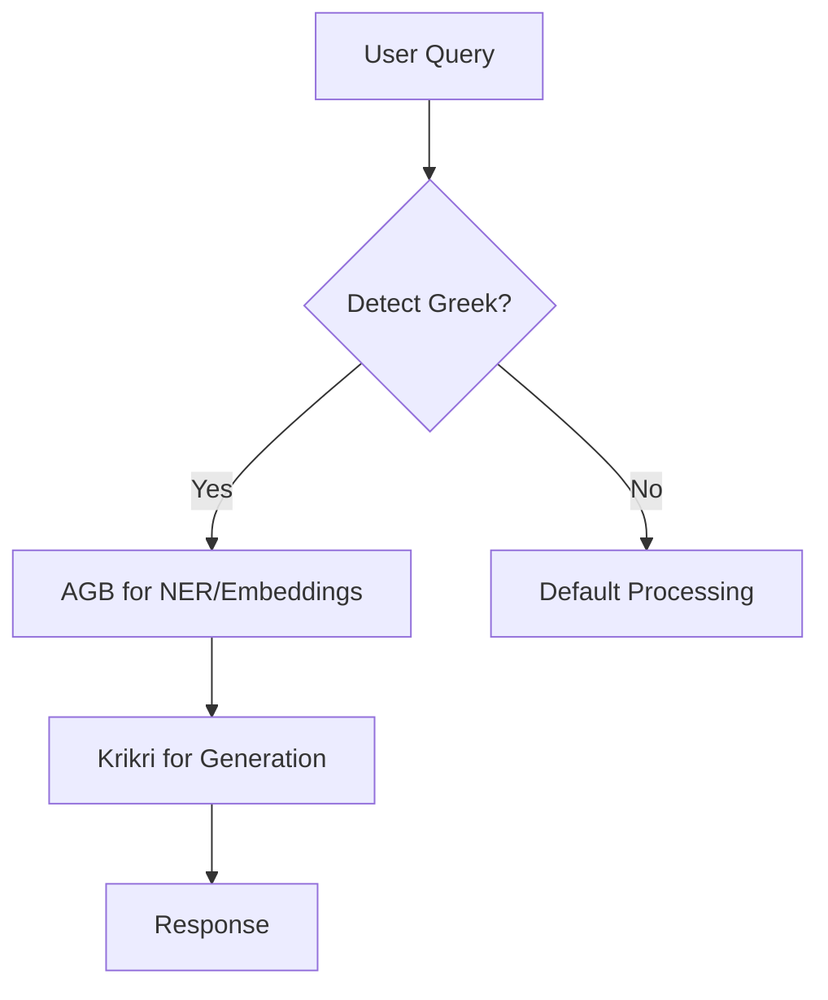

Here's how to create a **hybrid Greek processing pipeline** that automatically routes between Ancient-Greek-BERT (AGB) and Krikri based on content detection, combining their strengths for optimal performance:

---

### **1. Smart Routing System Architecture**


---

### **2. Implementation Steps**

#### **A. Language Detection Microservice**
Add to `docker-compose.yml`:
```yaml
services:
  greek-detector:
    image: python:3.9
    volumes:
      - ./language_detector:/app
    command: >
      sh -c "pip install fastapi uvicorn langdetect &&
      uvicorn app:app --host 0.0.0.0"
    ports:
      - "5001:5000"
```

Create `language_detector/app.py`:
```python
from fastapi import FastAPI
from langdetect import detect

app = FastAPI()

@app.post("/detect")
async def detect_language(text: str):
    try:
        return {"language": detect(text), "is_greek": "el" in detect(text)}
    except:
        return {"language": "en", "is_greek": False}
```

---

#### **B. Enhanced Processing Flow**
Update your LangFlow template with a **conditional router**:

```json
{
  "nodes": [
    {
      "id": "language-detector",
      "type": "HTTPRequest",
      "data": {
        "url": "http://greek-detector:5000/detect",
        "method": "POST",
        "body": {"text": "{{input}}"}
      }
    },
    {
      "id": "agb-processor",
      "type": "PythonFunction",
      "data": {
        "code": """
from transformers import pipeline
ner = pipeline("ner", model="/models/grc-ner-bert")
def process(text):
    return {
        "entities": ner(text),
        "normalized_text": text.replace("ϝ", "w")  # Normalize archaic letters
    }
        """
      },
      "conditions": {
        "input": "={{ $node['language-detector'].json['is_greek'] }}"
      }
    }
  ]
}
```

---

### **3. Optimized Greek Text Handling**
#### **When Greek is Detected:**
1. **AGB First Pass**:
   ```python
   # Entity extraction and text normalization
   entities = agb_ner(query)
   normalized_query = ancient_greek_normalizer(query)
   ```

2. **Enhanced Qdrant Search**:
   ```python
   results = qdrant.search(
       query=normalized_query,
       query_filter={
           "must": [
               {"key": "language", "match": {"value": "ancient_greek"}},
               {"key": "period", "match": {"value": entities.get("period", "")}}
           ]
       }
   )
   ```

3. **Krikri Generation**:
   ```python
   response = ollama.generate(
       model="krikri",
       prompt=f"""
       AGB Analysis:
       {entities}
       
       User Question:
       {query}
       
       Context:
       {results}
       """
   )
   ```

---

### **4. Automatic Model Selection**
#### **n8n Decision Node Logic**
```javascript
const isGreek = await $httpRequest({
  method: 'POST',
  url: 'http://greek-detector:5000/detect',
  body: { text: $input.all()[0].json.question }
});

if (isGreek.json.is_greek) {
  // Use AGB+Krikri pipeline
  return $httpRequest({
    method: 'POST',
    url: 'http://langflow:7860/api/v1/greek-analyze',
    body: { input: $input.all()[0].json.question }
  });
} else {
  // Default processing
  return $httpRequest({
    method: 'POST',
    url: 'http://langflow:7860/api/v1/standard-analyze',
    body: { input: $input.all()[0].json.question }
  });
}
```

---

### **5. Performance Optimization**
#### **Model Caching**
```python
# In your AGB service
from transformers import AutoModel
model = AutoModel.from_pretrained(
    "/models/grc-ner-bert",
    device_map="auto",
    torch_dtype="auto"
).eval()
```

#### **Memory Management**
```yaml
# docker-compose.yml
services:
  ollama:
    deploy:
      resources:
        limits:
          memory: 4G
  agb-service:
    deploy:
      resources:
        limits:
          memory: 2G
          cpus: '1'
```

---

### **Example Workflow**
1. **User asks**: "Explain ϝέργον in Hesiod's Works and Days"
2. **System detects**: Ancient Greek (ϝ character)
3. **AGB processes**:
   - Normalizes ϝ → w
   - Identifies "Works and Days" as text reference
4. **Krikri generates**:
   ```markdown
   The term "wergon" (ϝέργον) in Hesiod refers to... 
   AGB identified these key concepts:
   - Agricultural labor
   - Divine justice
   ```

---

### **Maintenance Commands**
| Task | Command |
|------|---------|
| Test Greek detection | `curl -X POST http://localhost:5001/detect -d '{"text":"μῆνιν ἄειδε θεά"}'` |
| Monitor AGB load | `docker stats $(docker ps -q --filter name=agb-service)` |
| Update models | `docker compose exec agb-service python -c "from huggingface_hub import snapshot_download; snapshot_download(repo_id='pranaydeeps/Ancient-Greek-BERT', local_dir='/models/grc-ner-bert')"` |

---

### **Key Advantages**
1. **Precision**: AGB handles entity recognition/normalization
2. **Context**: Krikri provides culturally-aware generation
3. **Efficiency**: Only heavyweight Krikri runs when Greek is detected, while AGB handles initial lightweight processing.

Would you like me to provide:
1. Sample normalization rules for archaic Greek?
2. Pre-built AGB+Krikri LangFlow template?
3. Performance benchmarks for this setup?
