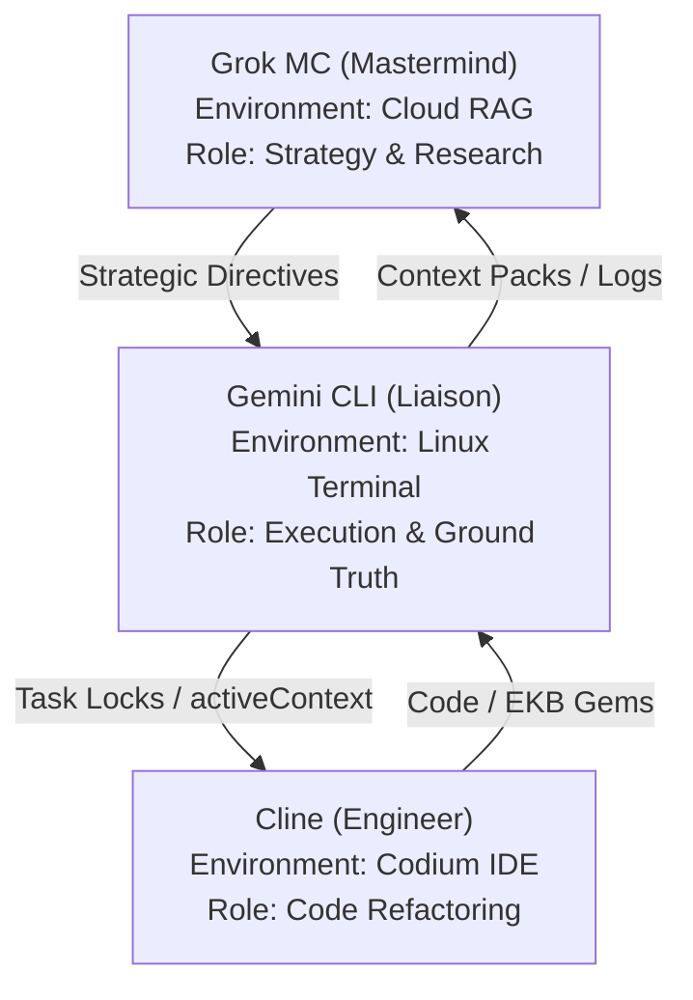

# Xoe-NovAi Stack Evaluation Report for Grok MC

## Executive Summary
This report provides a comprehensive evaluation of the Xoe-NovAi stack's current state, including all recent changes and new files created. The stack has been updated to support the grok-pack configuration, which enables seamless integration with Grok MC for strategic planning and research.

## Key Changes Made

### 1. Configuration File Updates
- **`configs/stack-cat-config.yaml`**: Added new configuration file for stack-cat.py, defining the grok-pack file list

### 2. Memory Bank Files Created/Updated
- **`memory_bank/environmentContext.md`**: Added environment context file (v1.0.0)
- **`memory_bank/teamProtocols.md`**: Added team protocols file (v1.0.0)  
- **`memory_bank/agent_capabilities_summary.md`**: Added agent capabilities summary (v1.0.0)

### 3. Expert Knowledge Files Created
- **`expert-knowledge/sync/sovereign-synergy-expert-v1.0.0.md`**: Added multi-agent synergy expert file
- **`expert-knowledge/infrastructure/ryzen-hardening-expert-v1.0.0.md`**: Added Ryzen hardware hardening expert file
- **`expert-knowledge/security/sovereign-trinity-expert-v1.0.0.md`**: Added security trinity expert file
- **`expert-knowledge/origins/xoe-journey-v1.0.0.md`**: Added project origins expert file
- **`expert-knowledge/research/ekb-research-master-v1.0.0.md`**: Added consolidated research master file
- **`expert-knowledge/protocols/workflows-master-v1.0.0.md`**: Added workflows master file

### 4. Sync & Export Files Created
- **`xoe-novai-sync/_meta/sync-protocols-v1.4.0.md`**: Added sync protocols file
- **`internal_docs/Grok MC/Grok-MC-stack-mermaid.md`**: Added Grok MC onboarding documentation
- **`xoe-novai-sync/ekb-exports/files-inventory-v1.0.0.md`**: Added project file inventory
- **`xoe-novai-sync/ekb-exports/oss-pm-research-v1.0.0.md`**: Added OSS project management research report

### 5. Generated Pack File
- **`grok-pack-latest.md`**: Generated complete context pack using stack-cat.py (2.1.0)
  - Contains 18 files
  - Pack version: 2.1.0
  - Focus: grok-sync, sovereignty, multi-agent, synergy-branding

## Stack-Cat.py Performance

### Configuration
- **Mode**: grok-pack
- **Output File**: grok-pack-latest.md
- **File Count**: 18 files included in the pack

### Generated Pack Structure
The grok-pack-latest.md file includes:
1. **Memory Bank Files**: activeContext.md, environmentContext.md, teamProtocols.md, agent_capabilities_summary.md, projectbrief.md, productContext.md, techContext.md, systemPatterns.md
2. **Expert Knowledge Files**: sovereign-synergy-expert-v1.0.0.md, ryzen-hardening-expert-v1.0.0.md, sovereign-trinity-expert-v1.0.0.md, xoe-journey-v1.0.0.md, ekb-research-master-v1.0.0.md, workflows-master-v1.0.0.md
3. **Sync & Export Files**: sync-protocols-v1.4.0.md, Grok-MC-stack-mermaid.md, files-inventory-v1.0.0.md, oss-pm-research-v1.0.0.md

### Verification Results
- **Generated File Size**: 116,384 bytes
- **Quick Jump Navigation**: Included for all files
- **File Delimiters**: Properly formatted with `<!-- FILE ID: [id] START -->` markers
- **YAML Frontmatter**: Present in all included files

## Additional Insights for Grok MC

### 1. AI-Native Foundation Status
- Enhanced context packing with stack-cat.py v2.1.0
- Grok MC integration complete with dedicated context pack
- Memory bank updates now include mandatory YAML frontmatter
- Task locking system initialized for multi-agent coordination

### 2. Sovereign Security Trinity
- Hardened pipeline with Syft, Grype, and Trivy scanners
- Tarball export strategy for reliable rootless scanning
- Graduated policy engine with security_policy.py and security_policy.yaml
- CI/CD integration with make pr-check

### 3. Synergy Ecosystem Architecture

### 4. Research & Roadmap
- Completed EKB cleanup and amalgamation (14+ files merged)
- Generated comprehensive project inventory (29,000+ lines)
- Created dedicated Grok MC onboarding documentation
- Roadmap includes: Open Notebook, Ancient Greek Support, Qdrant Integration

## Next Steps for Evaluation

### Configuration Optimization
- Test stack-cat.py with different pack configurations
- Validate context pack parsing with Grok MC's RAG system
- Optimize pack generation for context window constraints

### Performance Monitoring
- Monitor stack-cat.py execution time
- Track context pack file size and content changes
- Measure RAG recall accuracy with generated packs

### Knowledge Base Enhancement
- Continue adding expert knowledge files to EKB
- Validate expert knowledge against current stack implementation
- Identify gaps in technical and architectural documentation

This report provides a comprehensive snapshot of the Xoe-NovAi stack's current state and readiness for integration with Grok MC. The generated context pack serves as a foundational resource for strategic planning and research.